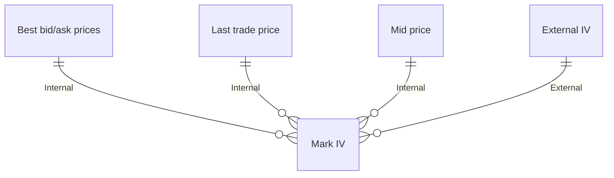

# Zero Fee Perps with Privacy

> Trade 250+ markets on a super exchange with zero-fees, better-than-CEX liquidity, and institutional-grade privacy, all built on a blazingly fast blockchain. The Paradex era is here. Powered by $DIME.

<embed class="w-full h-auto" src="file:cca07809-dca0-4026-847f-ccba87bfa093" type="image/png" />

<CardGroup cols={3}>
  <Card class="green-cards" title="Trade Any Asset" icon={}>
    Trade Futures, Options (Dated and Perpetual), Pre-markets and Spot
  </Card>

  <Card class="green-cards card-icon-w64" title="Zero Fee Perps" icon={}>
    Zero fees for retail traders (maker or taker) on 100+ Perpetual Futures markets
  </Card>

  <Card class="green-cards" title="Privacy" icon={}>
    Zk-encrypted accounts hide your positions, entries, exists, liquidation levels and PnL
  </Card>

  <Card class="purple-cards" title="Fastest Listings" icon={}>
    Trade new tokens before they list on major CEXs
  </Card>

  <Card class="purple-cards" title="Unified Margin" icon={}>
    Trade 250+ markets across Futures, Options (Dated and Perpetual) and Spot all in one account
  </Card>

  <Card class="purple-cards" title="Tokenized High Yield Vaults" icon={}>
    Earn passive income with automated, multi-asset, multi-strategy products
  </Card>
</CardGroup>

<div class="w-full flex justify-center items-center gap-2 pt-4">
  <Button href="https://app.paradex.trade" intent="primary" large rounded>
    Trade on Paradex
  </Button>

  <Button href="/getting-started/roadmap" intent="primary" large rounded outlined>
    Explore Roadmap
  </Button>
</div>


# Roadmap

<Tabs>
  <Tab title="2025 & Beyond">
    ### Upcoming

    <CardGroup cols={4}>
      <Card title="Liquidity" icon="layer-group">
        * RFQ Trading w/ [Paradigm](https://app.paradigm.trade/))
        * Midpoint Dark Orders for Whales
        * Fee Tiering
      </Card>

      <Card title="Platform" icon="chart-network">
        * Spot
        * Spot VTFs
        * Multiple Collateral Types
        * Auto-Borrow and Lend
        * XUSD (Yield Bearing, Censorship Resistant Internet Money)
        * Mobile 3.0
        * Pre-market Perps
        * Dated Options
      </Card>

      <Card title="Infra" icon="lighthouse">
        * Interop with Hyperlane
        * SuperChain Mainnet
      </Card>

      <Card title="Privacy" icon="signature-lock">
        * Full Position Privacy via RPC Masking
        * Full Smart Contract-Level Privacy with Cryptographic Guarantees
      </Card>
    </CardGroup>

    ### 2025 Q3

    <CardGroup cols={3}>
      <Card title="Jul 2025">
        **New Markets**

        * 10 new perpetual markets
        * PAXG Perpetual Options Launch

        **Performance & Infra**

        * [Interchain Deposits powered by Hyperlane (Beta)](/getting-started/whats-new/2025/7/18#interchain-deposits-powered-by-hyperlane-beta)
        * Portfolio Margin (Invite Only Beta)
        * Retail Order Tagging for Takers
        * Blocktrade / Positions Transfer API (Invite Only Beta)
        * [Bridge using Orbiter Finance](/getting-started/whats-new/2025/7/18#orbiter-finance-bridge)

        **UX**

        * Show Total UP\&L on Portfolio and Account Summary
        * Aggregate multiple fills on trade history
        * Estimated P\&L in TP/SL order builder
        * Calculate Size in TPSL
        * Volume on Mark Price chart
        * Withdraw Vault Tokens in USDC Terms
        * Search markets using alias terms
        * RPI Savings on Orderbook
        * Weekly and monthly chart timeframes
        * Display account USDC balance on deposit modal for all chains
        * Resizable charts on trade page
        * Deposit max USDC on deposit modal
        * Display usernames in Switch Account modal
      </Card>

      <Card title="Aug 2025">
        **New Markets**

        * 5 new perpetual markets

        **Performance & Infra**

        * Interchain Withdrawals powered by Hyperlane (Beta)
        * [Public Bug Bounty](https://immunefi.com/bug-bounty/paradex/information/)

        **UX**

        * Populate Bid / Mid / Ask values in limit close modal
        * Date tooltip on trade tape trade time
        * Sort by column headers in open orders, trade history and order history
        * Set USD order size as a configurable default
        * Adjust margin button for isolated margin position on mobile
        * Numeric keyboard for number inputs on iOS
        * Orderbook decimals now match selected tick size
      </Card>

      <Card title="Sep 2025">
        **Markets**

        * 20 new perpetual markets

        **Liquidity & Trading**

        * ZERO Fee Perps

        **Performance & Infra**

        * Revamped referral code infrastructure

        **UX**

        * Toggle notification settings based on type
        * Step-by-step wallet connection progress indicator
        * Size no longer changes when switching between buy/sell
        * Disable chart market symbol labels by default
        * Market dropdown sorting persists between page changes
        * Lifetime fee savings on Portfolio page
        * Show Vaults 24h returns
        * Share XP card
      </Card>
    </CardGroup>

    ### 2025 Q2

    <CardGroup cols={3}>
      <Card title="Jun 2025">
        **New Markets**

        * 6 new perpetual markets

        **Liquidity & Trading**

        * [Retail Price Improvement (RPI) Orders](/trading/rpi)

        **Performance & Infra**

        * Deposit from Solana

        **UX**

        * Mobile UI 2.0
        * Dollar-denominated TP/SL orders
        * Switch accounts from Portfolio Page
        * Drawing Utils on Trading View
      </Card>

      <Card title="May 2025">
        **New Markets**

        * 4 new perpetual markets
        * HYPE Perpetual Options launch

        **Performance & Infra**

        * 50-70% order latency reduction across P50, P95, P99

        **Liquidity & Trading**

        * Enhanced Funding PnL logic
        * Revamped Funding PnL Realization logic
        * Estimated Margin on Order Builder

        **UX**

        * Extended portfolio charts (90d/180d)
        * RhinoFi and Layerswap bridge flows integrated within UI
      </Card>

      <Card title="April 2025">
        **New Markets**

        * 5 new perpetual markets
        * BTC/ETH/SOL Perpetual Options launch

        **Liquidity & Trading**

        * Isolated Margin for Perp futures
        * Advanced TP/SL functionality
        * Option Greeks on order builder

        **UX**

        * CSV exports on Portfolio Page
        * Configurable slippage
        * Switch between Spot and Mark price for Order Values displayed on UI
      </Card>
    </CardGroup>

    ### 2025 Q1

    <CardGroup cols={3}>
      <Card title="March 2025">
        **New Markets**

        * 6 new perpetual markets

        **Liquidity & Trading**

        * Modify open orders price and size
        * Redesigned order builder

        **Performance & Infra**

        * Opened Paradex Chain [to external developers on Testnet](https://x.com/tradeparadex/status/1897968442780926336)
      </Card>

      <Card title="February 2025">
        **New Markets**

        * 8 new perpetual markets

        **Liquidity & Trading**

        * Configurable Max Leverage

        **UX**

        * Filtering Markets by Categories and Favorites
        * Trade History on TradingView Chart
      </Card>

      <Card title="January 2025">
        **New Markets**

        * 11 new perpetual markets
        * Private Beta Release of Perpetual Options

        **Liquidity & Trading**

        * Multi-strategy Vaults (Gigavault only)
        * Limit TPSL Orders

        **Performance**

        * Latency Improvements (5x throughput)

        **UX**

        * Social Logins with Privy
      </Card>
    </CardGroup>
  </Tab>

  <Tab title="2024 Achievements">
    <Frame caption="Paradex 2024 Journey">
      
    </Frame>

    ### 2024 Q4

    <CardGroup cols={3}>
      <Card title="December 2024">
        * Added 13 new perps (79 markets total)
        * Graceful Switching Between Multiple Wallets
        * Native Mobile App (Upgrade from PWA)
        * Connect Discord to User Accounts
        * Announced [\$DIME Genesis Event](https://x.com/ParadexFNDN/status/1869049912454738284)
      </Card>

      <Card title="November 2024">
        * Added 13 new perps (66 markets total)
        * Launched Gigavault LP - Our Liquidity Provider Vault with 50% APR
        * Allow users to add TPSL while submitting a Market or Limit Order
        * Introduced Vault Traded Funds (VTFs) managed by Verified Operators
      </Card>

      <Card title="October 2024">
        * Liquidator Vault (Insurance Fund) - Our First Protocol Vault!
        * Advanced Order Types - Take Profit/Stop Loss
        * Show off your ShizoPunks NFT as your Paradex profile pic ️
        * Added 4 new perps: \$BOME, \$POPCAT, \$PEOPLE, \$kFLOKI (50 markets total!)
        * Community Vaults has launched - anyone can now operate their own Vaults
        * Introduced ability to aggregate order book prices on different tick sizes
        * Leverage Slider now works for USD amounts
      </Card>
    </CardGroup>

    ### 2024 Q3

    <CardGroup cols={3}>
      <Card title="September 2024">
        * Historical Funding Rate Page
        * Launched Partial Liquidations - Stay in the game longer!
        * Added Estimated Liquidation Price to Order Builder
        * Reduced minimum order size to \$100
        * Rolled out \$AAVE Perp
      </Card>

      <Card title="August 2024">
        * Launched \$TRON Perp, delisted \$MATIC
        * Slick new UI/UX
        * Added TWAP Advanced Order Type for better execution
        * Customized TradingView indicators/preferences
        * CCXT Integration
      </Card>

      <Card title="July 2024">
        * Funding Rate Updates: Clamping & external rates for stability
        * Integrated Cross-Chain Bridges: Layerswap & Rhinofi
        * Native support for ArgentHQ and Braavos wallets
        * Transfer USDC between Paradex accounts instantly
        * Launched Mobile App
        * Launched Sub-accounts
        * Twitter integration and advanced profile features
        * Added Scaled Order Type
      </Card>
    </CardGroup>

    ### 2024 Q2

    <CardGroup cols={3}>
      <Card title="June 2024">
        * Launched 5 new perps (52 total)
        * Rolled out Guardian Key for multi-signature withdrawal
        * Show off your trades with our P\&L sharing card
      </Card>

      <Card title="May 2024">
        * Added 28 new perps, delisted \$FET
        * Launched Referral Program
        * Launched OI + TVL Points Program
        * Introduced Funding Rate Protections
      </Card>

      <Card title="April 2024">
        * Added 10 new perps
        * Reduced minimum order value for altcoins to \$200
      </Card>
    </CardGroup>

    ### 2024 Q1

    <CardGroup cols={3}>
      <Card title="March 2024">
        * Added 6 new perps
        * Increased leverage to 50x for majors
        * Reduced minimum order value to \$500
        * Added Order Size Slider for easy adjustments
        * Introduced Stop Limit/Market Orders
        * Launched Paradex Python SDK for developers
        * Migrated to ETH Blobs for data availability—reduced L1 gas costs by 10x!
      </Card>

      <Card title="February 2024">
        * Open Beta on Mainnet!
        * Launched Paradex Points Program
        * Added first altcoin: \$STRK hits the platform
      </Card>

      <Card title="January 2024">
        * First **\$200M** 24H trading volume day!
        * Surpassed **\$2BM** monthly trading volume
      </Card>
    </CardGroup>
  </Tab>
</Tabs>


# Bridges and On-Ramps

> Learn about all available bridging options to deposit and withdraw funds on Paradex

## Cross-Chain Deposits and Withdrawals

Paradex supports multiple bridging solutions to enable seamless deposits and withdrawals across a wide range of blockchains. Users can bridge assets from over 30 different chains.

## Overview

<CardGroup cols={2}>
  <Card title="Integrated Experience" icon="window">
    Fully integrated within the Paradex UI without leaving the platform
  </Card>

  <Card title="Multi-Chain Support" icon="chart-network">
    Bridge from 30+ chains across EVM, Solana, and Starknet
  </Card>
</CardGroup>

## Chain Support Matrix

| Chain       | Paradex Bridge | Hyperlane | Layerswap | Rhino.fi | Orbiter Finance |
| :---------- | :------------- | :-------- | :-------- | :------- | :-------------- |
| Arbitrum    | -              | ✅         | ✅         | ✅        | ✅               |
| Avalanche   | -              | ✅         | ✅         | ✅        | ✅               |
| Base        | -              | ✅         | ✅         | ✅        | ✅               |
| BSC/Binance | -              | -         | ✅         | ✅        | ✅               |
| Ethereum    | ✅              | ✅         | ✅         | ✅        | ✅               |
| Linea       | -              | -         | ✅         | ✅        | ✅               |
| Mantle      | -              | -         | ✅         | ✅        | -               |
| Optimism    | -              | -         | ✅         | ✅        | ✅               |
| Polygon     | -              | -         | ✅         | ✅        | ✅               |
| Scroll      | -              | -         | ✅         | ✅        | ✅               |
| Solana      | -              | ✅         | ✅         | ✅        | ✅               |
| Sonic       | -              | -         | ✅         | ✅        | ✅               |
| Starknet    | -              | ✅         | ✅         | ✅        | ✅               |
| zkSync Era  | -              | -         | ✅         | -        | ✅               |

## Deposit and Withdrawal Availability

<AccordionGroup>
  <Accordion title="Deposit Support">
    All bridge providers support deposits to Paradex from their respective supported chains. Users can deposit USDC from any supported network directly into their Paradex account.

    **Available on all bridges:**

    * Instant deposits after blockchain confirmation
    * USDC token support across all networks
    * Integrated experience within Paradex UI (except Orbiter Finance)
  </Accordion>

  <Accordion title="Withdrawal Support">
    Withdrawal support varies by bridge provider:

    | Bridge Provider | Withdrawal Status | Supported Chains     |
    | :-------------- | :---------------- | :------------------- |
    | Paradex Bridge  | ✅ Available       | Ethereum             |
    | Hyperlane       | ⏳ Coming Soon     | All supported chains |
    | Layerswap       | ✅ Available       | All supported chains |
    | Rhino.fi        | ✅ Available       | All supported chains |
    | Orbiter Finance | ✅ Available       | All supported chains |
  </Accordion>
</AccordionGroup>

## How to Use Bridges

<Steps>
  <Step title="Navigate to Deposit/Withdraw">
    Access the Deposit/Withdraw section in your Paradex account dashboard
  </Step>

  <Step title="Select Source Chain">
    Choose your source chain and desired bridge provider from the available options
  </Step>

  <Step title="Enter Amount">
    Specify the amount you wish to bridge and review the transaction details
  </Step>

  <Step title="Connect Wallet">
    Connect your wallet for the source chain to authorize the transaction
  </Step>

  <Step title="Confirm Transaction">
    Review and confirm the transaction, then wait for blockchain processing
  </Step>
</Steps>

## Security and Audits

<CardGroup cols={2}>
  <Card title="Audited Contracts" icon="shield-check">
    Paradex Bridge undergoes comprehensive security audits with public source code
  </Card>

  <Card title="Trusted Partners" icon="handshake">
    Integration only with battle-tested, reputable bridge providers
  </Card>
</CardGroup>

<Note title="Security Resources">
  For detailed audit information and security reports, visit our [Security, Audits & Pentests documentation](https://docs.paradex.trade/security/audit-pentests).
</Note>

## Integration Status

| Bridge Provider | Paradex UI Integration | Status      |
| :-------------- | :--------------------- | :---------- |
| Paradex Bridge  | ✅ Native               | Live        |
| Hyperlane       | ✅ Integrated           | Live        |
| Layerswap       | ✅ Integrated           | Live        |
| Rhino.fi        | ✅ Integrated           | Live        |
| Orbiter Finance | ⏳ External             | Coming Soon |

## Supported Bridge Providers

<AccordionGroup>
  <Accordion title="Paradex Bridge">
    The native bridging solution between Ethereum and Paradex Chain, powered by StarkGate.

    <CardGroup cols={3}>
      <Card title="Direct Integration" icon="link">
        Native Ethereum ↔ Paradex deposits and withdrawals
      </Card>

      <Card title="Starknet Infrastructure" icon="shield-check">
        Built on proven Starknet bridge technology
      </Card>

      <Card title="Audited Security" icon="lock">
        Comprehensive security audits and open source code
      </Card>
    </CardGroup>

    **Supported Chains:**

    * Ethereum (deposits and withdrawals)

    <Note title="Security First">
      The Paradex Bridge contracts have undergone comprehensive security audits to ensure the safety of user funds. For detailed audit reports and security information, visit our [Security, Audits & Pentests documentation](https://docs.paradex.trade/security/audit-pentests).
    </Note>

    **Technical Details:**

    * GitHub Repository: [tradeparadex/starkgate-contracts](https://github.com/tradeparadex/starkgate-contracts)
  </Accordion>

  <Accordion title="Hyperlane">
    Hyperlane enables interchain deposits from multiple networks with multi-VM support.

    <CardGroup cols={3}>
      <Card title="Multi-VM Support" icon="chart-network">
        EVM and SVM connectivity with Warp Routes technology
      </Card>

      <Card title="Secure Transfers" icon="shield">
        USDC locked on origin chain, equivalent amount released on Paradex
      </Card>

      <Card title="Rapid Expansion" icon="rocket">
        Easy addition of new chains through Hyperlane's 150+ chain network
      </Card>
    </CardGroup>

    **Supported Chains:**

    * **EVM Chains:** Ethereum, Arbitrum, Base
    * **SVM Chains:** Solana
    * **Other:** Starknet

    <Tip title="Hyperlane Deposits">
      Currently supports deposits only. Withdrawal functionality is coming soon for a complete interchain experience.
    </Tip>

    **Learn More:**

    * [Hyperlane Documentation](https://docs.hyperlane.xyz/)
  </Accordion>

  <Accordion title="Layerswap">
    A comprehensive bridging solution supporting the widest range of chains with both deposits and withdrawals.

    <CardGroup cols={3}>
      <Card title="Extensive Coverage" icon="globe">
        20+ supported networks across multiple ecosystems
      </Card>

      <Card title="High Limits" icon="coins">
        Up to 500,000 USDC deposits from Ethereum
      </Card>

      <Card title="Full Functionality" icon="arrows-rotate">
        Both deposits and withdrawals available
      </Card>
    </CardGroup>

    **Supported Chains:**

    * **Major EVM Networks:** Ethereum, Arbitrum, Avalanche, Base, Optimism, Polygon, BSC
    * **Layer 2s:** Linea, Mantle, Scroll, zkSync Era
    * **Alternative Networks:** Solana, Starknet
    * **Emerging Networks:** Sonic, Sophon, Manta, SEI

    > **Transaction Limits:**
    >
    > * Deposits: Up to 500,000 USDC (Ethereum), varies by chain
    > * Withdrawals: Up to 60,000 USDC for most chains

    **Learn More:**

    * [Layerswap Documentation](https://docs.layerswap.io/user-docs/)
  </Accordion>

  <Accordion title="Rhino.fi">
    A decentralized exchange and bridge aggregator supporting multiple ecosystems.

    <CardGroup cols={3}>
      <Card title="DEX + Bridge" icon="shuffle">
        Combined trading and bridging functionality
      </Card>

      <Card title="Multi-Ecosystem" icon="layer-group">
        Support for EVM and non-EVM chains
      </Card>

      <Card title="Competitive Fees" icon="dollar-sign">
        Optimized routing for cost-effective transfers
      </Card>
    </CardGroup>

    **Supported Chains:**

    * **EVM Networks:** Ethereum, Arbitrum, Avalanche, Base, Optimism, Polygon, BSC
    * **Layer 2s:** Linea, Mantle, Scroll, zkSync Era
    * **Alternative Networks:** Solana, Starknet
    * **Additional:** Sonic, Mode, Manta Pacific

    **Learn More:**

    * [Rhino.fi Documentation](https://docs.rhino.fi/)
  </Accordion>

  <Accordion title="Orbiter Finance">
    A decentralized bridge supporting the broadest range of chains across multiple ecosystems.

    <CardGroup cols={3}>
      <Card title="Maximum Coverage" icon="chart-network">
        30+ chains across different virtual machines
      </Card>

      <Card title="Cross-Ecosystem" icon="arrows-rotate">
        Transfers between various blockchain ecosystems
      </Card>

      <Card title="Coming Soon" icon="clock">
        Native Paradex UI integration in development
      </Card>
    </CardGroup>

    **Supported Chains:**

    * **Major Networks:** Ethereum, Arbitrum, Avalanche, Base, Optimism, Polygon
    * **Layer 2s:** zkSync Era, Scroll, Linea, Polygon zkEVM
    * **Alternative VMs:** Solana, Starknet, Sui, TON
    * **Emerging Networks:** Sonic, Sophon, Taiko, BOB, Core

    <Note title="External Integration">
      Currently requires users to visit the Orbiter Finance website. Native Paradex UI integration is coming soon.
    </Note>

    **Learn More:**

    * [Orbiter Finance Documentation](https://docs.orbiter.finance/)
  </Accordion>
</AccordionGroup>

## Future Developments

<CardGroup cols={2}>
  <Card title="Enhanced Withdrawals" icon="arrow-down">
    Hyperlane withdrawal support, fast withdrawals, and expanded native bridge capabilities coming soon
  </Card>

  <Card title="Network Expansion" icon="plus">
    Regular addition of new supported networks and improved UX across all providers
  </Card>
</CardGroup>

<Tip title="Roadmap Updates">
  Paradex continues to expand cross-chain connectivity with new integrations and enhanced functionality being added regularly. Stay updated through our official channels for the latest developments.
</Tip>

## Best Practices

<CardGroup cols={2}>
  <Card title="Large Amounts" icon="scale-balanced">
    For large withdrawals, consider using the Paradex Bridge for maximum security, though it requires 4-6 hours for completion
  </Card>

  <Card title="Fee Optimization" icon="dollar-sign">
    Bridge fees vary by provider and chain. Compare options before transferring - improved fee comparison UX coming soon
  </Card>
</CardGroup>

<Note title="Fee Considerations">
  Some bridges may have significantly higher fees than others depending on the source chain and current network conditions. We're working on improved UX to surface this information more clearly in the near future.
</Note>

## Fiat On-Ramps and CEX Integration

<CardGroup cols={2}>
  <Card title="Fiat On-Ramps" icon="credit-card">
    Direct fiat-to-Paradex deposits coming soon, enabling seamless onboarding with credit cards and bank transfers
  </Card>

  <Card title="CEX Deposits" icon="building-columns">
    Direct deposits from major centralized exchanges in development for instant trading access
  </Card>
</CardGroup>

## Technical Resources

<CardGroup cols={2}>
  <Card title="Paradex Resources" icon="code">
    * [Bridge Contracts](https://github.com/tradeparadex/starkgate-contracts)
    * [Documentation](https://github.com/tradeparadex/paradex-docs)
  </Card>

  <Card title="Partner Documentation" icon="book">
    * [Hyperlane Docs](https://docs.hyperlane.xyz/)
    * [Layerswap Docs](https://docs.layerswap.io/user-docs/)
    * [Rhino.fi Docs](https://docs.rhino.fi/)
    * [Orbiter Finance Docs](https://docs.orbiter.finance/)
  </Card>
</CardGroup>

***

*For technical support or questions about bridging, please contact our support team or visit our Discord community.*


# Official Links for Paradex

<Error>
  **IMPORTANT SECURITY NOTICE**

  Always verify URLs before clicking or sending any funds! Scammers often create fake websites and social media accounts impersonating Paradex.

  **Official Domains:**

  * Main website: [paradex.trade](https://paradex.trade)
  * Documentation: [docs.paradex.trade](https://docs.paradex.trade)
  * GitHub: [github.com/tradeparadex](https://github.com/tradeparadex)

  If you're unsure about a link's authenticity, please:

  1. Compare it with the links listed below
  2. Reach out through our official community channels
  3. NEVER share your private keys or seed phrases
</Error>

## <Icon icon="fa-solid fa-globe" /> Platform Links

| Resource                                       | URL                                                                          |
| ---------------------------------------------- | ---------------------------------------------------------------------------- |
| Paradex UI - Main trading platform             | [https://app.paradex.trade/](https://app.paradex.trade/)                     |
| Paradex Mobile App - Mobile trading experience | [https://www.paradex.trade/mobile-app](https://www.paradex.trade/mobile-app) |
| Paradex Vaults - Secure asset management       | [https://app.paradex.trade/vaults](https://app.paradex.trade/vaults)         |
| Paradex XP - Rewards program                   | [https://app.paradex.trade/xp](https://app.paradex.trade/xp)                 |

## <Icon icon="fa-solid fa-code-branch" /> Code Repositories

| Resource           | URL                                                                                          |
| ------------------ | -------------------------------------------------------------------------------------------- |
| GitHub             | [https://github.com/tradeparadex](https://github.com/tradeparadex)                           |
| Paradex CLI        | [https://github.com/tradeparadex/paradex-cli](https://github.com/tradeparadex/paradex-cli)   |
| Paradex Python SDK | [https://github.com/tradeparadex/paradex-py](https://github.com/tradeparadex/paradex-py)     |
| Code Samples       | [https://github.com/tradeparadex/code-samples](https://github.com/tradeparadex/code-samples) |

## <Icon icon="fa-solid fa-code" /> Developer Resources

| Resource       | URL                                                                        |
| -------------- | -------------------------------------------------------------------------- |
| Documentation  | [https://docs.paradex.trade](https://docs.paradex.trade)                   |
| Block Explorer | [https://voyager.prod.paradex.trade/](https://voyager.prod.paradex.trade/) |

## <Icon icon="fa-solid fa-users" /> Community & Social

| Resource                     | URL                                                      |
| ---------------------------- | -------------------------------------------------------- |
| Discord - Official community | [https://discord.gg/paradex](https://discord.gg/paradex) |
| Telegram - Announcements     | [https://t.me/paradex](https://t.me/paradex)             |
| Twitter                      | [https://x.com/tradeparadex](https://x.com/tradeparadex) |

## <Icon icon="fa-solid fa-file-lines" /> Resources

| Resource  | URL                                                                        |
| --------- | -------------------------------------------------------------------------- |
| Media Kit | [https://www.paradex.trade/media-kit](https://www.paradex.trade/media-kit) |


# Architecture overview

> A high-level overview of how Paradex works

<Frame>
  
</Frame>


# Starknet First Appchain

> Starknet is a zero-knowledge proof roll-up chain that posts proofs of state changes in L2 that an L1 contract verifies is indeed a valid state change as per the business logic in L2.

Starkware, the team behind StarkEx, are close strategic and technology partners of the project. You can learn more about the following topics:

* [StarkWare](https://starkware.co/)
* [Starknet](https://www.starknet.io/)
* [Rollups](https://www.coinbase.com/en-gb/learn/wallet/what-are-rollups-in-crypto)
* [ZK-Rollups](https://ethereum.org/en/developers/docs/scaling/zk-rollups/)
* [STARKs, SNARKs and Validity Proofs](https://consensys.io/blog/zero-knowledge-proofs-starks-vs-snarks)
* [Fractal Scaling - App-chains in Rollups](https://ethresear.ch/t/fractal-scaling-on-ethereum-layer-3-rollups/19022)


# Chain Information

> How to find out information on the Paradex Chain

Paradex shows up-to-date chain information at [https://app.paradex.trade/status](https://app.paradex.trade/status) like the following:

<Frame caption="*Note that this may not be the current information! Please go to the status linked above to see current information">
  
</Frame>

You can also check out sites like [L2Beat](https://l2beat.com/scaling/projects/paradex) to see more information on our chain, smart contracts, locked volume, etc.

## Chain Decimals

1. **Decimal Precision**: In Starknet's Cairo language, we can't use decimal numbers directly. Instead, we use a fixed precision of 8 decimal places. This means we multiply all numbers by (`10^8`) to turn them into whole numbers.
2. **Example**: Say the price of something, like `ETH-USD-PERP`, is `$3,309.33`. To put this on the blockchain, we multiply it by (`10^8`) to get (`330,933,000,000`). This way, we can work with whole numbers instead of decimals.
3. **Order Signature Generation**: When we create signatures for orders, we use these converted whole numbers. It ensures that all calculations on the blockchain are accurate and consistent.
4. **User Interface and Libraries**: Most of the time, our code takes care of these conversions for you. But if you're writing code, you need to remember to convert your numbers to the right precision for generating correct order signatures. This does **not** apply to any API values.

This approach helps keep things simple and consistent across different parts of the blockchain system, making sure everyone's on the same page when it comes to handling fractional values.


# Server Location

### API Server Location <a href="#api-server-location" id="api-server-location" />

Our API server is located in the AWS AP-NORTHEAST-1 region (Tokyo).

There should be no reason to favor using a single Availability Zone (AZ) in your implementation since any AZ in ap-northeast-1 should be able to connect to Paradex.  Should you need to specify a single AZ, you can safely use apne1-az1 as it has been declared Paradex's primary AZ.

#### Clock Synchronization

The best way to synchronize your clock with our servers is via the Amazon time service.


# Global IP Addresses

Paradex API leverages AWS Global Accelerator to route traffic to our infrastructure in Tokyo. It provides us with static IP addresses that are geographically distributed across the AWS global network.

These IP addresses may appear to be located in the US by some DNS lookup tools due to AWS being a US-based company. However, the actual path your traffic takes prioritizes the closest AWS edge location, ensuring efficient routing to our Tokyo infrastructure. This minimizes latency and delivers a smooth user experience regardless of your geographical location.

For a more in-depth explanation, check out the [AWS Global Accelerator docs](https://aws.amazon.com/global-accelerator/features/).


# August 1, 2025

## Volume on Mark Price Chart


Volume data is now available on both mark price and last price charts.
You can now switch between mark price and last price views while maintaining full volume visibility for comprehensive chart analysis.

Thanks to [@c45p4r](https://discord.com/channels/1107916848193863740/1263859118318420031/1397270090445230265) for suggesting this improvement.

## Deposit Max USDC


Click "Max" to auto-fill your entire USDC balance instead of typing amounts, reducing the time it takes to get back to trading.
USDC balances for accounts on all chains are now visible in the deposit modal. This was previously limited to the Ethereum network.

Thanks to [@manifestryker](https://discord.com/channels/1107916848193863740/1263859118318420031/1395711695925805077) for suggesting this improvement.

## Bid/Ask/Mid buttons for closing limit order modal


Added Bid, Ask, and Mid buttons to the close limit order modal.
Click any button to auto-fill the price field with current market data.

Thanks to [@imridam](https://discord.com/channels/1107916848193863740/1263859118318420031/1398927806989336636) for suggesting this improvement.

## Bug fixes & improvements

* Searchable market alias (Gold for PAXG Options)
* Fixed order size slider calculations
* RPI savings calculation now adjusts for aggregated RPI pricees


# July 25, 2025

## Portfolio Margin (Invite Only Beta)


We've launched Portfolio Margin in invite-only beta, a sophisticated risk management system that evaluates your entire portfolio holistically rather than each position independently.
By recognizing correlations and hedged positions, it typically reduces margin requirements while providing a more accurate reflection of your portfolio's true risk profile.
This feature is ideal for active traders, options strategists, and sophisticated users seeking improved capital efficiency.

## PAXG Perp Options


We've added PAXG (Pax Gold) perpetual options to our platform, expanding beyond our existing BTC, ETH, SOL, and HYPE markets.
As our first lower volatility perpetual options market, PAXG opens up new strategic opportunities for traders looking to explore options
strategies in a more stable underlying asset tied to gold prices. This addition provides diversification for options traders seeking exposure beyond high-volatility crypto assets.

## RPI Savings on Orderbook


We've added a Retail Price Improvement (RPI) savings popup to the orderbook that displays estimated slippage and RPI savings when you hover over orders,
allowing you to quantify the price improvement you receive when trading on Paradex.

## Bug fixes & improvements

* Mobile Markets Menu now includes sortable Open Interest, 24h Volume, and Funding Rate data for easier market assessment
* TWAP orders now have access to RPI liquidity ([@stochasticfranklin](https://discord.com/channels/1107916848193863740/1263859118318420031/1395621485217054760))
* Fixed bug where TPSL market order fails when set too close to liquidation price


# July 18, 2025

## Interchain Deposits powered by Hyperlane (Beta)


USDC deposits are now supported from Solana, Ethereum, Arbitrum, Base, and Starknet through Hyperlane's permissionless interoperability protocol.
This initial release focuses on deposits with a \$250,000 liquidity cap during the testing phase.
Withdrawal support and additional networks will be added following successful testing,
with Paradex Vault tokens also being upgraded for full multi-chain compatibility in the coming weeks.

## Bridge using Orbiter Finance


Added Orbiter Bridge support for deposits and withdrawals across 17 blockchain networks.
This provides an additional bridging option alongside existing methods (Paradex Bridge, Layerswap, RhinoFi, and Hyperlane)
for transferring funds to and from the platform.

## Estimated P\&L in TP/SL order builder


Estimated profit/loss amounts in dollars now display directly within the Take Profit/Stop Loss section of the order builder's basic view.
This information was previously available elsewhere but is now shown inline to reduce navigation and provide immediate P\&L visibility
when setting TP/SL levels.

Thanks to [@c45p4r](https://discord.com/channels/1107916848193863740/1263859118318420031/1391806445602865343) for suggesting this improvement.

## Bug fixes & improvements

* View positions from Trade Summary page without navigating to separate screen (mobile)
* Apply default max slippage per market when user hasn't configured custom slippage settings


# July 11, 2025

## Calculate Size in TPSL


You can now specify your desired risk amount in dollars when setting TPSL orders,
and the system will automatically calculate the appropriate position size.
This eliminates the need to manually calculate position sizing or use external tools to determine how much you'll risk on each trade.

Thanks to [@warren\_muppets](https://x.com/warren_muppets/status/1937533397418803578) for suggesting this improvement.

## Display usernames in Switch Account modal


Account usernames now display in the Switch Account modal (alongside wallet addresses) and main account menu (top-right corner).
This makes it easier to identify and switch between different accounts and sub-accounts without relying solely on wallet addresses for identification.

Thanks to [@therealzerve](https://discord.com/channels/1107916848193863740/1263859118318420031/1391128789202763828) for suggesting this improvement.

## Portfolio and Account Summary now show Total UP\&L


Portfolio and Account Summary previously displayed only account balance and unrealized trading P\&L,
excluding unrealized funding which is critical for portfolio assessment and order planning.
These sections now show Total Unrealized P\&L, combining both unrealized trading P\&L and unrealized funding for complete portfolio visibility.

Thanks to [@addr1kajjuw8l6p3ndl](https://discord.com/channels/1107916848193863740/1263859118318420031/1391656078940573716) for suggesting this improvement.

## Withdraw vault tokens in USDC terms


Vault withdrawals now allow you to specify the target amount in USDC rather than vault tokens (vTokens).
This eliminates the need to manually calculate vToken amounts and makes withdrawals more intuitive,
though the final USDC amount may vary slightly due to slippage.

Thanks to [@vukt97](https://discord.com/channels/1107916848193863740/1263859118318420031/1391057755581841558) for suggesting this improvement.

## Bug fixes & improvements

* Added chart resizing by dragging the bottom border up/down
* Aggregated RPI orders in order book UI
* Fixed External EWMA utilization in Mark Price calculation


# July 4, 2025

## Aggregate multiple fills on trade history


Track your trades more easily with our new fill aggregation feature.
When a single order results in multiple partial fills, you can now view them as one consolidated entry instead of cluttered individual fills.

Toggle between detailed and consolidated views using the "Aggregate" option in your Trade History tab and TradingView chart.

Thanks to [@vladkens](https://discord.com/channels/1107916848193863740/1263859118318420031/1387885711482425586) for suggesting this improvement.

## Resizable charts on trade page


Manage more positions without scrolling by resizing your charts.
You can now drag the chart/order book section to reduce chart height and create more screen space for your position management.
Simply drag the divider between sections to adjust the layout to your preference.

Thanks to [@vladkens](https://discord.com/channels/1107916848193863740/1263859118318420031/1387885711482425586) for suggesting this improvement.

## Weekly and monthly chart timeframes


Perform technical analysis more efficiently with new 1W and 1M quick filters added to TradingView charts.

Thanks to [@theLKstyles](https://x.com/theLKstyles/status/1940062549405573553) for suggesting this improvement.

## Bug fixes & improvements

* Increased spread precision to 3 digits
* Added Greeks and Contract Detail tabs to mobile app
* Improved WalletConnect connection recovery after failed connection
* Fixed bug preventing Privy authenticated accounts from depositing


# Paradex XP - 4,000,000 XP Per Week

**Season 2 is LIVE!** Earn your share of 4,000,000 XP distributed weekly every Friday.

Experience Points (XP) are Paradex's universal reward system. Every contribution to the platform earns XP, from trading to providing liquidity to community engagement.

## How to Earn XP

Meaningful user interaction with Paradex earns you XP:

* Trade and maintain open positions
* Provide tight two sided liquidy (see [Quote Quality](./quote-quality))
* Provide collateral to Paradex Vaults (protocol, vtf, community)
* Stay active through trading, referrals, research, and community engagement on X and Discord

<sub>
  \* Linking your social media accounts (e.g., X and Discord) helps us better distinguish legitimate users from Sybils. 
</sub>

## Season 2 Details

* **Duration:** January 3, 2025 - TBD
* **Weekly XP Pool:** 4,000,000 XP
* **Distribution:** Every Friday
* **Extension:** Up to 6 months to optimize conditions for \$DIME token listing

<sub>
  \* Affiliate bonus XP is incremental to the base weekly XP distributed to Paradex users. See the 

  [Referrals page](./referral-program)

   for additional details 
</sub>

<sub>
  \* Quote Quality XP is a component of the base 4M weekly XP. See the 

  [Quote Quality page](./quote-quality)

   page for additional details 
</sub>

### Season 2 Extension

At the end of July 2025, the Paradex Foundation decided to extend Season 2 by up to six (6) months to ensure optimal conditions for the \$DIME token listing.  The Foundation views the 6 month timeline as deliberately conservative and will accelerate listing earlier if growth and traction accelerate sooner. This extension enables the launch of spot trading, dated options, pre-markets, yield bearing synthetic dollars (XUSD).

## Previous Seasons

Pre Season (Beta) and Season 1 ran from February 1, 2024 to January 2, 2025. \~100M XP was distributed in Pres Season and Season 1. See the Paradex Foundation Blog ["(Introducing DIME: the Native Token of the Paradex Network")](https://www.paradex.foundation/blog/introducing-dime-the-native-token-of-the-paradex-network) for additional details.


# Quote Quality Score

> Quote Quality measures how valuable a liquidity provider's (LP) orders are to the market. It rewards LPs who place orders close to the current market price and provide liquidity on both bid and ask sides.

## XP Distribution (225,000 / week)

For the purposes of weekly XP distribution, we sum quote quality by user by market over the week and divide by total number of samples (\~ every 1 minute). This gives us a single average quote quality metric we use for determining a users share of total exchange quote quality.

*Note: Quote Quality XP is as subset of the base 4,000,000 weekly XP distribution.*

### XP Distribution

* **75,000 (33%) - Tier 1 Perps**
* **150,000 (67%) - Tier 2 Perps**

<Tip>
  Distribution subject to change and will be announced weekly along with XP
</Tip>

### The Process

1. **Sample Collection:** Quote Quality samples collected throughout the week
2. **Weekly Average:** Sum all samples ÷ number of samples = your average Quote Quality
3. **Market Share:** Your average ÷ total of all users' averages = your share %
4. **XP Distribution:** Your share % × weekly XP pool = your XP earned

### Key Points

* **Consistency matters**: Need to provide liquidity throughout the week, not just peak times
* **Quality beats quantity**: Tight spreads earn more than large but wide orders
* **Tier separation**: Each instrument tier has its own XP pool
* **Relative competition**: Your rewards depend on your performance vs. other LPs

<Tip>
  Bottom line: Weekly XP = Your sustained liquidity quality as a % of total market quality.
</Tip>

## Key Concepts

| Term                 | Definition                                                                                                                                    |
| -------------------- | --------------------------------------------------------------------------------------------------------------------------------------------- |
| Quote Quality        | USD value that tracks the overall quality of an LP's liquidity provision over time using an exponential moving average of sample measurements |
| Sample Quote Quality | A snapshot measurement taken every few seconds that evaluates current order quality                                                           |
| Order Depth          | How far an order's price is from the reference price (max(TOB, mid) for bids, min(TOB, mid) for asks), measured in basis points (bps).        |
| Scaling factor       | A penalty system that reduces the value of orders placed farther from the reference price                                                     |

## Quote Quality Calculation

<Steps>
  <Step title="Measure Order Distance from Market">
    For each order, we calculate how far its price is from the current reference price:

    $$
    \text{Bid Order Depth}=\frac{(\max(\text{TOB}, \text{mid}) - \text{Bid Order Price})}{\max(\text{TOB}, \text{mid})}*10,000
    $$

    $$
    \text{Ask Order Depth}=\frac{(\text{Ask Order Price} - \min(\text{TOB}, \text{mid}))}{\min(\text{TOB}, \text{mid})}*10,000
    $$

    Where:

    * **TOB** = Top-of-book price (best bid for bids, best ask for asks)
    * **mid** = Mid-market price (average of best bid and best ask)
  </Step>

  <Step title="Apply Distance Penalty">
    Orders farther from the reference price receive exponentially less weight. Each order's adjusted value is calculated as:

    $$
    \text{Adjusted Order Size}=\text{Order Size}~*~\exp\big(-\text{Scaling Factor}~*~\text{Order Depth}\big)
    $$

    The scaling factors are instrument-specific and designed so orders at maximum spread receive only 1% weight. Orders beyond the Max Spread are completely excluded from calculations.

    | **Term**                                   | **Tier 1 Perps**    | **Tier 2 Perps** | **Perp Options** |
    | ------------------------------------------ | ------------------- | ---------------- | ---------------- |
    | Instruments                                | BTC, ETH, SOL Perps | All other Perps  | All Perp Options |
    | Max Spread <br />(Distance from Reference) | 5 bps               | 15 bps           | 15 bps           |
    | Weight at Max Spread                       | 1.00%               | 1.00%            | 1.00%            |
    | Scaling Factor                             | \~0.92              | \~0.31           | \~0.31           |

    <Frame caption="Quote scaling functions are set by instrument and tier = Tier 1 Perps, Tier 2 Perps, Perp Options.">
      
    </Frame>

    $$
    \text{Scaling Factor} = -\frac{\ln(\text{Weight at Max Spread})}{\text{Max Spread}}
    $$
  </Step>

  <Step title="Sum Adjusted Orders by Side">
    We then sum all adjusted orders by side:

    $$
    \begin{cases}
    \text{Sample Bid Quality} = \sum_{\text{Buy orders } b_i} \text{Adj. Bid Order Size}(b_i) \\
    \text{Sample Ask Quality} = \sum_{\text{Sell orders } s_i} \text{Adj. Ask Order Size}(s_i)
    \end{cases}
    $$
  </Step>

  <Step title="Calculate Sample Quote Quality">
    The system heavily rewards two-sided market making by putting a 70% weight on the minimum of bid and ask sample quality:

    $$
    \begin{equation*}
    \begin{cases}
    \text{Sample Quote Quality} = \\
    70\% \times \min(\text{Sample Bid Quality}, \text{Sample Ask Quality})  +  \\
    30\% \times \max(\text{Sample Bid Quality}, \text{Sample Ask Quality})
    \end{cases}
    \end{equation*}
    $$

    **Why 70% weight on minimum?** <br />
    This incentivizes providing liquidity on both sides rather than just one side of the market.
  </Step>

  <Step title="Calculate Moving Average">
    The final Quote Quality smooths out short-term fluctuations using a 20% weight on new measurements:

    $\text{Quote Quality}(t_{i+1})=20\%*\text{Sample Quote Quality}(t_{i+1})+80\%*\text{Quote Quality}(t_{i})$
  </Step>
</Steps>


# Affiliate & Referrals

# Affiliate & Referrals

## Overview

Paradex offers two ways to earn: our standard Referral Program for all users, and the Token-Aligned Program (TAP) for affiliates.

## Referral Program

* Referrer's earn <span>**10% of your referees' XP**</span>
* Referees get <span>**5% XP bonus**</span> on their trading activity

<small>
  *NOTE: Must refer at least \$10k+ in volume to qualify. Self referrals will not be eligible for XP based commissions.*
</small>

## Affiliate Program - Token-Aligned Affiliate Program (TAP)

* Affiliates earn a pro-rata share of <span>**1.0% of the \$DIME token supply**</span> via TAP Points (see below)
* Affiliates earn <span>**10% of your referees' XP**</span>
* Referees get <span>**5% XP bonus**</span> on their trading activity

### How TAP points work:

* <span>**1M TAP Points**</span>  distributed to all TAP Affiliates every 2 weeks based on referred users, volume, open interest, and TVL
* Affiliates also earn a <span>**10% commission on sub-affiliates TAP points**</span> (restricted to 1 level)
* Affiliates can choose to distribute 100% of their TAP points and their user's XP back to their community. Please fill out the form below to let us know what % you want to share back.

| Metric           | Description                                         |
| ---------------- | --------------------------------------------------- |
| **Reward Pool**  | 1.0% of fully diluted token supply                  |
| **Duration**     | \~6 months (Oct 8, 2025 - Apr 21, 2026)             |
| **Distribution** | 3-month lockup following program end (Jul 21, 2026) |

### How to apply:

Complete the [TAP Application Form](https://forms.gle/A6raA1inXn7GkqFh7):

* 5,000+ social media followers/subscribers
* Active trading or alpha groups
* Unique ability to drive Paradex growth

<small>
  *NOTE: TAP Affiliates earn from the standard Referral Program AND TAP*
</small>

***


# Retail Price Improvement

> Better pricing for retail traders with selective order visibility

## Overview

Retail Price Improvement (RPI) is a specialized order type that provides better pricing and execution opportunities for retail traders while protecting market makers from toxic flow. It achieves this through selective order visibility - orders are visible in the UI but hidden from API access.

### How RPI Works

<CardGroup cols={2}>
  <Card title="Visible on UI" icon="eye">
    Enabling retail users to access improved pricing and better execution opportunities
  </Card>

  <Card title="Hidden from API" icon="eye-slash">
    Protecting market makers from potentially harmful trading patterns
  </Card>
</CardGroup>

## Trader Profiles

Paradex offers two trading profiles to cater to different user needs: Standard and Retail.
Activating the Retail profile is opt-in and eligibility is determined through authentication and activity checks.

### Retail Profile (Opt-in) - Default for UI Traders

Suitable for retail traders seeking price improvement.

<Card title="Faster Fills for Retail Traders">
  To improve trade execution speed for retail users, API traders now receive a **75% fee discount** when they match with passive orders from a Retail Profile. This incentive is designed to get your passive orders filled faster. No action is required on your part.
</Card>

* **Order Submission Speed Bump:** `500ms`
* **Order Cancel Speed Bump:** `300ms`
* **Activity Thresholds**: If exceeded, orders will lose access to RPI liquidity.
  * `5` orders / second
  * `10` orders / minute
  * `60` orders / hour
  * `750` orders / 24 hours

To obtain retail token pass `?token_usage=interactive` to `/v1/auth` endpoint.

### Standard Profile - Default for API Traders

All orders submitted without retail JWT token are classed as Standard Profile.

<Note>
  Both Retail and Standard profile order management are subject to [Global Account Rate Limits](/api/general-information/rate-limits/api)
</Note>

## Matching Rules

RPI orders follow specific matching rules to ensure fair and efficient trading:

1. **Retail-Only Matching**: RPI orders will only match with orders placed by non-algorithmic users and do not execute against orders submitted via API.

2. **Post-Only Requirement**: All RPI orders must be [Post-Only](/trading/placing-orders/order-instructions#post-only), meaning they will only provide liquidity and never take liquidity.

3. **Execution Priority**: RPI orders have the lowest execution priority, regardless of when they're placed. They will only be filled after all non-RPI orders at the same price level have been executed.

## Order Behavior and Visibility

1. **Order Persistence**: Accepted and resting RPI orders remain active until cancelled by the user, even if they are no longer at the best bid or offer (BBO).

2. **Cross Book Behavior**: The orderbook visible in the UI may appear crossed due to RPI orders that are not matching with API orders. The crossed section of the book is visible and highlighted in the UI. However, the API orderbook remains uncrossed as it does not contain any RPI orders.

## Limitations and Restrictions

* Orders must be placed through the API interface
* RPI orders cannot be placed in combination with other special order types
* Minimum order size requirements may apply

## Placing an RPI Order

<Steps>
  <Step title="Use the New Order endpoint">
    Make a request to the [New Order](https://docs.paradex.trade/api-reference/prod/orders/new) endpoint
  </Step>

  <Step title="Set RPI instruction">
    Set `instruction="RPI"` in your order parameters
  </Step>
</Steps>


# Trading Fees

# Paradex Trading Fees

Paradex offers different fee structures based on your trading profile and instrument type. UI traders enjoy completely free futures trading, while API traders have access to standard rates and specialized liquidity provision options.

## Perpetual Futures

| Profile Type       | Description                                           | Maker Fee     | Taker Fee     | Settlement Fee\* |
| ------------------ | ----------------------------------------------------- | ------------- | ------------- | ---------------- |
| **Retail Profile** | (Opt-in) - Default for UI Traders                     | **FREE (0%)** | **FREE (0%)** | 0.015%           |
| **API - Standard** | Default for API Traders                               | 0.003%        | 0.02%         | 0.015%           |
| **API - RPI**      | Opt in for orders that only match with Retail Profile | 0.003%        | N/A\*         | 0.015%           |

## Perpetual Options

| Profile Type       | Description                                           | Maker Fee       | Taker Fee | Settlement Fee\* |
| ------------------ | ----------------------------------------------------- | --------------- | --------- | ---------------- |
| **Retail Profile** | (Opt-in) - Default for UI Traders                     | -0.01% (rebate) | 0.03%     | 0.01% (25% cap)  |
| **API - Standard** | Default for API Traders                               | -0.01% (rebate) | 0.03%     | 0.01% (25% cap)  |
| **API - RPI**      | Opt in for orders that only match with Retail Profile | -0.01% (rebate) | 0.03%     | 0.01% (25% cap)  |

<Note>
  Settlement fees occur when a market is delisted and Paradex needs to wind down residual open positions.
</Note>

<Note>
  API Takers that match with a Retail Profile will receive a 75% discount on the trading fee.
  This is designed to improve the retail experience by getting their orders filled quickly, while still allowing them to trade passively.
</Note>

***

## Key Notes:

* **Retail Profile**: Default for UI traders - completely FREE perpetual futures trading
* **API - Standard**: Default for API traders - standard fee structure
* **API - RPI**: Special liquidity provision orders that match only with Retail Profile traders
* **Fee Calculation**: Based on notional value, not margin used


# Introduction to Perpetual Options

# What are Perpetual Options?

Perpetual Options are a novel new crypto derivative instrument that combines the risk-reward profile of options (protected downside with unlimited upside) with the simplicity of perpetual futures.

Perpetual options are:

<CardGroup cols={3}>
  <Card title="Options that never expire" icon="fa-solid fa-infinity">
    <p class="text-sm">
      Unlike traditional options that have a fixed expiration date, Perpetual Options can be held indefinitely, reducing expiry timing risk
    </p>
  </Card>

  <Card title="Continuously funded instruments" icon="fa-solid fa-money-bill-transfer">
    <p class="text-sm">
      Instead of paying a large premium upfront, traders pay (or receive) a continuous funding rate based on market conditions to hold a position
    </p>
  </Card>

  <Card title="Simplified derivatives" icon="fa-solid fa-chart-simple">
    <p class="text-sm">
      They follow the same straightforward PnL structure as perpetual futures (entry price, exit price, funding)
    </p>
  </Card>
</CardGroup>

<Tip title="Core Idea" icon="leaf">
  Perpetual Options fit naturally within the derivative framework crypto traders
  know and love (perpetuals) while offering a new way to access leverage without
  taking price-based liquidation risk.
</Tip>

# Why Trade Perpetual Options?

Perpetual options blend the upside of leverage with built‑in downside protection—so you can stay in a trade, without the constant threat of getting liquidated (by price).

In perp options, the extra funding also covers downside protection, so price swings are less deadly. In perp futures, funding simply pays for leverage.

<Frame caption="Perpetual Futures vs Perpetual Options" background="subtle">
  
</Frame>

# Detailed Comparisons

<Tabs>
  <Tab title="vs Perpetual Futures">
    | **Feature**        | **Perpetual Options**                                                    | **Perpetual Futures**                                       |
    | ------------------ | ------------------------------------------------------------------------ | ----------------------------------------------------------- |
    | Payoff Structure   | Non Linear and Asymmetric<br />*(Accelerated Upside + Limited Downside)* | Linear and Symmetric<br />*(unlimited upside and downside)* |
    | Leverage           | Variable leverage based on option delta                                  | Fixed leverage based on margin                              |
    | Funding            | Includes cost of leverage plus insurance                                 | Only reflects cost of leverage                              |
    | Liquidation Risk   | Lower liquidation risk (for buyers)                                      | Higher liquidation risk                                     |
    | Capital Efficiency | May require less capital for similar exposure                            | Requires more capital to avoid liquidation                  |

    <Tip title="Core Idea" icon="leaf">
      In simple terms, Perpetual Options can be thought of as "insurance-enhanced" perpetual futures, where you pay a higher funding rate in exchange for protection against adverse price movements.
    </Tip>
  </Tab>

  <Tab title="vs Dated Options">
    | **Feature**     | **Perpetual Options**             | **Dated Options**                        |
    | --------------- | --------------------------------- | ---------------------------------------- |
    | Expiration      | Never expire                      | Expire at a specific date and time       |
    | Time Decay      | No time decay (theta)             | Value decreases as expiration approaches |
    | Premium Payment | Paid continuously through funding | Paid upfront as a lump sum               |
    | Liquidity       | Concentrated in fewer instruments | Fragmented across strikes and expiries   |
    | Behavior        | Like a rolling 24-hour option     | Fixed time horizon                       |
    | Risk Management | No expiry mismatch with perps     | Require active management of expiry      |

    <Tip title="Core Idea" icon="leaf">
      Perpetual Options can be thought of as dated options with a time to expiry equal to their funding period (roughly 24 hours). However, instead of continuously buying new dated options as they expire, the funding mechanism automatically "rolls" your position forward.
    </Tip>
  </Tab>
</Tabs>

# Margin and Risk Comparison

A key advantage of Perpetual Options is their unique margin structure compared to perpetual futures:

<CardGroup cols={3}>
  <Card title="High leverage without liquidation risk" icon="fa-solid fa-shield-halved">
    <p class="text-sm">
      Unlike futures, option buyers cannot be liquidated due to adverse price movements
    </p>
  </Card>

  <Card title="High effective leverage" icon="fa-solid fa-rocket">
    <p class="text-sm">
      Especially with out-of-the-money options, achieve effective leverage >50x
    </p>
  </Card>

  <Card title="Known maximum loss" icon="fa-solid fa-chart-line">
    <p class="text-sm">
      Your maximum risk is limited to the funding you pay while holding the position
    </p>
  </Card>
</CardGroup>


# Understanding Perpetual Options

> A comprehensive guide explaining the core concepts of perpetual options

# Perpetual Options Explained

Perpetual Options combine features of traditional options with a funding mechanism that allows them to exist without expiration dates.

# Core Concepts

## Option Valuation

The mark price of a Perpetual Option depends on 6 major inputs:

<CardGroup cols={3}>
  <Card title="Option Type" icon="fa-solid fa-toggle-on">
    <p class="text-sm">
      Call or Put option
    </p>
  </Card>

  <Card title="Spot Oracle Price" icon="fa-solid fa-chart-line">
    <p class="text-sm">
      Current price of the underlying asset
    </p>
  </Card>

  <Card title="Strike Price" icon="fa-solid fa-bullseye">
    <p class="text-sm">
      Predetermined price at which the option can be exercised
    </p>
  </Card>

  <Card title="Mark Implied Volatility (Mark IV)" icon="fa-solid fa-chart-bar">
    <p class="text-sm">
      Estimated volatility used in price calculations
    </p>
  </Card>

  <Card title="Interest Rate" icon="fa-solid fa-percent">
    <p class="text-sm">
      Derived from Paradex Futures Funding Rate
    </p>
  </Card>

  <Card title="Funding Period" icon="fa-solid fa-clock">
    <p class="text-sm">
      Set at 24 hours for continuous funding
    </p>
  </Card>
</CardGroup>

Paradex calculates prices using the Black-Scholes formula adapted for perpetual options with continuous funding.

### Implied Volatiility (IV)

Paradex maintains a Mark Implied Volatility that reflects a fair estimate of market IV even when the perpetual option may be illiquid. Mark IV is derived from 4 inputs:



## Time Value

In Perpetual Options, Time Value is the difference between the mark price of the option and its intrinsic value:

$\text{Time Value} = \text{Mark Price} - \text{Intrinsic Value}$

<Tip title="Core Idea" icon="leaf">
  Time Value represents the premium or value traders are willing to pay for the option's potential future value.
</Tip>

## Funding Mechanism

The funding mechanism is how Perpetual Options maintain their perpetual nature. Long positions continuously pay short positions a funding rate based on the option's time value.

* **Funding Period:** 5 days (funding is paid continuously)
* **Funding Premium:** The total amount of funding paid over the funding period, equal to the time value of the option:

  Funding Premium = Time Value = Mark Price - Intrinsic Value

<Tip title="Core Idea" icon="leaf">
  The Funding Period is a critical concept to understand. It represents the expected period of time over which a user will pay the time value of the option via Funding. This is a parameter chosen by Paradex and is what makes the current Perpetual Option similar (but not equal to) a 5-day dated option.
</Tip>

### Example

For a BTC-USD-104000-C with:

* Spot Price: \$100,000
* Mark Price: \$500
* Intrinsic Value: \$0 (out-of-the-money)
* Time Value: \$500

If Dave buys 5 contracts and holds for 8 hours with unchanged prices:

* Funding PnL = -5 × ($500 / 5) * 8/24 = -$166.67

Funding accrues continuously as unrealized PnL and is realized whenever the position is updated.

## Option Types

<Tabs>
  <Tab title="Perpetual Call Options">
    Similar to a traditional dated call option, a Perpetual Call Option gives the holder the right to benefit from price increases above the strike price. The intrinsic value of a Call option is:

    $\text{max}(\text{Spot Price} - \text{Strike Price}, 0)$

    * When Spot Price > Strike Price: The option is "in-the-money" (ITM)
    * When Spot Price \< Strike Price: The option is "out-of-the-money" (OTM)
  </Tab>

  <Tab title="Perpetual Put Options">
    Similar to a traditional dated put option, a Perpetual Put Option gives the holder the right to benefit from price decreases below the strike price. The intrinsic value of a Put option is:

    $\text{max}(\text{Strike Price} - \text{Spot Price}, 0)$

    * When Spot Price \< Strike Price: The option is "in-the-money" (ITM)
    * When Spot Price > Strike Price: The option is "out-of-the-money" (OTM)
  </Tab>
</Tabs>


# Margin Requirements

Paradex currently supports Cross Margin for Perpetual Options, allowing traders to benefit from PnL offsetting across futures and options markets.

<Note>
  Paradex will soon offer 

  **Portfolio Margin**

   which will significantly improve margin requirements for hedged portfolios, particularly for users that are short Perpetual Options.
</Note>

# Cross Margin Parameters

*The parameter values below are examples. The parameters are configurable by the underlying asset.*

| **Fraction Parameter** | **Initial Margin (IMR)** | **Maintenance Margin (MMR)** |
| ---------------------- | ------------------------ | ---------------------------- |
| Premium Multiplier     | 100%                     | 50%                          |
| Long ITM Fraction      | 10%                      | 5%                           |
| Short ITM Fraction     | 7.5%                     | 3.75%                        |
| Short OTM Fraction     | 5%                       | 2.5%                         |
| Short Put Cap          | 50%                      | 50%                          |

<Tip title="Core Idea" icon="leaf">
  Cross Margin Requirements for Perpetual Options depend on their type (call/put), moneyness (out-of-money vs in-the money) and the mark price of the Option. Margin requirements vary by underlying asset.
</Tip>

# Margin Calculation

<Tabs>
  <Tab title="Buying Options">
    Required Margin = min(Premium Multiplier × Option Mark Price, long\_itm × Spot Price)

    The margin plots below show the margin requirements for both call and put options across various strikes ranging from deep out the money (OTM) to in the money (ITM).
  </Tab>

  <Tab title="Selling Options">
    Required Margin = max(short\_itm × Spot Price - OTM Amount, short\_otm × Spot Price)

    where OTM Amount is:

    * For calls: max(0, Strike Price - Spot Price)
    * For puts: max(0, Spot Price - Strike Price)

    <Note>
      Margin requirements for short put options are capped at short_put_cap × Strike Price to prevent excessively high requirements.
    </Note>
  </Tab>
</Tabs>

### Examples

The margin plots below show the margin requirements for both call and put options across various strikes ranging from deep out the money (OTM) to in the money (ITM).

<Tabs>
  <Tab title="Call Options">
    <Frame background="subtle">
      
    </Frame>
  </Tab>

  <Tab title="Put Options">
    <Frame>
      
    </Frame>
  </Tab>
</Tabs>


# Pricing

## Pricing Relationship with Dated Options

The price of the perpetual option with continuous funding can be expressed as a continuous sum of dated options, weighted exponentially according to the time to expiry of the dated options :

$$
P_{perpetual}=\frac{1}{T}*\int_0^{\infty}e^{-\frac{\tau}{T}}*P_{dated}(\tau)~d\tau
$$

where $T$ is the funding period of the option

## Pricing Functions

Under Black Scholes, the continuous nature of the option results in closed-form solution for the price (this is not the case in the discrete case) under the assumption that the short-term IV $\sigma$ is flat for a given strike.

The price of a perpetual option depends on :

* Type of the option (call/put)
* $S$ : Spot Price of the underlying asset
* $K$ : Strike Price of the option
* $\sigma$ : The volatility of the underlying asset
* $r$ : The annualised instantaneous interest rate. Paradex derives this from the perpetual future funding rate $\text{FR}$. The relationship is : $r=\frac{1}{T_{Future}}*\frac{\text{FR}}{1+\text{FR}}$
  where $T_{Future}=\frac{8}{24*365}\approx 0.00091324$ corresponds to the 8-hour funding period of the perpetual future
* $T$ : The funding period of the option. Currently set to 5 days, i.e. $T\approx \frac{5}{365}=0.01369863014$

Price of a Perpetual Call Option

$$

C =
    \begin{cases}
      S*A-K*B+(S-\frac{K}{1+r*T}) & \text{if }S\ge K\\
      S*A-K*B & \text{if }S< K
    \end{cases}
$$

Price of a Perpetual Put Option

$$

P =
    \begin{cases}
      S*A-K*B & \text{if }S\ge K\\
      S*A-K*B-(S-\frac{K}{1+r*T}) & \text{if }S< K
    \end{cases}
$$

where :

$$

A =
    \begin{cases}
      \frac{1}{2}~(\frac{S}{K})^{-\frac{1}{2}(1+u)~p}*(\frac{1}{u}-1) & \text{if }S\ge K\\
      \frac{1}{2}~(\frac{S}{K})^{-\frac{1}{2}(1-u)~p}*(\frac{1}{u}+1) & \text{if }S< K
    \end{cases}
$$

$$

B =
    \begin{cases}
      \frac{1}{2~(1+r*T)}~(\frac{S}{K})^{\frac{1}{2}(1+\omega)~q}*(\frac{1}{\omega}-1) & \text{if }S\ge K\\
      \frac{1}{2~(1+r*T)}~(\frac{S}{K})^{\frac{1}{2}(1-\omega)~q}*(\frac{1}{\omega}+1) & \text{if }S< K
    \end{cases}
$$

$$
p=1+\frac{2*r}{\sigma^2}
$$

$$
q=1-\frac{2*r}{\sigma^2}
$$

$$
u=\frac{1}{p}\sqrt{p^2+\frac{8}{\sigma^2*T}}
$$

$$
\omega=-\frac{1}{q}\sqrt{q^2+\frac{8*(1+r*T)}{\sigma^2*T}}
$$

## Greeks

Delta

$$

\Delta_{call} =
    \begin{cases}
      \Delta_{TV}+1 & \text{if }S\ge K\\
      \Delta_{TV} & \text{if }S< K
    \end{cases}
$$

$$

\Delta_{put} =
    \begin{cases}
      \Delta_{TV} & \text{if }S\ge K\\
      \Delta_{TV}-1 & \text{if }S< K
    \end{cases}
$$

where $\Delta_{TV}$ is the delta of the Time Value and is equal to :

$$

\Delta_{TV} =
    \begin{cases}
      A~*~(1-\frac{(1+u)~p}{2})-B~*~\frac{K}{S}~\frac{(1+\omega)~q}{2} & \text{if }S\ge K\\
      A~*~(1-\frac{(1-u)~p}{2})-B~*~\frac{K}{S}~\frac{(1-\omega)~q}{2} & \text{if }S< K
    \end{cases}
$$

Gamma

$$

\Gamma =
    \begin{cases}
      \frac{A}{S}~[\frac{(1+u)~p}{2}-1].\frac{(1+u)~p}{2}-\frac{B.K}{S^2}~[\frac{(1+\omega)}{2}.q-1].\frac{(1+\omega)}{2}.q & \text{if }S\ge K\\
      \frac{A}{S}~[\frac{(1-u)~p}{2}-1].\frac{(1-u)~p}{2}-\frac{B.K}{S^2}~[\frac{(1-\omega)}{2}.q-1].\frac{(1-\omega)}{2}.q & \text{if }S< K
    \end{cases}
$$

Vega

$$
\nu=S*\frac{\delta A}{\delta \sigma}-K*\frac{\delta B}{\delta \sigma}
$$

where

$$

  \frac{\delta A}{\delta \sigma} =
    \begin{cases}
      \frac{4*A}{\sigma^3}*\Big(\big(\frac{r*u}{p}-\frac{r}{p*u}-\frac{2}{p^2 * u*T}\big)*\big(\frac{1}{u^2-u}-\frac{p}{2}*\log(\frac{S}{K})\big)~\\~~~~~~~~~~~~~~~~~~~~~~~~~~+~\frac{r*(1+u)}{2}*\log(\frac{S}{K})\Big) & \text{if }S\ge K\\
      \frac{4*A}{\sigma^3}*\Big(\big(\frac{r*u}{p}-\frac{r}{p*u}-\frac{2}{p^2 * u*T}\big)*\big(\frac{-1}{u^2+u}+\frac{p}{2}*\log(\frac{S}{K})\big)~\\~~~~~~~~~~~~~~~~~~~~~~~~~~+~\frac{r*(1-u)}{2}*\log(\frac{S}{K})\Big) & \text{if }S< K
    \end{cases}
$$

$$

  \frac{\delta B}{\delta \sigma} =
    \begin{cases}
      \frac{4*B}{\sigma^3}*\Big(\big(\frac{-r*\omega}{q}+\frac{r}{q*\omega}-\frac{2(1+rT)}{q^2 * \omega*T}\big)*\big(\frac{1}{\omega^2-\omega}+\frac{q}{2}*\log(\frac{S}{K})\big)~\\~~~~~~~~~~~~~~~~~~~~~~~~~~+~\frac{r*(1+\omega)}{2}*\log(\frac{S}{K})\Big) & \text{if }S\ge K\\
      \frac{4*B}{\sigma^3}*\Big(\big(\frac{r*\omega}{q}-\frac{r}{q*\omega}+\frac{2(1+rT)}{q^2 * \omega*T}\big)*\big(\frac{1}{\omega^2+\omega}+\frac{q}{2}*\log(\frac{S}{K})\big)~\\~~~~~~~~~~~~~~~~~~~~~~~~~~+~\frac{r*(1-\omega)}{2}*\log(\frac{S}{K})\Big) & \text{if }S< K
    \end{cases}
$$


# Mark Implied Volatility

Paradex Mark IV calculation depends on the following prices :

* Orderbook Prices : **Bid Price**, **Ask Price**, **Mid Price**
* **Last Trade Price**
* **External Price** : A perpetual option price estimated using external (Deribit) data

By inverting the [Black Scholes Pricing formula for perpetual options](https://docs.paradex.trade/trading/perpetual-options/pricing#pricing-functions), a variance $\sigma^2$ is implied for each of those 5 prices and smoothed using a 5-minute EWMA for the external variance and 15-second for the internal variances (Ask/Bid/Mid/Last)

The **Mark Variance** is then derived by combining the Variance EWMAs :

$$
\small\text{Mark Variance}=\text{Median}\big(\text{Median}\big(\text{Ask Variance EWMA},~\text{Bid Variance EWMA},~\text{Last Trade Variance EWMA}\big),\\ \text{Mid Variance EWMA},\\ \text{External Variance EWMA}\big)
$$

and Mark IV is finally calculated as the square root of the Mark Variance :

$$
\small\text{Mark IV}=\sqrt{\text{Mark Variance}}
$$


# Perpetual Options Examples

<Tabs>
  <Tab title="Long Call">
    <Frame caption="Long Call Example Trade" background="subtle">
      
    </Frame>
  </Tab>

  <Tab title="Long Put">
    <Frame caption="Long Put Example Trade" background="subtle">
      
    </Frame>
  </Tab>

  <Tab title="Short Call">
    <Frame caption="Short Call Example Trade" background="subtle">
      
    </Frame>
  </Tab>

  <Tab title="Short Put">
    <Frame caption="Short Put Example Trade" background="subtle">
      
    </Frame>
  </Tab>
</Tabs>

[Perp Options Trade Examples](https://docs.google.com/spreadsheets/d/1FMM-41AALODzlaWHMzIoLBhAKN8PlITNY6BnNOzu2tk/copy)


# Automatic Options Listing

### Strike Classification & Listing Rules

Strikes are dynamically classified into three moneyness ranges based on the call delta:

* **ATM (At-the-Money):** Call Delta between 0.40 and 0.60
* **Outer:** Call Delta between 0.20 and 0.40 or between 0.60 and 0.80
* **Wings:** Call Delta below 0.20 or above 0.80

Automatic Listing is triggered for strikes with Call Delta between 0.01 and 0.99. Each moneyness range follows specific strike step sizes depending on the underlying asset:

| **Moneyness** | **BTC** | **ETH** | **SOL** | **HYPE** |
| ------------- | ------- | ------- | ------- | -------- |
| **ATM**       | \$500   | \$50    | \$5     | \$1      |
| **Outer**     | \$1,000 | \$100   | \$10    | \$2      |
| **Wings**     | \$5,000 | \$500   | \$50    | \$10     |

Options are automatically listed every **8 hours**, at: **00:00 UTC, 08:00 UTC, and 16:00 UTC**


# Introduction

## What are Vaults?

Vaults are smart contract-based asset pools in the DeFi ecosystem where
investors deposit collateral assets (currently, only USDC is supported ) and
receive Vault Tokens representing their share.

These pooled assets are managed by Vault Operators who employ trading
strategies—currently focusing on perpetual futures only—to generate returns for
depositors.

## Who should use Vaults?

* An Investor looking for higher yields or returns? -> Become a Vault Depositor
* An Asset Manager looking for more capital base? -> Become a Vault Operator

Discover how vaults are designed to help you achieve financial freedom.

## Benefits for Investors (Vault Depositors)

1. **Access to Professional Trading Strategies**\
   Benefit from experienced vault operators who employ sophisticated strategies across
   various markets.
2. **Potential for Enhanced Returns**\
   Pooling your assets with others allows participation in more scalable trading
   strategies not typically accessible to individual investors.
3. **Greater Diversification of Strategies**\
   Invest your funds across multiple vaults of different risk profiles to achieve
   diversification benefits.
4. **Transparent and Secure Management**\
   Vault operations are governed by smart contracts on the blockchain, providing
   full transparency and allowing you to monitor your assets at any time.

## Benefits for Asset Managers (Vault Owners)

1. **Access to Larger Capital Pools**\
   Manage significant pooled assets from multiple depositors, enabling you to execute
   larger trades and enhance profit potential.
2. **Configurable Parameters**\
   Set profit-sharing percentages between 0% and 20% to attract investors and reward
   your expertise. Operators can configure other parameters like the lockup period
   and the max TVL
3. **Protection of Trading Strategies**\
   The off-chain order book ensures privacy and protects your strategies from being
   compromised by front-running, ensuring trades are executed without external manipulation.
4. **Operational Efficiency**\
   Streamlined vault management with simplified withdrawals and automated processes
   reduces administrative overhead.
5. **Reputation Building**\
   Successfully managing a vault and delivering consistent returns builds credibility,
   attracting more depositors and opening doors within the DeFi ecosystem.


# Key Features

## Types of Vaults

* Protocol Vault
* Community Vaults

## Vault Parameters

*Configurable by the vault owner :*

* Maximum TVL
* Profit Share (between 0% and 20%)
* Lockup Period (between 1 and 4 days)

## Vault Tokens

Depositing into the vault results in minting Vault Tokens for the depositor. The user can monitor the price of this asset which depends on the value of the vault and its total supply in tokens.

Currently, vault tokens do not count as collateral and do not contribute to account value since Paradex does not support multi-collateral yet.

## Withdrawal into Auxiliary Accounts

The process of withdrawing from the vault is designed to be efficient and fair by minimising the impact on other users of the vault.

A share of each position of the vault is moved to an auxiliary account for a unwind. This protects other users of the vault from any unwind cost regardless of market conditions and the withdrawn amount.

The unwind process within the auxiliary account tries to minimise slippage for the withdrawer by gradually closing the positions on the market.


# Create a Vault

<Steps>
  ### Create

  Go to [https://app.paradex.trade/vaults](https://app.paradex.trade/vaults), click on the "Create" button on the top right hand corner.

  

  ### Enter Details

  Enter the details to Create your Vault

  

  ### Initial Deposit

  Follow the steps in [deposit](vault-deposit "mention") to activate your vault with a first deposit
</Steps>


# Close your Vault

<Steps>
  <Step title="Click &#x22;Manage Vault&#x22;">
    On the top right corner, click on the "Manage Vault" button.

    
  </Step>

  <Step title="Click &#x22;Close Vault&#x22;">
    Under "Manage Vault", click on "Close Vault". Type in your Vault Name to close your vault.

    <div>
      

      
    </div>
  </Step>

  <Step title="Withdraw from Vault">
    Once the Vault is closed, click on "Manage Vault" again and click "Withdraw" to withdraw from your vault.

    
  </Step>

  <Step title="Confirm Withdrawal">
    Enter the amount and click "Withdraw (USDC)". You will receive USDC in your main account.

    
  </Step>
</Steps>


# Deposit

<Steps>
  <Step title="Select a Vault">
    Select a Vault on the Vaults page that you wish to deposit in.

    
  </Step>

  <Step title="Click Deposit">
    On the Vaults Stats page, click on Deposit at the top right hand corner.

    
  </Step>

  <Step title="Enter Amount">
    Enter the Amount you wish to deposit in the Vault.

    
  </Step>

  <Step title="Check Your Deposit">
    Find your amount deposited at the "My Vault Deposit" section.

    
  </Step>
</Steps>


# Withdrawal

<Steps>
  <Step title="Select a Vault">
    Select a Vault on the Vaults page that you wish to withdraw from.

    
  </Step>

  <Step title="Click on &#x22;Withdraw&#x22;">
    Click on the "Withdraw" button on the top right hand corner.

    
  </Step>

  <Step title="Enter Amount and Confirm">
    Input the Amount and click "Withdraw (USDC)".

    
  </Step>

  <Step title="Check Lockup Period">
    You will not be able to withdraw from the Vault if your minimum lockup period is not over yet.

    
  </Step>
</Steps>


# FAQs

<Accordion title="Can anyone create a Vault?">
  Yes! Anyone can create a Vault as long as you deposit the minimum initial
  owner deposit of \$100.
</Accordion>

<Accordion title="What is the difference between a vault owner and a vault operator?">
  A vault owner is the account that controls the vault and receives a share of
  the profits. A vault operator is a specialized account that has access to the
  deposited funds and is responsible for trading to generate returns.
</Accordion>

<Accordion title="How are profits distributed in a vault?">
  Profits are distributed based on the vault's profit share structure. A
  percentage goes to the vault owner, while the rest is distributed among
  depositors proportional to their share in the vault.
</Accordion>

<Accordion title="How long after my deposit can I withdraw my funds?">
  Because withdrawal transactions cannot be performed in the same block as a
  deposit, there is currently around a **5 minute** window where you will not be
  able to withdraw fund immediately after deposit. This is the time that is
  required to created this new block for the withdrawal transaction. Otherwise,
  the time is also limited by the [Lockup
  Period](https://docs.paradex.trade/documentation/vaults/tutorials/vault-withdrawal#note-you-will-not-be-able-to-withdraw-from-the-vault-if-your-minimum-lockup-period-of-not-over-yet)
  that is configured for the Vault. This can be found just above the Deposit
  button with the other Vault status.
</Accordion>

<Accordion title="How is the performance of a vault calculated?">
  Vault performance is calculated based on the change in the vault's total value
  over time. This includes trading profits, losses, and any fees incurred.
</Accordion>

<Accordion title="Are there any fees associated with using vaults?">
  Fees may vary depending on the specific vault. Typically, there's a profit
  share for the vault owner. Always check the vault's details for specific fee
  information.
</Accordion>

<Accordion title="How secure are Paradex Vaults?">
  Paradex Vaults are built with robust security measures, including role-based
  access control and multi-signature approvals. However, as with any DeFi
  product, there are inherent risks, and users should do their own research
  before participating.
</Accordion>

<Accordion title="How can I monitor my vault's performance?">
  Paradex provides detailed analytics for vault operations. You can see an
  overview from your Portfolio and also get a more detailed analysis by clicking
  on the vault from the [main vaults page](https://app.paradex.trade/vaults).
</Accordion>

<Accordion title="Will I gain any XP from depositing funds into Vaults?">
  Yes, XP will be awarded to your account on a Weekly basis. Vaults earn Fee,
  Maker, OI, and TVL XP just like any normal accounts. These XP earnt will then
  be distributed to depositors every Friday as Vaults XP. Deposit in Vaults with
  an active XP boost for a higher earn rate.
</Accordion>

<Accordion title="How can my vault's PnL be positive but its ROI is negative? (or vice-versa)">
  The ROI is calculated based on the Vault's current token price divided by the initial token price (which is \$1).

  The P\&L and ROI of the Vault could be different due to differences in a Vault's
  TVL at different time periods

  A Vault's P\&L could be positive due to higher returns on a higher TVL base
  (somebody had deposited money in the Vault), but negative in ROI because it had
  negative returns on a smaller TVL base.
</Accordion>


# Placing Orders

## Order Parameters

#### **Price Tick Size**

* This is the smallest increment by which the price of an instrument can change.

#### **Order Size Increment**

* This refers to the minimum step by which the quantity of an order can increase or decrease.
* Order Size Increment is specified in the instrument's Base Currency.

#### **Minimum Order Value**

* This is the smallest order USD value allowed to be placed on the order book. This helps to increase our average trade value to ensure gas fee efficiency when processing trades.
* The value of an order is calculated by multiplying the order size by the mark price.
* Order Size Increment is specified in USD.
* **Exception:** A user may place a [Reduce-only Order](/documentation/trading/placing-orders/order-instructions#reduce-only) that is below the Minimum Order Value if its matches the size of an offsetting position.

#### **Maximum Order Size**

* The largest number of contracts that one can buy or sell in a single order.

#### **Maximum Number of Open Orders**

* This is a cap on the number of open orders a trader can have at one time.

## Order Types

You may create the following Order Types on Paradex

<table data-view="cards">
  <thead><tr><th data-card-target data-type="content-ref" /><th data-hidden data-card-cover data-type="files" /></tr></thead>

  <tbody><tr><td><a href="/documentation/trading/placing-orders/order-types/limit-order">limit-order</a></td><td /></tr><tr><td><a href="/documentation/trading/placing-orders/order-types/market-order">market-order</a></td><td /></tr><tr><td><a href="/documentation/trading/placing-orders/order-types/stop-order">stop-order</a></td><td /></tr><tr><td><a href="/documentation/trading/placing-orders/order-types/scaled-order">scaled-order</a></td><td /></tr><tr><td><a href="/documentation/trading/placing-orders/order-types/twap-order">twap-order</a></td><td /></tr></tbody>
</table>

***

## Order Instructions

The following order instructions are supported for the orders that you wish to place.

<table data-view="cards">
  <thead><tr><th data-card-target data-type="content-ref" /></tr></thead>

  <tbody><tr><td><a href="/documentation/trading/placing-orders/order-instructions#post-only">post-only</a></td></tr><tr><td><a href="/documentation/trading/placing-orders/order-instructions#reduce-only">reduce-only</a></td></tr><tr><td><a href="/documentation/trading/placing-orders/order-instructions#good-till-cancelled-gtc">good-till-cancelled-gtc</a></td></tr><tr><td><a href="/documentation/trading/placing-orders/order-instructions#immediate-or-cancel-ioc">immediate-or-cancel-ioc</a></td></tr></tbody>
</table>


# Limit Order

A limit order is a type of trade order where you specify the price at which you want to buy or sell a security.

Unlike market orders, where trades are executed immediately at the best available prices, limit orders are set to execute only at your specified price or better.

This gives you control over the price, though it doesn't guarantee the order will be executed if the market price never reaches your specified limit. It's a useful tool for traders who prioritize price over immediacy.


# Market Order

A market order is a command to buy or sell an instrument immediately for the full amount requested.

Unlike limit orders, market orders do not specify the price and are executed at the best available prices in the market at the time of the order.

If there are not enough orders at the top of book price for a complete fill, the remaining order amount will fill at the next best price until the entire order has been filled.

While this ensures quick execution, the final execution price may vary, especially in volatile or less liquid markets. Market orders are commonly used when speed of execution is prioritized over price control.

You should only use this order type if you require immediacy in filling your full amount specified, and if you are not sensitive to price slippages.

<Info>
  You will only need to enter the 'Amount' field to submit your buy or sell order.

  A market order will always result in Taker trades.
</Info>


# Scaled Order

## How to submit a scaled order?

1. Select the market that you wish to trade
2. Select "Scaled Order" under the order types
3. Input the parameters of the scaled order
   1. **Buy / Sell** - Trade direction
   2. **Start Price & End Price** - Scaled order range
   3. **Amount** - Total amount of the order sizes to be submitted
   4. **Total Orders** - Number of orders to be submitted
   5. **Skew** - Ratio of End Order Amount / Start Order Amount

## Scaled Order on [Mobile](../../../getting-started/install-mobile-desktop-app/mobile-app)

<Frame caption="Mobile version: Select 'Scaled Order' and enter the parameter">
  
</Frame>

## Scaled Order on [Desktop](../../../getting-started/install-mobile-desktop-app/desktop-app)

<div>
  <Frame caption="Select 'Scaled Order' from the dropdown">
    
  </Frame>

  <Frame caption="Enter the Scaled Order Parameters">
    
  </Frame>
</div>

<Frame caption="Scaled orders submitted will show up on the Open Orders tab if successful">
  
</Frame>


# Stop Orders

There are 2 types of Stop Orders: Stop Limit Order, and Stop Market Order.

### Stop Limit Order

Stop Limit Order executes a Limit Order at a specific price after the instrument's Mark Price crosses the Trigger Price. Traders use it to have greater control over the execution price, particularly in volatile markets. They might employ this order to limit losses or protect profits without the risk of slippage associated with stop-loss orders.

However, in fast moving markets, the market may gap over the limit price, which results in the stop being triggered but potentially leaving the limit order unexecuted if the asset's price doesn't return to the limit price.

### Stop Market Order

A Stop Market Order is designed to sell or buy a security when it reaches a specific price, known as the Trigger Price. Once the instrument's Mark Price crosses the Trigger Price, a Market Order would be executed. Traders use this to limit losses or to enter the market at a breakout point.

However, in volatile markets, the execution price can differ significantly from the stop price due to rapid price changes, especially if the market gaps past the stop price, it would execute at the next available price, causing slippages.


# TWAP Order

## What is TWAP order?

TWAP - or Time Weighted Average Price - allows you to split a large order up to be executed over a period of time, so that you fill your orders over an average price.

## How to submit a TWAP order?

1. Select the market that you wish to trade
2. Select "TWAP" under the order types
3. Input the parameters of the TWAP order
   1. **Buy / Sell** - Trade direction
   2. **Size** - Total size of the orders to be submitted
   3. **Hours and Minutes** - Total runtime of the TWAP order

<Info>
  TWAP splits a large order into **Market Orders** submitted over your specified period of time.
</Info>

## TWAP Order on [Mobile](../../../getting-started/install-mobile-desktop-app/mobile-app)

<Frame caption="Mobile version: Under 'Pro' dropdown, select 'TWAP' and enter the parameters">
  
</Frame>

## TWAP Order on [Desktop](../../../getting-started/install-mobile-desktop-app/desktop-app)

<div>
  <Frame caption="Select 'TWAP' from the 'Pro' dropdown">
    
  </Frame>

  <Frame caption="Enter the TWAP Order Parameters">
    
  </Frame>
</div>

<Frame caption="TWAP order submitted will show up on the TWAP tab if successful">
  
</Frame>


# TP/SL

## What is a TP/SL?

A TP/SL order consists of a Take Profit Market trigger order and a Stop Loss Market trigger order. Once one of the order is triggered, the other order will be canceled. Due to this behaviour, TP/SL is also a subset of One-Cancels-Other (OCO) order.

A trader usually has price levels in mind where they want to take profit from a position or stop out of it.

Normally, the trader has to place a Stop Loss order and a Limit order separately. If one of the orders gets filled, they would have to manually cancel the other order themselves, else they risk being filled twice

<Warning>
  Please note that TP/SL creates [<u>Market Orders</u>](./market-order) not Limit Orders!
</Warning>

<details>
  <summary>
    Example: Having separate TP and SL orders
  </summary>

  Trader currently has a Long position of 1 BTC @ \$61,000 and wishes to Take profit at \$62,000 and Stop loss at \$60,000.

  Trader has to place a Limit Sell Order of 1 BTC @ \$62,000 and a Stop Loss order of 1 BTC @ \$60,000 separately.

  If his Limit Sell Order of 1 BTC @ \$62,000 is filled, the Stop Loss order stays opened and the trader has to cancel it himself. He will then have no open BTC position left.

  If he forgets to cancel that remaining Stop Loss order and it gets triggered and filled, then he would end up having short 1 BTC of position.
</details>

This is where TP/SL comes in handy, allowing them to place both orders at the same time, without worrying the need to cancel one of them when the other is filled.

<details>
  <summary>
    Example: Leaving a TP/SL orders
  </summary>

  Trader currently has a Long position of 1 BTC @ \$61,000 and wishes to Take profit at \$62,000 and Stop loss at \$60,000.

  Trader places a TP/SL order with a Take Profit of 1 BTC @ \$62,000 and a Stop Loss of 1 BTC @ \$60,000 in the same order.

  If his Take Profit Order of 1 BTC @ \$62,000 is filled, then the Stop Loss will be automatically be cancelled.

  This makes sure that the trader will have no open BTC position left open.
</details>

## How to set a TP/SL order?

<Frame caption="In your Positions tab at the bottom of the page, look for the TP/SL column">
  
</Frame>

<Frame caption="Enter your Take Profit and Stop Loss levels">
  
</Frame>

<Frame caption="Your TP/SL orders are now visible in both the Positions tab TP/SL column and in Open Orders tab">
  
</Frame>


# Order Instructions

## Reduce-only

A reduce-only order ensures that any order executed only reduce an existing position, preventing the accidental increase or flipping of the position. Traders would use reduce-only orders to lock in profits or prevent further losses without the risk of unintentionally expanding their market exposure.

A Reduce-only order will be accepted only if it serves to reduce an open position.

When a market order reduces the position size, or a more aggressive limit order is set, the reduce-only order will be canceled, as it no longer serves to reduce the position.

### Minimum Order Value

For reduce-only orders, we will allow users to submit an order that is below the instrument's [minimum order value](./#minimum-order-value) only if the order fully closes an open position (i.e. the size of the reduce-only is equal to the position size).

<Info>
  A 'Reduce-only' order can be placed with any Order Types and Instructions.
</Info>

#### Common Scenarios

<details>
  <summary>
    How does an increase in position affect reduce-only orders?
  </summary>

  When a position was increased by other trades, all existing reduce-only orders will remain unchanged.

  For example:

  * A trader currently has
    * Long 100 ETH position
    * Reduce-only Limit Sell Order of 100 ETH @ \$4,500
  * If the trader submits a Market Buy Order of any amount of ETH:
    * the Reduce-only Limit Sell Order remains open.
</details>

<details>
  <summary>
    How does a reduction in position affect reduce-only orders?
  </summary>

  When a position has been reduced / closed / reversed by other trades, existing reduce-only orders that has an amount greater than the current position will be cancelled.

  Example 1:

  * A trader currently has
    * Long 100 ETH position
    * Reduce-only Limit Sell Order of 100 ETH @ \$4,500
  * If the trader submits a Market Sell Order of any amount of ETH:
    * the Reduce-only Limit Sell Order will be cancelled.

  Example 2:

  * A trader currently has
    * Long 100 ETH position
    * Reduce-only Limit Sell Order of 60 ETH @ \$4,500
  * If the trader submits a Market Sell Order of 40 ETH or less:
    * the Reduce-only Limit Sell Order remains open.
  * If the trader submits a Market Sell Order of more than 40 ETH:
    * the Reduce-only Limit Sell Order will be cancelled.
</details>

<details>
  <summary>
    How do Limit Orders affect reduce-only orders?
  </summary>

  For example, a trader currently has:

  * Long 100 ETH position
  * Reduce-only Limit Sell Order of 50 ETH @ \$4,500
  * Reduce-only Limit Sell Order of 50 ETH @ \$4,600

  Scenario 1: If the trader submits a Limit Sell Order of 1 ETH @ \$4,400

  * the Reduce-only Limit Sell Order of 50 ETH @ \$4,500 remains open.
  * the Reduce-only Limit Sell Order of 50 ETH @ \$4,600 will be cancelled.

  Scenario 2: If the trader submits a Limit Sell Order of 1 ETH @ \$4,700

  * Both the Reduce-only Limit Sell Orders remains open.
  * The new Limit Sell Order of 1 ETH @ \$4,700 is opened.

  Scenario 3: If the trader submits a Reduce-only Limit Sell Order of 1 ETH @ \$4,700

  * The new order (Reduce-only Limit Sell Order of 1 ETH @ \$4,700) will be rejected (cancelled).
</details>

***

## Post-only

A post-only order is a type of limit order that ensures the trader pays only the maker fees and doesn't take liquidity from the market. If such an order would immediately match with an existing order, it gets canceled instead of executed. This ensures the trader's order goes into the order book, maintaining the position of a market maker rather than a taker, thereby benefiting from lower fees and contributing to market liquidity.

<Info>
  Post-only orders

  * Can only be placed with Limit orders and Stop Limit orders.
  * Will always result in Maker trades.
</Info>

***

## Good Till Cancelled (GTC)

A Good Till Cancelled (GTC) order remains active in the market until it's either executed or manually canceled by the trader.

This type of order is beneficial for investors who do not wish to monitor their trades daily but have specific price points at which they wish to buy or sell a security. It ensures that the order will remain rested on the orderbook until it reaches the desired price level or is canceled.

<Info>
  GTC orders

  * Can be used with all order types except Market orders.
  * Can be used with all order instructions except IOC orders.
</Info>

***

## Immediate or Cancel (IOC)

The purpose of an Immediate or Cancel (IOC) order is to ensure immediate execution for as much of an order as possible up to a specified price, with any unfilled part being instantly canceled.

An IOC order is similar but more powerful than a Market Order, because it immediately fills against the orderbook's rested orders, but only for up to a certain price set by the trader. This provides protection to a trader by preventing slippage beyond their specified price.

However, rapid price fluctuations can cause an IOC order to not be fully executed instantly. In such scenarios, the unfilled portion is immediately canceled, potentially leading to no trade if the market moves too swiftly.

<Info>
  IOC orders

  * Can only be used with a Limit Order type.
  * Can be used with Reduce-only, but not with GTC and Post-only.
  * Will always result in Taker trades.
</Info>


# Price Impact and Slippage

## What is Price Impact?

Price impact refers to how much the price of an asset moves due to a trader's order consuming liquidity at various price levels in the order book.

### Mechanism

* An orderbook consists of **limit orders** at various prices. The best available price for a buyer is the lowest ask, and for a seller, it's the highest bid.
* When you place a **market order**, it consumes liquidity starting from the best available price and moves deeper into the order book as necessary to fulfill the order.
* The larger the market order, the more price levels it will sweep, leading to a greater price impact.

***

## What is Slippage?

Slippage is the deviation between the expected price of a trade (based on the top of the orderbook) and the actual average price at which the trade is executed.

### Mechanism

* Slippage occurs due to **price impact** (trading across multiple price levels in the book) and/or **market conditions** like volatility.
* The key factors affecting slippage are:
  1. **Order Size**: Larger orders consume more of the orderbook, resulting in more slippage.
  2. **Market Liquidity**: Thin orderbooks with low volume at each price level exacerbate slippage.
  3. **Volatility**: Rapid price changes during execution can lead to unexpected outcomes.

<Accordion title="Example">
  | Price Level | Ask Price | Ask Size |
  | ----------- | --------- | -------- |
  | 1           | 100,000   | 10       |
  | 2           | 100,010   | 5        |
  | 3           | 100,030   | 10       |

  If I submit a market order of size 20, I will get the following fills :

  * 10 at a price of 100,000
  * 5 at a price of 100,010
  * 5 at a price of 100,030

  The price impact in this case was \$30.

  The average fill price is :

  (100,000 \* 10 + 100,010 \* 5 + 100,030 \* 5) / 20 = 100,010

  So the slippage relative to best ask price was \$10
</Accordion>

***

## How can I minimize my slippage?

* **Limit Orders**:
  * Place [limit orders](./placing-orders/order-types/limit-order) at desired prices to avoid price impact and control slippage.
  * Note: This risks the order not being filled if the market doesn’t reach your limit price.
* **Order Splitting**:
  * Break large orders into smaller chunks and execute them over time to reduce price impact.
  * [TWAP](./placing-orders/order-types/twap-order) (Time-Weighted Average Price) can help to do this in an automated way
* **Use Market Depth**:
  * Analyze the orderbook depth to estimate how much liquidity is available at each price level before placing large orders.
* **Set [Maximum Slippage](./price-impact-and-slippage/slippage)** :
  * Define a maximum acceptable slippage to avoid orders executing at unexpectedly poor prices.


# Changing Max Slippage for an Order

## Max Slippage

**Max slippage** defines the largest acceptable price deviation from the mark price.

If max slippage is not set by the user, default max slippage on market level will apply.
Default max slippage values are as below:

| Instrument   | Leverage            | Max Slippage |
| ------------ | ------------------- | ------------ |
| PERP         | 50x                 | 0.001        |
| PERP         | 50x > Leverage > 5x | 0.002        |
| PERP         | 5x                  | 0.005        |
| PERP\_OPTION | -                   | 0.5          |

Both market and account defined slippage configurations are ignored for take profit or stop loss orders.

During execution, an order will be canceled if the price exceeds the slippage limit or falls outside the market [Price Bands](https://docs.paradex.trade/documentation/risk-system/price-bands).

***

## How to Update Max Slippage

1. Navigate to the **Trade** section of the UI

2. Locate the **Order** section, and click on the Max Slippage value

<Frame>
  
</Frame>

3. Some markets have max cap of slippage percentage (In this case BTC-USD-PERP has max slippage of 2%)

<Frame>
  
</Frame>

4. Adjust the slippage tolerance to your preferred percentage. You can use decimals as well as long as it is within max slippage of each market, example : 0.5% works since it is below 2% for BTC-USD-PERP.

<Frame>
  
</Frame>

5. Click confirm to save the slippage setting

<Frame>
  
</Frame>


# Margin Calculator

[Paradex Margin Calculator](https://docs.google.com/spreadsheets/d/1IpMmYL7DVxGm89aJr_KfUy2j5cMdqibA0IsD2gGr6GY/edit#gid=596140446), affectionately known internally as the Pepe Calculator", illustrates Paradex perpetuals mechanism in terms of Margin Requirements, Funding Rate and Mark Price calculations

<Frame caption="Paradex Margin Calculator">
  <iframe src="https://docs.google.com/spreadsheets/d/e/2PACX-1vSU5DqBLoZSkb2cdtCtaAcMu20WiBkS2jsTwh4pjE_4Ik8geRQVsQ0dZchWM9SGwt4RobK0gju9hMSX/pubhtml?widget=true&headers=false" />
</Frame>


# Account Privacy

> We believe that financial privacy is a fundamental right.

<Note>
  Account Privacy is currently in Alpha. During this time, existing RPC nodes without privacy protection will remain publicly accessible.
</Note>

Our off-chain orderbook hides order data from the public.
However, since account data are stored on-chain, additional methods are needed to provide privacy to users.

We are taking a phased approach to Account Privacy, rolling out stronger privacy with each phase.

1. Full Position Privacy through RPC Masking ✅
2. Permanent Privacy through Encrypted DA
3. Privacy secured at the Smart Contract level

## How Privacy Works Today

<CardGroup cols={2}>
  <Card title="Masked by Default" icon="fa-regular fa-mask">
    Account data is hidden from others
  </Card>

  <Card title="Authentication Reveals your Data" icon="fa-regular fa-key-skeleton">
    You can access your own data when authenticated with your private key
  </Card>
</CardGroup>

<Tip>
  Privacy protection lasts \~6 hours until data is submitted to L1. Future phases will provide permanent privacy.
</Tip>


# Testnet FAQs

<Warning>
  All transactions on the testnet are simulated and hold no real monetary value!
</Warning>

<Accordion title="How do I access the Paradex Testnet?">
  To access the Paradex Testnet, visit [app.testnet.paradex.trade](https://app.testnet.paradex.trade).
  Make sure you are on the official testnet URL to avoid phishing attempts.
</Accordion>

<Accordion title="Why is my wallet asking me about a Sepolia network?">
  The Paradex Testnet operates on Ethereum's test network **Sepolia**.
  Your wallet may prompt you to switch to the Sepolia network to interact with the Paradex Testnet.

  For more information on Sepolia, check out [this article](https://getblock.medium.com/what-is-sepolia-a-beginners-guide-to-ethereum-test-networks-866663a26698)
</Accordion>

<Accordion title="How do I manage my funds on testnet?">
  By default, each new account is automatically credited with **\$1,000,000 of test USDC** shortly after creation.

  You can use these just as you would funds in prod except we provide them directly!

  **If you run out of test funds:**

  * Visit [this page](https://docs.paradex.trade/documentation/accounts/sub-accounts) in our documentation and follow the steps to create a **Sub-Accounts**
    * New sub-accounts are also credited with **\$1,000,000 of test USDC**
  * Once the new sub account has been funded, use the **Transfer** feature in the **Portfolio** section to move test USDC from the sub-account to your main account.

  > **Note**: Accounts cannot be reset, so creating sub-accounts or onboarding a new wallet is the only way to replenish your test funds for the time being.
</Accordion>


# Self Trade Prevention

The implementation of our Self-Trade Prevention (STP) feature enables users trading all instruments via API to configure an STP parameter for their orders. This feature effectively mitigates unintentional self-trading as **self-trading through the same account is not possible**.

With this parameter, users have the flexibility to determine the outcome in case of a self-trade, whether to expire the maker order, the taker order, or both orders.

## Self-Trade Prevention Function for API Users

There are three distinct modes for the STP function, more details

1. EXPIRE\_MAKER : close the resting order
2. EXPIRE\_TAKER (Default): close the aggressive order
3. EXPIRE\_BOTH : close both

More details on how to use STP function, please refer to [API doc](https://docs.api.testnet.paradex.trade/#get-open-orders)


# Receive Window

The `recv_window` parameter specifies the number of milliseconds the signature timestamp is valid  after the submission time. If not specified, this is currently set to 3600000 ms (1hr) by default.

`Condition : If current_time > recv_window + signature_time → reject the order`


# Wallet Overview

Users are able to deposit and withdraw their funds on Paradex via the native bridge or our cross-chain bridge partners. Starknet wallets are also supported via our cross-chain bridging partners.

## **Native Bridge**

Our native Paradex bridge, StarkGate, provides a trust-less route for users to transfer assets between Ethereum and Paradex. This ensures a seamless and secure transaction process. *(See* [*Deposits & Withdrawals*](deposits-and-withdrawals/ethereum-wallets) *for more info)*

## **Cross-Chain Bridge**

We have partnered with [Rhino.fi](http://rhino.fi/) and [Layerswap](https://layerswap.io/) to offer alternative flows for onboarding to Paradex. These partnerships ensure that onboarding is seamless, secure, and user-friendly, allowing users to easily fund their accounts with USDC. Bridge partners can offer fast transfer times and competitive fees with optimized gas usage, resulting in lower costs.

<Info>
  Our app only displays available bridge paths between source and destination chains. For example — Rhino.fi does not currently support Non-EVM to Non-EVM bridge transfers (ie: Solana, Starknet -> Paradex)
</Info>

## Starknet Wallets

We have extended key generation to Starknet accounts, enabling your connected Starknet wallet to [deterministically derive a Paradex Account](../getting-started/architecture-overview/wallet-integration). Deposits and withdrawals on Starknet Wallets would be done via our [Cross Chain Bridging](deposits-and-withdrawals/cross-chain-bridging).

## Email and Social Wallets

Email or Social wallets are a simple way to get an Ethereum account without having to manage it yourself. They are secured by [Privy](https://www.privy.io/).

## Accepted Collateral

Paradex currently supports USDC as collateral to fund margin obligations. Plans are in place to transition to a multi-collateral model in the future, where Paradex will accept various cryptocurrencies, each adjusted for specific risk levels.

## Transfer and TVL Limits

Please be aware of the following limits:

* <span>**Maximum Deposit per Transaction:**</span> 500,000 USDC
* <span>**Maximum Total Value Locked (TVL):**</span> 50 million USDC across all users

These limits are designed to manage risk and ensure platform stability.

## [Guardian Keys](../security/guardian-keys)

You may also use a [Guardian Key](../security/guardian-keys) to safeguard your withdrawals. More information can be found [here](https://github.com/tradeparadex/paradex-cli/wiki/Tutorial:-Hardening-Account-Security).


# Ethereum Wallets

> Detailed guide for depositing and withdrawing funds to / from Paradex

## Deposits

Initiate a deposit from your Ethereum wallet to the Starknet bridge and it will automatically be sent to Paraclear. These transactions may take several minutes depending on network conditions.


**Initiate a Deposit to the Paradex Bridge**

1. Navigate to the **“**[**Portfolio**](https://app.paradex.trade/portfolio)**”** tab in the webapp and connect your wallet (MetaMask or other supported wallet)
2. Click the <span>**“Deposit”**</span> button and enter the amount of funds you wish to transfer to Paradex.

<Info>
  Note: This action will require 1-2 L1 signatures. If this is your first deposit to Paradex you will need to enable ERC-20 token transfers and set a spending cap for USDC to the Paradex bridge. If you already have an allowed spending limit set for this token, you can skip this step.
</Info>

3. Confirm the transaction in MetaMask to send USDC to the Paradex bridge contract by selecting <span>**“Initiate Deposit to Bridge”.**</span>
4. Wait for L1 Confirmation:
   * Wait for the L1 deposit transaction to be confirmed on the Ethereum blockchain. This may take a few minutes depending on network conditions.
   * Once confirmed, your funds will automatically be sent from the bridge to Paraclear
5. Start Trading!

## Withdrawals

Initiate a withdrawal from your Paradex account to the Starknet bridge and it will automatically be sent to your L1 once it is available.


**Initiate a Withdrawal to the Paradex Bridge**

1. Navigate to the **“**[**Portfolio**](https://app.paradex.trade/portfolio)**”** tab in the webapp and connect your wallet (MetaMask or other supported wallet)
2. Click the <span>**“Withdraw”**</span> button and enter the amount of funds you wish to transfer from Paradex.
3. Click <span>**“Initiate Withdrawal to Bridge”**</span>.
4. Wait for L1 Confirmation:
   * Wait for the L1 withdrawal transaction to be confirmed on the Ethereum blockchain. Once confirmed, the deposit status will update to <span>**“Available - L1”**</span> in the “Deposit / Withdrawals” table.
   * Once funds are available on L1, we will complete the transfer of your funds from the bridge to your wallet automatically.

<Warning>
  Note: "Pending - L2" status can take up to 8 hours to update. You can check for historical averages by going to the Liveness section of the [Paradex's L2BEAT page](https://l2beat.com/scaling/projects/paradex#liveness) and selecting the `State Updates` tab.

  Withdrawing funds requires all preceding actions from all accounts (including risk checks) be validated on Ethereum (L1). Your Paradex (L2) withdrawal transaction will be batched along with other Paradex (L2) transactions (trades, deposits, withdrawals, etc) and sent to the Starknet Prover to generate a Proof guaranteeing the calculations. Batching and proving can take several hours depending on the volume of trades / transactions processed by Paradex (L2) and generating a Starknet proof takes around 2 hours. Once the proof is generated it is sent to the Starknet (L1) verifier contract which will confirm its validity and then unlock funds for withdrawal.
</Warning>

5. Withdrawal complete!


# Starknet Wallets

Your Paradex account lives on the Paradex chain, separate from the public Starknet ecosystem. To support Starknet ecosystem users, we have extended our [wallet integration](../../getting-started/architecture-overview/wallet-integration). This ensures seamless integration and secure access for users transitioning between Paradex and Starknet. Funding of your Paradex account from a Starknet Wallet must be done via our [Cross Chain Bridging partners](cross-chain-bridging).

## Supported Accounts

Starknet accounts are smart contracts that allow users to change their underlying signer. Paradex relies on deterministic ECDSA signatures to generate your Paradex private key. We have added checks to ensure account type compatibility before onboarding.

<Warning>
  Changing the signer can result in an inability to generate the same private key for your account. We recommend users back up their Paradex private key to ensure secure access to their accounts.
</Warning>

<table>
  <thead><tr><th width="182">Account contract</th><th width="100">Support</th><th>Comments</th></tr></thead>

  <tbody><tr><td>Argent Account <code>v0.3.0</code></td><td><code>yes</code></td><td><ul><li>Changing guardians does not cause issues</li><li>Can change ownership: user can lose access to account</li></ul></td></tr><tr><td>Argent Account <code>v0.3.1</code></td><td><code>yes</code></td><td><ul><li>Changing guardians does not cause issues</li><li>Can change ownership: user can lose access to account</li></ul></td></tr><tr><td>Argent Account <code>v0.4.0</code></td><td><code>yes</code></td><td><ul><li>Changing guardians does not cause issues</li><li>Can change ownership: user can lose access to account</li><li>Only <code>Starknet</code> signers are supported</li><li><code>Secp256k1</code>, <code>Secp256r1</code>, <code>Eip191</code> and <code>Webauthn</code> signers are not supported.</li></ul></td></tr><tr><td>Argent Multicall</td><td><code>no</code></td><td>Subject to key rotation</td></tr><tr><td>Argent Multisig <code>v0.1.0</code></td><td><code>no</code></td><td>Subject to key rotation</td></tr><tr><td>Argent Multisig <code>v0.1.1</code></td><td><code>no</code></td><td>Subject to key rotation</td></tr><tr><td>Argent Multisig <code>v0.2.0</code></td><td><code>no</code></td><td>Subject to key rotation</td></tr><tr><td>Braavos Multi Owner Account <code>v1.0.0</code></td><td><code>yes</code></td><td><p>• Can change signers: user can lose access to account</p><p>• Not supported when multi-sig is enabled</p><p>• Only Stark signer is supported</p><p>• <code>secp256r1</code> and <code>webauthn</code> signer types are not supported</p></td></tr></tbody>
</table>


# Email and Social Wallets

Email and Social wallets allow you to have an Ethereum account without having to manage the wallet yourself.

We understand that, as an email or social wallet user, you might want to transfer funds from/to centralized exchanges. You can do that via our [cross-chain bridge](./cross-chain-bridging) partner Layerswap.

See the steps below:

## Deposits

How to transfer USDC from a centralized exchange to Paradex:

1. If you haven't yet, go to the exchange website and buy USDC;
2. On the exchange website, look for an option to withdraw USDC;
3. Select a network through which you want to make the transfer;
4. You will be asked an address, which we will get below;
5. Go to Paradex and click *Deposit*;
6. Select the same network you selected before;
7. Select Layerswap as the bridge;
8. Click *Continue to Layerswap*;
9. On Layerswap, click *Connect Wallet* and then *Continue without a wallet*;
10. Click *Swap now*;
11. You will be given an address to transfer to;
12. Go back to the exchange and paste the address;
13. Follow the flow in the exchange;
14. You should see the funds in your Paradex account after a few minutes.

## Withdrawals

How to transfer your USDC from Paradex to a centralized exchange:

1. Go to the exchange website and look for how to deposit USDC;
2. Select a network through which you want to make the transfer;
3. Once selected, you will be given an address to transfer to;
4. Go to Paradex and click *Withdraw*;
5. Select the same network you selected before;
6. Paste the address given to you by the exchange;
7. Select Layerswap as the bridge;
8. Click the *Withdraw* button;
9. Your funds will be available in your exchange account in a few minutes.

## Exporting

If you want to have more freedom and control over your wallet, you can always export the private key or the seed phrase to import in a wallet client of your choice. To export, go to the user menu, *Wallet*, and clicking *Export Embedded Wallet*.


# Cross Chain Bridging

A cross-chain bridge enables the transfer of assets between different blockchain networks. It allows users to move tokens from one blockchain to another, facilitating the flow of value and liquidity across disparate ecosystems.

## Deposits

1. Navigate to the **“**[**Portfolio**](https://app.paradex.trade/portfolio)**”** tab in the webapp
2. Click the **“Deposit”** button and enter the amount of funds you wish to transfer to Paradex
3. Select your one of our bridge providers to facilitate the transaction (ie: [rhino.fi](http://rhino.fi), [Layerswap](https://layerswap.io/))
4. Continue your deposit offsite on the bridge provider website
   1. Source: Setup accordingly for source chain
   2. Destination: Connect & sign on the partner bridge page to derive your Paradex account address
5. After bridging is successful you will be able to see the deposit in the “Portfolio” tab.
6. Start Trading!

## Withdrawals

1. Navigate to the **“**[**Portfolio**](https://app.paradex.trade/portfolio)**”** tab in the webapp
2. Click the **“Withdraw”** button and enter the amount of funds you wish to withdraw
3. Select your one of our bridge providers to facilitate the transaction (ie: [rhino.fi](http://rhino.fi), [Layerswap](https://layerswap.io/))
4. Continue your withdrawal offsite on the bridge provider website
   1. Source: Connect & sign on the partner bridge page to connect your Paradex account
   2. Destination: Setup accordingly for destination chain
5. After bridging is successful you will be able to see the withdrawal in the “Portfolio” tab.

<Warning>
  Deposit of funds from Starknet Wallets must be done via our Cross Chain Bridging Partners.

  Direct transferring of funds from a Public Starknet Wallet to your Paradex Address is not supported and will result in a loss of fund.
</Warning>


# Wallet Integration

## **Paradex Integration**

Paradex, a [Starknet Appchain](starknet-first-appchain), incorporates separate public/private keys from your connected wallet (ie: Ethereum L1). To interact with Paradex, here's a simplified overview:

1. **Key Generation**: visit the Paradex UI running in your browser. When you sign the Onboarding message, it will deterministically generate your private Paradex keys based on a signature from your connected wallet. Wallets that support deterministic signing are supported. Importantly, this process ensures that you can regenerate your Paradex keys using the same connected wallet. Your Paradex keys are never transmitted to Paradex servers or any external location; they remain securely stored in your browser.
2. **Transaction Signing**: Your private Paradex key is employed to sign any transactions you authorize on Layer 2. The UI running on your machine automatically performs these signatures when required.
3. **Starknet Wallets (Beta)**: We're extending our key generation flow to support wallets from Starknet, including [Argent X](https://chrome.google.com/webstore/detail/argent-x/dlcobpjiigpikoobohmabehhmhfoodbb) and [Braavos](https://chrome.google.com/webstore/detail/braavos-wallet/jnlgamecbpmbajjfhmmmlhejkemejdma). This will allow users coming from the Starknet ecosystem to trade on Paradex. We're working on a deeper integration with our wallet partners to eventually store keys directly within the wallet itself, offering enhanced security compared to browser storage.

## Paradex internal wallet

### Why did we decide to build a Paradex wallet internal to our app?

We wanted to provide our clients with the simplest possible onboarding experience. Our solution was to allow our customers to operate on Paradex while only having to care about their Ethereum wallet, which they are already familiar with. We did not want users to have to manage a separate Paradex wallet, but instead be able to use a wallet they are comfortable with, such as MetaMask. This reduces complexity, as they would have to manage an Ethereum wallet anyway in order to interact with Paradex.

<Frame caption="MetaMask was our wallet of choice that would allow us to provide a simple experience to our users.">
  
</Frame>

### How the internal wallet works

#### How the Paradex private key is generated

Remember that in order to make changes to the blockchain, the transaction doing so must be signed by a private key and that private key must belong to the user and to the user only.

So how do we generate the same private key to the same user over and over?

I'll answer that with a question: What's the one thing that a MetaMask user can do that we can verify that only they and no one else have done?

The answer: A signature!

Why a signature?

1. It's based off of the user's private key on Ethereum, which in turn is based off of the recovery phrase provided to them by MetaMask, which we know can be used to recreate the wallet on a different device, therefore allowing the same private key to sign on different devices.
2. Only the user is capable of generating that signature given that they are (presumably) the only holder of that private key.

But it's not just any signature.

We need the user to be able to generate the exact same signature over and over otherwise, again, they will lose their funds. The way we do that is by always asking the user to sign the same thing every time.

There we have it: some bytes that only the user themself can generate repeatedly in any device that they choose to use.

#### How the Paradex private key is generated based off of an Ethereum signature?

This is where some slightly advanced cryptography comes in.

The signature itself can't be the user's private key on Paradex because the private key must be compatible with a [Stark-friendly elliptic curve](https://docs.starkware.co/starkex/crypto/stark-curve.html).


Converting arbitrary inputs into a private key is done with a KDF or [Key Derivation Function](https://en.wikipedia.org/wiki/Key_derivation_function). The KDF takes the input and does a series of transformations to it in order to convert it to a key in a deterministic way.

Of course we relied on the StarkWare team as the cryptography specialists to provide us with the KDF that would do what we needed in a secure way.

Finally, this gave us the key (no pun intended) to allow our users to interact with Paradex by only having a MetaMask wallet.

#### How the Paradex private key is stored

You must be asking yourself how secure is this private key, right?

It's as secure as the user's computer. The private key never leaves RAM and is sandboxed to the browser tab running the app. This means that only the user's machine can sign transactions on Paradex and only while that machine is running. It's not stored anywhere else and is never sent in a request. The moment the app closed the private key goes away.

#### How is “remember me” possible?

If “Remember Me” is checked when connecting the wallet, the Ethereum Signature used to derive the Paradex private key is stored in the browser's Local Storage. As with the private key, this signature never leaves the user's browser, but allows the user to automatically authenticate on loading the app without requiring interactions with their wallet. Users can opt-out of the Remember Me feature during Sign-In (Connect Wallet), so that the Ethereum Signature is not stored in the user's browser Local Storage.

#### Clock Synchronization

You should update the date and time on your device to be set automatically, to avoid issues when signing requests (e.g. during Onboarding/Authentication).\
See [MacOS documentation](https://support.apple.com/en-gb/guide/mac-help/mchlp2996/mac) or [Windows documentation](https://support.microsoft.com/en-us/windows/how-to-set-your-time-and-time-zone-dfaa7122-479f-5b98-2a7b-fa0b6e01b261)

<Warning>
  The L1 wallet you connect during onboarding is permanently linked to your Paradex L2 account and cannot be updated later.

  If you want to operate with a different L1 wallet, you will need to create a new Paradex account.
</Warning>

### References

***

* [https://www.starknet.io/en](https://www.starknet.io/en)
* [https://www.starknet.io/en/learn/what-is-starknet](https://www.starknet.io/en/learn/what-is-starknet)


# Sub-Accounts

Users could create a Sub-Accounts with a separate L2 Wallet Address that linked to a main account. The sub-account has all the same functionality as a main account.

## Why use a Sub-Account?

Users could create a Sub-Account to trade on a separate account so that:

* Positions could be managed separately
* Margin is shielded from the main account and other accounts
* Liquidation will not affect the collateral kept in other accounts.

## How to create a sub-account

**Step 1:** Under the 'Account' button on the top right corner, click on 'Switch Account'.


**Step 2:** On the 'Switch Account' pop-up, click on 'Add Account'.


**Step 3:** Click on the newly created Sub-Account to enter it.


# Transfers

> Transferring funds from one Paradex Address to another.

## Via App UI

* Step 1: Head over to [https://app.paradex.trade/portfolio](https://app.paradex.trade/portfolio)
* Step 2: Click on the 'Transfer' button on the top right of the portfolio page.
* Step 3: In the 'Transfer to' field, key in the Paradex Address that you would like to send USDC to.
* Step 4: Enter the Amount
* Step 5: Transfer!

<Frame caption="Use the 'Transfer' button on the top-right hand corner of the Portfolio Page">
  
</Frame>

<Frame caption="Transfer your USDC to a different Paradex L2 Address">
  
</Frame>

## Via API

Should for any reason you need to transfer funds from your current Paradex Wallet to a different Paradex Wallet via API, you are also able to leverage Starknet APIs do this. Feel free to use [this script](https://github.com/tradeparadex/code-samples/blob/main/python/transfer_l2_usdc.py) to do so or as a reference should you want to build your own.


# Mobile Access Guide

> Paradex offers two ways to access the platform on your mobile device.

<Info>
  If you are not using email or social logins for your Paradex account, you will need your wallet mobile app installed on your device to login.

  If your wallet does not offer mobile apps (eg. Rabby), you will not be able to use our Paradex mobile app. We are actively working on alternative login methods for this use case.
</Info>

## Option 1: Native Mobile App

<CardGroup cols={2}>
  <Card title="iOS" icon="fa-brands fa-apple" href="https://apps.apple.com/app/paradex/id6741532722">
    Download on the App Store
  </Card>

  <Card title="Android" icon="fa-brands fa-android" href="https://play.google.com/store/apps/details?id=com.paradex.paradexapp">
    Get it on Google Play
  </Card>
</CardGroup>

## Option 2: Progressive Web App (PWA)

<AccordionGroup>
  <Accordion title="iOS">
    <Steps>
      <Step title="Go to Paradex">
        On your browser

        <CardGroup cols={2}>
          <Card title="Mainnet" icon="circle-m">
            [https://app.paradex.trade/](https://app.paradex.trade/)
          </Card>

          <Card title="Testnet" icon="circle-t">
            [https://app.testnet.paradex.trade/](https://app.testnet.paradex.trade/)
          </Card>
        </CardGroup>
      </Step>

      <Step title="Tap Share">
        Tap on the share button at the bottom of your phone screen
      </Step>

      <Step title="Add to Home Screen">
        Select "Add to Home Screen"
      </Step>

      <Step title="Installed">
        You will now see the Paradex App added to your phone screen
      </Step>
    </Steps>
  </Accordion>

  <Accordion title="Android">
    <Steps>
      <Step title="Go to Paradex">
        On your browser

        <CardGroup cols={2}>
          <Card title="Mainnet" icon="circle-m">
            [https://app.paradex.trade/](https://app.paradex.trade/)
          </Card>

          <Card title="Testnet" icon="circle-t">
            [https://app.testnet.paradex.trade/](https://app.testnet.paradex.trade/)
          </Card>
        </CardGroup>
      </Step>

      <Step title="Tap on 3-dot icon">
        Tap on the 3-dot icon at the top right hand corner of your screen
      </Step>

      <Step title="Add to Home Screen">
        Select "Add to Home Screen"
      </Step>

      <Step title="Install">
        Select "Install"
      </Step>

      <Step title="Installed">
        You will now see the Paradex App added to your phone screen
      </Step>
    </Steps>
  </Accordion>
</AccordionGroup>

## Setting up your account

<Steps>
  <Step title="Connect Wallet">
    Click button `Connect Wallet`

    <Frame>
      <div align="left">
        
      </div>
    </Frame>
  </Step>

  <Step title="Choose Wallet">
    <div align="left">
      <Frame>
        
      </Frame>
    </div>
  </Step>

  <Step title="Tap Wallet">
    Tap on `MetaMask` or any other wallet you use

    <div align="left">
      <Frame caption="Connect to MetaMask">
        
      </Frame>
    </div>
  </Step>

  <Step title="Redirected to Wallet App">
    You will be then directed to MetaMask mobile app

    <div align="left">
      <Frame caption="MetaMask app redirect">
        
      </Frame>
    </div>
  </Step>

  <Step title="Connect to Paradex">
    Click `Connect` to Paradex

    <div align="left">
      <Frame caption="Connect to Paradex">
        
      </Frame>
    </div>
  </Step>

  <Step title="Generate Private Key">
    Click `Continue` to Generate your L2 Private Key

    <div align="left">
      <Frame>
        
      </Frame>
    </div>
  </Step>

  <Step title="Sign Private Key">
    Click `Sign` to sign the creation of your L2 Private Key\
    The first time you connect the wallet, the signature will be requested twice to confirm your wallet produces stable signatures.

    <div align="left">
      <Frame>
        
      </Frame>
    </div>
  </Step>

  <Step title="Start Trading">
    A deposit transfer of test funds should arrive shortly after onboarding the first time on Testnet. You are now set to explore Paradex platform and start trading!

    <div align="left">
      <Frame>
        
      </Frame>
    </div>
  </Step>
</Steps>


# BTC-USD-PERP

export const contractName = "BTC-USD-PERP";
export const productType = "Linear Perpetual Future";
export const settlementCurrency = "USDC";
export const baseCurrency = "BTC";
export const quoteCurrency = "USD";
export const fundingPeriod = "8 hours";
export const tickSize = "0.1 USD";
export const orderSizeIncrement = "0.00001 BTC";
export const minOrderValue = "100 USD";
export const maxOrderSize = "100 BTC";
export const maxOpenOrders = "150";
export const positionLimit = "150 BTC";
export const priceBandFactor = "5%";
export const fundingClampingRate = "2%";
export const ewmaFactor = "20%";
export const imf = "2%";
export const mmf = "50%";

## Contract Specifications

| Features                                                                | Value                 |
| ----------------------------------------------------------------------- | --------------------- |
| Product Type                                                            | {productType}         |
| Settlement Currency                                                     | {settlementCurrency}  |
| Base Currency                                                           | {baseCurrency}        |
| Quote Currency                                                          | {quoteCurrency}       |
| Price Tick Size                                                         | {tickSize}            |
| Order Size Increment                                                    | {orderSizeIncrement}  |
| Minimum Order Value                                                     | {minOrderValue}       |
| Maximum Order Size                                                      | {maxOrderSize}        |
| Maximum Number of Open Orders                                           | {maxOpenOrders}       |
| Position Limit                                                          | {positionLimit}       |
| [Price Band Factor](https://docs.paradex.trade/risk-system/price-bands) | {priceBandFactor}     |
| Funding Clamping Rate                                                   | {fundingClampingRate} |

## Mark Price Parameters

| Parameter                                                                       | Value        |
| ------------------------------------------------------------------------------- | ------------ |
| [EWMA Factor](../../../risk-system/mark-price-calculation#funding-rate-formula) | {ewmaFactor} |

## [Cross Margin Parameters](/documentation/risk-system/cross-margin-requirement#margin-fractions)

| Parameter                                                   | Value |
| ----------------------------------------------------------- | ----- |
| Base <span title="Initial Margin Fraction">IMF</span>       | {imf} |
| <span title="Maintenance Margin Fraction">MMF</span> Factor | {mmf} |

IMF = Initial Margin Fraction

MMF = Maintenance Margin Fraction


# ETH-USD-PERP

export const contractName = "ETH-USD-PERP";
export const productType = "Linear Perpetual Future";
export const settlementCurrency = "USDC";
export const baseCurrency = "ETH";
export const quoteCurrency = "USD";
export const fundingPeriod = "8 hours";
export const tickSize = "0.01 USD";
export const orderSizeIncrement = "0.0001 ETH";
export const minOrderValue = "100 USD";
export const maxOrderSize = "1,000 ETH";
export const maxOpenOrders = "150";
export const positionLimit = "3,000 ETH";
export const priceBandFactor = "5%";
export const fundingClampingRate = "2%";
export const ewmaFactor = "20%";
export const imf = "2%";
export const mmf = "50%";

## Contract Specifications

| Features                                                                | Value                 |
| ----------------------------------------------------------------------- | --------------------- |
| Product Type                                                            | {productType}         |
| Settlement Currency                                                     | {settlementCurrency}  |
| Base Currency                                                           | {baseCurrency}        |
| Quote Currency                                                          | {quoteCurrency}       |
| Price Tick Size                                                         | {tickSize}            |
| Order Size Increment                                                    | {orderSizeIncrement}  |
| Minimum Order Value                                                     | {minOrderValue}       |
| Maximum Order Size                                                      | {maxOrderSize}        |
| Maximum Number of Open Orders                                           | {maxOpenOrders}       |
| Position Limit                                                          | {positionLimit}       |
| [Price Band Factor](https://docs.paradex.trade/risk-system/price-bands) | {priceBandFactor}     |
| Funding Clamping Rate                                                   | {fundingClampingRate} |

## Mark Price Parameters

| Parameter                                                                       | Value        |
| ------------------------------------------------------------------------------- | ------------ |
| [EWMA Factor](../../../risk-system/mark-price-calculation#funding-rate-formula) | {ewmaFactor} |

## [Cross Margin Parameters](/documentation/risk-system/cross-margin-requirement#margin-fractions)

| Parameter                                                   | Value |
| ----------------------------------------------------------- | ----- |
| Base <span title="Initial Margin Fraction">IMF</span>       | {imf} |
| <span title="Maintenance Margin Fraction">MMF</span> Factor | {mmf} |

IMF = Initial Margin Fraction

MMF = Maintenance Margin Fraction


# SOL-USD-PERP

export const contractName = "SOL-USD-PERP";
export const productType = "Linear Perpetual Future";
export const settlementCurrency = "USDC";
export const baseCurrency = "SOL";
export const quoteCurrency = "USD";
export const fundingPeriod = "8 hours";
export const tickSize = "0.001 USD";
export const orderSizeIncrement = "0.01 SOL";
export const minOrderValue = "100 USD";
export const maxOrderSize = "10,000 SOL";
export const maxOpenOrders = "150";
export const positionLimit = "30,000 SOL";
export const priceBandFactor = "5%";
export const fundingClampingRate = "5%";
export const ewmaFactor = "20%";
export const imf = "2%";
export const mmf = "50%";

## Contract Specifications

| Features                                                                | Value                 |
| ----------------------------------------------------------------------- | --------------------- |
| Product Type                                                            | {productType}         |
| Settlement Currency                                                     | {settlementCurrency}  |
| Base Currency                                                           | {baseCurrency}        |
| Quote Currency                                                          | {quoteCurrency}       |
| Price Tick Size                                                         | {tickSize}            |
| Order Size Increment                                                    | {orderSizeIncrement}  |
| Minimum Order Value                                                     | {minOrderValue}       |
| Maximum Order Size                                                      | {maxOrderSize}        |
| Maximum Number of Open Orders                                           | {maxOpenOrders}       |
| Position Limit                                                          | {positionLimit}       |
| [Price Band Factor](https://docs.paradex.trade/risk-system/price-bands) | {priceBandFactor}     |
| Funding Clamping Rate                                                   | {fundingClampingRate} |

## Mark Price Parameters

| Parameter                                                                       | Value        |
| ------------------------------------------------------------------------------- | ------------ |
| [EWMA Factor](../../../risk-system/mark-price-calculation#funding-rate-formula) | {ewmaFactor} |

## [Cross Margin Parameters](/documentation/risk-system/cross-margin-requirement#margin-fractions)

| Parameter                                                   | Value |
| ----------------------------------------------------------- | ----- |
| Base <span title="Initial Margin Fraction">IMF</span>       | {imf} |
| <span title="Maintenance Margin Fraction">MMF</span> Factor | {mmf} |

IMF = Initial Margin Fraction

MMF = Maintenance Margin Fraction


# 0G-USD-PERP

export const contractName = "0G-USD-PERP";
export const productType = "0G Perpetual Future";
export const settlementCurrency = "USDC";
export const baseCurrency = "0G";
export const quoteCurrency = "USD";
export const fundingPeriod = "1 hours";
export const tickSize = "0.0001 USD";
export const orderSizeIncrement = "1 0G";
export const minOrderValue = "50 USD";
export const maxOrderSize = "80,000 0G";
export const maxOpenOrders = "75";
export const positionLimit = "280,000 0G";
export const priceBandFactor = "20%";
export const fundingClampingRate = "1.0%";
export const ewmaFactor = "15%";
export const imf = "20%";
export const mmf = "50%";

## Contract Specifications

| Features                                                                | Value                 |
| ----------------------------------------------------------------------- | --------------------- |
| Product Type                                                            | {productType}         |
| Settlement Currency                                                     | {settlementCurrency}  |
| Base Currency                                                           | {baseCurrency}        |
| Quote Currency                                                          | {quoteCurrency}       |
| Funding Period                                                          | {fundingPeriod}       |
| Price Tick Size                                                         | {tickSize}            |
| Order Size Increment                                                    | {orderSizeIncrement}  |
| Minimum Order Value                                                     | {minOrderValue}       |
| Maximum Order Size                                                      | {maxOrderSize}        |
| Maximum Number of Open Orders                                           | {maxOpenOrders}       |
| Position Limit                                                          | {positionLimit}       |
| [Price Band Factor](https://docs.paradex.trade/risk-system/price-bands) | {priceBandFactor}     |
| Funding Clamping Rate                                                   | {fundingClampingRate} |

## Mark Price Parameters

| Parameter                                                                       | Value        |
| ------------------------------------------------------------------------------- | ------------ |
| [EWMA Factor](../../../risk-system/mark-price-calculation#funding-rate-formula) | {ewmaFactor} |

## [Cross Margin Parameters](/documentation/risk-system/cross-margin-requirement#margin-fractions)

| Parameter                                                   | Value |
| ----------------------------------------------------------- | ----- |
| Base <span title="Initial Margin Fraction">IMF</span>       | {imf} |
| <span title="Maintenance Margin Fraction">MMF</span> Factor | {mmf} |

IMF = Initial Margin Fraction

MMF = Maintenance Margin Fraction


# 2Z-USD-PERP

export const contractName = "2Z-USD-PERP";
export const productType = "2Z Perpetual Future";
export const settlementCurrency = "USDC";
export const baseCurrency = "2Z";
export const quoteCurrency = "USD";
export const fundingPeriod = "4.0 hours";
export const tickSize = "0.00001 USD";
export const orderSizeIncrement = "1 2Z";
export const minOrderValue = "50 USD";
export const maxOrderSize = "400,000 2Z";
export const maxOpenOrders = "75";
export const positionLimit = "1,300,000 2Z";
export const priceBandFactor = "20.0%";
export const fundingClampingRate = "2.5%";
export const ewmaFactor = "20%";
export const imf = "20%";
export const mmf = "50%";

## Contract Specifications

| Features                                                                | Value                 |
| ----------------------------------------------------------------------- | --------------------- |
| Product Type                                                            | {productType}         |
| Settlement Currency                                                     | {settlementCurrency}  |
| Base Currency                                                           | {baseCurrency}        |
| Quote Currency                                                          | {quoteCurrency}       |
| Funding Period                                                          | {fundingPeriod}       |
| Price Tick Size                                                         | {tickSize}            |
| Order Size Increment                                                    | {orderSizeIncrement}  |
| Minimum Order Value                                                     | {minOrderValue}       |
| Maximum Order Size                                                      | {maxOrderSize}        |
| Maximum Number of Open Orders                                           | {maxOpenOrders}       |
| Position Limit                                                          | {positionLimit}       |
| [Price Band Factor](https://docs.paradex.trade/risk-system/price-bands) | {priceBandFactor}     |
| Funding Clamping Rate                                                   | {fundingClampingRate} |

## Mark Price Parameters

| Parameter                                                                       | Value        |
| ------------------------------------------------------------------------------- | ------------ |
| [EWMA Factor](../../../risk-system/mark-price-calculation#funding-rate-formula) | {ewmaFactor} |

## [Cross Margin Parameters](/documentation/risk-system/cross-margin-requirement#margin-fractions)

| Parameter                                                   | Value |
| ----------------------------------------------------------- | ----- |
| Base <span title="Initial Margin Fraction">IMF</span>       | {imf} |
| <span title="Maintenance Margin Fraction">MMF</span> Factor | {mmf} |

IMF = Initial Margin Fraction

MMF = Maintenance Margin Fraction


# 4-USD-PERP

export const contractName = "4-USD-PERP";
export const productType = "4 Perpetual Future";
export const settlementCurrency = "USDC";
export const baseCurrency = "4";
export const quoteCurrency = "USD";
export const fundingPeriod = "4 hours";
export const tickSize = "0.00001 USD";
export const orderSizeIncrement = "1 4";
export const minOrderValue = "50 USD";
export const maxOrderSize = "1200000 4";
export const maxOpenOrders = "75";
export const positionLimit = "4000000 4";
export const priceBandFactor = "20%";
export const fundingClampingRate = "0.1%";
export const ewmaFactor = "86%";
export const imf = "20%";
export const mmf = "50%";

## Contract Specifications

| Features                                                                | Value                 |
| ----------------------------------------------------------------------- | --------------------- |
| Product Type                                                            | {productType}         |
| Settlement Currency                                                     | {settlementCurrency}  |
| Base Currency                                                           | {baseCurrency}        |
| Quote Currency                                                          | {quoteCurrency}       |
| Funding Period                                                          | {fundingPeriod}       |
| Price Tick Size                                                         | {tickSize}            |
| Order Size Increment                                                    | {orderSizeIncrement}  |
| Minimum Order Value                                                     | {minOrderValue}       |
| Maximum Order Size                                                      | {maxOrderSize}        |
| Maximum Number of Open Orders                                           | {maxOpenOrders}       |
| Position Limit                                                          | {positionLimit}       |
| [Price Band Factor](https://docs.paradex.trade/risk-system/price-bands) | {priceBandFactor}     |
| Funding Clamping Rate                                                   | {fundingClampingRate} |

## Mark Price Parameters

| Parameter                                                                       | Value        |
| ------------------------------------------------------------------------------- | ------------ |
| [EWMA Factor](../../../risk-system/mark-price-calculation#funding-rate-formula) | {ewmaFactor} |

## [Cross Margin Parameters](/documentation/risk-system/cross-margin-requirement#margin-fractions)

| Parameter                                                   | Value |
| ----------------------------------------------------------- | ----- |
| Base <span title="Initial Margin Fraction">IMF</span>       | {imf} |
| <span title="Maintenance Margin Fraction">MMF</span> Factor | {mmf} |

IMF = Initial Margin Fraction

MMF = Maintenance Margin Fraction


# AAVE-USD-PERP

export const contractName = "AAVE-USD-PERP";
export const productType = "Linear Perpetual Future";
export const settlementCurrency = "USDC";
export const baseCurrency = "AAVE";
export const quoteCurrency = "USD";
export const fundingPeriod = "8 hours";
export const tickSize = "0.0001 USD";
export const orderSizeIncrement = "0.01 AAVE";
export const minOrderValue = "50 USD";
export const maxOrderSize = "6,000 AAVE";
export const maxOpenOrders = "75";
export const positionLimit = "18,000 AAVE";
export const priceBandFactor = "10%";
export const fundingClampingRate = "5%";
export const ewmaFactor = "20%";
export const imf = "5%";
export const mmf = "50%";

## Contract Specifications

| Features                                                                | Value                 |
| ----------------------------------------------------------------------- | --------------------- |
| Product Type                                                            | {productType}         |
| Settlement Currency                                                     | {settlementCurrency}  |
| Base Currency                                                           | {baseCurrency}        |
| Quote Currency                                                          | {quoteCurrency}       |
| Funding Period                                                          | {fundingPeriod}       |
| Price Tick Size                                                         | {tickSize}            |
| Order Size Increment                                                    | {orderSizeIncrement}  |
| Minimum Order Value                                                     | {minOrderValue}       |
| Maximum Order Size                                                      | {maxOrderSize}        |
| Maximum Number of Open Orders                                           | {maxOpenOrders}       |
| Position Limit                                                          | {positionLimit}       |
| [Price Band Factor](https://docs.paradex.trade/risk-system/price-bands) | {priceBandFactor}     |
| Funding Clamping Rate                                                   | {fundingClampingRate} |

## Mark Price Parameters

| Parameter                                                                       | Value        |
| ------------------------------------------------------------------------------- | ------------ |
| [EWMA Factor](../../../risk-system/mark-price-calculation#funding-rate-formula) | {ewmaFactor} |

## [Cross Margin Parameters](/documentation/risk-system/cross-margin-requirement#margin-fractions)

| Parameter                                                   | Value |
| ----------------------------------------------------------- | ----- |
| Base <span title="Initial Margin Fraction">IMF</span>       | {imf} |
| <span title="Maintenance Margin Fraction">MMF</span> Factor | {mmf} |

IMF = Initial Margin Fraction

MMF = Maintenance Margin Fraction


# ADA-USD-PERP

export const contractName = "ADA-USD-PERP";
export const productType = "Linear Perpetual Future";
export const settlementCurrency = "USDC";
export const baseCurrency = "ADA";
export const quoteCurrency = "USD";
export const fundingPeriod = "8 hours";
export const tickSize = "0.0001 USD";
export const orderSizeIncrement = "1 ADA";
export const minOrderValue = "50 USD";
export const maxOrderSize = "2,100,000 ADA";
export const maxOpenOrders = "75";
export const positionLimit = "6,500,000 ADA";
export const priceBandFactor = "10%";
export const fundingClampingRate = "5%";
export const ewmaFactor = "15%";
export const imf = "5%";
export const mmf = "50%";

## Contract Specifications

| Features                                                                | Value                 |
| ----------------------------------------------------------------------- | --------------------- |
| Product Type                                                            | {productType}         |
| Settlement Currency                                                     | {settlementCurrency}  |
| Base Currency                                                           | {baseCurrency}        |
| Quote Currency                                                          | {quoteCurrency}       |
| Funding Period                                                          | {fundingPeriod}       |
| Price Tick Size                                                         | {tickSize}            |
| Order Size Increment                                                    | {orderSizeIncrement}  |
| Minimum Order Value                                                     | {minOrderValue}       |
| Maximum Order Size                                                      | {maxOrderSize}        |
| Maximum Number of Open Orders                                           | {maxOpenOrders}       |
| Position Limit                                                          | {positionLimit}       |
| [Price Band Factor](https://docs.paradex.trade/risk-system/price-bands) | {priceBandFactor}     |
| Funding Clamping Rate                                                   | {fundingClampingRate} |

## Mark Price Parameters

| Parameter                                                                       | Value        |
| ------------------------------------------------------------------------------- | ------------ |
| [EWMA Factor](../../../risk-system/mark-price-calculation#funding-rate-formula) | {ewmaFactor} |

## [Cross Margin Parameters](/documentation/risk-system/cross-margin-requirement#margin-fractions)

| Parameter                                                   | Value |
| ----------------------------------------------------------- | ----- |
| Base <span title="Initial Margin Fraction">IMF</span>       | {imf} |
| <span title="Maintenance Margin Fraction">MMF</span> Factor | {mmf} |

IMF = Initial Margin Fraction

MMF = Maintenance Margin Fraction


# AI16Z-USD-PERP

export const contractName = "AI16Z-USD-PERP";
export const productType = "Linear Perpetual Future";
export const settlementCurrency = "USDC";
export const baseCurrency = "AI16Z";
export const quoteCurrency = "USD";
export const fundingPeriod = "4 hours";
export const tickSize = "0.0001 USD";
export const orderSizeIncrement = "0.1 AI16Z";
export const minOrderValue = "50 USD";
export const maxOrderSize = "140,000 AI16Z";
export const maxOpenOrders = "75";
export const positionLimit = "5,300,000 AI16Z";
export const priceBandFactor = "20%";
export const fundingClampingRate = "2.5%";
export const ewmaFactor = "15%";
export const imf = "20%";
export const mmf = "50%";

## Contract Specifications

| Features                                                                | Value                 |
| ----------------------------------------------------------------------- | --------------------- |
| Product Type                                                            | {productType}         |
| Settlement Currency                                                     | {settlementCurrency}  |
| Base Currency                                                           | {baseCurrency}        |
| Quote Currency                                                          | {quoteCurrency}       |
| Funding Period                                                          | {fundingPeriod}       |
| Price Tick Size                                                         | {tickSize}            |
| Order Size Increment                                                    | {orderSizeIncrement}  |
| Minimum Order Value                                                     | {minOrderValue}       |
| Maximum Order Size                                                      | {maxOrderSize}        |
| Maximum Number of Open Orders                                           | {maxOpenOrders}       |
| Position Limit                                                          | {positionLimit}       |
| [Price Band Factor](https://docs.paradex.trade/risk-system/price-bands) | {priceBandFactor}     |
| Funding Clamping Rate                                                   | {fundingClampingRate} |

## Mark Price Parameters

| Parameter                                                                       | Value        |
| ------------------------------------------------------------------------------- | ------------ |
| [EWMA Factor](../../../risk-system/mark-price-calculation#funding-rate-formula) | {ewmaFactor} |

## [Cross Margin Parameters](/documentation/risk-system/cross-margin-requirement#margin-fractions)

| Parameter                                                   | Value |
| ----------------------------------------------------------- | ----- |
| Base <span title="Initial Margin Fraction">IMF</span>       | {imf} |
| <span title="Maintenance Margin Fraction">MMF</span> Factor | {mmf} |

IMF = Initial Margin Fraction

MMF = Maintenance Margin Fraction


# AIXBT-USD-PERP

export const contractName = "AIXBT-USD-PERP";
export const productType = "Linear Perpetual Future";
export const settlementCurrency = "USDC";
export const baseCurrency = "AIXBT";
export const quoteCurrency = "USD";
export const fundingPeriod = "4 hours";
export const tickSize = "0.00001 USD";
export const orderSizeIncrement = "1 AIXBT";
export const minOrderValue = "50 USD";
export const maxOrderSize = "610,000 AIXBT";
export const maxOpenOrders = "75";
export const positionLimit = "13,000,000 AIXBT";
export const priceBandFactor = "20%";
export const fundingClampingRate = "2.5%";
export const ewmaFactor = "15%";
export const imf = "20%";
export const mmf = "50%";

## Contract Specifications

| Features                                                                | Value                 |
| ----------------------------------------------------------------------- | --------------------- |
| Product Type                                                            | {productType}         |
| Settlement Currency                                                     | {settlementCurrency}  |
| Base Currency                                                           | {baseCurrency}        |
| Quote Currency                                                          | {quoteCurrency}       |
| Funding Period                                                          | {fundingPeriod}       |
| Price Tick Size                                                         | {tickSize}            |
| Order Size Increment                                                    | {orderSizeIncrement}  |
| Minimum Order Value                                                     | {minOrderValue}       |
| Maximum Order Size                                                      | {maxOrderSize}        |
| Maximum Number of Open Orders                                           | {maxOpenOrders}       |
| Position Limit                                                          | {positionLimit}       |
| [Price Band Factor](https://docs.paradex.trade/risk-system/price-bands) | {priceBandFactor}     |
| Funding Clamping Rate                                                   | {fundingClampingRate} |

## Mark Price Parameters

| Parameter                                                                       | Value        |
| ------------------------------------------------------------------------------- | ------------ |
| [EWMA Factor](../../../risk-system/mark-price-calculation#funding-rate-formula) | {ewmaFactor} |

## [Cross Margin Parameters](/documentation/risk-system/cross-margin-requirement#margin-fractions)

| Parameter                                                   | Value |
| ----------------------------------------------------------- | ----- |
| Base <span title="Initial Margin Fraction">IMF</span>       | {imf} |
| <span title="Maintenance Margin Fraction">MMF</span> Factor | {mmf} |

IMF = Initial Margin Fraction

MMF = Maintenance Margin Fraction


# APEX-USD-PERP

export const contractName = "APEX-USD-PERP";
export const productType = "APEX Perpetual Future";
export const settlementCurrency = "USDC";
export const baseCurrency = "APEX";
export const quoteCurrency = "USD";
export const fundingPeriod = "4.0 hours";
export const tickSize = "0.0001 USD";
export const orderSizeIncrement = "1 APEX";
export const minOrderValue = "50 USD";
export const maxOrderSize = "170,000 APEX";
export const maxOpenOrders = "75";
export const positionLimit = "550,000 APEX";
export const priceBandFactor = "20.0%";
export const fundingClampingRate = "2.5%";
export const ewmaFactor = "20%";
export const imf = "20%";
export const mmf = "50%";

## Contract Specifications

| Features                                                                | Value                 |
| ----------------------------------------------------------------------- | --------------------- |
| Product Type                                                            | {productType}         |
| Settlement Currency                                                     | {settlementCurrency}  |
| Base Currency                                                           | {baseCurrency}        |
| Quote Currency                                                          | {quoteCurrency}       |
| Funding Period                                                          | {fundingPeriod}       |
| Price Tick Size                                                         | {tickSize}            |
| Order Size Increment                                                    | {orderSizeIncrement}  |
| Minimum Order Value                                                     | {minOrderValue}       |
| Maximum Order Size                                                      | {maxOrderSize}        |
| Maximum Number of Open Orders                                           | {maxOpenOrders}       |
| Position Limit                                                          | {positionLimit}       |
| [Price Band Factor](https://docs.paradex.trade/risk-system/price-bands) | {priceBandFactor}     |
| Funding Clamping Rate                                                   | {fundingClampingRate} |

## Mark Price Parameters

| Parameter                                                                       | Value        |
| ------------------------------------------------------------------------------- | ------------ |
| [EWMA Factor](../../../risk-system/mark-price-calculation#funding-rate-formula) | {ewmaFactor} |

## [Cross Margin Parameters](/documentation/risk-system/cross-margin-requirement#margin-fractions)

| Parameter                                                   | Value |
| ----------------------------------------------------------- | ----- |
| Base <span title="Initial Margin Fraction">IMF</span>       | {imf} |
| <span title="Maintenance Margin Fraction">MMF</span> Factor | {mmf} |

IMF = Initial Margin Fraction

MMF = Maintenance Margin Fraction


# APT-USD-PERP

export const contractName = "APT-USD-PERP";
export const productType = "Linear Perpetual Future";
export const settlementCurrency = "USDC";
export const baseCurrency = "APT";
export const quoteCurrency = "USD";
export const fundingPeriod = "8 hours";
export const tickSize = "0.0001 USD";
export const orderSizeIncrement = "0.01 APT";
export const minOrderValue = "50 USD";
export const maxOrderSize = "27,000 APT";
export const maxOpenOrders = "75";
export const positionLimit = "426,000 APT";
export const priceBandFactor = "15%";
export const fundingClampingRate = "5%";
export const ewmaFactor = "20%";
export const imf = "10%";
export const mmf = "50%";

## Contract Specifications

| Features                                                                | Value                 |
| ----------------------------------------------------------------------- | --------------------- |
| Product Type                                                            | {productType}         |
| Settlement Currency                                                     | {settlementCurrency}  |
| Base Currency                                                           | {baseCurrency}        |
| Quote Currency                                                          | {quoteCurrency}       |
| Funding Period                                                          | {fundingPeriod}       |
| Price Tick Size                                                         | {tickSize}            |
| Order Size Increment                                                    | {orderSizeIncrement}  |
| Minimum Order Value                                                     | {minOrderValue}       |
| Maximum Order Size                                                      | {maxOrderSize}        |
| Maximum Number of Open Orders                                           | {maxOpenOrders}       |
| Position Limit                                                          | {positionLimit}       |
| [Price Band Factor](https://docs.paradex.trade/risk-system/price-bands) | {priceBandFactor}     |
| Funding Clamping Rate                                                   | {fundingClampingRate} |

## Mark Price Parameters

| Parameter                                                                       | Value        |
| ------------------------------------------------------------------------------- | ------------ |
| [EWMA Factor](../../../risk-system/mark-price-calculation#funding-rate-formula) | {ewmaFactor} |

## [Cross Margin Parameters](/documentation/risk-system/cross-margin-requirement#margin-fractions)

| Parameter                                                   | Value |
| ----------------------------------------------------------- | ----- |
| Base <span title="Initial Margin Fraction">IMF</span>       | {imf} |
| <span title="Maintenance Margin Fraction">MMF</span> Factor | {mmf} |

IMF = Initial Margin Fraction

MMF = Maintenance Margin Fraction


# ARB-USD-PERP

export const contractName = "ARB-USD-PERP";
export const productType = "Linear Perpetual Future";
export const settlementCurrency = "USDC";
export const baseCurrency = "ARB";
export const quoteCurrency = "USD";
export const fundingPeriod = "8 hours";
export const tickSize = "0.0001 USD";
export const orderSizeIncrement = "0.1 ARB";
export const minOrderValue = "50 USD";
export const maxOrderSize = "1,20,00,000 ARB";
export const maxOpenOrders = "75";
export const positionLimit = "60,00,000 ARB";
export const priceBandFactor = "15%";
export const fundingClampingRate = "5%";
export const ewmaFactor = "20%";
export const imf = "10%";
export const mmf = "50%";

## Contract Specifications

| Features                                                                | Value                 |
| ----------------------------------------------------------------------- | --------------------- |
| Product Type                                                            | {productType}         |
| Settlement Currency                                                     | {settlementCurrency}  |
| Base Currency                                                           | {baseCurrency}        |
| Quote Currency                                                          | {quoteCurrency}       |
| Funding Period                                                          | {fundingPeriod}       |
| Price Tick Size                                                         | {tickSize}            |
| Order Size Increment                                                    | {orderSizeIncrement}  |
| Minimum Order Value                                                     | {minOrderValue}       |
| Maximum Order Size                                                      | {maxOrderSize}        |
| Maximum Number of Open Orders                                           | {maxOpenOrders}       |
| Position Limit                                                          | {positionLimit}       |
| [Price Band Factor](https://docs.paradex.trade/risk-system/price-bands) | {priceBandFactor}     |
| Funding Clamping Rate                                                   | {fundingClampingRate} |

## Mark Price Parameters

| Parameter                                                                       | Value        |
| ------------------------------------------------------------------------------- | ------------ |
| [EWMA Factor](../../../risk-system/mark-price-calculation#funding-rate-formula) | {ewmaFactor} |

## [Cross Margin Parameters](/documentation/risk-system/cross-margin-requirement#margin-fractions)

| Parameter                                                   | Value |
| ----------------------------------------------------------- | ----- |
| Base <span title="Initial Margin Fraction">IMF</span>       | {imf} |
| <span title="Maintenance Margin Fraction">MMF</span> Factor | {mmf} |

IMF = Initial Margin Fraction

MMF = Maintenance Margin Fraction


# ARKM-USD-PERP

export const contractName = "ARKM-USD-PERP";
export const productType = "Linear Perpetual Future";
export const settlementCurrency = "USDC";
export const baseCurrency = "ARKM";
export const quoteCurrency = "USD";
export const fundingPeriod = "8 hours";
export const tickSize = "0.00001 USD";
export const orderSizeIncrement = "0.1 ARKM";
export const minOrderValue = "50 USD";
export const maxOrderSize = "600,000 ARKM";
export const maxOpenOrders = "75";
export const positionLimit = "1,900,000 ARKM";
export const priceBandFactor = "20%";
export const fundingClampingRate = "5%";
export const ewmaFactor = "15%";
export const imf = "20%";
export const mmf = "50%";

## Contract Specifications

| Features                                                                | Value                 |
| ----------------------------------------------------------------------- | --------------------- |
| Product Type                                                            | {productType}         |
| Settlement Currency                                                     | {settlementCurrency}  |
| Base Currency                                                           | {baseCurrency}        |
| Quote Currency                                                          | {quoteCurrency}       |
| Funding Period                                                          | {fundingPeriod}       |
| Price Tick Size                                                         | {tickSize}            |
| Order Size Increment                                                    | {orderSizeIncrement}  |
| Minimum Order Value                                                     | {minOrderValue}       |
| Maximum Order Size                                                      | {maxOrderSize}        |
| Maximum Number of Open Orders                                           | {maxOpenOrders}       |
| Position Limit                                                          | {positionLimit}       |
| [Price Band Factor](https://docs.paradex.trade/risk-system/price-bands) | {priceBandFactor}     |
| Funding Clamping Rate                                                   | {fundingClampingRate} |

## Mark Price Parameters

| Parameter                                                                       | Value        |
| ------------------------------------------------------------------------------- | ------------ |
| [EWMA Factor](../../../risk-system/mark-price-calculation#funding-rate-formula) | {ewmaFactor} |

## [Cross Margin Parameters](/documentation/risk-system/cross-margin-requirement#margin-fractions)

| Parameter                                                   | Value |
| ----------------------------------------------------------- | ----- |
| Base <span title="Initial Margin Fraction">IMF</span>       | {imf} |
| <span title="Maintenance Margin Fraction">MMF</span> Factor | {mmf} |

IMF = Initial Margin Fraction

MMF = Maintenance Margin Fraction


# ASTER-USD-PERP

export const contractName = "ASTER-USD-PERP";
export const productType = "Linear Perpetual Future";
export const settlementCurrency = "USDC";
export const baseCurrency = "ASTER";
export const quoteCurrency = "USD";
export const fundingPeriod = "1 hours";
export const tickSize = "0.00001 USD";
export const orderSizeIncrement = "1 ASTER";
export const minOrderValue = "50 USD";
export const maxOrderSize = "500,000 ASTER";
export const maxOpenOrders = "75";
export const positionLimit = "1,500,000 ASTER";
export const priceBandFactor = "20%";
export const fundingClampingRate = "1%";
export const ewmaFactor = "15%";
export const imf = "10%";
export const mmf = "50%";

## Contract Specifications

| Features                                                                | Value                 |
| ----------------------------------------------------------------------- | --------------------- |
| Product Type                                                            | {productType}         |
| Settlement Currency                                                     | {settlementCurrency}  |
| Base Currency                                                           | {baseCurrency}        |
| Quote Currency                                                          | {quoteCurrency}       |
| Funding Period                                                          | {fundingPeriod}       |
| Price Tick Size                                                         | {tickSize}            |
| Order Size Increment                                                    | {orderSizeIncrement}  |
| Minimum Order Value                                                     | {minOrderValue}       |
| Maximum Order Size                                                      | {maxOrderSize}        |
| Maximum Number of Open Orders                                           | {maxOpenOrders}       |
| Position Limit                                                          | {positionLimit}       |
| [Price Band Factor](https://docs.paradex.trade/risk-system/price-bands) | {priceBandFactor}     |
| Funding Clamping Rate                                                   | {fundingClampingRate} |

## Mark Price Parameters

| Parameter                                                                       | Value        |
| ------------------------------------------------------------------------------- | ------------ |
| [EWMA Factor](../../../risk-system/mark-price-calculation#funding-rate-formula) | {ewmaFactor} |

## [Cross Margin Parameters](/documentation/risk-system/cross-margin-requirement#margin-fractions)

| Parameter                                                   | Value |
| ----------------------------------------------------------- | ----- |
| Base <span title="Initial Margin Fraction">IMF</span>       | {imf} |
| <span title="Maintenance Margin Fraction">MMF</span> Factor | {mmf} |

IMF = Initial Margin Fraction

MMF = Maintenance Margin Fraction


# ATOM-USD-PERP

export const contractName = "ATOM-USD-PERP";
export const productType = "ATOM Perpetual Future";
export const settlementCurrency = "USDC";
export const baseCurrency = "ATOM";
export const quoteCurrency = "USD";
export const fundingPeriod = "8.0 hours";
export const tickSize = "0.01 USD";
export const orderSizeIncrement = "1 ATOM";
export const minOrderValue = "20 USD";
export const maxOrderSize = "90,000 ATOM";
export const maxOpenOrders = "75";
export const positionLimit = "290,000 ATOM";
export const priceBandFactor = "20.0%";
export const fundingClampingRate = "5%";
export const ewmaFactor = "20%";
export const imf = "20%";
export const mmf = "50%";

## Contract Specifications

| Features                                                                | Value                 |
| ----------------------------------------------------------------------- | --------------------- |
| Product Type                                                            | {productType}         |
| Settlement Currency                                                     | {settlementCurrency}  |
| Base Currency                                                           | {baseCurrency}        |
| Quote Currency                                                          | {quoteCurrency}       |
| Funding Period                                                          | {fundingPeriod}       |
| Price Tick Size                                                         | {tickSize}            |
| Order Size Increment                                                    | {orderSizeIncrement}  |
| Minimum Order Value                                                     | {minOrderValue}       |
| Maximum Order Size                                                      | {maxOrderSize}        |
| Maximum Number of Open Orders                                           | {maxOpenOrders}       |
| Position Limit                                                          | {positionLimit}       |
| [Price Band Factor](https://docs.paradex.trade/risk-system/price-bands) | {priceBandFactor}     |
| Funding Clamping Rate                                                   | {fundingClampingRate} |

## Mark Price Parameters

| Parameter                                                                       | Value        |
| ------------------------------------------------------------------------------- | ------------ |
| [EWMA Factor](../../../risk-system/mark-price-calculation#funding-rate-formula) | {ewmaFactor} |

## [Cross Margin Parameters](/documentation/risk-system/cross-margin-requirement#margin-fractions)

| Parameter                                                   | Value |
| ----------------------------------------------------------- | ----- |
| Base <span title="Initial Margin Fraction">IMF</span>       | {imf} |
| <span title="Maintenance Margin Fraction">MMF</span> Factor | {mmf} |

IMF = Initial Margin Fraction

MMF = Maintenance Margin Fraction


# AVAX-USD-PERP

export const contractName = "AVAX-USD-PERP";
export const productType = "Linear Perpetual Future";
export const settlementCurrency = "USDC";
export const baseCurrency = "AVAX";
export const quoteCurrency = "USD";
export const fundingPeriod = "8 hours";
export const tickSize = "0.001 USD";
export const orderSizeIncrement = "0.01 AVAX";
export const minOrderValue = "50 USD";
export const maxOrderSize = "10,000 AVAX";
export const maxOpenOrders = "75";
export const positionLimit = "84,600 AVAX";
export const priceBandFactor = "15%";
export const fundingClampingRate = "5%";
export const ewmaFactor = "20%";
export const imf = "5%";
export const mmf = "50%";

## Contract Specifications

| Features                                                                | Value                 |
| ----------------------------------------------------------------------- | --------------------- |
| Product Type                                                            | {productType}         |
| Settlement Currency                                                     | {settlementCurrency}  |
| Base Currency                                                           | {baseCurrency}        |
| Quote Currency                                                          | {quoteCurrency}       |
| Funding Period                                                          | {fundingPeriod}       |
| Price Tick Size                                                         | {tickSize}            |
| Order Size Increment                                                    | {orderSizeIncrement}  |
| Minimum Order Value                                                     | {minOrderValue}       |
| Maximum Order Size                                                      | {maxOrderSize}        |
| Maximum Number of Open Orders                                           | {maxOpenOrders}       |
| Position Limit                                                          | {positionLimit}       |
| [Price Band Factor](https://docs.paradex.trade/risk-system/price-bands) | {priceBandFactor}     |
| Funding Clamping Rate                                                   | {fundingClampingRate} |

## Mark Price Parameters

| Parameter                                                                       | Value        |
| ------------------------------------------------------------------------------- | ------------ |
| [EWMA Factor](../../../risk-system/mark-price-calculation#funding-rate-formula) | {ewmaFactor} |

## [Cross Margin Parameters](/documentation/risk-system/cross-margin-requirement#margin-fractions)

| Parameter                                                   | Value |
| ----------------------------------------------------------- | ----- |
| Base <span title="Initial Margin Fraction">IMF</span>       | {imf} |
| <span title="Maintenance Margin Fraction">MMF</span> Factor | {mmf} |

IMF = Initial Margin Fraction

MMF = Maintenance Margin Fraction


# AVNT-USD-PERP

export const contractName = "AVNT-USD-PERP";
export const productType = "AVNT Perpetual Future";
export const settlementCurrency = "USDC";
export const baseCurrency = "AVNT";
export const quoteCurrency = "USD";
export const fundingPeriod = "1 hours";
export const tickSize = "0.00001 USD";
export const orderSizeIncrement = "1 AVNT";
export const minOrderValue = "50 USD";
export const maxOrderSize = "700,000 AVNT";
export const maxOpenOrders = "75";
export const positionLimit = "2,400,000 AVNT";
export const priceBandFactor = "20%";
export const fundingClampingRate = "1%";
export const ewmaFactor = "15%";
export const imf = "20%";
export const mmf = "50%";

## Contract Specifications

| Features                                                                | Value                 |
| ----------------------------------------------------------------------- | --------------------- |
| Product Type                                                            | {productType}         |
| Settlement Currency                                                     | {settlementCurrency}  |
| Base Currency                                                           | {baseCurrency}        |
| Quote Currency                                                          | {quoteCurrency}       |
| Funding Period                                                          | {fundingPeriod}       |
| Price Tick Size                                                         | {tickSize}            |
| Order Size Increment                                                    | {orderSizeIncrement}  |
| Minimum Order Value                                                     | {minOrderValue}       |
| Maximum Order Size                                                      | {maxOrderSize}        |
| Maximum Number of Open Orders                                           | {maxOpenOrders}       |
| Position Limit                                                          | {positionLimit}       |
| [Price Band Factor](https://docs.paradex.trade/risk-system/price-bands) | {priceBandFactor}     |
| Funding Clamping Rate                                                   | {fundingClampingRate} |

## Mark Price Parameters

| Parameter                                                                       | Value        |
| ------------------------------------------------------------------------------- | ------------ |
| [EWMA Factor](../../../risk-system/mark-price-calculation#funding-rate-formula) | {ewmaFactor} |

## [Cross Margin Parameters](/documentation/risk-system/cross-margin-requirement#margin-fractions)

| Parameter                                                   | Value |
| ----------------------------------------------------------- | ----- |
| Base <span title="Initial Margin Fraction">IMF</span>       | {imf} |
| <span title="Maintenance Margin Fraction">MMF</span> Factor | {mmf} |

IMF = Initial Margin Fraction

MMF = Maintenance Margin Fraction


# BAT-USD-PERP

export const contractName = "BAT-USD-PERP";
export const productType = "BAT Perpetual Future";
export const settlementCurrency = "USDC";
export const baseCurrency = "BAT";
export const quoteCurrency = "USD";
export const fundingPeriod = "8.0 hours";
export const tickSize = "0.0001 USD";
export const orderSizeIncrement = "1 BAT";
export const minOrderValue = "50 USD";
export const maxOrderSize = "1,300,000 BAT";
export const maxOpenOrders = "75";
export const positionLimit = "4,200,000 BAT";
export const priceBandFactor = "20.0%";
export const fundingClampingRate = "5%";
export const ewmaFactor = "20%";
export const imf = "20%";
export const mmf = "50%";

## Contract Specifications

| Features                                                                | Value                 |
| ----------------------------------------------------------------------- | --------------------- |
| Product Type                                                            | {productType}         |
| Settlement Currency                                                     | {settlementCurrency}  |
| Base Currency                                                           | {baseCurrency}        |
| Quote Currency                                                          | {quoteCurrency}       |
| Funding Period                                                          | {fundingPeriod}       |
| Price Tick Size                                                         | {tickSize}            |
| Order Size Increment                                                    | {orderSizeIncrement}  |
| Minimum Order Value                                                     | {minOrderValue}       |
| Maximum Order Size                                                      | {maxOrderSize}        |
| Maximum Number of Open Orders                                           | {maxOpenOrders}       |
| Position Limit                                                          | {positionLimit}       |
| [Price Band Factor](https://docs.paradex.trade/risk-system/price-bands) | {priceBandFactor}     |
| Funding Clamping Rate                                                   | {fundingClampingRate} |

## Mark Price Parameters

| Parameter                                                                       | Value        |
| ------------------------------------------------------------------------------- | ------------ |
| [EWMA Factor](../../../risk-system/mark-price-calculation#funding-rate-formula) | {ewmaFactor} |

## [Cross Margin Parameters](/documentation/risk-system/cross-margin-requirement#margin-fractions)

| Parameter                                                   | Value |
| ----------------------------------------------------------- | ----- |
| Base <span title="Initial Margin Fraction">IMF</span>       | {imf} |
| <span title="Maintenance Margin Fraction">MMF</span> Factor | {mmf} |

IMF = Initial Margin Fraction

MMF = Maintenance Margin Fraction


# BCH-USD-PERP

export const contractName = "BCH-USD-PERP";
export const productType = "Linear Perpetual Future";
export const settlementCurrency = "USDC";
export const baseCurrency = "BCH";
export const quoteCurrency = "USD";
export const fundingPeriod = "8 hours";
export const tickSize = "0.01 USD";
export const orderSizeIncrement = "0.001 BCH";
export const minOrderValue = "50 USD";
export const maxOrderSize = "620 BCH";
export const maxOpenOrders = "75";
export const positionLimit = "2,000 BCH";
export const priceBandFactor = "20%";
export const fundingClampingRate = "5%";
export const ewmaFactor = "15%";
export const imf = "20%";
export const mmf = "50%";

## Contract Specifications

| Features                                                                | Value                 |
| ----------------------------------------------------------------------- | --------------------- |
| Product Type                                                            | {productType}         |
| Settlement Currency                                                     | {settlementCurrency}  |
| Base Currency                                                           | {baseCurrency}        |
| Quote Currency                                                          | {quoteCurrency}       |
| Funding Period                                                          | {fundingPeriod}       |
| Price Tick Size                                                         | {tickSize}            |
| Order Size Increment                                                    | {orderSizeIncrement}  |
| Minimum Order Value                                                     | {minOrderValue}       |
| Maximum Order Size                                                      | {maxOrderSize}        |
| Maximum Number of Open Orders                                           | {maxOpenOrders}       |
| Position Limit                                                          | {positionLimit}       |
| [Price Band Factor](https://docs.paradex.trade/risk-system/price-bands) | {priceBandFactor}     |
| Funding Clamping Rate                                                   | {fundingClampingRate} |

## Mark Price Parameters

| Parameter                                                                       | Value        |
| ------------------------------------------------------------------------------- | ------------ |
| [EWMA Factor](../../../risk-system/mark-price-calculation#funding-rate-formula) | {ewmaFactor} |

## [Cross Margin Parameters](/documentation/risk-system/cross-margin-requirement#margin-fractions)

| Parameter                                                   | Value |
| ----------------------------------------------------------- | ----- |
| Base <span title="Initial Margin Fraction">IMF</span>       | {imf} |
| <span title="Maintenance Margin Fraction">MMF</span> Factor | {mmf} |

IMF = Initial Margin Fraction

MMF = Maintenance Margin Fraction


# BERA-USD-PERP

export const contractName = "BERA-USD-PERP";
export const productType = "Linear Perpetual Future";
export const settlementCurrency = "USDC";
export const baseCurrency = "BERA";
export const quoteCurrency = "USD";
export const fundingPeriod = "2 hours";
export const tickSize = "0.001 USD";
export const orderSizeIncrement = "0.1 BERA";
export const minOrderValue = "50 USD";
export const maxOrderSize = "10,00,000 BERA";
export const maxOpenOrders = "75";
export const positionLimit = "5,00,000 BERA";
export const priceBandFactor = "20%";
export const fundingClampingRate = "1.5%";
export const ewmaFactor = "15%";
export const imf = "20%";
export const mmf = "50%";

## Contract Specifications

| Features                                                                | Value                 |
| ----------------------------------------------------------------------- | --------------------- |
| Product Type                                                            | {productType}         |
| Settlement Currency                                                     | {settlementCurrency}  |
| Base Currency                                                           | {baseCurrency}        |
| Quote Currency                                                          | {quoteCurrency}       |
| Funding Period                                                          | {fundingPeriod}       |
| Price Tick Size                                                         | {tickSize}            |
| Order Size Increment                                                    | {orderSizeIncrement}  |
| Minimum Order Value                                                     | {minOrderValue}       |
| Maximum Order Size                                                      | {maxOrderSize}        |
| Maximum Number of Open Orders                                           | {maxOpenOrders}       |
| Position Limit                                                          | {positionLimit}       |
| [Price Band Factor](https://docs.paradex.trade/risk-system/price-bands) | {priceBandFactor}     |
| Funding Clamping Rate                                                   | {fundingClampingRate} |

## Mark Price Parameters

| Parameter                                                                       | Value        |
| ------------------------------------------------------------------------------- | ------------ |
| [EWMA Factor](../../../risk-system/mark-price-calculation#funding-rate-formula) | {ewmaFactor} |

## [Cross Margin Parameters](/documentation/risk-system/cross-margin-requirement#margin-fractions)

| Parameter                                                   | Value |
| ----------------------------------------------------------- | ----- |
| Base <span title="Initial Margin Fraction">IMF</span>       | {imf} |
| <span title="Maintenance Margin Fraction">MMF</span> Factor | {mmf} |

IMF = Initial Margin Fraction

MMF = Maintenance Margin Fraction


# BNB-USD-PERP

export const contractName = "BNB-USD-PERP";
export const productType = "Linear Perpetual Future";
export const settlementCurrency = "USDC";
export const baseCurrency = "BNB";
export const quoteCurrency = "USD";
export const fundingPeriod = "8 hours";
export const tickSize = "0.01 USD";
export const orderSizeIncrement = "0.001 BNB";
export const minOrderValue = "50 USD";
export const maxOrderSize = "1,700 BNB";
export const maxOpenOrders = "75";
export const positionLimit = "5,000 BNB";
export const priceBandFactor = "10%";
export const fundingClampingRate = "5%";
export const ewmaFactor = "20%";
export const imf = "5%";
export const mmf = "50%";

## Contract Specifications

| Features                                                                | Value                 |
| ----------------------------------------------------------------------- | --------------------- |
| Product Type                                                            | {productType}         |
| Settlement Currency                                                     | {settlementCurrency}  |
| Base Currency                                                           | {baseCurrency}        |
| Quote Currency                                                          | {quoteCurrency}       |
| Funding Period                                                          | {fundingPeriod}       |
| Price Tick Size                                                         | {tickSize}            |
| Order Size Increment                                                    | {orderSizeIncrement}  |
| Minimum Order Value                                                     | {minOrderValue}       |
| Maximum Order Size                                                      | {maxOrderSize}        |
| Maximum Number of Open Orders                                           | {maxOpenOrders}       |
| Position Limit                                                          | {positionLimit}       |
| [Price Band Factor](https://docs.paradex.trade/risk-system/price-bands) | {priceBandFactor}     |
| Funding Clamping Rate                                                   | {fundingClampingRate} |

## Mark Price Parameters

| Parameter                                                                       | Value        |
| ------------------------------------------------------------------------------- | ------------ |
| [EWMA Factor](../../../risk-system/mark-price-calculation#funding-rate-formula) | {ewmaFactor} |

## [Cross Margin Parameters](/documentation/risk-system/cross-margin-requirement#margin-fractions)

| Parameter                                                   | Value |
| ----------------------------------------------------------- | ----- |
| Base <span title="Initial Margin Fraction">IMF</span>       | {imf} |
| <span title="Maintenance Margin Fraction">MMF</span> Factor | {mmf} |

IMF = Initial Margin Fraction

MMF = Maintenance Margin Fraction


# CAKE-USD-PERP

export const contractName = "CAKE-USD-PERP";
export const productType = "CAKE Perpetual Future";
export const settlementCurrency = "USDC";
export const baseCurrency = "CAKE";
export const quoteCurrency = "USD";
export const fundingPeriod = "4.0 hours";
export const tickSize = "0.0001 USD";
export const orderSizeIncrement = "1 CAKE";
export const minOrderValue = "50 USD";
export const maxOrderSize = "90,000 CAKE";
export const maxOpenOrders = "75";
export const positionLimit = "290,000 CAKE";
export const priceBandFactor = "20.0%";
export const fundingClampingRate = "2.5%";
export const ewmaFactor = "20%";
export const imf = "20%";
export const mmf = "50%";

## Contract Specifications

| Features                                                                | Value                 |
| ----------------------------------------------------------------------- | --------------------- |
| Product Type                                                            | {productType}         |
| Settlement Currency                                                     | {settlementCurrency}  |
| Base Currency                                                           | {baseCurrency}        |
| Quote Currency                                                          | {quoteCurrency}       |
| Funding Period                                                          | {fundingPeriod}       |
| Price Tick Size                                                         | {tickSize}            |
| Order Size Increment                                                    | {orderSizeIncrement}  |
| Minimum Order Value                                                     | {minOrderValue}       |
| Maximum Order Size                                                      | {maxOrderSize}        |
| Maximum Number of Open Orders                                           | {maxOpenOrders}       |
| Position Limit                                                          | {positionLimit}       |
| [Price Band Factor](https://docs.paradex.trade/risk-system/price-bands) | {priceBandFactor}     |
| Funding Clamping Rate                                                   | {fundingClampingRate} |

## Mark Price Parameters

| Parameter                                                                       | Value        |
| ------------------------------------------------------------------------------- | ------------ |
| [EWMA Factor](../../../risk-system/mark-price-calculation#funding-rate-formula) | {ewmaFactor} |

## [Cross Margin Parameters](/documentation/risk-system/cross-margin-requirement#margin-fractions)

| Parameter                                                   | Value |
| ----------------------------------------------------------- | ----- |
| Base <span title="Initial Margin Fraction">IMF</span>       | {imf} |
| <span title="Maintenance Margin Fraction">MMF</span> Factor | {mmf} |

IMF = Initial Margin Fraction

MMF = Maintenance Margin Fraction


# CRV-USD-PERP

export const contractName = "CRV-USD-PERP";
export const productType = "Linear Perpetual Future";
export const settlementCurrency = "USDC";
export const baseCurrency = "CRV";
export const quoteCurrency = "USD";
export const fundingPeriod = "8 hours";
export const tickSize = "0.00001 USD";
export const orderSizeIncrement = "1 CRV";
export const minOrderValue = "50 USD";
export const maxOrderSize = "300,000 CRV";
export const maxOpenOrders = "75";
export const positionLimit = "960,000 CRV";
export const priceBandFactor = "20%";
export const fundingClampingRate = "5%";
export const ewmaFactor = "15%";
export const imf = "20%";
export const mmf = "50%";

## Contract Specifications

| Features                                                                | Value                 |
| ----------------------------------------------------------------------- | --------------------- |
| Product Type                                                            | {productType}         |
| Settlement Currency                                                     | {settlementCurrency}  |
| Base Currency                                                           | {baseCurrency}        |
| Quote Currency                                                          | {quoteCurrency}       |
| Funding Period                                                          | {fundingPeriod}       |
| Price Tick Size                                                         | {tickSize}            |
| Order Size Increment                                                    | {orderSizeIncrement}  |
| Minimum Order Value                                                     | {minOrderValue}       |
| Maximum Order Size                                                      | {maxOrderSize}        |
| Maximum Number of Open Orders                                           | {maxOpenOrders}       |
| Position Limit                                                          | {positionLimit}       |
| [Price Band Factor](https://docs.paradex.trade/risk-system/price-bands) | {priceBandFactor}     |
| Funding Clamping Rate                                                   | {fundingClampingRate} |

## Mark Price Parameters

| Parameter                                                                       | Value        |
| ------------------------------------------------------------------------------- | ------------ |
| [EWMA Factor](../../../risk-system/mark-price-calculation#funding-rate-formula) | {ewmaFactor} |

## [Cross Margin Parameters](/documentation/risk-system/cross-margin-requirement#margin-fractions)

| Parameter                                                   | Value |
| ----------------------------------------------------------- | ----- |
| Base <span title="Initial Margin Fraction">IMF</span>       | {imf} |
| <span title="Maintenance Margin Fraction">MMF</span> Factor | {mmf} |

IMF = Initial Margin Fraction

MMF = Maintenance Margin Fraction


# DASH-USD-PERP

export const contractName = "DASH-USD-PERP";
export const productType = "DASH Perpetual Future";
export const settlementCurrency = "USDC";
export const baseCurrency = "DASH";
export const quoteCurrency = "USD";
export const fundingPeriod = "8.0 hours";
export const tickSize = "0.01 USD";
export const orderSizeIncrement = "0.1 DASH";
export const minOrderValue = "50 USD";
export const maxOrderSize = "7,000 DASH";
export const maxOpenOrders = "75";
export const positionLimit = "23,000 DASH";
export const priceBandFactor = "20.0%";
export const fundingClampingRate = "5%";
export const ewmaFactor = "15%";
export const imf = "20%";
export const mmf = "50%";

## Contract Specifications

| Features                                                                | Value                 |
| ----------------------------------------------------------------------- | --------------------- |
| Product Type                                                            | {productType}         |
| Settlement Currency                                                     | {settlementCurrency}  |
| Base Currency                                                           | {baseCurrency}        |
| Quote Currency                                                          | {quoteCurrency}       |
| Funding Period                                                          | {fundingPeriod}       |
| Price Tick Size                                                         | {tickSize}            |
| Order Size Increment                                                    | {orderSizeIncrement}  |
| Minimum Order Value                                                     | {minOrderValue}       |
| Maximum Order Size                                                      | {maxOrderSize}        |
| Maximum Number of Open Orders                                           | {maxOpenOrders}       |
| Position Limit                                                          | {positionLimit}       |
| [Price Band Factor](https://docs.paradex.trade/risk-system/price-bands) | {priceBandFactor}     |
| Funding Clamping Rate                                                   | {fundingClampingRate} |

## Mark Price Parameters

| Parameter                                                                       | Value        |
| ------------------------------------------------------------------------------- | ------------ |
| [EWMA Factor](../../../risk-system/mark-price-calculation#funding-rate-formula) | {ewmaFactor} |

## [Cross Margin Parameters](/documentation/risk-system/cross-margin-requirement#margin-fractions)

| Parameter                                                   | Value |
| ----------------------------------------------------------- | ----- |
| Base <span title="Initial Margin Fraction">IMF</span>       | {imf} |
| <span title="Maintenance Margin Fraction">MMF</span> Factor | {mmf} |

IMF = Initial Margin Fraction

MMF = Maintenance Margin Fraction


# DOGE-USD-PERP

export const contractName = "DOGE-USD-PERP";
export const productType = "Linear Perpetual Future";
export const settlementCurrency = "USDC";
export const baseCurrency = "DOGE";
export const quoteCurrency = "USD";
export const fundingPeriod = "8 hours";
export const tickSize = "0.00001 USD";
export const orderSizeIncrement = "1 DOGE";
export const minOrderValue = "50 USD";
export const maxOrderSize = "3,000,000 DOGE";
export const maxOpenOrders = "75";
export const positionLimit = "12,600,000 DOGE";
export const priceBandFactor = "10%";
export const fundingClampingRate = "5%";
export const ewmaFactor = "20%";
export const imf = "3.3333%";
export const mmf = "50%";

## Contract Specifications

| Features                                                                | Value                 |
| ----------------------------------------------------------------------- | --------------------- |
| Product Type                                                            | {productType}         |
| Settlement Currency                                                     | {settlementCurrency}  |
| Base Currency                                                           | {baseCurrency}        |
| Quote Currency                                                          | {quoteCurrency}       |
| Funding Period                                                          | {fundingPeriod}       |
| Price Tick Size                                                         | {tickSize}            |
| Order Size Increment                                                    | {orderSizeIncrement}  |
| Minimum Order Value                                                     | {minOrderValue}       |
| Maximum Order Size                                                      | {maxOrderSize}        |
| Maximum Number of Open Orders                                           | {maxOpenOrders}       |
| Position Limit                                                          | {positionLimit}       |
| [Price Band Factor](https://docs.paradex.trade/risk-system/price-bands) | {priceBandFactor}     |
| Funding Clamping Rate                                                   | {fundingClampingRate} |

## Mark Price Parameters

| Parameter                                                                       | Value        |
| ------------------------------------------------------------------------------- | ------------ |
| [EWMA Factor](../../../risk-system/mark-price-calculation#funding-rate-formula) | {ewmaFactor} |

## [Cross Margin Parameters](/documentation/risk-system/cross-margin-requirement#margin-fractions)

| Parameter                                                   | Value |
| ----------------------------------------------------------- | ----- |
| Base <span title="Initial Margin Fraction">IMF</span>       | {imf} |
| <span title="Maintenance Margin Fraction">MMF</span> Factor | {mmf} |

IMF = Initial Margin Fraction

MMF = Maintenance Margin Fraction


# DOLO-USD-PERP

export const contractName = "DOLO-USD-PERP";
export const productType = "Linear Perpetual Future";
export const settlementCurrency = "USDC";
export const baseCurrency = "DOLO";
export const quoteCurrency = "USD";
export const fundingPeriod = "4 hours";
export const tickSize = "0.00001 USD";
export const orderSizeIncrement = "0.1 DOLO";
export const minOrderValue = "50 USD";
export const maxOrderSize = "1,300,000 DOLO";
export const maxOpenOrders = "75";
export const positionLimit = "4,200,000 DOLO";
export const priceBandFactor = "20%";
export const fundingClampingRate = "2.5%";
export const ewmaFactor = "15%";
export const imf = "20%";
export const mmf = "50%";

## Contract Specifications

| Features                                                                | Value                 |
| ----------------------------------------------------------------------- | --------------------- |
| Product Type                                                            | {productType}         |
| Settlement Currency                                                     | {settlementCurrency}  |
| Base Currency                                                           | {baseCurrency}        |
| Quote Currency                                                          | {quoteCurrency}       |
| Funding Period                                                          | {fundingPeriod}       |
| Price Tick Size                                                         | {tickSize}            |
| Order Size Increment                                                    | {orderSizeIncrement}  |
| Minimum Order Value                                                     | {minOrderValue}       |
| Maximum Order Size                                                      | {maxOrderSize}        |
| Maximum Number of Open Orders                                           | {maxOpenOrders}       |
| Position Limit                                                          | {positionLimit}       |
| [Price Band Factor](https://docs.paradex.trade/risk-system/price-bands) | {priceBandFactor}     |
| Funding Clamping Rate                                                   | {fundingClampingRate} |

## Mark Price Parameters

| Parameter                                                                       | Value        |
| ------------------------------------------------------------------------------- | ------------ |
| [EWMA Factor](../../../risk-system/mark-price-calculation#funding-rate-formula) | {ewmaFactor} |

## [Cross Margin Parameters](/documentation/risk-system/cross-margin-requirement#margin-fractions)

| Parameter                                                   | Value |
| ----------------------------------------------------------- | ----- |
| Base <span title="Initial Margin Fraction">IMF</span>       | {imf} |
| <span title="Maintenance Margin Fraction">MMF</span> Factor | {mmf} |

IMF = Initial Margin Fraction

MMF = Maintenance Margin Fraction


# DOT-USD-PERP

export const contractName = "DOT-USD-PERP";
export const productType = "Linear Perpetual Future";
export const settlementCurrency = "USDC";
export const baseCurrency = "DOT";
export const quoteCurrency = "USD";
export const fundingPeriod = "8 hours";
export const tickSize = "0.0001 USD";
export const orderSizeIncrement = "0.1 DOT";
export const minOrderValue = "50 USD";
export const maxOrderSize = "130,000 DOT";
export const maxOpenOrders = "75";
export const positionLimit = "739,000 DOT";
export const priceBandFactor = "10%";
export const fundingClampingRate = "5%";
export const ewmaFactor = "20%";
export const imf = "5%";
export const mmf = "50%";

## Contract Specifications

| Features                                                                | Value                 |
| ----------------------------------------------------------------------- | --------------------- |
| Product Type                                                            | {productType}         |
| Settlement Currency                                                     | {settlementCurrency}  |
| Base Currency                                                           | {baseCurrency}        |
| Quote Currency                                                          | {quoteCurrency}       |
| Funding Period                                                          | {fundingPeriod}       |
| Price Tick Size                                                         | {tickSize}            |
| Order Size Increment                                                    | {orderSizeIncrement}  |
| Minimum Order Value                                                     | {minOrderValue}       |
| Maximum Order Size                                                      | {maxOrderSize}        |
| Maximum Number of Open Orders                                           | {maxOpenOrders}       |
| Position Limit                                                          | {positionLimit}       |
| [Price Band Factor](https://docs.paradex.trade/risk-system/price-bands) | {priceBandFactor}     |
| Funding Clamping Rate                                                   | {fundingClampingRate} |

## Mark Price Parameters

| Parameter                                                                       | Value        |
| ------------------------------------------------------------------------------- | ------------ |
| [EWMA Factor](../../../risk-system/mark-price-calculation#funding-rate-formula) | {ewmaFactor} |

## [Cross Margin Parameters](/documentation/risk-system/cross-margin-requirement#margin-fractions)

| Parameter                                                   | Value |
| ----------------------------------------------------------- | ----- |
| Base <span title="Initial Margin Fraction">IMF</span>       | {imf} |
| <span title="Maintenance Margin Fraction">MMF</span> Factor | {mmf} |

IMF = Initial Margin Fraction

MMF = Maintenance Margin Fraction


# DYDX-USD-PERP

export const contractName = "DYDX-USD-PERP";
export const productType = "Linear Perpetual Future";
export const settlementCurrency = "USDC";
export const baseCurrency = "DYDX";
export const quoteCurrency = "USD";
export const fundingPeriod = "8 hours";
export const tickSize = "0.0001 USD";
export const orderSizeIncrement = "0.1 DYDX";
export const minOrderValue = "50 USD";
export const maxOrderSize = "500,000 DYDX";
export const maxOpenOrders = "75";
export const positionLimit = "4,860,000 DYDX";
export const priceBandFactor = "10%";
export const fundingClampingRate = "5%";
export const ewmaFactor = "20%";
export const imf = "5%";
export const mmf = "50%";

## Contract Specifications

| Features                                                                | Value                 |
| ----------------------------------------------------------------------- | --------------------- |
| Product Type                                                            | {productType}         |
| Settlement Currency                                                     | {settlementCurrency}  |
| Base Currency                                                           | {baseCurrency}        |
| Quote Currency                                                          | {quoteCurrency}       |
| Funding Period                                                          | {fundingPeriod}       |
| Price Tick Size                                                         | {tickSize}            |
| Order Size Increment                                                    | {orderSizeIncrement}  |
| Minimum Order Value                                                     | {minOrderValue}       |
| Maximum Order Size                                                      | {maxOrderSize}        |
| Maximum Number of Open Orders                                           | {maxOpenOrders}       |
| Position Limit                                                          | {positionLimit}       |
| [Price Band Factor](https://docs.paradex.trade/risk-system/price-bands) | {priceBandFactor}     |
| Funding Clamping Rate                                                   | {fundingClampingRate} |

## Mark Price Parameters

| Parameter                                                                       | Value        |
| ------------------------------------------------------------------------------- | ------------ |
| [EWMA Factor](../../../risk-system/mark-price-calculation#funding-rate-formula) | {ewmaFactor} |

## [Cross Margin Parameters](/documentation/risk-system/cross-margin-requirement#margin-fractions)

| Parameter                                                   | Value |
| ----------------------------------------------------------- | ----- |
| Base <span title="Initial Margin Fraction">IMF</span>       | {imf} |
| <span title="Maintenance Margin Fraction">MMF</span> Factor | {mmf} |

IMF = Initial Margin Fraction

MMF = Maintenance Margin Fraction


# ENA-USD-PERP

export const contractName = "ENA-USD-PERP";
export const productType = "Linear Perpetual Future";
export const settlementCurrency = "USDC";
export const baseCurrency = "ENA";
export const quoteCurrency = "USD";
export const fundingPeriod = "4 hours";
export const tickSize = "0.0001 USD";
export const orderSizeIncrement = "1 ENA";
export const minOrderValue = "50 USD";
export const maxOrderSize = "1,40,00,000 ENA";
export const maxOpenOrders = "75";
export const positionLimit = "70,00,000 ENA";
export const priceBandFactor = "20%";
export const fundingClampingRate = "2.5%";
export const ewmaFactor = "15%";
export const imf = "20%";
export const mmf = "50%";

## Contract Specifications

| Features                                                                | Value                 |
| ----------------------------------------------------------------------- | --------------------- |
| Product Type                                                            | {productType}         |
| Settlement Currency                                                     | {settlementCurrency}  |
| Base Currency                                                           | {baseCurrency}        |
| Quote Currency                                                          | {quoteCurrency}       |
| Funding Period                                                          | {fundingPeriod}       |
| Price Tick Size                                                         | {tickSize}            |
| Order Size Increment                                                    | {orderSizeIncrement}  |
| Minimum Order Value                                                     | {minOrderValue}       |
| Maximum Order Size                                                      | {maxOrderSize}        |
| Maximum Number of Open Orders                                           | {maxOpenOrders}       |
| Position Limit                                                          | {positionLimit}       |
| [Price Band Factor](https://docs.paradex.trade/risk-system/price-bands) | {priceBandFactor}     |
| Funding Clamping Rate                                                   | {fundingClampingRate} |

## Mark Price Parameters

| Parameter                                                                       | Value        |
| ------------------------------------------------------------------------------- | ------------ |
| [EWMA Factor](../../../risk-system/mark-price-calculation#funding-rate-formula) | {ewmaFactor} |

## [Cross Margin Parameters](/documentation/risk-system/cross-margin-requirement#margin-fractions)

| Parameter                                                   | Value |
| ----------------------------------------------------------- | ----- |
| Base <span title="Initial Margin Fraction">IMF</span>       | {imf} |
| <span title="Maintenance Margin Fraction">MMF</span> Factor | {mmf} |

IMF = Initial Margin Fraction

MMF = Maintenance Margin Fraction


# EIGEN-USD-PERP

export const contractName = "EIGEN-USD-PERP";
export const productType = "Linear Perpetual Future";
export const settlementCurrency = "USDC";
export const baseCurrency = "EIGEN";
export const quoteCurrency = "USD";
export const fundingPeriod = "4 hours";
export const tickSize = "0.0001 USD";
export const orderSizeIncrement = "0.1 EIGEN";
export const minOrderValue = "50 USD";
export const maxOrderSize = "95,000 EIGEN";
export const maxOpenOrders = "75";
export const positionLimit = "310,000 EIGEN";
export const priceBandFactor = "20%";
export const fundingClampingRate = "2.5%";
export const ewmaFactor = "15%";
export const imf = "20%";
export const mmf = "50%";

## Contract Specifications

| Features                                                                | Value                 |
| ----------------------------------------------------------------------- | --------------------- |
| Product Type                                                            | {productType}         |
| Settlement Currency                                                     | {settlementCurrency}  |
| Base Currency                                                           | {baseCurrency}        |
| Quote Currency                                                          | {quoteCurrency}       |
| Funding Period                                                          | {fundingPeriod}       |
| Price Tick Size                                                         | {tickSize}            |
| Order Size Increment                                                    | {orderSizeIncrement}  |
| Minimum Order Value                                                     | {minOrderValue}       |
| Maximum Order Size                                                      | {maxOrderSize}        |
| Maximum Number of Open Orders                                           | {maxOpenOrders}       |
| Position Limit                                                          | {positionLimit}       |
| [Price Band Factor](https://docs.paradex.trade/risk-system/price-bands) | {priceBandFactor}     |
| Funding Clamping Rate                                                   | {fundingClampingRate} |

## Mark Price Parameters

| Parameter                                                                       | Value        |
| ------------------------------------------------------------------------------- | ------------ |
| [EWMA Factor](../../../risk-system/mark-price-calculation#funding-rate-formula) | {ewmaFactor} |

## [Cross Margin Parameters](/documentation/risk-system/cross-margin-requirement#margin-fractions)

| Parameter                                                   | Value |
| ----------------------------------------------------------- | ----- |
| Base <span title="Initial Margin Fraction">IMF</span>       | {imf} |
| <span title="Maintenance Margin Fraction">MMF</span> Factor | {mmf} |

IMF = Initial Margin Fraction

MMF = Maintenance Margin Fraction


# ETHFI-USD-PERP

export const contractName = "ETHFI-USD-PERP";
export const productType = "Linear Perpetual Future";
export const settlementCurrency = "USDC";
export const baseCurrency = "ETHFI";
export const quoteCurrency = "USD";
export const fundingPeriod = "4 hours";
export const tickSize = "0.0001 USD";
export const orderSizeIncrement = "0.1 ETHFI";
export const minOrderValue = "50 USD";
export const maxOrderSize = "270,000 ETHFI";
export const maxOpenOrders = "75";
export const positionLimit = "2,000,000 ETHFI";
export const priceBandFactor = "20%";
export const fundingClampingRate = "2.5%";
export const ewmaFactor = "15%";
export const imf = "20%";
export const mmf = "50%";

## Contract Specifications

| Features                                                                | Value                 |
| ----------------------------------------------------------------------- | --------------------- |
| Product Type                                                            | {productType}         |
| Settlement Currency                                                     | {settlementCurrency}  |
| Base Currency                                                           | {baseCurrency}        |
| Quote Currency                                                          | {quoteCurrency}       |
| Funding Period                                                          | {fundingPeriod}       |
| Price Tick Size                                                         | {tickSize}            |
| Order Size Increment                                                    | {orderSizeIncrement}  |
| Minimum Order Value                                                     | {minOrderValue}       |
| Maximum Order Size                                                      | {maxOrderSize}        |
| Maximum Number of Open Orders                                           | {maxOpenOrders}       |
| Position Limit                                                          | {positionLimit}       |
| [Price Band Factor](https://docs.paradex.trade/risk-system/price-bands) | {priceBandFactor}     |
| Funding Clamping Rate                                                   | {fundingClampingRate} |

## Mark Price Parameters

| Parameter                                                                       | Value        |
| ------------------------------------------------------------------------------- | ------------ |
| [EWMA Factor](../../../risk-system/mark-price-calculation#funding-rate-formula) | {ewmaFactor} |

## [Cross Margin Parameters](/documentation/risk-system/cross-margin-requirement#margin-fractions)

| Parameter                                                   | Value |
| ----------------------------------------------------------- | ----- |
| Base <span title="Initial Margin Fraction">IMF</span>       | {imf} |
| <span title="Maintenance Margin Fraction">MMF</span> Factor | {mmf} |

IMF = Initial Margin Fraction

MMF = Maintenance Margin Fraction


# F-USD-PERP

export const contractName = "F-USD-PERP";
export const productType = "F Perpetual Future";
export const settlementCurrency = "USDC";
export const baseCurrency = "F";
export const quoteCurrency = "USD";
export const fundingPeriod = "1.0 hours";
export const tickSize = "0.000001 USD";
export const orderSizeIncrement = "1 F";
export const minOrderValue = "50 USD";
export const maxOrderSize = "18,000,000 F";
export const maxOpenOrders = "75";
export const positionLimit = "58,000,000 F";
export const priceBandFactor = "20.0%";
export const fundingClampingRate = "1.0%";
export const ewmaFactor = "20%";
export const imf = "20%";
export const mmf = "50%";

## Contract Specifications

| Features                                                                | Value                 |
| ----------------------------------------------------------------------- | --------------------- |
| Product Type                                                            | {productType}         |
| Settlement Currency                                                     | {settlementCurrency}  |
| Base Currency                                                           | {baseCurrency}        |
| Quote Currency                                                          | {quoteCurrency}       |
| Funding Period                                                          | {fundingPeriod}       |
| Price Tick Size                                                         | {tickSize}            |
| Order Size Increment                                                    | {orderSizeIncrement}  |
| Minimum Order Value                                                     | {minOrderValue}       |
| Maximum Order Size                                                      | {maxOrderSize}        |
| Maximum Number of Open Orders                                           | {maxOpenOrders}       |
| Position Limit                                                          | {positionLimit}       |
| [Price Band Factor](https://docs.paradex.trade/risk-system/price-bands) | {priceBandFactor}     |
| Funding Clamping Rate                                                   | {fundingClampingRate} |

## Mark Price Parameters

| Parameter                                                                       | Value        |
| ------------------------------------------------------------------------------- | ------------ |
| [EWMA Factor](../../../risk-system/mark-price-calculation#funding-rate-formula) | {ewmaFactor} |

## [Cross Margin Parameters](/documentation/risk-system/cross-margin-requirement#margin-fractions)

| Parameter                                                   | Value |
| ----------------------------------------------------------- | ----- |
| Base <span title="Initial Margin Fraction">IMF</span>       | {imf} |
| <span title="Maintenance Margin Fraction">MMF</span> Factor | {mmf} |

IMF = Initial Margin Fraction

MMF = Maintenance Margin Fraction


# FARTCOIN-USD-PERP

export const contractName = "FARTCOIN-USD-PERP";
export const productType = "Linear Perpetual Future";
export const settlementCurrency = "USDC";
export const baseCurrency = "FARTCOIN";
export const quoteCurrency = "USD";
export const fundingPeriod = "4 hours";
export const tickSize = "0.0001 USD";
export const orderSizeIncrement = "0.1 FARTCOIN";
export const minOrderValue = "50 USD";
export const maxOrderSize = "390,000 FARTCOIN";
export const maxOpenOrders = "75";
export const positionLimit = "1,300,000 FARTCOIN";
export const priceBandFactor = "20%";
export const fundingClampingRate = "2.5%";
export const ewmaFactor = "15%";
export const imf = "20%";
export const mmf = "50%";

## Contract Specifications

| Features                                                                | Value                 |
| ----------------------------------------------------------------------- | --------------------- |
| Product Type                                                            | {productType}         |
| Settlement Currency                                                     | {settlementCurrency}  |
| Base Currency                                                           | {baseCurrency}        |
| Quote Currency                                                          | {quoteCurrency}       |
| Funding Period                                                          | {fundingPeriod}       |
| Price Tick Size                                                         | {tickSize}            |
| Order Size Increment                                                    | {orderSizeIncrement}  |
| Minimum Order Value                                                     | {minOrderValue}       |
| Maximum Order Size                                                      | {maxOrderSize}        |
| Maximum Number of Open Orders                                           | {maxOpenOrders}       |
| Position Limit                                                          | {positionLimit}       |
| [Price Band Factor](https://docs.paradex.trade/risk-system/price-bands) | {priceBandFactor}     |
| Funding Clamping Rate                                                   | {fundingClampingRate} |

## Mark Price Parameters

| Parameter                                                                       | Value        |
| ------------------------------------------------------------------------------- | ------------ |
| [EWMA Factor](../../../risk-system/mark-price-calculation#funding-rate-formula) | {ewmaFactor} |

## [Cross Margin Parameters](/documentation/risk-system/cross-margin-requirement#margin-fractions)

| Parameter                                                   | Value |
| ----------------------------------------------------------- | ----- |
| Base <span title="Initial Margin Fraction">IMF</span>       | {imf} |
| <span title="Maintenance Margin Fraction">MMF</span> Factor | {mmf} |

IMF = Initial Margin Fraction

MMF = Maintenance Margin Fraction


# FF-USD-PERP

export const contractName = "FF-USD-PERP";
export const productType = "FF Perpetual Future";
export const settlementCurrency = "USDC";
export const baseCurrency = "FF";
export const quoteCurrency = "USD";
export const fundingPeriod = "1.0 hours";
export const tickSize = "0.00001 USD";
export const orderSizeIncrement = "1 FF";
export const minOrderValue = "50 USD";
export const maxOrderSize = "1,100,000 FF";
export const maxOpenOrders = "75";
export const positionLimit = "3,600,000 FF";
export const priceBandFactor = "20.0%";
export const fundingClampingRate = "1%";
export const ewmaFactor = "20%";
export const imf = "20%";
export const mmf = "50%";

## Contract Specifications

| Features                                                                | Value                 |
| ----------------------------------------------------------------------- | --------------------- |
| Product Type                                                            | {productType}         |
| Settlement Currency                                                     | {settlementCurrency}  |
| Base Currency                                                           | {baseCurrency}        |
| Quote Currency                                                          | {quoteCurrency}       |
| Funding Period                                                          | {fundingPeriod}       |
| Price Tick Size                                                         | {tickSize}            |
| Order Size Increment                                                    | {orderSizeIncrement}  |
| Minimum Order Value                                                     | {minOrderValue}       |
| Maximum Order Size                                                      | {maxOrderSize}        |
| Maximum Number of Open Orders                                           | {maxOpenOrders}       |
| Position Limit                                                          | {positionLimit}       |
| [Price Band Factor](https://docs.paradex.trade/risk-system/price-bands) | {priceBandFactor}     |
| Funding Clamping Rate                                                   | {fundingClampingRate} |

## Mark Price Parameters

| Parameter                                                                       | Value        |
| ------------------------------------------------------------------------------- | ------------ |
| [EWMA Factor](../../../risk-system/mark-price-calculation#funding-rate-formula) | {ewmaFactor} |

## [Cross Margin Parameters](/documentation/risk-system/cross-margin-requirement#margin-fractions)

| Parameter                                                   | Value |
| ----------------------------------------------------------- | ----- |
| Base <span title="Initial Margin Fraction">IMF</span>       | {imf} |
| <span title="Maintenance Margin Fraction">MMF</span> Factor | {mmf} |

IMF = Initial Margin Fraction

MMF = Maintenance Margin Fraction


# FIL-USD-PERP

export const contractName = "FIL-USD-PERP";
export const productType = "Linear Perpetual Future";
export const settlementCurrency = "USDC";
export const baseCurrency = "FIL";
export const quoteCurrency = "USD";
export const fundingPeriod = "8 hours";
export const tickSize = "0.001 USD";
export const orderSizeIncrement = "0.1 FIL";
export const minOrderValue = "50 USD";
export const maxOrderSize = "84,000 FIL";
export const maxOpenOrders = "75";
export const positionLimit = "768,000 FIL";
export const priceBandFactor = "15%";
export const fundingClampingRate = "5%";
export const ewmaFactor = "20%";
export const imf = "10%";
export const mmf = "50%";

## Contract Specifications

| Features                                                                | Value                 |
| ----------------------------------------------------------------------- | --------------------- |
| Product Type                                                            | {productType}         |
| Settlement Currency                                                     | {settlementCurrency}  |
| Base Currency                                                           | {baseCurrency}        |
| Quote Currency                                                          | {quoteCurrency}       |
| Funding Period                                                          | {fundingPeriod}       |
| Price Tick Size                                                         | {tickSize}            |
| Order Size Increment                                                    | {orderSizeIncrement}  |
| Minimum Order Value                                                     | {minOrderValue}       |
| Maximum Order Size                                                      | {maxOrderSize}        |
| Maximum Number of Open Orders                                           | {maxOpenOrders}       |
| Position Limit                                                          | {positionLimit}       |
| [Price Band Factor](https://docs.paradex.trade/risk-system/price-bands) | {priceBandFactor}     |
| Funding Clamping Rate                                                   | {fundingClampingRate} |

## Mark Price Parameters

| Parameter                                                                       | Value        |
| ------------------------------------------------------------------------------- | ------------ |
| [EWMA Factor](../../../risk-system/mark-price-calculation#funding-rate-formula) | {ewmaFactor} |

## [Cross Margin Parameters](/documentation/risk-system/cross-margin-requirement#margin-fractions)

| Parameter                                                   | Value |
| ----------------------------------------------------------- | ----- |
| Base <span title="Initial Margin Fraction">IMF</span>       | {imf} |
| <span title="Maintenance Margin Fraction">MMF</span> Factor | {mmf} |

IMF = Initial Margin Fraction

MMF = Maintenance Margin Fraction


# FLOW-USD-PERP

export const contractName = "FLOW-USD-PERP";
export const productType = "Linear Perpetual Future";
export const settlementCurrency = "USDC";
export const baseCurrency = "FLOW";
export const quoteCurrency = "USD";
export const fundingPeriod = "8 hours";
export const tickSize = "0.0001 USD";
export const orderSizeIncrement = "0.1 FLOW";
export const minOrderValue = "50 USD";
export const maxOrderSize = "510,000 FLOW";
export const maxOpenOrders = "75";
export const positionLimit = "2,460,000 FLOW";
export const priceBandFactor = "20%";
export const fundingClampingRate = "5%";
export const ewmaFactor = "15%";
export const imf = "20%";
export const mmf = "50%";

## Contract Specifications

| Features                                                                | Value                 |
| ----------------------------------------------------------------------- | --------------------- |
| Product Type                                                            | {productType}         |
| Settlement Currency                                                     | {settlementCurrency}  |
| Base Currency                                                           | {baseCurrency}        |
| Quote Currency                                                          | {quoteCurrency}       |
| Funding Period                                                          | {fundingPeriod}       |
| Price Tick Size                                                         | {tickSize}            |
| Order Size Increment                                                    | {orderSizeIncrement}  |
| Minimum Order Value                                                     | {minOrderValue}       |
| Maximum Order Size                                                      | {maxOrderSize}        |
| Maximum Number of Open Orders                                           | {maxOpenOrders}       |
| Position Limit                                                          | {positionLimit}       |
| [Price Band Factor](https://docs.paradex.trade/risk-system/price-bands) | {priceBandFactor}     |
| Funding Clamping Rate                                                   | {fundingClampingRate} |

## Mark Price Parameters

| Parameter                                                                       | Value        |
| ------------------------------------------------------------------------------- | ------------ |
| [EWMA Factor](../../../risk-system/mark-price-calculation#funding-rate-formula) | {ewmaFactor} |

## [Cross Margin Parameters](/documentation/risk-system/cross-margin-requirement#margin-fractions)

| Parameter                                                   | Value |
| ----------------------------------------------------------- | ----- |
| Base <span title="Initial Margin Fraction">IMF</span>       | {imf} |
| <span title="Maintenance Margin Fraction">MMF</span> Factor | {mmf} |

IMF = Initial Margin Fraction

MMF = Maintenance Margin Fraction


# FORM-USD-PERP

export const contractName = "FORM-USD-PERP";
export const productType = "FORM Perpetual Future";
export const settlementCurrency = "USDC";
export const baseCurrency = "FORM";
export const quoteCurrency = "USD";
export const fundingPeriod = "4.0 hours";
export const tickSize = "0.0001 USD";
export const orderSizeIncrement = "1 FORM";
export const minOrderValue = "50 USD";
export const maxOrderSize = "200,000 FORM";
export const maxOpenOrders = "75";
export const positionLimit = "690,000 FORM";
export const priceBandFactor = "20.0%";
export const fundingClampingRate = "2.5%";
export const ewmaFactor = "20%";
export const imf = "20%";
export const mmf = "50%";

## Contract Specifications

| Features                                                                | Value                 |
| ----------------------------------------------------------------------- | --------------------- |
| Product Type                                                            | {productType}         |
| Settlement Currency                                                     | {settlementCurrency}  |
| Base Currency                                                           | {baseCurrency}        |
| Quote Currency                                                          | {quoteCurrency}       |
| Funding Period                                                          | {fundingPeriod}       |
| Price Tick Size                                                         | {tickSize}            |
| Order Size Increment                                                    | {orderSizeIncrement}  |
| Minimum Order Value                                                     | {minOrderValue}       |
| Maximum Order Size                                                      | {maxOrderSize}        |
| Maximum Number of Open Orders                                           | {maxOpenOrders}       |
| Position Limit                                                          | {positionLimit}       |
| [Price Band Factor](https://docs.paradex.trade/risk-system/price-bands) | {priceBandFactor}     |
| Funding Clamping Rate                                                   | {fundingClampingRate} |

## Mark Price Parameters

| Parameter                                                                       | Value        |
| ------------------------------------------------------------------------------- | ------------ |
| [EWMA Factor](../../../risk-system/mark-price-calculation#funding-rate-formula) | {ewmaFactor} |

## [Cross Margin Parameters](/documentation/risk-system/cross-margin-requirement#margin-fractions)

| Parameter                                                   | Value |
| ----------------------------------------------------------- | ----- |
| Base <span title="Initial Margin Fraction">IMF</span>       | {imf} |
| <span title="Maintenance Margin Fraction">MMF</span> Factor | {mmf} |

IMF = Initial Margin Fraction

MMF = Maintenance Margin Fraction


# GOAT-USD-PERP

export const contractName = "GOAT-USD-PERP";
export const productType = "Linear Perpetual Future";
export const settlementCurrency = "USDC";
export const baseCurrency = "GOAT";
export const quoteCurrency = "USD";
export const fundingPeriod = "4 hours";
export const tickSize = "0.00001 USD";
export const orderSizeIncrement = "1 GOAT";
export const minOrderValue = "50 USD";
export const maxOrderSize = "560,000 GOAT";
export const maxOpenOrders = "75";
export const positionLimit = "25,000,000 GOAT";
export const priceBandFactor = "20%";
export const fundingClampingRate = "2.5%";
export const ewmaFactor = "15%";
export const imf = "20%";
export const mmf = "50%";

## Contract Specifications

| Features                                                                | Value                 |
| ----------------------------------------------------------------------- | --------------------- |
| Product Type                                                            | {productType}         |
| Settlement Currency                                                     | {settlementCurrency}  |
| Base Currency                                                           | {baseCurrency}        |
| Quote Currency                                                          | {quoteCurrency}       |
| Funding Period                                                          | {fundingPeriod}       |
| Price Tick Size                                                         | {tickSize}            |
| Order Size Increment                                                    | {orderSizeIncrement}  |
| Minimum Order Value                                                     | {minOrderValue}       |
| Maximum Order Size                                                      | {maxOrderSize}        |
| Maximum Number of Open Orders                                           | {maxOpenOrders}       |
| Position Limit                                                          | {positionLimit}       |
| [Price Band Factor](https://docs.paradex.trade/risk-system/price-bands) | {priceBandFactor}     |
| Funding Clamping Rate                                                   | {fundingClampingRate} |

## Mark Price Parameters

| Parameter                                                                       | Value        |
| ------------------------------------------------------------------------------- | ------------ |
| [EWMA Factor](../../../risk-system/mark-price-calculation#funding-rate-formula) | {ewmaFactor} |

## [Cross Margin Parameters](/documentation/risk-system/cross-margin-requirement#margin-fractions)

| Parameter                                                   | Value |
| ----------------------------------------------------------- | ----- |
| Base <span title="Initial Margin Fraction">IMF</span>       | {imf} |
| <span title="Maintenance Margin Fraction">MMF</span> Factor | {mmf} |

IMF = Initial Margin Fraction

MMF = Maintenance Margin Fraction


# GRASS-USD-PERP

export const contractName = "GRASS-USD-PERP";
export const productType = "Linear Perpetual Future";
export const settlementCurrency = "USDC";
export const baseCurrency = "GRASS";
export const quoteCurrency = "USD";
export const fundingPeriod = "4 hours";
export const tickSize = "0.0001 USD";
export const orderSizeIncrement = "0.1 GRASS";
export const minOrderValue = "50 USD";
export const maxOrderSize = "110,000 GRASS";
export const maxOpenOrders = "75";
export const positionLimit = "1,050,000 GRASS";
export const priceBandFactor = "20%";
export const fundingClampingRate = "2.5%";
export const ewmaFactor = "15%";
export const imf = "20%";
export const mmf = "50%";

## Contract Specifications

| Features                                                                | Value                 |
| ----------------------------------------------------------------------- | --------------------- |
| Product Type                                                            | {productType}         |
| Settlement Currency                                                     | {settlementCurrency}  |
| Base Currency                                                           | {baseCurrency}        |
| Quote Currency                                                          | {quoteCurrency}       |
| Funding Period                                                          | {fundingPeriod}       |
| Price Tick Size                                                         | {tickSize}            |
| Order Size Increment                                                    | {orderSizeIncrement}  |
| Minimum Order Value                                                     | {minOrderValue}       |
| Maximum Order Size                                                      | {maxOrderSize}        |
| Maximum Number of Open Orders                                           | {maxOpenOrders}       |
| Position Limit                                                          | {positionLimit}       |
| [Price Band Factor](https://docs.paradex.trade/risk-system/price-bands) | {priceBandFactor}     |
| Funding Clamping Rate                                                   | {fundingClampingRate} |

## Mark Price Parameters

| Parameter                                                                       | Value        |
| ------------------------------------------------------------------------------- | ------------ |
| [EWMA Factor](../../../risk-system/mark-price-calculation#funding-rate-formula) | {ewmaFactor} |

## [Cross Margin Parameters](/documentation/risk-system/cross-margin-requirement#margin-fractions)

| Parameter                                                   | Value |
| ----------------------------------------------------------- | ----- |
| Base <span title="Initial Margin Fraction">IMF</span>       | {imf} |
| <span title="Maintenance Margin Fraction">MMF</span> Factor | {mmf} |

IMF = Initial Margin Fraction

MMF = Maintenance Margin Fraction


# HYPE-USD-PERP

export const contractName = "HYPE-USD-PERP";
export const productType = "Linear Perpetual Future";
export const settlementCurrency = "USDC";
export const baseCurrency = "HYPE";
export const quoteCurrency = "USD";
export const fundingPeriod = "4 hours";
export const tickSize = "0.001 USD";
export const orderSizeIncrement = "0.01 HYPE";
export const minOrderValue = "50 USD";
export const maxOrderSize = "4,000 HYPE";
export const maxOpenOrders = "75";
export const positionLimit = "20,000 HYPE";
export const priceBandFactor = "20%";
export const fundingClampingRate = "2.5%";
export const ewmaFactor = "15%";
export const imf = "5%";
export const mmf = "50%";

## Contract Specifications

| Features                                                                | Value                 |
| ----------------------------------------------------------------------- | --------------------- |
| Product Type                                                            | {productType}         |
| Settlement Currency                                                     | {settlementCurrency}  |
| Base Currency                                                           | {baseCurrency}        |
| Quote Currency                                                          | {quoteCurrency}       |
| Funding Period                                                          | {fundingPeriod}       |
| Price Tick Size                                                         | {tickSize}            |
| Order Size Increment                                                    | {orderSizeIncrement}  |
| Minimum Order Value                                                     | {minOrderValue}       |
| Maximum Order Size                                                      | {maxOrderSize}        |
| Maximum Number of Open Orders                                           | {maxOpenOrders}       |
| Position Limit                                                          | {positionLimit}       |
| [Price Band Factor](https://docs.paradex.trade/risk-system/price-bands) | {priceBandFactor}     |
| Funding Clamping Rate                                                   | {fundingClampingRate} |

## Mark Price Parameters

| Parameter                                                                       | Value        |
| ------------------------------------------------------------------------------- | ------------ |
| [EWMA Factor](../../../risk-system/mark-price-calculation#funding-rate-formula) | {ewmaFactor} |

## [Cross Margin Parameters](/documentation/risk-system/cross-margin-requirement#margin-fractions)

| Parameter                                                   | Value |
| ----------------------------------------------------------- | ----- |
| Base <span title="Initial Margin Fraction">IMF</span>       | {imf} |
| <span title="Maintenance Margin Fraction">MMF</span> Factor | {mmf} |

IMF = Initial Margin Fraction

MMF = Maintenance Margin Fraction


# HUMA-USD-PERP

export const contractName = "HUMA-USD-PERP";
export const productType = "Linear Perpetual Future";
export const settlementCurrency = "USDC";
export const baseCurrency = "HUMA";
export const quoteCurrency = "USD";
export const fundingPeriod = "4 hours";
export const tickSize = "0.000001 USD";
export const orderSizeIncrement = "1 HUMA";
export const minOrderValue = "50 USD";
export const maxOrderSize = "5,50,00,000 HUMA";
export const maxOpenOrders = "75";
export const positionLimit = "2,50,00,000 HUMA";
export const priceBandFactor = "20%";
export const fundingClampingRate = "2.5%";
export const ewmaFactor = "15%";
export const imf = "20%";
export const mmf = "50%";

## Contract Specifications

| Features                                                                | Value                 |
| ----------------------------------------------------------------------- | --------------------- |
| Product Type                                                            | {productType}         |
| Settlement Currency                                                     | {settlementCurrency}  |
| Base Currency                                                           | {baseCurrency}        |
| Quote Currency                                                          | {quoteCurrency}       |
| Funding Period                                                          | {fundingPeriod}       |
| Price Tick Size                                                         | {tickSize}            |
| Order Size Increment                                                    | {orderSizeIncrement}  |
| Minimum Order Value                                                     | {minOrderValue}       |
| Maximum Order Size                                                      | {maxOrderSize}        |
| Maximum Number of Open Orders                                           | {maxOpenOrders}       |
| Position Limit                                                          | {positionLimit}       |
| [Price Band Factor](https://docs.paradex.trade/risk-system/price-bands) | {priceBandFactor}     |
| Funding Clamping Rate                                                   | {fundingClampingRate} |

## Mark Price Parameters

| Parameter                                                                       | Value        |
| ------------------------------------------------------------------------------- | ------------ |
| [EWMA Factor](../../../risk-system/mark-price-calculation#funding-rate-formula) | {ewmaFactor} |

## [Cross Margin Parameters](/documentation/risk-system/cross-margin-requirement#margin-fractions)

| Parameter                                                   | Value |
| ----------------------------------------------------------- | ----- |
| Base <span title="Initial Margin Fraction">IMF</span>       | {imf} |
| <span title="Maintenance Margin Fraction">MMF</span> Factor | {mmf} |

IMF = Initial Margin Fraction

MMF = Maintenance Margin Fraction


# HYPER-USD-PERP

export const contractName = "HYPER-USD-PERP";
export const productType = "Linear Perpetual Future";
export const settlementCurrency = "USDC";
export const baseCurrency = "HYPER";
export const quoteCurrency = "USD";
export const fundingPeriod = "1 hours";
export const tickSize = "0.0001 USD";
export const orderSizeIncrement = "1 HYPER";
export const minOrderValue = "50 USD";
export const maxOrderSize = "1,000,000 HYPER";
export const maxOpenOrders = "75";
export const positionLimit = "3,500,000 HYPER";
export const priceBandFactor = "20%";
export const fundingClampingRate = "1%";
export const ewmaFactor = "15%";
export const imf = "20%";
export const mmf = "50%";

## Contract Specifications

| Features                                                                | Value                 |
| ----------------------------------------------------------------------- | --------------------- |
| Product Type                                                            | {productType}         |
| Settlement Currency                                                     | {settlementCurrency}  |
| Base Currency                                                           | {baseCurrency}        |
| Quote Currency                                                          | {quoteCurrency}       |
| Funding Period                                                          | {fundingPeriod}       |
| Price Tick Size                                                         | {tickSize}            |
| Order Size Increment                                                    | {orderSizeIncrement}  |
| Minimum Order Value                                                     | {minOrderValue}       |
| Maximum Order Size                                                      | {maxOrderSize}        |
| Maximum Number of Open Orders                                           | {maxOpenOrders}       |
| Position Limit                                                          | {positionLimit}       |
| [Price Band Factor](https://docs.paradex.trade/risk-system/price-bands) | {priceBandFactor}     |
| Funding Clamping Rate                                                   | {fundingClampingRate} |

## Mark Price Parameters

| Parameter                                                                       | Value        |
| ------------------------------------------------------------------------------- | ------------ |
| [EWMA Factor](../../../risk-system/mark-price-calculation#funding-rate-formula) | {ewmaFactor} |

## [Cross Margin Parameters](/documentation/risk-system/cross-margin-requirement#margin-fractions)

| Parameter                                                   | Value |
| ----------------------------------------------------------- | ----- |
| Base <span title="Initial Margin Fraction">IMF</span>       | {imf} |
| <span title="Maintenance Margin Fraction">MMF</span> Factor | {mmf} |

IMF = Initial Margin Fraction

MMF = Maintenance Margin Fraction


# INJ-USD-PERP

export const contractName = "INJ-USD-PERP";
export const productType = "Linear Perpetual Future";
export const settlementCurrency = "USDC";
export const baseCurrency = "INJ";
export const quoteCurrency = "USD";
export const fundingPeriod = "8 hours";
export const tickSize = "0.001 USD";
export const orderSizeIncrement = "0.1 INJ";
export const minOrderValue = "50 USD";
export const maxOrderSize = "12,000 INJ";
export const maxOpenOrders = "75";
export const positionLimit = "146,000 INJ";
export const priceBandFactor = "15%";
export const fundingClampingRate = "5%";
export const ewmaFactor = "20%";
export const imf = "10%";
export const mmf = "50%";

## Contract Specifications

| Features                                                                | Value                 |
| ----------------------------------------------------------------------- | --------------------- |
| Product Type                                                            | {productType}         |
| Settlement Currency                                                     | {settlementCurrency}  |
| Base Currency                                                           | {baseCurrency}        |
| Quote Currency                                                          | {quoteCurrency}       |
| Funding Period                                                          | {fundingPeriod}       |
| Price Tick Size                                                         | {tickSize}            |
| Order Size Increment                                                    | {orderSizeIncrement}  |
| Minimum Order Value                                                     | {minOrderValue}       |
| Maximum Order Size                                                      | {maxOrderSize}        |
| Maximum Number of Open Orders                                           | {maxOpenOrders}       |
| Position Limit                                                          | {positionLimit}       |
| [Price Band Factor](https://docs.paradex.trade/risk-system/price-bands) | {priceBandFactor}     |
| Funding Clamping Rate                                                   | {fundingClampingRate} |

## Mark Price Parameters

| Parameter                                                                       | Value        |
| ------------------------------------------------------------------------------- | ------------ |
| [EWMA Factor](../../../risk-system/mark-price-calculation#funding-rate-formula) | {ewmaFactor} |

## [Cross Margin Parameters](/documentation/risk-system/cross-margin-requirement#margin-fractions)

| Parameter                                                   | Value |
| ----------------------------------------------------------- | ----- |
| Base <span title="Initial Margin Fraction">IMF</span>       | {imf} |
| <span title="Maintenance Margin Fraction">MMF</span> Factor | {mmf} |

IMF = Initial Margin Fraction

MMF = Maintenance Margin Fraction


# IMX-USD-PERP

export const contractName = "IMX-USD-PERP";
export const productType = "IMX Perpetual Future";
export const settlementCurrency = "USDC";
export const baseCurrency = "IMX";
export const quoteCurrency = "USD";
export const fundingPeriod = "8 hours";
export const tickSize = "0.00001 USD";
export const orderSizeIncrement = "1 IMX";
export const minOrderValue = "50 USD";
export const maxOrderSize = "300,000 IMX";
export const maxOpenOrders = "75";
export const positionLimit = "1,400,000 IMX";
export const priceBandFactor = "20%";
export const fundingClampingRate = "5.0%";
export const ewmaFactor = "15%";
export const imf = "20%";
export const mmf = "50%";

## Contract Specifications

| Features                                                                | Value                 |
| ----------------------------------------------------------------------- | --------------------- |
| Product Type                                                            | {productType}         |
| Settlement Currency                                                     | {settlementCurrency}  |
| Base Currency                                                           | {baseCurrency}        |
| Quote Currency                                                          | {quoteCurrency}       |
| Funding Period                                                          | {fundingPeriod}       |
| Price Tick Size                                                         | {tickSize}            |
| Order Size Increment                                                    | {orderSizeIncrement}  |
| Minimum Order Value                                                     | {minOrderValue}       |
| Maximum Order Size                                                      | {maxOrderSize}        |
| Maximum Number of Open Orders                                           | {maxOpenOrders}       |
| Position Limit                                                          | {positionLimit}       |
| [Price Band Factor](https://docs.paradex.trade/risk-system/price-bands) | {priceBandFactor}     |
| Funding Clamping Rate                                                   | {fundingClampingRate} |

## Mark Price Parameters

| Parameter                                                                       | Value        |
| ------------------------------------------------------------------------------- | ------------ |
| [EWMA Factor](../../../risk-system/mark-price-calculation#funding-rate-formula) | {ewmaFactor} |

## [Cross Margin Parameters](/documentation/risk-system/cross-margin-requirement#margin-fractions)

| Parameter                                                   | Value |
| ----------------------------------------------------------- | ----- |
| Base <span title="Initial Margin Fraction">IMF</span>       | {imf} |
| <span title="Maintenance Margin Fraction">MMF</span> Factor | {mmf} |

IMF = Initial Margin Fraction

MMF = Maintenance Margin Fraction


# IP-USD-PERP

export const contractName = "IP-USD-PERP";
export const productType = "Linear Perpetual Future";
export const settlementCurrency = "USDC";
export const baseCurrency = "IP";
export const quoteCurrency = "USD";
export const fundingPeriod = "2 hours";
export const tickSize = "0.001 USD";
export const orderSizeIncrement = "0.1 IP";
export const minOrderValue = "50 USD";
export const maxOrderSize = "100,000 IP";
export const maxOpenOrders = "75";
export const positionLimit = "330,000 IP";
export const priceBandFactor = "20%";
export const fundingClampingRate = "1.5%";
export const ewmaFactor = "15%";
export const imf = "20%";
export const mmf = "50%";

## Contract Specifications

| Features                                                                | Value                 |
| ----------------------------------------------------------------------- | --------------------- |
| Product Type                                                            | {productType}         |
| Settlement Currency                                                     | {settlementCurrency}  |
| Base Currency                                                           | {baseCurrency}        |
| Quote Currency                                                          | {quoteCurrency}       |
| Funding Period                                                          | {fundingPeriod}       |
| Price Tick Size                                                         | {tickSize}            |
| Order Size Increment                                                    | {orderSizeIncrement}  |
| Minimum Order Value                                                     | {minOrderValue}       |
| Maximum Order Size                                                      | {maxOrderSize}        |
| Maximum Number of Open Orders                                           | {maxOpenOrders}       |
| Position Limit                                                          | {positionLimit}       |
| [Price Band Factor](https://docs.paradex.trade/risk-system/price-bands) | {priceBandFactor}     |
| Funding Clamping Rate                                                   | {fundingClampingRate} |

## Mark Price Parameters

| Parameter                                                                       | Value        |
| ------------------------------------------------------------------------------- | ------------ |
| [EWMA Factor](../../../risk-system/mark-price-calculation#funding-rate-formula) | {ewmaFactor} |

## [Cross Margin Parameters](/documentation/risk-system/cross-margin-requirement#margin-fractions)

| Parameter                                                   | Value |
| ----------------------------------------------------------- | ----- |
| Base <span title="Initial Margin Fraction">IMF</span>       | {imf} |
| <span title="Maintenance Margin Fraction">MMF</span> Factor | {mmf} |

IMF = Initial Margin Fraction

MMF = Maintenance Margin Fraction


# JTO-USD-PERP

export const contractName = "JTO-USD-PERP";
export const productType = "Linear Perpetual Future";
export const settlementCurrency = "USDC";
export const baseCurrency = "JTO";
export const quoteCurrency = "USD";
export const fundingPeriod = "4 hours";
export const tickSize = "0.0001 USD";
export const orderSizeIncrement = "0.1 JTO";
export const minOrderValue = "50 USD";
export const maxOrderSize = "125,000 JTO";
export const maxOpenOrders = "75";
export const positionLimit = "986,000 JTO";
export const priceBandFactor = "15%";
export const fundingClampingRate = "2.5%";
export const ewmaFactor = "20%";
export const imf = "10%";
export const mmf = "50%";

## Contract Specifications

| Features                                                                | Value                 |
| ----------------------------------------------------------------------- | --------------------- |
| Product Type                                                            | {productType}         |
| Settlement Currency                                                     | {settlementCurrency}  |
| Base Currency                                                           | {baseCurrency}        |
| Quote Currency                                                          | {quoteCurrency}       |
| Funding Period                                                          | {fundingPeriod}       |
| Price Tick Size                                                         | {tickSize}            |
| Order Size Increment                                                    | {orderSizeIncrement}  |
| Minimum Order Value                                                     | {minOrderValue}       |
| Maximum Order Size                                                      | {maxOrderSize}        |
| Maximum Number of Open Orders                                           | {maxOpenOrders}       |
| Position Limit                                                          | {positionLimit}       |
| [Price Band Factor](https://docs.paradex.trade/risk-system/price-bands) | {priceBandFactor}     |
| Funding Clamping Rate                                                   | {fundingClampingRate} |

## Mark Price Parameters

| Parameter                                                                       | Value        |
| ------------------------------------------------------------------------------- | ------------ |
| [EWMA Factor](../../../risk-system/mark-price-calculation#funding-rate-formula) | {ewmaFactor} |

## [Cross Margin Parameters](/documentation/risk-system/cross-margin-requirement#margin-fractions)

| Parameter                                                   | Value |
| ----------------------------------------------------------- | ----- |
| Base <span title="Initial Margin Fraction">IMF</span>       | {imf} |
| <span title="Maintenance Margin Fraction">MMF</span> Factor | {mmf} |

IMF = Initial Margin Fraction

MMF = Maintenance Margin Fraction


# JUP-USD-PERP

export const contractName = "JUP-USD-PERP";
export const productType = "Linear Perpetual Future";
export const settlementCurrency = "USDC";
export const baseCurrency = "JUP";
export const quoteCurrency = "USD";
export const fundingPeriod = "4 hours";
export const tickSize = "0.0001 USD";
export const orderSizeIncrement = "1 JUP";
export const minOrderValue = "50 USD";
export const maxOrderSize = "500,000 JUP";
export const maxOpenOrders = "75";
export const positionLimit = "3,550,000 JUP";
export const priceBandFactor = "15%";
export const fundingClampingRate = "2.5%";
export const ewmaFactor = "20%";
export const imf = "10%";
export const mmf = "50%";

## Contract Specifications

| Features                                                                | Value                 |
| ----------------------------------------------------------------------- | --------------------- |
| Product Type                                                            | {productType}         |
| Settlement Currency                                                     | {settlementCurrency}  |
| Base Currency                                                           | {baseCurrency}        |
| Quote Currency                                                          | {quoteCurrency}       |
| Funding Period                                                          | {fundingPeriod}       |
| Price Tick Size                                                         | {tickSize}            |
| Order Size Increment                                                    | {orderSizeIncrement}  |
| Minimum Order Value                                                     | {minOrderValue}       |
| Maximum Order Size                                                      | {maxOrderSize}        |
| Maximum Number of Open Orders                                           | {maxOpenOrders}       |
| Position Limit                                                          | {positionLimit}       |
| [Price Band Factor](https://docs.paradex.trade/risk-system/price-bands) | {priceBandFactor}     |
| Funding Clamping Rate                                                   | {fundingClampingRate} |

## Mark Price Parameters

| Parameter                                                                       | Value        |
| ------------------------------------------------------------------------------- | ------------ |
| [EWMA Factor](../../../risk-system/mark-price-calculation#funding-rate-formula) | {ewmaFactor} |

## [Cross Margin Parameters](/documentation/risk-system/cross-margin-requirement#margin-fractions)

| Parameter                                                   | Value |
| ----------------------------------------------------------- | ----- |
| Base <span title="Initial Margin Fraction">IMF</span>       | {imf} |
| <span title="Maintenance Margin Fraction">MMF</span> Factor | {mmf} |

IMF = Initial Margin Fraction

MMF = Maintenance Margin Fraction


# KAITO-USD-PERP

export const contractName = "KAITO-USD-PERP";
export const productType = "Linear Perpetual Future";
export const settlementCurrency = "USDC";
export const baseCurrency = "KAITO";
export const quoteCurrency = "USD";
export const fundingPeriod = "1 hour";
export const tickSize = "0.0001 USD";
export const orderSizeIncrement = "0.1 KAITO";
export const minOrderValue = "50 USD";
export const maxOrderSize = "210,000 KAITO";
export const maxOpenOrders = "75";
export const positionLimit = "1,440,000 KAITO";
export const priceBandFactor = "20%";
export const fundingClampingRate = "1%";
export const ewmaFactor = "15%";
export const imf = "10%";
export const mmf = "50%";

## Contract Specifications

| Features                                                                | Value                 |
| ----------------------------------------------------------------------- | --------------------- |
| Product Type                                                            | {productType}         |
| Settlement Currency                                                     | {settlementCurrency}  |
| Base Currency                                                           | {baseCurrency}        |
| Quote Currency                                                          | {quoteCurrency}       |
| Funding Period                                                          | {fundingPeriod}       |
| Price Tick Size                                                         | {tickSize}            |
| Order Size Increment                                                    | {orderSizeIncrement}  |
| Minimum Order Value                                                     | {minOrderValue}       |
| Maximum Order Size                                                      | {maxOrderSize}        |
| Maximum Number of Open Orders                                           | {maxOpenOrders}       |
| Position Limit                                                          | {positionLimit}       |
| [Price Band Factor](https://docs.paradex.trade/risk-system/price-bands) | {priceBandFactor}     |
| Funding Clamping Rate                                                   | {fundingClampingRate} |

## Mark Price Parameters

| Parameter                                                                       | Value        |
| ------------------------------------------------------------------------------- | ------------ |
| [EWMA Factor](../../../risk-system/mark-price-calculation#funding-rate-formula) | {ewmaFactor} |

## [Cross Margin Parameters](/documentation/risk-system/cross-margin-requirement#margin-fractions)

| Parameter                                                   | Value |
| ----------------------------------------------------------- | ----- |
| Base <span title="Initial Margin Fraction">IMF</span>       | {imf} |
| <span title="Maintenance Margin Fraction">MMF</span> Factor | {mmf} |

IMF = Initial Margin Fraction

MMF = Maintenance Margin Fraction


# kBONK-USD-PERP

export const contractName = "kBONK-USD-PERP";
export const productType = "Linear Perpetual Future";
export const settlementCurrency = "USDC";
export const baseCurrency = "kBONK";
export const quoteCurrency = "USD";
export const fundingPeriod = "4 hours";
export const tickSize = "0.000001 USD";
export const orderSizeIncrement = "0.1 kBONK";
export const minOrderValue = "50 USD";
export const maxOrderSize = "17,000,000 kBONK";
export const maxOpenOrders = "75";
export const positionLimit = "70,000,000 kBONK";
export const priceBandFactor = "15%";
export const fundingClampingRate = "2.5%";
export const ewmaFactor = "20%";
export const imf = "10%";
export const mmf = "50%";

## Contract Specifications

| Features                                                                | Value                 |
| ----------------------------------------------------------------------- | --------------------- |
| Product Type                                                            | {productType}         |
| Settlement Currency                                                     | {settlementCurrency}  |
| Base Currency                                                           | {baseCurrency}        |
| Quote Currency                                                          | {quoteCurrency}       |
| Funding Period                                                          | {fundingPeriod}       |
| Price Tick Size                                                         | {tickSize}            |
| Order Size Increment                                                    | {orderSizeIncrement}  |
| Minimum Order Value                                                     | {minOrderValue}       |
| Maximum Order Size                                                      | {maxOrderSize}        |
| Maximum Number of Open Orders                                           | {maxOpenOrders}       |
| Position Limit                                                          | {positionLimit}       |
| [Price Band Factor](https://docs.paradex.trade/risk-system/price-bands) | {priceBandFactor}     |
| Funding Clamping Rate                                                   | {fundingClampingRate} |

## Mark Price Parameters

| Parameter                                                                       | Value        |
| ------------------------------------------------------------------------------- | ------------ |
| [EWMA Factor](../../../risk-system/mark-price-calculation#funding-rate-formula) | {ewmaFactor} |

## [Cross Margin Parameters](/documentation/risk-system/cross-margin-requirement#margin-fractions)

| Parameter                                                   | Value |
| ----------------------------------------------------------- | ----- |
| Base <span title="Initial Margin Fraction">IMF</span>       | {imf} |
| <span title="Maintenance Margin Fraction">MMF</span> Factor | {mmf} |

IMF = Initial Margin Fraction

MMF = Maintenance Margin Fraction


# kFLOKI-USD-PERP

export const contractName = "kFLOKI-USD-PERP";
export const productType = "Linear Perpetual Future";
export const settlementCurrency = "USDC";
export const baseCurrency = "kFLOKI";
export const quoteCurrency = "USD";
export const fundingPeriod = "8 hours";
export const tickSize = "0.00001 USD";
export const orderSizeIncrement = "1 kFLOKI";
export const minOrderValue = "50 USD";
export const maxOrderSize = "2,10,0000 kFLOKI";
export const maxOpenOrders = "75";
export const positionLimit = "7,00,0000 kFLOKI";
export const priceBandFactor = "10%";
export const fundingClampingRate = "5%";
export const ewmaFactor = "20%";
export const imf = "5%";
export const mmf = "50%";

## Contract Specifications

| Features                                                                | Value                 |
| ----------------------------------------------------------------------- | --------------------- |
| Product Type                                                            | {productType}         |
| Settlement Currency                                                     | {settlementCurrency}  |
| Base Currency                                                           | {baseCurrency}        |
| Quote Currency                                                          | {quoteCurrency}       |
| Funding Period                                                          | {fundingPeriod}       |
| Price Tick Size                                                         | {tickSize}            |
| Order Size Increment                                                    | {orderSizeIncrement}  |
| Minimum Order Value                                                     | {minOrderValue}       |
| Maximum Order Size                                                      | {maxOrderSize}        |
| Maximum Number of Open Orders                                           | {maxOpenOrders}       |
| Position Limit                                                          | {positionLimit}       |
| [Price Band Factor](https://docs.paradex.trade/risk-system/price-bands) | {priceBandFactor}     |
| Funding Clamping Rate                                                   | {fundingClampingRate} |

## Mark Price Parameters

| Parameter                                                                       | Value        |
| ------------------------------------------------------------------------------- | ------------ |
| [EWMA Factor](../../../risk-system/mark-price-calculation#funding-rate-formula) | {ewmaFactor} |

## [Cross Margin Parameters](/documentation/risk-system/cross-margin-requirement#margin-fractions)

| Parameter                                                   | Value |
| ----------------------------------------------------------- | ----- |
| Base <span title="Initial Margin Fraction">IMF</span>       | {imf} |
| <span title="Maintenance Margin Fraction">MMF</span> Factor | {mmf} |

IMF = Initial Margin Fraction

MMF = Maintenance Margin Fraction


# kPEPE-USD-PERP

export const contractName = "kPEPE-USD-PERP";
export const productType = "Linear Perpetual Future";
export const settlementCurrency = "USDC";
export const baseCurrency = "kPEPE";
export const quoteCurrency = "USD";
export const fundingPeriod = "8 hours";
export const tickSize = "0.000001 USD";
export const orderSizeIncrement = "1 kPEPE";
export const minOrderValue = "50 USD";
export const maxOrderSize = "120,000,000 kPEPE";
export const maxOpenOrders = "75";
export const positionLimit = "370,000,000 kPEPE";
export const priceBandFactor = "10%";
export const fundingClampingRate = "5%";
export const ewmaFactor = "20%";
export const imf = "5%";
export const mmf = "50%";

## Contract Specifications

| Features                                                                | Value                 |
| ----------------------------------------------------------------------- | --------------------- |
| Product Type                                                            | {productType}         |
| Settlement Currency                                                     | {settlementCurrency}  |
| Base Currency                                                           | {baseCurrency}        |
| Quote Currency                                                          | {quoteCurrency}       |
| Funding Period                                                          | {fundingPeriod}       |
| Price Tick Size                                                         | {tickSize}            |
| Order Size Increment                                                    | {orderSizeIncrement}  |
| Minimum Order Value                                                     | {minOrderValue}       |
| Maximum Order Size                                                      | {maxOrderSize}        |
| Maximum Number of Open Orders                                           | {maxOpenOrders}       |
| Position Limit                                                          | {positionLimit}       |
| [Price Band Factor](https://docs.paradex.trade/risk-system/price-bands) | {priceBandFactor}     |
| Funding Clamping Rate                                                   | {fundingClampingRate} |

## Mark Price Parameters

| Parameter                                                                       | Value        |
| ------------------------------------------------------------------------------- | ------------ |
| [EWMA Factor](../../../risk-system/mark-price-calculation#funding-rate-formula) | {ewmaFactor} |

## [Cross Margin Parameters](/documentation/risk-system/cross-margin-requirement#margin-fractions)

| Parameter                                                   | Value |
| ----------------------------------------------------------- | ----- |
| Base <span title="Initial Margin Fraction">IMF</span>       | {imf} |
| <span title="Maintenance Margin Fraction">MMF</span> Factor | {mmf} |

IMF = Initial Margin Fraction

MMF = Maintenance Margin Fraction


# kSHIB-USD-PERP

export const contractName = "kSHIB-USD-PERP";
export const productType = "Linear Perpetual Future";
export const settlementCurrency = "USDC";
export const baseCurrency = "kSHIB";
export const quoteCurrency = "USD";
export const fundingPeriod = "8 hours";
export const tickSize = "0.000001 USD";
export const orderSizeIncrement = "1 kSHIB";
export const minOrderValue = "50 USD";
export const maxOrderSize = "40,000,000 kSHIB";
export const maxOpenOrders = "75";
export const positionLimit = "220,000,000 kSHIB";
export const priceBandFactor = "10%";
export const fundingClampingRate = "5%";
export const ewmaFactor = "20%";
export const imf = "5%";
export const mmf = "50%";

## Contract Specifications

| Features                                                                | Value                 |
| ----------------------------------------------------------------------- | --------------------- |
| Product Type                                                            | {productType}         |
| Settlement Currency                                                     | {settlementCurrency}  |
| Base Currency                                                           | {baseCurrency}        |
| Quote Currency                                                          | {quoteCurrency}       |
| Funding Period                                                          | {fundingPeriod}       |
| Price Tick Size                                                         | {tickSize}            |
| Order Size Increment                                                    | {orderSizeIncrement}  |
| Minimum Order Value                                                     | {minOrderValue}       |
| Maximum Order Size                                                      | {maxOrderSize}        |
| Maximum Number of Open Orders                                           | {maxOpenOrders}       |
| Position Limit                                                          | {positionLimit}       |
| [Price Band Factor](https://docs.paradex.trade/risk-system/price-bands) | {priceBandFactor}     |
| Funding Clamping Rate                                                   | {fundingClampingRate} |

## Mark Price Parameters

| Parameter                                                                       | Value        |
| ------------------------------------------------------------------------------- | ------------ |
| [EWMA Factor](../../../risk-system/mark-price-calculation#funding-rate-formula) | {ewmaFactor} |

## [Cross Margin Parameters](/documentation/risk-system/cross-margin-requirement#margin-fractions)

| Parameter                                                   | Value |
| ----------------------------------------------------------- | ----- |
| Base <span title="Initial Margin Fraction">IMF</span>       | {imf} |
| <span title="Maintenance Margin Fraction">MMF</span> Factor | {mmf} |

IMF = Initial Margin Fraction

MMF = Maintenance Margin Fraction


# LDO-USD-PERP

export const contractName = "LDO-USD-PERP";
export const productType = "Linear Perpetual Future";
export const settlementCurrency = "USDC";
export const baseCurrency = "LDO";
export const quoteCurrency = "USD";
export const fundingPeriod = "8 hours";
export const tickSize = "0.0001 USD";
export const orderSizeIncrement = "0.1 LDO";
export const minOrderValue = "50 USD";
export const maxOrderSize = "380,000 LDO";
export const maxOpenOrders = "75";
export const positionLimit = "2,780,000 LDO";
export const priceBandFactor = "10%";
export const fundingClampingRate = "5%";
export const ewmaFactor = "20%";
export const imf = "5%";
export const mmf = "50%";

## Contract Specifications

| Features                                                                | Value                 |
| ----------------------------------------------------------------------- | --------------------- |
| Product Type                                                            | {productType}         |
| Settlement Currency                                                     | {settlementCurrency}  |
| Base Currency                                                           | {baseCurrency}        |
| Quote Currency                                                          | {quoteCurrency}       |
| Funding Period                                                          | {fundingPeriod}       |
| Price Tick Size                                                         | {tickSize}            |
| Order Size Increment                                                    | {orderSizeIncrement}  |
| Minimum Order Value                                                     | {minOrderValue}       |
| Maximum Order Size                                                      | {maxOrderSize}        |
| Maximum Number of Open Orders                                           | {maxOpenOrders}       |
| Position Limit                                                          | {positionLimit}       |
| [Price Band Factor](https://docs.paradex.trade/risk-system/price-bands) | {priceBandFactor}     |
| Funding Clamping Rate                                                   | {fundingClampingRate} |

## Mark Price Parameters

| Parameter                                                                       | Value        |
| ------------------------------------------------------------------------------- | ------------ |
| [EWMA Factor](../../../risk-system/mark-price-calculation#funding-rate-formula) | {ewmaFactor} |

## [Cross Margin Parameters](/documentation/risk-system/cross-margin-requirement#margin-fractions)

| Parameter                                                   | Value |
| ----------------------------------------------------------- | ----- |
| Base <span title="Initial Margin Fraction">IMF</span>       | {imf} |
| <span title="Maintenance Margin Fraction">MMF</span> Factor | {mmf} |

IMF = Initial Margin Fraction

MMF = Maintenance Margin Fraction


# LINEA-USD-PERP

export const contractName = "LINEA-USD-PERP";
export const productType = "Linear Perpetual Future";
export const settlementCurrency = "USDC";
export const baseCurrency = "LINEA";
export const quoteCurrency = "USD";
export const fundingPeriod = "4 hours";
export const tickSize = "0.00001 USD";
export const orderSizeIncrement = "1 LINEA";
export const minOrderValue = "50 USD";
export const maxOrderSize = "10,000,000 LINEA";
export const maxOpenOrders = "75";
export const positionLimit = "33,000,000 LINEA";
export const priceBandFactor = "20%";
export const fundingClampingRate = "2.5%";
export const ewmaFactor = "15%";
export const imf = "20%";
export const mmf = "50%";

## Contract Specifications

| Features                                                                | Value                 |
| ----------------------------------------------------------------------- | --------------------- |
| Product Type                                                            | {productType}         |
| Settlement Currency                                                     | {settlementCurrency}  |
| Base Currency                                                           | {baseCurrency}        |
| Quote Currency                                                          | {quoteCurrency}       |
| Funding Period                                                          | {fundingPeriod}       |
| Price Tick Size                                                         | {tickSize}            |
| Order Size Increment                                                    | {orderSizeIncrement}  |
| Minimum Order Value                                                     | {minOrderValue}       |
| Maximum Order Size                                                      | {maxOrderSize}        |
| Maximum Number of Open Orders                                           | {maxOpenOrders}       |
| Position Limit                                                          | {positionLimit}       |
| [Price Band Factor](https://docs.paradex.trade/risk-system/price-bands) | {priceBandFactor}     |
| Funding Clamping Rate                                                   | {fundingClampingRate} |

## Mark Price Parameters

| Parameter                                                                       | Value        |
| ------------------------------------------------------------------------------- | ------------ |
| [EWMA Factor](../../../risk-system/mark-price-calculation#funding-rate-formula) | {ewmaFactor} |

## [Cross Margin Parameters](/documentation/risk-system/cross-margin-requirement#margin-fractions)

| Parameter                                                   | Value |
| ----------------------------------------------------------- | ----- |
| Base <span title="Initial Margin Fraction">IMF</span>       | {imf} |
| <span title="Maintenance Margin Fraction">MMF</span> Factor | {mmf} |

IMF = Initial Margin Fraction

MMF = Maintenance Margin Fraction


# LINK-USD-PERP

export const contractName = "LINK-USD-PERP";
export const productType = "Linear Perpetual Future";
export const settlementCurrency = "USDC";
export const baseCurrency = "LINK";
export const quoteCurrency = "USD";
export const fundingPeriod = "8 hours";
export const tickSize = "0.001 USD";
export const orderSizeIncrement = "0.01 LINK";
export const minOrderValue = "50 USD";
export const maxOrderSize = "56,000 LINK";
export const maxOpenOrders = "75";
export const positionLimit = "160,000 LINK";
export const priceBandFactor = "10%";
export const fundingClampingRate = "5%";
export const ewmaFactor = "20%";
export const imf = "5%";
export const mmf = "50%";

## Contract Specifications

| Features                                                                | Value                 |
| ----------------------------------------------------------------------- | --------------------- |
| Product Type                                                            | {productType}         |
| Settlement Currency                                                     | {settlementCurrency}  |
| Base Currency                                                           | {baseCurrency}        |
| Quote Currency                                                          | {quoteCurrency}       |
| Funding Period                                                          | {fundingPeriod}       |
| Price Tick Size                                                         | {tickSize}            |
| Order Size Increment                                                    | {orderSizeIncrement}  |
| Minimum Order Value                                                     | {minOrderValue}       |
| Maximum Order Size                                                      | {maxOrderSize}        |
| Maximum Number of Open Orders                                           | {maxOpenOrders}       |
| Position Limit                                                          | {positionLimit}       |
| [Price Band Factor](https://docs.paradex.trade/risk-system/price-bands) | {priceBandFactor}     |
| Funding Clamping Rate                                                   | {fundingClampingRate} |

## Mark Price Parameters

| Parameter                                                                       | Value        |
| ------------------------------------------------------------------------------- | ------------ |
| [EWMA Factor](../../../risk-system/mark-price-calculation#funding-rate-formula) | {ewmaFactor} |

## [Cross Margin Parameters](/documentation/risk-system/cross-margin-requirement#margin-fractions)

| Parameter                                                   | Value |
| ----------------------------------------------------------- | ----- |
| Base <span title="Initial Margin Fraction">IMF</span>       | {imf} |
| <span title="Maintenance Margin Fraction">MMF</span> Factor | {mmf} |

IMF = Initial Margin Fraction

MMF = Maintenance Margin Fraction


# LTC-USD-PERP

export const contractName = "LTC-USD-PERP";
export const productType = "Linear Perpetual Future";
export const settlementCurrency = "USDC";
export const baseCurrency = "LTC";
export const quoteCurrency = "USD";
export const fundingPeriod = "8 hours";
export const tickSize = "0.01 USD";
export const orderSizeIncrement = "0.1 LTC";
export const minOrderValue = "50 USD";
export const maxOrderSize = "9,700 LTC";
export const maxOpenOrders = "75";
export const positionLimit = "29,000 LTC";
export const priceBandFactor = "10%";
export const fundingClampingRate = "5%";
export const ewmaFactor = "20%";
export const imf = "5%";
export const mmf = "50%";

## Contract Specifications

| Features                                                                | Value                 |
| ----------------------------------------------------------------------- | --------------------- |
| Product Type                                                            | {productType}         |
| Settlement Currency                                                     | {settlementCurrency}  |
| Base Currency                                                           | {baseCurrency}        |
| Quote Currency                                                          | {quoteCurrency}       |
| Funding Period                                                          | {fundingPeriod}       |
| Price Tick Size                                                         | {tickSize}            |
| Order Size Increment                                                    | {orderSizeIncrement}  |
| Minimum Order Value                                                     | {minOrderValue}       |
| Maximum Order Size                                                      | {maxOrderSize}        |
| Maximum Number of Open Orders                                           | {maxOpenOrders}       |
| Position Limit                                                          | {positionLimit}       |
| [Price Band Factor](https://docs.paradex.trade/risk-system/price-bands) | {priceBandFactor}     |
| Funding Clamping Rate                                                   | {fundingClampingRate} |

## Mark Price Parameters

| Parameter                                                                       | Value        |
| ------------------------------------------------------------------------------- | ------------ |
| [EWMA Factor](../../../risk-system/mark-price-calculation#funding-rate-formula) | {ewmaFactor} |

## [Cross Margin Parameters](/documentation/risk-system/cross-margin-requirement#margin-fractions)

| Parameter                                                   | Value |
| ----------------------------------------------------------- | ----- |
| Base <span title="Initial Margin Fraction">IMF</span>       | {imf} |
| <span title="Maintenance Margin Fraction">MMF</span> Factor | {mmf} |

IMF = Initial Margin Fraction

MMF = Maintenance Margin Fraction


# MET-USD-PERP

export const contractName = "MET-USD-PERP";
export const productType = "MET Perpetual Future";
export const settlementCurrency = "USDC";
export const baseCurrency = "MET";
export const quoteCurrency = "USD";
export const fundingPeriod = "4.0 hours";
export const tickSize = "0.00001 USD";
export const orderSizeIncrement = "1 MET";
export const minOrderValue = "50 USD";
export const maxOrderSize = "300,000 MET";
export const maxOpenOrders = "75";
export const positionLimit = "1,000,000 MET";
export const priceBandFactor = "20.0%";
export const fundingClampingRate = "2.5%";
export const ewmaFactor = "20%";
export const imf = "20%";
export const mmf = "50%";

## Contract Specifications

| Features                                                                | Value                 |
| ----------------------------------------------------------------------- | --------------------- |
| Product Type                                                            | {productType}         |
| Settlement Currency                                                     | {settlementCurrency}  |
| Base Currency                                                           | {baseCurrency}        |
| Quote Currency                                                          | {quoteCurrency}       |
| Funding Period                                                          | {fundingPeriod}       |
| Price Tick Size                                                         | {tickSize}            |
| Order Size Increment                                                    | {orderSizeIncrement}  |
| Minimum Order Value                                                     | {minOrderValue}       |
| Maximum Order Size                                                      | {maxOrderSize}        |
| Maximum Number of Open Orders                                           | {maxOpenOrders}       |
| Position Limit                                                          | {positionLimit}       |
| [Price Band Factor](https://docs.paradex.trade/risk-system/price-bands) | {priceBandFactor}     |
| Funding Clamping Rate                                                   | {fundingClampingRate} |

## Mark Price Parameters

| Parameter                                                                       | Value        |
| ------------------------------------------------------------------------------- | ------------ |
| [EWMA Factor](../../../risk-system/mark-price-calculation#funding-rate-formula) | {ewmaFactor} |

## [Cross Margin Parameters](/documentation/risk-system/cross-margin-requirement#margin-fractions)

| Parameter                                                   | Value |
| ----------------------------------------------------------- | ----- |
| Base <span title="Initial Margin Fraction">IMF</span>       | {imf} |
| <span title="Maintenance Margin Fraction">MMF</span> Factor | {mmf} |

IMF = Initial Margin Fraction

MMF = Maintenance Margin Fraction


# mMOG-USD-PERP

export const contractName = "mMOG-USD-PERP";
export const productType = "Linear Perpetual Future";
export const settlementCurrency = "USDC";
export const baseCurrency = "mMOG";
export const quoteCurrency = "USD";
export const fundingPeriod = "4 hours";
export const tickSize = "0.0001 USD";
export const orderSizeIncrement = "0.1 mMOG";
export const minOrderValue = "50 USD";
export const maxOrderSize = "180,000 mMOG";
export const maxOpenOrders = "75";
export const positionLimit = "600,000 mMOG";
export const priceBandFactor = "20%";
export const fundingClampingRate = "2.5%";
export const ewmaFactor = "15%";
export const imf = "20%";
export const mmf = "50%";

## Contract Specifications

| Features                                                                | Value                 |
| ----------------------------------------------------------------------- | --------------------- |
| Product Type                                                            | {productType}         |
| Settlement Currency                                                     | {settlementCurrency}  |
| Base Currency                                                           | {baseCurrency}        |
| Quote Currency                                                          | {quoteCurrency}       |
| Funding Period                                                          | {fundingPeriod}       |
| Price Tick Size                                                         | {tickSize}            |
| Order Size Increment                                                    | {orderSizeIncrement}  |
| Minimum Order Value                                                     | {minOrderValue}       |
| Maximum Order Size                                                      | {maxOrderSize}        |
| Maximum Number of Open Orders                                           | {maxOpenOrders}       |
| Position Limit                                                          | {positionLimit}       |
| [Price Band Factor](https://docs.paradex.trade/risk-system/price-bands) | {priceBandFactor}     |
| Funding Clamping Rate                                                   | {fundingClampingRate} |

## Mark Price Parameters

| Parameter                                                                       | Value        |
| ------------------------------------------------------------------------------- | ------------ |
| [EWMA Factor](../../../risk-system/mark-price-calculation#funding-rate-formula) | {ewmaFactor} |

## [Cross Margin Parameters](/documentation/risk-system/cross-margin-requirement#margin-fractions)

| Parameter                                                   | Value |
| ----------------------------------------------------------- | ----- |
| Base <span title="Initial Margin Fraction">IMF</span>       | {imf} |
| <span title="Maintenance Margin Fraction">MMF</span> Factor | {mmf} |

IMF = Initial Margin Fraction

MMF = Maintenance Margin Fraction


# MERL-USD-PERP

export const contractName = "MERL-USD-PERP";
export const productType = "MERL Perpetual Future";
export const settlementCurrency = "USDC";
export const baseCurrency = "MERL";
export const quoteCurrency = "USD";
export const fundingPeriod = "4 hours";
export const tickSize = "0.00001 USD";
export const orderSizeIncrement = "1 MERL";
export const minOrderValue = "50 USD";
export const maxOrderSize = "1,000,000 MERL";
export const maxOpenOrders = "75";
export const positionLimit = "3,400,000 MERL";
export const priceBandFactor = "20%";
export const fundingClampingRate = "2.5%";
export const ewmaFactor = "15%";
export const imf = "20%";
export const mmf = "50%";

## Contract Specifications

| Features                                                                | Value                 |
| ----------------------------------------------------------------------- | --------------------- |
| Product Type                                                            | {productType}         |
| Settlement Currency                                                     | {settlementCurrency}  |
| Base Currency                                                           | {baseCurrency}        |
| Quote Currency                                                          | {quoteCurrency}       |
| Funding Period                                                          | {fundingPeriod}       |
| Price Tick Size                                                         | {tickSize}            |
| Order Size Increment                                                    | {orderSizeIncrement}  |
| Minimum Order Value                                                     | {minOrderValue}       |
| Maximum Order Size                                                      | {maxOrderSize}        |
| Maximum Number of Open Orders                                           | {maxOpenOrders}       |
| Position Limit                                                          | {positionLimit}       |
| [Price Band Factor](https://docs.paradex.trade/risk-system/price-bands) | {priceBandFactor}     |
| Funding Clamping Rate                                                   | {fundingClampingRate} |

## Mark Price Parameters

| Parameter                                                                       | Value        |
| ------------------------------------------------------------------------------- | ------------ |
| [EWMA Factor](../../../risk-system/mark-price-calculation#funding-rate-formula) | {ewmaFactor} |

## [Cross Margin Parameters](/documentation/risk-system/cross-margin-requirement#margin-fractions)

| Parameter                                                   | Value |
| ----------------------------------------------------------- | ----- |
| Base <span title="Initial Margin Fraction">IMF</span>       | {imf} |
| <span title="Maintenance Margin Fraction">MMF</span> Factor | {mmf} |

IMF = Initial Margin Fraction

MMF = Maintenance Margin Fraction


# MOODENG-USD-PERP

export const contractName = "MOODENG-USD-PERP";
export const productType = "Linear Perpetual Future";
export const settlementCurrency = "USDC";
export const baseCurrency = "MOODENG";
export const quoteCurrency = "USD";
export const fundingPeriod = "4 hours";
export const tickSize = "0.00001 USD";
export const orderSizeIncrement = "1 MOODENG";
export const minOrderValue = "50 USD";
export const maxOrderSize = "1,300,000 MOODENG";
export const maxOpenOrders = "75";
export const positionLimit = "43,000,000 MOODENG";
export const priceBandFactor = "20%";
export const fundingClampingRate = "2.5%";
export const ewmaFactor = "15%";
export const imf = "20%";
export const mmf = "50%";

## Contract Specifications

| Features                                                                | Value                 |
| ----------------------------------------------------------------------- | --------------------- |
| Product Type                                                            | {productType}         |
| Settlement Currency                                                     | {settlementCurrency}  |
| Base Currency                                                           | {baseCurrency}        |
| Quote Currency                                                          | {quoteCurrency}       |
| Funding Period                                                          | {fundingPeriod}       |
| Price Tick Size                                                         | {tickSize}            |
| Order Size Increment                                                    | {orderSizeIncrement}  |
| Minimum Order Value                                                     | {minOrderValue}       |
| Maximum Order Size                                                      | {maxOrderSize}        |
| Maximum Number of Open Orders                                           | {maxOpenOrders}       |
| Position Limit                                                          | {positionLimit}       |
| [Price Band Factor](https://docs.paradex.trade/risk-system/price-bands) | {priceBandFactor}     |
| Funding Clamping Rate                                                   | {fundingClampingRate} |

## Mark Price Parameters

| Parameter                                                                       | Value        |
| ------------------------------------------------------------------------------- | ------------ |
| [EWMA Factor](../../../risk-system/mark-price-calculation#funding-rate-formula) | {ewmaFactor} |

## [Cross Margin Parameters](/documentation/risk-system/cross-margin-requirement#margin-fractions)

| Parameter                                                   | Value |
| ----------------------------------------------------------- | ----- |
| Base <span title="Initial Margin Fraction">IMF</span>       | {imf} |
| <span title="Maintenance Margin Fraction">MMF</span> Factor | {mmf} |

IMF = Initial Margin Fraction

MMF = Maintenance Margin Fraction


# MORPHO-USD-PERP

export const contractName = "MORPHO-USD-PERP";
export const productType = "Linear Perpetual Future";
export const settlementCurrency = "USDC";
export const baseCurrency = "MORPHO";
export const quoteCurrency = "USD";
export const fundingPeriod = "4 hours";
export const tickSize = "0.0001 USD";
export const orderSizeIncrement = "0.1 MORPHO";
export const minOrderValue = "50 USD";
export const maxOrderSize = "16,00,000 MORPHO";
export const maxOpenOrders = "75";
export const positionLimit = "8,00,000 MORPHO";
export const priceBandFactor = "20%";
export const fundingClampingRate = "2.5%";
export const ewmaFactor = "15%";
export const imf = "20%";
export const mmf = "50%";

## Contract Specifications

| Features                                                                | Value                 |
| ----------------------------------------------------------------------- | --------------------- |
| Product Type                                                            | {productType}         |
| Settlement Currency                                                     | {settlementCurrency}  |
| Base Currency                                                           | {baseCurrency}        |
| Quote Currency                                                          | {quoteCurrency}       |
| Funding Period                                                          | {fundingPeriod}       |
| Price Tick Size                                                         | {tickSize}            |
| Order Size Increment                                                    | {orderSizeIncrement}  |
| Minimum Order Value                                                     | {minOrderValue}       |
| Maximum Order Size                                                      | {maxOrderSize}        |
| Maximum Number of Open Orders                                           | {maxOpenOrders}       |
| Position Limit                                                          | {positionLimit}       |
| [Price Band Factor](https://docs.paradex.trade/risk-system/price-bands) | {priceBandFactor}     |
| Funding Clamping Rate                                                   | {fundingClampingRate} |

## Mark Price Parameters

| Parameter                                                                       | Value        |
| ------------------------------------------------------------------------------- | ------------ |
| [EWMA Factor](../../../risk-system/mark-price-calculation#funding-rate-formula) | {ewmaFactor} |

## [Cross Margin Parameters](/documentation/risk-system/cross-margin-requirement#margin-fractions)

| Parameter                                                   | Value |
| ----------------------------------------------------------- | ----- |
| Base <span title="Initial Margin Fraction">IMF</span>       | {imf} |
| <span title="Maintenance Margin Fraction">MMF</span> Factor | {mmf} |

IMF = Initial Margin Fraction

MMF = Maintenance Margin Fraction


# MNT-USD-PERP

export const contractName = "MNT-USD-PERP";
export const productType = "MNT Perpetual Future";
export const settlementCurrency = "USDC";
export const baseCurrency = "MNT";
export const quoteCurrency = "USD";
export const fundingPeriod = "8 hours";
export const tickSize = "0.0001 USD";
export const orderSizeIncrement = "1 MNT";
export const minOrderValue = "50 USD";
export const maxOrderSize = "180,000 MNT";
export const maxOpenOrders = "75";
export const positionLimit = "580,000 MNT";
export const priceBandFactor = "20%";
export const fundingClampingRate = "5.0%";
export const ewmaFactor = "15%";
export const imf = "20%";
export const mmf = "50%";

## Contract Specifications

| Features                                                                | Value                 |
| ----------------------------------------------------------------------- | --------------------- |
| Product Type                                                            | {productType}         |
| Settlement Currency                                                     | {settlementCurrency}  |
| Base Currency                                                           | {baseCurrency}        |
| Quote Currency                                                          | {quoteCurrency}       |
| Funding Period                                                          | {fundingPeriod}       |
| Price Tick Size                                                         | {tickSize}            |
| Order Size Increment                                                    | {orderSizeIncrement}  |
| Minimum Order Value                                                     | {minOrderValue}       |
| Maximum Order Size                                                      | {maxOrderSize}        |
| Maximum Number of Open Orders                                           | {maxOpenOrders}       |
| Position Limit                                                          | {positionLimit}       |
| [Price Band Factor](https://docs.paradex.trade/risk-system/price-bands) | {priceBandFactor}     |
| Funding Clamping Rate                                                   | {fundingClampingRate} |

## Mark Price Parameters

| Parameter                                                                       | Value        |
| ------------------------------------------------------------------------------- | ------------ |
| [EWMA Factor](../../../risk-system/mark-price-calculation#funding-rate-formula) | {ewmaFactor} |

## [Cross Margin Parameters](/documentation/risk-system/cross-margin-requirement#margin-fractions)

| Parameter                                                   | Value |
| ----------------------------------------------------------- | ----- |
| Base <span title="Initial Margin Fraction">IMF</span>       | {imf} |
| <span title="Maintenance Margin Fraction">MMF</span> Factor | {mmf} |

IMF = Initial Margin Fraction

MMF = Maintenance Margin Fraction


# MYX-USD-PERP

export const contractName = "MYX-USD-PERP";
export const productType = "Linear Perpetual Future";
export const settlementCurrency = "USDC";
export const baseCurrency = "MYX";
export const quoteCurrency = "USD";
export const fundingPeriod = "4 hours";
export const tickSize = "0.001 USD";
export const orderSizeIncrement = "0.1 MYX";
export const minOrderValue = "50 USD";
export const maxOrderSize = "200,000 MYX";
export const maxOpenOrders = "75";
export const positionLimit = "650,000 MYX";
export const priceBandFactor = "20%";
export const fundingClampingRate = "2.5%";
export const ewmaFactor = "15%";
export const imf = "20%";
export const mmf = "50%";

## Contract Specifications

| Features                                                                | Value                 |
| ----------------------------------------------------------------------- | --------------------- |
| Product Type                                                            | {productType}         |
| Settlement Currency                                                     | {settlementCurrency}  |
| Base Currency                                                           | {baseCurrency}        |
| Quote Currency                                                          | {quoteCurrency}       |
| Funding Period                                                          | {fundingPeriod}       |
| Price Tick Size                                                         | {tickSize}            |
| Order Size Increment                                                    | {orderSizeIncrement}  |
| Minimum Order Value                                                     | {minOrderValue}       |
| Maximum Order Size                                                      | {maxOrderSize}        |
| Maximum Number of Open Orders                                           | {maxOpenOrders}       |
| Position Limit                                                          | {positionLimit}       |
| [Price Band Factor](https://docs.paradex.trade/risk-system/price-bands) | {priceBandFactor}     |
| Funding Clamping Rate                                                   | {fundingClampingRate} |

## Mark Price Parameters

| Parameter                                                                       | Value        |
| ------------------------------------------------------------------------------- | ------------ |
| [EWMA Factor](../../../risk-system/mark-price-calculation#funding-rate-formula) | {ewmaFactor} |

## [Cross Margin Parameters](/documentation/risk-system/cross-margin-requirement#margin-fractions)

| Parameter                                                   | Value |
| ----------------------------------------------------------- | ----- |
| Base <span title="Initial Margin Fraction">IMF</span>       | {imf} |
| <span title="Maintenance Margin Fraction">MMF</span> Factor | {mmf} |

IMF = Initial Margin Fraction

MMF = Maintenance Margin Fraction


# NEAR-USD-PERP

export const contractName = "NEAR-USD-PERP";
export const productType = "Linear Perpetual Future";
export const settlementCurrency = "USDC";
export const baseCurrency = "NEAR";
export const quoteCurrency = "USD";
export const fundingPeriod = "8 hours";
export const tickSize = "0.001 USD";
export const orderSizeIncrement = "0.1 NEAR";
export const minOrderValue = "50 USD";
export const maxOrderSize = "500,000 NEAR";
export const maxOpenOrders = "75";
export const positionLimit = "736,000 NEAR";
export const priceBandFactor = "15%";
export const fundingClampingRate = "5%";
export const ewmaFactor = "15%";
export const imf = "10%";
export const mmf = "50%";

## Contract Specifications

| Features                                                                | Value                 |
| ----------------------------------------------------------------------- | --------------------- |
| Product Type                                                            | {productType}         |
| Settlement Currency                                                     | {settlementCurrency}  |
| Base Currency                                                           | {baseCurrency}        |
| Quote Currency                                                          | {quoteCurrency}       |
| Funding Period                                                          | {fundingPeriod}       |
| Price Tick Size                                                         | {tickSize}            |
| Order Size Increment                                                    | {orderSizeIncrement}  |
| Minimum Order Value                                                     | {minOrderValue}       |
| Maximum Order Size                                                      | {maxOrderSize}        |
| Maximum Number of Open Orders                                           | {maxOpenOrders}       |
| Position Limit                                                          | {positionLimit}       |
| [Price Band Factor](https://docs.paradex.trade/risk-system/price-bands) | {priceBandFactor}     |
| Funding Clamping Rate                                                   | {fundingClampingRate} |

## Mark Price Parameters

| Parameter                                                                       | Value        |
| ------------------------------------------------------------------------------- | ------------ |
| [EWMA Factor](../../../risk-system/mark-price-calculation#funding-rate-formula) | {ewmaFactor} |

## [Cross Margin Parameters](/documentation/risk-system/cross-margin-requirement#margin-fractions)

| Parameter                                                   | Value |
| ----------------------------------------------------------- | ----- |
| Base <span title="Initial Margin Fraction">IMF</span>       | {imf} |
| <span title="Maintenance Margin Fraction">MMF</span> Factor | {mmf} |

IMF = Initial Margin Fraction

MMF = Maintenance Margin Fraction


# NEIRO-USD-PERP

export const contractName = "NEIRO-USD-PERP";
export const productType = "Linear Perpetual Future";
export const settlementCurrency = "USDC";
export const baseCurrency = "NEIRO";
export const quoteCurrency = "USD";
export const fundingPeriod = "4 hours";
export const tickSize = "0.000001 USD";
export const orderSizeIncrement = "0.1 NEIRO";
export const minOrderValue = "50 USD";
export const maxOrderSize = "160,000,000 NEIRO";
export const maxOpenOrders = "75";
export const positionLimit = "6,800,000,000 NEIRO";
export const priceBandFactor = "20%";
export const fundingClampingRate = "2.5%";
export const ewmaFactor = "15%";
export const imf = "20%";
export const mmf = "50%";

## Contract Specifications

| Features                                                                | Value                 |
| ----------------------------------------------------------------------- | --------------------- |
| Product Type                                                            | {productType}         |
| Settlement Currency                                                     | {settlementCurrency}  |
| Base Currency                                                           | {baseCurrency}        |
| Quote Currency                                                          | {quoteCurrency}       |
| Funding Period                                                          | {fundingPeriod}       |
| Price Tick Size                                                         | {tickSize}            |
| Order Size Increment                                                    | {orderSizeIncrement}  |
| Minimum Order Value                                                     | {minOrderValue}       |
| Maximum Order Size                                                      | {maxOrderSize}        |
| Maximum Number of Open Orders                                           | {maxOpenOrders}       |
| Position Limit                                                          | {positionLimit}       |
| [Price Band Factor](https://docs.paradex.trade/risk-system/price-bands) | {priceBandFactor}     |
| Funding Clamping Rate                                                   | {fundingClampingRate} |

## Mark Price Parameters

| Parameter                                                                       | Value        |
| ------------------------------------------------------------------------------- | ------------ |
| [EWMA Factor](../../../risk-system/mark-price-calculation#funding-rate-formula) | {ewmaFactor} |

## [Cross Margin Parameters](/documentation/risk-system/cross-margin-requirement#margin-fractions)

| Parameter                                                   | Value |
| ----------------------------------------------------------- | ----- |
| Base <span title="Initial Margin Fraction">IMF</span>       | {imf} |
| <span title="Maintenance Margin Fraction">MMF</span> Factor | {mmf} |

IMF = Initial Margin Fraction

MMF = Maintenance Margin Fraction


# OM-USD-PERP

export const contractName = "OM-USD-PERP";
export const productType = "Linear Perpetual Future";
export const settlementCurrency = "USDC";
export const baseCurrency = "OM";
export const quoteCurrency = "USD";
export const fundingPeriod = "1 hour";
export const tickSize = "0.001 USD";
export const orderSizeIncrement = "0.1 OM";
export const minOrderValue = "50 USD";
export const maxOrderSize = "80,00,000";
export const maxOpenOrders = "75";
export const positionLimit = "40,00,000";
export const priceBandFactor = "20%";
export const fundingClampingRate = "1%";
export const ewmaFactor = "15%";
export const imf = "20%";
export const mmf = "50%";

## Contract Specifications

| Features                                                                | Value                 |
| ----------------------------------------------------------------------- | --------------------- |
| Product Type                                                            | {productType}         |
| Settlement Currency                                                     | {settlementCurrency}  |
| Base Currency                                                           | {baseCurrency}        |
| Quote Currency                                                          | {quoteCurrency}       |
| Funding Period                                                          | {fundingPeriod}       |
| Price Tick Size                                                         | {tickSize}            |
| Order Size Increment                                                    | {orderSizeIncrement}  |
| Minimum Order Value                                                     | {minOrderValue}       |
| Maximum Order Size                                                      | {maxOrderSize}        |
| Maximum Number of Open Orders                                           | {maxOpenOrders}       |
| Position Limit                                                          | {positionLimit}       |
| [Price Band Factor](https://docs.paradex.trade/risk-system/price-bands) | {priceBandFactor}     |
| Funding Clamping Rate                                                   | {fundingClampingRate} |

## Mark Price Parameters

| Parameter                                                                       | Value        |
| ------------------------------------------------------------------------------- | ------------ |
| [EWMA Factor](../../../risk-system/mark-price-calculation#funding-rate-formula) | {ewmaFactor} |

## [Cross Margin Parameters](/documentation/risk-system/cross-margin-requirement#margin-fractions)

| Parameter                                                   | Value |
| ----------------------------------------------------------- | ----- |
| Base <span title="Initial Margin Fraction">IMF</span>       | {imf} |
| <span title="Maintenance Margin Fraction">MMF</span> Factor | {mmf} |

IMF = Initial Margin Fraction

MMF = Maintenance Margin Fraction


# ONDO-USD-PERP

export const contractName = "ONDO-USD-PERP";
export const productType = "Linear Perpetual Future";
export const settlementCurrency = "USDC";
export const baseCurrency = "ONDO";
export const quoteCurrency = "USD";
export const fundingPeriod = "4 hours";
export const tickSize = "0.0001 USD";
export const orderSizeIncrement = "0.1 ONDO";
export const minOrderValue = "50 USD";
export const maxOrderSize = "500,000 ONDO";
export const maxOpenOrders = "75";
export const positionLimit = "2,000,000 ONDO";
export const priceBandFactor = "15%";
export const fundingClampingRate = "2.5%";
export const ewmaFactor = "20%";
export const imf = "10%";
export const mmf = "50%";

## Contract Specifications

| Features                                                                | Value                 |
| ----------------------------------------------------------------------- | --------------------- |
| Product Type                                                            | {productType}         |
| Settlement Currency                                                     | {settlementCurrency}  |
| Base Currency                                                           | {baseCurrency}        |
| Quote Currency                                                          | {quoteCurrency}       |
| Funding Period                                                          | {fundingPeriod}       |
| Price Tick Size                                                         | {tickSize}            |
| Order Size Increment                                                    | {orderSizeIncrement}  |
| Minimum Order Value                                                     | {minOrderValue}       |
| Maximum Order Size                                                      | {maxOrderSize}        |
| Maximum Number of Open Orders                                           | {maxOpenOrders}       |
| Position Limit                                                          | {positionLimit}       |
| [Price Band Factor](https://docs.paradex.trade/risk-system/price-bands) | {priceBandFactor}     |
| Funding Clamping Rate                                                   | {fundingClampingRate} |

## Mark Price Parameters

| Parameter                                                                       | Value        |
| ------------------------------------------------------------------------------- | ------------ |
| [EWMA Factor](../../../risk-system/mark-price-calculation#funding-rate-formula) | {ewmaFactor} |

## [Cross Margin Parameters](/documentation/risk-system/cross-margin-requirement#margin-fractions)

| Parameter                                                   | Value |
| ----------------------------------------------------------- | ----- |
| Base <span title="Initial Margin Fraction">IMF</span>       | {imf} |
| <span title="Maintenance Margin Fraction">MMF</span> Factor | {mmf} |

IMF = Initial Margin Fraction

MMF = Maintenance Margin Fraction


# OP-USD-PERP

export const contractName = "OP-USD-PERP";
export const productType = "Linear Perpetual Future";
export const settlementCurrency = "USDC";
export const baseCurrency = "OP";
export const quoteCurrency = "USD";
export const fundingPeriod = "8 hours";
export const tickSize = "0.0001 USD";
export const orderSizeIncrement = "0.1 OP";
export const minOrderValue = "50 USD";
export const maxOrderSize = "70,00,000 OP";
export const maxOpenOrders = "75";
export const positionLimit = "35,00,000 OP";
export const priceBandFactor = "15%";
export const fundingClampingRate = "5%";
export const ewmaFactor = "20%";
export const imf = "10%";
export const mmf = "50%";

## Contract Specifications

| Features                                                                | Value                 |
| ----------------------------------------------------------------------- | --------------------- |
| Product Type                                                            | {productType}         |
| Settlement Currency                                                     | {settlementCurrency}  |
| Base Currency                                                           | {baseCurrency}        |
| Quote Currency                                                          | {quoteCurrency}       |
| Funding Period                                                          | {fundingPeriod}       |
| Price Tick Size                                                         | {tickSize}            |
| Order Size Increment                                                    | {orderSizeIncrement}  |
| Minimum Order Value                                                     | {minOrderValue}       |
| Maximum Order Size                                                      | {maxOrderSize}        |
| Maximum Number of Open Orders                                           | {maxOpenOrders}       |
| Position Limit                                                          | {positionLimit}       |
| [Price Band Factor](https://docs.paradex.trade/risk-system/price-bands) | {priceBandFactor}     |
| Funding Clamping Rate                                                   | {fundingClampingRate} |

## Mark Price Parameters

| Parameter                                                                       | Value        |
| ------------------------------------------------------------------------------- | ------------ |
| [EWMA Factor](../../../risk-system/mark-price-calculation#funding-rate-formula) | {ewmaFactor} |

## [Cross Margin Parameters](/documentation/risk-system/cross-margin-requirement#margin-fractions)

| Parameter                                                   | Value |
| ----------------------------------------------------------- | ----- |
| Base <span title="Initial Margin Fraction">IMF</span>       | {imf} |
| <span title="Maintenance Margin Fraction">MMF</span> Factor | {mmf} |

IMF = Initial Margin Fraction

MMF = Maintenance Margin Fraction


# ORDER-USD-PERP

export const contractName = "ORDER-USD-PERP";
export const productType = "ORDER Perpetual Future";
export const settlementCurrency = "USDC";
export const baseCurrency = "ORDER";
export const quoteCurrency = "USD";
export const fundingPeriod = "8.0 hours";
export const tickSize = "0.00001 USD";
export const orderSizeIncrement = "0.1 ORDER";
export const minOrderValue = "50 USD";
export const maxOrderSize = "800,000 ORDER";
export const maxOpenOrders = "75";
export const positionLimit = "2,600,000 ORDER";
export const priceBandFactor = "20.0%";
export const fundingClampingRate = "5%";
export const ewmaFactor = "20%";
export const imf = "20%";
export const mmf = "50%";

## Contract Specifications

| Features                                                                | Value                 |
| ----------------------------------------------------------------------- | --------------------- |
| Product Type                                                            | {productType}         |
| Settlement Currency                                                     | {settlementCurrency}  |
| Base Currency                                                           | {baseCurrency}        |
| Quote Currency                                                          | {quoteCurrency}       |
| Funding Period                                                          | {fundingPeriod}       |
| Price Tick Size                                                         | {tickSize}            |
| Order Size Increment                                                    | {orderSizeIncrement}  |
| Minimum Order Value                                                     | {minOrderValue}       |
| Maximum Order Size                                                      | {maxOrderSize}        |
| Maximum Number of Open Orders                                           | {maxOpenOrders}       |
| Position Limit                                                          | {positionLimit}       |
| [Price Band Factor](https://docs.paradex.trade/risk-system/price-bands) | {priceBandFactor}     |
| Funding Clamping Rate                                                   | {fundingClampingRate} |

## Mark Price Parameters

| Parameter                                                                       | Value        |
| ------------------------------------------------------------------------------- | ------------ |
| [EWMA Factor](../../../risk-system/mark-price-calculation#funding-rate-formula) | {ewmaFactor} |

## [Cross Margin Parameters](/documentation/risk-system/cross-margin-requirement#margin-fractions)

| Parameter                                                   | Value |
| ----------------------------------------------------------- | ----- |
| Base <span title="Initial Margin Fraction">IMF</span>       | {imf} |
| <span title="Maintenance Margin Fraction">MMF</span> Factor | {mmf} |

IMF = Initial Margin Fraction

MMF = Maintenance Margin Fraction


# ORDI-USD-PERP

export const contractName = "ORDI-USD-PERP";
export const productType = "Linear Perpetual Future";
export const settlementCurrency = "USDC";
export const baseCurrency = "ORDI";
export const quoteCurrency = "USD";
export const fundingPeriod = "4 hours";
export const tickSize = "0.001 USD";
export const orderSizeIncrement = "0.01 ORDI";
export const minOrderValue = "50 USD";
export const maxOrderSize = "5,00,000 ORDI";
export const maxOpenOrders = "75";
export const positionLimit = "2,50,000 ORDI";
export const priceBandFactor = "15%";
export const fundingClampingRate = "2.5%";
export const ewmaFactor = "20%";
export const imf = "10%";
export const mmf = "50%";

## Contract Specifications

| Features                                                                | Value                 |
| ----------------------------------------------------------------------- | --------------------- |
| Product Type                                                            | {productType}         |
| Settlement Currency                                                     | {settlementCurrency}  |
| Base Currency                                                           | {baseCurrency}        |
| Quote Currency                                                          | {quoteCurrency}       |
| Funding Period                                                          | {fundingPeriod}       |
| Price Tick Size                                                         | {tickSize}            |
| Order Size Increment                                                    | {orderSizeIncrement}  |
| Minimum Order Value                                                     | {minOrderValue}       |
| Maximum Order Size                                                      | {maxOrderSize}        |
| Maximum Number of Open Orders                                           | {maxOpenOrders}       |
| Position Limit                                                          | {positionLimit}       |
| [Price Band Factor](https://docs.paradex.trade/risk-system/price-bands) | {priceBandFactor}     |
| Funding Clamping Rate                                                   | {fundingClampingRate} |

## Mark Price Parameters

| Parameter                                                                       | Value        |
| ------------------------------------------------------------------------------- | ------------ |
| [EWMA Factor](../../../risk-system/mark-price-calculation#funding-rate-formula) | {ewmaFactor} |

## [Cross Margin Parameters](/documentation/risk-system/cross-margin-requirement#margin-fractions)

| Parameter                                                   | Value |
| ----------------------------------------------------------- | ----- |
| Base <span title="Initial Margin Fraction">IMF</span>       | {imf} |
| <span title="Maintenance Margin Fraction">MMF</span> Factor | {mmf} |

IMF = Initial Margin Fraction

MMF = Maintenance Margin Fraction


# PAXG-USD-PERP

export const contractName = "PAXG-USD-PERP";
export const productType = "Linear Perpetual Future";
export const settlementCurrency = "USDC";
export const baseCurrency = "PAXG";
export const quoteCurrency = "USD";
export const fundingPeriod = "4 hours";
export const tickSize = "0.01 USD";
export const orderSizeIncrement = "0.001 PAXG";
export const minOrderValue = "50 USD";
export const maxOrderSize = "300 PAXG";
export const maxOpenOrders = "75";
export const positionLimit = "1,480 PAXG";
export const priceBandFactor = "20%";
export const fundingClampingRate = "2.5%";
export const ewmaFactor = "15%";
export const imf = "2%";
export const mmf = "50%";

## Contract Specifications

| Features                                                                | Value                 |
| ----------------------------------------------------------------------- | --------------------- |
| Product Type                                                            | {productType}         |
| Settlement Currency                                                     | {settlementCurrency}  |
| Base Currency                                                           | {baseCurrency}        |
| Quote Currency                                                          | {quoteCurrency}       |
| Funding Period                                                          | {fundingPeriod}       |
| Price Tick Size                                                         | {tickSize}            |
| Order Size Increment                                                    | {orderSizeIncrement}  |
| Minimum Order Value                                                     | {minOrderValue}       |
| Maximum Order Size                                                      | {maxOrderSize}        |
| Maximum Number of Open Orders                                           | {maxOpenOrders}       |
| Position Limit                                                          | {positionLimit}       |
| [Price Band Factor](https://docs.paradex.trade/risk-system/price-bands) | {priceBandFactor}     |
| Funding Clamping Rate                                                   | {fundingClampingRate} |

## Mark Price Parameters

| Parameter                                                                       | Value        |
| ------------------------------------------------------------------------------- | ------------ |
| [EWMA Factor](../../../risk-system/mark-price-calculation#funding-rate-formula) | {ewmaFactor} |

## [Cross Margin Parameters](/documentation/risk-system/cross-margin-requirement#margin-fractions)

| Parameter                                                   | Value |
| ----------------------------------------------------------- | ----- |
| Base <span title="Initial Margin Fraction">IMF</span>       | {imf} |
| <span title="Maintenance Margin Fraction">MMF</span> Factor | {mmf} |

IMF = Initial Margin Fraction

MMF = Maintenance Margin Fraction


# PENGU-USD-PERP

export const contractName = "PENGU-USD-PERP";
export const productType = "Linear Perpetual Future";
export const settlementCurrency = "USDC";
export const baseCurrency = "PENGU";
export const quoteCurrency = "USD";
export const fundingPeriod = "4 hours";
export const tickSize = "0.000001 USD";
export const orderSizeIncrement = "1 PENGU";
export const minOrderValue = "50 USD";
export const maxOrderSize = "9,200,000 PENGU";
export const maxOpenOrders = "75";
export const positionLimit = "240,000,000 PENGU";
export const priceBandFactor = "20%";
export const fundingClampingRate = "2.5%";
export const ewmaFactor = "15%";
export const imf = "20%";
export const mmf = "50%";

## Contract Specifications

| Features                                                                | Value                 |
| ----------------------------------------------------------------------- | --------------------- |
| Product Type                                                            | {productType}         |
| Settlement Currency                                                     | {settlementCurrency}  |
| Base Currency                                                           | {baseCurrency}        |
| Quote Currency                                                          | {quoteCurrency}       |
| Funding Period                                                          | {fundingPeriod}       |
| Price Tick Size                                                         | {tickSize}            |
| Order Size Increment                                                    | {orderSizeIncrement}  |
| Minimum Order Value                                                     | {minOrderValue}       |
| Maximum Order Size                                                      | {maxOrderSize}        |
| Maximum Number of Open Orders                                           | {maxOpenOrders}       |
| Position Limit                                                          | {positionLimit}       |
| [Price Band Factor](https://docs.paradex.trade/risk-system/price-bands) | {priceBandFactor}     |
| Funding Clamping Rate                                                   | {fundingClampingRate} |

## Mark Price Parameters

| Parameter                                                                       | Value        |
| ------------------------------------------------------------------------------- | ------------ |
| [EWMA Factor](../../../risk-system/mark-price-calculation#funding-rate-formula) | {ewmaFactor} |

## [Cross Margin Parameters](/documentation/risk-system/cross-margin-requirement#margin-fractions)

| Parameter                                                   | Value |
| ----------------------------------------------------------- | ----- |
| Base <span title="Initial Margin Fraction">IMF</span>       | {imf} |
| <span title="Maintenance Margin Fraction">MMF</span> Factor | {mmf} |

IMF = Initial Margin Fraction

MMF = Maintenance Margin Fraction


# PENDLE-USD-PERP

export const contractName = "PENDLE-USD-PERP";
export const productType = "Linear Perpetual Future";
export const settlementCurrency = "USDC";
export const baseCurrency = "PENDLE";
export const quoteCurrency = "USD";
export const fundingPeriod = "8 hours";
export const tickSize = "0.0001 USD";
export const orderSizeIncrement = "1 PENDLE";
export const minOrderValue = "50 USD";
export const maxOrderSize = "115,000 PENDLE";
export const maxOpenOrders = "75";
export const positionLimit = "460,000 PENDLE";
export const priceBandFactor = "15%";
export const fundingClampingRate = "5%";
export const ewmaFactor = "20%";
export const imf = "10%";
export const mmf = "50%";

## Contract Specifications

| Features                                                                | Value                 |
| ----------------------------------------------------------------------- | --------------------- |
| Product Type                                                            | {productType}         |
| Settlement Currency                                                     | {settlementCurrency}  |
| Base Currency                                                           | {baseCurrency}        |
| Quote Currency                                                          | {quoteCurrency}       |
| Funding Period                                                          | {fundingPeriod}       |
| Price Tick Size                                                         | {tickSize}            |
| Order Size Increment                                                    | {orderSizeIncrement}  |
| Minimum Order Value                                                     | {minOrderValue}       |
| Maximum Order Size                                                      | {maxOrderSize}        |
| Maximum Number of Open Orders                                           | {maxOpenOrders}       |
| Position Limit                                                          | {positionLimit}       |
| [Price Band Factor](https://docs.paradex.trade/risk-system/price-bands) | {priceBandFactor}     |
| Funding Clamping Rate                                                   | {fundingClampingRate} |

## Mark Price Parameters

| Parameter                                                                       | Value        |
| ------------------------------------------------------------------------------- | ------------ |
| [EWMA Factor](../../../risk-system/mark-price-calculation#funding-rate-formula) | {ewmaFactor} |

## [Cross Margin Parameters](/documentation/risk-system/cross-margin-requirement#margin-fractions)

| Parameter                                                   | Value |
| ----------------------------------------------------------- | ----- |
| Base <span title="Initial Margin Fraction">IMF</span>       | {imf} |
| <span title="Maintenance Margin Fraction">MMF</span> Factor | {mmf} |

IMF = Initial Margin Fraction

MMF = Maintenance Margin Fraction


# PLUME-USD-PERP

export const contractName = "PLUME-USD-PERP";
export const productType = "Linear Perpetual Future";
export const settlementCurrency = "USDC";
export const baseCurrency = "PLUME";
export const quoteCurrency = "USD";
export const fundingPeriod = "4 hours";
export const tickSize = "0.00001 USD";
export const orderSizeIncrement = "1 PLUME";
export const minOrderValue = "50 USD";
export const maxOrderSize = "1,500,000 PLUME";
export const maxOpenOrders = "75";
export const positionLimit = "6,900,000 PLUME";
export const priceBandFactor = "20%";
export const fundingClampingRate = "2.5%";
export const ewmaFactor = "15%";
export const imf = "20%";
export const mmf = "50%";

## Contract Specifications

| Features                                                                | Value                 |
| ----------------------------------------------------------------------- | --------------------- |
| Product Type                                                            | {productType}         |
| Settlement Currency                                                     | {settlementCurrency}  |
| Base Currency                                                           | {baseCurrency}        |
| Quote Currency                                                          | {quoteCurrency}       |
| Funding Period                                                          | {fundingPeriod}       |
| Price Tick Size                                                         | {tickSize}            |
| Order Size Increment                                                    | {orderSizeIncrement}  |
| Minimum Order Value                                                     | {minOrderValue}       |
| Maximum Order Size                                                      | {maxOrderSize}        |
| Maximum Number of Open Orders                                           | {maxOpenOrders}       |
| Position Limit                                                          | {positionLimit}       |
| [Price Band Factor](https://docs.paradex.trade/risk-system/price-bands) | {priceBandFactor}     |
| Funding Clamping Rate                                                   | {fundingClampingRate} |

## Mark Price Parameters

| Parameter                                                                       | Value        |
| ------------------------------------------------------------------------------- | ------------ |
| [EWMA Factor](../../../risk-system/mark-price-calculation#funding-rate-formula) | {ewmaFactor} |

## [Cross Margin Parameters](/documentation/risk-system/cross-margin-requirement#margin-fractions)

| Parameter                                                   | Value |
| ----------------------------------------------------------- | ----- |
| Base <span title="Initial Margin Fraction">IMF</span>       | {imf} |
| <span title="Maintenance Margin Fraction">MMF</span> Factor | {mmf} |

IMF = Initial Margin Fraction

MMF = Maintenance Margin Fraction


# POPCAT-USD-PERP

export const contractName = "POPCAT-USD-PERP";
export const productType = "Linear Perpetual Future";
export const settlementCurrency = "USDC";
export const baseCurrency = "POPCAT";
export const quoteCurrency = "USD";
export const fundingPeriod = "4 hours";
export const tickSize = "0.0001 USD";
export const orderSizeIncrement = "1 POPCAT";
export const minOrderValue = "50 USD";
export const maxOrderSize = "60,00,000 POPCAT";
export const maxOpenOrders = "75";
export const positionLimit = "30,00,000 POPCAT";
export const priceBandFactor = "20%";
export const fundingClampingRate = "2.5%";
export const ewmaFactor = "15%";
export const imf = "20%";
export const mmf = "50%";

## Contract Specifications

| Features                                                                | Value                 |
| ----------------------------------------------------------------------- | --------------------- |
| Product Type                                                            | {productType}         |
| Settlement Currency                                                     | {settlementCurrency}  |
| Base Currency                                                           | {baseCurrency}        |
| Quote Currency                                                          | {quoteCurrency}       |
| Funding Period                                                          | {fundingPeriod}       |
| Price Tick Size                                                         | {tickSize}            |
| Order Size Increment                                                    | {orderSizeIncrement}  |
| Minimum Order Value                                                     | {minOrderValue}       |
| Maximum Order Size                                                      | {maxOrderSize}        |
| Maximum Number of Open Orders                                           | {maxOpenOrders}       |
| Position Limit                                                          | {positionLimit}       |
| [Price Band Factor](https://docs.paradex.trade/risk-system/price-bands) | {priceBandFactor}     |
| Funding Clamping Rate                                                   | {fundingClampingRate} |

## Mark Price Parameters

| Parameter                                                                       | Value        |
| ------------------------------------------------------------------------------- | ------------ |
| [EWMA Factor](../../../risk-system/mark-price-calculation#funding-rate-formula) | {ewmaFactor} |

## [Cross Margin Parameters](/documentation/risk-system/cross-margin-requirement#margin-fractions)

| Parameter                                                   | Value |
| ----------------------------------------------------------- | ----- |
| Base <span title="Initial Margin Fraction">IMF</span>       | {imf} |
| <span title="Maintenance Margin Fraction">MMF</span> Factor | {mmf} |

IMF = Initial Margin Fraction

MMF = Maintenance Margin Fraction


# PROVE-USD-PERP

export const contractName = "PROVE-USD-PERP";
export const productType = "Linear Perpetual Future";
export const settlementCurrency = "USDC";
export const baseCurrency = "PROVE";
export const quoteCurrency = "USD";
export const fundingPeriod = "4 hours";
export const tickSize = "0.0001 USD";
export const orderSizeIncrement = "0.1 PROVE";
export const minOrderValue = "50 USD";
export const maxOrderSize = "300,000 PROVE";
export const maxOpenOrders = "75";
export const positionLimit = "970,000 PROVE";
export const priceBandFactor = "20%";
export const fundingClampingRate = "2.5%";
export const ewmaFactor = "15%";
export const imf = "20%";
export const mmf = "50%";

## Contract Specifications

| Features                                                                | Value                 |
| ----------------------------------------------------------------------- | --------------------- |
| Product Type                                                            | {productType}         |
| Settlement Currency                                                     | {settlementCurrency}  |
| Base Currency                                                           | {baseCurrency}        |
| Quote Currency                                                          | {quoteCurrency}       |
| Funding Period                                                          | {fundingPeriod}       |
| Price Tick Size                                                         | {tickSize}            |
| Order Size Increment                                                    | {orderSizeIncrement}  |
| Minimum Order Value                                                     | {minOrderValue}       |
| Maximum Order Size                                                      | {maxOrderSize}        |
| Maximum Number of Open Orders                                           | {maxOpenOrders}       |
| Position Limit                                                          | {positionLimit}       |
| [Price Band Factor](https://docs.paradex.trade/risk-system/price-bands) | {priceBandFactor}     |
| Funding Clamping Rate                                                   | {fundingClampingRate} |

## Mark Price Parameters

| Parameter                                                                       | Value        |
| ------------------------------------------------------------------------------- | ------------ |
| [EWMA Factor](../../../risk-system/mark-price-calculation#funding-rate-formula) | {ewmaFactor} |

## [Cross Margin Parameters](/documentation/risk-system/cross-margin-requirement#margin-fractions)

| Parameter                                                   | Value |
| ----------------------------------------------------------- | ----- |
| Base <span title="Initial Margin Fraction">IMF</span>       | {imf} |
| <span title="Maintenance Margin Fraction">MMF</span> Factor | {mmf} |

IMF = Initial Margin Fraction

MMF = Maintenance Margin Fraction


# PUMP-USD-PERP

export const contractName = "PUMP-USD-PERP";
export const productType = "Linear Perpetual Future";
export const settlementCurrency = "USDC";
export const baseCurrency = "PUMP";
export const quoteCurrency = "USD";
export const fundingPeriod = "4 hours";
export const tickSize = "0.000001 USD";
export const orderSizeIncrement = "1 PUMP";
export const minOrderValue = "50 USD";
export const maxOrderSize = "50,000,0000 PUMP";
export const maxOpenOrders = "50";
export const positionLimit = "322,000,000 PUMP";
export const priceBandFactor = "20%";
export const fundingClampingRate = "2.5%";
export const ewmaFactor = "15%";
export const imf = "20%";
export const mmf = "50%";

## Contract Specifications

| Features                                                                | Value                 |
| ----------------------------------------------------------------------- | --------------------- |
| Product Type                                                            | {productType}         |
| Settlement Currency                                                     | {settlementCurrency}  |
| Base Currency                                                           | {baseCurrency}        |
| Quote Currency                                                          | {quoteCurrency}       |
| Funding Period                                                          | {fundingPeriod}       |
| Price Tick Size                                                         | {tickSize}            |
| Order Size Increment                                                    | {orderSizeIncrement}  |
| Minimum Order Value                                                     | {minOrderValue}       |
| Maximum Order Size                                                      | {maxOrderSize}        |
| Maximum Number of Open Orders                                           | {maxOpenOrders}       |
| Position Limit                                                          | {positionLimit}       |
| [Price Band Factor](https://docs.paradex.trade/risk-system/price-bands) | {priceBandFactor}     |
| Funding Clamping Rate                                                   | {fundingClampingRate} |

## Mark Price Parameters

| Parameter                                                                       | Value        |
| ------------------------------------------------------------------------------- | ------------ |
| [EWMA Factor](../../../risk-system/mark-price-calculation#funding-rate-formula) | {ewmaFactor} |

## [Cross Margin Parameters](/documentation/risk-system/cross-margin-requirement#margin-fractions)

| Parameter                                                   | Value |
| ----------------------------------------------------------- | ----- |
| Base <span title="Initial Margin Fraction">IMF</span>       | {imf} |
| <span title="Maintenance Margin Fraction">MMF</span> Factor | {mmf} |

IMF = Initial Margin Fraction

MMF = Maintenance Margin Fraction


# PYTH-USD-PERP

export const contractName = "PYTH-USD-PERP";
export const productType = "Linear Perpetual Future";
export const settlementCurrency = "USDC";
export const baseCurrency = "PYTH";
export const quoteCurrency = "USD";
export const fundingPeriod = "4 hours";
export const tickSize = "0.00001 USD";
export const orderSizeIncrement = "1 PYTH";
export const minOrderValue = "50 USD";
export const maxOrderSize = "3,80,00,000 PYTH";
export const maxOpenOrders = "75";
export const positionLimit = "1,90,00,000 PYTH";
export const priceBandFactor = "15%";
export const fundingClampingRate = "2.5%";
export const ewmaFactor = "20%";
export const imf = "10%";
export const mmf = "50%";

## Contract Specifications

| Features                                                                | Value                 |
| ----------------------------------------------------------------------- | --------------------- |
| Product Type                                                            | {productType}         |
| Settlement Currency                                                     | {settlementCurrency}  |
| Base Currency                                                           | {baseCurrency}        |
| Quote Currency                                                          | {quoteCurrency}       |
| Funding Period                                                          | {fundingPeriod}       |
| Price Tick Size                                                         | {tickSize}            |
| Order Size Increment                                                    | {orderSizeIncrement}  |
| Minimum Order Value                                                     | {minOrderValue}       |
| Maximum Order Size                                                      | {maxOrderSize}        |
| Maximum Number of Open Orders                                           | {maxOpenOrders}       |
| Position Limit                                                          | {positionLimit}       |
| [Price Band Factor](https://docs.paradex.trade/risk-system/price-bands) | {priceBandFactor}     |
| Funding Clamping Rate                                                   | {fundingClampingRate} |

## Mark Price Parameters

| Parameter                                                                       | Value        |
| ------------------------------------------------------------------------------- | ------------ |
| [EWMA Factor](../../../risk-system/mark-price-calculation#funding-rate-formula) | {ewmaFactor} |

## [Cross Margin Parameters](/documentation/risk-system/cross-margin-requirement#margin-fractions)

| Parameter                                                   | Value |
| ----------------------------------------------------------- | ----- |
| Base <span title="Initial Margin Fraction">IMF</span>       | {imf} |
| <span title="Maintenance Margin Fraction">MMF</span> Factor | {mmf} |

IMF = Initial Margin Fraction

MMF = Maintenance Margin Fraction


# PURR-USD-PERP

export const contractName = "PURR-USD-PERP";
export const productType = "PURR Perpetual Future";
export const settlementCurrency = "USDC";
export const baseCurrency = "PURR";
export const quoteCurrency = "USD";
export const fundingPeriod = "8.0 hours";
export const tickSize = "0.00001 USD";
export const orderSizeIncrement = "1 PURR";
export const minOrderValue = "50 USD";
export const maxOrderSize = "4,000,000 PURR";
export const maxOpenOrders = "75";
export const positionLimit = "14,000,000 PURR";
export const priceBandFactor = "20.0%";
export const fundingClampingRate = "5%";
export const ewmaFactor = "20%";
export const imf = "20%";
export const mmf = "50%";

## Contract Specifications

| Features                                                                | Value                 |
| ----------------------------------------------------------------------- | --------------------- |
| Product Type                                                            | {productType}         |
| Settlement Currency                                                     | {settlementCurrency}  |
| Base Currency                                                           | {baseCurrency}        |
| Quote Currency                                                          | {quoteCurrency}       |
| Funding Period                                                          | {fundingPeriod}       |
| Price Tick Size                                                         | {tickSize}            |
| Order Size Increment                                                    | {orderSizeIncrement}  |
| Minimum Order Value                                                     | {minOrderValue}       |
| Maximum Order Size                                                      | {maxOrderSize}        |
| Maximum Number of Open Orders                                           | {maxOpenOrders}       |
| Position Limit                                                          | {positionLimit}       |
| [Price Band Factor](https://docs.paradex.trade/risk-system/price-bands) | {priceBandFactor}     |
| Funding Clamping Rate                                                   | {fundingClampingRate} |

## Mark Price Parameters

| Parameter                                                                       | Value        |
| ------------------------------------------------------------------------------- | ------------ |
| [EWMA Factor](../../../risk-system/mark-price-calculation#funding-rate-formula) | {ewmaFactor} |

## [Cross Margin Parameters](/documentation/risk-system/cross-margin-requirement#margin-fractions)

| Parameter                                                   | Value |
| ----------------------------------------------------------- | ----- |
| Base <span title="Initial Margin Fraction">IMF</span>       | {imf} |
| <span title="Maintenance Margin Fraction">MMF</span> Factor | {mmf} |

IMF = Initial Margin Fraction

MMF = Maintenance Margin Fraction


# RESOLV-USD-PERP

export const contractName = "RESOLV-USD-PERP";
export const productType = "Linear Perpetual Future";
export const settlementCurrency = "USDC";
export const baseCurrency = "RESOLV";
export const quoteCurrency = "USD";
export const fundingPeriod = "4 hours";
export const tickSize = "0.00001 USD";
export const orderSizeIncrement = "1 RESOLV";
export const minOrderValue = "50 USD";
export const maxOrderSize = "270,000 RESOLV";
export const maxOpenOrders = "75";
export const positionLimit = "5,270,000 RESOLV";
export const priceBandFactor = "20%";
export const fundingClampingRate = "2.5%";
export const ewmaFactor = "15%";
export const imf = "20%";
export const mmf = "50%";

## Contract Specifications

| Features                                                                | Value                 |
| ----------------------------------------------------------------------- | --------------------- |
| Product Type                                                            | {productType}         |
| Settlement Currency                                                     | {settlementCurrency}  |
| Base Currency                                                           | {baseCurrency}        |
| Quote Currency                                                          | {quoteCurrency}       |
| Funding Period                                                          | {fundingPeriod}       |
| Price Tick Size                                                         | {tickSize}            |
| Order Size Increment                                                    | {orderSizeIncrement}  |
| Minimum Order Value                                                     | {minOrderValue}       |
| Maximum Order Size                                                      | {maxOrderSize}        |
| Maximum Number of Open Orders                                           | {maxOpenOrders}       |
| Position Limit                                                          | {positionLimit}       |
| [Price Band Factor](https://docs.paradex.trade/risk-system/price-bands) | {priceBandFactor}     |
| Funding Clamping Rate                                                   | {fundingClampingRate} |

## Mark Price Parameters

| Parameter                                                                       | Value        |
| ------------------------------------------------------------------------------- | ------------ |
| [EWMA Factor](../../../risk-system/mark-price-calculation#funding-rate-formula) | {ewmaFactor} |

## [Cross Margin Parameters](/documentation/risk-system/cross-margin-requirement#margin-fractions)

| Parameter                                                   | Value |
| ----------------------------------------------------------- | ----- |
| Base <span title="Initial Margin Fraction">IMF</span>       | {imf} |
| <span title="Maintenance Margin Fraction">MMF</span> Factor | {mmf} |

IMF = Initial Margin Fraction

MMF = Maintenance Margin Fraction


# RUNE-USD-PERP

export const contractName = "RUNE-USD-PERP";
export const productType = "Linear Perpetual Future";
export const settlementCurrency = "USDC";
export const baseCurrency = "RUNE";
export const quoteCurrency = "USD";
export const fundingPeriod = "8 hours";
export const tickSize = "0.001 USD";
export const orderSizeIncrement = "0.1 RUNE";
export const minOrderValue = "50 USD";
export const maxOrderSize = "180,000 RUNE";
export const maxOpenOrders = "75";
export const positionLimit = "2,050,000 RUNE";
export const priceBandFactor = "20%";
export const fundingClampingRate = "5%";
export const ewmaFactor = "20%";
export const imf = "5%";
export const mmf = "50%";

## Contract Specifications

| Features                                                                | Value                 |
| ----------------------------------------------------------------------- | --------------------- |
| Product Type                                                            | {productType}         |
| Settlement Currency                                                     | {settlementCurrency}  |
| Base Currency                                                           | {baseCurrency}        |
| Quote Currency                                                          | {quoteCurrency}       |
| Funding Period                                                          | {fundingPeriod}       |
| Price Tick Size                                                         | {tickSize}            |
| Order Size Increment                                                    | {orderSizeIncrement}  |
| Minimum Order Value                                                     | {minOrderValue}       |
| Maximum Order Size                                                      | {maxOrderSize}        |
| Maximum Number of Open Orders                                           | {maxOpenOrders}       |
| Position Limit                                                          | {positionLimit}       |
| [Price Band Factor](https://docs.paradex.trade/risk-system/price-bands) | {priceBandFactor}     |
| Funding Clamping Rate                                                   | {fundingClampingRate} |

## Mark Price Parameters

| Parameter                                                                       | Value        |
| ------------------------------------------------------------------------------- | ------------ |
| [EWMA Factor](../../../risk-system/mark-price-calculation#funding-rate-formula) | {ewmaFactor} |

## [Cross Margin Parameters](/documentation/risk-system/cross-margin-requirement#margin-fractions)

| Parameter                                                   | Value |
| ----------------------------------------------------------- | ----- |
| Base <span title="Initial Margin Fraction">IMF</span>       | {imf} |
| <span title="Maintenance Margin Fraction">MMF</span> Factor | {mmf} |

IMF = Initial Margin Fraction

MMF = Maintenance Margin Fraction


# S-USD-PERP

export const contractName = "S-USD-PERP";
export const productType = "Linear Perpetual Future";
export const settlementCurrency = "USDC";
export const baseCurrency = "S";
export const quoteCurrency = "USD";
export const fundingPeriod = "4 hours";
export const tickSize = "0.0001 USD";
export const orderSizeIncrement = "1 S";
export const minOrderValue = "50 USD";
export const maxOrderSize = "340,000 S";
export const maxOpenOrders = "75";
export const positionLimit = "2,960,000 S";
export const priceBandFactor = "20%";
export const fundingClampingRate = "2.5%";
export const ewmaFactor = "15%";
export const imf = "20%";
export const mmf = "50%";

## Contract Specifications

| Features                                                                | Value                 |
| ----------------------------------------------------------------------- | --------------------- |
| Product Type                                                            | {productType}         |
| Settlement Currency                                                     | {settlementCurrency}  |
| Base Currency                                                           | {baseCurrency}        |
| Quote Currency                                                          | {quoteCurrency}       |
| Funding Period                                                          | {fundingPeriod}       |
| Price Tick Size                                                         | {tickSize}            |
| Order Size Increment                                                    | {orderSizeIncrement}  |
| Minimum Order Value                                                     | {minOrderValue}       |
| Maximum Order Size                                                      | {maxOrderSize}        |
| Maximum Number of Open Orders                                           | {maxOpenOrders}       |
| Position Limit                                                          | {positionLimit}       |
| [Price Band Factor](https://docs.paradex.trade/risk-system/price-bands) | {priceBandFactor}     |
| Funding Clamping Rate                                                   | {fundingClampingRate} |

## Mark Price Parameters

| Parameter                                                                       | Value        |
| ------------------------------------------------------------------------------- | ------------ |
| [EWMA Factor](../../../risk-system/mark-price-calculation#funding-rate-formula) | {ewmaFactor} |

## [Cross Margin Parameters](/documentation/risk-system/cross-margin-requirement#margin-fractions)

| Parameter                                                   | Value |
| ----------------------------------------------------------- | ----- |
| Base <span title="Initial Margin Fraction">IMF</span>       | {imf} |
| <span title="Maintenance Margin Fraction">MMF</span> Factor | {mmf} |

IMF = Initial Margin Fraction

MMF = Maintenance Margin Fraction


# SEI-USD-PERP

export const contractName = "SEI-USD-PERP";
export const productType = "Linear Perpetual Future";
export const settlementCurrency = "USDC";
export const baseCurrency = "SEI";
export const quoteCurrency = "USD";
export const fundingPeriod = "8 hours";
export const tickSize = "0.0001 USD";
export const orderSizeIncrement = "1 SEI";
export const minOrderValue = "50 USD";
export const maxOrderSize = "600,000 SEI";
export const maxOpenOrders = "75";
export const positionLimit = "6,220,000 SEI";
export const priceBandFactor = "15%";
export const fundingClampingRate = "5%";
export const ewmaFactor = "20%";
export const imf = "10%";
export const mmf = "50%";

## Contract Specifications

| Features                                                                | Value                 |
| ----------------------------------------------------------------------- | --------------------- |
| Product Type                                                            | {productType}         |
| Settlement Currency                                                     | {settlementCurrency}  |
| Base Currency                                                           | {baseCurrency}        |
| Quote Currency                                                          | {quoteCurrency}       |
| Funding Period                                                          | {fundingPeriod}       |
| Price Tick Size                                                         | {tickSize}            |
| Order Size Increment                                                    | {orderSizeIncrement}  |
| Minimum Order Value                                                     | {minOrderValue}       |
| Maximum Order Size                                                      | {maxOrderSize}        |
| Maximum Number of Open Orders                                           | {maxOpenOrders}       |
| Position Limit                                                          | {positionLimit}       |
| [Price Band Factor](https://docs.paradex.trade/risk-system/price-bands) | {priceBandFactor}     |
| Funding Clamping Rate                                                   | {fundingClampingRate} |

## Mark Price Parameters

| Parameter                                                                       | Value        |
| ------------------------------------------------------------------------------- | ------------ |
| [EWMA Factor](../../../risk-system/mark-price-calculation#funding-rate-formula) | {ewmaFactor} |

## [Cross Margin Parameters](/documentation/risk-system/cross-margin-requirement#margin-fractions)

| Parameter                                                   | Value |
| ----------------------------------------------------------- | ----- |
| Base <span title="Initial Margin Fraction">IMF</span>       | {imf} |
| <span title="Maintenance Margin Fraction">MMF</span> Factor | {mmf} |

IMF = Initial Margin Fraction

MMF = Maintenance Margin Fraction


# SNX-USD-PERP

export const contractName = "SNX-USD-PERP";
export const productType = "SNX Perpetual Future";
export const settlementCurrency = "USDC";
export const baseCurrency = "SNX";
export const quoteCurrency = "USD";
export const fundingPeriod = "8.0 hours";
export const tickSize = "0.00001 USD";
export const orderSizeIncrement = "1 SNX";
export const minOrderValue = "50 USD";
export const maxOrderSize = "300,000 SNX";
export const maxOpenOrders = "75";
export const positionLimit = "1,000,000 SNX";
export const priceBandFactor = "20.0%";
export const fundingClampingRate = "5%";
export const ewmaFactor = "20%";
export const imf = "20%";
export const mmf = "50%";

## Contract Specifications

| Features                                                                | Value                 |
| ----------------------------------------------------------------------- | --------------------- |
| Product Type                                                            | {productType}         |
| Settlement Currency                                                     | {settlementCurrency}  |
| Base Currency                                                           | {baseCurrency}        |
| Quote Currency                                                          | {quoteCurrency}       |
| Funding Period                                                          | {fundingPeriod}       |
| Price Tick Size                                                         | {tickSize}            |
| Order Size Increment                                                    | {orderSizeIncrement}  |
| Minimum Order Value                                                     | {minOrderValue}       |
| Maximum Order Size                                                      | {maxOrderSize}        |
| Maximum Number of Open Orders                                           | {maxOpenOrders}       |
| Position Limit                                                          | {positionLimit}       |
| [Price Band Factor](https://docs.paradex.trade/risk-system/price-bands) | {priceBandFactor}     |
| Funding Clamping Rate                                                   | {fundingClampingRate} |

## Mark Price Parameters

| Parameter                                                                       | Value        |
| ------------------------------------------------------------------------------- | ------------ |
| [EWMA Factor](../../../risk-system/mark-price-calculation#funding-rate-formula) | {ewmaFactor} |

## [Cross Margin Parameters](/documentation/risk-system/cross-margin-requirement#margin-fractions)

| Parameter                                                   | Value |
| ----------------------------------------------------------- | ----- |
| Base <span title="Initial Margin Fraction">IMF</span>       | {imf} |
| <span title="Maintenance Margin Fraction">MMF</span> Factor | {mmf} |

IMF = Initial Margin Fraction

MMF = Maintenance Margin Fraction


# SPX-USD-PERP

export const contractName = "SPX-USD-PERP";
export const productType = "Linear Perpetual Future";
export const settlementCurrency = "USDC";
export const baseCurrency = "SPX";
export const quoteCurrency = "USD";
export const fundingPeriod = "4 hours";
export const tickSize = "0.0001 USD";
export const orderSizeIncrement = "0.1 SPX";
export const minOrderValue = "50 USD";
export const maxOrderSize = "200,000 SPX";
export const maxOpenOrders = "75";
export const positionLimit = "680,000 SPX";
export const priceBandFactor = "20%";
export const fundingClampingRate = "2.5%";
export const ewmaFactor = "15%";
export const imf = "20%";
export const mmf = "50%";

## Contract Specifications

| Features                                                                | Value                 |
| ----------------------------------------------------------------------- | --------------------- |
| Product Type                                                            | {productType}         |
| Settlement Currency                                                     | {settlementCurrency}  |
| Base Currency                                                           | {baseCurrency}        |
| Quote Currency                                                          | {quoteCurrency}       |
| Funding Period                                                          | {fundingPeriod}       |
| Price Tick Size                                                         | {tickSize}            |
| Order Size Increment                                                    | {orderSizeIncrement}  |
| Minimum Order Value                                                     | {minOrderValue}       |
| Maximum Order Size                                                      | {maxOrderSize}        |
| Maximum Number of Open Orders                                           | {maxOpenOrders}       |
| Position Limit                                                          | {positionLimit}       |
| [Price Band Factor](https://docs.paradex.trade/risk-system/price-bands) | {priceBandFactor}     |
| Funding Clamping Rate                                                   | {fundingClampingRate} |

## Mark Price Parameters

| Parameter                                                                       | Value        |
| ------------------------------------------------------------------------------- | ------------ |
| [EWMA Factor](../../../risk-system/mark-price-calculation#funding-rate-formula) | {ewmaFactor} |

## [Cross Margin Parameters](/documentation/risk-system/cross-margin-requirement#margin-fractions)

| Parameter                                                   | Value |
| ----------------------------------------------------------- | ----- |
| Base <span title="Initial Margin Fraction">IMF</span>       | {imf} |
| <span title="Maintenance Margin Fraction">MMF</span> Factor | {mmf} |

IMF = Initial Margin Fraction

MMF = Maintenance Margin Fraction


# STBL-USD-PERP

export const contractName = "STBL-USD-PERP";
export const productType = "STBL Perpetual Future";
export const settlementCurrency = "USDC";
export const baseCurrency = "STBL";
export const quoteCurrency = "USD";
export const fundingPeriod = "4 hours";
export const tickSize = "0.00001 USD";
export const orderSizeIncrement = "1 STBL";
export const minOrderValue = "50 USD";
export const maxOrderSize = "800,000 STBL";
export const maxOpenOrders = "75";
export const positionLimit = "2,500,000 STBL";
export const priceBandFactor = "20%";
export const fundingClampingRate = "2.5%";
export const ewmaFactor = "15%";
export const imf = "20%";
export const mmf = "50%";

## Contract Specifications

| Features                                                                | Value                 |
| ----------------------------------------------------------------------- | --------------------- |
| Product Type                                                            | {productType}         |
| Settlement Currency                                                     | {settlementCurrency}  |
| Base Currency                                                           | {baseCurrency}        |
| Quote Currency                                                          | {quoteCurrency}       |
| Funding Period                                                          | {fundingPeriod}       |
| Price Tick Size                                                         | {tickSize}            |
| Order Size Increment                                                    | {orderSizeIncrement}  |
| Minimum Order Value                                                     | {minOrderValue}       |
| Maximum Order Size                                                      | {maxOrderSize}        |
| Maximum Number of Open Orders                                           | {maxOpenOrders}       |
| Position Limit                                                          | {positionLimit}       |
| [Price Band Factor](https://docs.paradex.trade/risk-system/price-bands) | {priceBandFactor}     |
| Funding Clamping Rate                                                   | {fundingClampingRate} |

## Mark Price Parameters

| Parameter                                                                       | Value        |
| ------------------------------------------------------------------------------- | ------------ |
| [EWMA Factor](../../../risk-system/mark-price-calculation#funding-rate-formula) | {ewmaFactor} |

## [Cross Margin Parameters](/documentation/risk-system/cross-margin-requirement#margin-fractions)

| Parameter                                                   | Value |
| ----------------------------------------------------------- | ----- |
| Base <span title="Initial Margin Fraction">IMF</span>       | {imf} |
| <span title="Maintenance Margin Fraction">MMF</span> Factor | {mmf} |

IMF = Initial Margin Fraction

MMF = Maintenance Margin Fraction


# STRK-USD-PERP

export const contractName = "STRK-USD-PERP";
export const productType = "Linear Perpetual Future";
export const settlementCurrency = "USDC";
export const baseCurrency = "STRK";
export const quoteCurrency = "USD";
export const fundingPeriod = "4 hours";
export const tickSize = "0.0001 USD";
export const orderSizeIncrement = "0.1 STRK";
export const minOrderValue = "50 USD";
export const maxOrderSize = "470,000 STRK";
export const maxOpenOrders = "75";
export const positionLimit = "24,000,000 STRK";
export const priceBandFactor = "10%";
export const fundingClampingRate = "2.5%";
export const ewmaFactor = "20%";
export const imf = "5%";
export const mmf = "50%";

## Contract Specifications

| Features                                                                | Value                 |
| ----------------------------------------------------------------------- | --------------------- |
| Product Type                                                            | {productType}         |
| Settlement Currency                                                     | {settlementCurrency}  |
| Base Currency                                                           | {baseCurrency}        |
| Quote Currency                                                          | {quoteCurrency}       |
| Funding Period                                                          | {fundingPeriod}       |
| Price Tick Size                                                         | {tickSize}            |
| Order Size Increment                                                    | {orderSizeIncrement}  |
| Minimum Order Value                                                     | {minOrderValue}       |
| Maximum Order Size                                                      | {maxOrderSize}        |
| Maximum Number of Open Orders                                           | {maxOpenOrders}       |
| Position Limit                                                          | {positionLimit}       |
| [Price Band Factor](https://docs.paradex.trade/risk-system/price-bands) | {priceBandFactor}     |
| Funding Clamping Rate                                                   | {fundingClampingRate} |

## Mark Price Parameters

| Parameter                                                                       | Value        |
| ------------------------------------------------------------------------------- | ------------ |
| [EWMA Factor](../../../risk-system/mark-price-calculation#funding-rate-formula) | {ewmaFactor} |

## [Cross Margin Parameters](/documentation/risk-system/cross-margin-requirement#margin-fractions)

| Parameter                                                   | Value |
| ----------------------------------------------------------- | ----- |
| Base <span title="Initial Margin Fraction">IMF</span>       | {imf} |
| <span title="Maintenance Margin Fraction">MMF</span> Factor | {mmf} |

IMF = Initial Margin Fraction

MMF = Maintenance Margin Fraction


# SUI-USD-PERP

export const contractName = "SUI-USD-PERP";
export const productType = "Linear Perpetual Future";
export const settlementCurrency = "USDC";
export const baseCurrency = "SUI";
export const quoteCurrency = "USD";
export const fundingPeriod = "8 hours";
export const tickSize = "0.0001 USD";
export const orderSizeIncrement = "0.1 SUI";
export const minOrderValue = "50 USD";
export const maxOrderSize = "260,000 SUI";
export const maxOpenOrders = "75";
export const positionLimit = "1,000,000 SUI";
export const priceBandFactor = "15%";
export const fundingClampingRate = "5%";
export const ewmaFactor = "20%";
export const imf = "5%";
export const mmf = "50%";

## Contract Specifications

| Features                                                                | Value                 |
| ----------------------------------------------------------------------- | --------------------- |
| Product Type                                                            | {productType}         |
| Settlement Currency                                                     | {settlementCurrency}  |
| Base Currency                                                           | {baseCurrency}        |
| Quote Currency                                                          | {quoteCurrency}       |
| Funding Period                                                          | {fundingPeriod}       |
| Price Tick Size                                                         | {tickSize}            |
| Order Size Increment                                                    | {orderSizeIncrement}  |
| Minimum Order Value                                                     | {minOrderValue}       |
| Maximum Order Size                                                      | {maxOrderSize}        |
| Maximum Number of Open Orders                                           | {maxOpenOrders}       |
| Position Limit                                                          | {positionLimit}       |
| [Price Band Factor](https://docs.paradex.trade/risk-system/price-bands) | {priceBandFactor}     |
| Funding Clamping Rate                                                   | {fundingClampingRate} |

## Mark Price Parameters

| Parameter                                                                       | Value        |
| ------------------------------------------------------------------------------- | ------------ |
| [EWMA Factor](../../../risk-system/mark-price-calculation#funding-rate-formula) | {ewmaFactor} |

## [Cross Margin Parameters](/documentation/risk-system/cross-margin-requirement#margin-fractions)

| Parameter                                                   | Value |
| ----------------------------------------------------------- | ----- |
| Base <span title="Initial Margin Fraction">IMF</span>       | {imf} |
| <span title="Maintenance Margin Fraction">MMF</span> Factor | {mmf} |

IMF = Initial Margin Fraction

MMF = Maintenance Margin Fraction


# SYRUP-USD-PERP

export const contractName = "SYRUP-USD-PERP";
export const productType = "Linear Perpetual Future";
export const settlementCurrency = "USDC";
export const baseCurrency = "SYRUP";
export const quoteCurrency = "USD";
export const fundingPeriod = "2 hours";
export const tickSize = "0.00001 USD";
export const orderSizeIncrement = "0.1 SYRUP";
export const minOrderValue = "50 USD";
export const maxOrderSize = "500,000 SYRUP";
export const maxOpenOrders = "75";
export const positionLimit = "1,600,000 SYRUP";
export const priceBandFactor = "20%";
export const fundingClampingRate = "1.5%";
export const ewmaFactor = "15%";
export const imf = "20%";
export const mmf = "50%";

## Contract Specifications

| Features                                                                | Value                 |
| ----------------------------------------------------------------------- | --------------------- |
| Product Type                                                            | {productType}         |
| Settlement Currency                                                     | {settlementCurrency}  |
| Base Currency                                                           | {baseCurrency}        |
| Quote Currency                                                          | {quoteCurrency}       |
| Funding Period                                                          | {fundingPeriod}       |
| Price Tick Size                                                         | {tickSize}            |
| Order Size Increment                                                    | {orderSizeIncrement}  |
| Minimum Order Value                                                     | {minOrderValue}       |
| Maximum Order Size                                                      | {maxOrderSize}        |
| Maximum Number of Open Orders                                           | {maxOpenOrders}       |
| Position Limit                                                          | {positionLimit}       |
| [Price Band Factor](https://docs.paradex.trade/risk-system/price-bands) | {priceBandFactor}     |
| Funding Clamping Rate                                                   | {fundingClampingRate} |

## Mark Price Parameters

| Parameter                                                                       | Value        |
| ------------------------------------------------------------------------------- | ------------ |
| [EWMA Factor](../../../risk-system/mark-price-calculation#funding-rate-formula) | {ewmaFactor} |

## [Cross Margin Parameters](/documentation/risk-system/cross-margin-requirement#margin-fractions)

| Parameter                                                   | Value |
| ----------------------------------------------------------- | ----- |
| Base <span title="Initial Margin Fraction">IMF</span>       | {imf} |
| <span title="Maintenance Margin Fraction">MMF</span> Factor | {mmf} |

IMF = Initial Margin Fraction

MMF = Maintenance Margin Fraction


# TAO-USD-PERP

export const contractName = "TAO-USD-PERP";
export const productType = "Linear Perpetual Future";
export const settlementCurrency = "USDC";
export const baseCurrency = "TAO";
export const quoteCurrency = "USD";
export const fundingPeriod = "4 hours";
export const tickSize = "0.01 USD";
export const orderSizeIncrement = "0.001 TAO";
export const minOrderValue = "50 USD";
export const maxOrderSize = "500 TAO";
export const maxOpenOrders = "75";
export const positionLimit = "4,730 TAO";
export const priceBandFactor = "20%";
export const fundingClampingRate = "2.5%";
export const ewmaFactor = "15%";
export const imf = "20%";
export const mmf = "50%";

## Contract Specifications

| Features                                                                | Value                 |
| ----------------------------------------------------------------------- | --------------------- |
| Product Type                                                            | {productType}         |
| Settlement Currency                                                     | {settlementCurrency}  |
| Base Currency                                                           | {baseCurrency}        |
| Quote Currency                                                          | {quoteCurrency}       |
| Funding Period                                                          | {fundingPeriod}       |
| Price Tick Size                                                         | {tickSize}            |
| Order Size Increment                                                    | {orderSizeIncrement}  |
| Minimum Order Value                                                     | {minOrderValue}       |
| Maximum Order Size                                                      | {maxOrderSize}        |
| Maximum Number of Open Orders                                           | {maxOpenOrders}       |
| Position Limit                                                          | {positionLimit}       |
| [Price Band Factor](https://docs.paradex.trade/risk-system/price-bands) | {priceBandFactor}     |
| Funding Clamping Rate                                                   | {fundingClampingRate} |

## Mark Price Parameters

| Parameter                                                                       | Value        |
| ------------------------------------------------------------------------------- | ------------ |
| [EWMA Factor](../../../risk-system/mark-price-calculation#funding-rate-formula) | {ewmaFactor} |

## [Cross Margin Parameters](/documentation/risk-system/cross-margin-requirement#margin-fractions)

| Parameter                                                   | Value |
| ----------------------------------------------------------- | ----- |
| Base <span title="Initial Margin Fraction">IMF</span>       | {imf} |
| <span title="Maintenance Margin Fraction">MMF</span> Factor | {mmf} |

IMF = Initial Margin Fraction

MMF = Maintenance Margin Fraction


# TIA-USD-PERP

export const contractName = "TIA-USD-PERP";
export const productType = "Linear Perpetual Future";
export const settlementCurrency = "USDC";
export const baseCurrency = "TIA";
export const quoteCurrency = "USD";
export const fundingPeriod = "4 hours";
export const tickSize = "0.0001 USD";
export const orderSizeIncrement = "0.1 TIA";
export const minOrderValue = "50 USD";
export const maxOrderSize = "300,000 TIA";
export const maxOpenOrders = "75";
export const positionLimit = "1,070,000 TIA";
export const priceBandFactor = "15%";
export const fundingClampingRate = "2.5%";
export const ewmaFactor = "15%";
export const imf = "10%";
export const mmf = "50%";

## Contract Specifications

| Features                                                                | Value                 |
| ----------------------------------------------------------------------- | --------------------- |
| Product Type                                                            | {productType}         |
| Settlement Currency                                                     | {settlementCurrency}  |
| Base Currency                                                           | {baseCurrency}        |
| Quote Currency                                                          | {quoteCurrency}       |
| Funding Period                                                          | {fundingPeriod}       |
| Price Tick Size                                                         | {tickSize}            |
| Order Size Increment                                                    | {orderSizeIncrement}  |
| Minimum Order Value                                                     | {minOrderValue}       |
| Maximum Order Size                                                      | {maxOrderSize}        |
| Maximum Number of Open Orders                                           | {maxOpenOrders}       |
| Position Limit                                                          | {positionLimit}       |
| [Price Band Factor](https://docs.paradex.trade/risk-system/price-bands) | {priceBandFactor}     |
| Funding Clamping Rate                                                   | {fundingClampingRate} |

## Mark Price Parameters

| Parameter                                                                       | Value        |
| ------------------------------------------------------------------------------- | ------------ |
| [EWMA Factor](../../../risk-system/mark-price-calculation#funding-rate-formula) | {ewmaFactor} |

## [Cross Margin Parameters](/documentation/risk-system/cross-margin-requirement#margin-fractions)

| Parameter                                                   | Value |
| ----------------------------------------------------------- | ----- |
| Base <span title="Initial Margin Fraction">IMF</span>       | {imf} |
| <span title="Maintenance Margin Fraction">MMF</span> Factor | {mmf} |

IMF = Initial Margin Fraction

MMF = Maintenance Margin Fraction


# TON-USD-PERP

export const contractName = "TON-USD-PERP";
export const productType = "Linear Perpetual Future";
export const settlementCurrency = "USDC";
export const baseCurrency = "TON";
export const quoteCurrency = "USD";
export const fundingPeriod = "4 hours";
export const tickSize = "0.0001 USD";
export const orderSizeIncrement = "0.1 TON";
export const minOrderValue = "50 USD";
export const maxOrderSize = "90,000 TON";
export const maxOpenOrders = "75";
export const positionLimit = "634,000 TON";
export const priceBandFactor = "15%";
export const fundingClampingRate = "2.5%";
export const ewmaFactor = "20%";
export const imf = "10%";
export const mmf = "50%";

## Contract Specifications

| Features                                                                | Value                 |
| ----------------------------------------------------------------------- | --------------------- |
| Product Type                                                            | {productType}         |
| Settlement Currency                                                     | {settlementCurrency}  |
| Base Currency                                                           | {baseCurrency}        |
| Quote Currency                                                          | {quoteCurrency}       |
| Funding Period                                                          | {fundingPeriod}       |
| Price Tick Size                                                         | {tickSize}            |
| Order Size Increment                                                    | {orderSizeIncrement}  |
| Minimum Order Value                                                     | {minOrderValue}       |
| Maximum Order Size                                                      | {maxOrderSize}        |
| Maximum Number of Open Orders                                           | {maxOpenOrders}       |
| Position Limit                                                          | {positionLimit}       |
| [Price Band Factor](https://docs.paradex.trade/risk-system/price-bands) | {priceBandFactor}     |
| Funding Clamping Rate                                                   | {fundingClampingRate} |

## Mark Price Parameters

| Parameter                                                                       | Value        |
| ------------------------------------------------------------------------------- | ------------ |
| [EWMA Factor](../../../risk-system/mark-price-calculation#funding-rate-formula) | {ewmaFactor} |

## [Cross Margin Parameters](/documentation/risk-system/cross-margin-requirement#margin-fractions)

| Parameter                                                   | Value |
| ----------------------------------------------------------- | ----- |
| Base <span title="Initial Margin Fraction">IMF</span>       | {imf} |
| <span title="Maintenance Margin Fraction">MMF</span> Factor | {mmf} |

IMF = Initial Margin Fraction

MMF = Maintenance Margin Fraction


# TRUMP-USD-PERP

export const contractName = "TRUMP-USD-PERP";
export const productType = "Linear Perpetual Future";
export const settlementCurrency = "USDC";
export const baseCurrency = "TRUMP";
export const quoteCurrency = "USD";
export const fundingPeriod = "4 hours";
export const tickSize = "0.001 USD";
export const orderSizeIncrement = "0.01 TRUMP";
export const minOrderValue = "50 USD";
export const maxOrderSize = "34,000 TRUMP";
export const maxOpenOrders = "75";
export const positionLimit = "110,000 TRUMP";
export const priceBandFactor = "20%";
export const fundingClampingRate = "2.5%";
export const ewmaFactor = "15%";
export const imf = "20%";
export const mmf = "50%";

## Contract Specifications

| Features                                                                | Value                 |
| ----------------------------------------------------------------------- | --------------------- |
| Product Type                                                            | {productType}         |
| Settlement Currency                                                     | {settlementCurrency}  |
| Base Currency                                                           | {baseCurrency}        |
| Quote Currency                                                          | {quoteCurrency}       |
| Funding Period                                                          | {fundingPeriod}       |
| Price Tick Size                                                         | {tickSize}            |
| Order Size Increment                                                    | {orderSizeIncrement}  |
| Minimum Order Value                                                     | {minOrderValue}       |
| Maximum Order Size                                                      | {maxOrderSize}        |
| Maximum Number of Open Orders                                           | {maxOpenOrders}       |
| Position Limit                                                          | {positionLimit}       |
| [Price Band Factor](https://docs.paradex.trade/risk-system/price-bands) | {priceBandFactor}     |
| Funding Clamping Rate                                                   | {fundingClampingRate} |

## Mark Price Parameters

| Parameter                                                                       | Value        |
| ------------------------------------------------------------------------------- | ------------ |
| [EWMA Factor](../../../risk-system/mark-price-calculation#funding-rate-formula) | {ewmaFactor} |

## [Cross Margin Parameters](/documentation/risk-system/cross-margin-requirement#margin-fractions)

| Parameter                                                   | Value |
| ----------------------------------------------------------- | ----- |
| Base <span title="Initial Margin Fraction">IMF</span>       | {imf} |
| <span title="Maintenance Margin Fraction">MMF</span> Factor | {mmf} |

IMF = Initial Margin Fraction

MMF = Maintenance Margin Fraction


# TRX-USD-PERP

export const contractName = "TRX-USD-PERP";
export const productType = "Linear Perpetual Future";
export const settlementCurrency = "USDC";
export const baseCurrency = "TRX";
export const quoteCurrency = "USD";
export const fundingPeriod = "8 hours";
export const tickSize = "0.00001 USD";
export const orderSizeIncrement = "0.1 TRX";
export const minOrderValue = "50 USD";
export const maxOrderSize = "6,400,000 TRX";
export const maxOpenOrders = "75";
export const positionLimit = "19,000,000 TRX";
export const priceBandFactor = "10%";
export const fundingClampingRate = "5%";
export const ewmaFactor = "20%";
export const imf = "5%";
export const mmf = "50%";

## Contract Specifications

| Features                                                                | Value                 |
| ----------------------------------------------------------------------- | --------------------- |
| Product Type                                                            | {productType}         |
| Settlement Currency                                                     | {settlementCurrency}  |
| Base Currency                                                           | {baseCurrency}        |
| Quote Currency                                                          | {quoteCurrency}       |
| Funding Period                                                          | {fundingPeriod}       |
| Price Tick Size                                                         | {tickSize}            |
| Order Size Increment                                                    | {orderSizeIncrement}  |
| Minimum Order Value                                                     | {minOrderValue}       |
| Maximum Order Size                                                      | {maxOrderSize}        |
| Maximum Number of Open Orders                                           | {maxOpenOrders}       |
| Position Limit                                                          | {positionLimit}       |
| [Price Band Factor](https://docs.paradex.trade/risk-system/price-bands) | {priceBandFactor}     |
| Funding Clamping Rate                                                   | {fundingClampingRate} |

## Mark Price Parameters

| Parameter                                                                       | Value        |
| ------------------------------------------------------------------------------- | ------------ |
| [EWMA Factor](../../../risk-system/mark-price-calculation#funding-rate-formula) | {ewmaFactor} |

## [Cross Margin Parameters](/documentation/risk-system/cross-margin-requirement#margin-fractions)

| Parameter                                                   | Value |
| ----------------------------------------------------------- | ----- |
| Base <span title="Initial Margin Fraction">IMF</span>       | {imf} |
| <span title="Maintenance Margin Fraction">MMF</span> Factor | {mmf} |

IMF = Initial Margin Fraction

MMF = Maintenance Margin Fraction


# UNI-USD-PERP

export const contractName = "UNI-USD-PERP";
export const productType = "Linear Perpetual Future";
export const settlementCurrency = "USDC";
export const baseCurrency = "UNI";
export const quoteCurrency = "USD";
export const fundingPeriod = "8 hours";
export const tickSize = "0.001 USD";
export const orderSizeIncrement = "0.1 UNI";
export const minOrderValue = "50 USD";
export const maxOrderSize = "100,000 UNI";
export const maxOpenOrders = "75";
export const positionLimit = "320,000 UNI";
export const priceBandFactor = "10%";
export const fundingClampingRate = "5%";
export const ewmaFactor = "20%";
export const imf = "5%";
export const mmf = "50%";

## Contract Specifications

| Features                                                                | Value                 |
| ----------------------------------------------------------------------- | --------------------- |
| Product Type                                                            | {productType}         |
| Settlement Currency                                                     | {settlementCurrency}  |
| Base Currency                                                           | {baseCurrency}        |
| Quote Currency                                                          | {quoteCurrency}       |
| Funding Period                                                          | {fundingPeriod}       |
| Price Tick Size                                                         | {tickSize}            |
| Order Size Increment                                                    | {orderSizeIncrement}  |
| Minimum Order Value                                                     | {minOrderValue}       |
| Maximum Order Size                                                      | {maxOrderSize}        |
| Maximum Number of Open Orders                                           | {maxOpenOrders}       |
| Position Limit                                                          | {positionLimit}       |
| [Price Band Factor](https://docs.paradex.trade/risk-system/price-bands) | {priceBandFactor}     |
| Funding Clamping Rate                                                   | {fundingClampingRate} |

## Mark Price Parameters

| Parameter                                                                       | Value        |
| ------------------------------------------------------------------------------- | ------------ |
| [EWMA Factor](../../../risk-system/mark-price-calculation#funding-rate-formula) | {ewmaFactor} |

## [Cross Margin Parameters](/documentation/risk-system/cross-margin-requirement#margin-fractions)

| Parameter                                                   | Value |
| ----------------------------------------------------------- | ----- |
| Base <span title="Initial Margin Fraction">IMF</span>       | {imf} |
| <span title="Maintenance Margin Fraction">MMF</span> Factor | {mmf} |

IMF = Initial Margin Fraction

MMF = Maintenance Margin Fraction


# USUAL-USD-PERP

export const contractName = "USUAL-USD-PERP";
export const productType = "Linear Perpetual Future";
export const settlementCurrency = "USDC";
export const baseCurrency = "USUAL";
export const quoteCurrency = "USD";
export const fundingPeriod = "2 hours";
export const tickSize = "0.00001 USD";
export const orderSizeIncrement = "0.1 USUAL";
export const minOrderValue = "50 USD";
export const maxOrderSize = "230,000 USUAL";
export const maxOpenOrders = "75";
export const positionLimit = "12,100,000 USUAL";
export const priceBandFactor = "20%";
export const fundingClampingRate = "1.5%";
export const ewmaFactor = "15%";
export const imf = "20%";
export const mmf = "50%";

## Contract Specifications

| Features                                                                | Value                 |
| ----------------------------------------------------------------------- | --------------------- |
| Product Type                                                            | {productType}         |
| Settlement Currency                                                     | {settlementCurrency}  |
| Base Currency                                                           | {baseCurrency}        |
| Quote Currency                                                          | {quoteCurrency}       |
| Funding Period                                                          | {fundingPeriod}       |
| Price Tick Size                                                         | {tickSize}            |
| Order Size Increment                                                    | {orderSizeIncrement}  |
| Minimum Order Value                                                     | {minOrderValue}       |
| Maximum Order Size                                                      | {maxOrderSize}        |
| Maximum Number of Open Orders                                           | {maxOpenOrders}       |
| Position Limit                                                          | {positionLimit}       |
| [Price Band Factor](https://docs.paradex.trade/risk-system/price-bands) | {priceBandFactor}     |
| Funding Clamping Rate                                                   | {fundingClampingRate} |

## Mark Price Parameters

| Parameter                                                                       | Value        |
| ------------------------------------------------------------------------------- | ------------ |
| [EWMA Factor](../../../risk-system/mark-price-calculation#funding-rate-formula) | {ewmaFactor} |

## [Cross Margin Parameters](/documentation/risk-system/cross-margin-requirement#margin-fractions)

| Parameter                                                   | Value |
| ----------------------------------------------------------- | ----- |
| Base <span title="Initial Margin Fraction">IMF</span>       | {imf} |
| <span title="Maintenance Margin Fraction">MMF</span> Factor | {mmf} |

IMF = Initial Margin Fraction

MMF = Maintenance Margin Fraction


# VIRTUAL-USD-PERP

export const contractName = "VIRTUAL-USD-PERP";
export const productType = "Linear Perpetual Future";
export const settlementCurrency = "USDC";
export const baseCurrency = "VIRTUAL";
export const quoteCurrency = "USD";
export const fundingPeriod = "4 hours";
export const tickSize = "0.0001 USD";
export const orderSizeIncrement = "0.1 VIRTUAL";
export const minOrderValue = "50 USD";
export const maxOrderSize = "100,000 VIRTUAL";
export const maxOpenOrders = "75";
export const positionLimit = "614,000 VIRTUAL";
export const priceBandFactor = "5%";
export const fundingClampingRate = "2.5%";
export const ewmaFactor = "15%";
export const imf = "20%";
export const mmf = "50%";

## Contract Specifications

| Features                                                                | Value                 |
| ----------------------------------------------------------------------- | --------------------- |
| Product Type                                                            | {productType}         |
| Settlement Currency                                                     | {settlementCurrency}  |
| Base Currency                                                           | {baseCurrency}        |
| Quote Currency                                                          | {quoteCurrency}       |
| Funding Period                                                          | {fundingPeriod}       |
| Price Tick Size                                                         | {tickSize}            |
| Order Size Increment                                                    | {orderSizeIncrement}  |
| Minimum Order Value                                                     | {minOrderValue}       |
| Maximum Order Size                                                      | {maxOrderSize}        |
| Maximum Number of Open Orders                                           | {maxOpenOrders}       |
| Position Limit                                                          | {positionLimit}       |
| [Price Band Factor](https://docs.paradex.trade/risk-system/price-bands) | {priceBandFactor}     |
| Funding Clamping Rate                                                   | {fundingClampingRate} |

## Mark Price Parameters

| Parameter                                                                       | Value        |
| ------------------------------------------------------------------------------- | ------------ |
| [EWMA Factor](../../../risk-system/mark-price-calculation#funding-rate-formula) | {ewmaFactor} |

## [Cross Margin Parameters](/documentation/risk-system/cross-margin-requirement#margin-fractions)

| Parameter                                                   | Value |
| ----------------------------------------------------------- | ----- |
| Base <span title="Initial Margin Fraction">IMF</span>       | {imf} |
| <span title="Maintenance Margin Fraction">MMF</span> Factor | {mmf} |

IMF = Initial Margin Fraction

MMF = Maintenance Margin Fraction


# VVV-USD-PERP

export const contractName = "VVV-USD-PERP";
export const productType = "Linear Perpetual Future";
export const settlementCurrency = "USDC";
export const baseCurrency = "VVV";
export const quoteCurrency = "USD";
export const fundingPeriod = "4 hours";
export const tickSize = "0.001 USD";
export const orderSizeIncrement = "0.01 VVV";
export const minOrderValue = "50 USD";
export const maxOrderSize = "8,00,000 VVV";
export const maxOpenOrders = "75";
export const positionLimit = "4,00,000 VVV";
export const priceBandFactor = "20%";
export const fundingClampingRate = "2.5%";
export const ewmaFactor = "15%";
export const imf = "20%";
export const mmf = "50%";

## Contract Specifications

| Features                                                                | Value                 |
| ----------------------------------------------------------------------- | --------------------- |
| Product Type                                                            | {productType}         |
| Settlement Currency                                                     | {settlementCurrency}  |
| Base Currency                                                           | {baseCurrency}        |
| Quote Currency                                                          | {quoteCurrency}       |
| Funding Period                                                          | {fundingPeriod}       |
| Price Tick Size                                                         | {tickSize}            |
| Order Size Increment                                                    | {orderSizeIncrement}  |
| Minimum Order Value                                                     | {minOrderValue}       |
| Maximum Order Size                                                      | {maxOrderSize}        |
| Maximum Number of Open Orders                                           | {maxOpenOrders}       |
| Position Limit                                                          | {positionLimit}       |
| [Price Band Factor](https://docs.paradex.trade/risk-system/price-bands) | {priceBandFactor}     |
| Funding Clamping Rate                                                   | {fundingClampingRate} |

## Mark Price Parameters

| Parameter                                                                       | Value        |
| ------------------------------------------------------------------------------- | ------------ |
| [EWMA Factor](../../../risk-system/mark-price-calculation#funding-rate-formula) | {ewmaFactor} |

## [Cross Margin Parameters](/documentation/risk-system/cross-margin-requirement#margin-fractions)

| Parameter                                                   | Value |
| ----------------------------------------------------------- | ----- |
| Base <span title="Initial Margin Fraction">IMF</span>       | {imf} |
| <span title="Maintenance Margin Fraction">MMF</span> Factor | {mmf} |

IMF = Initial Margin Fraction

MMF = Maintenance Margin Fraction


# WAL-USD-PERP

export const contractName = "WAL-USD-PERP";
export const productType = "Linear Perpetual Future";
export const settlementCurrency = "USDC";
export const baseCurrency = "WAL";
export const quoteCurrency = "USD";
export const fundingPeriod = "1 hour";
export const tickSize = "0.0001 USD";
export const orderSizeIncrement = "0.1 WAL";
export const minOrderValue = "50 USD";
export const maxOrderSize = "630,000 WAL";
export const maxOpenOrders = "75";
export const positionLimit = "2,100,000 WAL";
export const priceBandFactor = "20%";
export const fundingClampingRate = "1%";
export const ewmaFactor = "15%";
export const imf = "20%";
export const mmf = "50%";

## Contract Specifications

| Features                                                                | Value                 |
| ----------------------------------------------------------------------- | --------------------- |
| Product Type                                                            | {productType}         |
| Settlement Currency                                                     | {settlementCurrency}  |
| Base Currency                                                           | {baseCurrency}        |
| Quote Currency                                                          | {quoteCurrency}       |
| Funding Period                                                          | {fundingPeriod}       |
| Price Tick Size                                                         | {tickSize}            |
| Order Size Increment                                                    | {orderSizeIncrement}  |
| Minimum Order Value                                                     | {minOrderValue}       |
| Maximum Order Size                                                      | {maxOrderSize}        |
| Maximum Number of Open Orders                                           | {maxOpenOrders}       |
| Position Limit                                                          | {positionLimit}       |
| [Price Band Factor](https://docs.paradex.trade/risk-system/price-bands) | {priceBandFactor}     |
| Funding Clamping Rate                                                   | {fundingClampingRate} |

## Mark Price Parameters

| Parameter                                                                       | Value        |
| ------------------------------------------------------------------------------- | ------------ |
| [EWMA Factor](../../../risk-system/mark-price-calculation#funding-rate-formula) | {ewmaFactor} |

## [Cross Margin Parameters](/documentation/risk-system/cross-margin-requirement#margin-fractions)

| Parameter                                                   | Value |
| ----------------------------------------------------------- | ----- |
| Base <span title="Initial Margin Fraction">IMF</span>       | {imf} |
| <span title="Maintenance Margin Fraction">MMF</span> Factor | {mmf} |

IMF = Initial Margin Fraction

MMF = Maintenance Margin Fraction


# WCT-USD-PERP

export const contractName = "WCT-USD-PERP";
export const productType = "Linear Perpetual Future";
export const settlementCurrency = "USDC";
export const baseCurrency = "WCT";
export const quoteCurrency = "USD";
export const fundingPeriod = "1 hour";
export const tickSize = "0.0001 USD";
export const orderSizeIncrement = "0.1 WCT";
export const minOrderValue = "50 USD";
export const maxOrderSize = "880,000 WCT";
export const maxOpenOrders = "75";
export const positionLimit = "2,400,000 WCT";
export const priceBandFactor = "20%";
export const fundingClampingRate = "1%";
export const ewmaFactor = "15%";
export const imf = "20%";
export const mmf = "50%";

## Contract Specifications

| Features                                                                | Value                 |
| ----------------------------------------------------------------------- | --------------------- |
| Product Type                                                            | {productType}         |
| Settlement Currency                                                     | {settlementCurrency}  |
| Base Currency                                                           | {baseCurrency}        |
| Quote Currency                                                          | {quoteCurrency}       |
| Funding Period                                                          | {fundingPeriod}       |
| Price Tick Size                                                         | {tickSize}            |
| Order Size Increment                                                    | {orderSizeIncrement}  |
| Minimum Order Value                                                     | {minOrderValue}       |
| Maximum Order Size                                                      | {maxOrderSize}        |
| Maximum Number of Open Orders                                           | {maxOpenOrders}       |
| Position Limit                                                          | {positionLimit}       |
| [Price Band Factor](https://docs.paradex.trade/risk-system/price-bands) | {priceBandFactor}     |
| Funding Clamping Rate                                                   | {fundingClampingRate} |

## Mark Price Parameters

| Parameter                                                                       | Value        |
| ------------------------------------------------------------------------------- | ------------ |
| [EWMA Factor](../../../risk-system/mark-price-calculation#funding-rate-formula) | {ewmaFactor} |

## [Cross Margin Parameters](/documentation/risk-system/cross-margin-requirement#margin-fractions)

| Parameter                                                   | Value |
| ----------------------------------------------------------- | ----- |
| Base <span title="Initial Margin Fraction">IMF</span>       | {imf} |
| <span title="Maintenance Margin Fraction">MMF</span> Factor | {mmf} |

IMF = Initial Margin Fraction

MMF = Maintenance Margin Fraction


# WIF-USD-PERP

export const contractName = "WIF-USD-PERP";
export const productType = "Linear Perpetual Future";
export const settlementCurrency = "USDC";
export const baseCurrency = "WIF";
export const quoteCurrency = "USD";
export const fundingPeriod = "4 hours";
export const tickSize = "0.0001 USD";
export const orderSizeIncrement = "0.1 WIF";
export const minOrderValue = "50 USD";
export const maxOrderSize = "500,000 WIF";
export const maxOpenOrders = "75";
export const positionLimit = "2,690,000 WIF";
export const priceBandFactor = "5%";
export const fundingClampingRate = "2.5%";
export const ewmaFactor = "20%";
export const imf = "5%";
export const mmf = "50%";

## Contract Specifications

| Features                                                                | Value                 |
| ----------------------------------------------------------------------- | --------------------- |
| Product Type                                                            | {productType}         |
| Settlement Currency                                                     | {settlementCurrency}  |
| Base Currency                                                           | {baseCurrency}        |
| Quote Currency                                                          | {quoteCurrency}       |
| Funding Period                                                          | {fundingPeriod}       |
| Price Tick Size                                                         | {tickSize}            |
| Order Size Increment                                                    | {orderSizeIncrement}  |
| Minimum Order Value                                                     | {minOrderValue}       |
| Maximum Order Size                                                      | {maxOrderSize}        |
| Maximum Number of Open Orders                                           | {maxOpenOrders}       |
| Position Limit                                                          | {positionLimit}       |
| [Price Band Factor](https://docs.paradex.trade/risk-system/price-bands) | {priceBandFactor}     |
| Funding Clamping Rate                                                   | {fundingClampingRate} |

## Mark Price Parameters

| Parameter                                                                       | Value        |
| ------------------------------------------------------------------------------- | ------------ |
| [EWMA Factor](../../../risk-system/mark-price-calculation#funding-rate-formula) | {ewmaFactor} |

## [Cross Margin Parameters](/documentation/risk-system/cross-margin-requirement#margin-fractions)

| Parameter                                                   | Value |
| ----------------------------------------------------------- | ----- |
| Base <span title="Initial Margin Fraction">IMF</span>       | {imf} |
| <span title="Maintenance Margin Fraction">MMF</span> Factor | {mmf} |

IMF = Initial Margin Fraction

MMF = Maintenance Margin Fraction


# WLD-USD-PERP

export const contractName = "WLD-USD-PERP";
export const productType = "Linear Perpetual Future";
export const settlementCurrency = "USDC";
export const baseCurrency = "WLD";
export const quoteCurrency = "USD";
export const fundingPeriod = "8 hours";
export const tickSize = "0.0001 USD";
export const orderSizeIncrement = "0.1 WLD";
export const minOrderValue = "50 USD";
export const maxOrderSize = "50,000 WLD";
export const maxOpenOrders = "75";
export const positionLimit = "3,200,000 WLD";
export const priceBandFactor = "5%";
export const fundingClampingRate = "5%";
export const ewmaFactor = "20%";
export const imf = "10%";
export const mmf = "50%";

## Contract Specifications

| Features                                                                | Value                 |
| ----------------------------------------------------------------------- | --------------------- |
| Product Type                                                            | {productType}         |
| Settlement Currency                                                     | {settlementCurrency}  |
| Base Currency                                                           | {baseCurrency}        |
| Quote Currency                                                          | {quoteCurrency}       |
| Funding Period                                                          | {fundingPeriod}       |
| Price Tick Size                                                         | {tickSize}            |
| Order Size Increment                                                    | {orderSizeIncrement}  |
| Minimum Order Value                                                     | {minOrderValue}       |
| Maximum Order Size                                                      | {maxOrderSize}        |
| Maximum Number of Open Orders                                           | {maxOpenOrders}       |
| Position Limit                                                          | {positionLimit}       |
| [Price Band Factor](https://docs.paradex.trade/risk-system/price-bands) | {priceBandFactor}     |
| Funding Clamping Rate                                                   | {fundingClampingRate} |

## Mark Price Parameters

| Parameter                                                                       | Value        |
| ------------------------------------------------------------------------------- | ------------ |
| [EWMA Factor](../../../risk-system/mark-price-calculation#funding-rate-formula) | {ewmaFactor} |

## [Cross Margin Parameters](/documentation/risk-system/cross-margin-requirement#margin-fractions)

| Parameter                                                   | Value |
| ----------------------------------------------------------- | ----- |
| Base <span title="Initial Margin Fraction">IMF</span>       | {imf} |
| <span title="Maintenance Margin Fraction">MMF</span> Factor | {mmf} |

IMF = Initial Margin Fraction

MMF = Maintenance Margin Fraction


# WLFI-USD-PERP

export const contractName = "WLFI-USD-PERP";
export const productType = "Linear Perpetual Future";
export const settlementCurrency = "USDC";
export const baseCurrency = "WLFI";
export const quoteCurrency = "USD";
export const fundingPeriod = "4 hours";
export const tickSize = "0.0001 USD";
export const orderSizeIncrement = "1 WLFI";
export const minOrderValue = "50 USD";
export const maxOrderSize = "1,000,000 WLFI";
export const maxOpenOrders = "75";
export const positionLimit = "3,200,000 WLFI";
export const priceBandFactor = "20%";
export const fundingClampingRate = "2.5%";
export const ewmaFactor = "15%";
export const imf = "20%";
export const mmf = "50%";

## Contract Specifications

| Features                                                                | Value                 |
| ----------------------------------------------------------------------- | --------------------- |
| Product Type                                                            | {productType}         |
| Settlement Currency                                                     | {settlementCurrency}  |
| Base Currency                                                           | {baseCurrency}        |
| Quote Currency                                                          | {quoteCurrency}       |
| Funding Period                                                          | {fundingPeriod}       |
| Price Tick Size                                                         | {tickSize}            |
| Order Size Increment                                                    | {orderSizeIncrement}  |
| Minimum Order Value                                                     | {minOrderValue}       |
| Maximum Order Size                                                      | {maxOrderSize}        |
| Maximum Number of Open Orders                                           | {maxOpenOrders}       |
| Position Limit                                                          | {positionLimit}       |
| [Price Band Factor](https://docs.paradex.trade/risk-system/price-bands) | {priceBandFactor}     |
| Funding Clamping Rate                                                   | {fundingClampingRate} |

## Mark Price Parameters

| Parameter                                                                       | Value        |
| ------------------------------------------------------------------------------- | ------------ |
| [EWMA Factor](../../../risk-system/mark-price-calculation#funding-rate-formula) | {ewmaFactor} |

## [Cross Margin Parameters](/documentation/risk-system/cross-margin-requirement#margin-fractions)

| Parameter                                                   | Value |
| ----------------------------------------------------------- | ----- |
| Base <span title="Initial Margin Fraction">IMF</span>       | {imf} |
| <span title="Maintenance Margin Fraction">MMF</span> Factor | {mmf} |

IMF = Initial Margin Fraction

MMF = Maintenance Margin Fraction


# WOO-USD-PERP

export const contractName = "WOO-USD-PERP";
export const productType = "WOO Perpetual Future";
export const settlementCurrency = "USDC";
export const baseCurrency = "WOO";
export const quoteCurrency = "USD";
export const fundingPeriod = "8.0 hours";
export const tickSize = "0.000001 USD";
export const orderSizeIncrement = "0.1 WOO";
export const minOrderValue = "50 USD";
export const maxOrderSize = "4,000,000 WOO";
export const maxOpenOrders = "75";
export const positionLimit = "14,000,000 WOO";
export const priceBandFactor = "20.0%";
export const fundingClampingRate = "5%";
export const ewmaFactor = "20%";
export const imf = "20%";
export const mmf = "50%";

## Contract Specifications

| Features                                                                | Value                 |
| ----------------------------------------------------------------------- | --------------------- |
| Product Type                                                            | {productType}         |
| Settlement Currency                                                     | {settlementCurrency}  |
| Base Currency                                                           | {baseCurrency}        |
| Quote Currency                                                          | {quoteCurrency}       |
| Funding Period                                                          | {fundingPeriod}       |
| Price Tick Size                                                         | {tickSize}            |
| Order Size Increment                                                    | {orderSizeIncrement}  |
| Minimum Order Value                                                     | {minOrderValue}       |
| Maximum Order Size                                                      | {maxOrderSize}        |
| Maximum Number of Open Orders                                           | {maxOpenOrders}       |
| Position Limit                                                          | {positionLimit}       |
| [Price Band Factor](https://docs.paradex.trade/risk-system/price-bands) | {priceBandFactor}     |
| Funding Clamping Rate                                                   | {fundingClampingRate} |

## Mark Price Parameters

| Parameter                                                                       | Value        |
| ------------------------------------------------------------------------------- | ------------ |
| [EWMA Factor](../../../risk-system/mark-price-calculation#funding-rate-formula) | {ewmaFactor} |

## [Cross Margin Parameters](/documentation/risk-system/cross-margin-requirement#margin-fractions)

| Parameter                                                   | Value |
| ----------------------------------------------------------- | ----- |
| Base <span title="Initial Margin Fraction">IMF</span>       | {imf} |
| <span title="Maintenance Margin Fraction">MMF</span> Factor | {mmf} |

IMF = Initial Margin Fraction

MMF = Maintenance Margin Fraction


# XLM-USD-PERP

export const contractName = "XLM-USD-PERP";
export const productType = "Linear Perpetual Future";
export const settlementCurrency = "USDC";
export const baseCurrency = "XLM";
export const quoteCurrency = "USD";
export const fundingPeriod = "8 hours";
export const tickSize = "0.00001 USD";
export const orderSizeIncrement = "0.1 XLM";
export const minOrderValue = "50 USD";
export const maxOrderSize = "610,000 XLM";
export const maxOpenOrders = "75";
export const positionLimit = "2,000,000 XLM";
export const priceBandFactor = "5%";
export const fundingClampingRate = "5%";
export const ewmaFactor = "15%";
export const imf = "20%";
export const mmf = "50%";

## Contract Specifications

| Features                                                                | Value                 |
| ----------------------------------------------------------------------- | --------------------- |
| Product Type                                                            | {productType}         |
| Settlement Currency                                                     | {settlementCurrency}  |
| Base Currency                                                           | {baseCurrency}        |
| Quote Currency                                                          | {quoteCurrency}       |
| Funding Period                                                          | {fundingPeriod}       |
| Price Tick Size                                                         | {tickSize}            |
| Order Size Increment                                                    | {orderSizeIncrement}  |
| Minimum Order Value                                                     | {minOrderValue}       |
| Maximum Order Size                                                      | {maxOrderSize}        |
| Maximum Number of Open Orders                                           | {maxOpenOrders}       |
| Position Limit                                                          | {positionLimit}       |
| [Price Band Factor](https://docs.paradex.trade/risk-system/price-bands) | {priceBandFactor}     |
| Funding Clamping Rate                                                   | {fundingClampingRate} |

## Mark Price Parameters

| Parameter                                                                       | Value        |
| ------------------------------------------------------------------------------- | ------------ |
| [EWMA Factor](../../../risk-system/mark-price-calculation#funding-rate-formula) | {ewmaFactor} |

## [Cross Margin Parameters](/documentation/risk-system/cross-margin-requirement#margin-fractions)

| Parameter                                                   | Value |
| ----------------------------------------------------------- | ----- |
| Base <span title="Initial Margin Fraction">IMF</span>       | {imf} |
| <span title="Maintenance Margin Fraction">MMF</span> Factor | {mmf} |

IMF = Initial Margin Fraction

MMF = Maintenance Margin Fraction


# XMR-USD-PERP

export const contractName = "XMR-USD-PERP";
export const productType = "Linear Perpetual Future";
export const settlementCurrency = "USDC";
export const baseCurrency = "XMR";
export const quoteCurrency = "USD";
export const fundingPeriod = "8 hours";
export const tickSize = "0.01 USD";
export const orderSizeIncrement = "0.001 XMR";
export const minOrderValue = "50 USD";
export const maxOrderSize = "5,200 XMR";
export const maxOpenOrders = "75";
export const positionLimit = "15,000 XMR";
export const priceBandFactor = "5%";
export const fundingClampingRate = "5%";
export const ewmaFactor = "20%";
export const imf = "5%";
export const mmf = "50%";

## Contract Specifications

| Features                                                                | Value                 |
| ----------------------------------------------------------------------- | --------------------- |
| Product Type                                                            | {productType}         |
| Settlement Currency                                                     | {settlementCurrency}  |
| Base Currency                                                           | {baseCurrency}        |
| Quote Currency                                                          | {quoteCurrency}       |
| Funding Period                                                          | {fundingPeriod}       |
| Price Tick Size                                                         | {tickSize}            |
| Order Size Increment                                                    | {orderSizeIncrement}  |
| Minimum Order Value                                                     | {minOrderValue}       |
| Maximum Order Size                                                      | {maxOrderSize}        |
| Maximum Number of Open Orders                                           | {maxOpenOrders}       |
| Position Limit                                                          | {positionLimit}       |
| [Price Band Factor](https://docs.paradex.trade/risk-system/price-bands) | {priceBandFactor}     |
| Funding Clamping Rate                                                   | {fundingClampingRate} |

## Mark Price Parameters

| Parameter                                                                       | Value        |
| ------------------------------------------------------------------------------- | ------------ |
| [EWMA Factor](../../../risk-system/mark-price-calculation#funding-rate-formula) | {ewmaFactor} |

## [Cross Margin Parameters](/documentation/risk-system/cross-margin-requirement#margin-fractions)

| Parameter                                                   | Value |
| ----------------------------------------------------------- | ----- |
| Base <span title="Initial Margin Fraction">IMF</span>       | {imf} |
| <span title="Maintenance Margin Fraction">MMF</span> Factor | {mmf} |

IMF = Initial Margin Fraction

MMF = Maintenance Margin Fraction


# XPL-USD-PERP

export const contractName = "XPL-USD-PERP";
export const productType = "XPL Perpetual Future";
export const settlementCurrency = "USDC";
export const baseCurrency = "XPL";
export const quoteCurrency = "USD";
export const fundingPeriod = "4.0 hours";
export const tickSize = "0.00001 USD";
export const orderSizeIncrement = "0.001 XPL";
export const minOrderValue = "50 USD";
export const maxOrderSize = "400,000 XPL";
export const maxOpenOrders = "75";
export const positionLimit = "1,300,000 XPL";
export const priceBandFactor = "20.0%";
export const fundingClampingRate = "2.5%";
export const ewmaFactor = "20%";
export const imf = "20%";
export const mmf = "50%";

## Contract Specifications

| Features                                                                | Value                 |
| ----------------------------------------------------------------------- | --------------------- |
| Product Type                                                            | {productType}         |
| Settlement Currency                                                     | {settlementCurrency}  |
| Base Currency                                                           | {baseCurrency}        |
| Quote Currency                                                          | {quoteCurrency}       |
| Funding Period                                                          | {fundingPeriod}       |
| Price Tick Size                                                         | {tickSize}            |
| Order Size Increment                                                    | {orderSizeIncrement}  |
| Minimum Order Value                                                     | {minOrderValue}       |
| Maximum Order Size                                                      | {maxOrderSize}        |
| Maximum Number of Open Orders                                           | {maxOpenOrders}       |
| Position Limit                                                          | {positionLimit}       |
| [Price Band Factor](https://docs.paradex.trade/risk-system/price-bands) | {priceBandFactor}     |
| Funding Clamping Rate                                                   | {fundingClampingRate} |

## Mark Price Parameters

| Parameter                                                                       | Value        |
| ------------------------------------------------------------------------------- | ------------ |
| [EWMA Factor](../../../risk-system/mark-price-calculation#funding-rate-formula) | {ewmaFactor} |

## [Cross Margin Parameters](/documentation/risk-system/cross-margin-requirement#margin-fractions)

| Parameter                                                   | Value |
| ----------------------------------------------------------- | ----- |
| Base <span title="Initial Margin Fraction">IMF</span>       | {imf} |
| <span title="Maintenance Margin Fraction">MMF</span> Factor | {mmf} |

IMF = Initial Margin Fraction

MMF = Maintenance Margin Fraction


# XRP-USD-PERP

export const contractName = "XRP-USD-PERP";
export const productType = "Linear Perpetual Future";
export const settlementCurrency = "USDC";
export const baseCurrency = "XRP";
export const quoteCurrency = "USD";
export const fundingPeriod = "8 hours";
export const tickSize = "0.0001 USD";
export const orderSizeIncrement = "0.1 XRP";
export const minOrderValue = "50 USD";
export const maxOrderSize = "1,000,000 XRP";
export const maxOpenOrders = "75";
export const positionLimit = "1,000,000 XRP";
export const priceBandFactor = "5%";
export const fundingClampingRate = "5%";
export const ewmaFactor = "20%";
export const imf = "2%";
export const mmf = "50%";

## Contract Specifications

| Features                                                                | Value                 |
| ----------------------------------------------------------------------- | --------------------- |
| Product Type                                                            | {productType}         |
| Settlement Currency                                                     | {settlementCurrency}  |
| Base Currency                                                           | {baseCurrency}        |
| Quote Currency                                                          | {quoteCurrency}       |
| Funding Period                                                          | {fundingPeriod}       |
| Price Tick Size                                                         | {tickSize}            |
| Order Size Increment                                                    | {orderSizeIncrement}  |
| Minimum Order Value                                                     | {minOrderValue}       |
| Maximum Order Size                                                      | {maxOrderSize}        |
| Maximum Number of Open Orders                                           | {maxOpenOrders}       |
| Position Limit                                                          | {positionLimit}       |
| [Price Band Factor](https://docs.paradex.trade/risk-system/price-bands) | {priceBandFactor}     |
| Funding Clamping Rate                                                   | {fundingClampingRate} |

## Mark Price Parameters

| Parameter                                                                       | Value        |
| ------------------------------------------------------------------------------- | ------------ |
| [EWMA Factor](../../../risk-system/mark-price-calculation#funding-rate-formula) | {ewmaFactor} |

## [Cross Margin Parameters](/documentation/risk-system/cross-margin-requirement#margin-fractions)

| Parameter                                                   | Value |
| ----------------------------------------------------------- | ----- |
| Base <span title="Initial Margin Fraction">IMF</span>       | {imf} |
| <span title="Maintenance Margin Fraction">MMF</span> Factor | {mmf} |

IMF = Initial Margin Fraction

MMF = Maintenance Margin Fraction


# YB-USD-PERP

export const contractName = "YB-USD-PERP";
export const productType = "YB Perpetual Future";
export const settlementCurrency = "USDC";
export const baseCurrency = "YB";
export const quoteCurrency = "USD";
export const fundingPeriod = "4.0 hours";
export const tickSize = "0.0001 USD";
export const orderSizeIncrement = "1 YB";
export const minOrderValue = "50 USD";
export const maxOrderSize = "300,000 YB";
export const maxOpenOrders = "75";
export const positionLimit = "1,000,000 YB";
export const priceBandFactor = "20.0%";
export const fundingClampingRate = "2.5%";
export const ewmaFactor = "20%";
export const imf = "20%";
export const mmf = "50%";

## Contract Specifications

| Features                                                                | Value                 |
| ----------------------------------------------------------------------- | --------------------- |
| Product Type                                                            | {productType}         |
| Settlement Currency                                                     | {settlementCurrency}  |
| Base Currency                                                           | {baseCurrency}        |
| Quote Currency                                                          | {quoteCurrency}       |
| Funding Period                                                          | {fundingPeriod}       |
| Price Tick Size                                                         | {tickSize}            |
| Order Size Increment                                                    | {orderSizeIncrement}  |
| Minimum Order Value                                                     | {minOrderValue}       |
| Maximum Order Size                                                      | {maxOrderSize}        |
| Maximum Number of Open Orders                                           | {maxOpenOrders}       |
| Position Limit                                                          | {positionLimit}       |
| [Price Band Factor](https://docs.paradex.trade/risk-system/price-bands) | {priceBandFactor}     |
| Funding Clamping Rate                                                   | {fundingClampingRate} |

## Mark Price Parameters

| Parameter                                                                       | Value        |
| ------------------------------------------------------------------------------- | ------------ |
| [EWMA Factor](../../../risk-system/mark-price-calculation#funding-rate-formula) | {ewmaFactor} |

## [Cross Margin Parameters](/documentation/risk-system/cross-margin-requirement#margin-fractions)

| Parameter                                                   | Value |
| ----------------------------------------------------------- | ----- |
| Base <span title="Initial Margin Fraction">IMF</span>       | {imf} |
| <span title="Maintenance Margin Fraction">MMF</span> Factor | {mmf} |

IMF = Initial Margin Fraction

MMF = Maintenance Margin Fraction


# ZEC-USD-PERP

export const contractName = "ZEC-USD-PERP";
export const productType = "ZEC Perpetual Future";
export const settlementCurrency = "USDC";
export const baseCurrency = "ZEC";
export const quoteCurrency = "USD";
export const fundingPeriod = "4 hours";
export const tickSize = "0.001 USD";
export const orderSizeIncrement = "0.001 ZEC";
export const minOrderValue = "50 USD";
export const maxOrderSize = "6,000 ZEC";
export const maxOpenOrders = "75";
export const positionLimit = "18,000 ZEC";
export const priceBandFactor = "20%";
export const fundingClampingRate = "2.5%";
export const ewmaFactor = "15%";
export const imf = "20%";
export const mmf = "50%";

## Contract Specifications

| Features                                                                | Value                 |
| ----------------------------------------------------------------------- | --------------------- |
| Product Type                                                            | {productType}         |
| Settlement Currency                                                     | {settlementCurrency}  |
| Base Currency                                                           | {baseCurrency}        |
| Quote Currency                                                          | {quoteCurrency}       |
| Funding Period                                                          | {fundingPeriod}       |
| Price Tick Size                                                         | {tickSize}            |
| Order Size Increment                                                    | {orderSizeIncrement}  |
| Minimum Order Value                                                     | {minOrderValue}       |
| Maximum Order Size                                                      | {maxOrderSize}        |
| Maximum Number of Open Orders                                           | {maxOpenOrders}       |
| Position Limit                                                          | {positionLimit}       |
| [Price Band Factor](https://docs.paradex.trade/risk-system/price-bands) | {priceBandFactor}     |
| Funding Clamping Rate                                                   | {fundingClampingRate} |

## Mark Price Parameters

| Parameter                                                                       | Value        |
| ------------------------------------------------------------------------------- | ------------ |
| [EWMA Factor](../../../risk-system/mark-price-calculation#funding-rate-formula) | {ewmaFactor} |

## [Cross Margin Parameters](/documentation/risk-system/cross-margin-requirement#margin-fractions)

| Parameter                                                   | Value |
| ----------------------------------------------------------- | ----- |
| Base <span title="Initial Margin Fraction">IMF</span>       | {imf} |
| <span title="Maintenance Margin Fraction">MMF</span> Factor | {mmf} |

IMF = Initial Margin Fraction

MMF = Maintenance Margin Fraction


# ZORA-USD-PERP

export const contractName = "ZORA-USD-PERP";
export const productType = "Linear Perpetual Future";
export const settlementCurrency = "USDC";
export const baseCurrency = "ZORA";
export const quoteCurrency = "USD";
export const fundingPeriod = "4 hours";
export const tickSize = "0.0000001 USD";
export const orderSizeIncrement = "0.1 ZORA";
export const minOrderValue = "50 USD";
export const maxOrderSize = "3,000,000 ZORA";
export const maxOpenOrders = "75";
export const positionLimit = "11,600,000 ZORA";
export const priceBandFactor = "20%";
export const fundingClampingRate = "2.5%";
export const ewmaFactor = "15%";
export const imf = "20%";
export const mmf = "50%";

## Contract Specifications

| Features                                                                | Value                 |
| ----------------------------------------------------------------------- | --------------------- |
| Product Type                                                            | {productType}         |
| Settlement Currency                                                     | {settlementCurrency}  |
| Base Currency                                                           | {baseCurrency}        |
| Quote Currency                                                          | {quoteCurrency}       |
| Funding Period                                                          | {fundingPeriod}       |
| Price Tick Size                                                         | {tickSize}            |
| Order Size Increment                                                    | {orderSizeIncrement}  |
| Minimum Order Value                                                     | {minOrderValue}       |
| Maximum Order Size                                                      | {maxOrderSize}        |
| Maximum Number of Open Orders                                           | {maxOpenOrders}       |
| Position Limit                                                          | {positionLimit}       |
| [Price Band Factor](https://docs.paradex.trade/risk-system/price-bands) | {priceBandFactor}     |
| Funding Clamping Rate                                                   | {fundingClampingRate} |

## Mark Price Parameters

| Parameter                                                                       | Value        |
| ------------------------------------------------------------------------------- | ------------ |
| [EWMA Factor](../../../risk-system/mark-price-calculation#funding-rate-formula) | {ewmaFactor} |

## [Cross Margin Parameters](/documentation/risk-system/cross-margin-requirement#margin-fractions)

| Parameter                                                   | Value |
| ----------------------------------------------------------- | ----- |
| Base <span title="Initial Margin Fraction">IMF</span>       | {imf} |
| <span title="Maintenance Margin Fraction">MMF</span> Factor | {mmf} |

IMF = Initial Margin Fraction

MMF = Maintenance Margin Fraction


# ZRO-USD-PERP

export const contractName = "ZRO-USD-PERP";
export const productType = "Linear Perpetual Future";
export const settlementCurrency = "USDC";
export const baseCurrency = "ZRO";
export const quoteCurrency = "USD";
export const fundingPeriod = "4 hours";
export const tickSize = "0.0001 USD";
export const orderSizeIncrement = "0.1 ZRO";
export const minOrderValue = "50 USD";
export const maxOrderSize = "68,000 ZRO";
export const maxOpenOrders = "75";
export const positionLimit = "513,000 ZRO";
export const priceBandFactor = "5%";
export const fundingClampingRate = "2.5%";
export const ewmaFactor = "15%";
export const imf = "20%";
export const mmf = "50%";

## Contract Specifications

| Features                                                                | Value                 |
| ----------------------------------------------------------------------- | --------------------- |
| Product Type                                                            | {productType}         |
| Settlement Currency                                                     | {settlementCurrency}  |
| Base Currency                                                           | {baseCurrency}        |
| Quote Currency                                                          | {quoteCurrency}       |
| Funding Period                                                          | {fundingPeriod}       |
| Price Tick Size                                                         | {tickSize}            |
| Order Size Increment                                                    | {orderSizeIncrement}  |
| Minimum Order Value                                                     | {minOrderValue}       |
| Maximum Order Size                                                      | {maxOrderSize}        |
| Maximum Number of Open Orders                                           | {maxOpenOrders}       |
| Position Limit                                                          | {positionLimit}       |
| [Price Band Factor](https://docs.paradex.trade/risk-system/price-bands) | {priceBandFactor}     |
| Funding Clamping Rate                                                   | {fundingClampingRate} |

## Mark Price Parameters

| Parameter                                                                       | Value        |
| ------------------------------------------------------------------------------- | ------------ |
| [EWMA Factor](../../../risk-system/mark-price-calculation#funding-rate-formula) | {ewmaFactor} |

## [Cross Margin Parameters](/documentation/risk-system/cross-margin-requirement#margin-fractions)

| Parameter                                                   | Value |
| ----------------------------------------------------------- | ----- |
| Base <span title="Initial Margin Fraction">IMF</span>       | {imf} |
| <span title="Maintenance Margin Fraction">MMF</span> Factor | {mmf} |

IMF = Initial Margin Fraction

MMF = Maintenance Margin Fraction


# BTC

## Contract Specifications

| Features                      | Value                                                  |
| ----------------------------- | ------------------------------------------------------ |
| Product Type                  | Perpetual Option                                       |
| Symbol                        | BTC-USD-*\{Strike}*-*\{Type}* (e.g. `BTC-USD-60000`-C) |
| Settlement Currency           | USDC                                                   |
| Base Currency                 | BTC                                                    |
| Quote Currency                | USD                                                    |
| Funding Period                | 5 days                                                 |
| Price Tick Size               | 0.1 USD                                                |
| Order Size Increment          | 0.001 BTC                                              |
| Minimum Order Value           | 100 USD                                                |
| Maximum Order Size            | 20 BTC                                                 |
| Maximum Number of Open Orders | 150                                                    |
| Position Limit                | 30 BTC                                                 |
| Spot Band Factor              | 5%                                                     |
| IV Band Factor                | 5%                                                     |
| Strike Listing Range          | 20%                                                    |
| Strike Delisting Range        | 25%                                                    |

## Mark Price Parameters

| Parameter      | Value |
| -------------- | ----- |
| IV EWMA Factor | 20%   |
| Max IV         | 500%  |

## Cross Margin Parameters

| Parameter              | Value |
| ---------------------- | ----- |
| Premium Multiplier IMF | 100%  |
| Long ITM IMF           | 5%    |
| Short ITM IMF          | 7.5%  |
| Short OTM IMF          | 5%    |
| Short Put Cap IMF      | 50%   |
| Premium Multiplier MMF | 50%   |
| Long ITM MMF           | 2.5%  |
| Short ITM MMF          | 3.75% |
| Short OTM MMF          | 2.5%  |
| Short Put Cap MMF      | 50%   |

IMF = Initial Margin Fraction

MMF = Maintenance Margin Fraction

**Order Value →** Order Size x Spot Oracle Price (i.e. underlying spot notional)

**Spot/IV Band Factors →** As opposed to perpetual futures where we have 1 single price band factor, 2 factors are needed (both spot and IV are shocked to get the price band)


# ETH

## Contract Specifications

| Features                      | Value                                                 |
| ----------------------------- | ----------------------------------------------------- |
| Product Type                  | Perpetual Option                                      |
| Symbol                        | ETH-USD-*\{Strike}*-*\{Type}* (e.g. `ETH-USD-1800`-C) |
| Settlement Currency           | USDC                                                  |
| Base Currency                 | ETH                                                   |
| Quote Currency                | USD                                                   |
| Funding Period                | 5 days                                                |
| Price Tick Size               | 0.01 USD                                              |
| Order Size Increment          | 0.01 ETH                                              |
| Minimum Order Value           | 100 USD                                               |
| Maximum Order Size            | 1,000 ETH                                             |
| Maximum Number of Open Orders | 150                                                   |
| Position Limit                | 1,000 ETH                                             |
| Spot Band Factor              | 5%                                                    |
| IV Band Factor                | 5%                                                    |
| Strike Listing Range          | 20%                                                   |
| Strike Delisting Range        | 25%                                                   |

## Mark Price Parameters

| Parameter      | Value |
| -------------- | ----- |
| IV EWMA Factor | 20%   |
| Max IV         | 500%  |

## Cross Margin Parameters

| Parameter              | Value |
| ---------------------- | ----- |
| Premium Multiplier IMF | 100%  |
| Long ITM IMF           | 5%    |
| Short ITM IMF          | 7.5%  |
| Short OTM IMF          | 5%    |
| Short Put Cap IMF      | 50%   |
| Premium Multiplier MMF | 50%   |
| Long ITM MMF           | 2.5%  |
| Short ITM MMF          | 3.75% |
| Short OTM MMF          | 2.5%  |
| Short Put Cap MMF      | 50%   |

IMF = Initial Margin Fraction

MMF = Maintenance Margin Fraction

**Order Value →** Order Size x Spot Oracle Price (i.e. underlying spot notional)

**Spot/IV Band Factors →** As opposed to perpetual futures where we have 1 single price band factor, 2 factors are needed (both spot and IV are shocked to get the price band)


# API Authentication

> Authenticate directly with the Paradex API

API keys allow you to interact with the Paradex trading system programmatically without using the web interface.
This guide covers how to generate and manage different types of credentials for trading, monitoring, and API access.

There are 2 general types of credentials used to authenticate with the Paradex API

1. JWT Tokens - JWT (JSON Web Tokens) are secure tokens that contain encoded information about your permissions. They grant access to most API endpoints that are non-public and are included in every request to the API.
2. Private Keys - Grant full trading access. Private keys are used both for creating JWT Tokens and Signatures, which are both sent to the API to place orders.


## Full Trading Access

In order to enable full trading access via API, users need to export a Private Key associated with their account.
This can either be:

1. Main Private Key
2. [Subkey](#subkeys)

Please refer to the SDK documentation on how to use your Private key to interact with on Paradex via API.

* [paradex-py](https://github.com/tradeparadex/paradex-py)
* [paradex-js](https://github.com/tradeparadex/paradex.js)

<Info>
  For detailed API documentation, see our [API Reference](/developer-portal/general-information/api-reference).
</Info>

### Private Keys

The account's Private key can be obtained on the UI on the Wallet tab


Click on 'Copy Private Key' to obtain your account's main private key.

<Warning>
  Access to the Main Private Key grants the ability to Withdraw and Transfer funds from the user's account. This should never be exposed.
  For a safer alternative, use Subkeys.
</Warning>

### Subkeys

Subkeys are private keys for an account with scoped down permissions. Unlike your main private key, Subkeys
do not have permissions to perform Withdrawals, Transfers, and manage sensitive account settings.

However, as private keys, they are still fully capable of creating/modifying orders and interacting with the API.

These keys provide a secure way to delegate trading permissions while maintaining control over account security.

<CardGroup cols={2}>
  <Card title="Trading Permissions" icon="fa-regular fa-chart-line">
    Can place and manage orders
  </Card>

  <Card title="Restricted Transfers" icon="fa-regular fa-ban">
    Cannot withdraw funds or transfer to other accounts
  </Card>

  <Card title="Account Isolation" icon="fa-regular fa-shield">
    Operate within specific account parameters
  </Card>

  <Card title="Enhanced Security" icon="fa-regular fa-lock">
    Separate from main account private key
  </Card>
</CardGroup>

### Permissions

<AccordionGroup>
  <Accordion title="Subkeys Can">
    * Place buy and sell orders
    * Cancel existing orders
    * Modify order parameters
    * Access account balance and positions
    * View order history and trade data
    * Access market data and pricing
  </Accordion>

  <Accordion title="Subkeys Cannot">
    * Withdraw funds from the account
    * Transfer funds to other accounts
    * Modify account settings
    * Manage Subkeys
  </Accordion>
</AccordionGroup>

#### Use Cases

* **Programmatic Trading**: Trade via API without risk of exposing your main Private Key.
* **Automated trading bots**: Deploy trading strategies without full account access
* **Third-party integrations**: Allow trusted applications to trade on your behalf
* **Team trading**: Enable multiple team members to trade with controlled permissions

#### Creating Subkeys

1. Navigate to account security settings and locate Key Management
2. Click on the 'Subkeys' toggle, then click on '+ Add New Key'


3. Give your subkey a name
4. Generate and securely store your subkey private key. The private key is not stored on the server and will only be shown once.
5. The public key component can be copied on the Subkeys tab. This public key can also be derived from the private key.
6. To revoke a Subkey, click on the Delete button next to the token on the Subkeys tab

#### Using Subkeys

Subkeys behave like regular private keys. They are used for

* Getting JWT Tokens from the `/auth/:public_key` [endpoint](api/general-information/authentication)
* Signing requests to [create/modify orders](/api/prod/orders/new)

#### Generating Auth Tokens

While using a subkey:

* The Subkey's public key must be provided to the auth endpoint `/auth/{public_key}`
* The `PARADEX-STARKNET-ACCOUNT` header should be the address of the main account
* The `PARADEX-STARKNET-SIGNATURE` must be generated by signing using the subkey private key.

<Note>
  The main account address is required because subkeys are randomly generated keypairs registered to your account. Since we cannot derive the account address from a subkey's private key, we must specify which account the subkey belongs to.
  Additionally, we need to specify the subkey's public key so it can be used for signature verification instead of defaulting to the main account's public key.
</Note>

## Readonly Access

In order to query most APIs with account related information, a JWT Token needs to be attached to the auth headers of the request.

### Readonly Tokens

Readonly Tokens are special JWT Tokens with extended expiry dates.
Readonly tokens provide secure, read-only access to your account data and market information. These tokens are ideal for building monitoring dashboards, creating trading analytics tools, implementing risk management systems, and developing market data applications.

Since these are JWT tokens, they do not grant trading access. They are also restricted to GET requests and cannot be used to modify account information.

<CardGroup cols={2}>
  <Card title="Read-only Access" icon="fa-regular fa-eye">
    Cannot place orders or modify account settings
  </Card>

  <Card title="Revocable" icon="fa-regular fa-trash">
    Can be revoked at any time for security
  </Card>
</CardGroup>

### Permissions

Readonly tokens can access most GET endpoints on the API, including:

* Real-time portfolio monitoring and balance information
* Order history and execution status
* Market data and pricing information
* P\&L tracking and trade execution details

<Note>
  While JWT Tokens have reduced scope, they should still be stored securely and should be rotated regularly.
</Note>

### Creating Readonly Tokens

1. Navigate to account settings and locate the Key Management Section
2. While on the 'Read-only' tab, click "+ Add New Key"


3. Configure key settings (name and expiration)
4. Generate and securely store your API key. Note that this key will only be shown to you once and cannot be recovered after.
5. To revoke a Readonly token, click on the Delete button next to the token on the Read-only tab

### Using Readonly Tokens

Readonly tokens can be used just like regular auth tokens in API calls to the platform:

Use your newly generated API token in GET requests to the API

```bash
curl -X GET "https://api.prod.paradex.trade/v1/balance" \
  -H "Authorization: Bearer <READONLY-TOKEN>" \
  -H "Content-Type: application/json"
```

## Summary

Paradex offers three main types of API credentials:

* **Readonly Tokens**: Provide read-only access to account data and market information
* **Subkeys**: Private keys with trading permissions but restricted from withdrawals and transfers
* **Paradex Private Key**: This is your account's main private key. Users with this credential have full access to all account features.

These credentials all enable programmatic access to the Paradex API.

## Credential Comparison

| Feature                   | Readonly Tokens       | Subkeys             | Private Keys                      |
| ------------------------- | --------------------- | ------------------- | --------------------------------- |
| **Access Level**          | Read-only             | Trading only        | Full account access               |
| **Can Place Orders**      | ❌ No                  | ✅ Yes               | ✅ Yes                             |
| **Can Withdraw/Transfer** | ❌ No                  | ❌ No                | ✅ Yes                             |
| **Can Modify Account**    | ❌ No                  | ❌ No                | ✅ Yes                             |
| **Authentication Method** | Bearer token          | Private key signing | Private key signing               |
| **Use Cases**             | Monitoring, analytics | Automated trading   | Full account management           |
| **Security Risk**         | Low                   | Medium              | High                              |
| **Revocable**             | ✅ Yes                 | ✅ Yes               | ❌ No (requires account migration) |


# Advanced API Trader Best Practices

> Essential technical guidelines for advanced traders using the Paradex API to optimize trading performance, manage rate limits, and implement efficient liquidity provision strategies.

## Batch Order Operations

**Efficiency Multiplier:** Single batch request = 1 rate limit unit (regardless of 1-50 orders). Use `POST /orders/batch` and `DELETE /orders/batch` for 50x efficiency improvement vs individual operations.

**Implementation:** Batch operations support partial failures - individual order rejections won't block others. Process response arrays to handle mixed success/failure scenarios. All orders validated by risk engine independently.

<Tip>
  Reference: [Orders API Documentation](https://docs.paradex.trade/api/prod/orders/batch)
</Tip>

## Real-Time BBO Feeds

**WebSocket Channel:** `bbo.{market_symbol}` provides immediate best bid/offer updates with no artificial throttling. Event-driven updates only when price/size changes - use sequence numbers for message ordering.

**Feed Selection:** BBO is optimal for price-only strategies and useful when subscribing to snapshot books. For fastest BBO price changes, use BBO feed directly. For fastest full orderbook depth, subscribe to deltas websocket feed instead.

**Multi-Market Strategy:** Subscribe to BBO feeds for all trading markets simultaneously. Each subscription costs minimal resources and provides real-time pricing for optimal execution decisions.

<Tip>
  Reference: [WebSocket API Documentation](https://docs.paradex.trade/ws/general-information)
</Tip>

## Rate Optimization

**Order Management:** `POST /orders` and `DELETE /orders` share 800 req/s limit pool. Batch operations consume 1 unit regardless of order count (1-50), providing significant efficiency gains for market makers.

**Client ID Optimization:** Avoid using client IDs on orders when possible to reduce processing overhead. Only include client IDs when order tracking is essential for your strategy.

**Signing Optimization:** Order signing is computationally expensive. Pre-sign static order components and only process variable parts (price, size, timestamp) for each new order to reduce latency in high-frequency scenarios.

<Tip>
  Reference: [Rate Limits Documentation](https://docs.paradex.trade/api/general-information/rate-limits/api)
</Tip>

## WebSocket Rate Management

**Connection Limits:** 20 connections/second, 600 connections/minute per IP. Maintain persistent connections rather than frequent reconnects for optimal performance.

**Channel Strategy:** Subscribe to essential channels only: `bbo.{market}`, `fills.{market}`, `positions`, `order`. Avoid unnecessary subscriptions that consume bandwidth.

**Message Processing:** Drain WebSocket messages quickly to prevent disconnection. Exchange will disconnect if 2000+ messages accumulate unprocessed. Implement fast message handling and avoid blocking operations in message callbacks.

**Reconnection Logic:** Implement robust reconnection with backoff that respects rate limits (20 connections/second, 600/minute). Queue critical operations during reconnection to avoid data loss.

<Tip>
  Reference: [WebSocket Rate Limits](https://docs.paradex.trade/ws/general-information/rate-limits)
</Tip>

## Latency Monitoring

**Timestamp Analysis:** Use order response timestamps to monitor network latency for both REST and WebSocket. Track `published_at`, `received_at`, `created_at`, `last_updated_at` fields to identify bottlenecks in your trading pipeline.

## System State Monitoring

**Operational Status:** Poll `GET /v1/system/state` to monitor exchange operational state. Handle three status values: `ok` (fully operational), `maintenance` (trading unavailable), `cancel_only` (only cancellations allowed).

**Implementation Strategy:** Check system state before trading operations and adapt behavior accordingly. During `cancel_only` periods, halt new order submissions but continue order cancellations to manage risk.


# Margin System

> Understanding Paradex's margin modes and risk management

## Margin Modes

Paradex offers two distinct margin modes to accommodate different trading strategies:

<CardGroup>
  <Card title="Cross Margin" icon="c" href="/risk/cross-margin-requirement">
    Margin shared across all positions.
  </Card>

  <Card title="Isolated Margin" icon="i">
    Margin based on individual positions.
  </Card>
</CardGroup>

## Instrument Types

All instruments are quoted and valued in USD.

Paradex currently supports only USDC as a collateral asset. You have to deposit USDC on your wallet to trade and all PnL accrued or charged to your wallet will be in USDC.

## Margin Checks

Paradex performs two critical margin checks to ensure platform stability and protect against market manipulation:

<Steps>
  <Step title="Initial Margin Check">
    Validates that an account can take additional risk. Examples of when this check is performed:

    * Submitting new orders
    * Requesting withdrawals that would increase account leverage
  </Step>

  <Step title="Maintenance Margin Check">
    Determines if an account is approaching bankruptcy.

    <Error title="If an account fails this check">
      Account positions and balances will be liquidated
    </Error>
  </Step>
</Steps>

### How Margin Checks Work

All margin checks follow a simple comparison formula:

```
Account Value ≥ Margin Requirement
```

| Component              | Cross Margin                                                                                                                                | Isolated Margin                                                           |
| ---------------------- | ------------------------------------------------------------------------------------------------------------------------------------------- | ------------------------------------------------------------------------- |
| **Account Value**      | Sum of<br />• USD Collateral (USDC balance)<br />• Unrealized PnL from all positions<br />• Benefits from PnL offsetting across positions   | Position Value only                                                       |
| **Margin Requirement** | Based on<br />• All open positions<br />• Exchange-level parameters<br />• [Cross Margin Requirement](cross-margin-requirement) methodology | Based on<br />• Individual position only<br />• Exchange-level parameters |

For detailed calculations of Account Value and related risk metrics, see the [Margin Term Reference](margin-term-reference).


# Margin Term Reference

## **Definitions**

### ***Position Notional (USD)*** :

Theoretical worth of a position in a derivative asset in USD terms :

$$
\text{Position Notional}=\text{Position Size}*\text{Mark Price}
$$

### ***Collateral Value (USD)***

This is the value of all tokens on account **in USD terms**.

$$
\text{Total Collateral Value}=\text{USDC Balance}*\text{USDC Oracle Price}
$$

### ***Position Cost (USDC)***

Only applies to synthetic balances. Represents the position entry cost - amount of USDC that account paid/received from entering the position. Updated on every trade that account executes in this position. The cost is constant in USDC terms between trades.

$$
\text{Position Cost}=\text{Position Size}*\text{Average Entry Price}
$$

where $\text{Position Cost}$ is a signed number and $\text{Average Entry Price}$ is expressed in USDC

* **Example 1 :** long position of 1 ETH-USD-PERP bought at \$2,000 with USDC/USD=1 has average entry price of 2,000 USDC and position cost of 2,000 USDC.
* **Example 2 :** short position of 1 ETH-USD-PERP sold at \$2,000 with USDC/USD=0.8 has average entry price of 2,500 USDC and position cost of -2,500 USDC.

### ***Accrued Funding (USD)***

This refers to the unrealized Funding *accrued on open perpetual positions since accounts last trade in those positions*. When the account executes a trade in an existing open perpetual position, any accrued funding on this position is realized (i.e. accounts USDC balance is updated) and Funding PnL of this position is reset to 0. For more details on funding mechanism, please refer to the [Funding Mechanism](funding-mechanism) page

### ***Unrealized PnL (USD)***

Unrealized PnL on a derivative asset position determines how much money an account will receive if the corresponding position is closed at mark price :

$$
\begin{align*}
& \underline{\textbf{Unrealized PnL}}= \\
& \sum\limits_{j=1}^{m} \bigg(\small\text{Position Notional}(D_j)-\small\text{Position Cost}(D_j)*\small\text{USDC Oracle Price}+\small\text{Accrued Funding}(D_j)\bigg)
\end{align*}
$$

where $D_j,~j\in[1..m]$ are derivative assets where the account has an open position

### ***Account Value (USD)***

Also called margin balance. This value is a key component in margin checks and represents the accounts token assets value in USD if we close all open positions at their mark (fair) price.

$$
\text{Account Value}=\text{Collateral Value}+\text{Unrealized PnL}
$$

### ***Margin Requirement***

* ***Account Initial Margin Requirement (USD) -*** When submitting a new order, the account is subject to a minimum value defined by the initial margin requirement. Note that the cloud and the chain calculate different initial margin requirements for an account :

  * Account IMR (including open orders) - This is calculated off-chain (on cloud) and incorporates both open positions and open/pending orders.
  * Position IMR (only including open positions) - This is calculated on-chain for validation of incoming trades.

  Note that the Account IMR calculated off-chain is more conservative than the Position IMR. Therefore, orders submitted from the cloud to the chain are very unlikely to be rejected.
* ***Account Maintenance Margin Requirement (USD)*** - The MMR is the minimum account value required for the account not to be available for liquidation

*Note :* Calculation of IMR and MMR in a cross-margin account can be found in the [Cross Margin Requirement](cross-margin-requirement) page

### ***Free Collateral Balance (USD)***

The USD value of the collateral that can be immediately withdrawn subject to an upper bound of the user's Account USDC Balance.

$$
\text{Free Collateral Balance} = \text{min}(\text{Account Value} - \text{Account Initial Margin Requirement}, \text{Account USDC Balance})
$$

### ***Account USDC Balance***

Account USDC Balance is equal to the user's net USDC deposits (deposits - withdrawals) + realized PnL (including funding) - fees paid.

### ***Margin Ratio (%)***

This ratio compares the account value to the maintenance margin requirement. If the factor is above 1, the user account is under liquidation mode.

$$
\text{Margin Ratio}=\frac{\text{Maintenance Margin Requirement}}{\text{Account Value}}
$$


# Paradex Risk Checks

## Order Risk Check

### Order Risk Check Conditions

An order is accepted if :

* The account meets the [Initial Margin Requirement](margin-term-reference#margin-requirement) after including the new order, i.e. $\text{Account Value}\ge\text{Account Initial Margin Requirement}$
* Including the order does not result in an increase of the Initial Margin Requirement

### Example

Setup :

* Alice has **100 USD** worth of collateral and uses Cross Margin mode
* $\text{Mark Price}_\text{ XYZ-USD-PERP}=100$

Alice successfully submits a buy XYZ-USD-PERP order of size 10

Assuming [Initial Margin Fraction](cross-margin-requirement#margin-fractions) (IMF) of 10% (i.e. a maximum leverage of 10x), the Initial Margin Requirement is : $10\%*10*100=100~\text{USD}$

Alice has no open position and therefore has an [Account Value](margin-term-reference#account-value-usd) of 100 USD. The order is then accepted since the account meets the IMR condition.

Price drop :

The Mark Price of XYZ-USD-PERP drops to 98.

$\text{Account IMR}=10\%*10*98=98~\text{USD}$

$\text{Unrealized PnL}=10*(98-100)=-20~ \text{USD}$

$\text{Account Value}=100-20=80~\text{USD} < \text{Account IMR}$

Although Alice's account value is below IMR, deleveraging check does not monitor the account since it has no open orders

Submission of an offsetting order :

Alice submits a sell order of size 5. Since this is an offsetting order which is smaller than the position size, it does not increase the [Open Size](cross-margin-requirement#open-sizes) therefore does not increase the Account IMR. The order is **accepted**.

Submission of another order that brings the total sell orders size above the position size

Later, Alice submits a new sell order of size 8. This is also an offsetting order but it does result in an increase in Alice's XYZ-USD-PERP Open Size from 10 to 13. Therefore, this order increases the account IMR. Since the account also does not meet IMR, this order is rejected.

## Health Check

Health Check is a periodic check on account's [Margin Ratio](margin-term-reference#margin-ratio). This check is done once every 5 seconds. An account passes the health check if its account value is positive and the margin ratio is below 100%.

If an account's $\text{Margin Ratio}>\text{100\%}$, the account will enter [Liquidation](liquidations).

## Withdrawal Check

The maximum amount of USDC you can withdraw is determined by your [Free Collateral Balance](margin-term-reference#free-collateral-balance-usd), but is capped by your [Account USDC Balance](margin-term-reference#account-usdc-balance). In other words, you can withdraw up to your Free Collateral Balance in USDC, but never more than the total USDC you currently have in your account.

$$
\small\text{Withdrawable USDC Amount}=\min\Bigg(\text{Account USDC Balance} ,~\max\Big(0, \frac{\text{Free Collateral Balance}}{\text{USDC Oracle Price}}\Big)\Bigg)
$$


# Mark Price Calculation

## **Perpetual Mark Price Formula**

The mark price of a perpetual future instrument is calculated as :

$$
\text{Mark Price}=\text{Spot Oracle Price}*(1+\text{Fair Basis})
$$

where :

$\text{Spot Oracle Price}$ is an external oracle price of the underlying coin obtained via the [Pyth](https://pyth.network/price-feeds) & [Stork](https://www.stork.network/) Networks.

The Fair Basis is calculated as the median of three components:

* median between the EWMA of 3 rates implied from the best bid, best ask and last price
* EWMA of implied the Mid Rate
* median of External Rates

$$
\begin{align*}
\\
&\text{\underline{\large Fair Basis}}= \\
\\
&\text{median}\Bigl(\text{median(Paradex EWMA rates)}, \text{Mid Rate EWMA, median(External Rates)} \Bigr)
\\
\\
\end{align*}
$$

More details are provided below.

## **Steps to calculate the Fair Basis and the Mark Price**

### 1. Every 5 seconds, get the latest Best Ask, Best Bid, Last Trade and Spot Prices

<Frame caption="Example with SOL-USD-PERP best bid, best ask, last trade price and spot price">
  
</Frame>

### 2. Calculate the implied rates from Best Ask, Best Bid, Last Trade relative to the Spot Price

<Frame caption="Rates implied from SOL-USD-PERP best bid, best ask and last trade price relative to the spot price">
  
</Frame>

### 3. Calculate the EWMA \*\*(Exponentially Weighted Moving Average) of each of the three rates (\*\*Paradex EWMA rates) **and take the median**

In this example, an EWMA weight of 20% is applied to the latest rate observation

<Frame caption="EWMA of SOL-USD-PERP rates implied from best bid, best ask and last trade price relative to the spot price">
  
</Frame>

### 5. Calculate the EWMA **(Exponentially Weighted Moving Average) of the Mid Rate**

The **Mid Rate EWMA** is calculated from the implied rate of the Mid Price relative to the Spot Price, where Mid Price is calculated as:

$$
\text{Mid Price}=\frac{\big(\text{Best Ask} + \text{Best Bid}\big)}{2}
$$

### 6. Calculate the median of the External Rates

The **External Rates** are determined from Mark Prices and Index Prices fetched from external exchanges (actually, Bybit, Binance and OKX) and calculated as:

$$
\text{External Rate}=\big(\frac{\text{Mark Price}}{\text{Index Price}} -1\big) * \frac{\text{Paradex Funding Interval}}{\text{Exchange Funding Interval}}
$$

Where Paradex Funding Interval is actually 8h for all instruments

### 7. Calculate the Fair Basis

Finally, the **Fair Basis** is calculated as the median of the three components

$$
\text{Fair Basis}=\text{median}\big(\text{Paradex EWMA rates}, \text{Mid Rate EWMA, median(External Rates)})
$$

### 8. Calculate the Mark Price by applying the Fair Basis to the Spot Price

<Frame caption="SOL-USD-PERP mark price compared to the underlying spot price">
  
</Frame>

Note that the **Fair Basis** is different from the **Funding Rate**, the Funding Rate is derived from the Fair Basis using the formula [described here](funding-mechanism#funding-rate)

Here a comparison between the Fair Basis and the Funding Rate in this example :

<Frame caption="SOL-USD-PERP fair basis and funding rate">
  
</Frame>


# Cross Margin Requirement

In Cross Margin, the account margin requirement is the total sum of margin requirements across markets :

$$
\text{Account Margin Requirement}~=~\sum\limits_{\text{market}~m}\text{Margin Requirement}(m)
$$

where $\text{Margin Requirement}$ can refer to **Initial Margin Requirement (IMR)** or **Maintenance Margin Requirement (MMR)**

# Initial Margin Requirement (IMR)

## Open Size

Open size represents the maximum position size the account can have if all orders on one side or the other are filled :

* $\text{Buy open size} = \max(0,~\text{Total size of buy orders} + \text{Signed position size})$
* $\text{Sell open size} = \max(0,~\text{Total size of sell orders} - \text{Signed position size})$

where the position sign is positive for a long position and negative for a short position

## IMR Breakdown

$\text{IMR}(m)$ is the account IMR for market $m$ and is composed of :

* $\text{Net IMR}$: This is a fraction of the Open Size value in USD. The fraction is called IMF (Initial Margin Fraction) and is equal to 1 / Leverage. The leverage is set by default to the market maximum leverage but can be updated to a lower level by the user.
* $\text{Fee Provision}$: This is a provision for the amount of entry/exit fees that the account is expected to pay based on open position/orders.
* $\text{Open Loss}$: This is a provision for orders that are aggressive relative to the mark price and are expected to lead to immediate unrealized loss after they are filled

$$
\text{IMR}(m)=\text{Net IMR}(m)+\text{Fee Provision}(m)+\text{Open Loss}(m)
$$

## Net IMR

For perpetual futures, the IMR for each side (buy/sell) is calculated as :

* $\text{Buy Initial Margin Requirement (IMR)} = \text{Buy open size * IMF}*\text{Mark Price}$
* $\text{Sell Initial Margin Requirement (IMR)} = \text{Sell open size * IMF}*\text{Mark Price}$

The Market Net IMR is equal to:

$$
\text{Market Net IMR}=\max(\text{Buy IMR},~\text{Sell IMR})
$$

### Example

User has :

* Short 1 BTC-USD-PERP (the signed position size is -1 BTC)
* 3 Buy BTC-USD-PERP open orders
* 2 Sell BTC-USD-PERP open orders

Assuming :

* BTC-USD-PERP IMF = 2%
* BTC-USD-PERP Mark Price is 90,000 USD

Buy open size = 3 - 1 = 2 BTC

Sell open size = 2 + 1 = 3 BTC

This user’s IMR for BTC-USD-PERP is :

Net IMR = Sell IMR = 2% \* 3 \* 90,000 = 5,400 USD

# Maintenance Margin Requirement (MMR)

The Maintenance Margin Requirement (MMR) only depends on open positions (not impacted by open orders) and is composed of :

* $\text{Net MMR}$: This is a fraction of the $\text{Net IMR}$ based on $\text{MMF Factor}$
  <Note>$\text{MMF Factor}$ is currently set to $50\%$ for all perpetual futures. This means that Net MMR is half of the Net IMR</Note>
* $\text{Fee Provision}$: This is a provision for the position exit fee, so this is equal to $\text{Taker Fee * Position Value}$

# Leverage

<Frame>
  
</Frame>

Account Leverage in UI shows two numbers :

* **Account Effective Leverage**

$$
\text{Account Effective Leverage}=\frac{\text{Open Notional}}{\text{Account Value}}
$$

where $\text{Open Notional}$ is the total Open Size expressed in USD and summed across markets

i.e.  $\text{Open Notional}=\sum\limits_{\text{market}~m}\text{Open Size}(m)*\text{Mark Price}(m)$

* **Account Maximum Leverage**

$$
\text{Account Maximum Leverage}=\frac{\text{Open Notional}}{\text{Account 
IMR}}
$$

This maximum leverage depends on the account maximum leverage per market. It represents the maximum allowed Effective Leverage beyond which the account will be unable to submit new orders that increase open notional.


# Price Bands

Price bands restricts the execution of aggressive orders to some bandwidth that contains the Mark Price. Any instrument will have dynamic **Limit down price** and **Limit up price**.

The price band for a perpetual future market is centered around the Mark Price according to a **% bandwidth parameter**.

> **Example :**
>
> * Bandwidth parameter = 5%
> * Mark price = \$100
>
> → **Limit down price** = \$95 and **Limit up price** = \$105
>
> * A limit sell order at \$94 is rejected
> * A “passive” limit buy order at \$90 is **NOT** rejected
> * A market buy order is assigned a limit price = \$105. Any quantity that is not immediately filled is rejected


# Position Limit

A submitted order is rejected if it can potentially increase the client's position beyond the position limit of the instrument.

The order is only accepted if the following condition holds :

$$
\begin{align*}
&\text{Position Limit} \geq \\
&\small\text{Submitted Order Size}+\text{Size of Same-Side Open Orders}+\text{Open Position Side}*\text{Open Position Size}
\end{align*}
$$

**Example :**

* **ETH-USD-PERP Position Limit = 1000 ETH**
* A user has an open **SHORT** position of size **900 ETH** and no open orders initially

-> Any **SELL order** with size higher than **100 ETH** (**= 1000 - 900**) will be rejected

-> Any **BUY order** with size higher than **1900 ETH (= 1000 + 900)** will be rejected


# Funding Mechanism

> An overview of how Paradex's unique continuous funding mechanism works

## Mechanism

The funding mechanism calculates the funding PnL for each open perpetual position. This PnL is realised when the position size changes after a trade.

The accrued funding contributes to the total unrealized PnL (hence to the account value). The accrued funding PnL is calculated in USDC (settlement asset).\
\
In order to reduce on-chain transaction spikes, Paradex has a continuous accrual mechanism. Funding is continuously accrued on an account with a perpetual futures position and the entire unrealized funding PnL of that account's position is settles every time the position is adjusted on-chain.

### Funding Premium

At a given time **t**, the **Funding Premium** represents the 8h amount paid by long positions to short positions. This value expressed in the settlement asset of the instrument (**USDC**) and depends on the Funding Rate using the relationship :

$$
\small \text{Funding~Premium}=\text{Funding~Rate}*\frac{\text{Spot Oracle Price}}{\text{USDC Oracle Price}}
$$

### Funding Rate

The **Funding Rate** is derived from [**Fair Basis**](mark-price-calculation#steps-to-calculate-the-fair-basis-and-the-mark-price) by applying interest rate clamping and by constraining the resulting value to the interval \[ − 𝑀 , + 𝑀 ] where M is the Maximum Funding Rate.

$$
\begin{aligned}
& \text{Funding Rate}=\text{capped}\Bigl(\text{Fair Basis} + \text{clamp}\bigl(\text{Interest Rate}, \text{Fair Basis}, \text{Clamp Rate}\big)\Bigr) \\
& ~\\
& \large\text{and} \\
& ~\\
& \text{clamp}\bigl(\text{Interest Rate}, \text{Fair Basis}, \text{Clamp Rate}\bigr) = \\
& \min\Bigl(\max\bigl(\text{Interest Rate}-\text{Fair Basis},~-~\text{Clamp Rate}\bigr),~+~\text{Clamp Rate}\Bigr)
& ~\\
& ~\\
& \text{capped}(x) = \text{max}(−~\text{Maximum Funding Rate}, \text{min}(x, \text{Maximum Funding Rate}))
& ~\\
& ~\\
\end{aligned}
$$

**Current values for the above settings are:**

* Interest Rate = 0.01%
* Clamp Rate = 0.05%
* Maximum Funding Rate = 5%


### Funding Index

At a global level, a **Funding Index** calculates accrued funding for 1 unit of the asset since launch and is calculated as a time-weighted sum of the Funding Premium :

$$
\text{Funding Index (current timestamp)}=\int_{\text{launch timestamp}}^{\text{current timestamp}}\text{Funding Premium(t) dt}
$$

The **Funding Premium** is updated along with the mark price (every 5 seconds). This triggers an update of the funding index. The Funding Premium corresponds to the USDC amount paid by 1 unit of the contract continuously after **8h** if the prices remain unchanged.

At any point in time, the **Current Funding Index** can be calculated as :

$$
\begin{aligned}
& {\textbf{Current Funding Index}}~=\\
& \small\text{Last Cached Funding Index}~+~\small\text{Funding Premium}*\frac{\text{current timestamp}-\text{cached timestamp}}{8*3600}
\end{aligned}
$$

where timestamps are expressed in seconds.

### Accrued Funding

The **Accrued (Unrealized) Funding** of an open perpetual position depends on the change in the funding index since its last cached value (from last trade) :

$$
\begin{align*}
& {\textbf{Accrued Funding PnL}}~=\\
& ~-~\small\text{Perpetual Position Size}~*~(\small\text{Current Funding Index - Cached Funding Index})*\small\text{USDC Oracle Price}
\end{align*}
$$

where **Perpetual Position Size** is a signed position size (positive in case of a long position, negative in case of short position)

Whenever the account updates an existing perpetual position, accrued funding is realised :

$$
\begin{align*}
& {\textbf{Funding Realized PnL}}~=\\
& -~\text{Previous Perpetual Position Size}~*~(\text{Current Funding Index - Cached Funding Index})
\end{align*}
$$

## **Example**

* Initial market data at time $t_0$ :

$\text{Funding Index}_\text{ XYZ-USD-PERP}(t_0)=1'000~\text{USDC}$

$\text{Mark Price}_\text{ XYZ-USD-PERP}(t_0)=112$

$\text{XYZ Oracle Price}(t_0)=100$

$\text{USDC Oracle Price}=1$

Therefore : $\text{Funding Premium}_\text{ XYZ-USD-PERP}(t_0)=\frac{\text{Mark~Price}~-~\text{Spot~Oracle~Price}}{\text{USDC Oracle Price}}=12~\text{USDC}$

* Alice enters a long position of size 50 XYZ-USD-PERP at $t_0$
* For example simplicity, we assume prices stay unchanged for 1 hour, i.e. the Funding Premium remains the same :

$$
\begin{align*}
& {\small\textbf{Funding Index}_\text{ XYZ-USD-PERP}(t_0+1~\small\text{hour})} \\
& =\small\text{Funding Index}_\text{ XYZ-USD-PERP}(t_0 )~+~\frac{\small\text{Funding Premium}_\text{XYZ-USD-PERP}(t_0)}{8}\\ 
& =1000+\frac{12}{8} \\
& =1001.5~\text{USDC}
& ~\\
\end{align*}
$$

Within the past hour, Alice accrued a **Funding Loss** equal to:

$$
\begin{align*}
50*(1'001.5-1'000.0)=75~\text{USDC}
\end{align*}
$$

Note that this negative PnL affects Alice's account value but is not reflected in the USDC balance until Alice's next $\text{XYZ-USD-PERP}$ trade.

* Exactly at $t_0+1~\text{hour}$, XYZ-USD-PERP Mark Price jumps to $118$. However, XYZ Spot Oracle Price remains unchanged. The funding premium now increases to $18~\text{USDC}$
* Assuming prices do not change during the next 2 hours (i.e. until $t_0+3~\text{hours}$), the funding index becomes : $\text{Funding Index}_\text{XYZ-USD-PERP}(t_0+3~\text{hours})=1'001.5+\frac{2*18}{8}=1'006~\text{USDC}$

  Alice's funding loss increases to $50*(1'006-1'000.0)=300~\text{USDC}$
* Alice decides to increase the long position size by successfully submitting a market order. This results in the previous accrued funding loss of 300 USDC to be realized (i.e. USDC balance is debited by 300) and accrued funding to be reset to zero.


# Deleveraging

## Mechanism

The deleveraging process is a periodic check for accounts with open orders to determine if the account has sufficient value to maintain those orders.

If the account does not meet the initial margin requirement, the exchange cancels open orders that increase the account's risk.

This prevents those orders from being matched resulting in a fill that is likely to be rejected on-chain since the order violates [Order Risk Check](paradex-risk-checks/).

The main objective of deleveraging is to prevent orders from resulting in invalid fills

This check compares the [Account Value](margin-term-reference#account-value-usd) to the [Initial Margin Requirement](margin-term-reference#margin-requirement) (check [here](cross-margin-requirement#initial-margin-requirement-imr) how IMR is calculated in Cross Margin Mode).

* If $\text{Account Value} < \text{Account IMR}$, **Account Deleveraging** kicks in :
  * All orders that do not offset an open position on the same instrument (i.e. the account does not have an open position in this instrument **or** has an open position on the same side as the open order) are cancelled since these non-offsetting
  * Order offsetting an open position (opposite side) are not cancelled unless the cumulative size of those orders exceeds the position size, in which case the most passive orders are cancelled until the remaining cumulative size of offsetting orders is equal or lower than the position size

## Example

Alice account has :

* A **long** ETH-USD-PERP position of size **10**
* A **buy** ETH-USD-PERP order of size **2** with a limit price of **1'900**
* A **sell** ETH-USD-PERP order of size **5** with a limit price of **2'150**
* A **sell** ETH-USD-PERP order of size **3** with a limit price of **2'100**
* A **sell** ETH-USD-PERP order of size **3** with a limit price of **2'200**

Due to ETH-USD-PERP price decrease, Alice account value drops below the account IMR and the exchange puts the account in **Deleveraging Mode** :

* First, the buy order is cancelled since it is on the same side as the position
* The total size of sell orders is **11** which is higher than the position size (10) :
  * The exchange starts by cancelling the most passive order (sell order of size 3 at price 2'200)
  * The total remaining sell order is **8** which is less than the position size. Therefore, no more order cancellation is made

After deleveraging, Alice end up with :

* A **long** ETH-USD-PERP position of size **10**
* A **sell** ETH-USD-PERP order of size **5** with a limit price of **2'150**
* A **sell** ETH-USD-PERP order of size **3** with a limit price of **2'100**


# Liquidations

> A summary of Paradex liquidation mechanism

## Liquidation Process

When an account's Margin Ratio goes above 100% during the periodic [Health Check](paradex-risk-checks#health-check), the account will enter Liquidation.

Paradex employs **Partial Liquidation** of unhealthy accounts and attempts to minimise impact on the user's assets and positions while minimising the platform risk.

All positions are reduced by the same fraction called **Liquidation Share**. A corresponding **Liquidation Penalty** is paid from the user's collateral to the insurance fund.

$$
\text{Liquidation Penalty}=\text{Liquidation Share}~*~\text{Liquidation Fee}~*~\text{MMR}
$$

The minimum **Liquidation Share** is pre-calculated such that the Margin Ratio is reduced below **90%** This parameter aims to move the account sufficiently away from the liquidation level. The **Liquidation Share** is a multiple of **20%**.

The **Liquidation Fee** is set to **70%**. This means that the liquidation penalty is 70% of the MMR in case of a full liquidation of positions.

### **Example**

Alice has the following portfolio :

* **Long 0.1 BTC-USD-PERP** with an entry price of **60,000**
* **Short 1 ETH-USD-PERP** with an entry price of **3,000**
* **1,000 USDC** collateral

Assuming :

* **Maintenance Margin Fraction (MMF) = 1%** for both **BTC-USD-PERP and ETH-USD-PERP**
* BTC-USD-PERP mark price drops to 54,800 and the ETH-USD-PERP mark price goes up to 3,400

<table>
  <thead><tr><th width="168" /><th width="214">Unrealized PnL</th><th>MMR (Maintenance Margin Requirement)</th></tr></thead>

  <tbody><tr><td>BTC-USD-PERP</td><td>0.1 * (54,800 - 60,000) = <strong>-520 USD</strong></td><td>1% * 0.1 * 54,800 = <strong>54.8 USD</strong></td></tr><tr><td>ETH-USD-PERP</td><td>-1 * (3,400 - 3,000) = <strong>-400 USD</strong></td><td>1% * 1 * 3,400 = <strong>34 USD</strong></td></tr><tr><td><strong>Total</strong></td><td><strong>-920 USD</strong></td><td><strong>88.8 USD</strong></td></tr></tbody>
</table>

Alice's Account Value = 1,000 - 920 = 80 USD \< MMR = 88.8 USD

The following table illustrates how the optimal liquidation share is calculated by predicting the new margin ratio depending on the liquidation share :

| Liquidation Share | New MMR | Liquidation Penalty | New Account Value | New Margin Ratio |
| ----------------- | ------- | ------------------- | ----------------- | ---------------- |
| 20%               | 71.04   | 8.88                | 71.12             | 99.9%            |
| 40%               | 53.28   | 17.76               | 62.24             | 85.6%            |
| 60%               | 35.52   | 26.64               | 53.36             | 66.6%            |
| 80%               | 17.76   | 35.52               | 44.48             | 39.9%            |

In this example, the insurance fund will liquidate 40% of the user's positions to bring the account's Margin Ratio below 90% and will receive 17.76 USDC as a liquidation penalty

Alice realized a loss of 40% \* 920 = 368 USD and is left with 1,000 - 368 - 17.76 = 614.24 USDC collateral

Alice is also left with a long 0.06 BTC-USD-PERP and a short 0.6 ETH-USD-PERP positions

The margin ratio of Alice is now 85.6% and the insurance fund only took 17.76/88.8=20% of the account value to perform this liquidation and make the account healthy again.

Note that this process can result in a full liquidation in the event where the remaining collateral after a 100% liquidation of positions is not sufficient to pay the liquidation penalty.

The liquidated positions as well as the liquidation penalty are transferred over to the **Insurance Fund** upon liquidation.

## Insurance Fund

The Insurance Fund closes the acquired positions in the market, incurring any losses from adverse price movements against the position.

You can see the balance of Paradex's Insurance Fund **on cloud** [***here***](https://api.prod.paradex.trade/v1/insurance)***.***

The Insurance Fund serves as a backstop to minimise the risk of socialized losses. It prevents the propagation of risk from bankrupt accounts toward the rest of the market.

## Tutorial: Checking Insurance Fund Balance on Paraclear Contract

<Info>
  The insurance fund on the Paraclear contract holds funds to cover losses in case of liquidation. It doesn't show its balance on the Voyager app because the funds are not held in the USDC contract itself.
</Info>

Here's how you can check the balance **on-chain** :

1. **Go to Paraclear Contract:**\
   Open the following link to access the Paraclear contract on the Voyager platform: [Paraclear Contract on Voyager](https://voyager.prod.paradex.trade/contract/0x03ca9388f8d4e04adecbd7b06b9b24a33030a593522248a7bddd87afc0b61a0c)
2. **Switch to the "Read Contract" Tab:**

   Once on the contract page, navigate to the "Read Contract" tab at the top of the interface. This tab allows you to access read-only contract functions that display on-chain data.
3. **Find the `getTokenAssetBalance` Function**:\
   Scroll down to find the function named `getTokenAssetBalance`. This function will return the balance of a specific token for a given address.
4. **Input the Required Addresses:**\
   In the first input field, enter the insurance fund address:

   `0x78d1acdc72fcacd35325402740fca2f7065fd680e59b950326a344710bcd687`

   In the second input field, enter the USDC token address:

   `0x7348407ebad690fec0cc8597e87dc16ef7b269a655ff72587dafff83d462be2`
5. **Query the Balance:**\
   After entering the addresses, click the "Query" button. This will execute the function and return the balance of the insurance fund in USDC tokens.
6. **Understand the Result:**\
   The returned value will be the balance of the insurance fund in USDC tokens. The precision of the returned value is 8 decimals, meaning the number you see has 8 decimal places.

   Note that USDC has a precision of 6 decimals. To get the actual balance, you'll need to adjust for this. For example, if the result is 1000000000, the balance would be 10 USDC

> **Example:**
>
> \- Insurance fund address: 0x78d1acdc72fcacd35325402740fca2f7065fd680e59b950326a344710bcd687
>
> \- USDC token address: 0x7348407ebad690fec0cc8597e87dc16ef7b269a655ff72587dafff83d462be2
>
> Once the query is performed, if the returned value is 1000000000, the actual USDC balance of the insurance fund is 10 USDC.

## Socialized Losses

When Paradex Insurance Fund is bankrupt due to large amounts of unprofitable liquidations, [Socialised Losses](socialized-losses) will occur as a last level of backstop.


# Socialized Losses

## Context

Socialized Losses happen when Paradex Insurance Fund is bankrupt due to large amounts of unprofitable liquidations. Paradex is built to minimize the probability of such an event but it can still happen. In this case the exchange would have insufficient USDC funds to meet withdrawal requests for all client funds.

During periods of insufficient capitalization Paradex applies Socialized Loss charge to all withdrawals. Socialized Loss Factor represents how much percentage each withdrawal will be charged at current point in time in order to offset the loss. Only users who withdraw during those "shortfall" periods are affected by Socialized Losses.

Once the Insurance Fund is re-capitalized (though profitable liquidations or fund transfer) Paradex stops applying Socialized Loss charge to withdrawals.

## Definitions

### Account Bankruptcy Amount

For a given trading account, USDC Settlement Balance represents the USDC balance that this account would have if all its open positions were closed at current Mark Price :

$$
\small\text{Account USDC Settlement Balance}=\text{Account USDC Balance}+\frac{\text{Account Unrealized PnL}}{\text{USDC Oracle Price}}
$$

Since Paradex currently only accepts USDC as collateral, this is equal to the [Account Value](margin-term-reference#account-value-usd) expressed in USDC, i.e. : $\frac{\text{Account Value}}{\text{USDC Oracle Price}}$

The Bankruptcy Amount of an account is equal to :

$$
\text{Bankruptcy Amount}=\max(0,~-\text{Account USDC Settlement Balance})
$$

i.e. Bankruptcy Amount is positive only if account will be bankrupt at current Mark prices. Otherwise it is zero.

### Exchange Bankruptcy Amount

The exchange Bankruptcy Amount is equal to :

$$
\begin{align*} 
&\text{Exchange Bankruptcy Amount}= \\
&\max(0,\small\text{Total Users Bankruptcy Amount}-\small\text{Insurance Fund USDC Balance})
\end{align*}
$$

### Socialized Loss Factor

$$
\small\text{Socialized Loss Factor}=\frac{\text{Exchange Bankruptcy Amount}}{\text{Total Exchange USDC Balance + \text{Exchange Bankruptcy Amount}}}
$$

If Exchange Bankruptcy Amount is positive (i.e. Insurance fund has negative value or shortfall from bankrupt user accounts is higher than Insurance Fund value), Socialized Loss Factor is greater than 0 and all withdrawals will be penalized by this factor.

Only withdrawals are subject to socialized loss penalty, users who do not withdraw are not affected

##

## **Example**

**Insurance Fund has initially 1'000 UDSC balance and no open positions.**

**There are three traders on the exchange : Alice, Bob and Charlie. Each of them has a 1'000 USDC balance. The oracle price of USDC is 1 USD.**

Therefore. the Total Exchange USDC Balance is $4'000$

**Alice buys 50 XYZ-USD-PERP against Bob at a 100 USD**

**The Mark Price of XYZ-USD-PERP suddenly crashes down to 40**

Alice now has an [Unrealized PnL](margin-term-reference#unrealized-pnl-usd) of : $50 * (40-100)=-3'000 ~\text{USD}$

and has a negative [Account Value](margin-term-reference#account-value-usd) (bankrupt account) of $1'000-3'000=-2'000~\text{USD}$

Therefore, Alice [Bankruptcy Amount](socialized-losses#account-bankruptcy-amount) is 2'000 USDC and the [Exchange Bankruptcy Amount](socialized-losses#exchange-bankruptcy-amount) is $2'000-1'000=1'000~\text{USDC}$

The [Socialized Loss Factor](socialized-losses#socialized-loss-factor) is then equal to $\frac{1'000}{4'000}=25\%$

Charlie withdraws 500 USDC : The Insurance Fund receives $25\%*500=125~\text{USDC}$ and Charlie's withdrawal address receives $75\%*500=375~\text{USDC}$

**The Insurance Fund takes over Alice account.** Note that Bankruptcy Amount is unchanged (1'000 USDC)

**The Mark Price of XYZ-USD-PERP quickly moves up to 70**

Now the Insurance Fund position (taken over from Alice) only has $50*(70-100)=-1'500~\text{USD}$ Unrealized PnL. This means that the Insurance Fund is not bankrupt anymore and has $2'000-1'500=+500~\text{USD}$

This brings the Exchange Bankruptcy Amount to 0 and the Socialized Loss Factor to 0%.

Therefore, withdrawals are now no longer subject to any loss.


# Trade Flow & Busts

Paradex is a hybrid trading system with off-chain (cloud) and on-chain components. The matching engine runs on the cloud. The users interact with it by submitting orders. The cloud assesses if the order causes the account to exceed risk limits (account value must not be below initial margin requirement) in which case cloud rejects the order. This check relies on the composition of the portfolio (collateral + positions + orders) as well as market data (e.g. external oracle price, funding data etc).

Once the order crosses against a matching order in the cloud order book, a fill is sent to the chain. The off-chain account balances are updated and the user can proceed with trading which gives a high-performance exchange experience.

The chain independently checks the new account composition and can reject the trade when the account would violate the initial margin requirement if the trade had happened. Although the cloud risk assessment is usually more conservative than on-chain, the independent on-chain risk check can result in a rejection of the trade.

If this happens, the account off-chain data data is rectified to revert the impact of the invalid trade.

A significant amount of our focus is currently directed towards minimizing the occurrence of trade busts in order to make this kind of risk significantly low.

####


# Security Lockdown

Paradex has following controls to manage funds security

1. Block L1 Deposits
2. Limit L1 Withdrawals
3. Limit L2 Withdrawals


# Guardian Keys

Paradex accounts, based on ArgentX, use an owner key and a guardian key for enhanced security.

#### Through the [Paradex CLI](https://github.com/tradeparadex/paradex-cli/wiki/Tutorial:-Hardening-Account-Security), you would be able to enhance the security of your account by:

1. Adding a Guardian and Backup Guardian for strong security and reliable recovery.
2. Manage Transactions securely with multiple signatures.

Follow [the detailed steps here](https://github.com/tradeparadex/paradex-cli/wiki/Tutorial:-Hardening-Account-Security) to harden your account's security.


# Audit and Penetration Test Reports

As our commitment to maintaining the highest standards of security for our platform, below are the audit and penetration test reports for Paradex.

## Audit Reports

| Contract                                                                    | Description                                    | Report                                                                                                                                                                                                                                                                                                                                                                                                               |
| --------------------------------------------------------------------------- | ---------------------------------------------- | -------------------------------------------------------------------------------------------------------------------------------------------------------------------------------------------------------------------------------------------------------------------------------------------------------------------------------------------------------------------------------------------------------------------- |
| Paraclear                                                                   | Manages all positions and balance accounting   | <a href="https://github.com/Cairo-Security-Clan/Audit-Portfolio/blob/main/Paradex_Audit_Report.pdf">May 2025 (Cairo Security Clan)</a>                                                                                                                                                                                                                                                                               |
| Vault                                                                       | Pool users' assets for the Vault feature       | <a href="https://github.com/Cairo-Security-Clan/Audit-Portfolio/blob/main/Paradex_Audit_Report.pdf">May 2025 (Cairo Security Clan)</a>                                                                                                                                                                                                                                                                               |
| Factory                                                                     | Initializing new vaults and their configs      | <a href="https://github.com/Cairo-Security-Clan/Audit-Portfolio/blob/main/Paradex_Audit_Report.pdf">May 2025 (Cairo Security Clan)</a>                                                                                                                                                                                                                                                                               |
| Registry                                                                    | Maintains a record of roles on the platform    | <a href="https://github.com/Cairo-Security-Clan/Audit-Portfolio/blob/main/Paradex_Audit_Report.pdf">May 2025 (Cairo Security Clan)</a>                                                                                                                                                                                                                                                                               |
| Oracle                                                                      | Provides up-to-date pricing for all markets    | <a href="https://github.com/Cairo-Security-Clan/Audit-Portfolio/blob/main/Paradex_Audit_Report.pdf">May 2025 (Cairo Security Clan)</a>                                                                                                                                                                                                                                                                               |
| <a href="https://github.com/tradeparadex/starkgate-contracts">L1 Bridge</a> | Fork with minor adjustments to Starknet Bridge | <a href="https://github.com/tradeparadex/paradex-docs/blob/main/fern/assets/StarkGate_Oct_2024.pdf">Oct 2024 (Zellic)</a><br /><a href="https://github.com/tradeparadex/paradex-docs/blob/main/fern/assets/StarkGate_Oct_2023.pdf">Oct 2023 (Zellic)</a> <br /> <a href="https://github.com/tradeparadex/paradex-docs/blob/main/fern/assets/Starknet_Core_Summary_Report_Sept_2022.pdf">Nov 2022 (Trail of Bits)</a> |

## Pentest Reports

| Scope                 | Report                                                                                                                                             |
| --------------------- | -------------------------------------------------------------------------------------------------------------------------------------------------- |
| API & Web Application | <a href="https://github.com/tradeparadex/paradex-docs/blob/main/fern/assets/Paradex_Penetration_Test_March_25_2025.pdf">March 2025 (HackerOne)</a> |


# Bug Bounty

Paradex is dedicated to maintaining the highest standards of security. We continuously evaluate and improve our security measures to protect our platform. \
\
We currently have a Bug Bounty program to reward vulnerability reports meeting our criteria. Please reach out to [security@paradex.trade](mailto:security@paradex.trade) to participate.


# Introduction

> A high-level overview of the Paradex Chain

## What is the Paradex Chain?

<CardGroup cols={2}>
  <Card title="Chain Powered by the Starknet Stack" icon="chart-network" href="https://www.starknet.io/sn-stack/">
    Enabling developers to build and deploy high-performance decentralized applications on CairoVM
  </Card>

  <Card title="Access to Liquidity Infrastructure" icon="layer-group">
    Seamlessly interact with the deep liquidity on the Paradex Exchange
  </Card>
</CardGroup>

## Technical Architecture

The CairoVM is a specialized virtual machine designed specifically for Validity Proof systems (ZK-Rollups), and is free from the constraints of EVM-based architectures.
Smart contracts are written in Cairo, a Rust-like language designed to maximize the efficiency of STARK-proof-based computation for scaling Ethereum.

Starknet applications can be easily deployed on the Paradex Chain

<CardGroup cols={3}>
  <Card title="Full Starknet Compatibility" icon="check-circle">
    Deploy the same contracts by **just** updating RPC endpoints
  </Card>

  <Card title="Simplified Deployment" icon="rocket">
    No protocol-level changes required
  </Card>

  <Card title="Mature Tooling" icon="toolbox">
    Use all existing Starknet ecosystem tooling including Hardhat, Starkli etc.
  </Card>
</CardGroup>


# RPC Node

Our RPC Node Proxy operates as a secure gateway that provides authenticated access to the StarkNet RPC node. It acts as an intermediary between your applications and StarkNet nodes, requiring cryptographic signatures for all authenticated requests to ensure security and privacy.

## Overview

The RPC Node Proxy implements a signature-based authentication system using EIP-712 typed data for StarkNet. While non-authenticated requests are allowed, they return masked data for privacy.

When you authenticate with your account's private key, you gain full access to your own account's data, while other accounts' data remains masked. This privacy-preserving approach ensures that users can access their own information while protecting sensitive data from other accounts on the network.

<Note title="RPC Compatibility">
  * Apart from the authentication layer and data masking, the proxy is fully compatible with standard StarkNet RPC nodes. It follows the [JSON-RPC 2.0 specification](https://www.jsonrpc.org/specification) and supports all [StarkNet RPC API methods](https://github.com/starkware-libs/starknet-specs/tree/master/api) with identical input parameters and output formats.
  * Supports both v0.7 and v0.8 StarkNet RPC endpoints
</Note>

## Access Model

<CardGroup cols={2}>
  <Card title="Authenticated Requests" icon="fa-regular fa-signature-lock">
    * Full access to your account data
    * All other account data masked
    * Public data fully accessible
  </Card>

  <Card title="Non-Authenticated Requests" icon="fa-regular fa-lock-open">
    * All account data masked
    * Public data fully accessible
  </Card>
</CardGroup>

## Authentication Flow

<Steps>
  <Step title="Request Preparation">
    Prepare your RPC request payload, as per StarkNet RPC specs
  </Step>

  <Step title="Request Hashing">
    Hash your json payload via [Poseidon Hashing algorithm](https://www.poseidon-hash.info/)
  </Step>

  <Step title="Signature Generation">
    Sign the request using EIP-712 typed data
  </Step>

  <Step title="Request Submission">
    Send the signed request to the proxy including required headers
  </Step>

  <Step title="Signature Verification">
    Proxy verifies the signature and account ownership
  </Step>

  <Step title="RPC Forwarding">
    Valid requests are forwarded to the StarkNet RPC node
  </Step>

  <Step title="Response">
    Full response is returned for your account's data, other accounts remain masked
  </Step>
</Steps>

## API Endpoints

The RPC Node Proxy supports the following endpoints:

<Tabs>
  <Tab title="Mainnet">
    | StarkNet RPC Version | URL                                                                                         |
    | -------------------- | ------------------------------------------------------------------------------------------- |
    | v0.7                 | [https://rpc.api.prod.paradex.trade/rpc/v0\_7](https://rpc.api.prod.paradex.trade/rpc/v0_7) |
    | v0.8                 | [https://rpc.api.prod.paradex.trade/rpc/v0\_8](https://rpc.api.prod.paradex.trade/rpc/v0_8) |
  </Tab>

  <Tab title="Testnet">
    | StarkNet RPC Version | URL                                                                                               |
    | -------------------- | ------------------------------------------------------------------------------------------------- |
    | v0.7                 | [https://rpc.api.testnet.paradex.trade/rpc/v0\_7](https://rpc.api.testnet.paradex.trade/rpc/v0_7) |
    | v0.8                 | [https://rpc.api.testnet.paradex.trade/rpc/v0\_8](https://rpc.api.testnet.paradex.trade/rpc/v0_8) |
  </Tab>
</Tabs>

## Signature Requirements

### EIP-712 Typed Data Structure

All authenticated requests must be signed using the following EIP-712 typed data structure (version 1.0.0):

```json wordWrap
{
  "types": {
    "StarkNetDomain": [
      {"name": "name", "type": "felt"},
      {"name": "chainId", "type": "felt"},
      {"name": "version", "type": "felt"}
    ],
    "Request": [
      {"name": "account", "type": "felt"},
      {"name": "payload", "type": "felt"},
      {"name": "timestamp", "type": "felt"},
      {"name": "version", "type": "felt"}
    ]
  },
  "primaryType": "Request",
  "domain": {
    "name": "Paradex",
    "version": "1",
    "chainId": "0x505249564154455f534e5f50415241434c4541525f4d41494e4e4554"
  },
  "message": {
    "account": "0x1234567890abcdef...",
    "payload": 3096312504809894877925894218655910104405544970396306324858916271221086864083,
    "timestamp": 1710793629,
    "version": "1.0.0"
  }
}
```

<AccordionGroup>
  <Accordion title="Domain Fields">
    <p>
      | Field       | Description                    |
      | ----------- | ------------------------------ |
      | **name**    | Service identifier ("Paradex") |
      | **version** | Protocol version ("1")         |
      | **chainId** | StarkNet chain ID              |
    </p>
  </Accordion>

  <Accordion title="Message Fields">
    <p>
      | Field         | Description                                                   |
      | ------------- | ------------------------------------------------------------- |
      | **account**   | Your StarkNet account address used for signature verification |
      | **payload**   | The Poseidon hash of your JSON-encoded RPC request payload    |
      | **timestamp** | Unix timestamp in seconds when the signature was created      |
      | **version**   | Signature version (currently only "1.0.0" is supported)       |
    </p>
  </Accordion>
</AccordionGroup>

## Required Headers

All authenticated requests must include these headers.

<Note>
  If authentication headers are missing, the request proceeds in unauthenticated mode.
</Note>

| Header                                 | Description                                | Format                     | Example                 |
| -------------------------------------- | ------------------------------------------ | -------------------------- | ----------------------- |
| `PARADEX-STARKNET-ACCOUNT`             | Your StarkNet account address              | `0x` + 1-64 hex characters | `0x1234567890abcdef...` |
| `PARADEX-STARKNET-SIGNATURE`           | JSON array of signature values (r, s)      | JSON array of 2 strings    | `["1234","5678"]`       |
| `PARADEX-STARKNET-SIGNATURE-TIMESTAMP` | Unix timestamp when signature was created  | Unix timestamp as string   | `1710793629`            |
| `PARADEX-STARKNET-SIGNATURE-VERSION`   | Signature version (currently only "1.0.0") | String                     | `1.0.0`                 |

## Request Examples

<Tabs>
  <Tab title="cURL">
    ```bash wordWrap
    curl -X POST https://rpc.api.prod.paradex.trade/rpc/v0_7 \
      -H "Content-Type: application/json" \
      -H "PARADEX-STARKNET-ACCOUNT: 0x1234567890abcdef..." \
      -H "PARADEX-STARKNET-SIGNATURE: [\"1234\",\"5678\"]" \
      -H "PARADEX-STARKNET-SIGNATURE-TIMESTAMP: 1710793629" \
      -H "PARADEX-STARKNET-SIGNATURE-VERSION: 1.0.0" \
      -d '{"jsonrpc": "2.0", "method": "starknet_blockNumber", "params": [], "id": 1}'
    ```
  </Tab>

  <Tab title="Python">
    ```python wordWrap
    import json
    import time
    from poseidon_py.poseidon_hash import poseidon_hash_many
    from starknet_py.net.account.account import Account
    from starknet_py.net.full_node_client import FullNodeClient
    from starknet_py.serialization.data_serializers.byte_array_serializer import ByteArraySerializer
    import requests

    def build_auth_message(chain_id: str, account: str, json_payload: str, signature_timestamp: int, signature_version: str):
        """Build EIP-712 typed data for authentication"""
        byte_array_serializer = ByteArraySerializer()
        input_felts = byte_array_serializer.serialize(json_payload)
        payload_hash = poseidon_hash_many(input_felts)
        
        return {
            "message": {
                "account": account,
                "payload": payload_hash,
                "timestamp": signature_timestamp,
                "version": signature_version
            },
            "domain": {
                "name": "Paradex",
                "chainId": chain_id,
                "version": "1"
            },
            "primaryType": "Request",
            "types": {
                "StarkNetDomain": [
                    {"name": "name", "type": "felt"},
                    {"name": "chainId", "type": "felt"},
                    {"name": "version", "type": "felt"}
                ],
                "Request": [
                    {"name": "account", "type": "felt"},
                    {"name": "payload", "type": "felt"},
                    {"name": "timestamp", "type": "felt"},
                    {"name": "version", "type": "felt"}
                ]
            }
        }

    def make_authenticated_rpc_request(account: Account, chain_id: str, method: str, params: list = None, rpc_version: str = "v0_7"):
        """Make an authenticated RPC request through the proxy"""
        
        # Prepare RPC payload
        payload = {
            "jsonrpc": "2.0",
            "method": method,
            "params": params or [],
            "id": 1
        }
        json_payload = json.dumps(payload)
        
        # Create signature
        signature_timestamp = int(time.time())
        signature_version = "1.0.0"
        
        # Build typed data
        typed_data = build_auth_message(chain_id, hex(account.address), json_payload, signature_timestamp, signature_version)
        
        # Sign the message
        signature = account.sign_message(typed_data)
        
        # Prepare headers
        headers = {
            "Content-Type": "application/json",
            "PARADEX-STARKNET-ACCOUNT": hex(account.address),
            "PARADEX-STARKNET-SIGNATURE": json.dumps([hex(signature.r), hex(signature.s)]),
            "PARADEX-STARKNET-SIGNATURE-TIMESTAMP": str(signature_timestamp),
            "PARADEX-STARKNET-SIGNATURE-VERSION": signature_version
        }
        
        # Make request
        url = f"https://rpc.api.prod.paradex.trade/rpc/{rpc_version}"
        response = requests.post(url, headers=headers, data=json_payload)
        
        return response.json()

    # Example usage
    # account = Account(address="0x...", key_pair=KeyPair.from_private_key("0x..."))
    # chain_id = "0x505249564154455f534e5f50415241434c4541525f4d41494e4e4554"
    # result = make_authenticated_rpc_request(account, chain_id, "starknet_blockNumber")
    ```
  </Tab>
</Tabs>

## Security Considerations

* **Private Key Security**: Never expose your private keys in client-side code
* **Timestamp Validation**: Ensure your system clock is synchronized to prevent timestamp-related errors
  * Future timestamps: Maximum 1 second tolerance
  * Past timestamps: Subject to configurable expiry time
* **Signature Uniqueness**: Each request requires a fresh signature with a current timestamp
* **Network Security**: Always use HTTPS when making requests to the proxy

## Error Responses

| Error                             | Description                                                                                    |
| --------------------------------- | ---------------------------------------------------------------------------------------------- |
| **Invalid StarkNet Address**      | The account address is not a valid StarkNet address (must be 0x + 1-64 hexadecimal characters) |
| **Invalid Timestamp**             | The signature timestamp is not a valid Unix timestamp                                          |
| **Timestamp Expired**             | The signature timestamp is older than the allowed expiry time                                  |
| **Timestamp Future**              | The signature timestamp is more than 1 second in the future                                    |
| **Invalid Signature Version**     | The signature version is not supported (currently only "1.0.0" is supported)                   |
| **Signature Verification Failed** | The signature cannot be verified against the account's public key                              |
| **StarkNet Call Error**           | Error occurred while calling StarkNet RPC methods, typically due to malformed RPC request      |


# Testnet

> How to get started with Paradex Chain on Testnet

<Steps>
  <Step title="Configure RPC">
    |                         | URL                                                                                                      |
    | ----------------------- | -------------------------------------------------------------------------------------------------------- |
    | RPC Endpoint            | [https://rpc.api.testnet.paradex.trade/](https://rpc.api.testnet.paradex.trade/)                         |
    | Detailed Network Config | [https://api.testnet.paradex.trade/v1/system/config](https://api.testnet.paradex.trade/v1/system/config) |
  </Step>

  <Step title="Create Testnet Account & Deploy">
    Testnet: [https://app.testnet.paradex.trade/](https://app.testnet.paradex.trade/)
  </Step>

  <Step title="Get Testnet USDC (Testnet Faucet)">
    * Connect your wallet and navigate to Settings → Developers to enable `Developer Mode`
    * In the transfer modal, check the `For External Use` option to send funds directly to a smart contract instead of another Paradex account
  </Step>
</Steps>


# Community Content

This is a showcases of the amazing content created by our users that complement our official documentation.
These curated resources, while not officially maintained, have been selected for their value to the community.

<CardGroup cols={3}>
  <Card icon="server" title="MCP Paradex Server" href="https://github.com/sv/mcp-paradex-py">
    MCP server for Paradex<br />
    by [SV](https://github.com/sv)
  </Card>

  <Card icon="toolbox" title="PerpOptions.xyz" href="https://perpoptions.xyz">
    Tools for Perp Options Traders<br />
    by [Fasa](https://x.com/wufasa_)
  </Card>

  <Card icon="fa-brands fa-rust" title="Paradex Rust SDK" href="https://github.com/snow-avocado/paradex-rs">
    Rust library for interacting with Paradex<br />
    by [snow-avocado](https://github.com/snow-avocado)
  </Card>

  <Card icon="display-chart-up-circle-dollar" title="Paradex Trading Bot" href="https://github.com/Ham1et/paradex-bot">
    Market Making Bot <br />
    by [Ham1et](https://github.com/Ham1et/)
  </Card>

  <Card icon="robot" title="Paradex Delta Neutral Trading Bot" href="https://github.com/Ham1et/paradex-bot">
    Automating delta neutral positions<br />
    by [Pastfin](https://github.com/Pastfin)
  </Card>

  <Card icon="user-robot" title="Paradex + Backpack Delta Neutral Trading Bot" href="https://github.com/Pastfin/Paradex-Backpack-delta-neutral-bot">
    Automating delta neutral positions between Paradex and Backpack<br />
    by [Pastfin](https://github.com/Pastfin)
  </Card>

  <Card icon="money-bill-transfer" title="Paradex Arbitrage Dashboard" href="https://ghzperpdextools.vercel.app/">
    Identify funding arbitrage opportunities <br />
    by [ilyessghz2](https://x.com/ilyessghz2)
  </Card>

  <Card icon="monitor-waveform" title="Gigavault Monitor Bot" href="https://github.com/cpum1/gigavault_monitor_bot">
    Check when Gigavault is open to deposits <br />
    by [cpum1](https://github.com/cpum1)
  </Card>

  <Card icon="message-smile" title="Paradex Meme Generator" href="https://paradex.meme/">
    Create fun memes <br />
    by [gorwell](https://x.com/G_Or_well_1984)
  </Card>
</CardGroup>


# Starknet Wallets

## Starknet Wallets (Beta)

Starknet ecosystem users have been seeking ways to utilize Paradex. As Paradex operates as an appchain, there were no existing methods for communication between Starknet and Paradex. To address this, we have extended key generation to Starknet accounts, enabling your connected Starknet wallet to deterministically derive a Paradex Account. Additionally, we have collaborated with [Cross Chain Bridging](/documentation/accounts/deposits-and-withdrawals/cross-chain-bridging) partners to support deposit and withdrawal flows for these accounts.\
\
To get started, simply connect your Starknet wallet to the Paradex app, where a Paradex Account will be derived from a signature. Signature derivation require connected Starknet wallets that sign deterministically.

<Warning>
  Please note that if the owner of the deployed account changes it could affect the signature generated by the wallet. Therefore, we strongly recommend users back up their private keys to ensure the continuity of their Paradex accounts.

  If you encounter any issues or have questions, please contact our support team via our official communication channels.
</Warning>


# Release Notes

See what Paradex has been up to in these latest releases:

<CardGroup cols={2}>
  <Card title="v1.118" href="/release-notes/v-1-118" />

  <Card title="v1.117" href="/release-notes/v-1-117" />
</CardGroup>


# v1.118

## Prod
### v1.118.1 - Oct 28th
🖥️ UI Updates
* Mobile: Added `TPSL Trigger Price`, `Avg Fill Price`, `Status` and `Cancel Reason` information to orders history tab.
* Spreads are now always calculated from BBO instead of aggregated orderbook.
* Added ability to modify `Take Profit and Stop Loss (TPSL)` orders directly on the `TradingView` chart by dragging order lines to a new trigger price level.
* Order modifications on the TradingView chart now update instantly when an order line is dragged to a new price.
---
### v1.118.0 - Oct 27th
🖥️ UI Updates
* Mobile: Added Order History viewing functionality.
---
## Testnet
### v1.118.1-rc.1 - Oct 28th
🖥️ UI Updates
* Mobile: Added `TPSL Trigger Price`, `Avg Fill Price`, `Status` and `Cancel Reason` information to orders history tab.
* Spreads are now always calculated from BBO instead of aggregated orderbook.
* Added ability to modify `Take Profit and Stop Loss (TPSL)` orders directly on the `TradingView` chart by dragging order lines to a new trigger price level.
* Order modifications on the TradingView chart now update instantly when an order line is dragged to a new price.
---
### v1.118.0-rc.1 - Oct 25th
🖥️ UI Updates
* Mobile: Added Order History viewing functionality.
---


# Release Note Archive

See previous Paradex Release information

<CardGroup cols={3}>
  <Card title="v1.116" href="/release-notes/v-1-116" />

  <Card title="v1.115" href="/release-notes/v-1-115" />

  <Card title="v1.114" href="/release-notes/v-1-114" />

  <Card title="v1.113" href="/release-notes/v-1-113" />

  <Card title="v1.112" href="/release-notes/v-1-112" />

  <Card title="v1.111" href="/release-notes/v-1-111" />

  <Card title="v1.109" href="/release-notes/v-1-109" />

  <Card title="v1.106" href="/release-notes/v-1-106" />

  <Card title="v1.105" href="/release-notes/v-1-105" />

  <Card title="v1.104" href="/release-notes/v-1-104" />

  <Card title="v1.103" href="/release-notes/v-1-103" />

  <Card title="v1.102" href="/release-notes/v-1-102" />

  <Card title="v1.101" href="/release-notes/v-1-101" />

  <Card title="v1.100" href="/release-notes/v-1-100" />

  <Card title="v1.99" href="/release-notes/v-1-99" />

  <Card title="v1.98" href="/release-notes/v-1-98" />

  <Card title="v1.97" href="/release-notes/v-1-97" />

  <Card title="v1.96" href="/release-notes/v-1-96" />

  <Card title="v1.95" href="/release-notes/v-1-95" />

  <Card title="v1.94" href="/release-notes/v-1-94" />

  <Card title="v1.93" href="/release-notes/v-1-93" />

  <Card title="v1.92" href="/release-notes/v-1-92" />

  <Card title="v1.91" href="/release-notes/v-1-91" />

  <Card title="v1.90" href="/release-notes/v-1-90" />

  <Card title="v1.89" href="/release-notes/v-1-89" />

  <Card title="v1.88" href="/release-notes/v-1-88" />

  <Card title="v1.87" href="/release-notes/v-1-87" />

  <Card title="v1.86" href="/release-notes/v-1-86" />

  <Card title="v1.85" href="/release-notes/v-1-85" />

  <Card title="v1.84" href="/release-notes/v-1-84" />

  <Card title="v1.83" href="/release-notes/v-1-83" />

  <Card title="v1.82" href="/documentation/release-notes/archive/v-1-82" />

  <Card title="v1.81" href="/documentation/release-notes/archive/v-1-81" />

  <Card title="v1.80" href="/documentation/release-notes/archive/v-1-80" />

  <Card title="v1.79" href="/documentation/release-notes/archive/v-1-79" />

  <Card title="v1.78" href="/documentation/release-notes/archive/v-1-78" />

  <Card title="v1.77" href="/documentation/release-notes/archive/v-1-77" />

  <Card title="v1.76" href="/documentation/release-notes/archive/v-1-76" />

  <Card title="v1.75" href="/documentation/release-notes/archive/v-1-75" />

  <Card title="v1.74" href="/documentation/release-notes/archive/v-1-74" />

  <Card title="v1.73" href="/documentation/release-notes/archive/v-1-73" />

  <Card title="v1.72" href="/documentation/release-notes/archive/v-1-72" />

  <Card title="v1.71" href="/documentation/release-notes/archive/v-1-71" />

  <Card title="v1.70" href="/documentation/release-notes/archive/v-1-70" />

  <Card title="v1.69" href="/documentation/release-notes/archive/v-1-69" />

  <Card title="v1.68" href="/documentation/release-notes/archive/v-1-67" />

  <Card title="v1.67" href="/documentation/release-notes/archive/v-1-67" />

  <Card title="v1.66" href="/documentation/release-notes/archive/v-1-66" />

  <Card title="v1.65" href="/documentation/release-notes/archive/v-1-65" />

  <Card title="v1.64" href="/documentation/release-notes/archive/v-1-64" />

  <Card title="v1.63" href="/documentation/release-notes/archive/v-1-63" />

  <Card title="v1.62" href="/documentation/release-notes/archive/v-1-62" />

  <Card title="v1.61" href="/documentation/release-notes/archive/v-1-61" />

  <Card title="v1.60" href="/documentation/release-notes/archive/v-1-60" />

  <Card title="v1.59" href="/documentation/release-notes/archive/v-1-59" />

  <Card title="v1.58" href="/documentation/release-notes/archive/v-1-58" />

  <Card title="v1.57" href="/documentation/release-notes/archive/v-1-57" />

  <Card title="v1.56" href="/documentation/release-notes/archive/v-1-56" />

  <Card title="v1.55" href="/documentation/release-notes/archive/v-1-55" />

  <Card title="v1.54" href="/documentation/release-notes/archive/v-1-54" />

  <Card title="v1.53" href="/documentation/release-notes/archive/v-1-53" />

  <Card title="v1.52" href="/documentation/release-notes/archive/v-1-52" />

  <Card title="v1.51" href="/documentation/release-notes/archive/v-1-51" />

  <Card title="v1.50" href="/documentation/release-notes/archive/v-1-50" />

  <Card title="v1.49" href="/documentation/release-notes/archive/v-1-49" />

  <Card title="v1.48" href="/documentation/release-notes/archive/v-1-48" />

  <Card title="v1.47" href="/documentation/release-notes/archive/v-1-47" />

  <Card title="v1.46" href="/documentation/release-notes/archive/v-1-46" />

  <Card title="v1.45" href="/documentation/release-notes/archive/v-1-45" />

  <Card title="v1.44" href="/documentation/release-notes/archive/v-1-44" />

  <Card title="v1.43" href="/documentation/release-notes/archive/v-1-43" />

  <Card title="v1.42" href="/documentation/release-notes/archive/v-1-42" />

  <Card title="v1.41" href="/documentation/release-notes/archive/v-1-41" />

  <Card title="v1.39" href="/documentation/release-notes/archive/v-1-39" />

  <Card title="v1.38" href="/documentation/release-notes/archive/v-1-38" />

  <Card title="v1.37" href="/documentation/release-notes/archive/v-1-37" />

  <Card title="v1.36" href="/documentation/release-notes/archive/v-1-36" />

  <Card title="v1.35" href="/documentation/release-notes/archive/v-1-35" />

  <Card title="v1.34" href="/documentation/release-notes/archive/v-1-34" />
</CardGroup>


# v1.117

## Prod
### v1.117.1 - Oct 23rd
🖥️ UI Updates
* The language on TradingView will reflect the user's choice.
* Refined TPSL Chart Lines: Shortened TPSL text for a cleaner mobile view.
---
### v1.117.0 - Oct 21st
🖥️ UI Updates
* Mobile
  * Display Trade time on trade tape. 
*  Inactive `Protocol` vaults are no longer displayed in the Protocol Vaults section on the Vaults page. .
---
## Testnet
### v1.117.1-rc.1 - Oct 22nd
🖥️ UI Updates
* The language on TradingView will reflect the user's choice.
* Refined TPSL Chart Lines: Shortened TPSL text for a cleaner mobile view.
---
### v1.117.0-rc.1 - Oct 17th
🖥️ UI Updates
* Mobile
  * Display Trade time on trade tape. 
*  Inactive `Protocol` vaults are no longer displayed in the Protocol Vaults section on the Vaults page. .
---


# v1.116

## Prod
### v1.116.9 - Oct 16th
🖥️ UI Updates
*  Fixed leverage slider calculation for `Options` when using `Spot Notional` order value
---
### v1.116.3 - Oct 15th
🖥️ UI Updates
*  Added order slider for `Stop Limit` & `Stop Market` orders.
---
### v1.116.2 - Oct 14th
🖥️ UI Updates
*  Volume is now shown separately on TradingView charts for a cleaner UI.
*  Charts react instantly to updates in MarkPrice and LastPrice.
---
### v1.116.1 - Oct 13th
🖥️ UI Updates
*  `TP/SL profit/loss input mode ($/%)` selection in Order Builder is now saved and will persist across sessions.
*  Added filtering functionality across all Perpetuals tabs — Positions, Risk, Open Orders, TWAP, Trade History, and Order History — enabling quicker search and management of specific trades.
---
### v1.116.0 - Oct 13th
🖥️ UI Updates
* Order Builder: Order `size` now updates dynamically with account value and market price when using the leverage slider.
* Display `ISO` tag on portfolio transfer table for `ISO` transaction.
* The `Earn` dropdown menu has been replaced with a direct `Refer` link for easier access.
* XP details are now accessible by clicking the `S2 XP` counter at the top of the page.
* `Order Builder` now remembers your `Time In Force (GTC/IOC)` preference for each order type, automatically restoring your selection when you switch between order types. 
---


## Testnet
### v1.116.9-rc.1 - Oct 16th
🖥️ UI Updates
*  Fixed leverage slider calculation for `Options` when using `Spot Notional` order value
---
### v1.116.3-rc.1 - Oct 15th
🖥️ UI Updates
*  Added order slider for `Stop Limit` & `Stop Market` orders.
---
### v1.116.2-rc.1 - Oct 14th
🖥️ UI Updates
*  Volume is now shown separately on TradingView charts for a cleaner UI.
*  Charts react instantly to updates in MarkPrice and LastPrice.
---
### v1.116.1-rc.0 - Oct 13th
🖥️ UI Updates
*  `TP/SL profit/loss input mode ($/%)` selection in Order Builder is now saved and will persist across sessions.
*  Added filtering functionality across all Perpetuals tabs — Positions, Risk, Open Orders, TWAP, Trade History, and Order History — enabling quicker search and management of specific trades.
---
### v1.116.0-rc.1 - Oct 11th
🖥️ UI Updates
* Order Builder: Order `size` now updates dynamically with account value and market price when using the leverage slider.
* Display `ISO` tag on portfolio transfer table for `ISO` transaction.
* The `Earn` dropdown menu has been replaced with a direct `Refer` link for easier access.
* XP details are now accessible by clicking the `S2 XP` counter at the top of the page.
* `Order Builder` now remembers your `Time In Force (GTC/IOC)` preference for each order type, automatically restoring your selection when you switch between order types. 
---


# v1.115

## Prod
### v1.115.7 - Oct 10th
🖥️ UI Updates
* Removed custom background color override from TradingView chart.
---
### v1.115.6 - Oct 10th
🖥️ UI Updates
* Fee savings precision adjusted to 2 decimal places in Portfolio page.
* Removed gaps between candlesticks in chart.

⚙️ API Updates
* Exposed post trade sequence number on a fill message.
---
### v1.115.4 - Oct 9th
🖥️ UI Updates
* TPSL inputs now stay consistent with your chosen input. If you set a target `%` or `amount`, it remains fixed even if the market price moves.
---
### v1.115.2 - Oct 8th
🖥️ UI Updates
* Added granular notification settings, allowing users to customize alerts for `orders`, `fills`, `transfers`, and `announcements`.
* Fix bug with UI crash on receiving fill.
* Improved waitlist page loading performance with optimized image and video assets.

⚙️ API Updates
* Reduce-only order modifications no longer incorrectly rejected when order has been partially filled.
---
### v1.115.1 - Oct 7th
🖥️ UI Updates
* Improve margin retrieval logic for isolated margin to avoid sending collateral to sub account.
* Moved the `Liquidity Monitor` link from the top navigation menu to the bottom toolbar.
---

## Testnet
### v1.115.7-rc.1 - Oct 10th
🖥️ UI Updates
* Removed custom background color override from TradingView chart.
---
### v1.115.6-rc.1 - Oct 10th
🖥️ UI Updates
* Fee savings precision adjusted to 2 decimal places in Portfolio page.
* Removed gaps between candlesticks in chart.

⚙️ API Updates
* Exposed post trade sequence number on a fill message.
---
### v1.115.4-rc.1 - Oct 9th
🖥️ UI Updates
* TPSL inputs now stay consistent with your chosen input. If you set a target `%` or `amount`, it remains fixed even if the market price moves.
---
### v1.115.2-rc.1 - Oct 8th
🖥️ UI Updates
* Added granular notification settings, allowing users to customize alerts for `orders`, `fills`, `transfers`, and `announcements`.
* Fix bug with UI crash on receiving fill.
* Improved waitlist page loading performance with optimized image and video assets.

⚙️ API Updates
* Reduce-only order modifications no longer incorrectly rejected when order has been partially filled.
---
### v1.115.1-rc.1 - Oct 6th
🖥️ UI Updates
* Improve margin retrieval logic for isolated margin to avoid sending collateral to sub account.
* Moved the `Liquidity Monitor` link from the top navigation menu to the bottom toolbar.
---


# v1.114

## Prod
### v1.114.10 - Oct 3rd
🖥️ UI Updates
* Fixed improperly formatted size value in Modify Order API request.
---
### v1.114.4 - Oct 1st
🖥️ UI Updates
* Fixed estimated PnL inconsistencies for limit close orders.
* Reduced wobble on mobile markets menu, moved 0% fee badge to filters.
* Users can now toggle announcements on and off.
---
### v1.114.2 - Sep 30th
🖥️ UI Updates
* Show mark price, instead of absolute price difference for markets in the favorites bar.
* Updated `XP Card` background design to celebrate 1 billion Volume milestone.
---
### v1.114.0 - Sep 29th
⚙️ API Updates
* Added `funding_rate_8h` and `funding_period_hours` to `GET /funding/data` endpoint.
---

## Testnet
### v1.114.10-rc.1 - Oct 3rd
🖥️ UI Updates
* Fixed improperly formatted size value in Modify Order API request.
---
### v1.114.4-rc.1 - Oct 1st
🖥️ UI Updates
* Fixed estimated PnL inconsistencies for limit close orders.
* Reduced wobble on mobile markets menu, moved 0% fee badge to filters.
* Users can now toggle announcements on and off.
---
### v1.114.2-rc.1 - Sep 29th
🖥️ UI Updates
* Show mark price, instead of absolute price difference for markets in the favorites bar.
* Updated `XP Card` background design to celebrate 1 billion Volume milestone.
---
### v1.114.0-rc.1 - Sep 26th
⚙️ API Updates
* Added `funding_rate_8h` and `funding_period_hours` to `GET /funding/data` endpoint.
---


# v1.113

## Prod
### v1.113.12 - Sep 26th
🖥️  UI Updates 
* View `lifetime fee savings` from zero-fee trading right in your `Portfolio` overview.
* Users can create and manage their `trading-only` keys in new `Subkey` tab under Key Management settings.
* `Order Book` retains your chosen tick size aggregation for each market.
* `iOS` users should see numeric keyboard on numeric input field.
* Mobile toast notifications can now be dismissed with a swipe.
* Mobile toast notifications have been repositioned higher to avoid blocking the Order Builder.

⚙️ API Updates
* Users can now create and authenticate with Sub keys.
* Number of sub-accounts is now limited to 25 per account. 
---
### v1.113.10 - Sep 25th
🖥️  UI Updates 
* Users can create and manage their read-only keys in Key Management settings.
---
### v1.113.7 - Sep 24th
🖥️  UI Updates 
* Markets menu now remembers your sorting preferences.
---
### v1.113.6 - Sep 24th
🖥️  UI Updates 
* Improve leverage slider for consistent behavior.
* Improve ISO margin market order submission experience by over-estimating collateral on UI.
---
### v1.113.3 - Sep 23rd
🖥️  UI Updates 
* Order size in order builder should remain constant when switching sides/order types.
* Clicking on price in orderbook should only update the price (and not the size).
* Clicking on size in the orderbook should only update the size (and not the price).
* Updated XP share cards with a new background image design.
---

## Testnet
### v1.113.12-rc.1 - Sep 26th
🖥️  UI Updates 
* View `lifetime fee savings` from zero-fee trading right in your `Portfolio` overview.
* Users can create and manage their `trading-only` keys in new `Subkey` tab under Key Management settings.
* `Order Book` retains your chosen tick size aggregation for each market.
* `iOS` users should see numeric keyboard on numeric input field.
* Mobile toast notifications can now be dismissed with a swipe.
* Mobile toast notifications have been repositioned higher to avoid blocking the Order Builder.

⚙️ API Updates
* Users can now create and authenticate with Sub keys.
* Number of sub-accounts is now limited to 25 per account. 
---
### v1.113.10-rc.1 - Sep 25th
🖥️  UI Updates 
* Users can create and manage their read-only keys in Key Management settings.
---
### v1.113.7-rc.1 - Sep 24th
🖥️  UI Updates 
* Markets menu now remembers your sorting preferences.
---
### v1.113.6-rc.1 - Sep 24th
🖥️  UI Updates 
* Improve leverage slider for consistent behavior.
* Improve ISO margin market order submission experience by over-estimating collateral on UI.
---
### v1.113.3-rc.1 - Sep 23rd
🖥️  UI Updates 
* Order size in order builder should remain constant when switching sides/order types.
* Clicking on price in orderbook should only update the price (and not the size).
* Clicking on size in the orderbook should only update the size (and not the price).
* Updated XP share cards with a new background image design.
---


# v1.112

## Prod
### v1.112.5 - Sep 19th  
⚙️ API Updates
* Updated tick sizes for the following symbols:

    | Symbol | Existing Tick Size | Updated Tick Size |
    |--------|-------------------|-------------------|
    | AAVE | 0.0001 | 0.01 |
    | ADA | 0.000001 | 0.0001 |
    | AI16Z | 0.00001 | 0.0001 |
    | AIXBT | 0.000001 | 0.00001 |
    | APT | 0.0001 | 0.0001 |
    | ARB | 0.00001 | 0.0001 |
    | AVAX | 0.0001 | 0.001 |
    | AVNT | 0.00001 | 0.00001 |
    | BCH | 0.001 | 0.01 |
    | BERA | 0.00001 | 0.001 |
    | BNB | 0.001 | 0.01 |
    | COOKIE | 0.00001 | 0.0001 |
    | CRV | 0.0001 | 0.0001 |
    | DOGE | 0.000001 | 0.00001 |
    | DOLO | 0.000001 | 0.00001 |
    | DOT | 0.00001 | 0.0001 |
    | DRIFT | 0.00001 | 0.0001 |
    | DYDX | 0.00001 | 0.0001 |
    | ENA | 0.000001 | 0.0001 |
    | ETHFI | 0.00001 | 0.0001 |
    | FARTCOIN | 0.00001 | 0.0001 |
    | FIL | 0.00001 | 0.001 |
    | FLOW | 0.00001 | 0.0001 |
    | GOAT | 0.000001 | 0.00001 |
    | GRASS | 0.00001 | 0.0001 |
    | HUMA | 0.000001 | 0.000001 |
    | HYPE | 0.0001 | 0.001 |
    | HYPER | 0.000001 | 0.0001 |
    | INIT | 0.000001 | 0.0001 |
    | INJ | 0.00001 | 0.001 |
    | IP | 0.00001 | 0.001 |
    | JTO | 0.000001 | 0.0001 |
    | JUP | 0.000001 | 0.0001 |
    | KAITO | 0.000001 | 0.0001 |
    | kFLOKI | 0.000001 | 0.00001 |
    | kPEPE | 0.0000001 | 0.000001 |
    | kSHIB | 0.0000001 | 0.000001 |
    | LDO | 0.00001 | 0.0001 |
    | LINEA | 0.0000001 | 0.00001 |
    | LINK | 0.00001 | 0.001 |
    | LTC | 0.0001 | 0.01 |
    | MOODENG | 0.000001 | 0.00001 |
    | MORPHO | 0.00001 | 0.0001 |
    | MOVE | 0.000001 | 0.0001 |
    | MUBARAK | 0.000001 | 0.00001 |
    | MYX | 0.00001 | 0.001 |
    | NEAR | 0.00001 | 0.001 |
    | NEIRO | 0.00000001 | 0.000001 |
    | NEWT | 0.00001 | 0.0001 |
    | NIL | 0.000001 | 0.0001 |
    | OM | 0.00001 | 0.00001 |
    | ONDO | 0.000001 | 0.0001 |
    | OMNI | 0.0001 | 0.001 |
    | OP | 0.00001 | 0.0001 |
    | ORDI | 0.0001 | 0.001 |
    | PAXG | 0.001 | 0.01 |
    | PENDLE | 0.000001 | 0.0001 |
    | PNUT | 0.00001 | 0.00001 |
    | POPCAT | 0.000001 | 0.0001 |
    | PROVE | 0.00001 | 0.0001 |
    | PYTH | 0.000001 | 0.00001 |
    | RAY | 0.00001 | 0.0001 |
    | RESOLV | 0.000001 | 0.00001 |
    | RUNE | 0.00001 | 0.001 |
    | S | 0.000001 | 0.0001 |
    | SCR | 0.00001 | 0.0001 |
    | SEI | 0.000001 | 0.0001 |
    | SOL | 0.0001 | 0.01 |
    | SOPH | 0.000001 | 0.000001 |
    | SPX | 0.00001 | 0.0001 |
    | STRK | 0.00001 | 0.0001 |
    | SUI | 0.00001 | 0.0001 |
    | SYRUP | 0.000001 | 0.00001 |
    | TAO | 0.001 | 0.01 |
    | TIA | 0.00001 | 0.0001 |
    | TON | 0.00001 | 0.0001 |
    | TRUMP | 0.00001 | 0.001 |
    | TRX | 0.000001 | 0.00001 |
    | TST | 0.000001 | 0.00001 |
    | UNI | 0.00001 | 0.001 |
    | USUAL | 0.000001 | 0.00001 |
    | VINE | 0.000001 | 0.00001 |
    | VIRTUAL | 0.00001 | 0.0001 |
    | VVV | 0.0001 | 0.001 |
    | WAL | 0.00001 | 0.0001 |
    | WCT | 0.000001 | 0.0001 |
    | WIF | 0.000001 | 0.0001 |
    | WLD | 0.00001 | 0.0001 |
    | WLFI | 0.00001 | 0.0001 |
    | XLM | 0.000001 | 0.00001 |
    | XRP | 0.000001 | 0.0001 |
    | ZRO | 0.00001 | 0.0001 |

---
### v1.112.3 - Sep 18th
🖥️  UI Updates 
* View your `Badger Brawl` leaderboard position in real time.
* Share `Badger Brawl` cards with your rank, trading score, volume, PnL, and activity on social platforms.
* Added a `0%` fee badge next to the Trade item in the navigation bar.
* Remove `Markets Open` status icon from TradingView Chart.
---
### v1.112.0 - Sep 17th
🖥️  UI Updates 
* TradingView: Hide `Mark Price / Last Price` line symbol (requires clearing browser cache).
---

## Testnet
### v1.112.5-rc.1 - Sep 18th
🖥️  UI Updates 
* Share your earned XP with friends using the new `Share` button on the XP page.

---
### v1.112.3-rc.1 - Sep 17th
🖥️  UI Updates 
* View your `Badger Brawl` leaderboard position in real time.
* Share `Badger Brawl` cards with your rank, trading score, volume, PnL, and activity on social platforms.
* Added a `0%` fee badge next to the Trade item in the navigation bar.
* Remove `Markets Open` status icon from TradingView Chart.
---
### v1.112.0-rc.1 - Sep 16th
🖥️  UI Updates 
* TradingView: Hide `Mark Price / Last Price` line symbol (requires clearing browser cache).
---


# v1.111

## Prod
### v1.111.6 - Sep 11th
🖥️  UI Updates 
* Improved Wallet Connection Modal - Show helpful prompts and steps.
---
### v1.111.3 - Sep 9th
🖥️  UI Updates 
* Estimate margin % based on input amount order builder.
* Vaults: Added daily return `Change % 24h` column to vaults table for tracking short-term vault performance.

⚙️ API Updates
* Anticipate safeguard rate limits.
---
### v1.111.0 - Sep 8th
🖥️  UI Updates 
* Include `Isolated account_value` into portfolio calculation.
---

## Testnet
### v1.111.6-rc.1 - Sep 10th
🖥️  UI Updates 
* Improved Wallet Connection Modal - Show helpful prompts and steps.
---
### v1.111.3-rc.1 - Sep 9th
🖥️  UI Updates 
* Estimate margin % based on input amount order builder.
* Vaults: Added daily return `Change % 24h` column to vaults table for tracking short-term vault performance.

⚙️ API Updates
* Anticipate safeguard rate limits.
---
### v1.111.0-rc.1 - Sep 5th
🖥️  UI Updates 
* Include `Isolated account_value` into portfolio calculation.
---


# v1.109

## Prod
### v1.109.4 - Aug 29th
🖥️  UI Updates 
* `iOS Devices` now show the `numeric` keyboard instead of the default letter keyboard for number input fields.
---
### v1.109.1 - Aug 26th
🖥️  UI Updates 
* Introducing adjust margin button for isolated margin position on mobile.
---
## Testnet
### v1.109.4-rc.1 - Aug 29th
🖥️  UI Updates 
* `iOS Devices` now show the `numeric` keyboard instead of the default letter keyboard for number input fields.
---
### v1.109.1-rc.1 - Aug 26th
🖥️  UI Updates 
* Introducing adjust margin button for isolated margin position on mobile.
---


# v1.107

## Prod
### v1.107.4 - Aug 15th
🖥️  UI Updates 
* Users can select default unit for order size.

## Testnet
### v1.107.4-rc.1 - Aug 15th
🖥️  UI Updates 
* Users can select default unit for order size.


# v1.106

## Prod
### v1.106.0 - Aug 4th
🖥️  UI Updates 
* `Open orders`, `TWAP`, `Trade` and `Order History` tabs are now sortable.
* Show `date` tooltip on trade tape times.


## Testnet
### v1.106.0-rc.1 - Aug 4th
🖥️  UI Updates 
* Added sorting for `Open Orders` ,`TWAP orders` and `Trade History` tabs.
* Show `date` tooltip on trade tape times.


# v1.105

## Prod
### v1.105.12 - Aug 1st
🖥️  UI Updates 
* `Positions` tab : Added `bbo` options to `Limit` order form for closing open positions.
---
### v1.105.9 - August 1st
⚙️ API Updates
* Implemented a fix to restore the format of system-generated IDs.

  Example:
  
  Previous order id format: `753852318980201709238090000`
  
  Updated order id format: `1753846435990201709277900000`
---
### v1.105.8 - July 31st
🖥️  UI Updates 
* Volume data now available in mark price chart.
* Fixed `Slippage Modal` to show the correctly set slippage (default to value coming from `GET /markets` endpoint)
* Fixed Isolated Margin `Estimated liquidation` calculation.
* Fixed Isolated Margin account not able to use full leverage.
---
### v1.105.5 - July 30th
🖥️  UI Updates 
*  Display `USDC asset balance` and `MAX` button for all chains on deposit form.
*  Implement `alias` system for easier market search from the Markets dropdown menu.
---

## Testnet
### v1.105.12 - Aug 1st
🖥️  UI Updates 
* `Positions` tab : Added `bbo` options to `Limit` order form for closing open positions.
---
### v1.105.9-rc.1 - August 1st
⚙️ API Updates
* Implemented a fix to restore the format of system-generated IDs.

  Example:
  
  Previous order id format: `753852318980201709238090000`
  
  Updated order id format: `1753846435990201709277900000`
---
### v1.105.8-rc.1 - July 31st
🖥️  UI Updates 
* Volume data now available in mark price chart.
* Fixed `Slippage Modal` to show the correctly set slippage (default to value coming from `GET /markets` endpoint)
* Fixed Isolated Margin `Estimated liquidation` calculation.
* Fixed Isolated Margin account not able to use full leverage.
---
### v1.105.5-rc.1 - July 30th
🖥️  UI Updates 
*  Display `USDC asset balance` and `MAX` button for all chains on deposit form.
*  Implement `alias` system for easier market search from the Markets dropdown menu.
---


# v1.104

## Prod
### v1.104.6 - July 25th
🖥️  UI Updates 
*  Mobile: Users can see `OI`, `IV` and `Volume` from Markets Menu.
*  See `RPI Savings Info` on Order Book

⚙️ API Updates
*  TPSL `Market` orders are no longer restricted by `liquidation price`.
---
### v1.104.4 - July 24th
🖥️  UI Updates 
*  Mobile - Fix WalletConnect issue by upgrading Privy for `Android` devices.
---
### v1.104.2 - July 22nd
⚙️ API Updates
*  TWAP child orders are treated as retail.
---

## Testnet
### v1.104.6 - July 25th
🖥️  UI Updates 
*  Mobile: Users can see `OI`, `IV` and `Volume` from Markets Menu.
*  See `RPI Savings Info` on Order Book

⚙️ API Updates
*  TPSL `Market` orders are no longer restricted by `liquidation price`.
---
### v1.104.4-rc.1 - July 24th
🖥️  UI Updates 
*  Mobile - Fix WalletConnect issue by upgrading Privy for `Android` devices.
*  RPI Savings: Get RPI savings on orderbook hover and ability to add `Market` order as well.
---
### v1.104.2-rc.1 - July 22nd
⚙️ API Updates
*  TWAP child orders are treated as retail.
---


# v1.103

## Prod
### v1.103.6 - July 17th
🖥️  UI Updates 
*  Mobile : Users can access `positions` directly from `Trade Summary` Page.
---
### v1.103.3 - July 16th
⚙️ API Updates
*  Introduce per market `default max slippage`. Platform will be using default max slippage value, if user has not set the max slippage.
   *  Default Slippage is calculated based on leverage:
      *  `PERP` markets Leverage: `1/cross_margin_params.imf_base`
      *  `PERP_OPTION` markets Leverage: `1/cross_margin_params.imf.long_itm`
      *  Leverage based max slippage defaults:
             | Instrument | Leverage | Max Slippage |
             |------------|----------|--------------|
             | PERP | 50x | 0.001 |
             | PERP | 50x > Leverage > 5x | 0.002 |
             | PERP | 5x | 0.005 |
             | PERP_OPTION | - | 0.5 |
* Exposed `default` market slippage on API `GET /markets` endpoint.
* Updated Tick sizes for multiple `PERP` markets as below
    <details>
    <summary>Click to view tick size updates:</summary>

    | Market | Previous Tick Size | Updated Tick Size |
    |--------|-------------------|-------------------|
    | AAVE | 0.01 | 0.0001 |
    | AI16Z | 0.0001 | 0.00001 |
    | AIXBT | 0.00001 | 0.000001 |
    | APT | 0.001 | 0.0001 |
    | ARB | 0.0001 | 0.00001 |
    | AVAX | 0.001 | 0.0001 |
    | BCH | 0.01 | 0.001 |
    | BERA | 0.001 | 0.00001 |
    | BMT | 0.00001 | 0.000001 |
    | COOKIE | 0.0001 | 0.00001 |
    | DOGE | 0.00001 | 0.000001 |
    | DOT | 0.0001 | 0.00001 |
    | ENA | 0.0001 | 0.000001 |
    | ETHFI | 0.0001 | 0.00001 |
    | FARTCOIN | 0.0001 | 0.00001 |
    | FIL | 0.0001 | 0.00001 |
    | GOAT | 0.00001 | 0.000001 |
    | GRASS | 0.0001 | 0.00001 |
    | HYPE | 0.001 | 0.0001 |
    | HYPER | 0.00001 | 0.000001 |
    | INIT | 0.0001 | 0.000001 |
    | INJ | 0.001 | 0.00001 |
    | IP | 0.0001 | 0.00001 |
    | JTO | 0.0001 | 0.000001 |
    | JUP | 0.0001 | 0.000001 |
    | KAITO | 0.0001 | 0.000001 |
    | LAYER | 0.0001 | 0.000001 |
    | LINK | 0.0001 | 0.00001 |
    | LTC | 0.001 | 0.0001 |
    | MKR | 0.1 | 0.01 |
    | MOODENG | 0.00001 | 0.000001 |
    | MORPHO | 0.0001 | 0.00001 |
    | MOVE | 0.0001 | 0.000001 |
    | MUBARAK | 0.00001 | 0.000001 |
    | NEAR | 0.001 | 0.00001 |
    | NEIRO | 0.0000001 | 0.00000001 |
    | NEWT | 0.0001 | 0.00001 |
    | NIL | 0.0001 | 0.000001 |
    | ONDO | 0.0001 | 0.000001 |
    | OP | 0.0001 | 0.00001 |
    | ORDI | 0.001 | 0.0001 |
    | PAXG | 0.1 | 0.001 |
    | PENDLE | 0.0001 | 0.000001 |
    | PLUME | 0.0001 | 0.00001 |
    | PNUT | 0.0001 | 0.00001 |
    | POPCAT | 0.0001 | 0.000001 |
    | PYTH | 0.00001 | 0.000001 |
    | RAY | 0.0001 | 0.00001 |
    | RED | 0.0001 | 0.00001 |
    | RESOLV | 0.00001 | 0.000001 |
    | S | 0.0001 | 0.000001 |
    | SCR | 0.0001 | 0.00001 |
    | SEI | 0.0001 | 0.000001 |
    | SOL | 0.001 | 0.0001 |
    | SPX | 0.0001 | 0.00001 |
    | STRK | 0.0001 | 0.00001 |
    | SUI | 0.0001 | 0.00001 |
    | SYRUP | 0.00001 | 0.000001 |
    | TAO | 0.01 | 0.001 |
    | TIA | 0.0001 | 0.00001 |
    | TON | 0.0001 | 0.00001 |
    | TRB | 0.001 | 0.0001 |
    | TRUMP | 0.001 | 0.00001 |
    | TST | 0.00001 | 0.000001 |
    | UNI | 0.0001 | 0.00001 |
    | USUAL | 0.0001 | 0.000001 |
    | VINE | 0.00001 | 0.000001 |
    | VIRTUAL | 0.0001 | 0.00001 |
    | VVV | 0.001 | 0.0001 |
    | WAL | 0.0001 | 0.00001 |
    | WCT | 0.0001 | 0.000001 |
    | WIF | 0.0001 | 0.000001 |
    | WLD | 0.001 | 0.00001 |
    | XLM | 0.00001 | 0.000001 |
    | XRP | 0.00001 | 0.000001 |
    | ZORA | 0.000001 | 0.0000001 |
    | ZRO | 0.0001 | 0.00001 |
    | kFLOKI | 0.00001 | 0.000001 |

    </details>
---
### v1.103.0 - July 14th
🖥️  UI Updates 
*  Show `Estimated P&L` in order builder `TPSL` form.
---

## Testnet
### v1.103.6-rc.1 - July 17th
🖥️  UI Updates 
*  Mobile : Users can access `positions` directly from `Trade Summary` Page.
---
### v1.103.3-rc.1 - July 15th
⚙️ API Updates
*  Introduce per market `default max slippage`. Platform will be using default max slippage value, if user has not set the max slippage.
   *  Default Slippage is calculated based on leverage:
      *  `PERP` markets Leverage: `1/cross_margin_params.imf_base`
      *  `PERP_OPTION` markets Leverage: `1/cross_margin_params.imf.long_itm`
      *  Leverage based max slippage defaults:
             | Instrument | Leverage | Max Slippage |
             |------------|----------|--------------|
             | PERP | 50x | 0.001 |
             | PERP | 50x > Leverage > 5x | 0.002 |
             | PERP | 5x | 0.005 |
             | PERP_OPTION | - | 0.5 |
* Exposed `default` market slippage on API `GET /markets` endpoint.
* Updated Tick sizes for multiple `PERP` markets as below
    <details>
    <summary>Click to view tick size updates:</summary>

    | Market | Previous Tick Size | Updated Tick Size |
    |--------|-------------------|-------------------|
    | AAVE | 0.01 | 0.0001 |
    | AI16Z | 0.0001 | 0.00001 |
    | AIXBT | 0.00001 | 0.000001 |
    | APT | 0.001 | 0.0001 |
    | ARB | 0.0001 | 0.00001 |
    | AVAX | 0.001 | 0.0001 |
    | BCH | 0.01 | 0.001 |
    | BERA | 0.001 | 0.00001 |
    | BMT | 0.00001 | 0.000001 |
    | COOKIE | 0.0001 | 0.00001 |
    | DOGE | 0.00001 | 0.000001 |
    | DOT | 0.0001 | 0.00001 |
    | ENA | 0.0001 | 0.000001 |
    | ETHFI | 0.0001 | 0.00001 |
    | FARTCOIN | 0.0001 | 0.00001 |
    | FIL | 0.0001 | 0.00001 |
    | GOAT | 0.00001 | 0.000001 |
    | GRASS | 0.0001 | 0.00001 |
    | HYPE | 0.001 | 0.0001 |
    | HYPER | 0.00001 | 0.000001 |
    | INIT | 0.0001 | 0.000001 |
    | INJ | 0.001 | 0.00001 |
    | IP | 0.0001 | 0.00001 |
    | JTO | 0.0001 | 0.000001 |
    | JUP | 0.0001 | 0.000001 |
    | KAITO | 0.0001 | 0.000001 |
    | LAYER | 0.0001 | 0.000001 |
    | LINK | 0.0001 | 0.00001 |
    | LTC | 0.001 | 0.0001 |
    | MKR | 0.1 | 0.01 |
    | MOODENG | 0.00001 | 0.000001 |
    | MORPHO | 0.0001 | 0.00001 |
    | MOVE | 0.0001 | 0.000001 |
    | MUBARAK | 0.00001 | 0.000001 |
    | NEAR | 0.001 | 0.00001 |
    | NEIRO | 0.0000001 | 0.00000001 |
    | NEWT | 0.0001 | 0.00001 |
    | NIL | 0.0001 | 0.000001 |
    | ONDO | 0.0001 | 0.000001 |
    | OP | 0.0001 | 0.00001 |
    | ORDI | 0.001 | 0.0001 |
    | PAXG | 0.1 | 0.001 |
    | PENDLE | 0.0001 | 0.000001 |
    | PLUME | 0.0001 | 0.00001 |
    | PNUT | 0.0001 | 0.00001 |
    | POPCAT | 0.0001 | 0.000001 |
    | PYTH | 0.00001 | 0.000001 |
    | RAY | 0.0001 | 0.00001 |
    | RED | 0.0001 | 0.00001 |
    | RESOLV | 0.00001 | 0.000001 |
    | S | 0.0001 | 0.000001 |
    | SCR | 0.0001 | 0.00001 |
    | SEI | 0.0001 | 0.000001 |
    | SOL | 0.001 | 0.0001 |
    | SPX | 0.0001 | 0.00001 |
    | STRK | 0.0001 | 0.00001 |
    | SUI | 0.0001 | 0.00001 |
    | SYRUP | 0.00001 | 0.000001 |
    | TAO | 0.01 | 0.001 |
    | TIA | 0.0001 | 0.00001 |
    | TON | 0.0001 | 0.00001 |
    | TRB | 0.001 | 0.0001 |
    | TRUMP | 0.001 | 0.00001 |
    | TST | 0.00001 | 0.000001 |
    | UNI | 0.0001 | 0.00001 |
    | USUAL | 0.0001 | 0.000001 |
    | VINE | 0.00001 | 0.000001 |
    | VIRTUAL | 0.0001 | 0.00001 |
    | VVV | 0.001 | 0.0001 |
    | WAL | 0.0001 | 0.00001 |
    | WCT | 0.0001 | 0.000001 |
    | WIF | 0.0001 | 0.000001 |
    | WLD | 0.001 | 0.00001 |
    | XLM | 0.00001 | 0.000001 |
    | XRP | 0.00001 | 0.000001 |
    | ZORA | 0.000001 | 0.0000001 |
    | ZRO | 0.0001 | 0.00001 |
    | kFLOKI | 0.00001 | 0.000001 |

    </details>
---
### v1.103.0-rc.1 - July 11th
🖥️  UI Updates 
*  Show `Estimated P&L` in order builder `TPSL` form.
---


# v1.102

## Prod
### v1.102.8 - July 12th
⚙️ API Updates
*  Mark Price Fix - Use `External EWMA` for Mark Price calculation
---
### v1.102.6 - July 11th
🖥️  UI Updates 
* Order Book & RPI Enhanced: Added `RPI levels aggregation` and a tooltip for the RPI badge.
* Vault Withdrawals Simplified: Customers can now withdraw by specifying an estimated `USDC` amount.
* Account `usernames` are now displayed in `Switch Account` menu and `Wallet badge`.
---
### v1.102.4 - July 9th
🖥️  UI Updates 
*  Updated `Unrealized P&L` to `Total UP&L` in `Portfolio` and `Account Summary` section.
---
### v1.102.3 - July 9th
🖥️  UI Updates 
*  Trade: Introduced a custom drag handle for adjusting `TradingView chart height` on Desktop. Users can now resize the chart by dragging from any point along the bottom border.

⚙️ API Updates
* Updated `min_order_size_increment` for multiple `Perpetual` markets with below details:

    | Market | Old Order Size Increment | New Order Size Increment |
    |--------|---------------|---------------|
    | ETH-USD-PERP | 0.001 | 0.0001 |
    | BTC-USD-PERP | 0.001 | 0.00001 |
    | SOL-USD-PERP | 0.1 | 0.01 |
    | BNB-USD-PERP | 0.01 | 0.001 |
    | RUNE-USD-PERP | 1.0 | 0.1 |
    | LDO-USD-PERP | 1.0 | 0.1 |
    | DOT-USD-PERP | 1.0 | 0.1 |
    | DYDX-USD-PERP | 1.0 | 0.1 |
    | STRK-USD-PERP | 1.0 | 0.1 |
    | AVAX-USD-PERP | 0.1 | 0.01 |
    | XRP-USD-PERP | 1.0 | 0.1 |
    | ARB-USD-PERP | 1.0 | 0.1 |
    | SUI-USD-PERP | 1.0 | 0.1 |
    | WLD-USD-PERP | 1.0 | 0.1 |
    | ORDI-USD-PERP | 0.1 | 0.01 |
    | kBONK-USD-PERP | 1.0 | 0.1 |
    | NEAR-USD-PERP | 1.0 | 0.1 |
    | TIA-USD-PERP | 1.0 | 0.1 |
    | OP-USD-PERP | 1.0 | 0.1 |
    | JTO-USD-PERP | 1.0 | 0.1 |
    | APT-USD-PERP | 0.1 | 0.01 |
    | ONDO-USD-PERP | 1.0 | 0.1 |
    | FIL-USD-PERP | 1.0 | 0.1 |
    | TAO-USD-PERP | 0.01 | 0.001 |
    | LINK-USD-PERP | 1.0 | 0.01 |
    | ZRO-USD-PERP | 1.0 | 0.1 |
    | TRX-USD-PERP | 1.0 | 0.1 |
    | FLOW-USD-PERP | 1.0 | 0.1 |
    | SCR-USD-PERP | 1.0 | 0.1 |
    | MKR-USD-PERP | 0.01 | 0.0001 |
    | UNI-USD-PERP | 1.0 | 0.1 |
    | PNUT-USD-PERP | 1.0 | 0.1 |
    | GRASS-USD-PERP | 1.0 | 0.1 |
    | NEIRO-USD-PERP | 1.0 | 0.1 |
    | EIGEN-USD-PERP | 1.0 | 0.01 |
    | XLM-USD-PERP | 1.0 | 0.1 |
    | HYPE-USD-PERP | 1.0 | 0.01 |
    | XMR-USD-PERP | 0.01 | 0.001 |
    | FARTCOIN-USD-PERP | 1.0 | 0.1 |
    | USUAL-USD-PERP | 1.0 | 0.1 |
    | AI16Z-USD-PERP | 1.0 | 0.1 |
    | VIRTUAL-USD-PERP | 1.0 | 0.1 |
    | LTC-USD-PERP | 1.0 | 0.001 |
    | MORPHO-USD-PERP | 1.0 | 0.1 |
    | TRUMP-USD-PERP | 1.0 | 0.01 |
    | MELANIA-USD-PERP | 1.0 | 0.01 |
    | VINE-USD-PERP | 1.0 | 0.1 |
    | VVV-USD-PERP | 1.0 | 0.01 |
    | BERA-USD-PERP | 1.0 | 0.1 |
    | TST-USD-PERP | 1.0 | 0.1 |
    | IP-USD-PERP | 1.0 | 0.1 |
    | LAYER-USD-PERP | 1.0 | 0.1 |
    | OM-USD-PERP | 1.0 | 0.1 |
    | KAITO-USD-PERP | 1.0 | 0.1 |
    | RAY-USD-PERP | 1.0 | 0.1 |
    | NIL-USD-PERP | 1.0 | 0.1 |
    | WAL-USD-PERP | 1.0 | 0.1 |
    | WCT-USD-PERP | 1.0 | 0.1 |
    | ZORA-USD-PERP | 1.0 | 0.1 |
    | COOKIE-USD-PERP | 1.0 | 0.01 |
    | ETHFI-USD-PERP | 1.0 | 0.1 |
    | TRB-USD-PERP | 0.1 | 0.01 |
    | SPX-USD-PERP | 1.0 | 0.1 |
    | BCH-USD-PERP | 0.01 | 0.001 |
    | NEWT-USD-PERP | 1.0 | 0.01 |
    | SYRUP-USD-PERP | 1.0 | 0.1 |
    | FRAG-USD-PERP | 1.0 | 0.1 |---
### v1.102.2 - July 8th
🖥️  UI Updates 
* Added `Calculate Size` feature to `Advanced TPSL` in order builder.
---
### v1.102.1 - July 8th
🖥️  UI Updates 
* Added 24h High/Low to Mobile Trade Page.
---
### v1.102.0 - July 7th
🖥️  UI Updates 
* Updated `Ready` (Argent) wallet branding.
---

## Testnet
### v1.102.8 - July 12th
⚙️ API Updates
*  Mark Price Fix - Use `External EWMA` for Mark Price calculation
---
### v1.102.6-rc.1 - July 11th
🖥️  UI Updates 
* Order Book & RPI Enhanced: Added `RPI levels aggregation` and a tooltip for the RPI badge.
* Vault Withdrawals Simplified: Customers can now withdraw by specifying an estimated `USDC` amount.
* Account `usernames` are now displayed in `Switch Account` menu and `Wallet badge`.
---
### v1.102.4-rc.1 - July 9th
🖥️  UI Updates 
*  Updated `Unrealized P&L` to `Total UP&L` in `Portfolio` and `Account Summary` section.
---
### v1.102.3-rc.1 - July 8th
🖥️  UI Updates 
*  Trade: Introduced a custom drag handle for adjusting `TradingView chart height` on Desktop. Users can now resize the chart by dragging from any point along the bottom border.
---
### v1.102.2-rc.1 - July 8th
🖥️  UI Updates 
* Added `Calculate Size` feature to `Advanced TPSL` in order builder.
---
### v1.102.1-rc.1 - July 8th
🖥️  UI Updates 
* Added 24h High/Low to Mobile Trade Page.
---
### v1.102.0-rc.1 - July 5th
🖥️  UI Updates 
* Mobile: An additional currency selector has been added to the order book.
* Updated Ready wallet branding.
---


# v1.101

## Prod
### v1.101.10 - July 4th
🖥️  UI Updates 
* Trade Page: users can now resize by dragging the chart/order book section of the page.
* Mobile: Updated app installation instructions for the first time users.
---
### v1.101.8 - July 3rd
🖥️  UI Updates 
* TradingView: added 1W 1M to quick filters on desktop.
---
### v1.101.5 - July 2nd
🖥️  UI Updates 
* `Order Book`: updated `%` spread precision to `3` digits.
---
### v1.101.4 - July 2nd
🖥️  UI Updates 
* Added `Calculate Size` feature in TP/SL Advanced Modal that automatically calculates required order size based against desired `Profit/Loss` amounts.
* Show `Offsite deposit (EVM)` button for `Privy` wallets.
* Clients using `WalletConnect` should be able to choose new wallet on refresh.
---
### v1.101.2 - July 1st
🖥️  UI Updates 
* Mobile: Greeks and Contract Details tabs are visible now.
* Aggregate multiple fills on trade history based on order.
---

## Testnet
### v1.101.10-rc.1 - July 4th
🖥️  UI Updates 
* Trade Page: users can now resize by dragging the chart/order book section of the page.
* Mobile: Updated app installation instructions for the first time users.
---
### v1.101.8-rc.1 - July 3rd
🖥️  UI Updates 
* TradingView: added 1W 1M to quick filters on desktop.
---
### v1.101.5-rc.1 - July 2nd
🖥️  UI Updates 
* `Order Book`: updated `%` spread precision to `3` digits.
---
### v1.101.4-rc.1 - July 2nd
🖥️  UI Updates 
* Added "Calculate Size" feature in TP/SL Advanced Modal that automatically calculates required order size based on desired profit/loss amounts.
* Show offsite deposit (EVM) button for privy wallets.
* Remove Greeks tab for perpetual markets.
* Users should see more detailed status when connecting wallet.
* Clients using WalletConnect should be able to choose new wallet on refresh.
---
### v1.101.2-rc.1 - July 1st
🖥️  UI Updates 
* Mobile: Greeks and Contract Details tabs are visible now.
* Aggregate multiple fills on trade history based on order.
---


# v1.100

## Prod
### v1.100.10 - June 28th
🖥️  UI Updates 
* Users can see and edit TPSL percentage on Mobile.
---
### v1.100.8 - June 26th
🖥️  UI Updates 
* TPSL : Added the ability to set `take profit` and `stop loss` values in `Dollar amounts ($)` in addition to `percentage (%)` mode in `Positional` & `order builder` TPSL modal.
---
### v1.100.2 - June 24th
🖥️  UI Updates 
* Added a `Switch Account` button to the `Portfolio` page for easier account switching when managing multiple accounts.
---
### v1.100.1 - June 24th
🖥️  UI Updates 
* Mobile: Persist user market filter selection between Markets navigation and Markets menu dropdown.
---
### v1.100.0 - June 23rd
🖥️  UI Updates 
* Mobile: Add Back button on trade summary page.
---

## Testnet
### v1.100.8-rc.1 - June 26th
🖥️  UI Updates 
* TPSL : Added the ability to set `take profit` and `stop loss` values in `Dollar amounts ($)` in addition to `percentage (%)` mode in `Positional` & `order builder` TPSL modal.
---
### v1.100.2-rc.1 - June 24th
🖥️  UI Updates 
* Added a `Switch Account` button to the `Portfolio` page for easier account switching when managing multiple accounts.
---
### v1.100.1-rc.1 - June 23rd
🖥️  UI Updates 
* Mobile: Persist user market filter selection between Markets navigation and Markets menu dropdown.
---
### v1.100.0-rc.1 - June 21st
🖥️  UI Updates 
* Mobile: Add Back button on trade summary page.
---


# v1.99

## Prod
### v1.99.8 - June 20th
🖥️  UI Updates 
* Order Book - hide currency display on sizes, when USD is selected
* Order Book - Updated `aggregation` and `currency selector` dropdown styling.
* Mobile
  * Enabled `Drawing Utils` on `Trading View`.
---
### v1.99.7 - June 20th
🖥️  UI Updates 
* Mobile: Contract details are now available in a separate tab.
---
### v1.99.6 - June 19th
🖥️  UI Updates 
* Trade Page: `Order Book`, `Trades` sections now have `Tabs` layout.
---
### v1.99.5 - June 19th
🖥️  UI Updates 
* Modify Order, Options: fix min notional validation.
---
### v1.99.3 - June 18th
🖥️  UI Updates 
* Mobile:
   * Back Button to cancel Buy or Sell.
   * Ability to update settings for TickSize and Currency on `Orderbook`.
* XP History table now fills in missing weeks with zero values for a complete timeline view.
---

### v1.99.2 - June 17th
🖥️  UI Updates 
* Mobile: Performance improvements for interaction with `Markets`, `Trade Chart`, `Trade Orderbook` pages.

⚙️ API Updates
* Reduced `Option Maker Fees` to `0`
---
### v1.99.0 - June 16th
🖥️  UI Updates 
* Bug fix for arrow indicator on `orderbook` with open order indicator showing for multiple markets if both markets have order with same price.
---


## Testnet
### v1.99.8-rc.1 - June 20th
🖥️  UI Updates 
* Order Book - hide currency display on sizes, when USD is selected
* Order Book - Updated `aggregation` and `currency selector` dropdown styling.
* Mobile
  * Enabled `Drawing Utils` on `Trading View`.
---
### v1.99.7-rc.1 - June 20th
🖥️  UI Updates 
* Mobile: Contract details are now available in a separate tab.
---
### v1.99.6-rc.1 - June 19th
🖥️  UI Updates 
* Trade Page: `Order Book`, `Trades` sections now have `Tabs` layout.
---
### v1.99.4-rc.1 - June 19th
🖥️  UI Updates 
* Modify Order, Options: fix min notional validation.
---
### v1.99.3-rc.1 - June 17th
🖥️  UI Updates 
* Mobile:
   * Back Button to cancel Buy or Sell.
   * Ability to update settings for TickSize and Currency on `Orderbook`.
* XP History table now fills in missing weeks with zero values for a complete timeline view.
---
### v1.99.2-rc.2 - June 16th
🖥️  UI Updates 
* Mobile: Performance improvements for interaction with `Markets`, `Trade Chart`, `Trade Orderbook` pages.

⚙️ API Updates
* Reduced `Option Maker Fees` to `0`
---
### v1.99.0-rc.2 - June 16th
🖥️  UI Updates 
* Bug fix for arrow indicator on `orderbook` with open order indicator showing for multiple markets if both markets have order with same price.
---


# v1.98

## Prod
### v1.98.11 - June 12th
🖥️  UI Updates
* Mobile: 
  * Updated Navigation from `Markets` page to land on `Charts` page.
---
### v1.98.9 - June 6th
🖥️  UI Updates
* Mobile: 
  * Added highlight/indication on orderbook for crossed `RPI` orders on the `Chart` Page.
  * Performance improvements for the `Markets` menu dropdown `open/close` interaction.
* Added ability to `Cancel` All `Buy/Sell` orders in `Open Orders` tab
---
### v1.98.7 - June 5th
🖥️  UI Updates
* Enabled scrolling for `Trade Tape` on `Desktop`.
* `RPI` indication on Trade History tab.
---
### v1.98.6 - June 5th
🖥️  UI Updates
* Mobile - `Deposit/Withdraw` : fixed non-scrollable chain select dropdown.

⚙️ API Updates
* Added `flags` on `GET /fills` API and WebSocket to indicate `RPI` fills.
---
### v1.98.4 - June 3rd  
🖥️  UI Updates
 * `USDC` Deposits from `Solana` Now Available in UI
   * Now deposit USDC directly from the `Solana` through the Paradex UI.
   * Connect your `Solana` wallet to seamlessly transfer USDC to your trading account
---
### v1.98.2 - June 3rd
⚙️ API Updates
 * Added support for `Retail Price Improvement` orders for enhanced liquidity and improved pricing.
  
🖥️  UI Updates
 * `RPI` highlight crossed order book rows indicating `Retail Price Improvement`.
---
### v1.98.0 - June 2nd
⚙️ API Updates
* `POST_ONLY` orders are not subject to `MAX_SLIPPAGE` checks.
---

## Testnet
### v1.98.9-rc.1 - June 6th
🖥️  UI Updates
* Mobile: 
  * Added highlight/indication on orderbook for crossed `RPI` orders on the `Chart` Page.
  * Performance improvements for the `Markets` menu dropdown `open/close` interaction.
* Added ability to `Cancel` All `Buy/Sell` orders in `Open Orders` tab
---
### v1.98.7 - June 5th
🖥️  UI Updates
* Enabled scrolling for `Trade Tape` on `Desktop`.
* `RPI` indication on Trade History tab.
---
### v1.98.6-rc.1 - June 5th
🖥️  UI Updates
* Mobile - `Deposit/Withdraw` : fixed non-scrollable chain select dropdown.

⚙️ API Updates
* Added `flags` on `GET /fills` API and WebSocket to indicate `RPI` fills.
---
### v1.98.4-rc.1 - June 3rd  
🖥️  UI Updates
 * `USDC` Deposits from `Solana` Now Available in UI
   * Now deposit USDC directly from the `Solana` through the Paradex UI.
   * Connect your `Solana` wallet to seamlessly transfer USDC to your trading account
---
### v1.98.2-rc.1 - June 2nd
⚙️ API Updates
 * Added support for `Retail Price Improvement` orders for enhanced liquidity and improved pricing.

🖥️  UI Updates
 * `RPI` highlight crossed order book rows indicating `Retail Price Improvement`.
---
### v1.98.0-rc.2 - May 31st
⚙️ API Updates
* `POST_ONLY` orders are not subject to `MAX_SLIPPAGE` checks.
---


# v1.97

## Prod
### v1.97.8 - May 29th
🖥️  UI Updates
* Mobile
    * Enhanced UX for `Markets` Page.
---
### v1.97.5 - May 28th
🖥️  UI Updates
* Mobile
    * The `Trade` page now dynamically displays different market summary fields based on the `Asset Type`: `24h Volume` and `Open Interest` for `Perpetuals`, and `Spot Price` and `Delta` for `Options`.
    * Introduced `two-column` order book on `Chart` page.
---
### v1.97.1 - May 26th
🖥️  UI Updates
* Enhanced UX for `Trade` page.
---

## Testnet
### v1.97.8-rc.4 - May 29th
🖥️  UI Updates
* Mobile
    * Enhanced UX for `Markets` Page.
---
### v1.97.5-rc.1 - May 28th
🖥️  UI Updates
* Mobile
    * The `Trade` page now dynamically displays different market summary fields based on the `Asset Type`: `24h Volume` and `Open Interest` for `Perpetuals`, and `Spot Price` and `Delta` for `Options`.
    * Introduced `two-column` order book on `Chart` page.
---
### v1.97.1-rc.1 - May 26th
🖥️  UI Updates
* Enhanced UX for `Trade` page.
---


# v1.96

## Prod
### v1.96.6 - May 23rd
🖥️  UI Updates
* Updated Click-on-OB feature to support Pro order types: TWAP and Scaled Order.
* Added Funding Period to Trade Page Contract Summary.
---
### v1.96.4 - May 22nd
🖥️  UI Updates
* Added option to share realized PnL card from Trade History.
---
### v1.96.2 - May 21st
🖥️  UI Updates
* Added a new announcements page where users can view new listings, delistings and platform updates.

⚙️ API Updates
* Orders with status=NEW are visible on `GET /orders` endpoint and available for cancellation.
* **Deprecation Notice:** `programs_eligibility` field in GET /account/profile will be removed in the next release; use the referral field instead.
* Added a new API endpoint /system/announcements to retrieve platform announcements.
---

## Testnet
### v1.96.6-rc.1 - May 23rd
🖥️  UI Updates
* Updated Click-on-OB feature to support Pro order types: TWAP and Scaled Order.
* Added Funding Period to Trade Page Contract Summary.
---
### v1.96.4-rc.1 - May 22nd
🖥️  UI Updates
* Added option to share realized PnL card from Trade History.
---
### v1.96.2-rc.1 - May 21st
🖥️  UI Updates
* Added a new announcements page where users can view new listings, delistings and platform updates.

⚙️ API Updates
* Orders with status=NEW are visible on `GET /orders` endpoint and available for cancellation.
* **Deprecation Notice:** `programs_eligibility` field in GET /account/profile will be removed in the next release; use the referral field instead.
* Added a new API endpoint /system/announcements to retrieve platform announcements.
---


# v1.95

## Prod
### v1.95.8 - May 16th
⚙️ API Updates
* Perpetual Options Fee Structure updates:
  * Maker : 0.03% capped at 50% of Premium (previously 25%)
  * Taker - 0.03% (previously 0.06%) capped at 50% of Premium
---
### v1.95.6 - May 16th
⚙️ API Updates
* Realize `Funding PNL` proportionally to size reduction.
---
### v1.95.3 - May 15th
🖥️  UI Updates
* Improve Positions `Funding UX`.
* Removed `Funding History` Tab.
* `Share PNL Card` : Added `unrealised PNL` and `unrealised funding PNL` components.
* Mobile Trade Page: Enhanced design for bottom tabs.
---
### v1.95.1 - May 14th
🖥️  UI Updates
* Mobile : `TradingView` now only displays the current time interval and allows selecting resolution via a dropdown.
* Enhanced bridge connectivity: Onsite Integration added for `RhinoFi Bridge`
  * User's can now Deposit via RhinoFi from `EVM` (Ethereum Derived Account) based chains & Starknet (Starknet Derived Account) without navigating away from Paradex UI.
  * User's can Withdraw via RhinoFi to any `EVM, Starknet or Solana` based chains/wallets from within Paradex UI.
---
⚙️ API / General Updates
  * `Perpetual Options` Fee Structure updates
    * Maker - `0.03%` capped at `25%` of Premium (previously `300%`)
    * Taker - `0.06%` capped at `50%` of Premium (previously `300%`)
---
### v1.95.0 - May 13th
🖥️  UI Updates
* Mobile Trade Page: Improved market statistics,  markets dropdown, and bottom actions tab for a smoother trading experience.
---

## Testnet
### v1.95.8 - May 16th
⚙️ API Updates
* Perpetual Options Fee Structure updates:
  * Maker : 0.03% capped at 50% of Premium (previously 25%)
  * Taker - 0.03% (previously 0.06%) capped at 50% of Premium
---
### v1.95.6-rc.1 - May 15th
⚙️ API Updates
* Realize `Funding PNL` proportionally to size reduction.
---
### v1.95.3-rc.1 - May 14th
🖥️  UI Updates
* Improve Positions `Funding UX`.
* Removed `Funding History` Tab.
* `Share PNL Card` : Added `unrealised PNL` and `unrealised funding PNL` components.
* Mobile Trade Page: Enhanced design for bottom tabs.
---
### v1.95.1 - May 13th
🖥️  UI Updates
* Mobile : `TradingView` now only displays the current time interval and allows selecting resolution via a dropdown.
---
⚙️ API / General Updates
  * `Perpetual Options` Fee Structure updates
    * Maker - `0.03%` capped at `25%` of Premium (previously `300%`)
    * Taker - `0.06%` capped at `50%` of Premium (previously `300%`)
---
### v1.95.0-rc.1 - May 10th
🖥️  UI Updates
* Mobile Trade Page: Improved market statistics,  markets dropdown, and bottom actions tab for a smoother trading experience.
---


# v1.94

## Prod
---
### v1.94.7 - May 9th
🖥️  UI Updates
* Trade: Fixed `Chart` & `Strikes Tab` alignment with TradingView actions.
---
### v1.94.6 - May 8th
🖥️  UI Updates
* Onsite Integration added for `Layerswap` for Deposits from `EVM` based chains - User's can now Deposit via Layerswap for `EVM` based chains without navigating away from Paradex UI.
---
### v1.94.2 - May 6th
🖥️  UI Updates
* Order Builder: Added `Margin Required (Est.)` field.
---
## Testnet
---
### v1.94.7-rc.1 - May 9th
🖥️  UI Updates
* Trade: Fixed `Chart` & `Strikes Tab` alignment with TradingView actions.
---
### v1.94.4 - May 7th
🖥️  UI Updates
* Onsite Integration added for `Layerswap` for Deposits from `EVM` based chains - User's can now Deposit via Layerswap for `EVM` based chains without navigating away from Paradex UI.
---
### v1.94.0-rc.1 - May 3rd
🖥️  UI Updates
* Order Builder: Added `Margin Required (Est.)` field.
---


# v1.93

## Prod
---
### v1.93.9 - May 2nd
⚙️ API Updates
* Add market symbol filter to `markets_summary` WebSocket subscription channel.
---
### v1.93.7 - April 30th
🖥️  UI Updates
* Portfolio Risk: `Cash Greeks` feature and `Greeks` tab in user preferences.
---
### v1.93.6 - April 30th
🖥️  UI Updates
* Display `Spot Price Chart` with toggle button on `TradingView`.
* Added `90D`, `180D` filter for Portfolio Historical Chart.
---
### v1.93.4 - April 29th
🖥️  UI Updates
* Perpetual Options
  * Option Strike Grid: introduce base currency navigation.
  * Markets Menu: added shortcut to navigate to strike grid.
  * Strikes tab for Options can now be opened with via URL directly with query string `active_central_tab=strikes`
---
### v1.93.3 - April 29th
🖥️  UI Updates
* Removed blur from modal background.
---
### v1.93.0 - April 28th
🖥️  UI Updates
* Added `User Preferences` settings for `Orders` to switch between `Mark` and `Notional` prices for `Order Notional` value display.
* Risk Tab - updated `8h funding` header to `Est. 8h Funding`.
* Added `PnL explainer tooltips` for positions tab on Portfolio, Trade and Vault pages.
* Bug Fix: To prevent users from getting stuck with the `NOT_ONBOARDED` message, `Disconnect` would now allow users to perform onboarding.
---
## Testnet
---
### v1.93.9-rc.1 - May 2nd
⚙️ API Updates
* Add market symbol filter to `markets_summary` WebSocket subscription channel.
---
### v1.93.7-rc.1 - April 30th
🖥️  UI Updates
* Portfolio Risk: `Cash Greeks` feature and `Greeks` tab in user preferences.
---
### v1.93.6-rc.1 - April 29th
🖥️  UI Updates
* Display `Spot Price Chart` with toggle button on `TradingView`.
* Added `90D`, `180D` filter for Portfolio Historical Chart.
---
### v1.93.4-rc.1 - April 29th
🖥️  UI Updates
* Perpetual Options
  * Option Strike Grid: introduce base currency navigation.
  * Markets Menu: added shortcut to navigate to strike grid.
  * Strikes tab for Options can now be opened with via URL directly with query string `active_central_tab=strikes`
---
### v1.93.3-rc.1 - April 29th
🖥️  UI Updates
* Removed blur from modal background.
---
### v1.93.1-rc.1 - April 28th
🖥️  UI Updates
* Display `Spot Price Chart` for `Perp Options` and `Futures`.
---
### v1.93.0-rc.1 - April 25th
🖥️  UI Updates
* Added `User Preferences` settings for `Orders` to switch between `Mark` and `Notional` prices for `Order Notional` value display.
* Risk Tab - updated `8h funding` header to `Est. 8h Funding`.
* Added `PnL explainer tooltips` for positions tab on Portfolio, Trade and Vault pages.
* Bug Fix: To prevent users from getting stuck with the `NOT_ONBOARDED` message, `Disconnect` would now allow users to perform onboarding.
---


# v1.92

## Prod
---
### v1.92.7 - April 25th
🖥️  UI Updates
* Limit Position Close: 
  * Added `Estimated P&L`.
  * Bug fix for base/quote currency conversion.
---
### v1.92.5 - April 24th
🖥️  UI Updates
* Portfolio Page: Added CSV export functionality for Trade History, Order History, Funding History, and Transfers.
* Added support for configuring `slippage` per market for Perpetual Futures and Options (for Options slippage configured for one strike is applied to all strikes for that market).

⚙️ API Updates
* Added endpoint `profile/market_max_slippage` for configuring slippage per market.
* Slippage information configured would also be returned as part of GET `/account/profile` endpoint response.
---
### v1.92.4 - April 23rd
🖥️  UI Updates
* Order History: Updated column name from `Time(created at)` to `Updated at`. Order History table now sorted by `last updated` order.
---
### v1.92.3 - April 22nd
🖥️  UI Updates
* Mobile: Portfolio Page & Trade Page: Added `Total PnL`, `Total Funding` to Positions/Derivatives tabs. These replace the `Realized PnL` and `Unrealized PnL` columns.
* Added `Rho` values to the `Risk tab` in Portfolio and Trade pages.
* Bug fix - `Order Slider` fixed to work with leverage settings for `Isolated Margin Mode`.
* Removed `Leverage` tag for Perpetual Options `open` positions.
---
### v1.92.1 - April 21st
🖥️  UI Updates
* Portfolio Page & Trade Page: Added `Total PnL`, `Total Funding` to Positions/Derivatives tabs. These replace the `Realized PnL` and `Unrealized PnL` columns.
---
### v1.92.0 - April 21st
🖥️  UI Updates
* Order Builder: Added `Greeks Summary` Card.
* Add support for Braavos wallet v1.2.0.
---

## Testnet
---
### v1.92.7-rc.1 - April 25th
🖥️  UI Updates
* Limit Position Close: 
  * Added `Estimated P&L`.
  * Bug fix for base/quote currency conversion.
---
### v1.92.5-rc.1 - April 24th
🖥️  UI Updates
* Portfolio Page: Added CSV export functionality for Trade History, Order History, Funding History, and Transfers.
* Added support for configuring `slippage` per market for Perpetual Futures and Options (for Options slippage configured for one strike is applied to all strikes for that market).

⚙️ API Updates
* Added endpoint `profile/market_max_slippage` for configuring slippage per market.
* Slippage information configured would also be returned as part of GET `/account/profile` endpoint response.
---
### v1.92.4-rc.1 - April 23rd
🖥️  UI Updates
* Order History: Updated column name from `Time(created at)` to `Updated at`. Order History table now sorted by `last updated` order.
---
### v1.92.2-rc.1 - April 22nd
🖥️  UI Updates
* Mobile: Portfolio Page & Trade Page: Added `Total PnL`, `Total Funding` to Positions/Derivatives tabs. These replace the `Realized PnL` and `Unrealized PnL` columns.
* Added `Rho` values to the `Risk tab` in Portfolio and Trade pages.
* Bug fix - `Order Slider` fixed to work with leverage settings for `Isolated Margin Mode`.
* Removed `Leverage` tag for Perpetual Options `open` positions.
---
### v1.92.1-rc.1 - April 21st
🖥️  UI Updates
* Portfolio Page & Trade Page: Added `Total PnL`, `Total Funding` to Positions/Derivatives tabs. These replace the `Realized PnL` and `Unrealized PnL` columns.
---
### v1.92.0-rc.1 - April 18th
🖥️  UI Updates
* Add support for Braavos wallet v1.2.0.
---


# v1.91

## Prod
---
### v1.91.5 - April 17th
🖥️  UI Updates
* Vault Positions UI: Introduce `Total PnL` and `Total Funding` data.

⚙️ API Updates
* Vaults Positions API:  `unrealized_funding_pnl`, `realized_positional_pnl` and `realized_positional_funding_pnl` are now available on API.
* Markets Summary API: Added option greeks `Rho`, `Vanna`, and `Volga` for perpetual option markets.
* Min Notional size updated for `Perpetual Options` to `$1000`
---
### v1.91.4 - April 16th
🖥️  UI Updates
* Fixed `PNL %` calculation for `Perp Option` open positions.
---
### v1.91.3 - April 16th
🖥️  UI Updates
* Options
  * Markets Menu: update default sorting to strike price `ascending`.
  * Default slippage set to `50%` if not set by user.
---
### v1.91.2 - April 15th
🖥️  UI Updates
* Options, Markets Menu - User now sees the options table positioned/auto scrolled closest to the `Spot` strike
---
### v1.91.1 - April 15th
🖥️  UI Updates
* Enabled `Custom Slippage` for Perpetual Options `Market` order.
---


## Testnet
---
### v1.91.6-rc.1 - April 18th
🖥️  UI Updates
* Order Builder: Added `Greeks Summary` Card.
* Funding Rate Comparison: Added `PAXG-USD-PERP`.
  
⚙️ API Updates
* Funding Rate Comparison: Added `PAXG-USD-PERP`.
---
### v1.91.5-rc.1 - April 16th
🖥️  UI Updates
* Vault Positions UI: Introduce `Total PnL` and `Total Funding` data.

⚙️ API Updates
* Vaults Positions API:  `unrealized_funding_pnl`, `realized_positional_pnl` and `realized_positional_funding_pnl` are now available on API.
* Markets Summary API: Added option greeks `Rho`, `Vanna`, and `Volga` for perpetual option markets.
* Min Notional size updated for `Perpetual Options` to `$1000`
---
### v1.91.4-rc.1 - April 16th
🖥️  UI Updates
* Fixed `PNL %` calculation for Perpetual Options open positions.
---
### v1.91.3-rc.1 - April 16th
🖥️  UI Updates
* Options
  * Markets Menu: update default sorting to strike price `ascending`.
  * Default slippage set to `50%` if not set by user.
---
### v1.91.2-rc.1 - April 15th
🖥️  UI Updates
* Options, Markets Menu - User now sees the options table positioned/auto scrolled closest to the `Spot` strike
---
### v1.91.1-rc.1 - April 15th
🖥️  UI Updates
* Enabled `Custom Slippage` for Perpetual Options `Market` order.
---


# v1.90

## Prod
---
### v1.90.12 - April 12th
🖥️  UI Updates
  * Bug Fix for submitting `MARKET/LIMIT` orders with 100% leverage on order slider for Perpetual Options.
  * Reduced price bands for Perpetual Options from 30% to 5%.
---
### v1.90.11 - April 11th
🖥️  UI Updates
  * Fixed incorrect size for `Market Close` modal for Perpetual Options.
---
### v1.90.10 - April 11th
🖥️  UI Updates
  * Added `Mobile App` link in the app footer.
---
### v1.90.9 - April 11th
🖥️  UI Updates
  * In `Order builder` Show `Order Notional` and `Order size` depending upon order being placed in `Quote Currency` or `USD`
  * Label updates:
    * Rename `Order Value` to `Order Notional` in Order Builder
    * Rename `Value` to `Notional Value` on Positions tab
    * Rename `Value/Fee` to `Notional/Fee` in Trade History
---
### v1.90.7 - April 10th
🖥️  UI Updates
  * Enable Pro-order section (Stop Limit & Market) for Perpetual Options.
  * Introduced order slider for Perpetual Options.
---
### v1.90.5 - April 9th
🖥️  UI Updates
  * Fixed inconsistent positioning of Take Profit/Stop Loss checkbox across different order types in the order builder.
  * Update privy wallet list - add Rabby, remove Rainbow.
---
### v1.90.3 - April 8th
🖥️  UI Updates
* Mobile
  * Portfolio: improve `Derivatives` cards layout to work better for smaller device-width.
  * Markets Menu: layout improvements for futures and options  
  * Markets Menu: adjusted dropdown height to display more markets when open, reduce UI clutter.
  * Markets Menu: do not display keyboard on dropdown open
---


## Testnet
---
### v1.90.12-rc.1 - April 12th
🖥️  UI Updates
  * Bug Fix for submitting `MARKET/LIMIT` orders with 100% leverage on order slider for Perpetual Options.
---
### v1.90.11-rc.1 - April 11th
🖥️  UI Updates
  * Fixed incorrect size for `Market Close` modal for Perpetual Options.
---
### v1.90.10-rc.1 - April 11th
🖥️  UI Updates
  * Added `Mobile App` link in the app footer.
---
### v1.90.9-rc.1 - April 11th
🖥️  UI Updates
  * In `Order builder` Show `Order Notional` and `Order size` depending upon order being placed in `Quote Currency` or `USD`
  * Label updates:
    * Rename `Order Value` to `Order Notional` in Order Builder
    * Rename `Value` to `Notional Value` on Positions tab
    * Rename `Value/Fee` to `Notional/Fee` in Trade History
---
### v1.90.7-rc.1 - April 10th
🖥️  UI Updates
  * Enable Pro-order section (Stop Limit & Market) for Perpetual Options.
  * Introduced order slider for Perpetual Options.
---
### v1.90.5-rc.1 - April 9th
🖥️  UI Updates
  * Fixed inconsistent positioning of Take Profit/Stop Loss checkbox across different order types in the order builder.
  * Update privy wallet list - add Rabby, remove Rainbow.
---
### v1.90.3-rc.1 - April 8th
🖥️  UI Updates
* Mobile
  * Portfolio: improve `Derivatives` cards layout to work better for smaller device-width.
  * Markets Menu: layout improvements for futures and options  
  * Markets Menu: adjusted dropdown height to display more markets when open, reduce UI clutter.
  * Markets Menu: do not display keyboard on dropdown open---
---


# v1.89

## Prod
---
### v1.89.5 - April 4th
🖥️  UI Updates
* Markets Dropdown: Fixed a bug where no markets were shown for up to 5 seconds when a user opened the dropdown or switched the tab.
---
### v1.89.4 - April 4th
🖥️  UI Updates
* Mobile: Updated app icon to latest Paradex icon.
---
### v1.89.2 - April 3rd
🖥️  UI Updates
* Markets: added ByBit to `Funding Arb` page.
* Mobile
  * Burger Menu Nav: Fixed bug where navigation pointed to wrong pages on the burger menu.
  * Portfolio Page: Prevent performance overview tabs & Stats card overflow.

⚙️ API Updates
* WebSocket API: ByBit added to `funding_rate_comparison`.
---
### v1.89.1 - April 2nd
🖥️  UI Updates
* Advanced `TPSL` mode available in Order Builder - Users can now place Limit TPSL orders while placing a new order. 
---


## Testnet
---
### v1.89.5-rc.1 - April 4th
🖥️  UI Updates
* Markets Dropdown: Fixed a bug where no markets were shown for up to 5 seconds when a user opened the dropdown or switched the tab.
---
### v1.89.4-rc.1 - April 4th
🖥️  UI Updates
* Mobile: Updated app icon to latest Paradex icon.
---
### v1.89.2-rc.1 - April 3rd
🖥️  UI Updates
* Markets: added ByBit to `Funding Arb` page.
* Mobile
  * Burger Menu Nav: Fixed bug where navigation pointed to wrong pages on the burger menu.
  * Portfolio Page: Prevent performance overview tabs & Stats card overflow.

⚙️ API Updates
* WebSocket API: ByBit added to `funding_rate_comparison`.
---
### v1.89.1-rc.1 - April 1st
🖥️  UI Updates
* Advanced `TPSL` mode available in Order Builder - Users can now place Limit TPSL orders while placing a new order. 
---


# v1.88

## Prod
---
### v1.88.5 - March 28th
🖥️  UI Updates
* Added `Close Limit` button to Positions table.
---
### v1.88.4 - March 27th
🖥️  UI Updates
* Binance is now included in the Funding Rate Comparison.

⚙️ API Updates
* WS API: Binance added to `funding_rate_comparison`.
---
### v1.88.3 - March 26th
🖥️  UI Updates
* Added dashboard page for Affiliates.

⚙️ API Updates
* `funding_rate_comparison` Channel now requires update frequency parameter `500ms`, `1000ms`.
---
### v1.88.1 - March 25th
🖥️  UI Updates
* Updated footer navigation labels to "Funding Arb" & "Funding History".
---
### v1.88.0 - March 24th
🖥️  UI Updates
* Funding Comparison page
  * Introduced Markets page for Funding Rate Comparison across different exchanges.
  * Resolution options from `1H` to `1 YEAR`.
  * Sort by OI and funding rate arbitrage columns.
  * Search by Market.
---

## Testnet
---
### v1.88.5-rc.1 - March 27th
🖥️  UI Updates
* Added `Close Limit` button to Positions table.
---
### v1.88.4-rc.1 - March 26th
🖥️  UI Updates
* Binance is now included in the Funding Rate Comparison.
  
⚙️ API Updates
* WS API: Binance added to `funding_rate_comparison`.
---
### v1.88.3-rc.1 - March 25th
🖥️  UI Updates
* Added dashboard page for Affiliates.

⚙️ API Updates
* `funding_rate_comparison` Channel now requires update frequency parameter `500ms`, `1000ms`.
---
### v1.88.1-rc.1 - March 24th
🖥️  UI Updates
* Updated footer navigation labels to "Funding Arb" & "Funding History".
---
### v1.88.0-rc.1 - March 24th
🖥️  UI Updates
* Funding Comparison page
  * Introduced Markets page for Funding Rate Comparison across different exchanges.
  * Resolution options from `1H` to `1 YEAR`.
  * Sort by OI and funding rate arbitrage columns.
  * Search by Market.
---


# v1.87

## Prod
---
### v1.87.6 - March 21st
🖥️  UI Updates
* Re-order margin column on open position table to the right.
---
### v1.87.5 - March 20th
⚙️ API Updates
* Cancel by `client_order_id` now accepts cancels for order in status `NEW`.
---
### v1.87.3 - March 19th
🖥️  UI Updates
* Positions table can now be sorted against available columns.
---
### v1.87.1 - March 17th
🖥️  UI Updates
* Added dropdown for Size/Currency in Order Builder.
---

## Testnet
---
### v1.87.6-rc.1 - March 21st
🖥️  UI Updates
* Re-order margin column on open position table to the right.
---
### v1.87.5-rc.1 - March 20th
⚙️ API Updates
* Cancel by `client_order_id` now accepts cancels for order in status `NEW`.
---
### v1.87.3-rc.1 - March 19th
🖥️  UI Updates
* Positions table can now be sorted against available columns.
---
### v1.87.1 - March 17th
🖥️  UI Updates
* Added dropdown for Size/Currency in Order Builder.
---


# v1.86

## Prod
---
### v1.86.8 - March 14th
🖥️  BE & UI Updates
* Update options maker fee to `+0.01%` and taker fee rate to `+0.04%`.
---
### v1.86.4 - March 12th
🖥️  UI Updates
* Updated Paradex Logo.
---
### v1.86.2 - March 11th
🖥️  UI Updates
* Favicon updated to new Paradex Logo
* Order Builder: 
  * Fixed corner-case bug where amount is set to NaN when using leverage slider.
  * Show `MID` price selector instead of `BID/ASK/MID`
  * Last traded price from orderbook is now clickable and is applied to order price once clicked.
---
### v1.86.0 - March 10th
🖥️  UI Updates
* Enhanced order modification with a redesigned modal UI.
---

## Testnet
---
### v1.86.8-rc.1 - March 14th
🖥️  BE & UI Updates
* Update options maker fee to `+0.01%` and taker fee rate to `+0.04%`.
---
### v1.86.4-rc.1 - March 12th
🖥️  UI Updates
* Updated Paradex Logo.
---
### v1.86.2-rc.1 - March 11th
🖥️  UI Updates
* Favicon updated to new Paradex Logo
* Order Builder: 
  * Fixed corner-case bug where amount is set to NaN when using leverage slider.
  * Show `MID` price selector instead of `BID/ASK/MID`
  * Last traded price from orderbook is now clickable and is applied to order price once clicked.
---
### v1.86.0-rc.1 - March 8th
🖥️  UI Updates
* Enhanced order modification with a redesigned modal UI.
---


# v1.85


## Prod
### v1.85.5 - March 6th
🖥️  UI Updates
* Favorites bar is now hidden on mobile, favorite markets available in the markets dropdown.
* Added a new Contract section to the order builder that now displays the worst execution price estimate.
---

### v1.85.4 - March 5th
🖥️  UI Updates
* Open orders price and size can now be modified.
* Order price modification can also be done via TradingView by dragging the order.

⚙️ API Updates
* Added PUT `orders` endpoint to modify open orders.
---


### v1.85.0 - March 3rd
🖥️  UI Updates
* Order Book: updated spread value formula for Option and Futures markets to match industry standards.
* TradingView: drag the limit order line to change limit price.
* Paradex app now initializes significantly faster.
* Enhanced UX for Order Builder.
---


## Testnet
---
### v1.85.5-rc.1 - March 6th
🖥️  UI Updates
* Favorites bar is now hidden on mobile, favorite markets available in the markets dropdown.
* Added a new Contract section to the order builder that now displays the worst execution price estimate.
---


# v1.84


## Prod
### v1.84.3 - Feb 25th
🖥️  UI Updates
* Add Volume statistics charts to account portfolio page.
---
### v1.84.0 - Feb 24th
🖥️  UI Updates
* Add Favorites Market Menu filter.
---

## Testnet
### v1.84.3-rc.1 - Feb 25th
🖥️  UI Updates
* Add Volume statistics charts to account portfolio page.
---
### v1.84.0-rc.1 - Feb 22nd
🖥️  UI Updates
* Add Favorites Market Menu filter.

⚙️ API Updates
* Referrals API: removed `referrals/config` endpoint.
---
### v1.84.8-rc.1 - Feb 26th
🖥️  UI Updates
* Order Book: updated spread value formula for Option and Futures markets to match industry standards.
* TradingView: drag the limit order line to change limit price.
* Paradex app now initializes significantly faster.
---


# v1.83


## Prod
### v1.83.6 - Feb 21st
🖥️  UI Updates
* Trade history is now displayed on the TradingView chart. It can be enabled/disabled in Settings > Chart.
---
### v1.83.5 - Feb 20th
🖥️  UI Updates
* Fix chart displaying in Wallet Browsers.
* Add % to position unrealized PnL table.
* Add New Listing Market Menu filter.
* Improve markets menu selector performance.

⚙️ API Updates
* Referrals API: removed `referrals/config` endpoint.
---

### v1.83.4 - Feb 19th
🖥️  UI Updates
* Smoother market menu animations for mobile.
---

### v1.83.2 - Feb 18th
🖥️  UI Updates
* Added new languages: Ukrainian and Polish.
* User Settings: fix settings tabs cut off on small screen.
* Added missing translations for all languages.
* Allow manual re-trigger for failed 2-step deposits.
* Introduce configure max leverage button on mobile.
---

## Testnet
### v1.83.5-rc.1 - Feb 20th
🖥️  UI Updates
* Fix chart displaying in Wallet Browsers.
* Add % to position unrealized PnL table.
* Trade history is now displayed on the TradingView chart. It can be enabled/disabled in Settings > Chart.
* Add New Listing Market Menu filter.
* Improve markets menu selector performance.

⚙️ API Updates
* Referrals API: removed `referrals/config` endpoint.
---

### v1.83.4-rc.1 - Feb 19th
🖥️  UI Updates
* Smoother market menu animations for mobile.
---

### v1.83.2-rc.1 - Feb 18th
🖥️  UI Updates
* Added new languages: Ukrainian and Polish.
* User Settings: fix settings tabs cut off on small screen.
* Added missing translations for all languages.
* Allow manual re-trigger for failed 2-step deposits.
* Introduce configure max leverage button on mobile.
---


# v1.82


## Prod
### v1.82.5 - Feb 14th
🖥️  UI Updates
* Vault: increase `Owner Share` % precision from 0 to 2.
* Add dedicated [System configuration page](https://app.paradex.trade/system-config).
---

### v1.82.4 - Feb 13th
🖥️  UI Updates
* Perpetual Futures: Allow filtering Markets by Category.
* Added options to add market to favorite.
---

### v1.82.2 - Feb 12th
🖥️  UI Updates
* Futures & Options: Order Builder now displays worst execution price (min sell / max buy prices).

⚙️ API Updates
* Markets API: `iv_bands_width` now available for option markets.
---

### v1.82.0 - Feb 10th
  
⚙️ API Updates
* Positions API now includes `realized_positional_funding_pnl`.
---

## Testnet
### v1.82.5-rc.1 - Feb 14th
🖥️  UI Updates
* Vault: increase `Owner Share` % precision from 0 to 2.
* Add dedicated [System configuration page](https://app.testnet.paradex.trade/system-config).
---

### v1.82.4-rc.1 - Feb 13th
🖥️  UI Updates
* Futures: Allow filtering Markets by Category.
---

### v1.82.2-rc.1 - Feb 12th
🖥️  UI Updates
* Options: Order Builder now displays worst execution price for Option markets (min sell / max buy prices).

⚙️ API Updates
* Markets API: `iv_bands_width` now available for option markets.
---

### v1.82.0-rc.1 - Feb 8th
🖥️  UI Updates
* Order Builder: introduced worst execution price estimation.

⚙️ API Updates
* Positions API now includes `realized_positional_funding_pnl`.
---


# v1.81


## Prod
### v1.81.2 - Feb 5th
⚙️ API Updates
* Add realized funding to get /fills.
* Positions: `realized_positional_pnl` now includes realized funding payment.
---

### v1.81.1 - Feb 4th
🖥️  UI Updates
* Positions: fix breakeven price formula for short positions.
* Fix `Realized P&L` missing if chain `tx` has not been processed yet.
* `Portfolio Greeks` renamed to "Risk".
* Fix empty twitter handle on XP leaderboard.
---

## Testnet
### v1.81.2-rc.1 - Feb 5th
⚙️ API Updates
* Add realized funding to get /fills.
* Positions: `realized_positional_pnl` now includes realized funding payment.
---

### v1.81.1-rc.1 - Feb 4th
🖥️  UI Updates
* Positions: fix breakeven price formula for short positions.
* Fix `Realized P&L` missing if chain `tx` has not been processed yet.
* `Portfolio Greeks` renamed to "Risk".
* Fix empty twitter handle on XP leaderboard.
---


# v1.80


## Prod
### v1.80.6 - Jan 31st
🖥️  UI Updates
* Improved support for mobile ArgentX wallet.
* Allow placing Limit TP/SL order for position.
---
### v1.80.2 - Jan 28th
🖥️  UI Updates
* Portfolio Greeks: introduce Mark IV column.
* Markets Menu: fix Mark Price / IV column overflow on mobile.
---
### v1.80.1 - Jan 28th
🖥️  UI Updates
* Options: Add base currency dropdown for Option Markets Menu.
* Clean up of the app status page.
---

## Testnet
### v1.80.5-rc.3 - Jan 31st
🖥️  UI Updates
* Allow placing Limit TP/SL order for position.
---

### v1.80.5-rc.1 - Jan 31st
🖥️  UI Updates
* Improved support for mobile ArgentX wallet.
---

### v1.80.2-rc.1 - Jan 28th
🖥️  UI Updates
* Portfolio Greeks: introduce Mark IV column.
* Markets Menu: fix Mark Price / IV column overflow on mobile.
---

### v1.80.1-rc.1 - Jan 28th
🖥️  UI Updates
* Options: Add base currency dropdown for Option Markets Menu.
* Clean up of the app status page.
---


# v1.79


## Prod
### v1.79.3 - Jan 24th

🖥️  UI Updates
* Added Greeks summary tab on Portfolio and Trade page.
---
### v1.79.2 - Jan 24th

🖥️  UI Updates
* Options: Fixed the formula for calculating the USD amount of the funding rate on the strikes grid.
---
### v1.79.0 - Jan 22nd
🖥️  UI Updates
* TradingView Chart now displays currently selected price type Mark Price / Last Price.
* Performant Trading view switching between different time frames.

---

## Testnet
### v1.79.3-rc.1 - Jan 24th

🖥️  UI Updates
* Added Greeks summary tab on Portfolio and Trade page.
---
### v1.79.2-rc.1 - Jan 24th

🖥️  UI Updates
* Options: Fixed the formula for calculating the USD amount of the funding rate on the strikes grid.
---
### v1.79.0-rc.1 - Jan 22nd

🖥️  UI Updates
* TradingView Chart now displays currently selected price type Mark Price / Last Price.
* Performant Trading view switching between different time frames.
---


# v1.78


## Prod
### v1.78.5 - Jan 17th

🖥️  UI Updates
* Improve share P&L card design.
* Vaults: fixed missing verified badge on Top Trending vaults.

⚙️ API Updates
* Greeks value introduced on market summary API, top-level delta value retired. 
---

### v1.78.3 - Jan 16th

🖥️  UI Updates
* Fix Order builder for Perpetual Options.
---

### v1.78.1 - Jan 15th

🖥️  UI Updates
* Updating Maker Fee Rate for Perpetual Options from `-0.0002` to `-0.0001`.
---

### v1.78.0 - Jan 14th

🖥️  UI Updates
* Improve tick size aggregation for BTC, ETH & SOL.
* Shows Token Price Chart in Vaults page.
---

## Testnet
### v1.78.5-rc.1 - Jan 16th

🖥️  UI Updates
* Improve share P&L card design.
* Vaults: fixed missing verified badge on Top Trending vaults.

⚙️ API Updates
* Greeks value introduced on market summary API, top-level delta value retired. 
---

### v1.78.3-rc.1 - Jan 16th

🖥️  UI Updates
* Fix Order builder for Perpetual Options.
---

### v1.78.1-rc.3 - Jan 15th

🖥️  UI Updates
* Updating Maker Fee Rate for Perpetual Options from `-0.0002` to `-0.0001`.
---

### v1.78.0-rc.1 - Jan 10th

🖥️  UI Updates
* Improve tick size aggregation for BTC, ETH & SOL.
---


# v1.77


## Prod
### v1.77.1 - Jan 10th

🖥️  UI Updates
* Allow changing leverage slider with open stop orders.

---
### v1.77.0 - Jan 9th

⚙️ API Updates
* Add `funding_period_hours` field into /markets API.
* Introduced `gamma`, `vega` on `markets_summary` WebSocket channel.

---

## Testnet
### v1.77.1-rc.1 - Jan 10th

🖥️  UI Updates
* Improve tick size aggregation for BTC, ETH & SOL.
* Allow changing leverage slider with open stop orders.
---

### v1.77.0-rc.1 - Jan 9th

⚙️ API Updates
* Add `funding_period_hours` field into /markets API.
* Introduced `gamma`, `vega` on `markets_summary` WebSocket channel.
---


# v1.76


## Prod
### v1.76.7 - Jan 8th

⚙️ UI Updates
* Added sorting for the vault positions table.

---
### v1.76.5 - Jan 8th

⚙️ API Updates
* Fix trading view showing candlestick gap

---


## Testnet
### v1.76.7-rc.1 - Jan 8th

🖥️  UI Updates
* Added sorting for the vault positions table.
---

### v1.76.2-rc.1 - Jan 6th

🖥️  UI Updates
* Add tooltip on delta, update markets table to show mark Price / IV.

⚙️ API Updates
- Fix trading view showing candlestick gap.
---

### v1.76.0-rc.3 - Jan 3rd

🖥️  UI Updates
* Fix trading view chart not updating in real time.
---

### v1.76.0-rc.1 - Jan 3rd

🖥️  UI Updates
* Shows Token Price Chart in Vaults page.
* Add support for `Close All` positions button.
---


# v1.75


## Prod
### v1.75.6 - Jan 3rd

🖥️  UI Updates
* Add support for `Close All` positions button..

---

### v1.75.5 - Jan 3rd

🖥️  UI Updates
* Fix trading view chart not updating in real time.

---

### v1.75.0 - Jan 02nd

🖥️  UI Updates
* Show Max Slippage in Stop Market, Edit TPSL and Market Close forms.
* Add Realized P&L to Trade History table.
* Improve visibility of TPSL column in Positions table.
* User now can see depositors count on vault card on mobile. 
* Age value removed from the mobile card.
* Added USD estimation in Take Profit / Stop Loss modal.

⚙️ API Updates
* Add `realized_pnl` attribute to `/fills` API and to `fills.{market}` WebSocket channel. The attribute is calculated only for new trades.

---


## Testnet
### v1.75.0-rc.4 - Jan 01st

🖥️  UI Updates
* Add option to choose between mark and last price on trading view.
* Show Max Slippage in Stop Market, Edit TPSL and Market Close forms.
* Add Realized P&L to Trade History table.

⚙️ API Updates

* Add `realized_pnl` attribute to `/fills` API and to `fills.{market}` WebSocket channel. The attribute is calculated only for new trades.

---
### v1.75.0-rc.3 - Dec 30th

🖥️  UI Updates
* Improve visibility of TPSL column in Positions table.
* User now can see depositors count on vault card on mobile. 
* Age value removed from the mobile card.
* Added USD estimation in Take Profit / Stop Loss modal.
---


# v1.74


## Prod
### v1.74.9 - Dec 26th

🖥️  UI Updates
* Added tooltip-explainer for Next XP Drop time.
---

### v1.74.8 - Dec 26th

🖥️  UI Updates
* Fixed misaligned Vault Share button.
* Updated New/APR badge to match latest design.
---

### v1.74.7 - Dec 24th

🖥️  UI Updates
* Added `Docs` and `API Reference` links to the page footer.
* Added Realized P&L to Positions tab.
* Added Share Card for Vaults.
* Fix inconsistency in Last Price between Markets Menu and Trade Page.
* Vaults - fixed short option size position showing up as a negative value.

***


### v1.74.4 - Dec 23rd

🖥️  UI Updates
* Fix vault unwind progress indication where 99.6% was indicated as 100% completion.
* Implement seamless transition between wallets, without logging out the user.
* Improve market selector UX in mobile.

***

## Testnet
### v1.74.9-rc.1 - Dec 26th

🖥️  UI Updates
* Added tooltip-explainer for Next XP Drop time.
---

### v1.74.8-rc.1 - Dec 26th

🖥️  UI Updates
* Fixed misaligned Vault Share button.
* Updated New/APR badge to match latest design.
---


### v1.74.7-rc.2 - Dec 24th

🖥️  UI Updates
* Added `Docs` and `API Reference` links to the page footer.
---


### v1.74.7-rc.1 - Dec 23rd

🖥️  UI Updates
* Added Realized P&L to Positions tab.
* Added Share Card for Vaults.
* Fix inconsistency in Last Price between Markets Menu and Trade Page.
* Vaults - fixed short option size position showing up as a negative value.
---


### v1.74.0-rc.1 - Dec 19th

🖥️  UI Updates
* Implement seamless transition between wallets, without logging out the user.
* Improve market selector UX in mobile.
* Fix vault unwind progress indication where 99.6% was indicated as 100% completion.
---


# v1.73


## Prod
### v1.73.7 - Dec 19th

🖥️  UI Updates
* Improve market selector UX in mobile.

***


### v1.73.4 - Dec 17th

🖥️  UI Updates
* Fix withdraw modal flickering, add error message.
  
***

### v1.73.3 - Dec 16th

🖥️  UI Updates
* Fix authentication delay and timeout issue when recovering user session.
  
***

### v1.73.0 - Dec 12th

🖥️  UI Updates
* Added support for Discord account integration, allowing users to link and unlink their Discord accounts.
* The default active tab in the user preferences modal has been changed to 'Profile' upon opening.
* Improve markets menu displaying in Mobile.
* Languages Menu relocated to the Settings Modal.
  
***
## Testnet
### v1.73.6-rc.3 - Dec 19th

🖥️  UI Updates
* Improve market selector UX in mobile.
  
***

## Testnet
### v1.73.4-rc.1 - Dec 16th

🖥️  UI Updates
* Fix withdraw modal flickering, add error message.
  
***

### v1.73.0-rc.1 - Dec 12th

🖥️  UI Updates
* Added support for Discord account integration, allowing users to link and unlink their Discord accounts.
* The default active tab in the user preferences modal has been changed to 'Profile' upon opening.
* Improve markets menu displaying in Mobile.
* Languages Menu relocated to the Settings Modal.

---


# v1.72


## Prod

### v1.72.4 - Dec 11th

🖥️  UI Updates
* Display Taker and Maker fees in order builder.
* Show number of depositors in Vault card in Mobile Screens.
* Added ability to remove Twitter Connection from user’s profile

***

### v1.72.0 - Dec 9th

🖥️  UI Updates
* Updated APR tooltip for Vaults to match latest formula.
* Removed 3x points boost tag to match latest point allocation rules.
* Fixed incorrect Refer Friends banner percentages. 

⚙️ API Updates
* Added `max_slippage` configuration for market orders.

***


## Testnet

### v1.72.2-rc.1- Dec 9th

🖥️  UI Updates
* Display Taker and Maker fees in order builder.
* Show number of depositors in Vault card in Mobile Screens.

---

### v1.72.0-rc.5- Dec 9th

🖥️  UI Updates
* Updated APR tooltip for Vaults to match latest formula.
* Removed 3x points boost tag to match latest point allocation rules.

---

### v1.72.0-rc.4- Dec 5th

⚙️ API Updates
* Max Slippage configuration applies for market order only.

---

### v1.72.0-rc.2- Dec 5th

🖥️  UI Updates
* Display size for Position TPSL orders in  Open Orders table.

---

### v1.72.0-rc.1- Dec 4th

🖥️  UI Updates
* Fixed incorrect Refer Friends banner percentages.

---


# v1.71


## Prod

### v1.71.3- Dec 5th

🖥️  UI Updates
* Display size for Position TPSL orders in  Open Orders table.

---

### v1.71.1 - Dec 4th
🖥️  UI Updates
* Paradex UI now displays "In Maintenance" badge when `maintenance`, `cancel_only` status activated.
* APR is now displayed when hovering over the 8H Funding  Rate in the market info bar on the trade page
* Allow user session to last longer without depending on wallet connection.
***

## Testnet

### v1.71.1-rc.2- Dec 3rd

🖥️  UI Updates
* Paradex UI now displays "In Maintenance" badge when `maintenance`, `cancel_only` status activated.

---

### v1.71.1-rc.1- Dec 3rd

🖥️  UI Updates
* APR is now displayed when hovering over the 8H Funding  Rate in the market info bar on the trade page.

***


# v1.70


## Prod
### v1.70.2 - Nov 29th

🖥️  UI Updates
* Introducing new single step automatic withdrawals.

***

### v1.70.1 - Nov 28th

🖥️  UI Updates
* Make sure Market Close button is always visible without the need to scroll.
* Add Vault Traded Funds (VTFs) section and add verified badge for Vaults manually verified by the team. 

***
### v1.70.0 - Nov 27th

🖥️  UI Updates

* Allow TPSL with parent order for `STOP_LIMIT/STOP_MARKET`
* Move notifications to the top on mobile

⚙️ API Updates

* Enable parent orders in TPSL to support STOP_MARKET and STOP_LIMIT types.

***

## Testnet

### v1.70.2-rc.1- Nov 28th

🖥️  UI Updates
* Introducing new single step automatic withdrawals.

***


### v1.70.1-rc.1- Nov 28th

🖥️  UI Updates
* Make sure Market Close button is always visible without the need to scroll.
* Add Vault Traded Funds (VTFs) section and add verified badge for Vaults manually verified by the team. 

***

### v1.70.0-rc.4- Nov 25th

🖥️  UI Updates

* Allow TPSL with parent order for `STOP_LIMIT/STOP_MARKET`


### v1.70.0-rc.2- Nov 21st

🖥️  UI Updates

* Add option to disable notifications in mobile & also customise chart configurations.

***

### v1.70.0-rc.1- Nov 21st

⚙️ API Updates

* Enable parent orders in TPSL to support STOP_MARKET and STOP_LIMIT types.


# v1.69


## Prod

### v1.69.2 - Nov 21st

🖥️  UI Updates

* Add option to disable notifications in mobile & also customise chart configurations.

***

### v1.69.0 - Nov 20th

🖥️  UI Updates

* Add Breakeven Price to Position table
* Batch order and Scale order now support max 50 orders
* Display `max_tvl` for vaults in UI.

⚙️ API Updates

* Add `realized_positional_pnl` to position endpoint

***

## Testnet

### v1.69.0-rc.7- Nov 20th

🖥️  UI Updates

* Add Breakeven Price to Position table.
* Batch order and Scale order now support max 150 orders.

⚙️ API Updates

* Add `realized_positional_pnl` to position endpoint.

***

### v1.69.0-rc.6- Nov 19th

🖥️  UI Updates

* Display `max_tvl` for vaults in UI.

***

### v1.69.0-rc.5- Nov 19th

🖥️  UI Updates

* Trade: update max visible toast limit per screen size

***

### v1.69.0-rc.4- Nov 18th

🖥️  UI Updates

* Display season volume with points summary.
* Include affiliate and discretionary in community XP on history tab.

⚙️ API Updates

* Add season volume to points summary endpoint.


# v1.68


## Prod

### v1.68.3 - Nov 19th

🖥️  UI Updates

* Max visible toast update to 2 on desktop and 1 on mobile.
* Display season volume with points summary.
* Include affiliate and discretionary in community XP on history tab.

***

### v1.68.0 - Nov13th

🖥️  UI Updates

* Add ability to attach Take Profit/ Stop Loss to a Market or Limit order in Order Builder component
* Vaults
  * Max vault name length is now 15 symbols
  * Trade History is now available in the vault page.
* Add funding 8hr to Mobile trade summary page.
* In Markets Menu the `-PERP` is now omitted from market name.

⚙️ API Updates

* Support TPSL with parent order.
* Vaults
  * In GET /v1/vaults/summaries endpoint `tvl` was renamed to `net_deposits` and continues to indicate the net deposits in USDC.
  * Max vault name length is now 15 symbols.

***

## Testnet

### v1.68.0-rc.3- Nov 8th

🖥️  UI Updates

* Simplified design across entire application

### v1.68.0-rc.1- Nov 7th

🖥️  UI Updates

* Add ability to attach Take Profit/ Stop Loss to a Market or Limit order in Order Builder component.
* Add funding 8hr to Mobile trade summary page.
* In Markets Menu the -PERP is now omitted from market name

⚙️ API Updates

* Support TPSL with parent order.


# v1.67


## Prod

### v1.67.0 - Nov 7th

🖥️  UI Updates

* Max vault name length is now 35 symbols
* Added `Avg.Fill Price` to open orders and order history table.
* Trade page, order book update frequency updated from 50ms to 100ms.
* Fixed the `remember me` tooltip overlapping `continue` in `link wallet` modal.
* Revamped balances page within portfolio.
* Fix estimated liquidation prices for limit and stop limit orders - use limit price as base.
* Vaults
  * You can now see the unwinding progress of your vault withdrawals in the relevant vault page or in the portfolio page, under the vaults tab.
  * The `Lockup Remaining` was moved from the top of the vault page to the `My vault deposit` section
  * You can now see the vaults you invested in on the portfolio page, under the `Vaults` tab, including the `Lockup Remaining`

API Updates

* Introduced `delta` to perpetual future's GET `/markets/summary` endpoint.


***

## Testnet

### v.1.67.0-rc.2- Nov 4th

🖥️  UI Updates

* Add `Avg.Fill Price` to open orders table
* Trade page & order book update frequency updated from 50ms to 100ms

***

### v.1.67.0-rc.1- Oct 31st

🖥️  UI Updates

* Vaults
  * You can now see the unwinding progress of your vault withdrawals in the relevant vault page or in the portfolio page, under the vaults tab.
  * The "lockup remaining" was moved from the top of the vault page to the "my vault deposit" section
  * You can now see the vaults you invested in on the portfolio page, under the "vaults" tab, including the "lockup remaining"
* Revamp balances page within portfolio
* Add `Avg. Fill Price` column to order history table

API Updates

* Introduced `delta` field to perpetual future's `/markets/summary` endpoint


# v1.66


## Prod

### v.1.66.0- Oct 30th

🖥️  UI Updates

* `Underlying Price` is now replaced with `Spot Price` in markets info on trade page.
* Vaults
  * Performance metrics P\&L, Max Drawdown and Volume in the vault page now update depending on the selected period in the chart.
  * Added "number of depositors" to the "vault stats" tab in the vault page.
  * Vaults are now marked with a color-coded status badge and label when initialising, awaiting deposit or closed.
  * Added missing translations for lockup and age periods.
  * "Vault value" (USD) was changed to "TVL" (USDC) in the vaults list and vault page.
  * "30D Return (APR)" was renamed to "APY" in the vaults list and vault page.

***

### v.1.66.0-rc.1- Oct 24th

🖥️  UI Updates

* Vaults
  * Performance metrics P\&L, Max Drawdown and Volume in the vault page now update depending on the selected period in the chart.
  * Added "number of depositors" to the "vault stats" tab in the vault page.
  * Vaults are now marked with a color-coded status badge and label when initializing, awaiting deposit or closed.
  * Added missing translations for lockup and age periods.
  * "Vault value" (USD) was changed to "TVL" (USDC) in the vaults list and vault page.
  * "30D Return (APR)" was renamed to "APY" in the vaults list and vault page.
* `Underlying price` is now replaced with `spot price` in markets info on trade page.

⚙️ API Updates

* Get `vaults/summary` now returns the number of depositors.
* Get `vaults/summary` extend with 24h, 7d and 30d metrics.
* TWAP orders - execute first order immediately.

***


# v1.65


## Prod

### v.1.65.0 - Oct 23rd

🖥️  UI Updates

* Add transfer origin from/to address column to transfers table in portfolio page.
* Trade page: `oracle price` is renamed `underlying price` to reflect the actual value displayed.
* Vaults
  * Added minimum initial deposit amount to deposit form
  * Improved validation messages for minimum initial deposit
  * Added translations to more validation messages for deposits and withdrawals
  * P\&L charts now always start at zero to show P\&L over the selected period of time rather than cumulative P\&L
  * Remaining lockup time can now be seen in the vault page
  * When hovering over a datapoint on the performance charts, you can now see the time of the datapoint.

⚙️ API Updates

* New GET `/vaults/transfers` endpoint to show deposits and withdrawals for a given vault.
* GET `/fills` endpoint now returns transfer fills, generated by vault withdrawals to rebalance open positions.
* Added field  `counterparty` to  GET `/transfer` endpoint response.
* Cancel reason `PRICE_OUTSIDE_BANDS`  renamed to `EXCEEDS_MAX_SLIPPAGE`

:notebook_with_decorative_cover: Docs Updates

* Updated the docs to remove `JWT` authentication in headers for vault summary endpoint.

***

## Testnet

### v.1.65.0-rc.4- Oct 22nd

🖥️ UI Updates

* Add transfer origin from/to address column to transfers table in portfolio page.
* Trade page: `oracle price` is renamed `underlying price` to reflect the actual API value displayed.

⚙️ API Updates

* New Get `/vaults/transfers` endpoint to show deposits and withdrawals for a given vault.

***

### v.1.65.0-rc.3- Oct 21st

🖥️ API Updates

* Get '/fills' endpoint now returns transfer fills, generated by vault withdrawals to rebalance open positions.
* Added field 'counterparty' to '/transfer' endpoint response.

***

### v.1.65.0-rc.1- Oct 16th

🖥️ UI Updates

* Vaults:
  * Remaining lockup time is added to the vault page.
  * When hovering over a datapoint on the performance charts, you can now see the time of the datapoint.

***


# v1.64


## Prod

### v1.64.0 - Oct 16th

🖥️ UI Updates

* Improved vault name input placeholder when creating a new vault
* Fixed a bug where straight lines would not be drawn in vaults performance charts
* Added 3X points boost badge to the vaults list
* Allow user to aggregate order book prices by tick size.
* Fixed incorrect `vi` translation for TWAP on Trade Page
* Improve leverage slider to allow selecting percentage with USD amount.

⚙️ API Updates

* Transfer API and WS will now include `direction`, `vault_address` and `vault_unwind_completion_percentage` fields.
* Added `price_tick` parameter to orderbook snapshot WebSocket for tick aggregation.

:book: Docs Updates

* Docs updated for orderbook `price_tick` option

***

## Testnet

### v.1.64.0-rc.5- Oct 15th

🖥️  UI Updates

* Vaults can now be closed

***

### v.1.64.0-rc.2- Oct 15th

🖥️ UI Updates

* Improved vault name input placeholder when creating a new vault
* Fixed a bug where straight lines would not be drawn in vaults performance charts
* Added 3X points boost badge to the vaults list
* Allow user to aggregate order book prices by tick size.
* Fixed incorrect `vi` translation for TWAP on Trade Page

⚙️ API Updates

* Rename cancel reason `PRICE_OUTSIDE_BANDS` to `EXCEEDS_MAX_SLIPPAGE`, default slippage is price band.

:book: Docs Updates

* Docs updated for orderbook `price_tick` option


### v.1.64.0-rc.1- Oct 13th

🖥️  UI Updates

* Improve leverage slider to allow selecting percentage with USD amount.

⚙️ API Updates

* Transfer API and WS will now include `direction`, `vault_address` and `vault_unwind_completion_percentage` fields.
* Added `price_tick parameter` to orderbook snapshot WebSocket for tick aggregation.


# v1.63


## Prod

### v.1.63.2 - Oct 9th

🖥️  UI Updates

* Support Shizopunk NFT as profile picture.
* Vaults:
  * Withdrawals & Deposits now feel much faster. You are free to use the app while the withdrawal/deposit is being processed.
  * Lifetime PnL charts for protocol/user vaults for table row and mobile cards list.
  * Lifetime PnL charts for top-trending cards.
  * Fixed `owner share` rounding issue representing 99.9…% as 100%.

***

### v.1.63.0 - Oct 7th

🖥️  UI Updates

* Take Profit / Stop Loss (TPSL) order types are now available.
* Fixed the app crash on trade page when selecting order type with google translate on.

⚙️ API Updates

* Improve reduce-only cancel logic.

***

## Testnet

### v.1.63.5-rc.1- Oct 11th

🖥️  UI Updates

* Community vaults: you can now create your own vault! make sure to make a deposit to activate it. closing vaults will be available soon.
* Improve funding page visibility.
* User is now able to set max slippage.

⚙️ API Updates

* Availability of user setting of max-slippage for risk check.
* Add API to set `max_slippage`.

***

### v.1.63.3-rc.1- Oct 10th

🖥️  UI Updates

* Only vault owner or operator can see vaults with zero value.
* Added visible y-axis to the total p\&l and account value charts.

***

### v.1.63.1-rc.1- Oct 8th

🖥️  UI Updates

* Support Shizopunk NFT as profile picture.
* Vaults:
  * Withdrawals & Deposits now feel much faster. You are free to use the app while the withdrawal/deposit is being processed.
  * Lifetime PnL charts for protocol/user vaults for table row and mobile cards list.
  * Lifetime PnL charts for top-trending cards.
  * Fixed `owner share` rounding issue representing 99.9…% as 100%.

***

### v.1.63.0-rc.1 - Oct 3rd

⚙️ API Updates

* Improve reduce-only cancel logic.

***


# v1.62


## Prod

### v.1.62.0 - Oct 2nd

🖥️  UI Updates

* Fixed short side overflow bug in positions table.

⚙️ API Updates

* Added `leverage` to position endpoint.

***

## Testnet

### v.1.62.0-rc.5 - Sept 30th

🖥️  UI Updates

* Added vault positions on mobile.
* Allow user to aggregate prices in order book by different tick sizes.

***

### v.1.62.0-rc.4 - Sept 26th

🖥️  UI Updates

* Fixed short side overflow bug in positions table.
* Take Profit / Stop Loss (TPSL) order types are now available

⚙️ API Updates

* Added `leverage` to position endpoint.

***


# v1.61


## Prod

### v1.61.0 - Sept 25th

🖥️  UI Updates

* Introduced a dedicated Funding Rate Page in footer for displaying funding rate information.


***

## Testnet

### v.1.61.0-rc.1 - Sept 18th

🖥️  UI Updates

* User can now see vault operator address on vault page.
* Introduced a dedicated Funding Rate Page in footer for displaying funding rate information.

***


# v1.60


## Prod

#### **v.1.60.0 - Sept 18th**

🖥️  UI Updates

* Estimated Liquidation Price available in order builder.

***

## Testnet

#### v.1.60.0-rc.2 - Sept 16th <a href="#v.1.60.0-rc.2-sept-16th" id="v.1.60.0-rc.2-sept-16th"></a>

​🖥️  UI Updates

* Added trade overview section on vault page for vault operator role.
* Added vaults list as cards instead of table for mobile-sized screens.
* Vaults list search and sorting fixes.
* Top trending section added on the vaults list page.

***


# v1.59


## Prod

### v.1.59.0 - Sept 11th

🖥️  UI Updates

* Vaults preview release.
* Fixed an issue where switching the connected account in the wallet extension would not reset the list of sub-accounts in the "switch account" dialogue.

***

## Testnet

### v.1.59.0-rc.4 - Sept 11th

🖥️  UI Updates

* Vaults preview release.
* Add estimated liquidation price to order builder.

***

### v.1.59.0-rc.3 - Sept 9th

🖥️  UI Updates

* Fixed an issue where switching the connected account in the wallet extension would not reset the list of sub-accounts in the "switch account" dialogue.

***

### v.1.59.0-rc.2 - Sept 5th

🖥️  UI Updates

* Fixed issue with TradingView timeframe being set to maximum zoom-in on page load. Now an appropriate timeframe is displayed on page load. Manually doing "Reset chart view" after page load is no longer required.

***


# v1.58


## Prod

### v.1.58.0 - Sept 4th

🖥️  UI Updates

* Show/hide, enable/disable actions create/deposit/withdraw/close depending on which user is connected.
* Fix footer on trade page

⚙️ API Updates

* Sub-Accounts and account info endpoints now return sub-account derivation path

### v.1.58.2 - Sept 5th

🖥️  UI Updates

* Fixed issue with TradingView timeframe being set to maximum zoom-in on page load. Now an appropriate timeframe is displayed on page load. Manually doing "Reset chart view" after page load is no longer required.

***

## Testnet

### v.1.58.0-rc.3 - Aug 31st

🖥️  UI Updates

* Fix footer on trade page.

***

### v.1.58.0-rc.1 - Aug 29th

⚙️ API Updates

* Provide partial liquidation configuration information via `GET /system/config/` API.

***


# v1.57


## Prod

### v1.57.0 - Aug 28th

🖥️  UI Updates

* Update TradingView styles to match new UI.
* Revamped bottom tables.
* Revamped order book / trade tape volume indicator.
* Fix order book scroll.
* Update fonts for better text readability.
* Fixed TWAP input placeholders.
* Shizomori Key NFT Mint flow
* Navigation UI improvements.


***

## Testnet

### v.1.57.0-rc.8 - Aug 27th

🖥️  UI Updates

* Update font sizes.
* Fix TWAP input placeholders.

***

### v.1.57.0-rc.6 - Aug 26th

🖥️  UI Updates

* Shizomori Key NFT Mint flow

***

### v1.57.0-rc.5 - Aug 26th

🖥️  UI Updates

* Update fonts for better text readability.
* Navigation UI improvements.

***

### v1.57.0-rc.2 - Aug 22nd

🖥️  UI Updates

* Update TradingView styles to match new UI.
* Revamped bottom tables.
* Revamped order book / trade tape volume indicator.
* Fix order book scroll.

***


# v1.56


## Prod

### v.1.56.3 - Aug 26st

🖥️  UI Updates

* Shizomori Key NFT Mint flow

***

### v.1.56.0 - Aug 21st

🖥️  UI Updates

* Introduced TWAP orders in Order Builder which provides ability to execute large orders over a specified period .
* UI Styling Update: Tabs, Checkboxes & Drop-down.
* Update grid layout for Trade page.
* Fixed issue with Sub-Accounts recovery due to normalized / non-normalized addresses.
* Improve mobile trade page draggable chart.
* Allow user to cancel all TWAP orders
* Revamped order builder
* Tab field renames - "Notional" to "Value"
* Order builder field renames -  "Amount" to "Size",  "Limit Price" to  "Price"
* Rename "Spot Oracle Price" to "Oracle Price" in the navigation bar

⚙️ API Updates

* Introduced `/algo/orders` endpoints.

📔 Docs Updates

* Added `/algo` endpoint API docs.
* Fixed docs for GET /account/subaccounts and GET /account/info endpoint

***

## Testnet

### v1.56.0-rc.4 - Aug 17th

🖥️  UI Updates

* Introduced TWAP orders in Order Builder which provides ability to execute large orders over a specified period .
* UI Styling Update: Tabs, Checkboxes & Drop-down.
* Update grid layout for Trade page.
* Fixed issue with Sub-Accounts recovery due to normalized / non-normalized addresses.
* Improve mobile trade page draggable chart.

⚙️ API Updates

* Introduced `/algo/orders` endpoints.
* Add `/algo` endpoint API docs.

***

### v1.56.0-rc.2 - Aug 15th

🖥️  UI Updates

* Rename "Notional" to "Value" on bottom tabs.
* Rename "Amount" to "Size" on bottom tabs.
* Rename "Limit Price" order book input to "Price" .
* Rename "Spot Oracle Price" to "Oracle Price" on bottom tab.
* Revamped order builder form.

***


# v1.55


## Production

### v1.55.0 - Aug 14th

🖥️  UI Updates

* Save chart settings between sessions (colors, indicators, intervals & others).
* TradingView updated to latest version.
* Added translations for revamped points page.

\
⚙️ API Updates

* Introduced `/account/info` endpoint which provides basic information about account onboarding status.

***

## Testnet

### v1.55.0-rc.3 - Aug 8th

🖥️  UI Updates

* Save chart settings between sessions (colors, indicators, intervals & others).
* TradingView updated to latest version.
* Added translations for revamped points page.

\
⚙️ API Updates

* Introduced `/account/info` endpoint which provides basic information about account onboarding status.

***


# v1.54


## Production

### v1.54.0 - Aug 7th

🖥️  UI Updates

* Updated Korean Translations
* **Scaled Order Enhancements**:
  * User can now see size skew chart next to the input.
  * Address inconsistent padding and margin in the scaled order interface.
  * Provide a summary of `End/Start` values in the form before submission.
  * Show the `Order Value` within the form before submitting.
  * Enable users to view their `Current Position` in the form and automatically populate the `Amount` field upon clicking.
* Revamped points page.
* Improve Markets loading in main screen.

\
⚙️ API Updates

* Removed unsupported `realized_pnl` field from `GET /positions` API and `positions` WebSocket channel

***

## Testnet

### v1.54.0-rc.4 - Aug 6th

🖥️  UI Updates

* Updated Korean Translations

***

### v1.54.0-rc.2 - Aug 1st

🖥️  UI Updates

* **Scaled Order Enhancements**:
  * User can now see size skew chart next to the input.
  * Address inconsistent padding and margin in the scaled order interface.
  * Provide a summary of `End/Start` values in the form before submission.
  * Show the `Order Value` within the form before submitting.
  * Enable users to view their `Current Position` in the form and automatically populate the `Amount` field upon clicking.
* Revamped points page.
* Improve Markets loading in main screen.

\
⚙️ API Updates

* Removed unsupported `realized_pnl` field from `GET /positions` API and `positions` WebSocket channel

***

### v1.54.0-rc.1 - Aug 1st

🖥️  UI Updates

* onboarding modal now closes without 1s delay upon auth completion
* Improve PWA install guide step descriptions


# v1.53


## Production

### v1.53.0 - July 29th

🖥️  UI Updates

* Improve PWA Install guide pop up
* Scaled Order in order builder
* Improve error notifications in Order Builder form, the user gets clarification message for `INVALID_REQUEST_PARAMETER` error message
* Revamped points page

\
⚙️ API Updates

* Batch orders allowed size increased from 5 to 10 orders

***

## Testnet

### v1.53.0-rc.6 - July 29th

🖥️  UI Updates

* Improve PWA Install guide pop up

\
⚙️ API Updates

* Batch orders allowed size increased from 5 to 10 orders

***

### v1.53.0-rc.5 - July 26th

🖥️  UI Updates

* Enabled Scaled Order in order builder.
* Improved error notifications in Order Builder form, the user gets clarification message for `INVALID_REQUEST_PARAMETER` error message.

### v1.53.-0-rc.2 - July 24th

🖥️  UI Updates

* Display PWA installation instructions hook page on mobile devices with no PWA app

***

###

***


***

***


# v1.52


## Production

### v1.52.5 - July 25th

🖥️  UI Updates

* PWA install guide page
* Fix mobile app button in Android

***

### v1.52.4 - July 24th

⚙️ API Updates

* Add '/account/subaccounts' endpoint

***

### v1.52.0 - July 22nd

🖥️  UI Updates

* Improve referrals page responsiveness
* Enable Starknet wallets to use "Remember Me" feature

***

## Testnet

### v1.52.2-rc.1 - July 22nd

⚙️ API Updates

* Add '/account/subaccounts' endpoint

***

### v1.52.0-rc.3 - July 19th

🖥️  UI Updates

* Improve referrals page responsiveness

***

### v1.52.0-rc.1 - July 18th

🖥️  UI Updates

* Enable Starknet wallets to use "Remember Me" feature.
* Updates to Starknet connection flow.

***


***

***


# v1.51


## Production

### v1.51.4 - July 18th

🖥️  UI Updates

* Improve order builder form behavior when reduce only is active
* Add markets summary flow to mobile trades page

***

### v1.51.3 - July 17th

🖥️  UI Updates

* Update leverage percentage on reduce only partial fills
* Update reduce only form behavior
* Block reduce only submit if there are no open positions
* Fix how amount is updated on order builder form

⚙️ API Updates

* Funding Rate calculation now includes MidRate EWMA and external rates

***

### v1.51.1 - July 15th

🖥️  UI Updates

* Fix the issue where sorting the Markets Menu freezes, blocking user from applying sorting

***

### v1.51.0 - July 15th

🖥️  UI Updates

* Added functionality to transfer USDC to another Paradex Account
* Enabled Twitter integration with Paradex

***

## Testnet

### v1.51.4-rc.1 - July 17th

🖥️  UI Updates

* Improve order builder form behavior when reduce only is active
* Add markets summary flow to mobile trades page

***

### v1.51.1-rc.2 - July 15th

🖥️  UI Updates

* Fix the issue where sorting the Markets Menu freezes, blocking user from applying sorting

⚙️ API Updates

* Funding Rate calculation now includes MidRate EWMA and external rates

***

### v1.51.1-rc.1 - July 15th

🖥️  UI Updates

* Update reduce only form behavior
* Update leverage percentage on reduce only partial fills
* Block reduce only submit if there are no open positions
* Fix how amount is updated on order builder form

### v1.51.0-rc.1 - July 10th

🖥️  UI Updates

* Mobile PWA app support
* Improved Reduce-Only functionality
* Added functionality to transfer USDC to another Paradex Account
* Revamped points leaderboard

***

***


# v1.50


## Production

### v.50.4 - July 9th

🖥️   UI Updates

* "Affiliate" fee discount reduced from 20% to 10%

***

### v1.50.3 - July 8th

⚙️ API Updates

* New endpoint `/batch-orders` added to enable bulk order placement.
* Deprecated `oracle_price` field removed from `/markets/summary` API.

🖥️   UI Updates

* "Post only" and "TIF" tooltips no longer obstruct the Submit button in the Order Builder.

:notebook_with_decorative_cover: Docs Updates

* API docs update for deprecated `oracle_price` field

***

### v1.50.0 - July 3rd

⚙️ API Updates

* Introduced interest clamping of Funding Rate.
* Also changed Mark price to be calculated on Fair Basis and Funding Premium to be calculated from Funding Rate

***

## Testnet

### v1.50.4-rc.3 - July 9th

🖥️   UI Updates

* "Affiliate" fee discount reduced from 20% to 10%


### v1.50.3-rc.1 - July 5th

⚙️ API Updates

* New endpoint `/batch-orders` added to enable bulk order placement.
* USDC-USD price tick now published alongside USDC, providing more accurate market data.
* Deprecated `oracle_price` field removed from `/markets/summary` API.

🖥️   UI Updates

* "Post only" and "TIF" tooltips no longer obstruct the Submit button in the Order Builder.

***


***


# v1.49


## Production

### v1.49.1 - June 28th

⚙️ API Updates

* added Interest and Clamp rates to GET /markets API

🖥️   UI Updates

* Fixed Analytics market dropdown menu overflow on Points page, user can now scroll the markets list

:notebook: Docs updates

* Added `SETTLE_MARKET` transaction type for GET /transactions response
* Updated GET /markets API endpoint with new fields

***

## Testnet

### v1.49.1-rc.1 - June 27th

⚙️ API Updates

* Changed Funding Rate calculation by applying Interest Rate clamping
* Changed Funding Premium calculation to be derived from Funding Rate

🖥️   UI Updates

* Fixed Analytics market dropdown menu overflow on Points page, user can now scroll the markets list

***


# v1.48


## Production

### v1.48.2 - June 26th

⚙️ API Updates

* Introduce public klines API endpoint GET `/markets/klines`

***

### v1.48.1 - June 21st

🖥️   UI Updates

* PnL share card shows rounded value instead of decimal, and referral code instead of URL

***

### v1.48 - June 21st

⚙️ API Updates

* Launched public [`Paradex CLI`](https://github.com/tradeparadex/paradex-cli) to manage account workflows

🖥️   UI Updates

* PnL share card shows PnL expressed in $ terms instead of percentage


***

## Testnet

### v1.48.2-rc.1 - June 23rd

⚙️ API Updates

* Introduce public klines API endpoint GET `/markets/klines`

***

### v1.48.1 -rc.1- June 21st

🖥️   UI Updates

* PnL share card shows rounded value instead of decimal, and referral code instead of URL

***

### v1.48.0-rc.1 - June 20th

⚙️ API Updates

* Launched public [`Paradex CLI`](https://github.com/tradeparadex/paradex-cli) to manage account workflows

🖥️   UI Updates

* PnL share card shows PnL expressed in $ terms instead of percentage


***


# v1.47


## Production

### v1.47.1  - June 18th

⚙️ API Updates

* Rename `txn_hash_l1` to `external_txn_hash` for transfers

🖥️  UI Updates

* Rename `Tx Hash L1 / Tx Hash L2` to `Tx Hash / External Tx Hash` in transfers tab

:notepad_spiral: Docs Updates

* Update docs for GET /transfers API with the field rename (`txn_hash_l1` to `external_txn_hash` )


***

## Testnet

### v1.47.0-rc.1 - June 13th

⚙️ API Updates

* Rename `txn_hash_l1` to `external_txn_hash` for transfers

:notepad_spiral: Docs Updates

* Update docs for GET /transfers API with the field rename (`txn_hash_l1` to `external_txn_hash` )

***


# v1.46


## Production

### v1.46.3 - June 14th

🖥️  **UI Updates**

* Trade page navigation bar UX improvements and visual adjustments

### v1.46.1 - June 11th

⚙️ API Updates

* Funding payments are no longer notified on `funding_payments` WebSocket channel if amount is zero (consistently with API behavior)
* Added `/referrals/config` endpoints for referral configuration data

🖥️  **UI Updates**

* Sharable P\&L cards for positions
* Earn sub nav to group Points and Refer nav links.

:lady_beetle: Bug fixes

* Bug fix for intermittent issue where enabling USDC during a deposit would not be reflected immediately.
* Fix for `Entry Price` on TradingView showed incorrect value due to summing up `unrealized_funding_pnl` twice


***

## Testnet

### v1.46.3 - June 14th

🖥️  **UI Updates**

* Trade page navigation bar UX improvements and visual adjustments

### v1.46.1-rc.1 - June 10th

🖥️  **UI Updates**

* Sharable P\&L cards for positions
* Earn sub nav to group Points and Refer nav links.

:lady_beetle: Bug fixes

* Bug fix for intermittent issue where enabling USDC during a deposit would not be reflected immediately.

***

### v1.46.0-rc.1 - June 6th

⚙️ API Updates

* Funding payments are no longer notified on `funding_payments` WebSocket channel if amount is zero (consistently with API behavior)
* Added `/referrals/config` endpoints for referral configurations data

***


# v1.45


## Production

### v1.45.2 - June 4th

⚙️ API Updates

* Reuse trade implied rate for funding rate calculation

***

### v1.45.1 - May 31th

🖥️  **UI Updates**

* Fix unclickable 'x\` button when market search returns no results.
* Markets search input will remain focused and stick to the top as user scrolls through markets.
* On Refer page, the Referral Points now display a sum of both Referral and Affiliate points
* On Refer page, added `Volume Traded` column on `My Referrals` table

### v1.45.0 - May 31st

🖥️  **UI Updates**

* Users can update their referral code from Referrals page
* Enable Sorting markets list by `Last Price`, `24h Change`, `Open Interest` and `24h Volume` (default descending by 24h volume)

⚙️ API Updates

* Fix market filter for funding/data endpoint
* Added `/account/profile/referral_code` endpoint to update referral code and updated username update endpoint to `/account/profile/username`

***

## Testnet

### v1.45.2-rc.0 - June 3rd

⚙️ API Updates

* Reuse trade implied rate for funding rate calculation

***

### v1.45.1-rc.0 - May 31th

🖥️  **UI Updates**

* Fix unclickable 'x\` button when market search returns no results.
* Markets search input will remain focused and stick to the top as user scrolls through markets.
* On Refer page, the Referral Points now display a sum of both Referral and Affiliate points
* On Refer page, added `Volume Traded` column on `My Referrals` table

### v1.45.0-rc.0 - May 30th

🖥️  **UI Updates**

* Users can update their referral code from Referrals page
* Enable Sorting markets list by `Last Price`, `24h Change`, `Open Interest` and `24h Volume` (default descending by 24h volume)

\
⚙️ API Updates

* Fix market filter for funding/data endpoint
* Added `/account/profile/referral_code` endpoint to update referral code and updated username update endpoint to `/account/profile/username`


# v1.44


## Production

### v1.44.1 - May 28th

🖥️  **UI Updates**

* Single Step deposits are now available

***

### v1.44.0 - May 23rd

🖥️  **UI Updates**

* Added Open Interest and TVL points under Other Points on Points page

\
⚙️ API Updates

* Introduced TVL and Open Interest Points program
* Smooth funding rate change by capping TOB spread and bid/ask/trade EWMA
* referrals/summary now has total volume traded per referee

***

## Testnet

### v1.44.1-rc.1 - May 27th

⚙️ API & Docs updates

* Added funding rate protection parameters (Max Funding Rate Change and Max TOB Spread) to API responses

***

### v1.44.0-rc.0 - May 23rd

🖥️  **UI Updates**

* Added Open Interest and TVL points under Other Points on Points page

\
⚙️ API Updates

* Introduced TVL and Open Interest Points program
* Smooth funding rate change by capping TOB spread and bid/ask/trade EWMA
* referrals/summary now has total volume traded per referee


# v1.43


## Production

### v1.43.1

🖥️  **UI Updates**

* `My Referrals` section was added to `Refer` page and summary for `Traders Referred`, `Referral Rewards`
* Users will see translated placeholder for markets menu search input.
* Users can search for a market in the markets dropdown on the web app.
* Shared app links will render preview images on social media.

\
⚙️ API Updates

* Added /referrals/summary API to return referee details
* Added  4hr resolution to trading view, include as default
* Added `max_order_size`  field to be returned in`GET /markets` endpoint

***

## Testnet

### v1.43.1-rc.2

🖥️  **UI Updates**

* `My Referrals` section was added to `Refer` page and summary for `Traders Referred`, `Referral Rewards`
* Users will see translated placeholder for markets menu search input.
* Users can search for a market in the markets dropdown on the web app.
* Shared app links will render preview images on social media.

\
⚙️ API Updates

* Added /referrals/summary API to return referee details
* Added  4hr resolution to trading view, include as default
* Added `max_order_size`  field to be returned in`GET /markets` endpoint


# v1.42


## Production

### v1.42.1 - May 9th

🖥️  **UI Updates**

* USDC icon was added to the deposit and withdrawal modals. Added a read-only field with icon for "Deposit from: Ethereum" in the deposit modal and "Withdrawal to" in the withdrawal modal to indicate source and destination networks, respectively

⚙️ API Updates

* REDUCE_ONLY orders are allowed to bypass the Minimum Order Value requirements only if it fully closes the position
* Fix GET points data API market filters for markets containing lower case characters, e.g., kPEPE-USD-PERP and kBONK-USD-PERP

***

### v1.42.3 - May 13th

🖥️  **UI Updates**

* In the "More" menu you can now find the link to our Official Paradex Telegram channel, replacing the old "Paradex Announcements" channel link
* Enable study titles and arguments to be visible in TradingView, which will allow users to configure technical indicators such as an "EMA Crossover" strategy.

***

### v1.42.7 - May 15th

UI & API

* Referral Program is now live

***

## Testnet

### v1.42.0 - May 9th

🖥️  **UI Updates**

* USDC icon was added to the deposit and withdrawal modals. Added a read-only field with icon for "Deposit from: Ethereum" in the deposit modal and "Withdrawal to" in the withdrawal modal to indicate source and destination networks, respectively

\
⚙️ API Updates

* REDUCE_ONLY orders are allowed to bypass the Minimum Order Value requirements only if it fully closes the position
* Fix GET points data API market filters for markets containing lower case characters, e.g., kPEPE-USD-PERP and kBONK-USD-PERP

***

### v1.42.2 - May 12th

🖥️  **UI Updates**

* In the "More" menu you can now find the link to our Official Paradex Telegram channel, replacing the old "Paradex Announcements" channel link
* Enable study titles and arguments to be visible in TradingView, which will allow users to configure technical indicators such as an "EMA Crossover" strategy.

***

### v1.42.5 - May 14th

🖥️  **UI Updates**

* Enabled Referrals Program on `testnet`

⚙️ API Updates

* Enabled Referrals Program on `testnet`

`DOCS`

* "GET /account/profile" response schema updated to expose `referral_code`, `referred_by`, `programs_eligibility.affiliate`, `programs_eligibility.referral`
* "POST /onboarding" payload schema updated to accept `referral_code`
* "GET v1/points_data/ALL/Referral" and "v1/points_data/ALL/Affiliate" returns `total_accrued_points`


# v1.41

## Production

### v1.41.1 - May 8th

🖥️  **UI Updates**

* Technical Indicators feature is enabled in the TradingView chart. Enabled `Full Screen` button on the right top of the chart
* Fixed `Markets Menu` button overflow on longer market names

:ledger: **Docs**

* Added details with example for rate limits

:bug: Bug Fixes

* Fix GET points data API market filters for markets containing lower case characters, e.g., kPEPE-USD-PERP and kBONK-USD-PERP

***

## Testnet

### v1.41.1 - May 7th

:bug: Bug Fixes

* Fix GET points data API market filters for markets containing lower case characters, e.g., kPEPE-USD-PERP and kBONK-USD-PERP

***

### v1.41.0 - May 6th

🖥️  **UI Updates**

* Technical Indicators feature is enabled in the TradingView chart. Enabled `Full Screen` button on the right top of the chart
* Fixed `Markets Menu` button overflow on longer market names
* (behind FF)User now can see the `Referral` applied during `Onboarding` (`Link Wallet` flow)

:ledger: **Docs**

* Added details with example for rate limits


# v1.39


## Production

### v1.39.0 - April 30th

🖥️  UI Updates

* Enabled advanced technical analysis options in TradingView chart (left toolbar)

***

## Testnet

### v1.39.0 - April 29th

🖥️  UI Updates

* Enabled advanced technical analysis options in Trading View chart (left toolbar)


# v1.38


## Production

### v1.38.2 - April 26th

🖥️  UI Updates

* Fixed Notification Center positioning

⚙️ API Updates

* Prices on market summary API and WebSockets are now returned as empty string when not available

***

### v1.38.1 - April 24th

🖥️  UI Updates

* Position sizes are now displayed consistently as absolute value throughout the app

⚙️ API Updates

* Expose new field `trade_type` to “GET v1/trades” REST endpoint + “trades.{MARKET}” WS channel response
*   Expanded Data: `/v1/fills` & `/trades` now include positions changes due to liquidation, alongside regular fills

    \


***

## Testnet

### v1.38.0 - April 24th

🖥️  UI Updates

* Position sizes are now displayed consistently as absolute value throughout the app

⚙️ API Updates

* Prices on “GET v1/markets/summary” will be returned as empty when missing
* Expose new field `trade_type` to “GET v1/trades” REST endpoint + “trades.{MARKET}” WS channel response


# v1.37


## Production

### v1.37.3 - April 23rd

🖥️  UI Updates

* Faster Market Switches: Speedy display of last traded prices.
* Precise Decimals: TradingView chart prices now match market tick sizes.
* More helpful tooltip: Added clarification in the Account modal that the Paradex L2 Address is not a \`Public Starknet L2 Address\` (explainer text on copy action appears)

***

## Testnet

### v1.37.2 - April 23rd

🖥️   UI Updates:

* Added clarification in the Account modal that the Paradex L2 Address is not a Public Starknet L2 Address (explainer text on copy action appears)

### v1.37.1 - April 22nd

🖥️    UI Updates:

* Faster Market Switches: Speedy display of last traded prices.
* Rebel Rising Campaign: New banner alert!
* Precise Decimals: TradingView chart prices now match market tick sizes.

⚙️  API Updates

* Expanded Data: /v1/fills & /trades now include positions changes due to liquidation, alongside regular fills

\


# v1.36


## Production

### v1.36.2 - April 17th

🖥️  UI Updates

* Points Programs rename: Liquidity Provider –> Maker Program, Trader –> Fee
* UI now displays a per market Liquidation notification based on the fills WS channel data
* Positions can now be easily partially closed by clicking the MARKET button in the position table and using the percentage selectors
* Stop Market orders are now placed in the TradingView charts price axis based on its Trigger Price
* Added environment switcher to Wallet ModalFaster Market Switches: Speedy display of last traded prices.

⚙️ Backend Updates:

* Rename Liquidity Provider Program to Maker Program, Trader Program to Fee Program
* `points_data` API and WS responses no longer include non-relevant value for the specific Program

***

## Testnet

### v1.36.0 - April 15th

🖥️ UI Updates:

* Points Programs renamed: Liquidity Provider –> Maker Program, Trader –> Fee
* UI now displays a per market 'Liquidation' notification based on the 'fills' WS channel data

⚙️ Backend Updates:

* Rename Liquidity Provider Program to Maker Program, Trader Program to Fee Program
* `points_data` API and WS responses no longer include non-relevant value for the specific Program


\


# v1.35


## Production

### v1.35.3 - April 12th

⚙️ Backend Updates:

* Risk checks throughput improvements

***

### v1.35.2 - April 12th

⚙️ Backend Updates:

* Updating SOL-USD-PERP to Tier1 Points Pool

***

### v1.35.1 - April 11th

⚙️ Backend Updates:

* Fix for bug on orderbook updates on BBO WebSocket channel

***

### v1.35.0 - April 11th

🖥️ UI Updates:

* Removed scroll from the recently added `Leaderboard Summary` section
* All the Liquidations that happened in the last 3 days are now always shown in the Notification Center
* Show educational modal for users with Starknet wallets (ArgentX/Braavo)

⚙️ Backend Updates:

* Increased WebSocket rate limits from 40/min to 600/min
* Remove deprecated 'order_book.{market_name}' WebSocket channel

***

## Testnet

### v1.35.0 - April 10th

🖥️ UI Updates:

* Removed scroll from the recently added `Leaderboard Summary` section
* All the Liquidations that happened in the last 3 days are now always shown in the Notification Center
* Show educational modal for users with Starknet wallets (ArgentX/Braavo)


# v1.34


## Production

### v1.34.1 - April 8th

🖥️ UI Updates:

* Introduced global Settings modal to control Notification toasts and Chart settings
* Added `Leaderboard Summary` on the top-level of Points UI page
* Open Order Lines are now displayed on TradingView chart
* On Points page, the top-level cards layout style updated to match latest design
* Improved the display of Trade ID in the Trade History table and Order ID and Client Order ID in the Order History table. Also added a copy button to easily copy the IDs to the clipboard
* Display Toast Notifications setting moved from Notifications Center to the global Settings modal

⚙️ Backend Updates:

* Updated REST endpoint GET /system/stateto expose additional system status like maintenance, cancel_only(status used by oracle is refreshed every minute)
* Added checks to suspend funding updates during downtime and reset funding index after downtime

***

## Testnet

### v1.34.1 - April 5th

🖥️ UI Updates:

* Improved the display of Trade ID in the Trade History table and Order ID and Client Order ID in the Order History table. Also added a copy button to easily copy the IDs to the clipboard
* Display Toast Notifications setting moved from Notifications Center to the global Settings modal

⚙️ Backend Updates:

* Updated REST endpoint GET /system/stateto expose additional system status like maintenance, cancel_only(status used by oracle is refreshed every minute)
* Remove deprecated 'order_book.{market_name}' WS channel

***

### v1.34.1 - April 4th

🖥️ UI Updates:

* Introduced Settings/User Preferences to control notification toasts and TV Chart settings
* Added `Leaderboard Summary` on the top-level of Points UI page
* Order Lines are now displayed on TradingView
* Minor Points page style updates
* On Points page, the top-level cards layout style updated to match latest


# General Information

Here you'll find all the documentation you need to get up and running with the Paradex API.

<CardGroup cols={1}>
  <Card title="Server Location" href="/api-reference/general-information/server-location" />

  <Card title="Server URLs" href="/api-reference/general-information/api-urls" />

  <Card title="Quick Start" href="/api-reference/general-information/api-quick-start" />

  <Card title="Authentication" href="/api-reference/general-information/authentication" />

  <Card title="Rate Limits" href="/api-reference/general-information/rate-limits" />
</CardGroup>


# Server Location

Our servers are located in the AWS AP-NORTHEAST-1 region (Tokyo). The best way to synchronize your clock with our servers is via the Amazon time service.

## Global IP Address

Paradex leverages AWS Global Accelerator to route traffic to our infrastructure in Tokyo. It provides us with static IP addresses that are geographically distributed across the AWS global network.

These IP addresses may appear to be located in the US by some DNS lookup tools due to AWS being a US-based company. However, the actual path your traffic takes prioritizes the closest AWS edge location, ensuring efficient routing to our Tokyo infrastructure. This minimizes latency and delivers a smooth user experience regardless of your geographical location.

For a more in-depth explanation, check out the [AWS Global Accelerator docs](https://aws.amazon.com/global-accelerator/features/).


# API URLs

| Environment       | REST API URL                                                                 |
| ----------------- | ---------------------------------------------------------------------------- |
| Testnet (Sepolia) | [https://api.testnet.paradex.trade/v1](https://api.testnet.paradex.trade/v1) |
| Mainnet           | [https://api.prod.paradex.trade/v1](https://api.prod.paradex.trade/v1)       |


# API Quick start

## Calling a public endpoint

To dive right in you can start by trying a call to one of Paradex's public endpoints:

<header class="space-y-1 pb-2 pt-8">
  <div class="flex items-center justify-between">
    <span>
      <h1 class="fern-page-heading">
        List available markets
      </h1>
    </span>
  </div>

  <div class="fern-x-overflow flex min-w-0 max-w-full shrink flex-col items-start">
    <div class="flex items-center gap-1 pr-2 max-w-full">
      <span class="fern-tag large green-subtle uppercase mt-0.5">
        GET
      </span>

      <div class="flex items-center">
        <span class="inline-flex shrink items-baseline  py-0.5 px-1 rounded-md cursor-default">
          <button data-state="closed">
            <span class="font-mono text-sm">
              <span class="whitespace-nowrap max-sm:hidden">
                <span class="max-sm:hidden">
                  <span class="whitespace-nowrap max-sm:hidden font-mono">
                    <span class="t-muted p-0 text-sm hover:shadow-lg hide-svg">
                      [https://api.testnet.paradex.trade/v1](https://api.testnet.paradex.trade/v1)
                    </span>
                  </span>
                </span>
              </span>

              <span class="text-faded">
                /
              </span>

              <span class="whitespace-nowrap text-faded">
                markets
              </span>
            </span>
          </button>
        </span>
      </div>
    </div>
  </div>

  <div class="text-base leading-6 break-words max-w-none prose dark:prose-invert prose-base">
    <p>
      Get markets static data component
    </p>
  </div>
</header>

<div class="">
  <div class="">
    <div class="flex min-w-0 max-w-content-width flex-1 flex-col pt-8 md:py-8">
      <div class="flex max-w-full flex-1 flex-col">
        <div id="/api-reference/testnet/markets/get-markets#request.query" class="scroll-mt-content">
          <h3 class="relative mt-0 flex items-center mb-3" data-state="closed">
            Query parameters
          </h3>

          <div>
            <div>
              <div id="/api-reference/testnet/markets/get-markets#request.query.market" class="scroll-mt-content-padded relative flex flex-col py-3">
                <span class="inline-flex items-baseline gap-2" data-state="closed">
                  <span class="fern-api-property-key">
                    market
                  </span>

                  <span class="fern-api-property-meta">
                    <span>
                      string
                    </span>

                    <span>
                      Optional
                    </span>
                  </span>
                </span>

                <div class="!t-muted break-words max-w-none prose dark:prose-invert prose-sm dark:prose-invert-sm">
                  <p>
                    Market Name - example: BTC-USD-PERP
                  </p>
                </div>
              </div>
            </div>
          </div>
        </div>
      </div>
    </div>
  </div>

  <div class="">
    <EndpointRequestSnippet endpoint="GET /markets" />

    <EndpointResponseSnippet endpoint="GET /markets" />
  </div>
</div>

## Interacting with private endpoint

To interact with private Paradex endpoints you need to onboard and generate a [JSON Web Token (JWT)](https://jwt.io/introduction) before making API requests. JWTs are a secure way to transmit information between parties. Please refer to the **Authentication** chapter and [onboarding and authentication code samples](https://github.com/tradeparadex/code-samples).


# Authentication

Your software will have to authenticate itself when:

1. You onboard your wallet using automatic onboarding code
2. You generate JWT (see below) for a private Rest API call or subscription to a private WebSocket
3. You send order to Paradex

## What is JWT

Paradex uses [JSON Web Tokens (JWTs)](https://jwt.io/introduction) to authenticate users.

JWTs are a secure way to transmit information between parties as they are signed by the sender, which allows the recipient to verify the authenticity of the message.

> **For security reasons JWTs used in Paradex's authentication mechanism expire every 5 minutes.** **It is not possible to extend the expiration.**

This means that users will need to **re-authenticate** regularly in order to always have a fresh JWT readily available.

Paradex recommends refreshing JWT well before expiry (e.g., after 3 minutes) to allow multiple retry attempts while still having a valid JWT.

This will help you to avoid interruptions in making REST API calls.

When using **WebSocket** connections, after the initial authentication, users do not need to re-authenticate again for the lifetime of the connection.

[See more regarding Paradex JWT mechanism](https://docs.api.prod.paradex.trade/#get-jwt).

## Benefits of using JWT

The benefits of using JWT for authentication:

* **Security**: JWTs are signed by the issuer, which allows the recipient to verify the authenticity of the message.
* **Efficiency**: JWTs are small and lightweight, which makes them efficient to transmit over the network.


# Rate Limits

<CardGroup cols={1}>
  <Card title="API" href="/api-reference/general-information/rate-limits/api" />

  <Card title="Websocket" href="/websocket-reference/general-information/rate-limits" />

  <Card title="Open Orders per Account" href="/api-reference/general-information/rate-limits/open-orders-per-account" />

  <Card title="Common Questions" href="/api-reference/general-information/rate-limits/common-questions" />
</CardGroup>


# API

### Public Endpoints

| Endpoint           | Rate Limit | Per        |
| ------------------ | ---------- | ---------- |
| Default            | 1500 req/m | IP address |
| `POST /onboarding` | 600 req/m  | IP address |
| `POST /auth`       | 600 req/m  | IP address |

### Private Endpoints

| Endpoint                    | Rate Limit               | Per     |
| --------------------------- | ------------------------ | ------- |
| `POST, DELETE, PUT /orders` | 800 req/s OR 17250 req/m | Account |
| `GET /*`                    | 120 req/s OR 600 req/m   | Account |

<Note>
  Private endpoint rate limits are applied per account, but are also subject to an
  **additional IP-based rate limit of 1500 req/m** across all accounts from the same IP address.
</Note>


# Open Orders per Account

The rate limit for open orders per account is set to a maximum of *<span>100 orders per market</span>*.


# Common Questions

**What algorithm do you use for rate limits?**

* Leaky Bucket Algorithm rate limiting
* This technique uses a "token bucket" system based on a maximum number of available request tokens for a given timeframe. Each request consumes one token, and tokens are continuously refilled at a fixed rate. When all tokens are consumed, further requests are blocked until new tokens become available.
* Distributed across instances: the system coordinates token usage across all our servers to maintain the global limit.

**What if I hit a rate limit, how long is the cool down period?**

Since token refilling is a continuous process, there's no fixed cooldown period. As soon as a single token is refilled, you can make another request. The wait time depends on how many tokens you've used and the refill rate - it could be just milliseconds if you're slightly over the limit, or longer if you've exhausted your entire token bucket.

<Tip title="Rate limit example">
  If you have a 600 requests/minute limit:

  * Tokens will refill at \~10 tokens per second (1 token every 100ms)
  * If you have 0 tokens available you will wait \~100ms for 1 new token to be refilled
  * For continuous requests: You can make 1 request every 100ms sustainably
  * If you want to make multiple requests quickly you will need to wait longer to accumulate more tokens (e.g., 500ms to get 5 tokens)
</Tip>

**How long will an API query run before timing out?**

* All public and private API endpoints have a default timeout set to 30 seconds
* In the case of a timeout, the API will return a 503 error


# Benchmarks

## Order signing benchmarks

Orders that you send to Paradex must be signed. The signature is verified both by Paradex API and during on-chain settlement to ensure that the order was created by you and was not modified.

This section provides an overview of the speed of order signature in currently implemented programming languages.

### Code

* [Benchmarking code for Go, Java, Python, TypeScript](https://github.com/tradeparadex/code-samples)
* [Rust implementation](https://github.com/xJonathanLEI/starknet-rs/blob/master/starknet-crypto/benches/ecdsa_sign.rs)
* [C++ implementation](https://github.com/tradeparadex/starknet-signing-cpp)

### Benchmarking Results

<table>
  <thead><tr><th width="134">Language</th><th width="253">Signature lib</th><th width="198">Signatures / second</th><th>Signature latency (ms)</th></tr></thead>

  <tbody><tr><td>Go </td><td>Go <code>gnark-crypto</code></td><td>1430</td><td>0.7</td></tr><tr><td>Python  </td><td>Rust <code>starknet-crypto-py</code></td><td>182</td><td>5</td></tr><tr><td>Python </td><td>C++ <code>crypto-cpp-py</code></td><td>8</td><td>119</td></tr><tr><td>Java</td><td>JVM <code>StarknetCurve</code></td><td>182</td><td>5</td></tr><tr><td>Java</td><td>C++ <code>crypto-cpp</code></td><td>8</td><td>119</td></tr><tr><td>TypeScript</td><td>JS <code>starknet.js</code></td><td>50</td><td>20</td></tr><tr><td>Rust</td><td /><td>5000</td><td>0.2</td></tr><tr><td>C++</td><td /><td>2500</td><td>0.4</td></tr></tbody>
</table>


# Get account information

GET https://api.prod.paradex.trade/v1/account

Respond with requester's account information


Reference: https://docs.paradex.trade/api/prod/account/get

## OpenAPI Specification

```yaml
openapi: 3.1.1
info:
  title: Get account information
  version: endpoint_account.get
paths:
  /account:
    get:
      operationId: get
      summary: Get account information
      description: |
        Respond with requester's account information
      tags:
        - - subpackage_account
      parameters:
        - name: subaccount_address
          in: query
          description: Subaccount address
          required: false
          schema:
            type: string
        - name: Authorization
          in: header
          required: true
          schema:
            type: string
      responses:
        '200':
          description: OK
          content:
            application/json:
              schema:
                $ref: '#/components/schemas/responses.AccountSummaryResponse'
        '400':
          description: Bad Request
          content: {}
        '401':
          description: Unauthorized
          content: {}
components:
  schemas:
    responses.AccountSummaryResponse:
      type: object
      properties:
        account:
          type: string
        account_value:
          type: string
        free_collateral:
          type: string
        initial_margin_requirement:
          type: string
        maintenance_margin_requirement:
          type: string
        margin_cushion:
          type: string
        seq_no:
          type: integer
        settlement_asset:
          type: string
        status:
          type: string
        total_collateral:
          type: string
        updated_at:
          type: integer

```

## SDK Code Examples

```python
import requests
headers = {
  'Accept': 'application/json',
  'Authorization': 'Bearer {JWT}'
}

r = requests.get('https://api.prod.paradex.trade/v1/account', headers = headers)

print(r.json())

```

```javascript
const headers = {
  'Accept':'application/json',
  'Authorization':'Bearer {JWT}'
};

fetch('https://api.prod.paradex.trade/v1/account',
{
  method: 'GET',

  headers: headers
})
.then(function(res) {
    return res.json();
}).then(function(body) {
    console.log(body);
});

```

```go
package main
import (
      "bytes"
      "net/http"
)

func main() {

    headers := map[string][]string{
        "Accept": []string{"application/json"},
        "Authorization": []string{"Bearer {JWT}"},
    }

    data := bytes.NewBuffer([]byte{jsonReq})
    req, err := http.NewRequest("GET", "https://api.prod.paradex.trade/v1/account", data)
    req.Header = headers

    client := &http.Client{}
    resp, err := client.Do(req)
    // ...
}

```

```ruby
require 'uri'
require 'net/http'

url = URI("https://api.prod.paradex.trade/v1/account")

http = Net::HTTP.new(url.host, url.port)
http.use_ssl = true

request = Net::HTTP::Get.new(url)
request["Authorization"] = '<apiKey>'

response = http.request(request)
puts response.read_body
```

```java
HttpResponse<String> response = Unirest.get("https://api.prod.paradex.trade/v1/account")
  .header("Authorization", "<apiKey>")
  .asString();
```

```php
<?php

$client = new \GuzzleHttp\Client();

$response = $client->request('GET', 'https://api.prod.paradex.trade/v1/account', [
  'headers' => [
    'Authorization' => '<apiKey>',
  ],
]);

echo $response->getBody();
```

```csharp
var client = new RestClient("https://api.prod.paradex.trade/v1/account");
var request = new RestRequest(Method.GET);
request.AddHeader("Authorization", "<apiKey>");
IRestResponse response = client.Execute(request);
```

```swift
import Foundation

let headers = ["Authorization": "<apiKey>"]

let request = NSMutableURLRequest(url: NSURL(string: "https://api.prod.paradex.trade/v1/account")! as URL,
                                        cachePolicy: .useProtocolCachePolicy,
                                    timeoutInterval: 10.0)
request.httpMethod = "GET"
request.allHTTPHeaderFields = headers

let session = URLSession.shared
let dataTask = session.dataTask(with: request as URLRequest, completionHandler: { (data, response, error) -> Void in
  if (error != nil) {
    print(error as Any)
  } else {
    let httpResponse = response as? HTTPURLResponse
    print(httpResponse)
  }
})

dataTask.resume()
```

# Get account history

GET https://api.prod.paradex.trade/v1/account/history

Respond with requester's account information


Reference: https://docs.paradex.trade/api/prod/account/get-account-history

## OpenAPI Specification

```yaml
openapi: 3.1.1
info:
  title: Get account history
  version: endpoint_account.get-account-history
paths:
  /account/history:
    get:
      operationId: get-account-history
      summary: Get account history
      description: |
        Respond with requester's account information
      tags:
        - - subpackage_account
      parameters:
        - name: type
          in: query
          description: Type of data
          required: true
          schema:
            $ref: '#/components/schemas/AccountHistoryGetParametersType'
        - name: Authorization
          in: header
          required: true
          schema:
            type: string
      responses:
        '200':
          description: OK
          content:
            application/json:
              schema:
                $ref: '#/components/schemas/responses.AccountHistoricalDataResp'
        '400':
          description: Bad Request
          content: {}
        '401':
          description: Unauthorized
          content: {}
components:
  schemas:
    AccountHistoryGetParametersType:
      type: string
      enum:
        - value: pnl
        - value: value
        - value: volume
        - value: fee_savings
    responses.AccountHistoricalDataResp:
      type: object
      properties:
        data:
          type: array
          items:
            type: number
            format: double
        timestamps:
          type: array
          items:
            type: integer

```

## SDK Code Examples

```python
import requests

url = "https://api.prod.paradex.trade/v1/account/history"

querystring = {"type":"pnl"}

headers = {"Authorization": "<apiKey>"}

response = requests.get(url, headers=headers, params=querystring)

print(response.json())
```

```javascript
const url = 'https://api.prod.paradex.trade/v1/account/history?type=pnl';
const options = {method: 'GET', headers: {Authorization: '<apiKey>'}};

try {
  const response = await fetch(url, options);
  const data = await response.json();
  console.log(data);
} catch (error) {
  console.error(error);
}
```

```go
package main

import (
	"fmt"
	"net/http"
	"io"
)

func main() {

	url := "https://api.prod.paradex.trade/v1/account/history?type=pnl"

	req, _ := http.NewRequest("GET", url, nil)

	req.Header.Add("Authorization", "<apiKey>")

	res, _ := http.DefaultClient.Do(req)

	defer res.Body.Close()
	body, _ := io.ReadAll(res.Body)

	fmt.Println(res)
	fmt.Println(string(body))

}
```

```ruby
require 'uri'
require 'net/http'

url = URI("https://api.prod.paradex.trade/v1/account/history?type=pnl")

http = Net::HTTP.new(url.host, url.port)
http.use_ssl = true

request = Net::HTTP::Get.new(url)
request["Authorization"] = '<apiKey>'

response = http.request(request)
puts response.read_body
```

```java
HttpResponse<String> response = Unirest.get("https://api.prod.paradex.trade/v1/account/history?type=pnl")
  .header("Authorization", "<apiKey>")
  .asString();
```

```php
<?php

$client = new \GuzzleHttp\Client();

$response = $client->request('GET', 'https://api.prod.paradex.trade/v1/account/history?type=pnl', [
  'headers' => [
    'Authorization' => '<apiKey>',
  ],
]);

echo $response->getBody();
```

```csharp
var client = new RestClient("https://api.prod.paradex.trade/v1/account/history?type=pnl");
var request = new RestRequest(Method.GET);
request.AddHeader("Authorization", "<apiKey>");
IRestResponse response = client.Execute(request);
```

```swift
import Foundation

let headers = ["Authorization": "<apiKey>"]

let request = NSMutableURLRequest(url: NSURL(string: "https://api.prod.paradex.trade/v1/account/history?type=pnl")! as URL,
                                        cachePolicy: .useProtocolCachePolicy,
                                    timeoutInterval: 10.0)
request.httpMethod = "GET"
request.allHTTPHeaderFields = headers

let session = URLSession.shared
let dataTask = session.dataTask(with: request as URLRequest, completionHandler: { (data, response, error) -> Void in
  if (error != nil) {
    print(error as Any)
  } else {
    let httpResponse = response as? HTTPURLResponse
    print(httpResponse)
  }
})

dataTask.resume()
```

# Return account info of current account

GET https://api.prod.paradex.trade/v1/account/info

Reference: https://docs.paradex.trade/api/prod/account/get-info

## OpenAPI Specification

```yaml
openapi: 3.1.1
info:
  title: Return account info of current account
  version: endpoint_account.getInfo
paths:
  /account/info:
    get:
      operationId: get-info
      summary: Return account info of current account
      tags:
        - - subpackage_account
      parameters:
        - name: Authorization
          in: header
          required: true
          schema:
            type: string
      responses:
        '200':
          description: OK
          content:
            application/json:
              schema:
                $ref: '#/components/schemas/responses.GetAccountsInfoResponse'
components:
  schemas:
    responses.Fees:
      type: object
      properties:
        commission_rate:
          type: string
        dated_option_maker_rate:
          type: string
        dated_option_taker_rate:
          type: string
        discount_rate:
          type: string
        maker_rate:
          type: string
        perp_option_maker_rate:
          type: string
        perp_option_taker_rate:
          type: string
        spot_maker_rate:
          type: string
        spot_taker_rate:
          type: string
        taker_rate:
          type: string
    responses.AccountKind:
      type: string
      enum:
        - value: ''
        - value: main
        - value: subaccount
        - value: vault_operator
        - value: vault_sub_operator
    responses.AccountInfoResponse:
      type: object
      properties:
        account:
          type: string
        created_at:
          type: integer
        derivation_path:
          type: string
        fees:
          $ref: '#/components/schemas/responses.Fees'
        isolated_market:
          type: string
        kind:
          $ref: '#/components/schemas/responses.AccountKind'
        parent_account:
          type: string
        public_key:
          type: string
        username:
          type: string
    responses.GetAccountsInfoResponse:
      type: object
      properties:
        results:
          type: array
          items:
            $ref: '#/components/schemas/responses.AccountInfoResponse'

```

## SDK Code Examples

```python
import requests
headers = {
  'Accept': 'application/json',
  'Authorization': 'Bearer {JWT}'
}

r = requests.get('https://api.prod.paradex.trade/v1/account/info', headers = headers)

print(r.json())

```

```javascript
const headers = {
  'Accept':'application/json',
  'Authorization':'Bearer {JWT}'
};

fetch('https://api.prod.paradex.trade/v1/account/info',
{
  method: 'GET',

  headers: headers
})
.then(function(res) {
    return res.json();
}).then(function(body) {
    console.log(body);
});

```

```go
package main
import (
      "bytes"
      "net/http"
)

func main() {

    headers := map[string][]string{
        "Accept": []string{"application/json"},
        "Authorization": []string{"Bearer {JWT}"},
    }

    data := bytes.NewBuffer([]byte{jsonReq})
    req, err := http.NewRequest("GET", "https://api.prod.paradex.trade/v1/account/info", data)
    req.Header = headers

    client := &http.Client{}
    resp, err := client.Do(req)
    // ...
}

```

```ruby
require 'uri'
require 'net/http'

url = URI("https://api.prod.paradex.trade/v1/account/info")

http = Net::HTTP.new(url.host, url.port)
http.use_ssl = true

request = Net::HTTP::Get.new(url)
request["Authorization"] = '<apiKey>'

response = http.request(request)
puts response.read_body
```

```java
HttpResponse<String> response = Unirest.get("https://api.prod.paradex.trade/v1/account/info")
  .header("Authorization", "<apiKey>")
  .asString();
```

```php
<?php

$client = new \GuzzleHttp\Client();

$response = $client->request('GET', 'https://api.prod.paradex.trade/v1/account/info', [
  'headers' => [
    'Authorization' => '<apiKey>',
  ],
]);

echo $response->getBody();
```

```csharp
var client = new RestClient("https://api.prod.paradex.trade/v1/account/info");
var request = new RestRequest(Method.GET);
request.AddHeader("Authorization", "<apiKey>");
IRestResponse response = client.Execute(request);
```

```swift
import Foundation

let headers = ["Authorization": "<apiKey>"]

let request = NSMutableURLRequest(url: NSURL(string: "https://api.prod.paradex.trade/v1/account/info")! as URL,
                                        cachePolicy: .useProtocolCachePolicy,
                                    timeoutInterval: 10.0)
request.httpMethod = "GET"
request.allHTTPHeaderFields = headers

let session = URLSession.shared
let dataTask = session.dataTask(with: request as URLRequest, completionHandler: { (data, response, error) -> Void in
  if (error != nil) {
    print(error as Any)
  } else {
    let httpResponse = response as? HTTPURLResponse
    print(httpResponse)
  }
})

dataTask.resume()
```

# Get account margin configuration

GET https://api.prod.paradex.trade/v1/account/margin

Get margin configuration for an account and market

Reference: https://docs.paradex.trade/api/prod/account/get-account-margin

## OpenAPI Specification

```yaml
openapi: 3.1.1
info:
  title: Get account margin configuration
  version: endpoint_account.get-account-margin
paths:
  /account/margin:
    get:
      operationId: get-account-margin
      summary: Get account margin configuration
      description: Get margin configuration for an account and market
      tags:
        - - subpackage_account
      parameters:
        - name: market
          in: query
          description: 'Market Name - example: BTC-USD-PERP'
          required: true
          schema:
            type: string
        - name: Authorization
          in: header
          required: true
          schema:
            type: string
      responses:
        '200':
          description: OK
          content:
            application/json:
              schema:
                $ref: '#/components/schemas/responses.GetAccountMarginConfigsResp'
        '400':
          description: Bad Request
          content: {}
        '404':
          description: Not Found
          content: {}
components:
  schemas:
    responses.AccountMarginEntry:
      type: object
      properties:
        isolated_margin_leverage:
          type: integer
        leverage:
          type: integer
        margin_type:
          type: string
        market:
          type: string
    responses.GetAccountMarginConfigsResp:
      type: object
      properties:
        account:
          type: string
        configs:
          type: array
          items:
            $ref: '#/components/schemas/responses.AccountMarginEntry'
        margin_methodology:
          type: string

```

## SDK Code Examples

```python
import requests

url = "https://api.prod.paradex.trade/v1/account/margin"

querystring = {"market":"market"}

headers = {"Authorization": "<apiKey>"}

response = requests.get(url, headers=headers, params=querystring)

print(response.json())
```

```javascript
const url = 'https://api.prod.paradex.trade/v1/account/margin?market=market';
const options = {method: 'GET', headers: {Authorization: '<apiKey>'}};

try {
  const response = await fetch(url, options);
  const data = await response.json();
  console.log(data);
} catch (error) {
  console.error(error);
}
```

```go
package main

import (
	"fmt"
	"net/http"
	"io"
)

func main() {

	url := "https://api.prod.paradex.trade/v1/account/margin?market=market"

	req, _ := http.NewRequest("GET", url, nil)

	req.Header.Add("Authorization", "<apiKey>")

	res, _ := http.DefaultClient.Do(req)

	defer res.Body.Close()
	body, _ := io.ReadAll(res.Body)

	fmt.Println(res)
	fmt.Println(string(body))

}
```

```ruby
require 'uri'
require 'net/http'

url = URI("https://api.prod.paradex.trade/v1/account/margin?market=market")

http = Net::HTTP.new(url.host, url.port)
http.use_ssl = true

request = Net::HTTP::Get.new(url)
request["Authorization"] = '<apiKey>'

response = http.request(request)
puts response.read_body
```

```java
HttpResponse<String> response = Unirest.get("https://api.prod.paradex.trade/v1/account/margin?market=market")
  .header("Authorization", "<apiKey>")
  .asString();
```

```php
<?php

$client = new \GuzzleHttp\Client();

$response = $client->request('GET', 'https://api.prod.paradex.trade/v1/account/margin?market=market', [
  'headers' => [
    'Authorization' => '<apiKey>',
  ],
]);

echo $response->getBody();
```

```csharp
var client = new RestClient("https://api.prod.paradex.trade/v1/account/margin?market=market");
var request = new RestRequest(Method.GET);
request.AddHeader("Authorization", "<apiKey>");
IRestResponse response = client.Execute(request);
```

```swift
import Foundation

let headers = ["Authorization": "<apiKey>"]

let request = NSMutableURLRequest(url: NSURL(string: "https://api.prod.paradex.trade/v1/account/margin?market=market")! as URL,
                                        cachePolicy: .useProtocolCachePolicy,
                                    timeoutInterval: 10.0)
request.httpMethod = "GET"
request.allHTTPHeaderFields = headers

let session = URLSession.shared
let dataTask = session.dataTask(with: request as URLRequest, completionHandler: { (data, response, error) -> Void in
  if (error != nil) {
    print(error as Any)
  } else {
    let httpResponse = response as? HTTPURLResponse
    print(httpResponse)
  }
})

dataTask.resume()
```

# Set margin configuration

POST https://api.prod.paradex.trade/v1/account/margin/{market}
Content-Type: application/json

Set margin configuration for an account and market

Reference: https://docs.paradex.trade/api/prod/account/upsert-account-margin

## OpenAPI Specification

```yaml
openapi: 3.1.1
info:
  title: Set margin configuration
  version: endpoint_account.upsert-account-margin
paths:
  /account/margin/{market}:
    post:
      operationId: upsert-account-margin
      summary: Set margin configuration
      description: Set margin configuration for an account and market
      tags:
        - - subpackage_account
      parameters:
        - name: market
          in: path
          description: 'Market Name - example: BTC-USD-PERP'
          required: true
          schema:
            type: string
        - name: Authorization
          in: header
          required: true
          schema:
            type: string
      responses:
        '200':
          description: OK
          content:
            application/json:
              schema:
                $ref: '#/components/schemas/responses.UpdateAccountMarginConfigResp'
        '400':
          description: Bad Request
          content: {}
      requestBody:
        description: Margin Configuration
        content:
          application/json:
            schema:
              $ref: '#/components/schemas/requests.AccountMarginRequest'
components:
  schemas:
    requests.AccountMarginRequest:
      type: object
      properties:
        leverage:
          type: integer
        margin_type:
          type: string
        on_behalf_of_account:
          type: string
      required:
        - leverage
        - margin_type
    responses.UpdateAccountMarginConfigResp:
      type: object
      properties:
        account:
          type: string
        leverage:
          type: integer
        margin_type:
          type: string
        market:
          type: string

```

## SDK Code Examples

```python
import requests

url = "https://api.prod.paradex.trade/v1/account/margin/market"

payload = {
    "leverage": 10,
    "margin_type": "CROSS"
}
headers = {
    "Authorization": "<apiKey>",
    "Content-Type": "application/json"
}

response = requests.post(url, json=payload, headers=headers)

print(response.json())
```

```javascript
const url = 'https://api.prod.paradex.trade/v1/account/margin/market';
const options = {
  method: 'POST',
  headers: {Authorization: '<apiKey>', 'Content-Type': 'application/json'},
  body: '{"leverage":10,"margin_type":"CROSS"}'
};

try {
  const response = await fetch(url, options);
  const data = await response.json();
  console.log(data);
} catch (error) {
  console.error(error);
}
```

```go
package main

import (
	"fmt"
	"strings"
	"net/http"
	"io"
)

func main() {

	url := "https://api.prod.paradex.trade/v1/account/margin/market"

	payload := strings.NewReader("{\n  \"leverage\": 10,\n  \"margin_type\": \"CROSS\"\n}")

	req, _ := http.NewRequest("POST", url, payload)

	req.Header.Add("Authorization", "<apiKey>")
	req.Header.Add("Content-Type", "application/json")

	res, _ := http.DefaultClient.Do(req)

	defer res.Body.Close()
	body, _ := io.ReadAll(res.Body)

	fmt.Println(res)
	fmt.Println(string(body))

}
```

```ruby
require 'uri'
require 'net/http'

url = URI("https://api.prod.paradex.trade/v1/account/margin/market")

http = Net::HTTP.new(url.host, url.port)
http.use_ssl = true

request = Net::HTTP::Post.new(url)
request["Authorization"] = '<apiKey>'
request["Content-Type"] = 'application/json'
request.body = "{\n  \"leverage\": 10,\n  \"margin_type\": \"CROSS\"\n}"

response = http.request(request)
puts response.read_body
```

```java
HttpResponse<String> response = Unirest.post("https://api.prod.paradex.trade/v1/account/margin/market")
  .header("Authorization", "<apiKey>")
  .header("Content-Type", "application/json")
  .body("{\n  \"leverage\": 10,\n  \"margin_type\": \"CROSS\"\n}")
  .asString();
```

```php
<?php

$client = new \GuzzleHttp\Client();

$response = $client->request('POST', 'https://api.prod.paradex.trade/v1/account/margin/market', [
  'body' => '{
  "leverage": 10,
  "margin_type": "CROSS"
}',
  'headers' => [
    'Authorization' => '<apiKey>',
    'Content-Type' => 'application/json',
  ],
]);

echo $response->getBody();
```

```csharp
var client = new RestClient("https://api.prod.paradex.trade/v1/account/margin/market");
var request = new RestRequest(Method.POST);
request.AddHeader("Authorization", "<apiKey>");
request.AddHeader("Content-Type", "application/json");
request.AddParameter("application/json", "{\n  \"leverage\": 10,\n  \"margin_type\": \"CROSS\"\n}", ParameterType.RequestBody);
IRestResponse response = client.Execute(request);
```

```swift
import Foundation

let headers = [
  "Authorization": "<apiKey>",
  "Content-Type": "application/json"
]
let parameters = [
  "leverage": 10,
  "margin_type": "CROSS"
] as [String : Any]

let postData = JSONSerialization.data(withJSONObject: parameters, options: [])

let request = NSMutableURLRequest(url: NSURL(string: "https://api.prod.paradex.trade/v1/account/margin/market")! as URL,
                                        cachePolicy: .useProtocolCachePolicy,
                                    timeoutInterval: 10.0)
request.httpMethod = "POST"
request.allHTTPHeaderFields = headers
request.httpBody = postData as Data

let session = URLSession.shared
let dataTask = session.dataTask(with: request as URLRequest, completionHandler: { (data, response, error) -> Void in
  if (error != nil) {
    print(error as Any)
  } else {
    let httpResponse = response as? HTTPURLResponse
    print(httpResponse)
  }
})

dataTask.resume()
```

# Get account profile information

GET https://api.prod.paradex.trade/v1/account/profile

Respond with requester's account information


Reference: https://docs.paradex.trade/api/prod/account/get-profile

## OpenAPI Specification

```yaml
openapi: 3.1.1
info:
  title: Get account profile information
  version: endpoint_account.getProfile
paths:
  /account/profile:
    get:
      operationId: get-profile
      summary: Get account profile information
      description: |
        Respond with requester's account information
      tags:
        - - subpackage_account
      parameters:
        - name: Authorization
          in: header
          required: true
          schema:
            type: string
      responses:
        '200':
          description: OK
          content:
            application/json:
              schema:
                $ref: '#/components/schemas/responses.AccountProfileResp'
        '400':
          description: Bad Request
          content: {}
        '401':
          description: Unauthorized
          content: {}
components:
  schemas:
    responses.DiscordProfile:
      type: object
      properties:
        id:
          type: string
        image_url:
          type: string
        username:
          type: string
    responses.Nft:
      type: object
      properties:
        collection_address:
          type: string
        collection_name:
          type: string
        description:
          type: string
        id:
          type: string
        image_url:
          type: string
        name:
          type: string
    responses.NotificationPreferencesResp:
      type: object
      properties:
        announcements:
          type: boolean
        fills:
          type: boolean
        orders:
          type: boolean
        transfers:
          type: boolean
    responses.ReferralConfigResp:
      type: object
      properties:
        commission_rate:
          type: string
        commission_volume_cap:
          type: string
        discount_rate:
          type: string
        discount_volume_cap:
          type: string
        minimum_volume:
          type: string
        name:
          type: string
        points_bonus_rate:
          type: string
        points_bonus_volume_cap:
          type: string
        referral_type:
          type: string
    responses.TwitterProfile:
      type: object
      properties:
        id:
          type: string
        image_url:
          type: string
        username:
          type: string
    responses.AccountProfileResp:
      type: object
      properties:
        discord:
          $ref: '#/components/schemas/responses.DiscordProfile'
        is_username_private:
          type: boolean
        market_max_slippage:
          type: object
          additionalProperties:
            type: string
        marketed_by:
          type: string
        nfts:
          type: array
          items:
            $ref: '#/components/schemas/responses.Nft'
        notifications:
          $ref: '#/components/schemas/responses.NotificationPreferencesResp'
        referral:
          $ref: '#/components/schemas/responses.ReferralConfigResp'
        referral_code:
          type: string
        referred_by:
          type: string
        size_currency_display:
          type: string
        twitter:
          $ref: '#/components/schemas/responses.TwitterProfile'
        twitter_following:
          type: object
          additionalProperties:
            type: boolean
        username:
          type: string

```

## SDK Code Examples

```python
import requests
headers = {
  'Accept': 'application/json',
  'Authorization': 'Bearer {JWT}'
}

r = requests.get('https://api.prod.paradex.trade/v1/account/profile', headers = headers)

print(r.json())

```

```javascript
const headers = {
  'Accept':'application/json',
  'Authorization':'Bearer {JWT}'
};

fetch('https://api.prod.paradex.trade/v1/account/profile',
{
  method: 'GET',

  headers: headers
})
.then(function(res) {
    return res.json();
}).then(function(body) {
    console.log(body);
});

```

```go
package main
import (
      "bytes"
      "net/http"
)

func main() {

    headers := map[string][]string{
        "Accept": []string{"application/json"},
        "Authorization": []string{"Bearer {JWT}"},
    }

    data := bytes.NewBuffer([]byte{jsonReq})
    req, err := http.NewRequest("GET", "https://api.prod.paradex.trade/v1/account/profile", data)
    req.Header = headers

    client := &http.Client{}
    resp, err := client.Do(req)
    // ...
}

```

```ruby
require 'uri'
require 'net/http'

url = URI("https://api.prod.paradex.trade/v1/account/profile")

http = Net::HTTP.new(url.host, url.port)
http.use_ssl = true

request = Net::HTTP::Get.new(url)
request["Authorization"] = '<apiKey>'

response = http.request(request)
puts response.read_body
```

```java
HttpResponse<String> response = Unirest.get("https://api.prod.paradex.trade/v1/account/profile")
  .header("Authorization", "<apiKey>")
  .asString();
```

```php
<?php

$client = new \GuzzleHttp\Client();

$response = $client->request('GET', 'https://api.prod.paradex.trade/v1/account/profile', [
  'headers' => [
    'Authorization' => '<apiKey>',
  ],
]);

echo $response->getBody();
```

```csharp
var client = new RestClient("https://api.prod.paradex.trade/v1/account/profile");
var request = new RestRequest(Method.GET);
request.AddHeader("Authorization", "<apiKey>");
IRestResponse response = client.Execute(request);
```

```swift
import Foundation

let headers = ["Authorization": "<apiKey>"]

let request = NSMutableURLRequest(url: NSURL(string: "https://api.prod.paradex.trade/v1/account/profile")! as URL,
                                        cachePolicy: .useProtocolCachePolicy,
                                    timeoutInterval: 10.0)
request.httpMethod = "GET"
request.allHTTPHeaderFields = headers

let session = URLSession.shared
let dataTask = session.dataTask(with: request as URLRequest, completionHandler: { (data, response, error) -> Void in
  if (error != nil) {
    print(error as Any)
  } else {
    let httpResponse = response as? HTTPURLResponse
    print(httpResponse)
  }
})

dataTask.resume()
```

# Updates account max slippage for a specific market

POST https://api.prod.paradex.trade/v1/account/profile/market_max_slippage/{market}
Content-Type: application/json

Respond with requester's account max_slippage


Reference: https://docs.paradex.trade/api/prod/account/update-account-market-max-slippage

## OpenAPI Specification

```yaml
openapi: 3.1.1
info:
  title: Updates account max slippage for a specific market
  version: endpoint_account.update-account-market-max-slippage
paths:
  /account/profile/market_max_slippage/{market}:
    post:
      operationId: update-account-market-max-slippage
      summary: Updates account max slippage for a specific market
      description: |
        Respond with requester's account max_slippage
      tags:
        - - subpackage_account
      parameters:
        - name: market
          in: path
          description: '{base_currency}-{quote_currency}-{kind}'
          required: true
          schema:
            type: string
        - name: Authorization
          in: header
          required: true
          schema:
            type: string
      responses:
        '200':
          description: OK
          content:
            application/json:
              schema:
                $ref: '#/components/schemas/responses.AccountProfileResp'
        '400':
          description: Bad Request
          content: {}
        '401':
          description: Unauthorized
          content: {}
      requestBody:
        description: Update market max slippage request
        content:
          application/json:
            schema:
              $ref: '#/components/schemas/requests.UpdateAccountMaxSlippageRequest'
components:
  schemas:
    requests.UpdateAccountMaxSlippageRequest:
      type: object
      properties:
        max_slippage:
          type: string
      required:
        - max_slippage
    responses.DiscordProfile:
      type: object
      properties:
        id:
          type: string
        image_url:
          type: string
        username:
          type: string
    responses.Nft:
      type: object
      properties:
        collection_address:
          type: string
        collection_name:
          type: string
        description:
          type: string
        id:
          type: string
        image_url:
          type: string
        name:
          type: string
    responses.NotificationPreferencesResp:
      type: object
      properties:
        announcements:
          type: boolean
        fills:
          type: boolean
        orders:
          type: boolean
        transfers:
          type: boolean
    responses.ReferralConfigResp:
      type: object
      properties:
        commission_rate:
          type: string
        commission_volume_cap:
          type: string
        discount_rate:
          type: string
        discount_volume_cap:
          type: string
        minimum_volume:
          type: string
        name:
          type: string
        points_bonus_rate:
          type: string
        points_bonus_volume_cap:
          type: string
        referral_type:
          type: string
    responses.TwitterProfile:
      type: object
      properties:
        id:
          type: string
        image_url:
          type: string
        username:
          type: string
    responses.AccountProfileResp:
      type: object
      properties:
        discord:
          $ref: '#/components/schemas/responses.DiscordProfile'
        is_username_private:
          type: boolean
        market_max_slippage:
          type: object
          additionalProperties:
            type: string
        marketed_by:
          type: string
        nfts:
          type: array
          items:
            $ref: '#/components/schemas/responses.Nft'
        notifications:
          $ref: '#/components/schemas/responses.NotificationPreferencesResp'
        referral:
          $ref: '#/components/schemas/responses.ReferralConfigResp'
        referral_code:
          type: string
        referred_by:
          type: string
        size_currency_display:
          type: string
        twitter:
          $ref: '#/components/schemas/responses.TwitterProfile'
        twitter_following:
          type: object
          additionalProperties:
            type: boolean
        username:
          type: string

```

## SDK Code Examples

```python
import requests

url = "https://api.prod.paradex.trade/v1/account/profile/market_max_slippage/market"

payload = { "max_slippage": "string" }
headers = {
    "Authorization": "<apiKey>",
    "Content-Type": "application/json"
}

response = requests.post(url, json=payload, headers=headers)

print(response.json())
```

```javascript
const url = 'https://api.prod.paradex.trade/v1/account/profile/market_max_slippage/market';
const options = {
  method: 'POST',
  headers: {Authorization: '<apiKey>', 'Content-Type': 'application/json'},
  body: '{"max_slippage":"string"}'
};

try {
  const response = await fetch(url, options);
  const data = await response.json();
  console.log(data);
} catch (error) {
  console.error(error);
}
```

```go
package main

import (
	"fmt"
	"strings"
	"net/http"
	"io"
)

func main() {

	url := "https://api.prod.paradex.trade/v1/account/profile/market_max_slippage/market"

	payload := strings.NewReader("{\n  \"max_slippage\": \"string\"\n}")

	req, _ := http.NewRequest("POST", url, payload)

	req.Header.Add("Authorization", "<apiKey>")
	req.Header.Add("Content-Type", "application/json")

	res, _ := http.DefaultClient.Do(req)

	defer res.Body.Close()
	body, _ := io.ReadAll(res.Body)

	fmt.Println(res)
	fmt.Println(string(body))

}
```

```ruby
require 'uri'
require 'net/http'

url = URI("https://api.prod.paradex.trade/v1/account/profile/market_max_slippage/market")

http = Net::HTTP.new(url.host, url.port)
http.use_ssl = true

request = Net::HTTP::Post.new(url)
request["Authorization"] = '<apiKey>'
request["Content-Type"] = 'application/json'
request.body = "{\n  \"max_slippage\": \"string\"\n}"

response = http.request(request)
puts response.read_body
```

```java
HttpResponse<String> response = Unirest.post("https://api.prod.paradex.trade/v1/account/profile/market_max_slippage/market")
  .header("Authorization", "<apiKey>")
  .header("Content-Type", "application/json")
  .body("{\n  \"max_slippage\": \"string\"\n}")
  .asString();
```

```php
<?php

$client = new \GuzzleHttp\Client();

$response = $client->request('POST', 'https://api.prod.paradex.trade/v1/account/profile/market_max_slippage/market', [
  'body' => '{
  "max_slippage": "string"
}',
  'headers' => [
    'Authorization' => '<apiKey>',
    'Content-Type' => 'application/json',
  ],
]);

echo $response->getBody();
```

```csharp
var client = new RestClient("https://api.prod.paradex.trade/v1/account/profile/market_max_slippage/market");
var request = new RestRequest(Method.POST);
request.AddHeader("Authorization", "<apiKey>");
request.AddHeader("Content-Type", "application/json");
request.AddParameter("application/json", "{\n  \"max_slippage\": \"string\"\n}", ParameterType.RequestBody);
IRestResponse response = client.Execute(request);
```

```swift
import Foundation

let headers = [
  "Authorization": "<apiKey>",
  "Content-Type": "application/json"
]
let parameters = ["max_slippage": "string"] as [String : Any]

let postData = JSONSerialization.data(withJSONObject: parameters, options: [])

let request = NSMutableURLRequest(url: NSURL(string: "https://api.prod.paradex.trade/v1/account/profile/market_max_slippage/market")! as URL,
                                        cachePolicy: .useProtocolCachePolicy,
                                    timeoutInterval: 10.0)
request.httpMethod = "POST"
request.allHTTPHeaderFields = headers
request.httpBody = postData as Data

let session = URLSession.shared
let dataTask = session.dataTask(with: request as URLRequest, completionHandler: { (data, response, error) -> Void in
  if (error != nil) {
    print(error as Any)
  } else {
    let httpResponse = response as? HTTPURLResponse
    print(httpResponse)
  }
})

dataTask.resume()
```

# Updates account notification preferences

POST https://api.prod.paradex.trade/v1/account/profile/notifications
Content-Type: application/json

Updates user notification preferences for orders, fills, announcements, and transfers. All fields are optional - only provided fields will be updated.

Reference: https://docs.paradex.trade/api/prod/account/update-account-notification-preferences

## OpenAPI Specification

```yaml
openapi: 3.1.1
info:
  title: Updates account notification preferences
  version: endpoint_account.update-account-notification-preferences
paths:
  /account/profile/notifications:
    post:
      operationId: update-account-notification-preferences
      summary: Updates account notification preferences
      description: >-
        Updates user notification preferences for orders, fills, announcements,
        and transfers. All fields are optional - only provided fields will be
        updated.
      tags:
        - - subpackage_account
      parameters:
        - name: Authorization
          in: header
          required: true
          schema:
            type: string
      responses:
        '200':
          description: OK
          content:
            application/json:
              schema:
                $ref: '#/components/schemas/responses.AccountProfileResp'
        '400':
          description: Validation Error
          content: {}
        '401':
          description: Unauthorized
          content: {}
      requestBody:
        description: Update notification preferences request (all fields optional)
        content:
          application/json:
            schema:
              $ref: >-
                #/components/schemas/requests.UpdateNotificationPreferencesRequest
components:
  schemas:
    requests.UpdateNotificationPreferencesRequest:
      type: object
      properties:
        announcements:
          type: boolean
        fills:
          type: boolean
        orders:
          type: boolean
        transfers:
          type: boolean
    responses.DiscordProfile:
      type: object
      properties:
        id:
          type: string
        image_url:
          type: string
        username:
          type: string
    responses.Nft:
      type: object
      properties:
        collection_address:
          type: string
        collection_name:
          type: string
        description:
          type: string
        id:
          type: string
        image_url:
          type: string
        name:
          type: string
    responses.NotificationPreferencesResp:
      type: object
      properties:
        announcements:
          type: boolean
        fills:
          type: boolean
        orders:
          type: boolean
        transfers:
          type: boolean
    responses.ReferralConfigResp:
      type: object
      properties:
        commission_rate:
          type: string
        commission_volume_cap:
          type: string
        discount_rate:
          type: string
        discount_volume_cap:
          type: string
        minimum_volume:
          type: string
        name:
          type: string
        points_bonus_rate:
          type: string
        points_bonus_volume_cap:
          type: string
        referral_type:
          type: string
    responses.TwitterProfile:
      type: object
      properties:
        id:
          type: string
        image_url:
          type: string
        username:
          type: string
    responses.AccountProfileResp:
      type: object
      properties:
        discord:
          $ref: '#/components/schemas/responses.DiscordProfile'
        is_username_private:
          type: boolean
        market_max_slippage:
          type: object
          additionalProperties:
            type: string
        marketed_by:
          type: string
        nfts:
          type: array
          items:
            $ref: '#/components/schemas/responses.Nft'
        notifications:
          $ref: '#/components/schemas/responses.NotificationPreferencesResp'
        referral:
          $ref: '#/components/schemas/responses.ReferralConfigResp'
        referral_code:
          type: string
        referred_by:
          type: string
        size_currency_display:
          type: string
        twitter:
          $ref: '#/components/schemas/responses.TwitterProfile'
        twitter_following:
          type: object
          additionalProperties:
            type: boolean
        username:
          type: string

```

## SDK Code Examples

```python
import requests

url = "https://api.prod.paradex.trade/v1/account/profile/notifications"

payload = {}
headers = {
    "Authorization": "<apiKey>",
    "Content-Type": "application/json"
}

response = requests.post(url, json=payload, headers=headers)

print(response.json())
```

```javascript
const url = 'https://api.prod.paradex.trade/v1/account/profile/notifications';
const options = {
  method: 'POST',
  headers: {Authorization: '<apiKey>', 'Content-Type': 'application/json'},
  body: '{}'
};

try {
  const response = await fetch(url, options);
  const data = await response.json();
  console.log(data);
} catch (error) {
  console.error(error);
}
```

```go
package main

import (
	"fmt"
	"strings"
	"net/http"
	"io"
)

func main() {

	url := "https://api.prod.paradex.trade/v1/account/profile/notifications"

	payload := strings.NewReader("{}")

	req, _ := http.NewRequest("POST", url, payload)

	req.Header.Add("Authorization", "<apiKey>")
	req.Header.Add("Content-Type", "application/json")

	res, _ := http.DefaultClient.Do(req)

	defer res.Body.Close()
	body, _ := io.ReadAll(res.Body)

	fmt.Println(res)
	fmt.Println(string(body))

}
```

```ruby
require 'uri'
require 'net/http'

url = URI("https://api.prod.paradex.trade/v1/account/profile/notifications")

http = Net::HTTP.new(url.host, url.port)
http.use_ssl = true

request = Net::HTTP::Post.new(url)
request["Authorization"] = '<apiKey>'
request["Content-Type"] = 'application/json'
request.body = "{}"

response = http.request(request)
puts response.read_body
```

```java
HttpResponse<String> response = Unirest.post("https://api.prod.paradex.trade/v1/account/profile/notifications")
  .header("Authorization", "<apiKey>")
  .header("Content-Type", "application/json")
  .body("{}")
  .asString();
```

```php
<?php

$client = new \GuzzleHttp\Client();

$response = $client->request('POST', 'https://api.prod.paradex.trade/v1/account/profile/notifications', [
  'body' => '{}',
  'headers' => [
    'Authorization' => '<apiKey>',
    'Content-Type' => 'application/json',
  ],
]);

echo $response->getBody();
```

```csharp
var client = new RestClient("https://api.prod.paradex.trade/v1/account/profile/notifications");
var request = new RestRequest(Method.POST);
request.AddHeader("Authorization", "<apiKey>");
request.AddHeader("Content-Type", "application/json");
request.AddParameter("application/json", "{}", ParameterType.RequestBody);
IRestResponse response = client.Execute(request);
```

```swift
import Foundation

let headers = [
  "Authorization": "<apiKey>",
  "Content-Type": "application/json"
]
let parameters = [] as [String : Any]

let postData = JSONSerialization.data(withJSONObject: parameters, options: [])

let request = NSMutableURLRequest(url: NSURL(string: "https://api.prod.paradex.trade/v1/account/profile/notifications")! as URL,
                                        cachePolicy: .useProtocolCachePolicy,
                                    timeoutInterval: 10.0)
request.httpMethod = "POST"
request.allHTTPHeaderFields = headers
request.httpBody = postData as Data

let session = URLSession.shared
let dataTask = session.dataTask(with: request as URLRequest, completionHandler: { (data, response, error) -> Void in
  if (error != nil) {
    print(error as Any)
  } else {
    let httpResponse = response as? HTTPURLResponse
    print(httpResponse)
  }
})

dataTask.resume()
```

# Updates account profile fields

POST https://api.prod.paradex.trade/v1/account/profile/referral_code

Respond with requester's account information


Reference: https://docs.paradex.trade/api/prod/account/update-profile-referral-code

## OpenAPI Specification

```yaml
openapi: 3.1.1
info:
  title: Updates account profile fields
  version: endpoint_account.update-profile-referral-code
paths:
  /account/profile/referral_code:
    post:
      operationId: update-profile-referral-code
      summary: Updates account profile fields
      description: |
        Respond with requester's account information
      tags:
        - - subpackage_account
      parameters:
        - name: Authorization
          in: header
          required: true
          schema:
            type: string
      responses:
        '200':
          description: OK
          content:
            application/json:
              schema:
                $ref: '#/components/schemas/responses.AccountProfileResp'
        '400':
          description: Bad Request
          content: {}
        '401':
          description: Unauthorized
          content: {}
components:
  schemas:
    responses.DiscordProfile:
      type: object
      properties:
        id:
          type: string
        image_url:
          type: string
        username:
          type: string
    responses.Nft:
      type: object
      properties:
        collection_address:
          type: string
        collection_name:
          type: string
        description:
          type: string
        id:
          type: string
        image_url:
          type: string
        name:
          type: string
    responses.NotificationPreferencesResp:
      type: object
      properties:
        announcements:
          type: boolean
        fills:
          type: boolean
        orders:
          type: boolean
        transfers:
          type: boolean
    responses.ReferralConfigResp:
      type: object
      properties:
        commission_rate:
          type: string
        commission_volume_cap:
          type: string
        discount_rate:
          type: string
        discount_volume_cap:
          type: string
        minimum_volume:
          type: string
        name:
          type: string
        points_bonus_rate:
          type: string
        points_bonus_volume_cap:
          type: string
        referral_type:
          type: string
    responses.TwitterProfile:
      type: object
      properties:
        id:
          type: string
        image_url:
          type: string
        username:
          type: string
    responses.AccountProfileResp:
      type: object
      properties:
        discord:
          $ref: '#/components/schemas/responses.DiscordProfile'
        is_username_private:
          type: boolean
        market_max_slippage:
          type: object
          additionalProperties:
            type: string
        marketed_by:
          type: string
        nfts:
          type: array
          items:
            $ref: '#/components/schemas/responses.Nft'
        notifications:
          $ref: '#/components/schemas/responses.NotificationPreferencesResp'
        referral:
          $ref: '#/components/schemas/responses.ReferralConfigResp'
        referral_code:
          type: string
        referred_by:
          type: string
        size_currency_display:
          type: string
        twitter:
          $ref: '#/components/schemas/responses.TwitterProfile'
        twitter_following:
          type: object
          additionalProperties:
            type: boolean
        username:
          type: string

```

## SDK Code Examples

```python
import requests
headers = {
  'Accept': 'application/json',
  'Authorization': 'Bearer {JWT}'
}

r = requests.post('https://api.prod.paradex.trade/v1/account/profile/referral_code', headers = headers)

print(r.json())

```

```javascript
const headers = {
  'Accept':'application/json',
  'Authorization':'Bearer {JWT}'
};

fetch('https://api.prod.paradex.trade/v1/account/profile/referral_code',
{
  method: 'POST',

  headers: headers
})
.then(function(res) {
    return res.json();
}).then(function(body) {
    console.log(body);
});

```

```go
package main
import (
      "bytes"
      "net/http"
)

func main() {

    headers := map[string][]string{
        "Accept": []string{"application/json"},
        "Authorization": []string{"Bearer {JWT}"},
    }

    data := bytes.NewBuffer([]byte{jsonReq})
    req, err := http.NewRequest("POST", "https://api.prod.paradex.trade/v1/account/profile/referral_code", data)
    req.Header = headers

    client := &http.Client{}
    resp, err := client.Do(req)
    // ...
}

```

```ruby
require 'uri'
require 'net/http'

url = URI("https://api.prod.paradex.trade/v1/account/profile/referral_code")

http = Net::HTTP.new(url.host, url.port)
http.use_ssl = true

request = Net::HTTP::Post.new(url)
request["Authorization"] = '<apiKey>'

response = http.request(request)
puts response.read_body
```

```java
HttpResponse<String> response = Unirest.post("https://api.prod.paradex.trade/v1/account/profile/referral_code")
  .header("Authorization", "<apiKey>")
  .asString();
```

```php
<?php

$client = new \GuzzleHttp\Client();

$response = $client->request('POST', 'https://api.prod.paradex.trade/v1/account/profile/referral_code', [
  'headers' => [
    'Authorization' => '<apiKey>',
  ],
]);

echo $response->getBody();
```

```csharp
var client = new RestClient("https://api.prod.paradex.trade/v1/account/profile/referral_code");
var request = new RestRequest(Method.POST);
request.AddHeader("Authorization", "<apiKey>");
IRestResponse response = client.Execute(request);
```

```swift
import Foundation

let headers = ["Authorization": "<apiKey>"]

let request = NSMutableURLRequest(url: NSURL(string: "https://api.prod.paradex.trade/v1/account/profile/referral_code")! as URL,
                                        cachePolicy: .useProtocolCachePolicy,
                                    timeoutInterval: 10.0)
request.httpMethod = "POST"
request.allHTTPHeaderFields = headers

let session = URLSession.shared
let dataTask = session.dataTask(with: request as URLRequest, completionHandler: { (data, response, error) -> Void in
  if (error != nil) {
    print(error as Any)
  } else {
    let httpResponse = response as? HTTPURLResponse
    print(httpResponse)
  }
})

dataTask.resume()
```

# Updates account size currency display preference

POST https://api.prod.paradex.trade/v1/account/profile/size_currency_display
Content-Type: application/json

To set user preferences for the size currency display on the UI, BASE will use base currency, and QUOTE will use quote currency.

Reference: https://docs.paradex.trade/api/prod/account/update-account-size-currency-display

## OpenAPI Specification

```yaml
openapi: 3.1.1
info:
  title: Updates account size currency display preference
  version: endpoint_account.update-account-size-currency-display
paths:
  /account/profile/size_currency_display:
    post:
      operationId: update-account-size-currency-display
      summary: Updates account size currency display preference
      description: >-
        To set user preferences for the size currency display on the UI, BASE
        will use base currency, and QUOTE will use quote currency.
      tags:
        - - subpackage_account
      parameters:
        - name: Authorization
          in: header
          required: true
          schema:
            type: string
      responses:
        '200':
          description: OK
          content:
            application/json:
              schema:
                $ref: '#/components/schemas/responses.AccountProfileResp'
        '400':
          description: Validation Error
          content: {}
        '401':
          description: Unauthorized
          content: {}
      requestBody:
        description: Update account size currency display request
        content:
          application/json:
            schema:
              $ref: '#/components/schemas/requests.UpdateSizeCurrencyDisplayRequest'
components:
  schemas:
    requests.UpdateSizeCurrencyDisplayRequest:
      type: object
      properties:
        size_currency_display:
          type: string
      required:
        - size_currency_display
    responses.DiscordProfile:
      type: object
      properties:
        id:
          type: string
        image_url:
          type: string
        username:
          type: string
    responses.Nft:
      type: object
      properties:
        collection_address:
          type: string
        collection_name:
          type: string
        description:
          type: string
        id:
          type: string
        image_url:
          type: string
        name:
          type: string
    responses.NotificationPreferencesResp:
      type: object
      properties:
        announcements:
          type: boolean
        fills:
          type: boolean
        orders:
          type: boolean
        transfers:
          type: boolean
    responses.ReferralConfigResp:
      type: object
      properties:
        commission_rate:
          type: string
        commission_volume_cap:
          type: string
        discount_rate:
          type: string
        discount_volume_cap:
          type: string
        minimum_volume:
          type: string
        name:
          type: string
        points_bonus_rate:
          type: string
        points_bonus_volume_cap:
          type: string
        referral_type:
          type: string
    responses.TwitterProfile:
      type: object
      properties:
        id:
          type: string
        image_url:
          type: string
        username:
          type: string
    responses.AccountProfileResp:
      type: object
      properties:
        discord:
          $ref: '#/components/schemas/responses.DiscordProfile'
        is_username_private:
          type: boolean
        market_max_slippage:
          type: object
          additionalProperties:
            type: string
        marketed_by:
          type: string
        nfts:
          type: array
          items:
            $ref: '#/components/schemas/responses.Nft'
        notifications:
          $ref: '#/components/schemas/responses.NotificationPreferencesResp'
        referral:
          $ref: '#/components/schemas/responses.ReferralConfigResp'
        referral_code:
          type: string
        referred_by:
          type: string
        size_currency_display:
          type: string
        twitter:
          $ref: '#/components/schemas/responses.TwitterProfile'
        twitter_following:
          type: object
          additionalProperties:
            type: boolean
        username:
          type: string

```

## SDK Code Examples

```python
import requests

url = "https://api.prod.paradex.trade/v1/account/profile/size_currency_display"

payload = { "size_currency_display": "string" }
headers = {
    "Authorization": "<apiKey>",
    "Content-Type": "application/json"
}

response = requests.post(url, json=payload, headers=headers)

print(response.json())
```

```javascript
const url = 'https://api.prod.paradex.trade/v1/account/profile/size_currency_display';
const options = {
  method: 'POST',
  headers: {Authorization: '<apiKey>', 'Content-Type': 'application/json'},
  body: '{"size_currency_display":"string"}'
};

try {
  const response = await fetch(url, options);
  const data = await response.json();
  console.log(data);
} catch (error) {
  console.error(error);
}
```

```go
package main

import (
	"fmt"
	"strings"
	"net/http"
	"io"
)

func main() {

	url := "https://api.prod.paradex.trade/v1/account/profile/size_currency_display"

	payload := strings.NewReader("{\n  \"size_currency_display\": \"string\"\n}")

	req, _ := http.NewRequest("POST", url, payload)

	req.Header.Add("Authorization", "<apiKey>")
	req.Header.Add("Content-Type", "application/json")

	res, _ := http.DefaultClient.Do(req)

	defer res.Body.Close()
	body, _ := io.ReadAll(res.Body)

	fmt.Println(res)
	fmt.Println(string(body))

}
```

```ruby
require 'uri'
require 'net/http'

url = URI("https://api.prod.paradex.trade/v1/account/profile/size_currency_display")

http = Net::HTTP.new(url.host, url.port)
http.use_ssl = true

request = Net::HTTP::Post.new(url)
request["Authorization"] = '<apiKey>'
request["Content-Type"] = 'application/json'
request.body = "{\n  \"size_currency_display\": \"string\"\n}"

response = http.request(request)
puts response.read_body
```

```java
HttpResponse<String> response = Unirest.post("https://api.prod.paradex.trade/v1/account/profile/size_currency_display")
  .header("Authorization", "<apiKey>")
  .header("Content-Type", "application/json")
  .body("{\n  \"size_currency_display\": \"string\"\n}")
  .asString();
```

```php
<?php

$client = new \GuzzleHttp\Client();

$response = $client->request('POST', 'https://api.prod.paradex.trade/v1/account/profile/size_currency_display', [
  'body' => '{
  "size_currency_display": "string"
}',
  'headers' => [
    'Authorization' => '<apiKey>',
    'Content-Type' => 'application/json',
  ],
]);

echo $response->getBody();
```

```csharp
var client = new RestClient("https://api.prod.paradex.trade/v1/account/profile/size_currency_display");
var request = new RestRequest(Method.POST);
request.AddHeader("Authorization", "<apiKey>");
request.AddHeader("Content-Type", "application/json");
request.AddParameter("application/json", "{\n  \"size_currency_display\": \"string\"\n}", ParameterType.RequestBody);
IRestResponse response = client.Execute(request);
```

```swift
import Foundation

let headers = [
  "Authorization": "<apiKey>",
  "Content-Type": "application/json"
]
let parameters = ["size_currency_display": "string"] as [String : Any]

let postData = JSONSerialization.data(withJSONObject: parameters, options: [])

let request = NSMutableURLRequest(url: NSURL(string: "https://api.prod.paradex.trade/v1/account/profile/size_currency_display")! as URL,
                                        cachePolicy: .useProtocolCachePolicy,
                                    timeoutInterval: 10.0)
request.httpMethod = "POST"
request.allHTTPHeaderFields = headers
request.httpBody = postData as Data

let session = URLSession.shared
let dataTask = session.dataTask(with: request as URLRequest, completionHandler: { (data, response, error) -> Void in
  if (error != nil) {
    print(error as Any)
  } else {
    let httpResponse = response as? HTTPURLResponse
    print(httpResponse)
  }
})

dataTask.resume()
```

# Updates account profile username fields

POST https://api.prod.paradex.trade/v1/account/profile/username

Respond with requester's account information


Reference: https://docs.paradex.trade/api/prod/account/update-profile-username

## OpenAPI Specification

```yaml
openapi: 3.1.1
info:
  title: Updates account profile username fields
  version: endpoint_account.update-profile-username
paths:
  /account/profile/username:
    post:
      operationId: update-profile-username
      summary: Updates account profile username fields
      description: |
        Respond with requester's account information
      tags:
        - - subpackage_account
      parameters:
        - name: Authorization
          in: header
          required: true
          schema:
            type: string
      responses:
        '200':
          description: OK
          content:
            application/json:
              schema:
                $ref: '#/components/schemas/responses.AccountProfileResp'
        '400':
          description: Bad Request
          content: {}
        '401':
          description: Unauthorized
          content: {}
components:
  schemas:
    responses.DiscordProfile:
      type: object
      properties:
        id:
          type: string
        image_url:
          type: string
        username:
          type: string
    responses.Nft:
      type: object
      properties:
        collection_address:
          type: string
        collection_name:
          type: string
        description:
          type: string
        id:
          type: string
        image_url:
          type: string
        name:
          type: string
    responses.NotificationPreferencesResp:
      type: object
      properties:
        announcements:
          type: boolean
        fills:
          type: boolean
        orders:
          type: boolean
        transfers:
          type: boolean
    responses.ReferralConfigResp:
      type: object
      properties:
        commission_rate:
          type: string
        commission_volume_cap:
          type: string
        discount_rate:
          type: string
        discount_volume_cap:
          type: string
        minimum_volume:
          type: string
        name:
          type: string
        points_bonus_rate:
          type: string
        points_bonus_volume_cap:
          type: string
        referral_type:
          type: string
    responses.TwitterProfile:
      type: object
      properties:
        id:
          type: string
        image_url:
          type: string
        username:
          type: string
    responses.AccountProfileResp:
      type: object
      properties:
        discord:
          $ref: '#/components/schemas/responses.DiscordProfile'
        is_username_private:
          type: boolean
        market_max_slippage:
          type: object
          additionalProperties:
            type: string
        marketed_by:
          type: string
        nfts:
          type: array
          items:
            $ref: '#/components/schemas/responses.Nft'
        notifications:
          $ref: '#/components/schemas/responses.NotificationPreferencesResp'
        referral:
          $ref: '#/components/schemas/responses.ReferralConfigResp'
        referral_code:
          type: string
        referred_by:
          type: string
        size_currency_display:
          type: string
        twitter:
          $ref: '#/components/schemas/responses.TwitterProfile'
        twitter_following:
          type: object
          additionalProperties:
            type: boolean
        username:
          type: string

```

## SDK Code Examples

```python
import requests
headers = {
  'Accept': 'application/json',
  'Authorization': 'Bearer {JWT}'
}

r = requests.post('https://api.prod.paradex.trade/v1/account/profile/username', headers = headers)

print(r.json())

```

```javascript
const headers = {
  'Accept':'application/json',
  'Authorization':'Bearer {JWT}'
};

fetch('https://api.prod.paradex.trade/v1/account/profile/username',
{
  method: 'POST',

  headers: headers
})
.then(function(res) {
    return res.json();
}).then(function(body) {
    console.log(body);
});

```

```go
package main
import (
      "bytes"
      "net/http"
)

func main() {

    headers := map[string][]string{
        "Accept": []string{"application/json"},
        "Authorization": []string{"Bearer {JWT}"},
    }

    data := bytes.NewBuffer([]byte{jsonReq})
    req, err := http.NewRequest("POST", "https://api.prod.paradex.trade/v1/account/profile/username", data)
    req.Header = headers

    client := &http.Client{}
    resp, err := client.Do(req)
    // ...
}

```

```ruby
require 'uri'
require 'net/http'

url = URI("https://api.prod.paradex.trade/v1/account/profile/username")

http = Net::HTTP.new(url.host, url.port)
http.use_ssl = true

request = Net::HTTP::Post.new(url)
request["Authorization"] = '<apiKey>'

response = http.request(request)
puts response.read_body
```

```java
HttpResponse<String> response = Unirest.post("https://api.prod.paradex.trade/v1/account/profile/username")
  .header("Authorization", "<apiKey>")
  .asString();
```

```php
<?php

$client = new \GuzzleHttp\Client();

$response = $client->request('POST', 'https://api.prod.paradex.trade/v1/account/profile/username', [
  'headers' => [
    'Authorization' => '<apiKey>',
  ],
]);

echo $response->getBody();
```

```csharp
var client = new RestClient("https://api.prod.paradex.trade/v1/account/profile/username");
var request = new RestRequest(Method.POST);
request.AddHeader("Authorization", "<apiKey>");
IRestResponse response = client.Execute(request);
```

```swift
import Foundation

let headers = ["Authorization": "<apiKey>"]

let request = NSMutableURLRequest(url: NSURL(string: "https://api.prod.paradex.trade/v1/account/profile/username")! as URL,
                                        cachePolicy: .useProtocolCachePolicy,
                                    timeoutInterval: 10.0)
request.httpMethod = "POST"
request.allHTTPHeaderFields = headers

let session = URLSession.shared
let dataTask = session.dataTask(with: request as URLRequest, completionHandler: { (data, response, error) -> Void in
  if (error != nil) {
    print(error as Any)
  } else {
    let httpResponse = response as? HTTPURLResponse
    print(httpResponse)
  }
})

dataTask.resume()
```

# Updates account referred_by field

POST https://api.prod.paradex.trade/v1/account/referrer

Add missing account referrer within a certain time window after account creation.


Reference: https://docs.paradex.trade/api/prod/account/update-account-referrer

## OpenAPI Specification

```yaml
openapi: 3.1.1
info:
  title: Updates account referred_by field
  version: endpoint_account.update-account-referrer
paths:
  /account/referrer:
    post:
      operationId: update-account-referrer
      summary: Updates account referred_by field
      description: >
        Add missing account referrer within a certain time window after account
        creation.
      tags:
        - - subpackage_account
      parameters:
        - name: Authorization
          in: header
          required: true
          schema:
            type: string
      responses:
        '200':
          description: OK
          content:
            application/json:
              schema:
                $ref: '#/components/schemas/responses.AccountProfileResp'
        '400':
          description: Bad Request
          content: {}
        '401':
          description: Unauthorized
          content: {}
components:
  schemas:
    responses.DiscordProfile:
      type: object
      properties:
        id:
          type: string
        image_url:
          type: string
        username:
          type: string
    responses.Nft:
      type: object
      properties:
        collection_address:
          type: string
        collection_name:
          type: string
        description:
          type: string
        id:
          type: string
        image_url:
          type: string
        name:
          type: string
    responses.NotificationPreferencesResp:
      type: object
      properties:
        announcements:
          type: boolean
        fills:
          type: boolean
        orders:
          type: boolean
        transfers:
          type: boolean
    responses.ReferralConfigResp:
      type: object
      properties:
        commission_rate:
          type: string
        commission_volume_cap:
          type: string
        discount_rate:
          type: string
        discount_volume_cap:
          type: string
        minimum_volume:
          type: string
        name:
          type: string
        points_bonus_rate:
          type: string
        points_bonus_volume_cap:
          type: string
        referral_type:
          type: string
    responses.TwitterProfile:
      type: object
      properties:
        id:
          type: string
        image_url:
          type: string
        username:
          type: string
    responses.AccountProfileResp:
      type: object
      properties:
        discord:
          $ref: '#/components/schemas/responses.DiscordProfile'
        is_username_private:
          type: boolean
        market_max_slippage:
          type: object
          additionalProperties:
            type: string
        marketed_by:
          type: string
        nfts:
          type: array
          items:
            $ref: '#/components/schemas/responses.Nft'
        notifications:
          $ref: '#/components/schemas/responses.NotificationPreferencesResp'
        referral:
          $ref: '#/components/schemas/responses.ReferralConfigResp'
        referral_code:
          type: string
        referred_by:
          type: string
        size_currency_display:
          type: string
        twitter:
          $ref: '#/components/schemas/responses.TwitterProfile'
        twitter_following:
          type: object
          additionalProperties:
            type: boolean
        username:
          type: string

```

## SDK Code Examples

```python
import requests

url = "https://api.prod.paradex.trade/v1/account/referrer"

headers = {"Authorization": "<apiKey>"}

response = requests.post(url, headers=headers)

print(response.json())
```

```javascript
const url = 'https://api.prod.paradex.trade/v1/account/referrer';
const options = {method: 'POST', headers: {Authorization: '<apiKey>'}};

try {
  const response = await fetch(url, options);
  const data = await response.json();
  console.log(data);
} catch (error) {
  console.error(error);
}
```

```go
package main

import (
	"fmt"
	"net/http"
	"io"
)

func main() {

	url := "https://api.prod.paradex.trade/v1/account/referrer"

	req, _ := http.NewRequest("POST", url, nil)

	req.Header.Add("Authorization", "<apiKey>")

	res, _ := http.DefaultClient.Do(req)

	defer res.Body.Close()
	body, _ := io.ReadAll(res.Body)

	fmt.Println(res)
	fmt.Println(string(body))

}
```

```ruby
require 'uri'
require 'net/http'

url = URI("https://api.prod.paradex.trade/v1/account/referrer")

http = Net::HTTP.new(url.host, url.port)
http.use_ssl = true

request = Net::HTTP::Post.new(url)
request["Authorization"] = '<apiKey>'

response = http.request(request)
puts response.read_body
```

```java
HttpResponse<String> response = Unirest.post("https://api.prod.paradex.trade/v1/account/referrer")
  .header("Authorization", "<apiKey>")
  .asString();
```

```php
<?php

$client = new \GuzzleHttp\Client();

$response = $client->request('POST', 'https://api.prod.paradex.trade/v1/account/referrer', [
  'headers' => [
    'Authorization' => '<apiKey>',
  ],
]);

echo $response->getBody();
```

```csharp
var client = new RestClient("https://api.prod.paradex.trade/v1/account/referrer");
var request = new RestRequest(Method.POST);
request.AddHeader("Authorization", "<apiKey>");
IRestResponse response = client.Execute(request);
```

```swift
import Foundation

let headers = ["Authorization": "<apiKey>"]

let request = NSMutableURLRequest(url: NSURL(string: "https://api.prod.paradex.trade/v1/account/referrer")! as URL,
                                        cachePolicy: .useProtocolCachePolicy,
                                    timeoutInterval: 10.0)
request.httpMethod = "POST"
request.allHTTPHeaderFields = headers

let session = URLSession.shared
let dataTask = session.dataTask(with: request as URLRequest, completionHandler: { (data, response, error) -> Void in
  if (error != nil) {
    print(error as Any)
  } else {
    let httpResponse = response as? HTTPURLResponse
    print(httpResponse)
  }
})

dataTask.resume()
```

# Get account settings

GET https://api.prod.paradex.trade/v1/account/settings

Get account settings

Reference: https://docs.paradex.trade/api/prod/account/get-account-settings

## OpenAPI Specification

```yaml
openapi: 3.1.1
info:
  title: Get account settings
  version: endpoint_account.get-account-settings
paths:
  /account/settings:
    get:
      operationId: get-account-settings
      summary: Get account settings
      description: Get account settings
      tags:
        - - subpackage_account
      parameters:
        - name: Authorization
          in: header
          required: true
          schema:
            type: string
      responses:
        '200':
          description: OK
          content:
            application/json:
              schema:
                $ref: '#/components/schemas/responses.AccountSettingsResp'
        '400':
          description: Bad Request
          content: {}
        '401':
          description: Unauthorized
          content: {}
components:
  schemas:
    responses.AccountSettingsResp:
      type: object
      properties:
        trading_value_display:
          type: string

```

## SDK Code Examples

```python
import requests

url = "https://api.prod.paradex.trade/v1/account/settings"

headers = {"Authorization": "<apiKey>"}

response = requests.get(url, headers=headers)

print(response.json())
```

```javascript
const url = 'https://api.prod.paradex.trade/v1/account/settings';
const options = {method: 'GET', headers: {Authorization: '<apiKey>'}};

try {
  const response = await fetch(url, options);
  const data = await response.json();
  console.log(data);
} catch (error) {
  console.error(error);
}
```

```go
package main

import (
	"fmt"
	"net/http"
	"io"
)

func main() {

	url := "https://api.prod.paradex.trade/v1/account/settings"

	req, _ := http.NewRequest("GET", url, nil)

	req.Header.Add("Authorization", "<apiKey>")

	res, _ := http.DefaultClient.Do(req)

	defer res.Body.Close()
	body, _ := io.ReadAll(res.Body)

	fmt.Println(res)
	fmt.Println(string(body))

}
```

```ruby
require 'uri'
require 'net/http'

url = URI("https://api.prod.paradex.trade/v1/account/settings")

http = Net::HTTP.new(url.host, url.port)
http.use_ssl = true

request = Net::HTTP::Get.new(url)
request["Authorization"] = '<apiKey>'

response = http.request(request)
puts response.read_body
```

```java
HttpResponse<String> response = Unirest.get("https://api.prod.paradex.trade/v1/account/settings")
  .header("Authorization", "<apiKey>")
  .asString();
```

```php
<?php

$client = new \GuzzleHttp\Client();

$response = $client->request('GET', 'https://api.prod.paradex.trade/v1/account/settings', [
  'headers' => [
    'Authorization' => '<apiKey>',
  ],
]);

echo $response->getBody();
```

```csharp
var client = new RestClient("https://api.prod.paradex.trade/v1/account/settings");
var request = new RestRequest(Method.GET);
request.AddHeader("Authorization", "<apiKey>");
IRestResponse response = client.Execute(request);
```

```swift
import Foundation

let headers = ["Authorization": "<apiKey>"]

let request = NSMutableURLRequest(url: NSURL(string: "https://api.prod.paradex.trade/v1/account/settings")! as URL,
                                        cachePolicy: .useProtocolCachePolicy,
                                    timeoutInterval: 10.0)
request.httpMethod = "GET"
request.allHTTPHeaderFields = headers

let session = URLSession.shared
let dataTask = session.dataTask(with: request as URLRequest, completionHandler: { (data, response, error) -> Void in
  if (error != nil) {
    print(error as Any)
  } else {
    let httpResponse = response as? HTTPURLResponse
    print(httpResponse)
  }
})

dataTask.resume()
```

# Updates account trading value display

POST https://api.prod.paradex.trade/v1/account/settings/trading_value_display
Content-Type: application/json

To set user preferences for the trading value display on the UI, Spot Notional will use spot price, and Market Value will use the market price.

Reference: https://docs.paradex.trade/api/prod/account/update-account-trading-value-display

## OpenAPI Specification

```yaml
openapi: 3.1.1
info:
  title: Updates account trading value display
  version: endpoint_account.update-account-trading-value-display
paths:
  /account/settings/trading_value_display:
    post:
      operationId: update-account-trading-value-display
      summary: Updates account trading value display
      description: >-
        To set user preferences for the trading value display on the UI, Spot
        Notional will use spot price, and Market Value will use the market
        price.
      tags:
        - - subpackage_account
      parameters:
        - name: Authorization
          in: header
          required: true
          schema:
            type: string
      responses:
        '200':
          description: OK
          content:
            application/json:
              schema:
                $ref: '#/components/schemas/responses.AccountProfileResp'
        '400':
          description: Bad Request
          content: {}
        '401':
          description: Unauthorized
          content: {}
      requestBody:
        description: Update account trading value display request
        content:
          application/json:
            schema:
              $ref: '#/components/schemas/requests.UpdateTradingValueDisplayRequest'
components:
  schemas:
    requests.UpdateTradingValueDisplayRequest:
      type: object
      properties:
        trading_value_display:
          type: string
      required:
        - trading_value_display
    responses.DiscordProfile:
      type: object
      properties:
        id:
          type: string
        image_url:
          type: string
        username:
          type: string
    responses.Nft:
      type: object
      properties:
        collection_address:
          type: string
        collection_name:
          type: string
        description:
          type: string
        id:
          type: string
        image_url:
          type: string
        name:
          type: string
    responses.NotificationPreferencesResp:
      type: object
      properties:
        announcements:
          type: boolean
        fills:
          type: boolean
        orders:
          type: boolean
        transfers:
          type: boolean
    responses.ReferralConfigResp:
      type: object
      properties:
        commission_rate:
          type: string
        commission_volume_cap:
          type: string
        discount_rate:
          type: string
        discount_volume_cap:
          type: string
        minimum_volume:
          type: string
        name:
          type: string
        points_bonus_rate:
          type: string
        points_bonus_volume_cap:
          type: string
        referral_type:
          type: string
    responses.TwitterProfile:
      type: object
      properties:
        id:
          type: string
        image_url:
          type: string
        username:
          type: string
    responses.AccountProfileResp:
      type: object
      properties:
        discord:
          $ref: '#/components/schemas/responses.DiscordProfile'
        is_username_private:
          type: boolean
        market_max_slippage:
          type: object
          additionalProperties:
            type: string
        marketed_by:
          type: string
        nfts:
          type: array
          items:
            $ref: '#/components/schemas/responses.Nft'
        notifications:
          $ref: '#/components/schemas/responses.NotificationPreferencesResp'
        referral:
          $ref: '#/components/schemas/responses.ReferralConfigResp'
        referral_code:
          type: string
        referred_by:
          type: string
        size_currency_display:
          type: string
        twitter:
          $ref: '#/components/schemas/responses.TwitterProfile'
        twitter_following:
          type: object
          additionalProperties:
            type: boolean
        username:
          type: string

```

## SDK Code Examples

```python
import requests

url = "https://api.prod.paradex.trade/v1/account/settings/trading_value_display"

payload = { "trading_value_display": "string" }
headers = {
    "Authorization": "<apiKey>",
    "Content-Type": "application/json"
}

response = requests.post(url, json=payload, headers=headers)

print(response.json())
```

```javascript
const url = 'https://api.prod.paradex.trade/v1/account/settings/trading_value_display';
const options = {
  method: 'POST',
  headers: {Authorization: '<apiKey>', 'Content-Type': 'application/json'},
  body: '{"trading_value_display":"string"}'
};

try {
  const response = await fetch(url, options);
  const data = await response.json();
  console.log(data);
} catch (error) {
  console.error(error);
}
```

```go
package main

import (
	"fmt"
	"strings"
	"net/http"
	"io"
)

func main() {

	url := "https://api.prod.paradex.trade/v1/account/settings/trading_value_display"

	payload := strings.NewReader("{\n  \"trading_value_display\": \"string\"\n}")

	req, _ := http.NewRequest("POST", url, payload)

	req.Header.Add("Authorization", "<apiKey>")
	req.Header.Add("Content-Type", "application/json")

	res, _ := http.DefaultClient.Do(req)

	defer res.Body.Close()
	body, _ := io.ReadAll(res.Body)

	fmt.Println(res)
	fmt.Println(string(body))

}
```

```ruby
require 'uri'
require 'net/http'

url = URI("https://api.prod.paradex.trade/v1/account/settings/trading_value_display")

http = Net::HTTP.new(url.host, url.port)
http.use_ssl = true

request = Net::HTTP::Post.new(url)
request["Authorization"] = '<apiKey>'
request["Content-Type"] = 'application/json'
request.body = "{\n  \"trading_value_display\": \"string\"\n}"

response = http.request(request)
puts response.read_body
```

```java
HttpResponse<String> response = Unirest.post("https://api.prod.paradex.trade/v1/account/settings/trading_value_display")
  .header("Authorization", "<apiKey>")
  .header("Content-Type", "application/json")
  .body("{\n  \"trading_value_display\": \"string\"\n}")
  .asString();
```

```php
<?php

$client = new \GuzzleHttp\Client();

$response = $client->request('POST', 'https://api.prod.paradex.trade/v1/account/settings/trading_value_display', [
  'body' => '{
  "trading_value_display": "string"
}',
  'headers' => [
    'Authorization' => '<apiKey>',
    'Content-Type' => 'application/json',
  ],
]);

echo $response->getBody();
```

```csharp
var client = new RestClient("https://api.prod.paradex.trade/v1/account/settings/trading_value_display");
var request = new RestRequest(Method.POST);
request.AddHeader("Authorization", "<apiKey>");
request.AddHeader("Content-Type", "application/json");
request.AddParameter("application/json", "{\n  \"trading_value_display\": \"string\"\n}", ParameterType.RequestBody);
IRestResponse response = client.Execute(request);
```

```swift
import Foundation

let headers = [
  "Authorization": "<apiKey>",
  "Content-Type": "application/json"
]
let parameters = ["trading_value_display": "string"] as [String : Any]

let postData = JSONSerialization.data(withJSONObject: parameters, options: [])

let request = NSMutableURLRequest(url: NSURL(string: "https://api.prod.paradex.trade/v1/account/settings/trading_value_display")! as URL,
                                        cachePolicy: .useProtocolCachePolicy,
                                    timeoutInterval: 10.0)
request.httpMethod = "POST"
request.allHTTPHeaderFields = headers
request.httpBody = postData as Data

let session = URLSession.shared
let dataTask = session.dataTask(with: request as URLRequest, completionHandler: { (data, response, error) -> Void in
  if (error != nil) {
    print(error as Any)
  } else {
    let httpResponse = response as? HTTPURLResponse
    print(httpResponse)
  }
})

dataTask.resume()
```

# List sub-accounts of current account

GET https://api.prod.paradex.trade/v1/account/subaccounts

Respond with requester's list of sub-accounts


Reference: https://docs.paradex.trade/api/prod/account/get-sub-accounts

## OpenAPI Specification

```yaml
openapi: 3.1.1
info:
  title: List sub-accounts of current account
  version: endpoint_account.get-sub-accounts
paths:
  /account/subaccounts:
    get:
      operationId: get-sub-accounts
      summary: List sub-accounts of current account
      description: |
        Respond with requester's list of sub-accounts
      tags:
        - - subpackage_account
      parameters:
        - name: Authorization
          in: header
          required: true
          schema:
            type: string
      responses:
        '200':
          description: OK
          content:
            application/json:
              schema:
                $ref: '#/components/schemas/responses.GetSubAccountsResponse'
components:
  schemas:
    responses.Fees:
      type: object
      properties:
        commission_rate:
          type: string
        dated_option_maker_rate:
          type: string
        dated_option_taker_rate:
          type: string
        discount_rate:
          type: string
        maker_rate:
          type: string
        perp_option_maker_rate:
          type: string
        perp_option_taker_rate:
          type: string
        spot_maker_rate:
          type: string
        spot_taker_rate:
          type: string
        taker_rate:
          type: string
    responses.AccountKind:
      type: string
      enum:
        - value: ''
        - value: main
        - value: subaccount
        - value: vault_operator
        - value: vault_sub_operator
    responses.AccountInfoResponse:
      type: object
      properties:
        account:
          type: string
        created_at:
          type: integer
        derivation_path:
          type: string
        fees:
          $ref: '#/components/schemas/responses.Fees'
        isolated_market:
          type: string
        kind:
          $ref: '#/components/schemas/responses.AccountKind'
        parent_account:
          type: string
        public_key:
          type: string
        username:
          type: string
    responses.GetSubAccountsResponse:
      type: object
      properties:
        results:
          type: array
          items:
            $ref: '#/components/schemas/responses.AccountInfoResponse'

```

## SDK Code Examples

```python
import requests
headers = {
  'Accept': 'application/json',
  'Authorization': 'Bearer {JWT}'
}

r = requests.get('https://api.prod.paradex.trade/v1/account/subaccounts', headers = headers)

print(r.json())

```

```javascript
const url = 'https://api.prod.paradex.trade/v1/account/subaccounts';
const options = {method: 'GET', headers: {Authorization: '<apiKey>'}};

try {
  const response = await fetch(url, options);
  const data = await response.json();
  console.log(data);
} catch (error) {
  console.error(error);
}
```

```go
package main

import (
	"fmt"
	"net/http"
	"io"
)

func main() {

	url := "https://api.prod.paradex.trade/v1/account/subaccounts"

	req, _ := http.NewRequest("GET", url, nil)

	req.Header.Add("Authorization", "<apiKey>")

	res, _ := http.DefaultClient.Do(req)

	defer res.Body.Close()
	body, _ := io.ReadAll(res.Body)

	fmt.Println(res)
	fmt.Println(string(body))

}
```

```ruby
require 'uri'
require 'net/http'

url = URI("https://api.prod.paradex.trade/v1/account/subaccounts")

http = Net::HTTP.new(url.host, url.port)
http.use_ssl = true

request = Net::HTTP::Get.new(url)
request["Authorization"] = '<apiKey>'

response = http.request(request)
puts response.read_body
```

```java
HttpResponse<String> response = Unirest.get("https://api.prod.paradex.trade/v1/account/subaccounts")
  .header("Authorization", "<apiKey>")
  .asString();
```

```php
<?php

$client = new \GuzzleHttp\Client();

$response = $client->request('GET', 'https://api.prod.paradex.trade/v1/account/subaccounts', [
  'headers' => [
    'Authorization' => '<apiKey>',
  ],
]);

echo $response->getBody();
```

```csharp
var client = new RestClient("https://api.prod.paradex.trade/v1/account/subaccounts");
var request = new RestRequest(Method.GET);
request.AddHeader("Authorization", "<apiKey>");
IRestResponse response = client.Execute(request);
```

```swift
import Foundation

let headers = ["Authorization": "<apiKey>"]

let request = NSMutableURLRequest(url: NSURL(string: "https://api.prod.paradex.trade/v1/account/subaccounts")! as URL,
                                        cachePolicy: .useProtocolCachePolicy,
                                    timeoutInterval: 10.0)
request.httpMethod = "GET"
request.allHTTPHeaderFields = headers

let session = URLSession.shared
let dataTask = session.dataTask(with: request as URLRequest, completionHandler: { (data, response, error) -> Void in
  if (error != nil) {
    print(error as Any)
  } else {
    let httpResponse = response as? HTTPURLResponse
    print(httpResponse)
  }
})

dataTask.resume()
```

# Get account summaries (main account + authorized accounts)

GET https://api.prod.paradex.trade/v1/account/summary

Respond with account summaries for the account plus all authorized accounts.

Reference: https://docs.paradex.trade/api/prod/account/get-accounts

## OpenAPI Specification

```yaml
openapi: 3.1.1
info:
  title: Get account summaries (main account + authorized accounts)
  version: endpoint_account.get-accounts
paths:
  /account/summary:
    get:
      operationId: get-accounts
      summary: Get account summaries (main account + authorized accounts)
      description: >-
        Respond with account summaries for the account plus all authorized
        accounts.
      tags:
        - - subpackage_account
      parameters:
        - name: Authorization
          in: header
          required: true
          schema:
            type: string
      responses:
        '200':
          description: OK
          content:
            application/json:
              schema:
                $ref: '#/components/schemas/Account_get-accounts_Response_200'
        '400':
          description: Bad Request
          content: {}
        '401':
          description: Unauthorized
          content: {}
components:
  schemas:
    ResponsesApiResultsResultsItems:
      type: object
      properties: {}
    responses.AccountSummaryResponse:
      type: object
      properties:
        account:
          type: string
        account_value:
          type: string
        free_collateral:
          type: string
        initial_margin_requirement:
          type: string
        maintenance_margin_requirement:
          type: string
        margin_cushion:
          type: string
        seq_no:
          type: integer
        settlement_asset:
          type: string
        status:
          type: string
        total_collateral:
          type: string
        updated_at:
          type: integer
    Account_get-accounts_Response_200:
      type: object
      properties:
        results:
          type: array
          items:
            $ref: '#/components/schemas/responses.AccountSummaryResponse'

```

## SDK Code Examples

```python
import requests

url = "https://api.prod.paradex.trade/v1/account/summary"

headers = {"Authorization": "<apiKey>"}

response = requests.get(url, headers=headers)

print(response.json())
```

```javascript
const url = 'https://api.prod.paradex.trade/v1/account/summary';
const options = {method: 'GET', headers: {Authorization: '<apiKey>'}};

try {
  const response = await fetch(url, options);
  const data = await response.json();
  console.log(data);
} catch (error) {
  console.error(error);
}
```

```go
package main

import (
	"fmt"
	"net/http"
	"io"
)

func main() {

	url := "https://api.prod.paradex.trade/v1/account/summary"

	req, _ := http.NewRequest("GET", url, nil)

	req.Header.Add("Authorization", "<apiKey>")

	res, _ := http.DefaultClient.Do(req)

	defer res.Body.Close()
	body, _ := io.ReadAll(res.Body)

	fmt.Println(res)
	fmt.Println(string(body))

}
```

```ruby
require 'uri'
require 'net/http'

url = URI("https://api.prod.paradex.trade/v1/account/summary")

http = Net::HTTP.new(url.host, url.port)
http.use_ssl = true

request = Net::HTTP::Get.new(url)
request["Authorization"] = '<apiKey>'

response = http.request(request)
puts response.read_body
```

```java
HttpResponse<String> response = Unirest.get("https://api.prod.paradex.trade/v1/account/summary")
  .header("Authorization", "<apiKey>")
  .asString();
```

```php
<?php

$client = new \GuzzleHttp\Client();

$response = $client->request('GET', 'https://api.prod.paradex.trade/v1/account/summary', [
  'headers' => [
    'Authorization' => '<apiKey>',
  ],
]);

echo $response->getBody();
```

```csharp
var client = new RestClient("https://api.prod.paradex.trade/v1/account/summary");
var request = new RestRequest(Method.GET);
request.AddHeader("Authorization", "<apiKey>");
IRestResponse response = client.Execute(request);
```

```swift
import Foundation

let headers = ["Authorization": "<apiKey>"]

let request = NSMutableURLRequest(url: NSURL(string: "https://api.prod.paradex.trade/v1/account/summary")! as URL,
                                        cachePolicy: .useProtocolCachePolicy,
                                    timeoutInterval: 10.0)
request.httpMethod = "GET"
request.allHTTPHeaderFields = headers

let session = URLSession.shared
let dataTask = session.dataTask(with: request as URLRequest, completionHandler: { (data, response, error) -> Void in
  if (error != nil) {
    print(error as Any)
  } else {
    let httpResponse = response as? HTTPURLResponse
    print(httpResponse)
  }
})

dataTask.resume()
```

# List balances

GET https://api.prod.paradex.trade/v1/balance

Respond with requester's own balances


Reference: https://docs.paradex.trade/api/prod/account/get-balance

## OpenAPI Specification

```yaml
openapi: 3.1.1
info:
  title: List balances
  version: endpoint_account.get-balance
paths:
  /balance:
    get:
      operationId: get-balance
      summary: List balances
      description: |
        Respond with requester's own balances
      tags:
        - - subpackage_account
      parameters:
        - name: Authorization
          in: header
          required: true
          schema:
            type: string
      responses:
        '200':
          description: OK
          content:
            application/json:
              schema:
                $ref: '#/components/schemas/account_get-balance_Response_200'
        '400':
          description: Bad Request
          content: {}
        '401':
          description: Unauthorized
          content: {}
components:
  schemas:
    ResponsesApiResultsResultsItems:
      type: object
      properties: {}
    responses.BalanceResp:
      type: object
      properties:
        last_updated_at:
          type: integer
        size:
          type: string
        token:
          type: string
    account_get-balance_Response_200:
      type: object
      properties:
        results:
          type: array
          items:
            $ref: '#/components/schemas/responses.BalanceResp'

```

## SDK Code Examples

```python
import requests
headers = {
  'Accept': 'application/json',
  'Authorization': 'Bearer {JWT}'
}

r = requests.get('https://api.prod.paradex.trade/v1/balance', headers = headers)

print(r.json())

```

```javascript
const headers = {
  'Accept':'application/json',
  'Authorization':'Bearer {JWT}'
};

fetch('https://api.prod.paradex.trade/v1/balance',
{
  method: 'GET',

  headers: headers
})
.then(function(res) {
    return res.json();
}).then(function(body) {
    console.log(body);
});

```

```go
package main
import (
      "bytes"
      "net/http"
)

func main() {

    headers := map[string][]string{
        "Accept": []string{"application/json"},
        "Authorization": []string{"Bearer {JWT}"},
    }

    data := bytes.NewBuffer([]byte{jsonReq})
    req, err := http.NewRequest("GET", "https://api.prod.paradex.trade/v1/balance", data)
    req.Header = headers

    client := &http.Client{}
    resp, err := client.Do(req)
    // ...
  }

```

```ruby
require 'uri'
require 'net/http'

url = URI("https://api.prod.paradex.trade/v1/balance")

http = Net::HTTP.new(url.host, url.port)
http.use_ssl = true

request = Net::HTTP::Get.new(url)
request["Authorization"] = '<apiKey>'

response = http.request(request)
puts response.read_body
```

```java
HttpResponse<String> response = Unirest.get("https://api.prod.paradex.trade/v1/balance")
  .header("Authorization", "<apiKey>")
  .asString();
```

```php
<?php

$client = new \GuzzleHttp\Client();

$response = $client->request('GET', 'https://api.prod.paradex.trade/v1/balance', [
  'headers' => [
    'Authorization' => '<apiKey>',
  ],
]);

echo $response->getBody();
```

```csharp
var client = new RestClient("https://api.prod.paradex.trade/v1/balance");
var request = new RestRequest(Method.GET);
request.AddHeader("Authorization", "<apiKey>");
IRestResponse response = client.Execute(request);
```

```swift
import Foundation

let headers = ["Authorization": "<apiKey>"]

let request = NSMutableURLRequest(url: NSURL(string: "https://api.prod.paradex.trade/v1/balance")! as URL,
                                        cachePolicy: .useProtocolCachePolicy,
                                    timeoutInterval: 10.0)
request.httpMethod = "GET"
request.allHTTPHeaderFields = headers

let session = URLSession.shared
let dataTask = session.dataTask(with: request as URLRequest, completionHandler: { (data, response, error) -> Void in
  if (error != nil) {
    print(error as Any)
  } else {
    let httpResponse = response as? HTTPURLResponse
    print(httpResponse)
  }
})

dataTask.resume()
```

# List fills

GET https://api.prod.paradex.trade/v1/fills

This API returns a list of matched orders (i.e. fills) that have been sent to
chain for settlement.


Reference: https://docs.paradex.trade/api/prod/account/list-fills

## OpenAPI Specification

```yaml
openapi: 3.1.1
info:
  title: List fills
  version: endpoint_account.listFills
paths:
  /fills:
    get:
      operationId: list-fills
      summary: List fills
      description: "This API returns a list of matched orders (i.e. fills) that have been sent to\r\nchain for settlement.\r\n"
      tags:
        - - subpackage_account
      parameters:
        - name: cursor
          in: query
          description: Returns the ‘next’ paginated page.
          required: false
          schema:
            type: string
        - name: end_at
          in: query
          description: End Time (unix time millisecond)
          required: false
          schema:
            type: integer
        - name: market
          in: query
          description: Market symbol
          required: false
          schema:
            type: string
        - name: page_size
          in: query
          description: Limit the number of responses in the page
          required: false
          schema:
            type: integer
        - name: start_at
          in: query
          description: Start Time (unix time millisecond)
          required: false
          schema:
            type: integer
        - name: Authorization
          in: header
          required: true
          schema:
            type: string
      responses:
        '200':
          description: OK
          content:
            application/json:
              schema:
                $ref: '#/components/schemas/account_listFills_Response_200'
        '400':
          description: Bad Request
          content: {}
        '401':
          description: Unauthorized
          content: {}
components:
  schemas:
    ResponsesPaginatedApiResultsResultsItems:
      type: object
      properties: {}
    responses.FillType:
      type: string
      enum:
        - value: LIQUIDATION
        - value: TRANSFER
        - value: FILL
        - value: SETTLE_MARKET
        - value: RPI
        - value: BLOCK_TRADE
    responses.FillFlag:
      type: string
      enum:
        - value: interactive
        - value: rpi
    responses.TraderRole:
      type: string
      enum:
        - value: TAKER
        - value: MAKER
    responses.OrderSide:
      type: string
      enum:
        - value: BUY
        - value: SELL
    responses.FillResult:
      type: object
      properties:
        account:
          type: string
        client_id:
          type: string
        created_at:
          type: integer
        fee:
          type: string
        fee_currency:
          type: string
        fill_type:
          $ref: '#/components/schemas/responses.FillType'
        flags:
          type: array
          items:
            $ref: '#/components/schemas/responses.FillFlag'
        id:
          type: string
        liquidity:
          $ref: '#/components/schemas/responses.TraderRole'
        market:
          type: string
        order_id:
          type: string
        orderbook_seq_no:
          type: integer
        price:
          type: string
        realized_funding:
          type: string
        realized_pnl:
          type: string
        remaining_size:
          type: string
        side:
          $ref: '#/components/schemas/responses.OrderSide'
        size:
          type: string
        underlying_price:
          type: string
    account_listFills_Response_200:
      type: object
      properties:
        next:
          type: string
        prev:
          type: string
        results:
          type: array
          items:
            $ref: '#/components/schemas/responses.FillResult'

```

## SDK Code Examples

```python
import requests
headers = {
  'Accept': 'application/json',
  'Authorization': 'Bearer {JWT}'
}

r = requests.get('https://api.prod.paradex.trade/v1/fills', headers = headers)

print(r.json())

```

```javascript
const headers = {
  'Accept':'application/json',
  'Authorization':'Bearer {JWT}'
};

fetch('https://api.prod.paradex.trade/v1/fills',
{
  method: 'GET',

  headers: headers
})
.then(function(res) {
    return res.json();
}).then(function(body) {
    console.log(body);
});

```

```go
package main
import (
      "bytes"
      "net/http"
)

func main() {

    headers := map[string][]string{
        "Accept": []string{"application/json"},
        "Authorization": []string{"Bearer {JWT}"},
    }

    data := bytes.NewBuffer([]byte{jsonReq})
    req, err := http.NewRequest("GET", "https://api.prod.paradex.trade/v1/fills", data)
    req.Header = headers

    client := &http.Client{}
    resp, err := client.Do(req)
    // ...
}

```

```ruby
require 'uri'
require 'net/http'

url = URI("https://api.prod.paradex.trade/v1/fills")

http = Net::HTTP.new(url.host, url.port)
http.use_ssl = true

request = Net::HTTP::Get.new(url)
request["Authorization"] = '<apiKey>'

response = http.request(request)
puts response.read_body
```

```java
HttpResponse<String> response = Unirest.get("https://api.prod.paradex.trade/v1/fills")
  .header("Authorization", "<apiKey>")
  .asString();
```

```php
<?php

$client = new \GuzzleHttp\Client();

$response = $client->request('GET', 'https://api.prod.paradex.trade/v1/fills', [
  'headers' => [
    'Authorization' => '<apiKey>',
  ],
]);

echo $response->getBody();
```

```csharp
var client = new RestClient("https://api.prod.paradex.trade/v1/fills");
var request = new RestRequest(Method.GET);
request.AddHeader("Authorization", "<apiKey>");
IRestResponse response = client.Execute(request);
```

```swift
import Foundation

let headers = ["Authorization": "<apiKey>"]

let request = NSMutableURLRequest(url: NSURL(string: "https://api.prod.paradex.trade/v1/fills")! as URL,
                                        cachePolicy: .useProtocolCachePolicy,
                                    timeoutInterval: 10.0)
request.httpMethod = "GET"
request.allHTTPHeaderFields = headers

let session = URLSession.shared
let dataTask = session.dataTask(with: request as URLRequest, completionHandler: { (data, response, error) -> Void in
  if (error != nil) {
    print(error as Any)
  } else {
    let httpResponse = response as? HTTPURLResponse
    print(httpResponse)
  }
})

dataTask.resume()
```

# Funding payments history

GET https://api.prod.paradex.trade/v1/funding/payments

List funding payments made by/to the requester's account

*Funding payments are periodic payments between traders to make the perpetual
futures contract price is close to the index price.*


Reference: https://docs.paradex.trade/api/prod/account/get-funding

## OpenAPI Specification

```yaml
openapi: 3.1.1
info:
  title: Funding payments history
  version: endpoint_account.get-funding
paths:
  /funding/payments:
    get:
      operationId: get-funding
      summary: Funding payments history
      description: >
        List funding payments made by/to the requester's account


        *Funding payments are periodic payments between traders to make the
        perpetual

        futures contract price is close to the index price.*
      tags:
        - - subpackage_account
      parameters:
        - name: cursor
          in: query
          description: Returns the ‘next’ paginated page.
          required: false
          schema:
            type: string
        - name: end_at
          in: query
          description: End Time (unix time millisecond)
          required: false
          schema:
            type: integer
        - name: market
          in: query
          description: Market for which funding payments are queried
          required: true
          schema:
            type: string
        - name: page_size
          in: query
          description: Limit the number of responses in the page
          required: false
          schema:
            type: integer
        - name: start_at
          in: query
          description: Start Time (unix time millisecond)
          required: false
          schema:
            type: integer
        - name: Authorization
          in: header
          required: true
          schema:
            type: string
      responses:
        '200':
          description: OK
          content:
            application/json:
              schema:
                $ref: '#/components/schemas/account_get-funding_Response_200'
        '400':
          description: Bad Request
          content: {}
        '401':
          description: Unauthorized
          content: {}
components:
  schemas:
    ResponsesPaginatedApiResultsResultsItems:
      type: object
      properties: {}
    responses.FundingPayment:
      type: object
      properties:
        account:
          type: string
        created_at:
          type: integer
        fill_id:
          type: string
        id:
          type: string
        index:
          type: string
        market:
          type: string
        payment:
          type: string
    account_get-funding_Response_200:
      type: object
      properties:
        next:
          type: string
        prev:
          type: string
        results:
          type: array
          items:
            $ref: '#/components/schemas/responses.FundingPayment'

```

## SDK Code Examples

```python
import requests
headers = {
  'Accept': 'application/json',
  'Authorization': 'Bearer {JWT}'
}

r = requests.get('https://api.prod.paradex.trade/v1/funding/payments', params={
  'market': 'BTC-USD-PERP'
}, headers = headers)

print(r.json())

```

```javascript
const headers = {
  'Accept':'application/json',
  'Authorization':'Bearer {JWT}'
};

fetch('https://api.prod.paradex.trade/v1/funding/payments?market=BTC-USD-PERP',
{
  method: 'GET',

  headers: headers
})
.then(function(res) {
    return res.json();
}).then(function(body) {
    console.log(body);
});

```

```go
package main
import (
      "bytes"
      "net/http"
)

func main() {

    headers := map[string][]string{
        "Accept": []string{"application/json"},
        "Authorization": []string{"Bearer {JWT}"},
    }

    data := bytes.NewBuffer([]byte{jsonReq})
    req, err := http.NewRequest("GET", "https://api.prod.paradex.trade/v1/funding/payments", data)
    req.Header = headers

    client := &http.Client{}
    resp, err := client.Do(req)
    // ...
}

```

```ruby
require 'uri'
require 'net/http'

url = URI("https://api.prod.paradex.trade/v1/funding/payments?market=BTC-USD-PERP")

http = Net::HTTP.new(url.host, url.port)
http.use_ssl = true

request = Net::HTTP::Get.new(url)
request["Authorization"] = '<apiKey>'

response = http.request(request)
puts response.read_body
```

```java
HttpResponse<String> response = Unirest.get("https://api.prod.paradex.trade/v1/funding/payments?market=BTC-USD-PERP")
  .header("Authorization", "<apiKey>")
  .asString();
```

```php
<?php

$client = new \GuzzleHttp\Client();

$response = $client->request('GET', 'https://api.prod.paradex.trade/v1/funding/payments?market=BTC-USD-PERP', [
  'headers' => [
    'Authorization' => '<apiKey>',
  ],
]);

echo $response->getBody();
```

```csharp
var client = new RestClient("https://api.prod.paradex.trade/v1/funding/payments?market=BTC-USD-PERP");
var request = new RestRequest(Method.GET);
request.AddHeader("Authorization", "<apiKey>");
IRestResponse response = client.Execute(request);
```

```swift
import Foundation

let headers = ["Authorization": "<apiKey>"]

let request = NSMutableURLRequest(url: NSURL(string: "https://api.prod.paradex.trade/v1/funding/payments?market=BTC-USD-PERP")! as URL,
                                        cachePolicy: .useProtocolCachePolicy,
                                    timeoutInterval: 10.0)
request.httpMethod = "GET"
request.allHTTPHeaderFields = headers

let session = URLSession.shared
let dataTask = session.dataTask(with: request as URLRequest, completionHandler: { (data, response, error) -> Void in
  if (error != nil) {
    print(error as Any)
  } else {
    let httpResponse = response as? HTTPURLResponse
    print(httpResponse)
  }
})

dataTask.resume()
```

# List open positions

GET https://api.prod.paradex.trade/v1/positions

Get all positions owned by current user


Reference: https://docs.paradex.trade/api/prod/account/get-positions

## OpenAPI Specification

```yaml
openapi: 3.1.1
info:
  title: List open positions
  version: endpoint_account.get-positions
paths:
  /positions:
    get:
      operationId: get-positions
      summary: List open positions
      description: |
        Get all positions owned by current user
      tags:
        - - subpackage_account
      parameters:
        - name: Authorization
          in: header
          required: true
          schema:
            type: string
      responses:
        '200':
          description: OK
          content:
            application/json:
              schema:
                $ref: '#/components/schemas/account_get-positions_Response_200'
components:
  schemas:
    ResponsesApiResultsResultsItems:
      type: object
      properties: {}
    ResponsesPositionRespSide:
      type: string
      enum:
        - value: SHORT
        - value: LONG
    ResponsesPositionRespStatus:
      type: string
      enum:
        - value: OPEN
        - value: CLOSED
    responses.PositionResp:
      type: object
      properties:
        account:
          type: string
        average_entry_price:
          type: string
        average_entry_price_usd:
          type: string
        average_exit_price:
          type: string
        cached_funding_index:
          type: string
        closed_at:
          type: integer
        cost:
          type: string
        cost_usd:
          type: string
        created_at:
          type: integer
        id:
          type: string
        last_fill_id:
          type: string
        last_updated_at:
          type: integer
        leverage:
          type: string
        liquidation_price:
          type: string
        market:
          type: string
        realized_positional_funding_pnl:
          type: string
        realized_positional_pnl:
          type: string
        seq_no:
          type: integer
        side:
          $ref: '#/components/schemas/ResponsesPositionRespSide'
        size:
          type: string
        status:
          $ref: '#/components/schemas/ResponsesPositionRespStatus'
        unrealized_funding_pnl:
          type: string
        unrealized_pnl:
          type: string
    account_get-positions_Response_200:
      type: object
      properties:
        results:
          type: array
          items:
            $ref: '#/components/schemas/responses.PositionResp'

```

## SDK Code Examples

```python
import requests
headers = {
  'Accept': 'application/json',
  'Authorization': 'Bearer {JWT}'
}

r = requests.get('https://api.prod.paradex.trade/v1/positions', headers = headers)

print(r.json())

```

```javascript
const headers = {
  'Accept':'application/json',
  'Authorization':'Bearer {JWT}'
};

fetch('https://api.prod.paradex.trade/v1/positions',
{
  method: 'GET',

  headers: headers
})
.then(function(res) {
    return res.json();
}).then(function(body) {
    console.log(body);
});

```

```go
package main
import (
      "bytes"
      "net/http"
)

func main() {

    headers := map[string][]string{
        "Accept": []string{"application/json"},
        "Authorization": []string{"Bearer {JWT}"},
    }

    data := bytes.NewBuffer([]byte{jsonReq})
    req, err := http.NewRequest("GET", "https://api.prod.paradex.trade/v1/positions", data)
    req.Header = headers

    client := &http.Client{}
    resp, err := client.Do(req)
    // ...
}

```

```ruby
require 'uri'
require 'net/http'

url = URI("https://api.prod.paradex.trade/v1/positions")

http = Net::HTTP.new(url.host, url.port)
http.use_ssl = true

request = Net::HTTP::Get.new(url)
request["Authorization"] = '<apiKey>'

response = http.request(request)
puts response.read_body
```

```java
HttpResponse<String> response = Unirest.get("https://api.prod.paradex.trade/v1/positions")
  .header("Authorization", "<apiKey>")
  .asString();
```

```php
<?php

$client = new \GuzzleHttp\Client();

$response = $client->request('GET', 'https://api.prod.paradex.trade/v1/positions', [
  'headers' => [
    'Authorization' => '<apiKey>',
  ],
]);

echo $response->getBody();
```

```csharp
var client = new RestClient("https://api.prod.paradex.trade/v1/positions");
var request = new RestRequest(Method.GET);
request.AddHeader("Authorization", "<apiKey>");
IRestResponse response = client.Execute(request);
```

```swift
import Foundation

let headers = ["Authorization": "<apiKey>"]

let request = NSMutableURLRequest(url: NSURL(string: "https://api.prod.paradex.trade/v1/positions")! as URL,
                                        cachePolicy: .useProtocolCachePolicy,
                                    timeoutInterval: 10.0)
request.httpMethod = "GET"
request.allHTTPHeaderFields = headers

let session = URLSession.shared
let dataTask = session.dataTask(with: request as URLRequest, completionHandler: { (data, response, error) -> Void in
  if (error != nil) {
    print(error as Any)
  } else {
    let httpResponse = response as? HTTPURLResponse
    print(httpResponse)
  }
})

dataTask.resume()
```

# List tradebusts

GET https://api.prod.paradex.trade/v1/tradebusts

Returns paginated tradebusts for the account.

A tradebust occurs when a fill fails to clear and settle on the Paradex Chain.
The results of busted fills are not reflected on-chain and are reverted in the
cloud (off-chain position cache).


Reference: https://docs.paradex.trade/api/prod/account/tradebusts

## OpenAPI Specification

```yaml
openapi: 3.1.1
info:
  title: List tradebusts
  version: endpoint_account.tradebusts
paths:
  /tradebusts:
    get:
      operationId: tradebusts
      summary: List tradebusts
      description: >
        Returns paginated tradebusts for the account.


        A tradebust occurs when a fill fails to clear and settle on the Paradex
        Chain.

        The results of busted fills are not reflected on-chain and are reverted
        in the

        cloud (off-chain position cache).
      tags:
        - - subpackage_account
      parameters:
        - name: cursor
          in: query
          description: Returns the ‘next’ paginated page.
          required: false
          schema:
            type: string
        - name: end_at
          in: query
          description: End Time (unix time millisecond)
          required: false
          schema:
            type: integer
        - name: page_size
          in: query
          description: Limit the number of responses in the page
          required: false
          schema:
            type: integer
        - name: start_at
          in: query
          description: Start Time (unix time millisecond)
          required: false
          schema:
            type: integer
        - name: Authorization
          in: header
          required: true
          schema:
            type: string
      responses:
        '200':
          description: OK
          content:
            application/json:
              schema:
                $ref: '#/components/schemas/account_tradebusts_Response_200'
        '400':
          description: Bad Request
          content: {}
components:
  schemas:
    ResponsesPaginatedApiResultsResultsItems:
      type: object
      properties: {}
    responses.TradebustResult:
      type: object
      properties:
        account:
          type: string
        busted_fill_id:
          type: string
        created_at:
          type: integer
    account_tradebusts_Response_200:
      type: object
      properties:
        next:
          type: string
        prev:
          type: string
        results:
          type: array
          items:
            $ref: '#/components/schemas/responses.TradebustResult'

```

## SDK Code Examples

```python
import requests
headers = {
  'Accept': 'application/json',
  'Authorization': 'Bearer {JWT}'
}

r = requests.get('https://api.prod.paradex.trade/v1/tradebusts', headers = headers)

print(r.json())

```

```javascript
const headers = {
  'Accept':'application/json',
  'Authorization':'Bearer {JWT}'
};

fetch('https://api.prod.paradex.trade/v1/tradebusts',
{
  method: 'GET',

  headers: headers
})
.then(function(res) {
    return res.json();
}).then(function(body) {
    console.log(body);
});

```

```go
package main
import (
      "bytes"
      "net/http"
)

func main() {

    headers := map[string][]string{
        "Accept": []string{"application/json"},
        "Authorization": []string{"Bearer {JWT}"},
    }

    data := bytes.NewBuffer([]byte{jsonReq})
    req, err := http.NewRequest("GET", "https://api.prod.paradex.trade/v1/tradebusts", data)
    req.Header = headers

    client := &http.Client{}
    resp, err := client.Do(req)
    // ...
}

```

```ruby
require 'uri'
require 'net/http'

url = URI("https://api.prod.paradex.trade/v1/tradebusts")

http = Net::HTTP.new(url.host, url.port)
http.use_ssl = true

request = Net::HTTP::Get.new(url)
request["Authorization"] = '<apiKey>'

response = http.request(request)
puts response.read_body
```

```java
HttpResponse<String> response = Unirest.get("https://api.prod.paradex.trade/v1/tradebusts")
  .header("Authorization", "<apiKey>")
  .asString();
```

```php
<?php

$client = new \GuzzleHttp\Client();

$response = $client->request('GET', 'https://api.prod.paradex.trade/v1/tradebusts', [
  'headers' => [
    'Authorization' => '<apiKey>',
  ],
]);

echo $response->getBody();
```

```csharp
var client = new RestClient("https://api.prod.paradex.trade/v1/tradebusts");
var request = new RestRequest(Method.GET);
request.AddHeader("Authorization", "<apiKey>");
IRestResponse response = client.Execute(request);
```

```swift
import Foundation

let headers = ["Authorization": "<apiKey>"]

let request = NSMutableURLRequest(url: NSURL(string: "https://api.prod.paradex.trade/v1/tradebusts")! as URL,
                                        cachePolicy: .useProtocolCachePolicy,
                                    timeoutInterval: 10.0)
request.httpMethod = "GET"
request.allHTTPHeaderFields = headers

let session = URLSession.shared
let dataTask = session.dataTask(with: request as URLRequest, completionHandler: { (data, response, error) -> Void in
  if (error != nil) {
    print(error as Any)
  } else {
    let httpResponse = response as? HTTPURLResponse
    print(httpResponse)
  }
})

dataTask.resume()
```

# List transactions

GET https://api.prod.paradex.trade/v1/transactions

Retrieves a list of transactions initiated by the user


Reference: https://docs.paradex.trade/api/prod/account/transactions

## OpenAPI Specification

```yaml
openapi: 3.1.1
info:
  title: List transactions
  version: endpoint_account.transactions
paths:
  /transactions:
    get:
      operationId: transactions
      summary: List transactions
      description: |
        Retrieves a list of transactions initiated by the user
      tags:
        - - subpackage_account
      parameters:
        - name: cursor
          in: query
          description: Returns the ‘next’ paginated page.
          required: false
          schema:
            type: string
        - name: end_at
          in: query
          description: End Time (unix time millisecond)
          required: false
          schema:
            type: integer
        - name: page_size
          in: query
          description: Limit the number of responses in the page
          required: false
          schema:
            type: integer
        - name: start_at
          in: query
          description: Start Time (unix time millisecond)
          required: false
          schema:
            type: integer
        - name: Authorization
          in: header
          required: true
          schema:
            type: string
      responses:
        '200':
          description: OK
          content:
            application/json:
              schema:
                $ref: '#/components/schemas/account_transactions_Response_200'
        '400':
          description: Bad Request
          content: {}
components:
  schemas:
    ResponsesPaginatedApiResultsResultsItems:
      type: object
      properties: {}
    ResponsesTransactionResponseState:
      type: string
      enum:
        - value: ACCEPTED_ON_L1
        - value: ACCEPTED_ON_L2
        - value: NOT_RECEIVED
        - value: RECEIVED
        - value: REJECTED
        - value: REVERTED
    ResponsesTransactionResponseType:
      type: string
      enum:
        - value: TRANSACTION_FILL
        - value: TRANSACTION_LIQUIDATE
        - value: TRANSACTION_SETTLE_MARKET
    responses.TransactionResponse:
      type: object
      properties:
        completed_at:
          type: integer
        created_at:
          type: integer
        hash:
          type: string
        id:
          type: string
        state:
          $ref: '#/components/schemas/ResponsesTransactionResponseState'
        type:
          $ref: '#/components/schemas/ResponsesTransactionResponseType'
    account_transactions_Response_200:
      type: object
      properties:
        next:
          type: string
        prev:
          type: string
        results:
          type: array
          items:
            $ref: '#/components/schemas/responses.TransactionResponse'

```

## SDK Code Examples

```python
import requests
headers = {
  'Accept': 'application/json',
  'Authorization': 'Bearer {JWT}'
}

r = requests.get('https://api.prod.paradex.trade/v1/transactions', headers = headers)

print(r.json())

```

```javascript
const headers = {
  'Accept':'application/json',
  'Authorization':'Bearer {JWT}'
};

fetch('https://api.prod.paradex.trade/v1/transactions',
{
  method: 'GET',

  headers: headers
})
.then(function(res) {
    return res.json();
}).then(function(body) {
    console.log(body);
});

```

```go
package main
import (
      "bytes"
      "net/http"
)

func main() {

    headers := map[string][]string{
        "Accept": []string{"application/json"},
        "Authorization": []string{"Bearer {JWT}"},
    }

    data := bytes.NewBuffer([]byte{jsonReq})
    req, err := http.NewRequest("GET", "https://api.prod.paradex.trade/v1/transactions", data)
    req.Header = headers

    client := &http.Client{}
    resp, err := client.Do(req)
    // ...
}

```

```ruby
require 'uri'
require 'net/http'

url = URI("https://api.prod.paradex.trade/v1/transactions")

http = Net::HTTP.new(url.host, url.port)
http.use_ssl = true

request = Net::HTTP::Get.new(url)
request["Authorization"] = '<apiKey>'

response = http.request(request)
puts response.read_body
```

```java
HttpResponse<String> response = Unirest.get("https://api.prod.paradex.trade/v1/transactions")
  .header("Authorization", "<apiKey>")
  .asString();
```

```php
<?php

$client = new \GuzzleHttp\Client();

$response = $client->request('GET', 'https://api.prod.paradex.trade/v1/transactions', [
  'headers' => [
    'Authorization' => '<apiKey>',
  ],
]);

echo $response->getBody();
```

```csharp
var client = new RestClient("https://api.prod.paradex.trade/v1/transactions");
var request = new RestRequest(Method.GET);
request.AddHeader("Authorization", "<apiKey>");
IRestResponse response = client.Execute(request);
```

```swift
import Foundation

let headers = ["Authorization": "<apiKey>"]

let request = NSMutableURLRequest(url: NSURL(string: "https://api.prod.paradex.trade/v1/transactions")! as URL,
                                        cachePolicy: .useProtocolCachePolicy,
                                    timeoutInterval: 10.0)
request.httpMethod = "GET"
request.allHTTPHeaderFields = headers

let session = URLSession.shared
let dataTask = session.dataTask(with: request as URLRequest, completionHandler: { (data, response, error) -> Void in
  if (error != nil) {
    print(error as Any)
  } else {
    let httpResponse = response as? HTTPURLResponse
    print(httpResponse)
  }
})

dataTask.resume()
```

# List Subkeys

GET https://api.prod.paradex.trade/v1/account/subkeys

Get all subkeys for the authenticated account with optional filtering by status.


Reference: https://docs.paradex.trade/api/prod/subkey/list-subkeys

## OpenAPI Specification

```yaml
openapi: 3.1.1
info:
  title: List Subkeys
  version: endpoint_subkey.list-subkeys
paths:
  /account/subkeys:
    get:
      operationId: list-subkeys
      summary: List Subkeys
      description: >
        Get all subkeys for the authenticated account with optional filtering by
        status.
      tags:
        - - subpackage_subkey
      parameters:
        - name: with_revoked
          in: query
          description: Include revoked subkeys
          required: false
          schema:
            type: boolean
        - name: Authorization
          in: header
          required: true
          schema:
            type: string
      responses:
        '200':
          description: List of subkeys
          content:
            application/json:
              schema:
                $ref: '#/components/schemas/Subkey_list-subkeys_Response_200'
        '400':
          description: Bad Request
          content: {}
        '401':
          description: Unauthorized
          content: {}
components:
  schemas:
    ResponsesApiResultsResultsItems:
      type: object
      properties: {}
    responses.Subkey:
      type: object
      properties:
        account_id:
          type: string
        created_at:
          type: integer
        id:
          type: integer
        name:
          type: string
        public_key:
          type: string
        revoked_at:
          type: integer
        updated_at:
          type: integer
    Subkey_list-subkeys_Response_200:
      type: object
      properties:
        results:
          type: array
          items:
            $ref: '#/components/schemas/responses.Subkey'

```

## SDK Code Examples

```python
import requests

url = "https://api.prod.paradex.trade/v1/account/subkeys"

headers = {"Authorization": "<apiKey>"}

response = requests.get(url, headers=headers)

print(response.json())
```

```javascript
const url = 'https://api.prod.paradex.trade/v1/account/subkeys';
const options = {method: 'GET', headers: {Authorization: '<apiKey>'}};

try {
  const response = await fetch(url, options);
  const data = await response.json();
  console.log(data);
} catch (error) {
  console.error(error);
}
```

```go
package main

import (
	"fmt"
	"net/http"
	"io"
)

func main() {

	url := "https://api.prod.paradex.trade/v1/account/subkeys"

	req, _ := http.NewRequest("GET", url, nil)

	req.Header.Add("Authorization", "<apiKey>")

	res, _ := http.DefaultClient.Do(req)

	defer res.Body.Close()
	body, _ := io.ReadAll(res.Body)

	fmt.Println(res)
	fmt.Println(string(body))

}
```

```ruby
require 'uri'
require 'net/http'

url = URI("https://api.prod.paradex.trade/v1/account/subkeys")

http = Net::HTTP.new(url.host, url.port)
http.use_ssl = true

request = Net::HTTP::Get.new(url)
request["Authorization"] = '<apiKey>'

response = http.request(request)
puts response.read_body
```

```java
HttpResponse<String> response = Unirest.get("https://api.prod.paradex.trade/v1/account/subkeys")
  .header("Authorization", "<apiKey>")
  .asString();
```

```php
<?php

$client = new \GuzzleHttp\Client();

$response = $client->request('GET', 'https://api.prod.paradex.trade/v1/account/subkeys', [
  'headers' => [
    'Authorization' => '<apiKey>',
  ],
]);

echo $response->getBody();
```

```csharp
var client = new RestClient("https://api.prod.paradex.trade/v1/account/subkeys");
var request = new RestRequest(Method.GET);
request.AddHeader("Authorization", "<apiKey>");
IRestResponse response = client.Execute(request);
```

```swift
import Foundation

let headers = ["Authorization": "<apiKey>"]

let request = NSMutableURLRequest(url: NSURL(string: "https://api.prod.paradex.trade/v1/account/subkeys")! as URL,
                                        cachePolicy: .useProtocolCachePolicy,
                                    timeoutInterval: 10.0)
request.httpMethod = "GET"
request.allHTTPHeaderFields = headers

let session = URLSession.shared
let dataTask = session.dataTask(with: request as URLRequest, completionHandler: { (data, response, error) -> Void in
  if (error != nil) {
    print(error as Any)
  } else {
    let httpResponse = response as? HTTPURLResponse
    print(httpResponse)
  }
})

dataTask.resume()
```

# Register Subkey

POST https://api.prod.paradex.trade/v1/account/subkeys
Content-Type: application/json

Register a new subkey for the authenticated account.


Reference: https://docs.paradex.trade/api/prod/subkey/register-subkey

## OpenAPI Specification

```yaml
openapi: 3.1.1
info:
  title: Register Subkey
  version: endpoint_subkey.register-subkey
paths:
  /account/subkeys:
    post:
      operationId: register-subkey
      summary: Register Subkey
      description: |
        Register a new subkey for the authenticated account.
      tags:
        - - subpackage_subkey
      parameters:
        - name: Authorization
          in: header
          required: true
          schema:
            type: string
      responses:
        '201':
          description: An empty response
          content:
            application/json:
              schema:
                $ref: '#/components/schemas/Subkey_register-subkey_Response_201'
        '400':
          description: Bad Request
          content: {}
        '401':
          description: Unauthorized
          content: {}
      requestBody:
        description: Subkey registration request
        content:
          application/json:
            schema:
              $ref: '#/components/schemas/requests.CreateSubkey'
components:
  schemas:
    requests.CreateSubkey:
      type: object
      properties:
        key_type:
          type: string
        name:
          type: string
        public_key:
          type: string
    Subkey_register-subkey_Response_201:
      type: object
      properties: {}

```

## SDK Code Examples

```python
import requests

url = "https://api.prod.paradex.trade/v1/account/subkeys"

payload = {}
headers = {
    "Authorization": "<apiKey>",
    "Content-Type": "application/json"
}

response = requests.post(url, json=payload, headers=headers)

print(response.json())
```

```javascript
const url = 'https://api.prod.paradex.trade/v1/account/subkeys';
const options = {
  method: 'POST',
  headers: {Authorization: '<apiKey>', 'Content-Type': 'application/json'},
  body: '{}'
};

try {
  const response = await fetch(url, options);
  const data = await response.json();
  console.log(data);
} catch (error) {
  console.error(error);
}
```

```go
package main

import (
	"fmt"
	"strings"
	"net/http"
	"io"
)

func main() {

	url := "https://api.prod.paradex.trade/v1/account/subkeys"

	payload := strings.NewReader("{}")

	req, _ := http.NewRequest("POST", url, payload)

	req.Header.Add("Authorization", "<apiKey>")
	req.Header.Add("Content-Type", "application/json")

	res, _ := http.DefaultClient.Do(req)

	defer res.Body.Close()
	body, _ := io.ReadAll(res.Body)

	fmt.Println(res)
	fmt.Println(string(body))

}
```

```ruby
require 'uri'
require 'net/http'

url = URI("https://api.prod.paradex.trade/v1/account/subkeys")

http = Net::HTTP.new(url.host, url.port)
http.use_ssl = true

request = Net::HTTP::Post.new(url)
request["Authorization"] = '<apiKey>'
request["Content-Type"] = 'application/json'
request.body = "{}"

response = http.request(request)
puts response.read_body
```

```java
HttpResponse<String> response = Unirest.post("https://api.prod.paradex.trade/v1/account/subkeys")
  .header("Authorization", "<apiKey>")
  .header("Content-Type", "application/json")
  .body("{}")
  .asString();
```

```php
<?php

$client = new \GuzzleHttp\Client();

$response = $client->request('POST', 'https://api.prod.paradex.trade/v1/account/subkeys', [
  'body' => '{}',
  'headers' => [
    'Authorization' => '<apiKey>',
    'Content-Type' => 'application/json',
  ],
]);

echo $response->getBody();
```

```csharp
var client = new RestClient("https://api.prod.paradex.trade/v1/account/subkeys");
var request = new RestRequest(Method.POST);
request.AddHeader("Authorization", "<apiKey>");
request.AddHeader("Content-Type", "application/json");
request.AddParameter("application/json", "{}", ParameterType.RequestBody);
IRestResponse response = client.Execute(request);
```

```swift
import Foundation

let headers = [
  "Authorization": "<apiKey>",
  "Content-Type": "application/json"
]
let parameters = [] as [String : Any]

let postData = JSONSerialization.data(withJSONObject: parameters, options: [])

let request = NSMutableURLRequest(url: NSURL(string: "https://api.prod.paradex.trade/v1/account/subkeys")! as URL,
                                        cachePolicy: .useProtocolCachePolicy,
                                    timeoutInterval: 10.0)
request.httpMethod = "POST"
request.allHTTPHeaderFields = headers
request.httpBody = postData as Data

let session = URLSession.shared
let dataTask = session.dataTask(with: request as URLRequest, completionHandler: { (data, response, error) -> Void in
  if (error != nil) {
    print(error as Any)
  } else {
    let httpResponse = response as? HTTPURLResponse
    print(httpResponse)
  }
})

dataTask.resume()
```

# Revoke Subkey

DELETE https://api.prod.paradex.trade/v1/account/subkeys/{public_key}

Revoke a subkey for the authenticated account.


Reference: https://docs.paradex.trade/api/prod/subkey/revoke-subkey

## OpenAPI Specification

```yaml
openapi: 3.1.1
info:
  title: Revoke Subkey
  version: endpoint_subkey.revoke-subkey
paths:
  /account/subkeys/{public_key}:
    delete:
      operationId: revoke-subkey
      summary: Revoke Subkey
      description: |
        Revoke a subkey for the authenticated account.
      tags:
        - - subpackage_subkey
      parameters:
        - name: public_key
          in: path
          description: Subkey public key
          required: true
          schema:
            type: string
        - name: Authorization
          in: header
          required: true
          schema:
            type: string
      responses:
        '200':
          description: Subkey revoked successfully
          content:
            application/json:
              schema:
                $ref: '#/components/schemas/responses.RevokeSubkeyResponse'
        '400':
          description: Bad Request
          content: {}
        '401':
          description: Unauthorized
          content: {}
components:
  schemas:
    responses.RevokeSubkeyResponse:
      type: object
      properties:
        public_key:
          type: string

```

## SDK Code Examples

```python
import requests

url = "https://api.prod.paradex.trade/v1/account/subkeys/public_key"

headers = {"Authorization": "<apiKey>"}

response = requests.delete(url, headers=headers)

print(response.json())
```

```javascript
const url = 'https://api.prod.paradex.trade/v1/account/subkeys/public_key';
const options = {method: 'DELETE', headers: {Authorization: '<apiKey>'}};

try {
  const response = await fetch(url, options);
  const data = await response.json();
  console.log(data);
} catch (error) {
  console.error(error);
}
```

```go
package main

import (
	"fmt"
	"net/http"
	"io"
)

func main() {

	url := "https://api.prod.paradex.trade/v1/account/subkeys/public_key"

	req, _ := http.NewRequest("DELETE", url, nil)

	req.Header.Add("Authorization", "<apiKey>")

	res, _ := http.DefaultClient.Do(req)

	defer res.Body.Close()
	body, _ := io.ReadAll(res.Body)

	fmt.Println(res)
	fmt.Println(string(body))

}
```

```ruby
require 'uri'
require 'net/http'

url = URI("https://api.prod.paradex.trade/v1/account/subkeys/public_key")

http = Net::HTTP.new(url.host, url.port)
http.use_ssl = true

request = Net::HTTP::Delete.new(url)
request["Authorization"] = '<apiKey>'

response = http.request(request)
puts response.read_body
```

```java
HttpResponse<String> response = Unirest.delete("https://api.prod.paradex.trade/v1/account/subkeys/public_key")
  .header("Authorization", "<apiKey>")
  .asString();
```

```php
<?php

$client = new \GuzzleHttp\Client();

$response = $client->request('DELETE', 'https://api.prod.paradex.trade/v1/account/subkeys/public_key', [
  'headers' => [
    'Authorization' => '<apiKey>',
  ],
]);

echo $response->getBody();
```

```csharp
var client = new RestClient("https://api.prod.paradex.trade/v1/account/subkeys/public_key");
var request = new RestRequest(Method.DELETE);
request.AddHeader("Authorization", "<apiKey>");
IRestResponse response = client.Execute(request);
```

```swift
import Foundation

let headers = ["Authorization": "<apiKey>"]

let request = NSMutableURLRequest(url: NSURL(string: "https://api.prod.paradex.trade/v1/account/subkeys/public_key")! as URL,
                                        cachePolicy: .useProtocolCachePolicy,
                                    timeoutInterval: 10.0)
request.httpMethod = "DELETE"
request.allHTTPHeaderFields = headers

let session = URLSession.shared
let dataTask = session.dataTask(with: request as URLRequest, completionHandler: { (data, response, error) -> Void in
  if (error != nil) {
    print(error as Any)
  } else {
    let httpResponse = response as? HTTPURLResponse
    print(httpResponse)
  }
})

dataTask.resume()
```

# List tokens

GET https://api.prod.paradex.trade/v1/account/tokens

Get all tokens for the authenticated account with optional filtering by kind
and status.


Reference: https://docs.paradex.trade/api/prod/token/list-tokens

## OpenAPI Specification

```yaml
openapi: 3.1.1
info:
  title: List tokens
  version: endpoint_token.list-tokens
paths:
  /account/tokens:
    get:
      operationId: list-tokens
      summary: List tokens
      description: >
        Get all tokens for the authenticated account with optional filtering by
        kind

        and status.
      tags:
        - - subpackage_token
      parameters:
        - name: kind
          in: query
          description: Filter by token kind (e.g., 'jwt', 'api_key')
          required: false
          schema:
            type: string
        - name: with_invalid
          in: query
          description: Include revoked and expired tokens
          required: false
          schema:
            type: boolean
        - name: Authorization
          in: header
          required: true
          schema:
            type: string
      responses:
        '200':
          description: List of tokens
          content:
            application/json:
              schema:
                $ref: '#/components/schemas/Token_list-tokens_Response_200'
        '401':
          description: Unauthorized
          content: {}
components:
  schemas:
    ResponsesApiResultsResultsItems:
      type: object
      properties: {}
    responses.ApiToken:
      type: object
      properties:
        created_at:
          type: integer
        expiry_at:
          type: integer
        kind:
          type: string
        last_updated_at:
          type: integer
        lookup_id:
          type: string
        name:
          type: string
        revoked_at:
          type: integer
        token_id:
          type: string
    Token_list-tokens_Response_200:
      type: object
      properties:
        results:
          type: array
          items:
            $ref: '#/components/schemas/responses.ApiToken'

```

## SDK Code Examples

```python
import requests

url = "https://api.prod.paradex.trade/v1/account/tokens"

headers = {"Authorization": "<apiKey>"}

response = requests.get(url, headers=headers)

print(response.json())
```

```javascript
const url = 'https://api.prod.paradex.trade/v1/account/tokens';
const options = {method: 'GET', headers: {Authorization: '<apiKey>'}};

try {
  const response = await fetch(url, options);
  const data = await response.json();
  console.log(data);
} catch (error) {
  console.error(error);
}
```

```go
package main

import (
	"fmt"
	"net/http"
	"io"
)

func main() {

	url := "https://api.prod.paradex.trade/v1/account/tokens"

	req, _ := http.NewRequest("GET", url, nil)

	req.Header.Add("Authorization", "<apiKey>")

	res, _ := http.DefaultClient.Do(req)

	defer res.Body.Close()
	body, _ := io.ReadAll(res.Body)

	fmt.Println(res)
	fmt.Println(string(body))

}
```

```ruby
require 'uri'
require 'net/http'

url = URI("https://api.prod.paradex.trade/v1/account/tokens")

http = Net::HTTP.new(url.host, url.port)
http.use_ssl = true

request = Net::HTTP::Get.new(url)
request["Authorization"] = '<apiKey>'

response = http.request(request)
puts response.read_body
```

```java
HttpResponse<String> response = Unirest.get("https://api.prod.paradex.trade/v1/account/tokens")
  .header("Authorization", "<apiKey>")
  .asString();
```

```php
<?php

$client = new \GuzzleHttp\Client();

$response = $client->request('GET', 'https://api.prod.paradex.trade/v1/account/tokens', [
  'headers' => [
    'Authorization' => '<apiKey>',
  ],
]);

echo $response->getBody();
```

```csharp
var client = new RestClient("https://api.prod.paradex.trade/v1/account/tokens");
var request = new RestRequest(Method.GET);
request.AddHeader("Authorization", "<apiKey>");
IRestResponse response = client.Execute(request);
```

```swift
import Foundation

let headers = ["Authorization": "<apiKey>"]

let request = NSMutableURLRequest(url: NSURL(string: "https://api.prod.paradex.trade/v1/account/tokens")! as URL,
                                        cachePolicy: .useProtocolCachePolicy,
                                    timeoutInterval: 10.0)
request.httpMethod = "GET"
request.allHTTPHeaderFields = headers

let session = URLSession.shared
let dataTask = session.dataTask(with: request as URLRequest, completionHandler: { (data, response, error) -> Void in
  if (error != nil) {
    print(error as Any)
  } else {
    let httpResponse = response as? HTTPURLResponse
    print(httpResponse)
  }
})

dataTask.resume()
```

# Create token

POST https://api.prod.paradex.trade/v1/account/tokens
Content-Type: application/json

Create a new authentication token for the authenticated account with custom
name and expiration duration.


Reference: https://docs.paradex.trade/api/prod/token/create-token

## OpenAPI Specification

```yaml
openapi: 3.1.1
info:
  title: Create token
  version: endpoint_token.create-token
paths:
  /account/tokens:
    post:
      operationId: create-token
      summary: Create token
      description: >
        Create a new authentication token for the authenticated account with
        custom

        name and expiration duration.
      tags:
        - - subpackage_token
      parameters:
        - name: Authorization
          in: header
          required: true
          schema:
            type: string
      responses:
        '200':
          description: Token created successfully
          content:
            application/json:
              schema:
                $ref: '#/components/schemas/responses.CreateTokenResponse'
        '400':
          description: Bad Request
          content: {}
        '401':
          description: Unauthorized
          content: {}
      requestBody:
        description: Token creation request
        content:
          application/json:
            schema:
              $ref: '#/components/schemas/requests.CreateToken'
components:
  schemas:
    requests.CreateToken:
      type: object
      properties:
        expiry_duration:
          type: integer
        name:
          type: string
        token_type:
          type: string
    responses.ApiToken:
      type: object
      properties:
        created_at:
          type: integer
        expiry_at:
          type: integer
        kind:
          type: string
        last_updated_at:
          type: integer
        lookup_id:
          type: string
        name:
          type: string
        revoked_at:
          type: integer
        token_id:
          type: string
    responses.CreateTokenResponse:
      type: object
      properties:
        api_token:
          $ref: '#/components/schemas/responses.ApiToken'
        token:
          type: string

```

## SDK Code Examples

```python
import requests

url = "https://api.prod.paradex.trade/v1/account/tokens"

payload = {}
headers = {
    "Authorization": "<apiKey>",
    "Content-Type": "application/json"
}

response = requests.post(url, json=payload, headers=headers)

print(response.json())
```

```javascript
const url = 'https://api.prod.paradex.trade/v1/account/tokens';
const options = {
  method: 'POST',
  headers: {Authorization: '<apiKey>', 'Content-Type': 'application/json'},
  body: '{}'
};

try {
  const response = await fetch(url, options);
  const data = await response.json();
  console.log(data);
} catch (error) {
  console.error(error);
}
```

```go
package main

import (
	"fmt"
	"strings"
	"net/http"
	"io"
)

func main() {

	url := "https://api.prod.paradex.trade/v1/account/tokens"

	payload := strings.NewReader("{}")

	req, _ := http.NewRequest("POST", url, payload)

	req.Header.Add("Authorization", "<apiKey>")
	req.Header.Add("Content-Type", "application/json")

	res, _ := http.DefaultClient.Do(req)

	defer res.Body.Close()
	body, _ := io.ReadAll(res.Body)

	fmt.Println(res)
	fmt.Println(string(body))

}
```

```ruby
require 'uri'
require 'net/http'

url = URI("https://api.prod.paradex.trade/v1/account/tokens")

http = Net::HTTP.new(url.host, url.port)
http.use_ssl = true

request = Net::HTTP::Post.new(url)
request["Authorization"] = '<apiKey>'
request["Content-Type"] = 'application/json'
request.body = "{}"

response = http.request(request)
puts response.read_body
```

```java
HttpResponse<String> response = Unirest.post("https://api.prod.paradex.trade/v1/account/tokens")
  .header("Authorization", "<apiKey>")
  .header("Content-Type", "application/json")
  .body("{}")
  .asString();
```

```php
<?php

$client = new \GuzzleHttp\Client();

$response = $client->request('POST', 'https://api.prod.paradex.trade/v1/account/tokens', [
  'body' => '{}',
  'headers' => [
    'Authorization' => '<apiKey>',
    'Content-Type' => 'application/json',
  ],
]);

echo $response->getBody();
```

```csharp
var client = new RestClient("https://api.prod.paradex.trade/v1/account/tokens");
var request = new RestRequest(Method.POST);
request.AddHeader("Authorization", "<apiKey>");
request.AddHeader("Content-Type", "application/json");
request.AddParameter("application/json", "{}", ParameterType.RequestBody);
IRestResponse response = client.Execute(request);
```

```swift
import Foundation

let headers = [
  "Authorization": "<apiKey>",
  "Content-Type": "application/json"
]
let parameters = [] as [String : Any]

let postData = JSONSerialization.data(withJSONObject: parameters, options: [])

let request = NSMutableURLRequest(url: NSURL(string: "https://api.prod.paradex.trade/v1/account/tokens")! as URL,
                                        cachePolicy: .useProtocolCachePolicy,
                                    timeoutInterval: 10.0)
request.httpMethod = "POST"
request.allHTTPHeaderFields = headers
request.httpBody = postData as Data

let session = URLSession.shared
let dataTask = session.dataTask(with: request as URLRequest, completionHandler: { (data, response, error) -> Void in
  if (error != nil) {
    print(error as Any)
  } else {
    let httpResponse = response as? HTTPURLResponse
    print(httpResponse)
  }
})

dataTask.resume()
```

# Revoke token

DELETE https://api.prod.paradex.trade/v1/account/tokens/{lookup_id}

Revoke an authentication token by its unique identifier.


Reference: https://docs.paradex.trade/api/prod/token/revoke-token

## OpenAPI Specification

```yaml
openapi: 3.1.1
info:
  title: Revoke token
  version: endpoint_token.revoke-token
paths:
  /account/tokens/{lookup_id}:
    delete:
      operationId: revoke-token
      summary: Revoke token
      description: |
        Revoke an authentication token by its unique identifier.
      tags:
        - - subpackage_token
      parameters:
        - name: lookup_id
          in: path
          description: Token lookup ID
          required: true
          schema:
            type: string
        - name: Authorization
          in: header
          required: true
          schema:
            type: string
      responses:
        '200':
          description: Token revoked successfully
          content:
            application/json:
              schema:
                $ref: '#/components/schemas/responses.RevokeTokenResponse'
        '400':
          description: Bad Request
          content: {}
        '401':
          description: Unauthorized
          content: {}
components:
  schemas:
    responses.RevokeTokenResponse:
      type: object
      properties:
        lookup_id:
          type: string

```

## SDK Code Examples

```python
import requests

url = "https://api.prod.paradex.trade/v1/account/tokens/lookup_id"

headers = {"Authorization": "<apiKey>"}

response = requests.delete(url, headers=headers)

print(response.json())
```

```javascript
const url = 'https://api.prod.paradex.trade/v1/account/tokens/lookup_id';
const options = {method: 'DELETE', headers: {Authorization: '<apiKey>'}};

try {
  const response = await fetch(url, options);
  const data = await response.json();
  console.log(data);
} catch (error) {
  console.error(error);
}
```

```go
package main

import (
	"fmt"
	"net/http"
	"io"
)

func main() {

	url := "https://api.prod.paradex.trade/v1/account/tokens/lookup_id"

	req, _ := http.NewRequest("DELETE", url, nil)

	req.Header.Add("Authorization", "<apiKey>")

	res, _ := http.DefaultClient.Do(req)

	defer res.Body.Close()
	body, _ := io.ReadAll(res.Body)

	fmt.Println(res)
	fmt.Println(string(body))

}
```

```ruby
require 'uri'
require 'net/http'

url = URI("https://api.prod.paradex.trade/v1/account/tokens/lookup_id")

http = Net::HTTP.new(url.host, url.port)
http.use_ssl = true

request = Net::HTTP::Delete.new(url)
request["Authorization"] = '<apiKey>'

response = http.request(request)
puts response.read_body
```

```java
HttpResponse<String> response = Unirest.delete("https://api.prod.paradex.trade/v1/account/tokens/lookup_id")
  .header("Authorization", "<apiKey>")
  .asString();
```

```php
<?php

$client = new \GuzzleHttp\Client();

$response = $client->request('DELETE', 'https://api.prod.paradex.trade/v1/account/tokens/lookup_id', [
  'headers' => [
    'Authorization' => '<apiKey>',
  ],
]);

echo $response->getBody();
```

```csharp
var client = new RestClient("https://api.prod.paradex.trade/v1/account/tokens/lookup_id");
var request = new RestRequest(Method.DELETE);
request.AddHeader("Authorization", "<apiKey>");
IRestResponse response = client.Execute(request);
```

```swift
import Foundation

let headers = ["Authorization": "<apiKey>"]

let request = NSMutableURLRequest(url: NSURL(string: "https://api.prod.paradex.trade/v1/account/tokens/lookup_id")! as URL,
                                        cachePolicy: .useProtocolCachePolicy,
                                    timeoutInterval: 10.0)
request.httpMethod = "DELETE"
request.allHTTPHeaderFields = headers

let session = URLSession.shared
let dataTask = session.dataTask(with: request as URLRequest, completionHandler: { (data, response, error) -> Void in
  if (error != nil) {
    print(error as Any)
  } else {
    let httpResponse = response as? HTTPURLResponse
    print(httpResponse)
  }
})

dataTask.resume()
```

# Get open algo orders

GET https://api.prod.paradex.trade/v1/algo/orders

Get current user all open algo orders


Reference: https://docs.paradex.trade/api/prod/algos/get-open-orders

## OpenAPI Specification

```yaml
openapi: 3.1.1
info:
  title: Get open algo orders
  version: endpoint_algos.get-open-orders
paths:
  /algo/orders:
    get:
      operationId: get-open-orders
      summary: Get open algo orders
      description: |
        Get current user all open algo orders
      tags:
        - - subpackage_algos
      parameters:
        - name: Authorization
          in: header
          required: true
          schema:
            type: string
      responses:
        '200':
          description: OK
          content:
            application/json:
              schema:
                $ref: '#/components/schemas/algos_get-open-orders_Response_200'
        '400':
          description: Bad Request
          content: {}
components:
  schemas:
    ResponsesApiResultsResultsItems:
      type: object
      properties: {}
    responses.AlgoType:
      type: string
      enum:
        - value: ''
        - value: TWAP
    responses.OrderSide:
      type: string
      enum:
        - value: BUY
        - value: SELL
    responses.OrderStatus:
      type: string
      enum:
        - value: NEW
        - value: UNTRIGGERED
        - value: OPEN
        - value: CLOSED
    responses.AlgoOrderResp:
      type: object
      properties:
        account:
          type: string
        algo_type:
          $ref: '#/components/schemas/responses.AlgoType'
        avg_fill_price:
          type: string
        cancel_reason:
          type: string
        created_at:
          type: integer
        end_at:
          type: integer
        id:
          type: string
        last_updated_at:
          type: integer
        market:
          type: string
        remaining_size:
          type: string
        side:
          $ref: '#/components/schemas/responses.OrderSide'
        size:
          type: string
        status:
          $ref: '#/components/schemas/responses.OrderStatus'
    algos_get-open-orders_Response_200:
      type: object
      properties:
        results:
          type: array
          items:
            $ref: '#/components/schemas/responses.AlgoOrderResp'

```

## SDK Code Examples

```python
import requests
headers = {
  'Accept': 'application/json',
  'Authorization': 'Bearer {JWT}'
}

r = requests.get('https://api.prod.paradex.trade/v1/algo/orders', headers = headers)

print(r.json())

```

```javascript
const headers = {
  'Accept':'application/json',
  'Authorization':'Bearer {JWT}'
};

fetch('https://api.prod.paradex.trade/v1/algo/orders',
{
  method: 'GET',

  headers: headers
})
.then(function(res) {
    return res.json();
}).then(function(body) {
    console.log(body);
});

```

```go
package main
import (
      "bytes"
      "net/http"
)

func main() {

    headers := map[string][]string{
        "Accept": []string{"application/json"},
        "Authorization": []string{"Bearer {JWT}"},
    }

    data := bytes.NewBuffer([]byte{jsonReq})
    req, err := http.NewRequest("GET", "https://api.prod.paradex.trade/v1/algo/orders", data)
    req.Header = headers

    client := &http.Client{}
    resp, err := client.Do(req)
    // ...
}

```

```ruby
require 'uri'
require 'net/http'

url = URI("https://api.prod.paradex.trade/v1/algo/orders")

http = Net::HTTP.new(url.host, url.port)
http.use_ssl = true

request = Net::HTTP::Get.new(url)
request["Authorization"] = '<apiKey>'

response = http.request(request)
puts response.read_body
```

```java
HttpResponse<String> response = Unirest.get("https://api.prod.paradex.trade/v1/algo/orders")
  .header("Authorization", "<apiKey>")
  .asString();
```

```php
<?php

$client = new \GuzzleHttp\Client();

$response = $client->request('GET', 'https://api.prod.paradex.trade/v1/algo/orders', [
  'headers' => [
    'Authorization' => '<apiKey>',
  ],
]);

echo $response->getBody();
```

```csharp
var client = new RestClient("https://api.prod.paradex.trade/v1/algo/orders");
var request = new RestRequest(Method.GET);
request.AddHeader("Authorization", "<apiKey>");
IRestResponse response = client.Execute(request);
```

```swift
import Foundation

let headers = ["Authorization": "<apiKey>"]

let request = NSMutableURLRequest(url: NSURL(string: "https://api.prod.paradex.trade/v1/algo/orders")! as URL,
                                        cachePolicy: .useProtocolCachePolicy,
                                    timeoutInterval: 10.0)
request.httpMethod = "GET"
request.allHTTPHeaderFields = headers

let session = URLSession.shared
let dataTask = session.dataTask(with: request as URLRequest, completionHandler: { (data, response, error) -> Void in
  if (error != nil) {
    print(error as Any)
  } else {
    let httpResponse = response as? HTTPURLResponse
    print(httpResponse)
  }
})

dataTask.resume()
```

# Create algo order

POST https://api.prod.paradex.trade/v1/algo/orders
Content-Type: application/json

Create a new algo order

### TWAP

TWAP orders break a large trade into smaller ones over time to reduce market impact:
- Sub-orders are placed every 30 seconds.
- Order duration is between 30 and 86,400 seconds, in multiples of 30.
- Supported sub order type: MARKET


Reference: https://docs.paradex.trade/api/prod/algos/create-order

## OpenAPI Specification

```yaml
openapi: 3.1.1
info:
  title: Create algo order
  version: endpoint_algos.create-order
paths:
  /algo/orders:
    post:
      operationId: create-order
      summary: Create algo order
      description: >
        Create a new algo order


        ### TWAP


        TWAP orders break a large trade into smaller ones over time to reduce
        market impact:

        - Sub-orders are placed every 30 seconds.

        - Order duration is between 30 and 86,400 seconds, in multiples of 30.

        - Supported sub order type: MARKET
      tags:
        - - subpackage_algos
      parameters:
        - name: Authorization
          in: header
          required: true
          schema:
            type: string
      responses:
        '201':
          description: Created
          content:
            application/json:
              schema:
                $ref: '#/components/schemas/responses.AlgoOrderResp'
        '400':
          description: Bad Request
          content: {}
      requestBody:
        description: Algo order content
        content:
          application/json:
            schema:
              $ref: '#/components/schemas/requests.AlgoOrderRequest'
components:
  schemas:
    responses.OrderSide:
      type: string
      enum:
        - value: BUY
        - value: SELL
    responses.OrderType:
      type: string
      enum:
        - value: MARKET
        - value: LIMIT
        - value: STOP_LIMIT
        - value: STOP_MARKET
        - value: TAKE_PROFIT_LIMIT
        - value: TAKE_PROFIT_MARKET
        - value: STOP_LOSS_MARKET
        - value: STOP_LOSS_LIMIT
    requests.AlgoOrderRequest:
      type: object
      properties:
        algo_type:
          type: string
        duration_seconds:
          type: integer
        market:
          type: string
        on_behalf_of_account:
          type: string
        recv_window:
          type: integer
        side:
          $ref: '#/components/schemas/responses.OrderSide'
        signature:
          type: string
        signature_timestamp:
          type: integer
        size:
          type: string
        type:
          $ref: '#/components/schemas/responses.OrderType'
      required:
        - algo_type
        - duration_seconds
        - market
        - side
        - signature
        - signature_timestamp
        - size
        - type
    responses.AlgoType:
      type: string
      enum:
        - value: ''
        - value: TWAP
    responses.OrderStatus:
      type: string
      enum:
        - value: NEW
        - value: UNTRIGGERED
        - value: OPEN
        - value: CLOSED
    responses.AlgoOrderResp:
      type: object
      properties:
        account:
          type: string
        algo_type:
          $ref: '#/components/schemas/responses.AlgoType'
        avg_fill_price:
          type: string
        cancel_reason:
          type: string
        created_at:
          type: integer
        end_at:
          type: integer
        id:
          type: string
        last_updated_at:
          type: integer
        market:
          type: string
        remaining_size:
          type: string
        side:
          $ref: '#/components/schemas/responses.OrderSide'
        size:
          type: string
        status:
          $ref: '#/components/schemas/responses.OrderStatus'

```

## SDK Code Examples

```python
import requests
headers = {
  'Content-Type': 'application/json',
  'Accept': 'application/json',
  'Authorization': 'Bearer {JWT}'
}

r = requests.post('https://api.prod.paradex.trade/v1/algo/orders', headers = headers)

print(r.json())

```

```javascript
const inputBody = {
  "algo_type": "TWAP",
  "duration_seconds": 3600,
  "market": "BTC-USD-PERP",
  "side": "MARKET",
  "signature": "string",
  "signature_timestamp": 0,
  "size": "1.213",
  "type": "MARKET"
};
const headers = {
  'Content-Type':'application/json',
  'Accept':'application/json',
  'Authorization':'Bearer {JWT}'
};

fetch('https://api.prod.paradex.trade/v1/algo/orders',
{
  method: 'POST',
  body: inputBody,
  headers: headers
})
.then(function(res) {
    return res.json();
}).then(function(body) {
    console.log(body);
});

```

```go
package main
import (
      "bytes"
      "net/http"
)

func main() {

    headers := map[string][]string{
        "Content-Type": []string{"application/json"},
        "Accept": []string{"application/json"},
        "Authorization": []string{"Bearer {JWT}"},
    }

    data := bytes.NewBuffer([]byte{jsonReq})
    req, err := http.NewRequest("POST", "https://api.prod.paradex.trade/v1/algo/orders", data)
    req.Header = headers

    client := &http.Client{}
    resp, err := client.Do(req)
    // ...
}

```

```ruby
require 'uri'
require 'net/http'

url = URI("https://api.prod.paradex.trade/v1/algo/orders")

http = Net::HTTP.new(url.host, url.port)
http.use_ssl = true

request = Net::HTTP::Post.new(url)
request["Authorization"] = '<apiKey>'
request["Content-Type"] = 'application/json'
request.body = "{\n  \"algo_type\": \"TWAP\",\n  \"duration_seconds\": 3600,\n  \"market\": \"BTC-USD-PERP\",\n  \"side\": \"BUY\",\n  \"signature\": \"string\",\n  \"signature_timestamp\": 1,\n  \"size\": \"1.213\",\n  \"type\": \"MARKET\"\n}"

response = http.request(request)
puts response.read_body
```

```java
HttpResponse<String> response = Unirest.post("https://api.prod.paradex.trade/v1/algo/orders")
  .header("Authorization", "<apiKey>")
  .header("Content-Type", "application/json")
  .body("{\n  \"algo_type\": \"TWAP\",\n  \"duration_seconds\": 3600,\n  \"market\": \"BTC-USD-PERP\",\n  \"side\": \"BUY\",\n  \"signature\": \"string\",\n  \"signature_timestamp\": 1,\n  \"size\": \"1.213\",\n  \"type\": \"MARKET\"\n}")
  .asString();
```

```php
<?php

$client = new \GuzzleHttp\Client();

$response = $client->request('POST', 'https://api.prod.paradex.trade/v1/algo/orders', [
  'body' => '{
  "algo_type": "TWAP",
  "duration_seconds": 3600,
  "market": "BTC-USD-PERP",
  "side": "BUY",
  "signature": "string",
  "signature_timestamp": 1,
  "size": "1.213",
  "type": "MARKET"
}',
  'headers' => [
    'Authorization' => '<apiKey>',
    'Content-Type' => 'application/json',
  ],
]);

echo $response->getBody();
```

```csharp
var client = new RestClient("https://api.prod.paradex.trade/v1/algo/orders");
var request = new RestRequest(Method.POST);
request.AddHeader("Authorization", "<apiKey>");
request.AddHeader("Content-Type", "application/json");
request.AddParameter("application/json", "{\n  \"algo_type\": \"TWAP\",\n  \"duration_seconds\": 3600,\n  \"market\": \"BTC-USD-PERP\",\n  \"side\": \"BUY\",\n  \"signature\": \"string\",\n  \"signature_timestamp\": 1,\n  \"size\": \"1.213\",\n  \"type\": \"MARKET\"\n}", ParameterType.RequestBody);
IRestResponse response = client.Execute(request);
```

```swift
import Foundation

let headers = [
  "Authorization": "<apiKey>",
  "Content-Type": "application/json"
]
let parameters = [
  "algo_type": "TWAP",
  "duration_seconds": 3600,
  "market": "BTC-USD-PERP",
  "side": "BUY",
  "signature": "string",
  "signature_timestamp": 1,
  "size": "1.213",
  "type": "MARKET"
] as [String : Any]

let postData = JSONSerialization.data(withJSONObject: parameters, options: [])

let request = NSMutableURLRequest(url: NSURL(string: "https://api.prod.paradex.trade/v1/algo/orders")! as URL,
                                        cachePolicy: .useProtocolCachePolicy,
                                    timeoutInterval: 10.0)
request.httpMethod = "POST"
request.allHTTPHeaderFields = headers
request.httpBody = postData as Data

let session = URLSession.shared
let dataTask = session.dataTask(with: request as URLRequest, completionHandler: { (data, response, error) -> Void in
  if (error != nil) {
    print(error as Any)
  } else {
    let httpResponse = response as? HTTPURLResponse
    print(httpResponse)
  }
})

dataTask.resume()
```

# Get algo orders history

GET https://api.prod.paradex.trade/v1/algo/orders-history

Get current user algo orders filtered on attributes


Reference: https://docs.paradex.trade/api/prod/algos/get-orders-history

## OpenAPI Specification

```yaml
openapi: 3.1.1
info:
  title: Get algo orders history
  version: endpoint_algos.get-orders-history
paths:
  /algo/orders-history:
    get:
      operationId: get-orders-history
      summary: Get algo orders history
      description: |
        Get current user algo orders filtered on attributes
      tags:
        - - subpackage_algos
      parameters:
        - name: client_id
          in: query
          description: Unique ID of client generating the order
          required: false
          schema:
            type: string
        - name: cursor
          in: query
          description: Returns the ‘next’ paginated page.
          required: false
          schema:
            type: string
        - name: end_at
          in: query
          description: End Time (unix time millisecond)
          required: false
          schema:
            type: integer
        - name: market
          in: query
          description: Market for the order
          required: false
          schema:
            type: string
        - name: page_size
          in: query
          description: Limit the number of responses in the page
          required: false
          schema:
            type: integer
        - name: side
          in: query
          description: Order side
          required: false
          schema:
            $ref: '#/components/schemas/AlgoOrdersHistoryGetParametersSide'
        - name: start_at
          in: query
          description: Start Time (unix time millisecond)
          required: false
          schema:
            type: integer
        - name: status
          in: query
          description: Order status
          required: false
          schema:
            $ref: '#/components/schemas/AlgoOrdersHistoryGetParametersStatus'
        - name: type
          in: query
          description: Order type
          required: false
          schema:
            $ref: '#/components/schemas/AlgoOrdersHistoryGetParametersType'
        - name: Authorization
          in: header
          required: true
          schema:
            type: string
      responses:
        '200':
          description: OK
          content:
            application/json:
              schema:
                $ref: '#/components/schemas/algos_get-orders-history_Response_200'
        '400':
          description: Bad Request
          content: {}
components:
  schemas:
    AlgoOrdersHistoryGetParametersSide:
      type: string
      enum:
        - value: BUY
        - value: SELL
    AlgoOrdersHistoryGetParametersStatus:
      type: string
      enum:
        - value: OPEN
        - value: CLOSED
        - value: NEW
    AlgoOrdersHistoryGetParametersType:
      type: string
      enum:
        - value: LIMIT
        - value: MARKET
        - value: STOP_LIMIT
        - value: STOP_MARKET
        - value: STOP_LOSS_LIMIT
        - value: STOP_LOSS_MARKET
        - value: TAKE_PROFIT_LIMIT
        - value: TAKE_PROFIT_MARKET
    ResponsesPaginatedApiResultsResultsItems:
      type: object
      properties: {}
    responses.AlgoType:
      type: string
      enum:
        - value: ''
        - value: TWAP
    responses.OrderSide:
      type: string
      enum:
        - value: BUY
        - value: SELL
    responses.OrderStatus:
      type: string
      enum:
        - value: NEW
        - value: UNTRIGGERED
        - value: OPEN
        - value: CLOSED
    responses.AlgoOrderResp:
      type: object
      properties:
        account:
          type: string
        algo_type:
          $ref: '#/components/schemas/responses.AlgoType'
        avg_fill_price:
          type: string
        cancel_reason:
          type: string
        created_at:
          type: integer
        end_at:
          type: integer
        id:
          type: string
        last_updated_at:
          type: integer
        market:
          type: string
        remaining_size:
          type: string
        side:
          $ref: '#/components/schemas/responses.OrderSide'
        size:
          type: string
        status:
          $ref: '#/components/schemas/responses.OrderStatus'
    algos_get-orders-history_Response_200:
      type: object
      properties:
        next:
          type: string
        prev:
          type: string
        results:
          type: array
          items:
            $ref: '#/components/schemas/responses.AlgoOrderResp'

```

## SDK Code Examples

```python
import requests
headers = {
  'Accept': 'application/json',
  'Authorization': 'Bearer {JWT}'
}

r = requests.get('https://api.prod.paradex.trade/v1/algo/orders-history', headers = headers)

print(r.json())

```

```javascript
const headers = {
  'Accept':'application/json',
  'Authorization':'Bearer {JWT}'
};

fetch('https://api.prod.paradex.trade/v1/algo/orders-history',
{
  method: 'GET',

  headers: headers
})
.then(function(res) {
    return res.json();
}).then(function(body) {
    console.log(body);
});

```

```go
package main
import (
      "bytes"
      "net/http"
)

func main() {

    headers := map[string][]string{
        "Accept": []string{"application/json"},
        "Authorization": []string{"Bearer {JWT}"},
    }

    data := bytes.NewBuffer([]byte{jsonReq})
    req, err := http.NewRequest("GET", "https://api.prod.paradex.trade/v1/algo/orders-history", data)
    req.Header = headers

    client := &http.Client{}
    resp, err := client.Do(req)
    // ...
}

```

```ruby
require 'uri'
require 'net/http'

url = URI("https://api.prod.paradex.trade/v1/algo/orders-history?client_id=client-id&market=BTC-USD-PERP")

http = Net::HTTP.new(url.host, url.port)
http.use_ssl = true

request = Net::HTTP::Get.new(url)
request["Authorization"] = '<apiKey>'

response = http.request(request)
puts response.read_body
```

```java
HttpResponse<String> response = Unirest.get("https://api.prod.paradex.trade/v1/algo/orders-history?client_id=client-id&market=BTC-USD-PERP")
  .header("Authorization", "<apiKey>")
  .asString();
```

```php
<?php

$client = new \GuzzleHttp\Client();

$response = $client->request('GET', 'https://api.prod.paradex.trade/v1/algo/orders-history?client_id=client-id&market=BTC-USD-PERP', [
  'headers' => [
    'Authorization' => '<apiKey>',
  ],
]);

echo $response->getBody();
```

```csharp
var client = new RestClient("https://api.prod.paradex.trade/v1/algo/orders-history?client_id=client-id&market=BTC-USD-PERP");
var request = new RestRequest(Method.GET);
request.AddHeader("Authorization", "<apiKey>");
IRestResponse response = client.Execute(request);
```

```swift
import Foundation

let headers = ["Authorization": "<apiKey>"]

let request = NSMutableURLRequest(url: NSURL(string: "https://api.prod.paradex.trade/v1/algo/orders-history?client_id=client-id&market=BTC-USD-PERP")! as URL,
                                        cachePolicy: .useProtocolCachePolicy,
                                    timeoutInterval: 10.0)
request.httpMethod = "GET"
request.allHTTPHeaderFields = headers

let session = URLSession.shared
let dataTask = session.dataTask(with: request as URLRequest, completionHandler: { (data, response, error) -> Void in
  if (error != nil) {
    print(error as Any)
  } else {
    let httpResponse = response as? HTTPURLResponse
    print(httpResponse)
  }
})

dataTask.resume()
```

# Get algo order by id

GET https://api.prod.paradex.trade/v1/algo/orders/{algo_id}

Get an algo order by id. Only return algo order in `OPEN` or `NEW` status.


Reference: https://docs.paradex.trade/api/prod/algos/get-order-by-id

## OpenAPI Specification

```yaml
openapi: 3.1.1
info:
  title: Get algo order by id
  version: endpoint_algos.get-order-by-id
paths:
  /algo/orders/{algo_id}:
    get:
      operationId: get-order-by-id
      summary: Get algo order by id
      description: >
        Get an algo order by id. Only return algo order in `OPEN` or `NEW`
        status.
      tags:
        - - subpackage_algos
      parameters:
        - name: algo_id
          in: path
          description: Algo ID
          required: true
          schema:
            type: string
        - name: Authorization
          in: header
          required: true
          schema:
            type: string
      responses:
        '200':
          description: OK
          content:
            application/json:
              schema:
                $ref: '#/components/schemas/responses.AlgoOrderResp'
        '404':
          description: Not Found
          content: {}
components:
  schemas:
    responses.AlgoType:
      type: string
      enum:
        - value: ''
        - value: TWAP
    responses.OrderSide:
      type: string
      enum:
        - value: BUY
        - value: SELL
    responses.OrderStatus:
      type: string
      enum:
        - value: NEW
        - value: UNTRIGGERED
        - value: OPEN
        - value: CLOSED
    responses.AlgoOrderResp:
      type: object
      properties:
        account:
          type: string
        algo_type:
          $ref: '#/components/schemas/responses.AlgoType'
        avg_fill_price:
          type: string
        cancel_reason:
          type: string
        created_at:
          type: integer
        end_at:
          type: integer
        id:
          type: string
        last_updated_at:
          type: integer
        market:
          type: string
        remaining_size:
          type: string
        side:
          $ref: '#/components/schemas/responses.OrderSide'
        size:
          type: string
        status:
          $ref: '#/components/schemas/responses.OrderStatus'

```

## SDK Code Examples

```python
import requests
headers = {
  'Accept': 'application/json',
  'Authorization': 'Bearer {JWT}'
}

r = requests.get('https://api.prod.paradex.trade/v1/algo/orders/{algo_id}', headers = headers)

print(r.json())

```

```javascript
const headers = {
  'Accept':'application/json',
  'Authorization':'Bearer {JWT}'
};

fetch('https://api.prod.paradex.trade/v1/algo/orders/{algo_id}',
{
  method: 'GET',

  headers: headers
})
.then(function(res) {
    return res.json();
}).then(function(body) {
    console.log(body);
});

```

```go
package main
import (
      "bytes"
      "net/http"
)

func main() {

    headers := map[string][]string{
        "Accept": []string{"application/json"},
        "Authorization": []string{"Bearer {JWT}"},
    }

    data := bytes.NewBuffer([]byte{jsonReq})
    req, err := http.NewRequest("GET", "https://api.prod.paradex.trade/v1/algo/orders/{algo_id}", data)
    req.Header = headers

    client := &http.Client{}
    resp, err := client.Do(req)
    // ...
}

```

```ruby
require 'uri'
require 'net/http'

url = URI("https://api.prod.paradex.trade/v1/algo/orders/algo_id")

http = Net::HTTP.new(url.host, url.port)
http.use_ssl = true

request = Net::HTTP::Get.new(url)
request["Authorization"] = '<apiKey>'

response = http.request(request)
puts response.read_body
```

```java
HttpResponse<String> response = Unirest.get("https://api.prod.paradex.trade/v1/algo/orders/algo_id")
  .header("Authorization", "<apiKey>")
  .asString();
```

```php
<?php

$client = new \GuzzleHttp\Client();

$response = $client->request('GET', 'https://api.prod.paradex.trade/v1/algo/orders/algo_id', [
  'headers' => [
    'Authorization' => '<apiKey>',
  ],
]);

echo $response->getBody();
```

```csharp
var client = new RestClient("https://api.prod.paradex.trade/v1/algo/orders/algo_id");
var request = new RestRequest(Method.GET);
request.AddHeader("Authorization", "<apiKey>");
IRestResponse response = client.Execute(request);
```

```swift
import Foundation

let headers = ["Authorization": "<apiKey>"]

let request = NSMutableURLRequest(url: NSURL(string: "https://api.prod.paradex.trade/v1/algo/orders/algo_id")! as URL,
                                        cachePolicy: .useProtocolCachePolicy,
                                    timeoutInterval: 10.0)
request.httpMethod = "GET"
request.allHTTPHeaderFields = headers

let session = URLSession.shared
let dataTask = session.dataTask(with: request as URLRequest, completionHandler: { (data, response, error) -> Void in
  if (error != nil) {
    print(error as Any)
  } else {
    let httpResponse = response as? HTTPURLResponse
    print(httpResponse)
  }
})

dataTask.resume()
```

# Cancel algo order by id

DELETE https://api.prod.paradex.trade/v1/algo/orders/{algo_id}

Cancel an existing algo order by id


Reference: https://docs.paradex.trade/api/prod/algos/cancel-order

## OpenAPI Specification

```yaml
openapi: 3.1.1
info:
  title: Cancel algo order by id
  version: endpoint_algos.cancel-order
paths:
  /algo/orders/{algo_id}:
    delete:
      operationId: cancel-order
      summary: Cancel algo order by id
      description: |
        Cancel an existing algo order by id
      tags:
        - - subpackage_algos
      parameters:
        - name: algo_id
          in: path
          description: Algo ID
          required: true
          schema:
            type: string
        - name: Authorization
          in: header
          required: true
          schema:
            type: string
      responses:
        '204':
          description: No Content
          content:
            application/json:
              schema:
                $ref: '#/components/schemas/algos_cancel-order_Response_204'
        '404':
          description: Not Found
          content: {}
components:
  schemas:
    algos_cancel-order_Response_204:
      type: object
      properties: {}

```

## SDK Code Examples

```python
import requests
headers = {
  'Accept': 'application/json',
  'Authorization': 'Bearer {JWT}'
}

r = requests.delete('https://api.prod.paradex.trade/v1/algo/orders/{algo_id}', headers = headers)

print(r.json())

```

```javascript
const headers = {
  'Accept':'application/json',
  'Authorization':'Bearer {JWT}'
};

fetch('https://api.prod.paradex.trade/v1/algo/orders/{algo_id}',
{
  method: 'DELETE',

  headers: headers
})
.then(function(res) {
    return res.json();
}).then(function(body) {
    console.log(body);
});

```

```go
package main
import (
      "bytes"
      "net/http"
)

func main() {

    headers := map[string][]string{
        "Accept": []string{"application/json"},
        "Authorization": []string{"Bearer {JWT}"},
    }

    data := bytes.NewBuffer([]byte{jsonReq})
    req, err := http.NewRequest("DELETE", "https://api.prod.paradex.trade/v1/algo/orders/{algo_id}", data)
    req.Header = headers

    client := &http.Client{}
    resp, err := client.Do(req)
    // ...
}

```

```ruby
require 'uri'
require 'net/http'

url = URI("https://api.prod.paradex.trade/v1/algo/orders/algo_id")

http = Net::HTTP.new(url.host, url.port)
http.use_ssl = true

request = Net::HTTP::Delete.new(url)
request["Authorization"] = '<apiKey>'

response = http.request(request)
puts response.read_body
```

```java
HttpResponse<String> response = Unirest.delete("https://api.prod.paradex.trade/v1/algo/orders/algo_id")
  .header("Authorization", "<apiKey>")
  .asString();
```

```php
<?php

$client = new \GuzzleHttp\Client();

$response = $client->request('DELETE', 'https://api.prod.paradex.trade/v1/algo/orders/algo_id', [
  'headers' => [
    'Authorization' => '<apiKey>',
  ],
]);

echo $response->getBody();
```

```csharp
var client = new RestClient("https://api.prod.paradex.trade/v1/algo/orders/algo_id");
var request = new RestRequest(Method.DELETE);
request.AddHeader("Authorization", "<apiKey>");
IRestResponse response = client.Execute(request);
```

```swift
import Foundation

let headers = ["Authorization": "<apiKey>"]

let request = NSMutableURLRequest(url: NSURL(string: "https://api.prod.paradex.trade/v1/algo/orders/algo_id")! as URL,
                                        cachePolicy: .useProtocolCachePolicy,
                                    timeoutInterval: 10.0)
request.httpMethod = "DELETE"
request.allHTTPHeaderFields = headers

let session = URLSession.shared
let dataTask = session.dataTask(with: request as URLRequest, completionHandler: { (data, response, error) -> Void in
  if (error != nil) {
    print(error as Any)
  } else {
    let httpResponse = response as? HTTPURLResponse
    print(httpResponse)
  }
})

dataTask.resume()
```

# Get JWT

POST https://api.prod.paradex.trade/v1/auth

Authenticate using signed payload to get a JWT for usage in other endpoints

There are multiple valid headers required to be sent as part of this request.

For onboarding examples, refer to `go`, `java` and `python` code in [code-samples](https://github.com/tradeparadex/code-samples).

#### StarkNet Message Hash and Signature

Inspired by [EIP-712](https://eips.ethereum.org/EIPS/eip-712),
(a standard for hashing and signing typed structured data)
the encoding of an off-chain message is defined as:

`signed_data = Enc[PREFIX_MESSAGE, domain_separator, account, hash_struct(message)]`

where:

- `PREFIX_MESSAGE = "StarkNet Message"`
- `domain_separator` is defined as the `hash_struct` of the StarkNetDomain struct:
  * Struct contains: `name`, `chainId` and `version`
  * `chainId` is can be obtained calling `GET /system/config`
- `account` is the StarkNet account address
- The message to be hashed is represented as a struct
  * `hash_struct(message) = Enc[type_hash(MyStruct), Enc[param1], ..., Enc[paramN]]`
  * where `type_hash` is defined as in EIP-712 (but using `selector` instead of `keccak`)
  * More details on StarkNet - [Hash Functions](https://docs.starknet.io/architecture-and-concepts/cryptography/#hash_functions)

In case of more complex structure of object, you have to work in the spirit of EIP-712.
This json structure has 4 mandatory items: `types`, `primaryType`, `domain` and `message`.
These items are designed to be able to be an interface with a wallet.
At sign request, the wallet will display:

- `message` will be displayed at the bottom of the wallet display,
showing clearly (not in hex) the message to sign.
Its structure has to be in accordance with the type listed in primaryType,
defined in types.
- `domain` will be shown above the message.
Its structure has to be in accordance with `StarkNetDomain`.

The predefined types that you can use :

- `felt` : for an integer on 251 bits.
- `felt*` : for an array of felt.
- `string` : for a shortString of 31 ASCII characters max.
- `selector` : for a name of a smart contract function.
- `merkletree` : for a Root of a Merkle tree, calculated with the provided data.

Specification details: [Signing transactions and off-chain messages](https://github.com/argentlabs/argent-x/discussions/14)

#### Message Hash Sample Code

For a complete `message_hash` example, refer to `python` code in [code-samples](https://github.com/tradeparadex/code-samples).

> Examples:

```json
{
  "paradex-signature-expiration": 1682364556,
  "paradex-starknet-account": "0x129f3dc1b8962d8a87abc692424c78fda963ade0e1cd17bf3d1c26f8d41ee7a",
  "paradex-starknet-signature": [
    "1381323390094460587764867648394252677239485992175346764030313478865763678671",
    "396490140510115262427678549757564216013606350105112805717359873954984880589"
  ],
  "paradex-timestamp": 1681759756
}
```


Reference: https://docs.paradex.trade/api/prod/auth/get-jwt

## OpenAPI Specification

```yaml
openapi: 3.1.1
info:
  title: Get JWT
  version: endpoint_auth.getJWT
paths:
  /auth:
    post:
      operationId: get-jwt
      summary: Get JWT
      description: >
        Authenticate using signed payload to get a JWT for usage in other
        endpoints


        There are multiple valid headers required to be sent as part of this
        request.


        For onboarding examples, refer to `go`, `java` and `python` code in
        [code-samples](https://github.com/tradeparadex/code-samples).


        #### StarkNet Message Hash and Signature


        Inspired by [EIP-712](https://eips.ethereum.org/EIPS/eip-712),

        (a standard for hashing and signing typed structured data)

        the encoding of an off-chain message is defined as:


        `signed_data = Enc[PREFIX_MESSAGE, domain_separator, account,
        hash_struct(message)]`


        where:


        - `PREFIX_MESSAGE = "StarkNet Message"`

        - `domain_separator` is defined as the `hash_struct` of the
        StarkNetDomain struct:
          * Struct contains: `name`, `chainId` and `version`
          * `chainId` is can be obtained calling `GET /system/config`
        - `account` is the StarkNet account address

        - The message to be hashed is represented as a struct
          * `hash_struct(message) = Enc[type_hash(MyStruct), Enc[param1], ..., Enc[paramN]]`
          * where `type_hash` is defined as in EIP-712 (but using `selector` instead of `keccak`)
          * More details on StarkNet - [Hash Functions](https://docs.starknet.io/architecture-and-concepts/cryptography/#hash_functions)

        In case of more complex structure of object, you have to work in the
        spirit of EIP-712.

        This json structure has 4 mandatory items: `types`, `primaryType`,
        `domain` and `message`.

        These items are designed to be able to be an interface with a wallet.

        At sign request, the wallet will display:


        - `message` will be displayed at the bottom of the wallet display,

        showing clearly (not in hex) the message to sign.

        Its structure has to be in accordance with the type listed in
        primaryType,

        defined in types.

        - `domain` will be shown above the message.

        Its structure has to be in accordance with `StarkNetDomain`.


        The predefined types that you can use :


        - `felt` : for an integer on 251 bits.

        - `felt*` : for an array of felt.

        - `string` : for a shortString of 31 ASCII characters max.

        - `selector` : for a name of a smart contract function.

        - `merkletree` : for a Root of a Merkle tree, calculated with the
        provided data.


        Specification details: [Signing transactions and off-chain
        messages](https://github.com/argentlabs/argent-x/discussions/14)


        #### Message Hash Sample Code


        For a complete `message_hash` example, refer to `python` code in
        [code-samples](https://github.com/tradeparadex/code-samples).


        > Examples:


        ```json

        {
          "paradex-signature-expiration": 1682364556,
          "paradex-starknet-account": "0x129f3dc1b8962d8a87abc692424c78fda963ade0e1cd17bf3d1c26f8d41ee7a",
          "paradex-starknet-signature": [
            "1381323390094460587764867648394252677239485992175346764030313478865763678671",
            "396490140510115262427678549757564216013606350105112805717359873954984880589"
          ],
          "paradex-timestamp": 1681759756
        }

        ```
      tags:
        - - subpackage_auth
      parameters:
        - name: PARADEX-STARKNET-ACCOUNT
          in: header
          description: Starknet account
          required: true
          schema:
            type: string
        - name: PARADEX-STARKNET-SIGNATURE
          in: header
          description: Starknet signature
          required: true
          schema:
            type: string
        - name: PARADEX-TIMESTAMP
          in: header
          description: Timestamp when the signature was created
          required: true
          schema:
            type: string
        - name: PARADEX-SIGNATURE-EXPIRATION
          in: header
          description: Timestamp when signature expires (default 30 min | Max 1 week)
          required: false
          schema:
            type: string
        - name: PARADEX-AUTHORIZE-ISOLATED-MARKETS
          in: header
          description: >-
            Optional flag to authorize all isolated market accounts linked to
            the main account. When set to true, the returned JWT will grant
            trading access to all isolated accounts. Defaults to false if not
            specified
          required: false
          schema:
            type: string
      responses:
        '200':
          description: OK
          content:
            application/json:
              schema:
                $ref: '#/components/schemas/responses.AuthResp'
        '400':
          description: Bad Request
          content: {}
        '401':
          description: Unauthorized
          content: {}
components:
  schemas:
    responses.AuthResp:
      type: object
      properties:
        jwt_token:
          type: string

```

## SDK Code Examples

```python
import requests
headers = {
  'Accept': 'application/json',
  'PARADEX-STARKNET-ACCOUNT': 'string',
  'PARADEX-STARKNET-SIGNATURE': 'string',
  'PARADEX-TIMESTAMP': 'string',
  'PARADEX-SIGNATURE-EXPIRATION': 'string'
}

r = requests.post('https://api.prod.paradex.trade/v1/auth', headers = headers)

print(r.json())

```

```javascript
const headers = {
  'Accept':'application/json',
  'PARADEX-STARKNET-ACCOUNT':'string',
  'PARADEX-STARKNET-SIGNATURE':'string',
  'PARADEX-TIMESTAMP':'string',
  'PARADEX-SIGNATURE-EXPIRATION':'string'
};

fetch('https://api.prod.paradex.trade/v1/auth',
{
  method: 'POST',

  headers: headers
})
.then(function(res) {
    return res.json();
}).then(function(body) {
    console.log(body);
});

```

```go
package main
import (
      "bytes"
      "net/http"
)

func main() {

    headers := map[string][]string{
        "Accept": []string{"application/json"},
        "PARADEX-STARKNET-ACCOUNT": []string{"string"},
        "PARADEX-STARKNET-SIGNATURE": []string{"string"},
        "PARADEX-TIMESTAMP": []string{"string"},
        "PARADEX-SIGNATURE-EXPIRATION": []string{"string"},
    }

    data := bytes.NewBuffer([]byte{jsonReq})
    req, err := http.NewRequest("POST", "https://api.prod.paradex.trade/v1/auth", data)
    req.Header = headers

    client := &http.Client{}
    resp, err := client.Do(req)
    // ...
}

```

```ruby
require 'uri'
require 'net/http'

url = URI("https://api.prod.paradex.trade/v1/auth")

http = Net::HTTP.new(url.host, url.port)
http.use_ssl = true

request = Net::HTTP::Post.new(url)
request["PARADEX-STARKNET-ACCOUNT"] = 'PARADEX-STARKNET-ACCOUNT'
request["PARADEX-STARKNET-SIGNATURE"] = 'PARADEX-STARKNET-SIGNATURE'
request["PARADEX-TIMESTAMP"] = 'PARADEX-TIMESTAMP'

response = http.request(request)
puts response.read_body
```

```java
HttpResponse<String> response = Unirest.post("https://api.prod.paradex.trade/v1/auth")
  .header("PARADEX-STARKNET-ACCOUNT", "PARADEX-STARKNET-ACCOUNT")
  .header("PARADEX-STARKNET-SIGNATURE", "PARADEX-STARKNET-SIGNATURE")
  .header("PARADEX-TIMESTAMP", "PARADEX-TIMESTAMP")
  .asString();
```

```php
<?php

$client = new \GuzzleHttp\Client();

$response = $client->request('POST', 'https://api.prod.paradex.trade/v1/auth', [
  'headers' => [
    'PARADEX-STARKNET-ACCOUNT' => 'PARADEX-STARKNET-ACCOUNT',
    'PARADEX-STARKNET-SIGNATURE' => 'PARADEX-STARKNET-SIGNATURE',
    'PARADEX-TIMESTAMP' => 'PARADEX-TIMESTAMP',
  ],
]);

echo $response->getBody();
```

```csharp
var client = new RestClient("https://api.prod.paradex.trade/v1/auth");
var request = new RestRequest(Method.POST);
request.AddHeader("PARADEX-STARKNET-ACCOUNT", "PARADEX-STARKNET-ACCOUNT");
request.AddHeader("PARADEX-STARKNET-SIGNATURE", "PARADEX-STARKNET-SIGNATURE");
request.AddHeader("PARADEX-TIMESTAMP", "PARADEX-TIMESTAMP");
IRestResponse response = client.Execute(request);
```

```swift
import Foundation

let headers = [
  "PARADEX-STARKNET-ACCOUNT": "PARADEX-STARKNET-ACCOUNT",
  "PARADEX-STARKNET-SIGNATURE": "PARADEX-STARKNET-SIGNATURE",
  "PARADEX-TIMESTAMP": "PARADEX-TIMESTAMP"
]

let request = NSMutableURLRequest(url: NSURL(string: "https://api.prod.paradex.trade/v1/auth")! as URL,
                                        cachePolicy: .useProtocolCachePolicy,
                                    timeoutInterval: 10.0)
request.httpMethod = "POST"
request.allHTTPHeaderFields = headers

let session = URLSession.shared
let dataTask = session.dataTask(with: request as URLRequest, completionHandler: { (data, response, error) -> Void in
  if (error != nil) {
    print(error as Any)
  } else {
    let httpResponse = response as? HTTPURLResponse
    print(httpResponse)
  }
})

dataTask.resume()
```

# Get market bbo

GET https://api.prod.paradex.trade/v1/bbo/{market}

Get the best bid/ask for the given market


Reference: https://docs.paradex.trade/api/prod/markets/get-bbo

## OpenAPI Specification

```yaml
openapi: 3.1.1
info:
  title: Get market bbo
  version: endpoint_markets.get-bbo
paths:
  /bbo/{market}:
    get:
      operationId: get-bbo
      summary: Get market bbo
      description: |
        Get the best bid/ask for the given market
      tags:
        - - subpackage_markets
      parameters:
        - name: market
          in: path
          description: 'Market symbol - ex: BTC-USD-PERP'
          required: true
          schema:
            type: string
      responses:
        '200':
          description: OK
          content:
            application/json:
              schema:
                $ref: '#/components/schemas/responses.BBOResp'
        '400':
          description: Bad Request
          content: {}
components:
  schemas:
    responses.BBOResp:
      type: object
      properties:
        ask:
          type: string
        ask_size:
          type: string
        bid:
          type: string
        bid_size:
          type: string
        last_updated_at:
          type: integer
        market:
          type: string
        seq_no:
          type: integer

```

## SDK Code Examples

```python
import requests
headers = {
  'Accept': 'application/json'
}

r = requests.get('https://api.prod.paradex.trade/v1/bbo/{market}', headers = headers)

print(r.json())

```

```javascript
const headers = {
  'Accept':'application/json'
};

fetch('https://api.prod.paradex.trade/v1/bbo/{market}',
{
  method: 'GET',

  headers: headers
})
.then(function(res) {
    return res.json();
}).then(function(body) {
    console.log(body);
});

```

```go
package main
import (
      "bytes"
      "net/http"
)

func main() {

    headers := map[string][]string{
        "Accept": []string{"application/json"},
    }

    data := bytes.NewBuffer([]byte{jsonReq})
    req, err := http.NewRequest("GET", "https://api.prod.paradex.trade/v1/bbo/{market}", data)
    req.Header = headers

    client := &http.Client{}
    resp, err := client.Do(req)
    // ...
}

```

```ruby
require 'uri'
require 'net/http'

url = URI("https://api.prod.paradex.trade/v1/bbo/market")

http = Net::HTTP.new(url.host, url.port)
http.use_ssl = true

request = Net::HTTP::Get.new(url)

response = http.request(request)
puts response.read_body
```

```java
HttpResponse<String> response = Unirest.get("https://api.prod.paradex.trade/v1/bbo/market")
  .asString();
```

```php
<?php

$client = new \GuzzleHttp\Client();

$response = $client->request('GET', 'https://api.prod.paradex.trade/v1/bbo/market');

echo $response->getBody();
```

```csharp
var client = new RestClient("https://api.prod.paradex.trade/v1/bbo/market");
var request = new RestRequest(Method.GET);
IRestResponse response = client.Execute(request);
```

```swift
import Foundation

let request = NSMutableURLRequest(url: NSURL(string: "https://api.prod.paradex.trade/v1/bbo/market")! as URL,
                                        cachePolicy: .useProtocolCachePolicy,
                                    timeoutInterval: 10.0)
request.httpMethod = "GET"

let session = URLSession.shared
let dataTask = session.dataTask(with: request as URLRequest, completionHandler: { (data, response, error) -> Void in
  if (error != nil) {
    print(error as Any)
  } else {
    let httpResponse = response as? HTTPURLResponse
    print(httpResponse)
  }
})

dataTask.resume()
```

# Funding data history

GET https://api.prod.paradex.trade/v1/funding/data

List historical funding data by market


Reference: https://docs.paradex.trade/api/prod/markets/get-funding-data

## OpenAPI Specification

```yaml
openapi: 3.1.1
info:
  title: Funding data history
  version: endpoint_markets.get-funding-data
paths:
  /funding/data:
    get:
      operationId: get-funding-data
      summary: Funding data history
      description: |
        List historical funding data by market
      tags:
        - - subpackage_markets
      parameters:
        - name: cursor
          in: query
          description: Returns the ‘next’ paginated page.
          required: false
          schema:
            type: string
        - name: end_at
          in: query
          description: End Time (unix time millisecond)
          required: false
          schema:
            type: integer
        - name: market
          in: query
          description: Market for which funding payments are queried
          required: true
          schema:
            type: string
        - name: page_size
          in: query
          description: Limit the number of responses in the page
          required: false
          schema:
            type: integer
        - name: start_at
          in: query
          description: Start Time (unix time millisecond)
          required: false
          schema:
            type: integer
      responses:
        '200':
          description: OK
          content:
            application/json:
              schema:
                $ref: '#/components/schemas/markets_get-funding-data_Response_200'
        '400':
          description: Bad Request
          content: {}
components:
  schemas:
    ResponsesPaginatedApiResultsResultsItems:
      type: object
      properties: {}
    responses.FundingDataResult:
      type: object
      properties:
        created_at:
          type: integer
        funding_index:
          type: string
        funding_period_hours:
          type: number
          format: double
        funding_premium:
          type: string
        funding_rate:
          type: string
        funding_rate_8h:
          type: string
        market:
          type: string
    markets_get-funding-data_Response_200:
      type: object
      properties:
        next:
          type: string
        prev:
          type: string
        results:
          type: array
          items:
            $ref: '#/components/schemas/responses.FundingDataResult'

```

## SDK Code Examples

```python
import requests
headers = {
  'Accept': 'application/json'
}

r = requests.get('https://api.prod.paradex.trade/v1/funding/data', params={
  'market': 'BTC-USD-PERP'
}, headers = headers)

print(r.json())

```

```javascript
const headers = {
  'Accept':'application/json'
};

fetch('https://api.prod.paradex.trade/v1/funding/data?market=BTC-USD-PERP',
{
  method: 'GET',

  headers: headers
})
.then(function(res) {
    return res.json();
}).then(function(body) {
    console.log(body);
});

```

```go
package main
import (
      "bytes"
      "net/http"
)

func main() {

    headers := map[string][]string{
        "Accept": []string{"application/json"},
    }

    data := bytes.NewBuffer([]byte{jsonReq})
    req, err := http.NewRequest("GET", "https://api.prod.paradex.trade/v1/funding/data", data)
    req.Header = headers

    client := &http.Client{}
    resp, err := client.Do(req)
    // ...
}

```

```ruby
require 'uri'
require 'net/http'

url = URI("https://api.prod.paradex.trade/v1/funding/data?market=BTC-USD-PERP")

http = Net::HTTP.new(url.host, url.port)
http.use_ssl = true

request = Net::HTTP::Get.new(url)

response = http.request(request)
puts response.read_body
```

```java
HttpResponse<String> response = Unirest.get("https://api.prod.paradex.trade/v1/funding/data?market=BTC-USD-PERP")
  .asString();
```

```php
<?php

$client = new \GuzzleHttp\Client();

$response = $client->request('GET', 'https://api.prod.paradex.trade/v1/funding/data?market=BTC-USD-PERP');

echo $response->getBody();
```

```csharp
var client = new RestClient("https://api.prod.paradex.trade/v1/funding/data?market=BTC-USD-PERP");
var request = new RestRequest(Method.GET);
IRestResponse response = client.Execute(request);
```

```swift
import Foundation

let request = NSMutableURLRequest(url: NSURL(string: "https://api.prod.paradex.trade/v1/funding/data?market=BTC-USD-PERP")! as URL,
                                        cachePolicy: .useProtocolCachePolicy,
                                    timeoutInterval: 10.0)
request.httpMethod = "GET"

let session = URLSession.shared
let dataTask = session.dataTask(with: request as URLRequest, completionHandler: { (data, response, error) -> Void in
  if (error != nil) {
    print(error as Any)
  } else {
    let httpResponse = response as? HTTPURLResponse
    print(httpResponse)
  }
})

dataTask.resume()
```

# List available markets

GET https://api.prod.paradex.trade/v1/markets

Get markets static data component


Reference: https://docs.paradex.trade/api/prod/markets/get-markets

## OpenAPI Specification

```yaml
openapi: 3.1.1
info:
  title: List available markets
  version: endpoint_markets.get-markets
paths:
  /markets:
    get:
      operationId: get-markets
      summary: List available markets
      description: |
        Get markets static data component
      tags:
        - - subpackage_markets
      parameters:
        - name: market
          in: query
          description: 'Market Name - example: BTC-USD-PERP'
          required: false
          schema:
            type: string
      responses:
        '200':
          description: OK
          content:
            application/json:
              schema:
                $ref: '#/components/schemas/markets_get-markets_Response_200'
        '404':
          description: Not Found
          content: {}
components:
  schemas:
    ResponsesApiResultsResultsItems:
      type: object
      properties: {}
    ResponsesMarketRespAssetKind:
      type: string
      enum:
        - value: PERP
        - value: PERP_OPTION
    responses.MarketChainDetails:
      type: object
      properties:
        collateral_address:
          type: string
        contract_address:
          type: string
        fee_account_address:
          type: string
        fee_maker:
          type: string
        fee_taker:
          type: string
        insurance_fund_address:
          type: string
        liquidation_fee:
          type: string
        oracle_address:
          type: string
        symbol:
          type: string
    responses.Delta1CrossMarginParams:
      type: object
      properties:
        imf_base:
          type: string
        imf_factor:
          type: string
        imf_shift:
          type: string
        mmf_factor:
          type: string
    responses.FeeWithCap:
      type: object
      properties:
        fee:
          type: string
        fee_cap:
          type: string
        fee_floor:
          type: string
    responses.MakerTakerFee:
      type: object
      properties:
        maker_fee:
          $ref: '#/components/schemas/responses.FeeWithCap'
        taker_fee:
          $ref: '#/components/schemas/responses.FeeWithCap'
    responses.MarketFeeConfig:
      type: object
      properties:
        api_fee:
          $ref: '#/components/schemas/responses.MakerTakerFee'
        interactive_fee:
          $ref: '#/components/schemas/responses.MakerTakerFee'
        rpi_fee:
          $ref: '#/components/schemas/responses.MakerTakerFee'
    responses.MarketKind:
      type: string
      enum:
        - value: ''
        - value: cross
        - value: isolated
        - value: isolated_margin
    responses.OptionMarginParams:
      type: object
      properties:
        long_itm:
          type: string
        premium_multiplier:
          type: string
        short_itm:
          type: string
        short_otm:
          type: string
        short_put_cap:
          type: string
    responses.OptionCrossMarginParams:
      type: object
      properties:
        imf:
          $ref: '#/components/schemas/responses.OptionMarginParams'
        mmf:
          $ref: '#/components/schemas/responses.OptionMarginParams'
    ResponsesMarketRespOptionType:
      type: string
      enum:
        - value: PUT
        - value: CALL
    responses.MarketResp:
      type: object
      properties:
        asset_kind:
          $ref: '#/components/schemas/ResponsesMarketRespAssetKind'
        base_currency:
          type: string
        chain_details:
          $ref: '#/components/schemas/responses.MarketChainDetails'
        clamp_rate:
          type: string
        delta1_cross_margin_params:
          $ref: '#/components/schemas/responses.Delta1CrossMarginParams'
        expiry_at:
          type: integer
        fee_config:
          $ref: '#/components/schemas/responses.MarketFeeConfig'
        funding_multiplier:
          type: number
          format: double
        funding_period_hours:
          type: number
          format: double
        interest_rate:
          type: string
        iv_bands_width:
          type: string
        market_kind:
          $ref: '#/components/schemas/responses.MarketKind'
        max_funding_rate:
          type: string
        max_funding_rate_change:
          type: string
        max_open_orders:
          type: integer
        max_order_size:
          type: string
        max_slippage:
          type: string
        max_tob_spread:
          type: string
        min_notional:
          type: string
        open_at:
          type: integer
        option_cross_margin_params:
          $ref: '#/components/schemas/responses.OptionCrossMarginParams'
        option_type:
          $ref: '#/components/schemas/ResponsesMarketRespOptionType'
        oracle_ewma_factor:
          type: string
        order_size_increment:
          type: string
        position_limit:
          type: string
        price_bands_width:
          type: string
        price_feed_id:
          type: string
        price_tick_size:
          type: string
        quote_currency:
          type: string
        settlement_currency:
          type: string
        strike_price:
          type: string
        symbol:
          type: string
        tags:
          type: array
          items:
            type: string
    markets_get-markets_Response_200:
      type: object
      properties:
        results:
          type: array
          items:
            $ref: '#/components/schemas/responses.MarketResp'

```

## SDK Code Examples

```python
import requests
headers = {
  'Accept': 'application/json'
}

r = requests.get('https://api.prod.paradex.trade/v1/markets', headers = headers)

print(r.json())

```

```javascript
const headers = {
  'Accept':'application/json'
};

fetch('https://api.prod.paradex.trade/v1/markets',
{
  method: 'GET',

  headers: headers
})
.then(function(res) {
    return res.json();
}).then(function(body) {
    console.log(body);
});

```

```go
package main
import (
      "bytes"
      "net/http"
)

func main() {

    headers := map[string][]string{
        "Accept": []string{"application/json"},
    }

    data := bytes.NewBuffer([]byte{jsonReq})
    req, err := http.NewRequest("GET", "https://api.prod.paradex.trade/v1/markets", data)
    req.Header = headers

    client := &http.Client{}
    resp, err := client.Do(req)
    // ...
}

```

```ruby
require 'uri'
require 'net/http'

url = URI("https://api.prod.paradex.trade/v1/markets")

http = Net::HTTP.new(url.host, url.port)
http.use_ssl = true

request = Net::HTTP::Get.new(url)

response = http.request(request)
puts response.read_body
```

```java
HttpResponse<String> response = Unirest.get("https://api.prod.paradex.trade/v1/markets")
  .asString();
```

```php
<?php

$client = new \GuzzleHttp\Client();

$response = $client->request('GET', 'https://api.prod.paradex.trade/v1/markets');

echo $response->getBody();
```

```csharp
var client = new RestClient("https://api.prod.paradex.trade/v1/markets");
var request = new RestRequest(Method.GET);
IRestResponse response = client.Execute(request);
```

```swift
import Foundation

let request = NSMutableURLRequest(url: NSURL(string: "https://api.prod.paradex.trade/v1/markets")! as URL,
                                        cachePolicy: .useProtocolCachePolicy,
                                    timeoutInterval: 10.0)
request.httpMethod = "GET"

let session = URLSession.shared
let dataTask = session.dataTask(with: request as URLRequest, completionHandler: { (data, response, error) -> Void in
  if (error != nil) {
    print(error as Any)
  } else {
    let httpResponse = response as? HTTPURLResponse
    print(httpResponse)
  }
})

dataTask.resume()
```

# OHLCV for a symbol

GET https://api.prod.paradex.trade/v1/markets/klines

Klines for a symbol

Reference: https://docs.paradex.trade/api/prod/markets/klines

## OpenAPI Specification

```yaml
openapi: 3.1.1
info:
  title: OHLCV for a symbol
  version: endpoint_markets.klines
paths:
  /markets/klines:
    get:
      operationId: klines
      summary: OHLCV for a symbol
      description: Klines for a symbol
      tags:
        - - subpackage_markets
      parameters:
        - name: end_at
          in: query
          description: end time for klines in milliseconds
          required: true
          schema:
            type: integer
        - name: price_kind
          in: query
          description: Which price to use for the klines
          required: false
          schema:
            $ref: '#/components/schemas/MarketsKlinesGetParametersPriceKind'
        - name: resolution
          in: query
          description: 'resolution in minutes: 1, 3, 5, 15, 30, 60'
          required: true
          schema:
            type: string
        - name: start_at
          in: query
          description: start time for klines in milliseconds
          required: true
          schema:
            type: integer
        - name: symbol
          in: query
          description: Symbol of the market pair
          required: true
          schema:
            type: string
      responses:
        '200':
          description: Successful response
        '400':
          description: Bad Request
          content: {}
components:
  schemas:
    MarketsKlinesGetParametersPriceKind:
      type: string
      enum:
        - value: last
        - value: mark
        - value: underlying

```

## SDK Code Examples

```python
import requests
headers = {
  'Accept': 'application/json'
}

r = requests.get('https://api.prod.paradex.trade/v1/markets/klines', params={
  'end_at': '0',  'resolution': 'string',  'start_at': '0',  'symbol': 'string'
}, headers = headers)

print(r.json())

```

```javascript
const headers = {
  'Accept':'application/json'
};

fetch('https://api.prod.paradex.trade/v1/markets/klines?end_at=0&resolution=string&start_at=0&symbol=string',
{
  method: 'GET',

  headers: headers
})
.then(function(res) {
    return res.json();
}).then(function(body) {
    console.log(body);
});

```

```go
package main
import (
      "bytes"
      "net/http"
)

func main() {

    headers := map[string][]string{
        "Accept": []string{"application/json"},
    }

    data := bytes.NewBuffer([]byte{jsonReq})
    req, err := http.NewRequest("GET", "https://api.prod.paradex.trade/v1/markets/klines", data)
    req.Header = headers

    client := &http.Client{}
    resp, err := client.Do(req)
    // ...
}

```

```ruby
require 'uri'
require 'net/http'

url = URI("https://api.prod.paradex.trade/v1/markets/klines?end_at=1&resolution=resolution&start_at=1&symbol=symbol")

http = Net::HTTP.new(url.host, url.port)
http.use_ssl = true

request = Net::HTTP::Get.new(url)

response = http.request(request)
puts response.read_body
```

```java
HttpResponse<String> response = Unirest.get("https://api.prod.paradex.trade/v1/markets/klines?end_at=1&resolution=resolution&start_at=1&symbol=symbol")
  .asString();
```

```php
<?php

$client = new \GuzzleHttp\Client();

$response = $client->request('GET', 'https://api.prod.paradex.trade/v1/markets/klines?end_at=1&resolution=resolution&start_at=1&symbol=symbol');

echo $response->getBody();
```

```csharp
var client = new RestClient("https://api.prod.paradex.trade/v1/markets/klines?end_at=1&resolution=resolution&start_at=1&symbol=symbol");
var request = new RestRequest(Method.GET);
IRestResponse response = client.Execute(request);
```

```swift
import Foundation

let request = NSMutableURLRequest(url: NSURL(string: "https://api.prod.paradex.trade/v1/markets/klines?end_at=1&resolution=resolution&start_at=1&symbol=symbol")! as URL,
                                        cachePolicy: .useProtocolCachePolicy,
                                    timeoutInterval: 10.0)
request.httpMethod = "GET"

let session = URLSession.shared
let dataTask = session.dataTask(with: request as URLRequest, completionHandler: { (data, response, error) -> Void in
  if (error != nil) {
    print(error as Any)
  } else {
    let httpResponse = response as? HTTPURLResponse
    print(httpResponse)
  }
})

dataTask.resume()
```

# List available markets summary

GET https://api.prod.paradex.trade/v1/markets/summary

Get markets dynamic data component


Reference: https://docs.paradex.trade/api/prod/markets/get-markets-summary

## OpenAPI Specification

```yaml
openapi: 3.1.1
info:
  title: List available markets summary
  version: endpoint_markets.get-markets-summary
paths:
  /markets/summary:
    get:
      operationId: get-markets-summary
      summary: List available markets summary
      description: |
        Get markets dynamic data component
      tags:
        - - subpackage_markets
      parameters:
        - name: end
          in: query
          description: End Time (unix time millisecond)
          required: false
          schema:
            type: integer
        - name: market
          in: query
          description: >-
            Name of the market for which summary is requested (for all available
            markets use ALL)
          required: true
          schema:
            type: string
        - name: start
          in: query
          description: Start Time (unix time millisecond)
          required: false
          schema:
            type: integer
      responses:
        '200':
          description: OK
          content:
            application/json:
              schema:
                $ref: '#/components/schemas/markets_get-markets-summary_Response_200'
        '400':
          description: Bad Request
          content: {}
components:
  schemas:
    ResponsesApiResultsResultsItems:
      type: object
      properties: {}
    responses.Greeks:
      type: object
      properties:
        delta:
          type: string
        gamma:
          type: string
        rho:
          type: string
        vanna:
          type: string
        vega:
          type: string
        volga:
          type: string
    responses.MarketSummaryResp:
      type: object
      properties:
        ask:
          type: string
        ask_iv:
          type: string
        bid:
          type: string
        bid_iv:
          type: string
        created_at:
          type: integer
        delta:
          type: string
        funding_rate:
          type: string
        future_funding_rate:
          type: string
        greeks:
          $ref: '#/components/schemas/responses.Greeks'
        last_iv:
          type: string
        last_traded_price:
          type: string
        mark_iv:
          type: string
        mark_price:
          type: string
        open_interest:
          type: string
        price_change_rate_24h:
          type: string
        symbol:
          type: string
        total_volume:
          type: string
        underlying_price:
          type: string
        volume_24h:
          type: string
    markets_get-markets-summary_Response_200:
      type: object
      properties:
        results:
          type: array
          items:
            $ref: '#/components/schemas/responses.MarketSummaryResp'

```

## SDK Code Examples

```python
import requests
headers = {
  'Accept': 'application/json'
}

r = requests.get('https://api.prod.paradex.trade/v1/markets/summary', params={
  'market': 'BTC-USD-PERP'
}, headers = headers)

print(r.json())

```

```javascript
const headers = {
  'Accept':'application/json'
};

fetch('https://api.prod.paradex.trade/v1/markets/summary?market=BTC-USD-PERP',
{
  method: 'GET',

  headers: headers
})
.then(function(res) {
    return res.json();
}).then(function(body) {
    console.log(body);
});

```

```go
package main
import (
      "bytes"
      "net/http"
)

func main() {

    headers := map[string][]string{
        "Accept": []string{"application/json"},
    }

    data := bytes.NewBuffer([]byte{jsonReq})
    req, err := http.NewRequest("GET", "https://api.prod.paradex.trade/v1/markets/summary", data)
    req.Header = headers

    client := &http.Client{}
    resp, err := client.Do(req)
    // ...
}

```

```ruby
require 'uri'
require 'net/http'

url = URI("https://api.prod.paradex.trade/v1/markets/summary?market=BTC-USD-PERP")

http = Net::HTTP.new(url.host, url.port)
http.use_ssl = true

request = Net::HTTP::Get.new(url)

response = http.request(request)
puts response.read_body
```

```java
HttpResponse<String> response = Unirest.get("https://api.prod.paradex.trade/v1/markets/summary?market=BTC-USD-PERP")
  .asString();
```

```php
<?php

$client = new \GuzzleHttp\Client();

$response = $client->request('GET', 'https://api.prod.paradex.trade/v1/markets/summary?market=BTC-USD-PERP');

echo $response->getBody();
```

```csharp
var client = new RestClient("https://api.prod.paradex.trade/v1/markets/summary?market=BTC-USD-PERP");
var request = new RestRequest(Method.GET);
IRestResponse response = client.Execute(request);
```

```swift
import Foundation

let request = NSMutableURLRequest(url: NSURL(string: "https://api.prod.paradex.trade/v1/markets/summary?market=BTC-USD-PERP")! as URL,
                                        cachePolicy: .useProtocolCachePolicy,
                                    timeoutInterval: 10.0)
request.httpMethod = "GET"

let session = URLSession.shared
let dataTask = session.dataTask(with: request as URLRequest, completionHandler: { (data, response, error) -> Void in
  if (error != nil) {
    print(error as Any)
  } else {
    let httpResponse = response as? HTTPURLResponse
    print(httpResponse)
  }
})

dataTask.resume()
```

# Get market orderbook

GET https://api.prod.paradex.trade/v1/orderbook/{market}

Get snapshot of the orderbook for the given market


Reference: https://docs.paradex.trade/api/prod/markets/get-orderbook

## OpenAPI Specification

```yaml
openapi: 3.1.1
info:
  title: Get market orderbook
  version: endpoint_markets.get-orderbook
paths:
  /orderbook/{market}:
    get:
      operationId: get-orderbook
      summary: Get market orderbook
      description: |
        Get snapshot of the orderbook for the given market
      tags:
        - - subpackage_markets
      parameters:
        - name: market
          in: path
          description: 'Market symbol - ex: BTC-USD-PERP'
          required: true
          schema:
            type: string
        - name: depth
          in: query
          description: Depth
          required: false
          schema:
            type: integer
      responses:
        '200':
          description: OK
          content:
            application/json:
              schema:
                $ref: '#/components/schemas/responses.AskBidArray'
        '400':
          description: Bad Request
          content: {}
components:
  schemas:
    responses.AskBidArray:
      type: object
      properties:
        asks:
          type: array
          items:
            type: array
            items:
              type: string
        best_ask_api:
          type: array
          items:
            type: string
        best_ask_interactive:
          type: array
          items:
            type: string
        best_bid_api:
          type: array
          items:
            type: string
        best_bid_interactive:
          type: array
          items:
            type: string
        bids:
          type: array
          items:
            type: array
            items:
              type: string
        last_updated_at:
          type: integer
        market:
          type: string
        seq_no:
          type: integer

```

## SDK Code Examples

```python
import requests
headers = {
  'Accept': 'application/json'
}

r = requests.get('https://api.prod.paradex.trade/v1/orderbook/{market}', headers = headers)

print(r.json())

```

```javascript
const headers = {
  'Accept':'application/json'
};

fetch('https://api.prod.paradex.trade/v1/orderbook/{market}',
{
  method: 'GET',

  headers: headers
})
.then(function(res) {
    return res.json();
}).then(function(body) {
    console.log(body);
});

```

```go
package main
import (
      "bytes"
      "net/http"
)

func main() {

    headers := map[string][]string{
        "Accept": []string{"application/json"},
    }

    data := bytes.NewBuffer([]byte{jsonReq})
    req, err := http.NewRequest("GET", "https://api.prod.paradex.trade/v1/orderbook/{market}", data)
    req.Header = headers

    client := &http.Client{}
    resp, err := client.Do(req)
    // ...
}

```

```ruby
require 'uri'
require 'net/http'

url = URI("https://api.prod.paradex.trade/v1/orderbook/market")

http = Net::HTTP.new(url.host, url.port)
http.use_ssl = true

request = Net::HTTP::Get.new(url)

response = http.request(request)
puts response.read_body
```

```java
HttpResponse<String> response = Unirest.get("https://api.prod.paradex.trade/v1/orderbook/market")
  .asString();
```

```php
<?php

$client = new \GuzzleHttp\Client();

$response = $client->request('GET', 'https://api.prod.paradex.trade/v1/orderbook/market');

echo $response->getBody();
```

```csharp
var client = new RestClient("https://api.prod.paradex.trade/v1/orderbook/market");
var request = new RestRequest(Method.GET);
IRestResponse response = client.Execute(request);
```

```swift
import Foundation

let request = NSMutableURLRequest(url: NSURL(string: "https://api.prod.paradex.trade/v1/orderbook/market")! as URL,
                                        cachePolicy: .useProtocolCachePolicy,
                                    timeoutInterval: 10.0)
request.httpMethod = "GET"

let session = URLSession.shared
let dataTask = session.dataTask(with: request as URLRequest, completionHandler: { (data, response, error) -> Void in
  if (error != nil) {
    print(error as Any)
  } else {
    let httpResponse = response as? HTTPURLResponse
    print(httpResponse)
  }
})

dataTask.resume()
```

# Get market impact price

GET https://api.prod.paradex.trade/v1/orderbook/{market}/impact-price

Reference: https://docs.paradex.trade/api/prod/markets/get-impact-price

## OpenAPI Specification

```yaml
openapi: 3.1.1
info:
  title: Get market impact price
  version: endpoint_markets.get-impact-price
paths:
  /orderbook/{market}/impact-price:
    get:
      operationId: get-impact-price
      summary: Get market impact price
      tags:
        - - subpackage_markets
      parameters:
        - name: market
          in: path
          description: 'Market symbol - ex: BTC-USD-PERP'
          required: true
          schema:
            type: string
        - name: size
          in: query
          description: Size
          required: true
          schema:
            type: integer
      responses:
        '200':
          description: OK
          content:
            application/json:
              schema:
                $ref: '#/components/schemas/responses.ImpactPriceResp'
        '400':
          description: Bad Request
          content: {}
components:
  schemas:
    responses.ImpactPriceResp:
      type: object
      properties:
        encoded:
          type: string
        impact_price:
          type: string
        market:
          type: string
        side:
          type: string
        size:
          type: string

```

## SDK Code Examples

```python
import requests

url = "https://api.prod.paradex.trade/v1/orderbook/market/impact-price"

querystring = {"size":"1"}

response = requests.get(url, params=querystring)

print(response.json())
```

```javascript
const url = 'https://api.prod.paradex.trade/v1/orderbook/market/impact-price?size=1';
const options = {method: 'GET'};

try {
  const response = await fetch(url, options);
  const data = await response.json();
  console.log(data);
} catch (error) {
  console.error(error);
}
```

```go
package main

import (
	"fmt"
	"net/http"
	"io"
)

func main() {

	url := "https://api.prod.paradex.trade/v1/orderbook/market/impact-price?size=1"

	req, _ := http.NewRequest("GET", url, nil)

	res, _ := http.DefaultClient.Do(req)

	defer res.Body.Close()
	body, _ := io.ReadAll(res.Body)

	fmt.Println(res)
	fmt.Println(string(body))

}
```

```ruby
require 'uri'
require 'net/http'

url = URI("https://api.prod.paradex.trade/v1/orderbook/market/impact-price?size=1")

http = Net::HTTP.new(url.host, url.port)
http.use_ssl = true

request = Net::HTTP::Get.new(url)

response = http.request(request)
puts response.read_body
```

```java
HttpResponse<String> response = Unirest.get("https://api.prod.paradex.trade/v1/orderbook/market/impact-price?size=1")
  .asString();
```

```php
<?php

$client = new \GuzzleHttp\Client();

$response = $client->request('GET', 'https://api.prod.paradex.trade/v1/orderbook/market/impact-price?size=1');

echo $response->getBody();
```

```csharp
var client = new RestClient("https://api.prod.paradex.trade/v1/orderbook/market/impact-price?size=1");
var request = new RestRequest(Method.GET);
IRestResponse response = client.Execute(request);
```

```swift
import Foundation

let request = NSMutableURLRequest(url: NSURL(string: "https://api.prod.paradex.trade/v1/orderbook/market/impact-price?size=1")! as URL,
                                        cachePolicy: .useProtocolCachePolicy,
                                    timeoutInterval: 10.0)
request.httpMethod = "GET"

let session = URLSession.shared
let dataTask = session.dataTask(with: request as URLRequest, completionHandler: { (data, response, error) -> Void in
  if (error != nil) {
    print(error as Any)
  } else {
    let httpResponse = response as? HTTPURLResponse
    print(httpResponse)
  }
})

dataTask.resume()
```

# List block trades

GET https://api.prod.paradex.trade/v1/block-trades

Get a paginated list of block trades with filtering.

Returns block trades where user is initiator, required signer,
or has submitted an offer.

**Filters:**
- Status: CREATED, OFFER_COLLECTION, READY_TO_EXECUTE, EXECUTING, COMPLETED, CANCELLED
- Market: Specific market symbol (e.g., BTC-USD-PERP)

**Returns:** Paginated list with block trade details and navigation metadata.


Reference: https://docs.paradex.trade/api/prod/block-trades/block-trades-list

## OpenAPI Specification

```yaml
openapi: 3.1.1
info:
  title: List block trades
  version: endpoint_blockTrades.block-trades-list
paths:
  /block-trades:
    get:
      operationId: block-trades-list
      summary: List block trades
      description: >
        Get a paginated list of block trades with filtering.


        Returns block trades where user is initiator, required signer,

        or has submitted an offer.


        **Filters:**

        - Status: CREATED, OFFER_COLLECTION, READY_TO_EXECUTE, EXECUTING,
        COMPLETED, CANCELLED

        - Market: Specific market symbol (e.g., BTC-USD-PERP)


        **Returns:** Paginated list with block trade details and navigation
        metadata.
      tags:
        - - subpackage_blockTrades
      parameters:
        - name: status
          in: query
          description: Block trade status filter
          required: false
          schema:
            $ref: '#/components/schemas/BlockTradesGetParametersStatus'
        - name: market
          in: query
          description: 'Market symbol filter, ex: BTC-USD-PERP'
          required: false
          schema:
            type: string
        - name: Authorization
          in: header
          required: true
          schema:
            type: string
      responses:
        '200':
          description: OK
          content:
            application/json:
              schema:
                $ref: >-
                  #/components/schemas/BlockTrades_block-trades-list_Response_200
        '400':
          description: Bad Request
          content: {}
components:
  schemas:
    BlockTradesGetParametersStatus:
      type: string
      enum:
        - value: CREATED
        - value: OFFER_COLLECTION
        - value: READY_TO_EXECUTE
        - value: EXECUTING
        - value: COMPLETED
        - value: CANCELLED
    ResponsesPaginatedApiResultsResultsItems:
      type: object
      properties: {}
    responses.BlockTradeType:
      type: string
      enum:
        - value: DIRECT
        - value: OFFER_BASED
    ResponsesBlockTradeSignatureSignatureType:
      type: string
      enum:
        - value: STARKNET
    responses.BlockTradeSignature:
      type: object
      properties:
        nonce:
          type: string
        signature_data:
          type: string
        signature_expiration:
          type: integer
        signature_timestamp:
          type: integer
        signature_type:
          $ref: '#/components/schemas/ResponsesBlockTradeSignatureSignatureType'
        signer_account:
          type: string
      required:
        - nonce
        - signature_data
        - signature_expiration
        - signature_timestamp
        - signature_type
        - signer_account
    responses.BlockTradeStatus:
      type: string
      enum:
        - value: CREATED
        - value: OFFER_COLLECTION
        - value: READY_TO_EXECUTE
        - value: EXECUTING
        - value: COMPLETED
        - value: FAILED
        - value: CANCELLED
    responses.FillType:
      type: string
      enum:
        - value: LIQUIDATION
        - value: TRANSFER
        - value: FILL
        - value: SETTLE_MARKET
        - value: RPI
        - value: BLOCK_TRADE
    responses.FillFlag:
      type: string
      enum:
        - value: interactive
        - value: rpi
    responses.TraderRole:
      type: string
      enum:
        - value: TAKER
        - value: MAKER
    responses.OrderSide:
      type: string
      enum:
        - value: BUY
        - value: SELL
    responses.FillResult:
      type: object
      properties:
        account:
          type: string
        client_id:
          type: string
        created_at:
          type: integer
        fee:
          type: string
        fee_currency:
          type: string
        fill_type:
          $ref: '#/components/schemas/responses.FillType'
        flags:
          type: array
          items:
            $ref: '#/components/schemas/responses.FillFlag'
        id:
          type: string
        liquidity:
          $ref: '#/components/schemas/responses.TraderRole'
        market:
          type: string
        order_id:
          type: string
        orderbook_seq_no:
          type: integer
        price:
          type: string
        realized_funding:
          type: string
        realized_pnl:
          type: string
        remaining_size:
          type: string
        side:
          $ref: '#/components/schemas/responses.OrderSide'
        size:
          type: string
        underlying_price:
          type: string
    responses.OrderType:
      type: string
      enum:
        - value: MARKET
        - value: LIMIT
        - value: STOP_LIMIT
        - value: STOP_MARKET
        - value: TAKE_PROFIT_LIMIT
        - value: TAKE_PROFIT_MARKET
        - value: STOP_LOSS_MARKET
        - value: STOP_LOSS_LIMIT
    responses.BlockTradeOrder:
      type: object
      properties:
        client_id:
          type: string
        market:
          type: string
        price:
          type: string
        side:
          $ref: '#/components/schemas/responses.OrderSide'
        signature:
          type: string
        signature_timestamp:
          type: integer
        size:
          type: string
        type:
          $ref: '#/components/schemas/responses.OrderType'
      required:
        - side
        - type
    responses.BlockTradeConstraints:
      type: object
      properties:
        max_price:
          type: string
        max_size:
          type: string
        min_price:
          type: string
        min_size:
          type: string
    responses.BlockTradeDetailResponse:
      type: object
      properties:
        executed_at:
          type: integer
        failure_reason:
          type: string
        maker_account:
          type: string
        maker_fill:
          $ref: '#/components/schemas/responses.FillResult'
        maker_order:
          $ref: '#/components/schemas/responses.BlockTradeOrder'
        market:
          type: string
        price:
          type: string
        size:
          type: string
        taker_account:
          type: string
        taker_fill:
          $ref: '#/components/schemas/responses.FillResult'
        taker_order:
          $ref: '#/components/schemas/responses.BlockTradeOrder'
        trade_constraints:
          $ref: '#/components/schemas/responses.BlockTradeConstraints'
        trade_id:
          type: string
    responses.BlockTradeDetailFullResponse:
      type: object
      properties:
        block_expiration:
          type: integer
        block_id:
          type: string
        block_type:
          $ref: '#/components/schemas/responses.BlockTradeType'
        created_at:
          type: integer
        initiator:
          type: string
        last_updated_at:
          type: integer
        nonce:
          type: string
        parent_block_id:
          type: string
        required_signers:
          type: array
          items:
            type: string
        signatures:
          type: object
          additionalProperties:
            $ref: '#/components/schemas/responses.BlockTradeSignature'
        status:
          $ref: '#/components/schemas/responses.BlockTradeStatus'
        trades:
          type: object
          additionalProperties:
            $ref: '#/components/schemas/responses.BlockTradeDetailResponse'
    BlockTrades_block-trades-list_Response_200:
      type: object
      properties:
        next:
          type: string
        prev:
          type: string
        results:
          type: array
          items:
            $ref: '#/components/schemas/responses.BlockTradeDetailFullResponse'

```

## SDK Code Examples

```python
import requests

url = "https://api.prod.paradex.trade/v1/block-trades"

headers = {"Authorization": "<apiKey>"}

response = requests.get(url, headers=headers)

print(response.json())
```

```javascript
const url = 'https://api.prod.paradex.trade/v1/block-trades';
const options = {method: 'GET', headers: {Authorization: '<apiKey>'}};

try {
  const response = await fetch(url, options);
  const data = await response.json();
  console.log(data);
} catch (error) {
  console.error(error);
}
```

```go
package main

import (
	"fmt"
	"net/http"
	"io"
)

func main() {

	url := "https://api.prod.paradex.trade/v1/block-trades"

	req, _ := http.NewRequest("GET", url, nil)

	req.Header.Add("Authorization", "<apiKey>")

	res, _ := http.DefaultClient.Do(req)

	defer res.Body.Close()
	body, _ := io.ReadAll(res.Body)

	fmt.Println(res)
	fmt.Println(string(body))

}
```

```ruby
require 'uri'
require 'net/http'

url = URI("https://api.prod.paradex.trade/v1/block-trades")

http = Net::HTTP.new(url.host, url.port)
http.use_ssl = true

request = Net::HTTP::Get.new(url)
request["Authorization"] = '<apiKey>'

response = http.request(request)
puts response.read_body
```

```java
HttpResponse<String> response = Unirest.get("https://api.prod.paradex.trade/v1/block-trades")
  .header("Authorization", "<apiKey>")
  .asString();
```

```php
<?php

$client = new \GuzzleHttp\Client();

$response = $client->request('GET', 'https://api.prod.paradex.trade/v1/block-trades', [
  'headers' => [
    'Authorization' => '<apiKey>',
  ],
]);

echo $response->getBody();
```

```csharp
var client = new RestClient("https://api.prod.paradex.trade/v1/block-trades");
var request = new RestRequest(Method.GET);
request.AddHeader("Authorization", "<apiKey>");
IRestResponse response = client.Execute(request);
```

```swift
import Foundation

let headers = ["Authorization": "<apiKey>"]

let request = NSMutableURLRequest(url: NSURL(string: "https://api.prod.paradex.trade/v1/block-trades")! as URL,
                                        cachePolicy: .useProtocolCachePolicy,
                                    timeoutInterval: 10.0)
request.httpMethod = "GET"
request.allHTTPHeaderFields = headers

let session = URLSession.shared
let dataTask = session.dataTask(with: request as URLRequest, completionHandler: { (data, response, error) -> Void in
  if (error != nil) {
    print(error as Any)
  } else {
    let httpResponse = response as? HTTPURLResponse
    print(httpResponse)
  }
})

dataTask.resume()
```

# Create block trade

POST https://api.prod.paradex.trade/v1/block-trades
Content-Type: application/json

Create a parent block trade for multi-party execution.

Block trades coordinate execution across multiple parties.
The initiator creates a parent block trade specifying trade details and
required signers, who must submit offers before execution.

**Requirements:**
- Required signers must have active onboarding and block trade functionality
- Valid StarkNet signature with expiration timestamp
- Each trade specifies market, size, price, and order details

**Workflow:**
1. Initiator creates parent block trade
2. Required signers submit offers
3. Initiator executes with selected offers
4. All trades processed together


Reference: https://docs.paradex.trade/api/prod/block-trades/block-trades-create

## OpenAPI Specification

```yaml
openapi: 3.1.1
info:
  title: Create block trade
  version: endpoint_blockTrades.block-trades-create
paths:
  /block-trades:
    post:
      operationId: block-trades-create
      summary: Create block trade
      description: >
        Create a parent block trade for multi-party execution.


        Block trades coordinate execution across multiple parties.

        The initiator creates a parent block trade specifying trade details and

        required signers, who must submit offers before execution.


        **Requirements:**

        - Required signers must have active onboarding and block trade
        functionality

        - Valid StarkNet signature with expiration timestamp

        - Each trade specifies market, size, price, and order details


        **Workflow:**

        1. Initiator creates parent block trade

        2. Required signers submit offers

        3. Initiator executes with selected offers

        4. All trades processed together
      tags:
        - - subpackage_blockTrades
      parameters:
        - name: Authorization
          in: header
          required: true
          schema:
            type: string
      responses:
        '201':
          description: Created
          content:
            application/json:
              schema:
                $ref: '#/components/schemas/responses.BlockTradeDetailFullResponse'
        '400':
          description: Bad Request
          content: {}
      requestBody:
        description: Block trade content
        content:
          application/json:
            schema:
              $ref: '#/components/schemas/requests.BlockTradeRequest'
components:
  schemas:
    ResponsesBlockTradeSignatureSignatureType:
      type: string
      enum:
        - value: STARKNET
    responses.BlockTradeSignature:
      type: object
      properties:
        nonce:
          type: string
        signature_data:
          type: string
        signature_expiration:
          type: integer
        signature_timestamp:
          type: integer
        signature_type:
          $ref: '#/components/schemas/ResponsesBlockTradeSignatureSignatureType'
        signer_account:
          type: string
      required:
        - nonce
        - signature_data
        - signature_expiration
        - signature_timestamp
        - signature_type
        - signer_account
    responses.OrderSide:
      type: string
      enum:
        - value: BUY
        - value: SELL
    responses.OrderType:
      type: string
      enum:
        - value: MARKET
        - value: LIMIT
        - value: STOP_LIMIT
        - value: STOP_MARKET
        - value: TAKE_PROFIT_LIMIT
        - value: TAKE_PROFIT_MARKET
        - value: STOP_LOSS_MARKET
        - value: STOP_LOSS_LIMIT
    responses.BlockTradeOrder:
      type: object
      properties:
        client_id:
          type: string
        market:
          type: string
        price:
          type: string
        side:
          $ref: '#/components/schemas/responses.OrderSide'
        signature:
          type: string
        signature_timestamp:
          type: integer
        size:
          type: string
        type:
          $ref: '#/components/schemas/responses.OrderType'
      required:
        - side
        - type
    responses.BlockTradeConstraints:
      type: object
      properties:
        max_price:
          type: string
        max_size:
          type: string
        min_price:
          type: string
        min_size:
          type: string
    requests.BlockTradeInfo:
      type: object
      properties:
        maker_order:
          $ref: '#/components/schemas/responses.BlockTradeOrder'
        price:
          type: string
        size:
          type: string
        taker_order:
          $ref: '#/components/schemas/responses.BlockTradeOrder'
        trade_constraints:
          $ref: '#/components/schemas/responses.BlockTradeConstraints'
    requests.BlockTradeRequest:
      type: object
      properties:
        block_expiration:
          type: integer
        nonce:
          type: string
        required_signers:
          type: array
          items:
            type: string
        signatures:
          type: object
          additionalProperties:
            $ref: '#/components/schemas/responses.BlockTradeSignature'
        trades:
          type: object
          additionalProperties:
            $ref: '#/components/schemas/requests.BlockTradeInfo'
      required:
        - block_expiration
        - nonce
        - required_signers
        - signatures
        - trades
    responses.BlockTradeType:
      type: string
      enum:
        - value: DIRECT
        - value: OFFER_BASED
    responses.BlockTradeStatus:
      type: string
      enum:
        - value: CREATED
        - value: OFFER_COLLECTION
        - value: READY_TO_EXECUTE
        - value: EXECUTING
        - value: COMPLETED
        - value: FAILED
        - value: CANCELLED
    responses.FillType:
      type: string
      enum:
        - value: LIQUIDATION
        - value: TRANSFER
        - value: FILL
        - value: SETTLE_MARKET
        - value: RPI
        - value: BLOCK_TRADE
    responses.FillFlag:
      type: string
      enum:
        - value: interactive
        - value: rpi
    responses.TraderRole:
      type: string
      enum:
        - value: TAKER
        - value: MAKER
    responses.FillResult:
      type: object
      properties:
        account:
          type: string
        client_id:
          type: string
        created_at:
          type: integer
        fee:
          type: string
        fee_currency:
          type: string
        fill_type:
          $ref: '#/components/schemas/responses.FillType'
        flags:
          type: array
          items:
            $ref: '#/components/schemas/responses.FillFlag'
        id:
          type: string
        liquidity:
          $ref: '#/components/schemas/responses.TraderRole'
        market:
          type: string
        order_id:
          type: string
        orderbook_seq_no:
          type: integer
        price:
          type: string
        realized_funding:
          type: string
        realized_pnl:
          type: string
        remaining_size:
          type: string
        side:
          $ref: '#/components/schemas/responses.OrderSide'
        size:
          type: string
        underlying_price:
          type: string
    responses.BlockTradeDetailResponse:
      type: object
      properties:
        executed_at:
          type: integer
        failure_reason:
          type: string
        maker_account:
          type: string
        maker_fill:
          $ref: '#/components/schemas/responses.FillResult'
        maker_order:
          $ref: '#/components/schemas/responses.BlockTradeOrder'
        market:
          type: string
        price:
          type: string
        size:
          type: string
        taker_account:
          type: string
        taker_fill:
          $ref: '#/components/schemas/responses.FillResult'
        taker_order:
          $ref: '#/components/schemas/responses.BlockTradeOrder'
        trade_constraints:
          $ref: '#/components/schemas/responses.BlockTradeConstraints'
        trade_id:
          type: string
    responses.BlockTradeDetailFullResponse:
      type: object
      properties:
        block_expiration:
          type: integer
        block_id:
          type: string
        block_type:
          $ref: '#/components/schemas/responses.BlockTradeType'
        created_at:
          type: integer
        initiator:
          type: string
        last_updated_at:
          type: integer
        nonce:
          type: string
        parent_block_id:
          type: string
        required_signers:
          type: array
          items:
            type: string
        signatures:
          type: object
          additionalProperties:
            $ref: '#/components/schemas/responses.BlockTradeSignature'
        status:
          $ref: '#/components/schemas/responses.BlockTradeStatus'
        trades:
          type: object
          additionalProperties:
            $ref: '#/components/schemas/responses.BlockTradeDetailResponse'

```

## SDK Code Examples

```python
import requests

url = "https://api.prod.paradex.trade/v1/block-trades"

payload = {
    "block_expiration": 1640995800000,
    "nonce": "67890",
    "required_signers": ["string"]
}
headers = {
    "Authorization": "<apiKey>",
    "Content-Type": "application/json"
}

response = requests.post(url, json=payload, headers=headers)

print(response.json())
```

```javascript
const url = 'https://api.prod.paradex.trade/v1/block-trades';
const options = {
  method: 'POST',
  headers: {Authorization: '<apiKey>', 'Content-Type': 'application/json'},
  body: '{"block_expiration":1640995800000,"nonce":"67890","required_signers":["string"]}'
};

try {
  const response = await fetch(url, options);
  const data = await response.json();
  console.log(data);
} catch (error) {
  console.error(error);
}
```

```go
package main

import (
	"fmt"
	"strings"
	"net/http"
	"io"
)

func main() {

	url := "https://api.prod.paradex.trade/v1/block-trades"

	payload := strings.NewReader("{\n  \"block_expiration\": 1640995800000,\n  \"nonce\": \"67890\",\n  \"required_signers\": [\n    \"string\"\n  ]\n}")

	req, _ := http.NewRequest("POST", url, payload)

	req.Header.Add("Authorization", "<apiKey>")
	req.Header.Add("Content-Type", "application/json")

	res, _ := http.DefaultClient.Do(req)

	defer res.Body.Close()
	body, _ := io.ReadAll(res.Body)

	fmt.Println(res)
	fmt.Println(string(body))

}
```

```ruby
require 'uri'
require 'net/http'

url = URI("https://api.prod.paradex.trade/v1/block-trades")

http = Net::HTTP.new(url.host, url.port)
http.use_ssl = true

request = Net::HTTP::Post.new(url)
request["Authorization"] = '<apiKey>'
request["Content-Type"] = 'application/json'
request.body = "{\n  \"block_expiration\": 1640995800000,\n  \"nonce\": \"67890\",\n  \"required_signers\": [\n    \"string\"\n  ]\n}"

response = http.request(request)
puts response.read_body
```

```java
HttpResponse<String> response = Unirest.post("https://api.prod.paradex.trade/v1/block-trades")
  .header("Authorization", "<apiKey>")
  .header("Content-Type", "application/json")
  .body("{\n  \"block_expiration\": 1640995800000,\n  \"nonce\": \"67890\",\n  \"required_signers\": [\n    \"string\"\n  ]\n}")
  .asString();
```

```php
<?php

$client = new \GuzzleHttp\Client();

$response = $client->request('POST', 'https://api.prod.paradex.trade/v1/block-trades', [
  'body' => '{
  "block_expiration": 1640995800000,
  "nonce": "67890",
  "required_signers": [
    "string"
  ]
}',
  'headers' => [
    'Authorization' => '<apiKey>',
    'Content-Type' => 'application/json',
  ],
]);

echo $response->getBody();
```

```csharp
var client = new RestClient("https://api.prod.paradex.trade/v1/block-trades");
var request = new RestRequest(Method.POST);
request.AddHeader("Authorization", "<apiKey>");
request.AddHeader("Content-Type", "application/json");
request.AddParameter("application/json", "{\n  \"block_expiration\": 1640995800000,\n  \"nonce\": \"67890\",\n  \"required_signers\": [\n    \"string\"\n  ]\n}", ParameterType.RequestBody);
IRestResponse response = client.Execute(request);
```

```swift
import Foundation

let headers = [
  "Authorization": "<apiKey>",
  "Content-Type": "application/json"
]
let parameters = [
  "block_expiration": 1640995800000,
  "nonce": "67890",
  "required_signers": ["string"]
] as [String : Any]

let postData = JSONSerialization.data(withJSONObject: parameters, options: [])

let request = NSMutableURLRequest(url: NSURL(string: "https://api.prod.paradex.trade/v1/block-trades")! as URL,
                                        cachePolicy: .useProtocolCachePolicy,
                                    timeoutInterval: 10.0)
request.httpMethod = "POST"
request.allHTTPHeaderFields = headers
request.httpBody = postData as Data

let session = URLSession.shared
let dataTask = session.dataTask(with: request as URLRequest, completionHandler: { (data, response, error) -> Void in
  if (error != nil) {
    print(error as Any)
  } else {
    let httpResponse = response as? HTTPURLResponse
    print(httpResponse)
  }
})

dataTask.resume()
```

# Get block trade

GET https://api.prod.paradex.trade/v1/block-trades/{block_trade_id}

Retrieve a specific block trade by ID with full details.

Returns complete block trade information including status, trade details,
signatures, and offers.

**Access:** Available to initiator, required signers,
or accounts with submitted offers.

**Returns:**
- Block ID and status
(CREATED, OFFER_COLLECTION, READY_TO_EXECUTE, EXECUTING, COMPLETED, CANCELLED)
- Market-specific trade details with orders and fill information
- All collected signatures from required signers
- Creation time, last update, expiration, and participant information


Reference: https://docs.paradex.trade/api/prod/block-trades/block-trades-get

## OpenAPI Specification

```yaml
openapi: 3.1.1
info:
  title: Get block trade
  version: endpoint_blockTrades.block-trades-get
paths:
  /block-trades/{block_trade_id}:
    get:
      operationId: block-trades-get
      summary: Get block trade
      description: >
        Retrieve a specific block trade by ID with full details.


        Returns complete block trade information including status, trade
        details,

        signatures, and offers.


        **Access:** Available to initiator, required signers,

        or accounts with submitted offers.


        **Returns:**

        - Block ID and status

        (CREATED, OFFER_COLLECTION, READY_TO_EXECUTE, EXECUTING, COMPLETED,
        CANCELLED)

        - Market-specific trade details with orders and fill information

        - All collected signatures from required signers

        - Creation time, last update, expiration, and participant information
      tags:
        - - subpackage_blockTrades
      parameters:
        - name: block_trade_id
          in: path
          description: Block Trade ID
          required: true
          schema:
            type: string
        - name: Authorization
          in: header
          required: true
          schema:
            type: string
      responses:
        '200':
          description: OK
          content:
            application/json:
              schema:
                $ref: '#/components/schemas/responses.BlockTradeDetailFullResponse'
        '400':
          description: Bad Request
          content: {}
        '404':
          description: Not Found
          content: {}
components:
  schemas:
    responses.BlockTradeType:
      type: string
      enum:
        - value: DIRECT
        - value: OFFER_BASED
    ResponsesBlockTradeSignatureSignatureType:
      type: string
      enum:
        - value: STARKNET
    responses.BlockTradeSignature:
      type: object
      properties:
        nonce:
          type: string
        signature_data:
          type: string
        signature_expiration:
          type: integer
        signature_timestamp:
          type: integer
        signature_type:
          $ref: '#/components/schemas/ResponsesBlockTradeSignatureSignatureType'
        signer_account:
          type: string
      required:
        - nonce
        - signature_data
        - signature_expiration
        - signature_timestamp
        - signature_type
        - signer_account
    responses.BlockTradeStatus:
      type: string
      enum:
        - value: CREATED
        - value: OFFER_COLLECTION
        - value: READY_TO_EXECUTE
        - value: EXECUTING
        - value: COMPLETED
        - value: FAILED
        - value: CANCELLED
    responses.FillType:
      type: string
      enum:
        - value: LIQUIDATION
        - value: TRANSFER
        - value: FILL
        - value: SETTLE_MARKET
        - value: RPI
        - value: BLOCK_TRADE
    responses.FillFlag:
      type: string
      enum:
        - value: interactive
        - value: rpi
    responses.TraderRole:
      type: string
      enum:
        - value: TAKER
        - value: MAKER
    responses.OrderSide:
      type: string
      enum:
        - value: BUY
        - value: SELL
    responses.FillResult:
      type: object
      properties:
        account:
          type: string
        client_id:
          type: string
        created_at:
          type: integer
        fee:
          type: string
        fee_currency:
          type: string
        fill_type:
          $ref: '#/components/schemas/responses.FillType'
        flags:
          type: array
          items:
            $ref: '#/components/schemas/responses.FillFlag'
        id:
          type: string
        liquidity:
          $ref: '#/components/schemas/responses.TraderRole'
        market:
          type: string
        order_id:
          type: string
        orderbook_seq_no:
          type: integer
        price:
          type: string
        realized_funding:
          type: string
        realized_pnl:
          type: string
        remaining_size:
          type: string
        side:
          $ref: '#/components/schemas/responses.OrderSide'
        size:
          type: string
        underlying_price:
          type: string
    responses.OrderType:
      type: string
      enum:
        - value: MARKET
        - value: LIMIT
        - value: STOP_LIMIT
        - value: STOP_MARKET
        - value: TAKE_PROFIT_LIMIT
        - value: TAKE_PROFIT_MARKET
        - value: STOP_LOSS_MARKET
        - value: STOP_LOSS_LIMIT
    responses.BlockTradeOrder:
      type: object
      properties:
        client_id:
          type: string
        market:
          type: string
        price:
          type: string
        side:
          $ref: '#/components/schemas/responses.OrderSide'
        signature:
          type: string
        signature_timestamp:
          type: integer
        size:
          type: string
        type:
          $ref: '#/components/schemas/responses.OrderType'
      required:
        - side
        - type
    responses.BlockTradeConstraints:
      type: object
      properties:
        max_price:
          type: string
        max_size:
          type: string
        min_price:
          type: string
        min_size:
          type: string
    responses.BlockTradeDetailResponse:
      type: object
      properties:
        executed_at:
          type: integer
        failure_reason:
          type: string
        maker_account:
          type: string
        maker_fill:
          $ref: '#/components/schemas/responses.FillResult'
        maker_order:
          $ref: '#/components/schemas/responses.BlockTradeOrder'
        market:
          type: string
        price:
          type: string
        size:
          type: string
        taker_account:
          type: string
        taker_fill:
          $ref: '#/components/schemas/responses.FillResult'
        taker_order:
          $ref: '#/components/schemas/responses.BlockTradeOrder'
        trade_constraints:
          $ref: '#/components/schemas/responses.BlockTradeConstraints'
        trade_id:
          type: string
    responses.BlockTradeDetailFullResponse:
      type: object
      properties:
        block_expiration:
          type: integer
        block_id:
          type: string
        block_type:
          $ref: '#/components/schemas/responses.BlockTradeType'
        created_at:
          type: integer
        initiator:
          type: string
        last_updated_at:
          type: integer
        nonce:
          type: string
        parent_block_id:
          type: string
        required_signers:
          type: array
          items:
            type: string
        signatures:
          type: object
          additionalProperties:
            $ref: '#/components/schemas/responses.BlockTradeSignature'
        status:
          $ref: '#/components/schemas/responses.BlockTradeStatus'
        trades:
          type: object
          additionalProperties:
            $ref: '#/components/schemas/responses.BlockTradeDetailResponse'

```

## SDK Code Examples

```python
import requests

url = "https://api.prod.paradex.trade/v1/block-trades/block_trade_id"

headers = {"Authorization": "<apiKey>"}

response = requests.get(url, headers=headers)

print(response.json())
```

```javascript
const url = 'https://api.prod.paradex.trade/v1/block-trades/block_trade_id';
const options = {method: 'GET', headers: {Authorization: '<apiKey>'}};

try {
  const response = await fetch(url, options);
  const data = await response.json();
  console.log(data);
} catch (error) {
  console.error(error);
}
```

```go
package main

import (
	"fmt"
	"net/http"
	"io"
)

func main() {

	url := "https://api.prod.paradex.trade/v1/block-trades/block_trade_id"

	req, _ := http.NewRequest("GET", url, nil)

	req.Header.Add("Authorization", "<apiKey>")

	res, _ := http.DefaultClient.Do(req)

	defer res.Body.Close()
	body, _ := io.ReadAll(res.Body)

	fmt.Println(res)
	fmt.Println(string(body))

}
```

```ruby
require 'uri'
require 'net/http'

url = URI("https://api.prod.paradex.trade/v1/block-trades/block_trade_id")

http = Net::HTTP.new(url.host, url.port)
http.use_ssl = true

request = Net::HTTP::Get.new(url)
request["Authorization"] = '<apiKey>'

response = http.request(request)
puts response.read_body
```

```java
HttpResponse<String> response = Unirest.get("https://api.prod.paradex.trade/v1/block-trades/block_trade_id")
  .header("Authorization", "<apiKey>")
  .asString();
```

```php
<?php

$client = new \GuzzleHttp\Client();

$response = $client->request('GET', 'https://api.prod.paradex.trade/v1/block-trades/block_trade_id', [
  'headers' => [
    'Authorization' => '<apiKey>',
  ],
]);

echo $response->getBody();
```

```csharp
var client = new RestClient("https://api.prod.paradex.trade/v1/block-trades/block_trade_id");
var request = new RestRequest(Method.GET);
request.AddHeader("Authorization", "<apiKey>");
IRestResponse response = client.Execute(request);
```

```swift
import Foundation

let headers = ["Authorization": "<apiKey>"]

let request = NSMutableURLRequest(url: NSURL(string: "https://api.prod.paradex.trade/v1/block-trades/block_trade_id")! as URL,
                                        cachePolicy: .useProtocolCachePolicy,
                                    timeoutInterval: 10.0)
request.httpMethod = "GET"
request.allHTTPHeaderFields = headers

let session = URLSession.shared
let dataTask = session.dataTask(with: request as URLRequest, completionHandler: { (data, response, error) -> Void in
  if (error != nil) {
    print(error as Any)
  } else {
    let httpResponse = response as? HTTPURLResponse
    print(httpResponse)
  }
})

dataTask.resume()
```

# Cancel block trade

DELETE https://api.prod.paradex.trade/v1/block-trades/{block_trade_id}

Cancel a pending block trade.

Only the initiator can cancel a block trade in cancellable state
(CREATED, OFFER_COLLECTION, READY_TO_EXECUTE).
Once cancelled,all associated offers become invalid.

**Returns:** Success message confirming cancellation. Status updated to CANCELLED.


Reference: https://docs.paradex.trade/api/prod/block-trades/block-trades-cancel

## OpenAPI Specification

```yaml
openapi: 3.1.1
info:
  title: Cancel block trade
  version: endpoint_blockTrades.block-trades-cancel
paths:
  /block-trades/{block_trade_id}:
    delete:
      operationId: block-trades-cancel
      summary: Cancel block trade
      description: >
        Cancel a pending block trade.


        Only the initiator can cancel a block trade in cancellable state

        (CREATED, OFFER_COLLECTION, READY_TO_EXECUTE).

        Once cancelled,all associated offers become invalid.


        **Returns:** Success message confirming cancellation. Status updated to
        CANCELLED.
      tags:
        - - subpackage_blockTrades
      parameters:
        - name: block_trade_id
          in: path
          description: Block Trade ID
          required: true
          schema:
            type: string
        - name: Authorization
          in: header
          required: true
          schema:
            type: string
      responses:
        '200':
          description: OK
          content:
            application/json:
              schema:
                type: object
                additionalProperties:
                  type: string
        '400':
          description: Bad Request
          content: {}

```

## SDK Code Examples

```python
import requests

url = "https://api.prod.paradex.trade/v1/block-trades/block_trade_id"

headers = {"Authorization": "<apiKey>"}

response = requests.delete(url, headers=headers)

print(response.json())
```

```javascript
const url = 'https://api.prod.paradex.trade/v1/block-trades/block_trade_id';
const options = {method: 'DELETE', headers: {Authorization: '<apiKey>'}};

try {
  const response = await fetch(url, options);
  const data = await response.json();
  console.log(data);
} catch (error) {
  console.error(error);
}
```

```go
package main

import (
	"fmt"
	"net/http"
	"io"
)

func main() {

	url := "https://api.prod.paradex.trade/v1/block-trades/block_trade_id"

	req, _ := http.NewRequest("DELETE", url, nil)

	req.Header.Add("Authorization", "<apiKey>")

	res, _ := http.DefaultClient.Do(req)

	defer res.Body.Close()
	body, _ := io.ReadAll(res.Body)

	fmt.Println(res)
	fmt.Println(string(body))

}
```

```ruby
require 'uri'
require 'net/http'

url = URI("https://api.prod.paradex.trade/v1/block-trades/block_trade_id")

http = Net::HTTP.new(url.host, url.port)
http.use_ssl = true

request = Net::HTTP::Delete.new(url)
request["Authorization"] = '<apiKey>'

response = http.request(request)
puts response.read_body
```

```java
HttpResponse<String> response = Unirest.delete("https://api.prod.paradex.trade/v1/block-trades/block_trade_id")
  .header("Authorization", "<apiKey>")
  .asString();
```

```php
<?php

$client = new \GuzzleHttp\Client();

$response = $client->request('DELETE', 'https://api.prod.paradex.trade/v1/block-trades/block_trade_id', [
  'headers' => [
    'Authorization' => '<apiKey>',
  ],
]);

echo $response->getBody();
```

```csharp
var client = new RestClient("https://api.prod.paradex.trade/v1/block-trades/block_trade_id");
var request = new RestRequest(Method.DELETE);
request.AddHeader("Authorization", "<apiKey>");
IRestResponse response = client.Execute(request);
```

```swift
import Foundation

let headers = ["Authorization": "<apiKey>"]

let request = NSMutableURLRequest(url: NSURL(string: "https://api.prod.paradex.trade/v1/block-trades/block_trade_id")! as URL,
                                        cachePolicy: .useProtocolCachePolicy,
                                    timeoutInterval: 10.0)
request.httpMethod = "DELETE"
request.allHTTPHeaderFields = headers

let session = URLSession.shared
let dataTask = session.dataTask(with: request as URLRequest, completionHandler: { (data, response, error) -> Void in
  if (error != nil) {
    print(error as Any)
  } else {
    let httpResponse = response as? HTTPURLResponse
    print(httpResponse)
  }
})

dataTask.resume()
```

# Execute block trade

POST https://api.prod.paradex.trade/v1/block-trades/{block_trade_id}/execute
Content-Type: application/json

Execute a block trade with selected offers.

Executes a parent block trade by selecting specific offers from required signers.

**Requirements:**
- Called by block trade initiator
- All selected offers must have valid, unexpired signatures
- Required signers must have submitted offers for all markets
- Block trade must be in READY_TO_EXECUTE state

**Execution Process:**
- All trades processed together
- Creates fills and updates balances upon success
- Participants receive fill notifications

**Returns:** Executed block trade with status (COMPLETED/FAILED), fill details,
timestamps, and settlement info.


Reference: https://docs.paradex.trade/api/prod/block-trades/block-trades-execute

## OpenAPI Specification

```yaml
openapi: 3.1.1
info:
  title: Execute block trade
  version: endpoint_blockTrades.block-trades-execute
paths:
  /block-trades/{block_trade_id}/execute:
    post:
      operationId: block-trades-execute
      summary: Execute block trade
      description: >
        Execute a block trade with selected offers.


        Executes a parent block trade by selecting specific offers from required
        signers.


        **Requirements:**

        - Called by block trade initiator

        - All selected offers must have valid, unexpired signatures

        - Required signers must have submitted offers for all markets

        - Block trade must be in READY_TO_EXECUTE state


        **Execution Process:**

        - All trades processed together

        - Creates fills and updates balances upon success

        - Participants receive fill notifications


        **Returns:** Executed block trade with status (COMPLETED/FAILED), fill
        details,

        timestamps, and settlement info.
      tags:
        - - subpackage_blockTrades
      parameters:
        - name: block_trade_id
          in: path
          description: Block Trade ID
          required: true
          schema:
            type: string
        - name: Authorization
          in: header
          required: true
          schema:
            type: string
      responses:
        '200':
          description: OK
          content:
            application/json:
              schema:
                $ref: '#/components/schemas/responses.BlockTradeDetailFullResponse'
        '400':
          description: Bad Request
          content: {}
      requestBody:
        description: Block execution parameters
        content:
          application/json:
            schema:
              $ref: '#/components/schemas/requests.BlockExecuteRequest'
components:
  schemas:
    ResponsesBlockTradeSignatureSignatureType:
      type: string
      enum:
        - value: STARKNET
    responses.BlockTradeSignature:
      type: object
      properties:
        nonce:
          type: string
        signature_data:
          type: string
        signature_expiration:
          type: integer
        signature_timestamp:
          type: integer
        signature_type:
          $ref: '#/components/schemas/ResponsesBlockTradeSignatureSignatureType'
        signer_account:
          type: string
      required:
        - nonce
        - signature_data
        - signature_expiration
        - signature_timestamp
        - signature_type
        - signer_account
    requests.BlockExecuteRequest:
      type: object
      properties:
        execution_nonce:
          type: string
        selected_offers:
          type: array
          items:
            type: string
        signatures:
          type: object
          additionalProperties:
            $ref: '#/components/schemas/responses.BlockTradeSignature'
      required:
        - execution_nonce
        - signatures
    responses.BlockTradeType:
      type: string
      enum:
        - value: DIRECT
        - value: OFFER_BASED
    responses.BlockTradeStatus:
      type: string
      enum:
        - value: CREATED
        - value: OFFER_COLLECTION
        - value: READY_TO_EXECUTE
        - value: EXECUTING
        - value: COMPLETED
        - value: FAILED
        - value: CANCELLED
    responses.FillType:
      type: string
      enum:
        - value: LIQUIDATION
        - value: TRANSFER
        - value: FILL
        - value: SETTLE_MARKET
        - value: RPI
        - value: BLOCK_TRADE
    responses.FillFlag:
      type: string
      enum:
        - value: interactive
        - value: rpi
    responses.TraderRole:
      type: string
      enum:
        - value: TAKER
        - value: MAKER
    responses.OrderSide:
      type: string
      enum:
        - value: BUY
        - value: SELL
    responses.FillResult:
      type: object
      properties:
        account:
          type: string
        client_id:
          type: string
        created_at:
          type: integer
        fee:
          type: string
        fee_currency:
          type: string
        fill_type:
          $ref: '#/components/schemas/responses.FillType'
        flags:
          type: array
          items:
            $ref: '#/components/schemas/responses.FillFlag'
        id:
          type: string
        liquidity:
          $ref: '#/components/schemas/responses.TraderRole'
        market:
          type: string
        order_id:
          type: string
        orderbook_seq_no:
          type: integer
        price:
          type: string
        realized_funding:
          type: string
        realized_pnl:
          type: string
        remaining_size:
          type: string
        side:
          $ref: '#/components/schemas/responses.OrderSide'
        size:
          type: string
        underlying_price:
          type: string
    responses.OrderType:
      type: string
      enum:
        - value: MARKET
        - value: LIMIT
        - value: STOP_LIMIT
        - value: STOP_MARKET
        - value: TAKE_PROFIT_LIMIT
        - value: TAKE_PROFIT_MARKET
        - value: STOP_LOSS_MARKET
        - value: STOP_LOSS_LIMIT
    responses.BlockTradeOrder:
      type: object
      properties:
        client_id:
          type: string
        market:
          type: string
        price:
          type: string
        side:
          $ref: '#/components/schemas/responses.OrderSide'
        signature:
          type: string
        signature_timestamp:
          type: integer
        size:
          type: string
        type:
          $ref: '#/components/schemas/responses.OrderType'
      required:
        - side
        - type
    responses.BlockTradeConstraints:
      type: object
      properties:
        max_price:
          type: string
        max_size:
          type: string
        min_price:
          type: string
        min_size:
          type: string
    responses.BlockTradeDetailResponse:
      type: object
      properties:
        executed_at:
          type: integer
        failure_reason:
          type: string
        maker_account:
          type: string
        maker_fill:
          $ref: '#/components/schemas/responses.FillResult'
        maker_order:
          $ref: '#/components/schemas/responses.BlockTradeOrder'
        market:
          type: string
        price:
          type: string
        size:
          type: string
        taker_account:
          type: string
        taker_fill:
          $ref: '#/components/schemas/responses.FillResult'
        taker_order:
          $ref: '#/components/schemas/responses.BlockTradeOrder'
        trade_constraints:
          $ref: '#/components/schemas/responses.BlockTradeConstraints'
        trade_id:
          type: string
    responses.BlockTradeDetailFullResponse:
      type: object
      properties:
        block_expiration:
          type: integer
        block_id:
          type: string
        block_type:
          $ref: '#/components/schemas/responses.BlockTradeType'
        created_at:
          type: integer
        initiator:
          type: string
        last_updated_at:
          type: integer
        nonce:
          type: string
        parent_block_id:
          type: string
        required_signers:
          type: array
          items:
            type: string
        signatures:
          type: object
          additionalProperties:
            $ref: '#/components/schemas/responses.BlockTradeSignature'
        status:
          $ref: '#/components/schemas/responses.BlockTradeStatus'
        trades:
          type: object
          additionalProperties:
            $ref: '#/components/schemas/responses.BlockTradeDetailResponse'

```

## SDK Code Examples

```python
import requests

url = "https://api.prod.paradex.trade/v1/block-trades/block_trade_id/execute"

payload = { "execution_nonce": "execution_001" }
headers = {
    "Authorization": "<apiKey>",
    "Content-Type": "application/json"
}

response = requests.post(url, json=payload, headers=headers)

print(response.json())
```

```javascript
const url = 'https://api.prod.paradex.trade/v1/block-trades/block_trade_id/execute';
const options = {
  method: 'POST',
  headers: {Authorization: '<apiKey>', 'Content-Type': 'application/json'},
  body: '{"execution_nonce":"execution_001"}'
};

try {
  const response = await fetch(url, options);
  const data = await response.json();
  console.log(data);
} catch (error) {
  console.error(error);
}
```

```go
package main

import (
	"fmt"
	"strings"
	"net/http"
	"io"
)

func main() {

	url := "https://api.prod.paradex.trade/v1/block-trades/block_trade_id/execute"

	payload := strings.NewReader("{\n  \"execution_nonce\": \"execution_001\"\n}")

	req, _ := http.NewRequest("POST", url, payload)

	req.Header.Add("Authorization", "<apiKey>")
	req.Header.Add("Content-Type", "application/json")

	res, _ := http.DefaultClient.Do(req)

	defer res.Body.Close()
	body, _ := io.ReadAll(res.Body)

	fmt.Println(res)
	fmt.Println(string(body))

}
```

```ruby
require 'uri'
require 'net/http'

url = URI("https://api.prod.paradex.trade/v1/block-trades/block_trade_id/execute")

http = Net::HTTP.new(url.host, url.port)
http.use_ssl = true

request = Net::HTTP::Post.new(url)
request["Authorization"] = '<apiKey>'
request["Content-Type"] = 'application/json'
request.body = "{\n  \"execution_nonce\": \"execution_001\"\n}"

response = http.request(request)
puts response.read_body
```

```java
HttpResponse<String> response = Unirest.post("https://api.prod.paradex.trade/v1/block-trades/block_trade_id/execute")
  .header("Authorization", "<apiKey>")
  .header("Content-Type", "application/json")
  .body("{\n  \"execution_nonce\": \"execution_001\"\n}")
  .asString();
```

```php
<?php

$client = new \GuzzleHttp\Client();

$response = $client->request('POST', 'https://api.prod.paradex.trade/v1/block-trades/block_trade_id/execute', [
  'body' => '{
  "execution_nonce": "execution_001"
}',
  'headers' => [
    'Authorization' => '<apiKey>',
    'Content-Type' => 'application/json',
  ],
]);

echo $response->getBody();
```

```csharp
var client = new RestClient("https://api.prod.paradex.trade/v1/block-trades/block_trade_id/execute");
var request = new RestRequest(Method.POST);
request.AddHeader("Authorization", "<apiKey>");
request.AddHeader("Content-Type", "application/json");
request.AddParameter("application/json", "{\n  \"execution_nonce\": \"execution_001\"\n}", ParameterType.RequestBody);
IRestResponse response = client.Execute(request);
```

```swift
import Foundation

let headers = [
  "Authorization": "<apiKey>",
  "Content-Type": "application/json"
]
let parameters = ["execution_nonce": "execution_001"] as [String : Any]

let postData = JSONSerialization.data(withJSONObject: parameters, options: [])

let request = NSMutableURLRequest(url: NSURL(string: "https://api.prod.paradex.trade/v1/block-trades/block_trade_id/execute")! as URL,
                                        cachePolicy: .useProtocolCachePolicy,
                                    timeoutInterval: 10.0)
request.httpMethod = "POST"
request.allHTTPHeaderFields = headers
request.httpBody = postData as Data

let session = URLSession.shared
let dataTask = session.dataTask(with: request as URLRequest, completionHandler: { (data, response, error) -> Void in
  if (error != nil) {
    print(error as Any)
  } else {
    let httpResponse = response as? HTTPURLResponse
    print(httpResponse)
  }
})

dataTask.resume()
```

# Get block trade offers

GET https://api.prod.paradex.trade/v1/block-trades/{block_trade_id}/offers

Get all offers for a specific block trade.

Returns all offers submitted for a parent block trade by required signers.

**Access:** Available to initiator, required signers,
or accounts with submitted offers.

**Returns:** Array of offers with:
- Offer ID and parent block trade reference
- Offering account and trade details per market
- Execution signatures and timestamps
- Current offer state and execution details


Reference: https://docs.paradex.trade/api/prod/block-trades/block-offers-list

## OpenAPI Specification

```yaml
openapi: 3.1.1
info:
  title: Get block trade offers
  version: endpoint_blockTrades.block-offers-list
paths:
  /block-trades/{block_trade_id}/offers:
    get:
      operationId: block-offers-list
      summary: Get block trade offers
      description: >
        Get all offers for a specific block trade.


        Returns all offers submitted for a parent block trade by required
        signers.


        **Access:** Available to initiator, required signers,

        or accounts with submitted offers.


        **Returns:** Array of offers with:

        - Offer ID and parent block trade reference

        - Offering account and trade details per market

        - Execution signatures and timestamps

        - Current offer state and execution details
      tags:
        - - subpackage_blockTrades
      parameters:
        - name: block_trade_id
          in: path
          description: Parent Block Trade ID
          required: true
          schema:
            type: string
        - name: Authorization
          in: header
          required: true
          schema:
            type: string
      responses:
        '200':
          description: OK
          content:
            application/json:
              schema:
                $ref: >-
                  #/components/schemas/BlockTrades_block-offers-list_Response_200
        '400':
          description: Bad Request
          content: {}
        '404':
          description: Not Found
          content: {}
components:
  schemas:
    ResponsesApiResultsResultsItems:
      type: object
      properties: {}
    responses.BlockTradeType:
      type: string
      enum:
        - value: DIRECT
        - value: OFFER_BASED
    ResponsesBlockTradeSignatureSignatureType:
      type: string
      enum:
        - value: STARKNET
    responses.BlockTradeSignature:
      type: object
      properties:
        nonce:
          type: string
        signature_data:
          type: string
        signature_expiration:
          type: integer
        signature_timestamp:
          type: integer
        signature_type:
          $ref: '#/components/schemas/ResponsesBlockTradeSignatureSignatureType'
        signer_account:
          type: string
      required:
        - nonce
        - signature_data
        - signature_expiration
        - signature_timestamp
        - signature_type
        - signer_account
    responses.BlockTradeStatus:
      type: string
      enum:
        - value: CREATED
        - value: OFFER_COLLECTION
        - value: READY_TO_EXECUTE
        - value: EXECUTING
        - value: COMPLETED
        - value: FAILED
        - value: CANCELLED
    responses.FillType:
      type: string
      enum:
        - value: LIQUIDATION
        - value: TRANSFER
        - value: FILL
        - value: SETTLE_MARKET
        - value: RPI
        - value: BLOCK_TRADE
    responses.FillFlag:
      type: string
      enum:
        - value: interactive
        - value: rpi
    responses.TraderRole:
      type: string
      enum:
        - value: TAKER
        - value: MAKER
    responses.OrderSide:
      type: string
      enum:
        - value: BUY
        - value: SELL
    responses.FillResult:
      type: object
      properties:
        account:
          type: string
        client_id:
          type: string
        created_at:
          type: integer
        fee:
          type: string
        fee_currency:
          type: string
        fill_type:
          $ref: '#/components/schemas/responses.FillType'
        flags:
          type: array
          items:
            $ref: '#/components/schemas/responses.FillFlag'
        id:
          type: string
        liquidity:
          $ref: '#/components/schemas/responses.TraderRole'
        market:
          type: string
        order_id:
          type: string
        orderbook_seq_no:
          type: integer
        price:
          type: string
        realized_funding:
          type: string
        realized_pnl:
          type: string
        remaining_size:
          type: string
        side:
          $ref: '#/components/schemas/responses.OrderSide'
        size:
          type: string
        underlying_price:
          type: string
    responses.OrderType:
      type: string
      enum:
        - value: MARKET
        - value: LIMIT
        - value: STOP_LIMIT
        - value: STOP_MARKET
        - value: TAKE_PROFIT_LIMIT
        - value: TAKE_PROFIT_MARKET
        - value: STOP_LOSS_MARKET
        - value: STOP_LOSS_LIMIT
    responses.BlockTradeOrder:
      type: object
      properties:
        client_id:
          type: string
        market:
          type: string
        price:
          type: string
        side:
          $ref: '#/components/schemas/responses.OrderSide'
        signature:
          type: string
        signature_timestamp:
          type: integer
        size:
          type: string
        type:
          $ref: '#/components/schemas/responses.OrderType'
      required:
        - side
        - type
    responses.BlockTradeConstraints:
      type: object
      properties:
        max_price:
          type: string
        max_size:
          type: string
        min_price:
          type: string
        min_size:
          type: string
    responses.BlockTradeDetailResponse:
      type: object
      properties:
        executed_at:
          type: integer
        failure_reason:
          type: string
        maker_account:
          type: string
        maker_fill:
          $ref: '#/components/schemas/responses.FillResult'
        maker_order:
          $ref: '#/components/schemas/responses.BlockTradeOrder'
        market:
          type: string
        price:
          type: string
        size:
          type: string
        taker_account:
          type: string
        taker_fill:
          $ref: '#/components/schemas/responses.FillResult'
        taker_order:
          $ref: '#/components/schemas/responses.BlockTradeOrder'
        trade_constraints:
          $ref: '#/components/schemas/responses.BlockTradeConstraints'
        trade_id:
          type: string
    responses.BlockTradeDetailFullResponse:
      type: object
      properties:
        block_expiration:
          type: integer
        block_id:
          type: string
        block_type:
          $ref: '#/components/schemas/responses.BlockTradeType'
        created_at:
          type: integer
        initiator:
          type: string
        last_updated_at:
          type: integer
        nonce:
          type: string
        parent_block_id:
          type: string
        required_signers:
          type: array
          items:
            type: string
        signatures:
          type: object
          additionalProperties:
            $ref: '#/components/schemas/responses.BlockTradeSignature'
        status:
          $ref: '#/components/schemas/responses.BlockTradeStatus'
        trades:
          type: object
          additionalProperties:
            $ref: '#/components/schemas/responses.BlockTradeDetailResponse'
    BlockTrades_block-offers-list_Response_200:
      type: object
      properties:
        results:
          type: array
          items:
            $ref: '#/components/schemas/responses.BlockTradeDetailFullResponse'

```

## SDK Code Examples

```python
import requests

url = "https://api.prod.paradex.trade/v1/block-trades/block_trade_id/offers"

headers = {"Authorization": "<apiKey>"}

response = requests.get(url, headers=headers)

print(response.json())
```

```javascript
const url = 'https://api.prod.paradex.trade/v1/block-trades/block_trade_id/offers';
const options = {method: 'GET', headers: {Authorization: '<apiKey>'}};

try {
  const response = await fetch(url, options);
  const data = await response.json();
  console.log(data);
} catch (error) {
  console.error(error);
}
```

```go
package main

import (
	"fmt"
	"net/http"
	"io"
)

func main() {

	url := "https://api.prod.paradex.trade/v1/block-trades/block_trade_id/offers"

	req, _ := http.NewRequest("GET", url, nil)

	req.Header.Add("Authorization", "<apiKey>")

	res, _ := http.DefaultClient.Do(req)

	defer res.Body.Close()
	body, _ := io.ReadAll(res.Body)

	fmt.Println(res)
	fmt.Println(string(body))

}
```

```ruby
require 'uri'
require 'net/http'

url = URI("https://api.prod.paradex.trade/v1/block-trades/block_trade_id/offers")

http = Net::HTTP.new(url.host, url.port)
http.use_ssl = true

request = Net::HTTP::Get.new(url)
request["Authorization"] = '<apiKey>'

response = http.request(request)
puts response.read_body
```

```java
HttpResponse<String> response = Unirest.get("https://api.prod.paradex.trade/v1/block-trades/block_trade_id/offers")
  .header("Authorization", "<apiKey>")
  .asString();
```

```php
<?php

$client = new \GuzzleHttp\Client();

$response = $client->request('GET', 'https://api.prod.paradex.trade/v1/block-trades/block_trade_id/offers', [
  'headers' => [
    'Authorization' => '<apiKey>',
  ],
]);

echo $response->getBody();
```

```csharp
var client = new RestClient("https://api.prod.paradex.trade/v1/block-trades/block_trade_id/offers");
var request = new RestRequest(Method.GET);
request.AddHeader("Authorization", "<apiKey>");
IRestResponse response = client.Execute(request);
```

```swift
import Foundation

let headers = ["Authorization": "<apiKey>"]

let request = NSMutableURLRequest(url: NSURL(string: "https://api.prod.paradex.trade/v1/block-trades/block_trade_id/offers")! as URL,
                                        cachePolicy: .useProtocolCachePolicy,
                                    timeoutInterval: 10.0)
request.httpMethod = "GET"
request.allHTTPHeaderFields = headers

let session = URLSession.shared
let dataTask = session.dataTask(with: request as URLRequest, completionHandler: { (data, response, error) -> Void in
  if (error != nil) {
    print(error as Any)
  } else {
    let httpResponse = response as? HTTPURLResponse
    print(httpResponse)
  }
})

dataTask.resume()
```

# Create block trade offer

POST https://api.prod.paradex.trade/v1/block-trades/{block_trade_id}/offers
Content-Type: application/json

Create a sub-block offer for an existing block trade.

Required signers submit their order details and pricing for
markets defined in the parent block trade.

**Requirements:**
- Account must be listed as required signer with active onboarding
- Valid order signatures for all markets
- Orders must match parent block trade constraints

**Includes:**
- Individual order signatures per market
- Block trade execution signature with expiration
- Proper nonce and signature verification data

Returns the created offer with unique ID, parent reference, and order details.


Reference: https://docs.paradex.trade/api/prod/block-trades/block-offers-create

## OpenAPI Specification

```yaml
openapi: 3.1.1
info:
  title: Create block trade offer
  version: endpoint_blockTrades.block-offers-create
paths:
  /block-trades/{block_trade_id}/offers:
    post:
      operationId: block-offers-create
      summary: Create block trade offer
      description: >
        Create a sub-block offer for an existing block trade.


        Required signers submit their order details and pricing for

        markets defined in the parent block trade.


        **Requirements:**

        - Account must be listed as required signer with active onboarding

        - Valid order signatures for all markets

        - Orders must match parent block trade constraints


        **Includes:**

        - Individual order signatures per market

        - Block trade execution signature with expiration

        - Proper nonce and signature verification data


        Returns the created offer with unique ID, parent reference, and order
        details.
      tags:
        - - subpackage_blockTrades
      parameters:
        - name: block_trade_id
          in: path
          description: Parent Block Trade ID
          required: true
          schema:
            type: string
        - name: Authorization
          in: header
          required: true
          schema:
            type: string
      responses:
        '201':
          description: Created
          content:
            application/json:
              schema:
                $ref: '#/components/schemas/responses.BlockTradeDetailFullResponse'
        '400':
          description: Bad Request
          content: {}
      requestBody:
        description: Block offer content
        content:
          application/json:
            schema:
              $ref: '#/components/schemas/requests.BlockOfferRequest'
components:
  schemas:
    ResponsesBlockTradeSignatureSignatureType:
      type: string
      enum:
        - value: STARKNET
    responses.BlockTradeSignature:
      type: object
      properties:
        nonce:
          type: string
        signature_data:
          type: string
        signature_expiration:
          type: integer
        signature_timestamp:
          type: integer
        signature_type:
          $ref: '#/components/schemas/ResponsesBlockTradeSignatureSignatureType'
        signer_account:
          type: string
      required:
        - nonce
        - signature_data
        - signature_expiration
        - signature_timestamp
        - signature_type
        - signer_account
    responses.OrderSide:
      type: string
      enum:
        - value: BUY
        - value: SELL
    responses.OrderType:
      type: string
      enum:
        - value: MARKET
        - value: LIMIT
        - value: STOP_LIMIT
        - value: STOP_MARKET
        - value: TAKE_PROFIT_LIMIT
        - value: TAKE_PROFIT_MARKET
        - value: STOP_LOSS_MARKET
        - value: STOP_LOSS_LIMIT
    responses.BlockTradeOrder:
      type: object
      properties:
        client_id:
          type: string
        market:
          type: string
        price:
          type: string
        side:
          $ref: '#/components/schemas/responses.OrderSide'
        signature:
          type: string
        signature_timestamp:
          type: integer
        size:
          type: string
        type:
          $ref: '#/components/schemas/responses.OrderType'
      required:
        - side
        - type
    requests.BlockOfferInfo:
      type: object
      properties:
        offerer_order:
          $ref: '#/components/schemas/responses.BlockTradeOrder'
        price:
          type: string
        size:
          type: string
      required:
        - offerer_order
        - price
        - size
    requests.BlockOfferRequest:
      type: object
      properties:
        nonce:
          type: string
        offering_account:
          type: string
        signature:
          $ref: '#/components/schemas/responses.BlockTradeSignature'
        trades:
          type: object
          additionalProperties:
            $ref: '#/components/schemas/requests.BlockOfferInfo'
      required:
        - nonce
        - offering_account
        - signature
        - trades
    responses.BlockTradeType:
      type: string
      enum:
        - value: DIRECT
        - value: OFFER_BASED
    responses.BlockTradeStatus:
      type: string
      enum:
        - value: CREATED
        - value: OFFER_COLLECTION
        - value: READY_TO_EXECUTE
        - value: EXECUTING
        - value: COMPLETED
        - value: FAILED
        - value: CANCELLED
    responses.FillType:
      type: string
      enum:
        - value: LIQUIDATION
        - value: TRANSFER
        - value: FILL
        - value: SETTLE_MARKET
        - value: RPI
        - value: BLOCK_TRADE
    responses.FillFlag:
      type: string
      enum:
        - value: interactive
        - value: rpi
    responses.TraderRole:
      type: string
      enum:
        - value: TAKER
        - value: MAKER
    responses.FillResult:
      type: object
      properties:
        account:
          type: string
        client_id:
          type: string
        created_at:
          type: integer
        fee:
          type: string
        fee_currency:
          type: string
        fill_type:
          $ref: '#/components/schemas/responses.FillType'
        flags:
          type: array
          items:
            $ref: '#/components/schemas/responses.FillFlag'
        id:
          type: string
        liquidity:
          $ref: '#/components/schemas/responses.TraderRole'
        market:
          type: string
        order_id:
          type: string
        orderbook_seq_no:
          type: integer
        price:
          type: string
        realized_funding:
          type: string
        realized_pnl:
          type: string
        remaining_size:
          type: string
        side:
          $ref: '#/components/schemas/responses.OrderSide'
        size:
          type: string
        underlying_price:
          type: string
    responses.BlockTradeConstraints:
      type: object
      properties:
        max_price:
          type: string
        max_size:
          type: string
        min_price:
          type: string
        min_size:
          type: string
    responses.BlockTradeDetailResponse:
      type: object
      properties:
        executed_at:
          type: integer
        failure_reason:
          type: string
        maker_account:
          type: string
        maker_fill:
          $ref: '#/components/schemas/responses.FillResult'
        maker_order:
          $ref: '#/components/schemas/responses.BlockTradeOrder'
        market:
          type: string
        price:
          type: string
        size:
          type: string
        taker_account:
          type: string
        taker_fill:
          $ref: '#/components/schemas/responses.FillResult'
        taker_order:
          $ref: '#/components/schemas/responses.BlockTradeOrder'
        trade_constraints:
          $ref: '#/components/schemas/responses.BlockTradeConstraints'
        trade_id:
          type: string
    responses.BlockTradeDetailFullResponse:
      type: object
      properties:
        block_expiration:
          type: integer
        block_id:
          type: string
        block_type:
          $ref: '#/components/schemas/responses.BlockTradeType'
        created_at:
          type: integer
        initiator:
          type: string
        last_updated_at:
          type: integer
        nonce:
          type: string
        parent_block_id:
          type: string
        required_signers:
          type: array
          items:
            type: string
        signatures:
          type: object
          additionalProperties:
            $ref: '#/components/schemas/responses.BlockTradeSignature'
        status:
          $ref: '#/components/schemas/responses.BlockTradeStatus'
        trades:
          type: object
          additionalProperties:
            $ref: '#/components/schemas/responses.BlockTradeDetailResponse'

```

## SDK Code Examples

```python
import requests

url = "https://api.prod.paradex.trade/v1/block-trades/block_trade_id/offers"

payload = {
    "nonce": "98765",
    "offering_account": "0xabcdef1234567890",
    "signature": {
        "nonce": "12345",
        "signature_data": "0xabc123...",
        "signature_expiration": 1640995800000,
        "signature_timestamp": 1640995200000,
        "signature_type": "STARKNET",
        "signer_account": "0x1234567890abcdef"
    }
}
headers = {
    "Authorization": "<apiKey>",
    "Content-Type": "application/json"
}

response = requests.post(url, json=payload, headers=headers)

print(response.json())
```

```javascript
const url = 'https://api.prod.paradex.trade/v1/block-trades/block_trade_id/offers';
const options = {
  method: 'POST',
  headers: {Authorization: '<apiKey>', 'Content-Type': 'application/json'},
  body: '{"nonce":"98765","offering_account":"0xabcdef1234567890","signature":{"nonce":"12345","signature_data":"0xabc123...","signature_expiration":1640995800000,"signature_timestamp":1640995200000,"signature_type":"STARKNET","signer_account":"0x1234567890abcdef"}}'
};

try {
  const response = await fetch(url, options);
  const data = await response.json();
  console.log(data);
} catch (error) {
  console.error(error);
}
```

```go
package main

import (
	"fmt"
	"strings"
	"net/http"
	"io"
)

func main() {

	url := "https://api.prod.paradex.trade/v1/block-trades/block_trade_id/offers"

	payload := strings.NewReader("{\n  \"nonce\": \"98765\",\n  \"offering_account\": \"0xabcdef1234567890\",\n  \"signature\": {\n    \"nonce\": \"12345\",\n    \"signature_data\": \"0xabc123...\",\n    \"signature_expiration\": 1640995800000,\n    \"signature_timestamp\": 1640995200000,\n    \"signature_type\": \"STARKNET\",\n    \"signer_account\": \"0x1234567890abcdef\"\n  }\n}")

	req, _ := http.NewRequest("POST", url, payload)

	req.Header.Add("Authorization", "<apiKey>")
	req.Header.Add("Content-Type", "application/json")

	res, _ := http.DefaultClient.Do(req)

	defer res.Body.Close()
	body, _ := io.ReadAll(res.Body)

	fmt.Println(res)
	fmt.Println(string(body))

}
```

```ruby
require 'uri'
require 'net/http'

url = URI("https://api.prod.paradex.trade/v1/block-trades/block_trade_id/offers")

http = Net::HTTP.new(url.host, url.port)
http.use_ssl = true

request = Net::HTTP::Post.new(url)
request["Authorization"] = '<apiKey>'
request["Content-Type"] = 'application/json'
request.body = "{\n  \"nonce\": \"98765\",\n  \"offering_account\": \"0xabcdef1234567890\",\n  \"signature\": {\n    \"nonce\": \"12345\",\n    \"signature_data\": \"0xabc123...\",\n    \"signature_expiration\": 1640995800000,\n    \"signature_timestamp\": 1640995200000,\n    \"signature_type\": \"STARKNET\",\n    \"signer_account\": \"0x1234567890abcdef\"\n  }\n}"

response = http.request(request)
puts response.read_body
```

```java
HttpResponse<String> response = Unirest.post("https://api.prod.paradex.trade/v1/block-trades/block_trade_id/offers")
  .header("Authorization", "<apiKey>")
  .header("Content-Type", "application/json")
  .body("{\n  \"nonce\": \"98765\",\n  \"offering_account\": \"0xabcdef1234567890\",\n  \"signature\": {\n    \"nonce\": \"12345\",\n    \"signature_data\": \"0xabc123...\",\n    \"signature_expiration\": 1640995800000,\n    \"signature_timestamp\": 1640995200000,\n    \"signature_type\": \"STARKNET\",\n    \"signer_account\": \"0x1234567890abcdef\"\n  }\n}")
  .asString();
```

```php
<?php

$client = new \GuzzleHttp\Client();

$response = $client->request('POST', 'https://api.prod.paradex.trade/v1/block-trades/block_trade_id/offers', [
  'body' => '{
  "nonce": "98765",
  "offering_account": "0xabcdef1234567890",
  "signature": {
    "nonce": "12345",
    "signature_data": "0xabc123...",
    "signature_expiration": 1640995800000,
    "signature_timestamp": 1640995200000,
    "signature_type": "STARKNET",
    "signer_account": "0x1234567890abcdef"
  }
}',
  'headers' => [
    'Authorization' => '<apiKey>',
    'Content-Type' => 'application/json',
  ],
]);

echo $response->getBody();
```

```csharp
var client = new RestClient("https://api.prod.paradex.trade/v1/block-trades/block_trade_id/offers");
var request = new RestRequest(Method.POST);
request.AddHeader("Authorization", "<apiKey>");
request.AddHeader("Content-Type", "application/json");
request.AddParameter("application/json", "{\n  \"nonce\": \"98765\",\n  \"offering_account\": \"0xabcdef1234567890\",\n  \"signature\": {\n    \"nonce\": \"12345\",\n    \"signature_data\": \"0xabc123...\",\n    \"signature_expiration\": 1640995800000,\n    \"signature_timestamp\": 1640995200000,\n    \"signature_type\": \"STARKNET\",\n    \"signer_account\": \"0x1234567890abcdef\"\n  }\n}", ParameterType.RequestBody);
IRestResponse response = client.Execute(request);
```

```swift
import Foundation

let headers = [
  "Authorization": "<apiKey>",
  "Content-Type": "application/json"
]
let parameters = [
  "nonce": "98765",
  "offering_account": "0xabcdef1234567890",
  "signature": [
    "nonce": "12345",
    "signature_data": "0xabc123...",
    "signature_expiration": 1640995800000,
    "signature_timestamp": 1640995200000,
    "signature_type": "STARKNET",
    "signer_account": "0x1234567890abcdef"
  ]
] as [String : Any]

let postData = JSONSerialization.data(withJSONObject: parameters, options: [])

let request = NSMutableURLRequest(url: NSURL(string: "https://api.prod.paradex.trade/v1/block-trades/block_trade_id/offers")! as URL,
                                        cachePolicy: .useProtocolCachePolicy,
                                    timeoutInterval: 10.0)
request.httpMethod = "POST"
request.allHTTPHeaderFields = headers
request.httpBody = postData as Data

let session = URLSession.shared
let dataTask = session.dataTask(with: request as URLRequest, completionHandler: { (data, response, error) -> Void in
  if (error != nil) {
    print(error as Any)
  } else {
    let httpResponse = response as? HTTPURLResponse
    print(httpResponse)
  }
})

dataTask.resume()
```

# Get specific block trade offer

GET https://api.prod.paradex.trade/v1/block-trades/{block_trade_id}/offers/{offer_id}

Get a specific offer by ID for a block trade.

Retrieves detailed information about an offer submitted for a parent block trade.

**Access:** Available to initiator, required signers, or the offering account.

**Returns:**
- Offer ID and parent block trade reference
- Market-specific order information with pricing/sizing
- StarkNet signatures and verification data
- Execution status and timestamps


Reference: https://docs.paradex.trade/api/prod/block-trades/block-offers-get

## OpenAPI Specification

```yaml
openapi: 3.1.1
info:
  title: Get specific block trade offer
  version: endpoint_blockTrades.block-offers-get
paths:
  /block-trades/{block_trade_id}/offers/{offer_id}:
    get:
      operationId: block-offers-get
      summary: Get specific block trade offer
      description: >
        Get a specific offer by ID for a block trade.


        Retrieves detailed information about an offer submitted for a parent
        block trade.


        **Access:** Available to initiator, required signers, or the offering
        account.


        **Returns:**

        - Offer ID and parent block trade reference

        - Market-specific order information with pricing/sizing

        - StarkNet signatures and verification data

        - Execution status and timestamps
      tags:
        - - subpackage_blockTrades
      parameters:
        - name: block_trade_id
          in: path
          description: Parent Block Trade ID
          required: true
          schema:
            type: string
        - name: offer_id
          in: path
          description: Offer ID
          required: true
          schema:
            type: string
        - name: Authorization
          in: header
          required: true
          schema:
            type: string
      responses:
        '200':
          description: OK
          content:
            application/json:
              schema:
                $ref: '#/components/schemas/responses.BlockTradeDetailFullResponse'
        '400':
          description: Bad Request
          content: {}
        '404':
          description: Not Found
          content: {}
components:
  schemas:
    responses.BlockTradeType:
      type: string
      enum:
        - value: DIRECT
        - value: OFFER_BASED
    ResponsesBlockTradeSignatureSignatureType:
      type: string
      enum:
        - value: STARKNET
    responses.BlockTradeSignature:
      type: object
      properties:
        nonce:
          type: string
        signature_data:
          type: string
        signature_expiration:
          type: integer
        signature_timestamp:
          type: integer
        signature_type:
          $ref: '#/components/schemas/ResponsesBlockTradeSignatureSignatureType'
        signer_account:
          type: string
      required:
        - nonce
        - signature_data
        - signature_expiration
        - signature_timestamp
        - signature_type
        - signer_account
    responses.BlockTradeStatus:
      type: string
      enum:
        - value: CREATED
        - value: OFFER_COLLECTION
        - value: READY_TO_EXECUTE
        - value: EXECUTING
        - value: COMPLETED
        - value: FAILED
        - value: CANCELLED
    responses.FillType:
      type: string
      enum:
        - value: LIQUIDATION
        - value: TRANSFER
        - value: FILL
        - value: SETTLE_MARKET
        - value: RPI
        - value: BLOCK_TRADE
    responses.FillFlag:
      type: string
      enum:
        - value: interactive
        - value: rpi
    responses.TraderRole:
      type: string
      enum:
        - value: TAKER
        - value: MAKER
    responses.OrderSide:
      type: string
      enum:
        - value: BUY
        - value: SELL
    responses.FillResult:
      type: object
      properties:
        account:
          type: string
        client_id:
          type: string
        created_at:
          type: integer
        fee:
          type: string
        fee_currency:
          type: string
        fill_type:
          $ref: '#/components/schemas/responses.FillType'
        flags:
          type: array
          items:
            $ref: '#/components/schemas/responses.FillFlag'
        id:
          type: string
        liquidity:
          $ref: '#/components/schemas/responses.TraderRole'
        market:
          type: string
        order_id:
          type: string
        orderbook_seq_no:
          type: integer
        price:
          type: string
        realized_funding:
          type: string
        realized_pnl:
          type: string
        remaining_size:
          type: string
        side:
          $ref: '#/components/schemas/responses.OrderSide'
        size:
          type: string
        underlying_price:
          type: string
    responses.OrderType:
      type: string
      enum:
        - value: MARKET
        - value: LIMIT
        - value: STOP_LIMIT
        - value: STOP_MARKET
        - value: TAKE_PROFIT_LIMIT
        - value: TAKE_PROFIT_MARKET
        - value: STOP_LOSS_MARKET
        - value: STOP_LOSS_LIMIT
    responses.BlockTradeOrder:
      type: object
      properties:
        client_id:
          type: string
        market:
          type: string
        price:
          type: string
        side:
          $ref: '#/components/schemas/responses.OrderSide'
        signature:
          type: string
        signature_timestamp:
          type: integer
        size:
          type: string
        type:
          $ref: '#/components/schemas/responses.OrderType'
      required:
        - side
        - type
    responses.BlockTradeConstraints:
      type: object
      properties:
        max_price:
          type: string
        max_size:
          type: string
        min_price:
          type: string
        min_size:
          type: string
    responses.BlockTradeDetailResponse:
      type: object
      properties:
        executed_at:
          type: integer
        failure_reason:
          type: string
        maker_account:
          type: string
        maker_fill:
          $ref: '#/components/schemas/responses.FillResult'
        maker_order:
          $ref: '#/components/schemas/responses.BlockTradeOrder'
        market:
          type: string
        price:
          type: string
        size:
          type: string
        taker_account:
          type: string
        taker_fill:
          $ref: '#/components/schemas/responses.FillResult'
        taker_order:
          $ref: '#/components/schemas/responses.BlockTradeOrder'
        trade_constraints:
          $ref: '#/components/schemas/responses.BlockTradeConstraints'
        trade_id:
          type: string
    responses.BlockTradeDetailFullResponse:
      type: object
      properties:
        block_expiration:
          type: integer
        block_id:
          type: string
        block_type:
          $ref: '#/components/schemas/responses.BlockTradeType'
        created_at:
          type: integer
        initiator:
          type: string
        last_updated_at:
          type: integer
        nonce:
          type: string
        parent_block_id:
          type: string
        required_signers:
          type: array
          items:
            type: string
        signatures:
          type: object
          additionalProperties:
            $ref: '#/components/schemas/responses.BlockTradeSignature'
        status:
          $ref: '#/components/schemas/responses.BlockTradeStatus'
        trades:
          type: object
          additionalProperties:
            $ref: '#/components/schemas/responses.BlockTradeDetailResponse'

```

## SDK Code Examples

```python
import requests

url = "https://api.prod.paradex.trade/v1/block-trades/block_trade_id/offers/offer_id"

headers = {"Authorization": "<apiKey>"}

response = requests.get(url, headers=headers)

print(response.json())
```

```javascript
const url = 'https://api.prod.paradex.trade/v1/block-trades/block_trade_id/offers/offer_id';
const options = {method: 'GET', headers: {Authorization: '<apiKey>'}};

try {
  const response = await fetch(url, options);
  const data = await response.json();
  console.log(data);
} catch (error) {
  console.error(error);
}
```

```go
package main

import (
	"fmt"
	"net/http"
	"io"
)

func main() {

	url := "https://api.prod.paradex.trade/v1/block-trades/block_trade_id/offers/offer_id"

	req, _ := http.NewRequest("GET", url, nil)

	req.Header.Add("Authorization", "<apiKey>")

	res, _ := http.DefaultClient.Do(req)

	defer res.Body.Close()
	body, _ := io.ReadAll(res.Body)

	fmt.Println(res)
	fmt.Println(string(body))

}
```

```ruby
require 'uri'
require 'net/http'

url = URI("https://api.prod.paradex.trade/v1/block-trades/block_trade_id/offers/offer_id")

http = Net::HTTP.new(url.host, url.port)
http.use_ssl = true

request = Net::HTTP::Get.new(url)
request["Authorization"] = '<apiKey>'

response = http.request(request)
puts response.read_body
```

```java
HttpResponse<String> response = Unirest.get("https://api.prod.paradex.trade/v1/block-trades/block_trade_id/offers/offer_id")
  .header("Authorization", "<apiKey>")
  .asString();
```

```php
<?php

$client = new \GuzzleHttp\Client();

$response = $client->request('GET', 'https://api.prod.paradex.trade/v1/block-trades/block_trade_id/offers/offer_id', [
  'headers' => [
    'Authorization' => '<apiKey>',
  ],
]);

echo $response->getBody();
```

```csharp
var client = new RestClient("https://api.prod.paradex.trade/v1/block-trades/block_trade_id/offers/offer_id");
var request = new RestRequest(Method.GET);
request.AddHeader("Authorization", "<apiKey>");
IRestResponse response = client.Execute(request);
```

```swift
import Foundation

let headers = ["Authorization": "<apiKey>"]

let request = NSMutableURLRequest(url: NSURL(string: "https://api.prod.paradex.trade/v1/block-trades/block_trade_id/offers/offer_id")! as URL,
                                        cachePolicy: .useProtocolCachePolicy,
                                    timeoutInterval: 10.0)
request.httpMethod = "GET"
request.allHTTPHeaderFields = headers

let session = URLSession.shared
let dataTask = session.dataTask(with: request as URLRequest, completionHandler: { (data, response, error) -> Void in
  if (error != nil) {
    print(error as Any)
  } else {
    let httpResponse = response as? HTTPURLResponse
    print(httpResponse)
  }
})

dataTask.resume()
```

# Cancel block trade offer

DELETE https://api.prod.paradex.trade/v1/block-trades/{block_trade_id}/offers/{offer_id}

Cancel a pending offer for a block trade.

Only the offering account can cancel their own offer if it's in
a cancellable state and the parent block trade is still active.

**Returns:** Success message confirming offer cancellation.
Status updated to CANCELLED.


Reference: https://docs.paradex.trade/api/prod/block-trades/block-offers-cancel

## OpenAPI Specification

```yaml
openapi: 3.1.1
info:
  title: Cancel block trade offer
  version: endpoint_blockTrades.block-offers-cancel
paths:
  /block-trades/{block_trade_id}/offers/{offer_id}:
    delete:
      operationId: block-offers-cancel
      summary: Cancel block trade offer
      description: |
        Cancel a pending offer for a block trade.

        Only the offering account can cancel their own offer if it's in
        a cancellable state and the parent block trade is still active.

        **Returns:** Success message confirming offer cancellation.
        Status updated to CANCELLED.
      tags:
        - - subpackage_blockTrades
      parameters:
        - name: block_trade_id
          in: path
          description: Parent Block Trade ID
          required: true
          schema:
            type: string
        - name: offer_id
          in: path
          description: Offer ID
          required: true
          schema:
            type: string
        - name: Authorization
          in: header
          required: true
          schema:
            type: string
      responses:
        '200':
          description: OK
          content:
            application/json:
              schema:
                type: object
                additionalProperties:
                  type: string
        '400':
          description: Bad Request
          content: {}

```

## SDK Code Examples

```python
import requests

url = "https://api.prod.paradex.trade/v1/block-trades/block_trade_id/offers/offer_id"

headers = {"Authorization": "<apiKey>"}

response = requests.delete(url, headers=headers)

print(response.json())
```

```javascript
const url = 'https://api.prod.paradex.trade/v1/block-trades/block_trade_id/offers/offer_id';
const options = {method: 'DELETE', headers: {Authorization: '<apiKey>'}};

try {
  const response = await fetch(url, options);
  const data = await response.json();
  console.log(data);
} catch (error) {
  console.error(error);
}
```

```go
package main

import (
	"fmt"
	"net/http"
	"io"
)

func main() {

	url := "https://api.prod.paradex.trade/v1/block-trades/block_trade_id/offers/offer_id"

	req, _ := http.NewRequest("DELETE", url, nil)

	req.Header.Add("Authorization", "<apiKey>")

	res, _ := http.DefaultClient.Do(req)

	defer res.Body.Close()
	body, _ := io.ReadAll(res.Body)

	fmt.Println(res)
	fmt.Println(string(body))

}
```

```ruby
require 'uri'
require 'net/http'

url = URI("https://api.prod.paradex.trade/v1/block-trades/block_trade_id/offers/offer_id")

http = Net::HTTP.new(url.host, url.port)
http.use_ssl = true

request = Net::HTTP::Delete.new(url)
request["Authorization"] = '<apiKey>'

response = http.request(request)
puts response.read_body
```

```java
HttpResponse<String> response = Unirest.delete("https://api.prod.paradex.trade/v1/block-trades/block_trade_id/offers/offer_id")
  .header("Authorization", "<apiKey>")
  .asString();
```

```php
<?php

$client = new \GuzzleHttp\Client();

$response = $client->request('DELETE', 'https://api.prod.paradex.trade/v1/block-trades/block_trade_id/offers/offer_id', [
  'headers' => [
    'Authorization' => '<apiKey>',
  ],
]);

echo $response->getBody();
```

```csharp
var client = new RestClient("https://api.prod.paradex.trade/v1/block-trades/block_trade_id/offers/offer_id");
var request = new RestRequest(Method.DELETE);
request.AddHeader("Authorization", "<apiKey>");
IRestResponse response = client.Execute(request);
```

```swift
import Foundation

let headers = ["Authorization": "<apiKey>"]

let request = NSMutableURLRequest(url: NSURL(string: "https://api.prod.paradex.trade/v1/block-trades/block_trade_id/offers/offer_id")! as URL,
                                        cachePolicy: .useProtocolCachePolicy,
                                    timeoutInterval: 10.0)
request.httpMethod = "DELETE"
request.allHTTPHeaderFields = headers

let session = URLSession.shared
let dataTask = session.dataTask(with: request as URLRequest, completionHandler: { (data, response, error) -> Void in
  if (error != nil) {
    print(error as Any)
  } else {
    let httpResponse = response as? HTTPURLResponse
    print(httpResponse)
  }
})

dataTask.resume()
```

# Execute individual offer

POST https://api.prod.paradex.trade/v1/block-trades/{block_trade_id}/offers/{offer_id}/execute
Content-Type: application/json

Execute a specific offer independently of the parent block trade.

Executes an individual offer without waiting for full block trade execution.

**Requirements:**
- Called by authorized account (initiator, offering account, or required signer)
- Valid signatures from all required parties
- Unexpired signatures and executable offer state

**Independent Execution:**
- Processes only the specific offer's trades
- Does not require other offers to be ready
- Executes all trades in the offer together

**Returns:** Executed offer with status, fill details, timestamps, and updated balances.


Reference: https://docs.paradex.trade/api/prod/block-trades/block-offers-execute

## OpenAPI Specification

```yaml
openapi: 3.1.1
info:
  title: Execute individual offer
  version: endpoint_blockTrades.block-offers-execute
paths:
  /block-trades/{block_trade_id}/offers/{offer_id}/execute:
    post:
      operationId: block-offers-execute
      summary: Execute individual offer
      description: >
        Execute a specific offer independently of the parent block trade.


        Executes an individual offer without waiting for full block trade
        execution.


        **Requirements:**

        - Called by authorized account (initiator, offering account, or required
        signer)

        - Valid signatures from all required parties

        - Unexpired signatures and executable offer state


        **Independent Execution:**

        - Processes only the specific offer's trades

        - Does not require other offers to be ready

        - Executes all trades in the offer together


        **Returns:** Executed offer with status, fill details, timestamps, and
        updated balances.
      tags:
        - - subpackage_blockTrades
      parameters:
        - name: block_trade_id
          in: path
          description: Parent Block Trade ID
          required: true
          schema:
            type: string
        - name: offer_id
          in: path
          description: Offer ID
          required: true
          schema:
            type: string
        - name: Authorization
          in: header
          required: true
          schema:
            type: string
      responses:
        '200':
          description: OK
          content:
            application/json:
              schema:
                $ref: '#/components/schemas/responses.BlockTradeDetailFullResponse'
        '400':
          description: Bad Request
          content: {}
      requestBody:
        description: Offer execution parameters
        content:
          application/json:
            schema:
              $ref: '#/components/schemas/requests.BlockExecuteRequest'
components:
  schemas:
    ResponsesBlockTradeSignatureSignatureType:
      type: string
      enum:
        - value: STARKNET
    responses.BlockTradeSignature:
      type: object
      properties:
        nonce:
          type: string
        signature_data:
          type: string
        signature_expiration:
          type: integer
        signature_timestamp:
          type: integer
        signature_type:
          $ref: '#/components/schemas/ResponsesBlockTradeSignatureSignatureType'
        signer_account:
          type: string
      required:
        - nonce
        - signature_data
        - signature_expiration
        - signature_timestamp
        - signature_type
        - signer_account
    requests.BlockExecuteRequest:
      type: object
      properties:
        execution_nonce:
          type: string
        selected_offers:
          type: array
          items:
            type: string
        signatures:
          type: object
          additionalProperties:
            $ref: '#/components/schemas/responses.BlockTradeSignature'
      required:
        - execution_nonce
        - signatures
    responses.BlockTradeType:
      type: string
      enum:
        - value: DIRECT
        - value: OFFER_BASED
    responses.BlockTradeStatus:
      type: string
      enum:
        - value: CREATED
        - value: OFFER_COLLECTION
        - value: READY_TO_EXECUTE
        - value: EXECUTING
        - value: COMPLETED
        - value: FAILED
        - value: CANCELLED
    responses.FillType:
      type: string
      enum:
        - value: LIQUIDATION
        - value: TRANSFER
        - value: FILL
        - value: SETTLE_MARKET
        - value: RPI
        - value: BLOCK_TRADE
    responses.FillFlag:
      type: string
      enum:
        - value: interactive
        - value: rpi
    responses.TraderRole:
      type: string
      enum:
        - value: TAKER
        - value: MAKER
    responses.OrderSide:
      type: string
      enum:
        - value: BUY
        - value: SELL
    responses.FillResult:
      type: object
      properties:
        account:
          type: string
        client_id:
          type: string
        created_at:
          type: integer
        fee:
          type: string
        fee_currency:
          type: string
        fill_type:
          $ref: '#/components/schemas/responses.FillType'
        flags:
          type: array
          items:
            $ref: '#/components/schemas/responses.FillFlag'
        id:
          type: string
        liquidity:
          $ref: '#/components/schemas/responses.TraderRole'
        market:
          type: string
        order_id:
          type: string
        orderbook_seq_no:
          type: integer
        price:
          type: string
        realized_funding:
          type: string
        realized_pnl:
          type: string
        remaining_size:
          type: string
        side:
          $ref: '#/components/schemas/responses.OrderSide'
        size:
          type: string
        underlying_price:
          type: string
    responses.OrderType:
      type: string
      enum:
        - value: MARKET
        - value: LIMIT
        - value: STOP_LIMIT
        - value: STOP_MARKET
        - value: TAKE_PROFIT_LIMIT
        - value: TAKE_PROFIT_MARKET
        - value: STOP_LOSS_MARKET
        - value: STOP_LOSS_LIMIT
    responses.BlockTradeOrder:
      type: object
      properties:
        client_id:
          type: string
        market:
          type: string
        price:
          type: string
        side:
          $ref: '#/components/schemas/responses.OrderSide'
        signature:
          type: string
        signature_timestamp:
          type: integer
        size:
          type: string
        type:
          $ref: '#/components/schemas/responses.OrderType'
      required:
        - side
        - type
    responses.BlockTradeConstraints:
      type: object
      properties:
        max_price:
          type: string
        max_size:
          type: string
        min_price:
          type: string
        min_size:
          type: string
    responses.BlockTradeDetailResponse:
      type: object
      properties:
        executed_at:
          type: integer
        failure_reason:
          type: string
        maker_account:
          type: string
        maker_fill:
          $ref: '#/components/schemas/responses.FillResult'
        maker_order:
          $ref: '#/components/schemas/responses.BlockTradeOrder'
        market:
          type: string
        price:
          type: string
        size:
          type: string
        taker_account:
          type: string
        taker_fill:
          $ref: '#/components/schemas/responses.FillResult'
        taker_order:
          $ref: '#/components/schemas/responses.BlockTradeOrder'
        trade_constraints:
          $ref: '#/components/schemas/responses.BlockTradeConstraints'
        trade_id:
          type: string
    responses.BlockTradeDetailFullResponse:
      type: object
      properties:
        block_expiration:
          type: integer
        block_id:
          type: string
        block_type:
          $ref: '#/components/schemas/responses.BlockTradeType'
        created_at:
          type: integer
        initiator:
          type: string
        last_updated_at:
          type: integer
        nonce:
          type: string
        parent_block_id:
          type: string
        required_signers:
          type: array
          items:
            type: string
        signatures:
          type: object
          additionalProperties:
            $ref: '#/components/schemas/responses.BlockTradeSignature'
        status:
          $ref: '#/components/schemas/responses.BlockTradeStatus'
        trades:
          type: object
          additionalProperties:
            $ref: '#/components/schemas/responses.BlockTradeDetailResponse'

```

## SDK Code Examples

```python
import requests

url = "https://api.prod.paradex.trade/v1/block-trades/block_trade_id/offers/offer_id/execute"

payload = { "execution_nonce": "execution_001" }
headers = {
    "Authorization": "<apiKey>",
    "Content-Type": "application/json"
}

response = requests.post(url, json=payload, headers=headers)

print(response.json())
```

```javascript
const url = 'https://api.prod.paradex.trade/v1/block-trades/block_trade_id/offers/offer_id/execute';
const options = {
  method: 'POST',
  headers: {Authorization: '<apiKey>', 'Content-Type': 'application/json'},
  body: '{"execution_nonce":"execution_001"}'
};

try {
  const response = await fetch(url, options);
  const data = await response.json();
  console.log(data);
} catch (error) {
  console.error(error);
}
```

```go
package main

import (
	"fmt"
	"strings"
	"net/http"
	"io"
)

func main() {

	url := "https://api.prod.paradex.trade/v1/block-trades/block_trade_id/offers/offer_id/execute"

	payload := strings.NewReader("{\n  \"execution_nonce\": \"execution_001\"\n}")

	req, _ := http.NewRequest("POST", url, payload)

	req.Header.Add("Authorization", "<apiKey>")
	req.Header.Add("Content-Type", "application/json")

	res, _ := http.DefaultClient.Do(req)

	defer res.Body.Close()
	body, _ := io.ReadAll(res.Body)

	fmt.Println(res)
	fmt.Println(string(body))

}
```

```ruby
require 'uri'
require 'net/http'

url = URI("https://api.prod.paradex.trade/v1/block-trades/block_trade_id/offers/offer_id/execute")

http = Net::HTTP.new(url.host, url.port)
http.use_ssl = true

request = Net::HTTP::Post.new(url)
request["Authorization"] = '<apiKey>'
request["Content-Type"] = 'application/json'
request.body = "{\n  \"execution_nonce\": \"execution_001\"\n}"

response = http.request(request)
puts response.read_body
```

```java
HttpResponse<String> response = Unirest.post("https://api.prod.paradex.trade/v1/block-trades/block_trade_id/offers/offer_id/execute")
  .header("Authorization", "<apiKey>")
  .header("Content-Type", "application/json")
  .body("{\n  \"execution_nonce\": \"execution_001\"\n}")
  .asString();
```

```php
<?php

$client = new \GuzzleHttp\Client();

$response = $client->request('POST', 'https://api.prod.paradex.trade/v1/block-trades/block_trade_id/offers/offer_id/execute', [
  'body' => '{
  "execution_nonce": "execution_001"
}',
  'headers' => [
    'Authorization' => '<apiKey>',
    'Content-Type' => 'application/json',
  ],
]);

echo $response->getBody();
```

```csharp
var client = new RestClient("https://api.prod.paradex.trade/v1/block-trades/block_trade_id/offers/offer_id/execute");
var request = new RestRequest(Method.POST);
request.AddHeader("Authorization", "<apiKey>");
request.AddHeader("Content-Type", "application/json");
request.AddParameter("application/json", "{\n  \"execution_nonce\": \"execution_001\"\n}", ParameterType.RequestBody);
IRestResponse response = client.Execute(request);
```

```swift
import Foundation

let headers = [
  "Authorization": "<apiKey>",
  "Content-Type": "application/json"
]
let parameters = ["execution_nonce": "execution_001"] as [String : Any]

let postData = JSONSerialization.data(withJSONObject: parameters, options: [])

let request = NSMutableURLRequest(url: NSURL(string: "https://api.prod.paradex.trade/v1/block-trades/block_trade_id/offers/offer_id/execute")! as URL,
                                        cachePolicy: .useProtocolCachePolicy,
                                    timeoutInterval: 10.0)
request.httpMethod = "POST"
request.allHTTPHeaderFields = headers
request.httpBody = postData as Data

let session = URLSession.shared
let dataTask = session.dataTask(with: request as URLRequest, completionHandler: { (data, response, error) -> Void in
  if (error != nil) {
    print(error as Any)
  } else {
    let httpResponse = response as? HTTPURLResponse
    print(httpResponse)
  }
})

dataTask.resume()
```

# Get insurance fund account information

GET https://api.prod.paradex.trade/v1/insurance

Get insurance fund account's information


Reference: https://docs.paradex.trade/api/prod/insurance/get-insurance-fund

## OpenAPI Specification

```yaml
openapi: 3.1.1
info:
  title: Get insurance fund account information
  version: endpoint_insurance.get-insurance-fund
paths:
  /insurance:
    get:
      operationId: get-insurance-fund
      summary: Get insurance fund account information
      description: |
        Get insurance fund account's information
      tags:
        - - subpackage_insurance
      parameters: []
      responses:
        '200':
          description: OK
          content:
            application/json:
              schema:
                $ref: '#/components/schemas/responses.InsuranceAccountResp'
components:
  schemas:
    responses.InsuranceAccountResp:
      type: object
      properties:
        account:
          type: string
        account_value:
          type: string
        settlement_asset:
          type: string
        updated_at:
          type: integer

```

## SDK Code Examples

```python
import requests
headers = {
  'Accept': 'application/json'
}

r = requests.get('https://api.prod.paradex.trade/v1/insurance', headers = headers)

print(r.json())

```

```javascript
const headers = {
  'Accept':'application/json'
};

fetch('https://api.prod.paradex.trade/v1/insurance',
{
  method: 'GET',

  headers: headers
})
.then(function(res) {
    return res.json();
}).then(function(body) {
    console.log(body);
});

```

```go
package main
import (
      "bytes"
      "net/http"
)

func main() {

    headers := map[string][]string{
        "Accept": []string{"application/json"},
    }

    data := bytes.NewBuffer([]byte{jsonReq})
    req, err := http.NewRequest("GET", "https://api.prod.paradex.trade/v1/insurance", data)
    req.Header = headers

    client := &http.Client{}
    resp, err := client.Do(req)
    // ...
}

```

```ruby
require 'uri'
require 'net/http'

url = URI("https://api.prod.paradex.trade/v1/insurance")

http = Net::HTTP.new(url.host, url.port)
http.use_ssl = true

request = Net::HTTP::Get.new(url)

response = http.request(request)
puts response.read_body
```

```java
HttpResponse<String> response = Unirest.get("https://api.prod.paradex.trade/v1/insurance")
  .asString();
```

```php
<?php

$client = new \GuzzleHttp\Client();

$response = $client->request('GET', 'https://api.prod.paradex.trade/v1/insurance');

echo $response->getBody();
```

```csharp
var client = new RestClient("https://api.prod.paradex.trade/v1/insurance");
var request = new RestRequest(Method.GET);
IRestResponse response = client.Execute(request);
```

```swift
import Foundation

let request = NSMutableURLRequest(url: NSURL(string: "https://api.prod.paradex.trade/v1/insurance")! as URL,
                                        cachePolicy: .useProtocolCachePolicy,
                                    timeoutInterval: 10.0)
request.httpMethod = "GET"

let session = URLSession.shared
let dataTask = session.dataTask(with: request as URLRequest, completionHandler: { (data, response, error) -> Void in
  if (error != nil) {
    print(error as Any)
  } else {
    let httpResponse = response as? HTTPURLResponse
    print(httpResponse)
  }
})

dataTask.resume()
```

# List liquidations

GET https://api.prod.paradex.trade/v1/liquidations

Retrieves a list of liquidations associated to the requester's account


Reference: https://docs.paradex.trade/api/prod/liquidations/get-liquidations

## OpenAPI Specification

```yaml
openapi: 3.1.1
info:
  title: List liquidations
  version: endpoint_liquidations.get-liquidations
paths:
  /liquidations:
    get:
      operationId: get-liquidations
      summary: List liquidations
      description: |
        Retrieves a list of liquidations associated to the requester's account
      tags:
        - - subpackage_liquidations
      parameters:
        - name: from
          in: query
          description: Start Time (unix time millisecond)
          required: false
          schema:
            type: integer
        - name: to
          in: query
          description: End Time (unix time millisecond)
          required: false
          schema:
            type: integer
        - name: Authorization
          in: header
          required: true
          schema:
            type: string
      responses:
        '200':
          description: OK
          content:
            application/json:
              schema:
                $ref: >-
                  #/components/schemas/liquidations_get-liquidations_Response_200
        '400':
          description: Bad Request
          content: {}
components:
  schemas:
    ResponsesApiResultsResultsItems:
      type: object
      properties: {}
    responses.LiquidationResp:
      type: object
      properties:
        created_at:
          type: integer
        id:
          type: string
    liquidations_get-liquidations_Response_200:
      type: object
      properties:
        results:
          type: array
          items:
            $ref: '#/components/schemas/responses.LiquidationResp'

```

## SDK Code Examples

```python
import requests
headers = {
  'Accept': 'application/json',
  'Authorization': 'Bearer {JWT}'
}

r = requests.get('https://api.prod.paradex.trade/v1/liquidations', headers = headers)

print(r.json())

```

```javascript
const headers = {
  'Accept':'application/json',
  'Authorization':'Bearer {JWT}'
};

fetch('https://api.prod.paradex.trade/v1/liquidations',
{
  method: 'GET',

  headers: headers
})
.then(function(res) {
    return res.json();
}).then(function(body) {
    console.log(body);
});

```

```go
package main
import (
      "bytes"
      "net/http"
)

func main() {

    headers := map[string][]string{
        "Accept": []string{"application/json"},
        "Authorization": []string{"Bearer {JWT}"},
    }

    data := bytes.NewBuffer([]byte{jsonReq})
    req, err := http.NewRequest("GET", "https://api.prod.paradex.trade/v1/liquidations", data)
    req.Header = headers

    client := &http.Client{}
    resp, err := client.Do(req)
    // ...
}

```

```ruby
require 'uri'
require 'net/http'

url = URI("https://api.prod.paradex.trade/v1/liquidations")

http = Net::HTTP.new(url.host, url.port)
http.use_ssl = true

request = Net::HTTP::Get.new(url)
request["Authorization"] = '<apiKey>'

response = http.request(request)
puts response.read_body
```

```java
HttpResponse<String> response = Unirest.get("https://api.prod.paradex.trade/v1/liquidations")
  .header("Authorization", "<apiKey>")
  .asString();
```

```php
<?php

$client = new \GuzzleHttp\Client();

$response = $client->request('GET', 'https://api.prod.paradex.trade/v1/liquidations', [
  'headers' => [
    'Authorization' => '<apiKey>',
  ],
]);

echo $response->getBody();
```

```csharp
var client = new RestClient("https://api.prod.paradex.trade/v1/liquidations");
var request = new RestRequest(Method.GET);
request.AddHeader("Authorization", "<apiKey>");
IRestResponse response = client.Execute(request);
```

```swift
import Foundation

let headers = ["Authorization": "<apiKey>"]

let request = NSMutableURLRequest(url: NSURL(string: "https://api.prod.paradex.trade/v1/liquidations")! as URL,
                                        cachePolicy: .useProtocolCachePolicy,
                                    timeoutInterval: 10.0)
request.httpMethod = "GET"
request.allHTTPHeaderFields = headers

let session = URLSession.shared
let dataTask = session.dataTask(with: request as URLRequest, completionHandler: { (data, response, error) -> Void in
  if (error != nil) {
    print(error as Any)
  } else {
    let httpResponse = response as? HTTPURLResponse
    print(httpResponse)
  }
})

dataTask.resume()
```

# Onboarding

POST https://api.prod.paradex.trade/v1/onboarding
Content-Type: application/json

Onboarding verifies that the caller owns the StarkNet address and enters them
into the database. This call is idempotent.


Reference: https://docs.paradex.trade/api/prod/authentication/onboarding

## OpenAPI Specification

```yaml
openapi: 3.1.1
info:
  title: Onboarding
  version: endpoint_authentication.onboarding
paths:
  /onboarding:
    post:
      operationId: onboarding
      summary: Onboarding
      description: >
        Onboarding verifies that the caller owns the StarkNet address and enters
        them

        into the database. This call is idempotent.
      tags:
        - - subpackage_authentication
      parameters:
        - name: PARADEX-ETHEREUM-ACCOUNT
          in: header
          description: Ethereum account used to onboard
          required: true
          schema:
            type: string
        - name: PARADEX-STARKNET-ACCOUNT
          in: header
          description: Starknet address
          required: true
          schema:
            type: string
        - name: PARADEX-STARKNET-SIGNATURE
          in: header
          description: Starknet signature
          required: true
          schema:
            type: string
      responses:
        '200':
          description: An empty response
          content:
            application/json:
              schema:
                $ref: '#/components/schemas/authentication_onboarding_Response_200'
        '400':
          description: Bad Request
          content: {}
        '401':
          description: Unauthorized
          content: {}
      requestBody:
        description: >-
          Onboarding user public_key and optional referral_code or
          marketing_code
        content:
          application/json:
            schema:
              $ref: '#/components/schemas/requests.Onboarding'
components:
  schemas:
    requests.Utm:
      type: object
      properties:
        campaign:
          type: string
        source:
          type: string
    requests.Onboarding:
      type: object
      properties:
        marketing_code:
          type: string
        public_key:
          type: string
        referral_code:
          type: string
        utm:
          $ref: '#/components/schemas/requests.Utm'
    authentication_onboarding_Response_200:
      type: object
      properties: {}

```

## SDK Code Examples

```python
import requests
headers = {
  'Content-Type': 'application/json',
  'Accept': 'application/json',
  'PARADEX-ETHEREUM-ACCOUNT': 'string',
  'PARADEX-STARKNET-ACCOUNT': 'string',
  'PARADEX-STARKNET-SIGNATURE': 'string'
}

r = requests.post('https://api.prod.paradex.trade/v1/onboarding', headers = headers)

print(r.json())

```

```javascript
const inputBody = {
  "public_key": "0x3d9f2b2e5f50c1aade60ca540368cd7490160f41270c192c05729fe35b656a9",
  "referral_code": "cryptofox8"
};
const headers = {
  'Content-Type':'application/json',
  'Accept':'application/json',
  'PARADEX-ETHEREUM-ACCOUNT':'string',
  'PARADEX-STARKNET-ACCOUNT':'string',
  'PARADEX-STARKNET-SIGNATURE':'string'
};

fetch('https://api.prod.paradex.trade/v1/onboarding',
{
  method: 'POST',
  body: inputBody,
  headers: headers
})
.then(function(res) {
    return res.json();
}).then(function(body) {
    console.log(body);
});

```

```go
package main
import (
      "bytes"
      "net/http"
)

func main() {

    headers := map[string][]string{
        "Content-Type": []string{"application/json"},
        "Accept": []string{"application/json"},
        "PARADEX-ETHEREUM-ACCOUNT": []string{"string"},
        "PARADEX-STARKNET-ACCOUNT": []string{"string"},
        "PARADEX-STARKNET-SIGNATURE": []string{"string"},
    }

    data := bytes.NewBuffer([]byte{jsonReq})
    req, err := http.NewRequest("POST", "https://api.prod.paradex.trade/v1/onboarding", data)
    req.Header = headers

    client := &http.Client{}
    resp, err := client.Do(req)
    // ...
}

```

```ruby
require 'uri'
require 'net/http'

url = URI("https://api.prod.paradex.trade/v1/onboarding")

http = Net::HTTP.new(url.host, url.port)
http.use_ssl = true

request = Net::HTTP::Post.new(url)
request["PARADEX-ETHEREUM-ACCOUNT"] = 'PARADEX-ETHEREUM-ACCOUNT'
request["PARADEX-STARKNET-ACCOUNT"] = 'PARADEX-STARKNET-ACCOUNT'
request["PARADEX-STARKNET-SIGNATURE"] = 'PARADEX-STARKNET-SIGNATURE'
request["Content-Type"] = 'application/json'
request.body = "{}"

response = http.request(request)
puts response.read_body
```

```java
HttpResponse<String> response = Unirest.post("https://api.prod.paradex.trade/v1/onboarding")
  .header("PARADEX-ETHEREUM-ACCOUNT", "PARADEX-ETHEREUM-ACCOUNT")
  .header("PARADEX-STARKNET-ACCOUNT", "PARADEX-STARKNET-ACCOUNT")
  .header("PARADEX-STARKNET-SIGNATURE", "PARADEX-STARKNET-SIGNATURE")
  .header("Content-Type", "application/json")
  .body("{}")
  .asString();
```

```php
<?php

$client = new \GuzzleHttp\Client();

$response = $client->request('POST', 'https://api.prod.paradex.trade/v1/onboarding', [
  'body' => '{}',
  'headers' => [
    'Content-Type' => 'application/json',
    'PARADEX-ETHEREUM-ACCOUNT' => 'PARADEX-ETHEREUM-ACCOUNT',
    'PARADEX-STARKNET-ACCOUNT' => 'PARADEX-STARKNET-ACCOUNT',
    'PARADEX-STARKNET-SIGNATURE' => 'PARADEX-STARKNET-SIGNATURE',
  ],
]);

echo $response->getBody();
```

```csharp
var client = new RestClient("https://api.prod.paradex.trade/v1/onboarding");
var request = new RestRequest(Method.POST);
request.AddHeader("PARADEX-ETHEREUM-ACCOUNT", "PARADEX-ETHEREUM-ACCOUNT");
request.AddHeader("PARADEX-STARKNET-ACCOUNT", "PARADEX-STARKNET-ACCOUNT");
request.AddHeader("PARADEX-STARKNET-SIGNATURE", "PARADEX-STARKNET-SIGNATURE");
request.AddHeader("Content-Type", "application/json");
request.AddParameter("application/json", "{}", ParameterType.RequestBody);
IRestResponse response = client.Execute(request);
```

```swift
import Foundation

let headers = [
  "PARADEX-ETHEREUM-ACCOUNT": "PARADEX-ETHEREUM-ACCOUNT",
  "PARADEX-STARKNET-ACCOUNT": "PARADEX-STARKNET-ACCOUNT",
  "PARADEX-STARKNET-SIGNATURE": "PARADEX-STARKNET-SIGNATURE",
  "Content-Type": "application/json"
]
let parameters = [] as [String : Any]

let postData = JSONSerialization.data(withJSONObject: parameters, options: [])

let request = NSMutableURLRequest(url: NSURL(string: "https://api.prod.paradex.trade/v1/onboarding")! as URL,
                                        cachePolicy: .useProtocolCachePolicy,
                                    timeoutInterval: 10.0)
request.httpMethod = "POST"
request.allHTTPHeaderFields = headers
request.httpBody = postData as Data

let session = URLSession.shared
let dataTask = session.dataTask(with: request as URLRequest, completionHandler: { (data, response, error) -> Void in
  if (error != nil) {
    print(error as Any)
  } else {
    let httpResponse = response as? HTTPURLResponse
    print(httpResponse)
  }
})

dataTask.resume()
```

# Get open orders

GET https://api.prod.paradex.trade/v1/orders

Get current user all open orders


Reference: https://docs.paradex.trade/api/prod/orders/get-open-orders

## OpenAPI Specification

```yaml
openapi: 3.1.1
info:
  title: Get open orders
  version: endpoint_orders.get-open-orders
paths:
  /orders:
    get:
      operationId: get-open-orders
      summary: Get open orders
      description: |
        Get current user all open orders
      tags:
        - - subpackage_orders
      parameters:
        - name: market
          in: query
          description: 'Market symbol, ex: BTC-USD-PERP'
          required: false
          schema:
            type: string
        - name: Authorization
          in: header
          required: true
          schema:
            type: string
      responses:
        '200':
          description: OK
          content:
            application/json:
              schema:
                $ref: '#/components/schemas/orders_get-open-orders_Response_200'
        '400':
          description: Bad Request
          content: {}
components:
  schemas:
    ResponsesApiResultsResultsItems:
      type: object
      properties: {}
    responses.OrderFlag:
      type: string
      enum:
        - value: REDUCE_ONLY
        - value: STOP_CONDITION_BELOW_TRIGGER
        - value: STOP_CONDITION_ABOVE_TRIGGER
        - value: INTERACTIVE
    responses.OrderInstruction:
      type: string
      enum:
        - value: GTC
        - value: POST_ONLY
        - value: IOC
        - value: RPI
    responses.RequestInfo:
      type: object
      properties:
        id:
          type: string
        message:
          type: string
        request_type:
          type: string
        status:
          type: string
    responses.OrderSide:
      type: string
      enum:
        - value: BUY
        - value: SELL
    responses.OrderStatus:
      type: string
      enum:
        - value: NEW
        - value: UNTRIGGERED
        - value: OPEN
        - value: CLOSED
    responses.STPMode:
      type: string
      enum:
        - value: EXPIRE_MAKER
        - value: EXPIRE_TAKER
        - value: EXPIRE_BOTH
    responses.OrderType:
      type: string
      enum:
        - value: MARKET
        - value: LIMIT
        - value: STOP_LIMIT
        - value: STOP_MARKET
        - value: TAKE_PROFIT_LIMIT
        - value: TAKE_PROFIT_MARKET
        - value: STOP_LOSS_MARKET
        - value: STOP_LOSS_LIMIT
    responses.OrderResp:
      type: object
      properties:
        account:
          type: string
        avg_fill_price:
          type: string
        cancel_reason:
          type: string
        client_id:
          type: string
        created_at:
          type: integer
        flags:
          type: array
          items:
            $ref: '#/components/schemas/responses.OrderFlag'
        id:
          type: string
        instruction:
          $ref: '#/components/schemas/responses.OrderInstruction'
        last_updated_at:
          type: integer
        market:
          type: string
        price:
          type: string
        published_at:
          type: integer
        received_at:
          type: integer
        remaining_size:
          type: string
        request_info:
          $ref: '#/components/schemas/responses.RequestInfo'
        seq_no:
          type: integer
        side:
          $ref: '#/components/schemas/responses.OrderSide'
        size:
          type: string
        status:
          $ref: '#/components/schemas/responses.OrderStatus'
        stp:
          $ref: '#/components/schemas/responses.STPMode'
        timestamp:
          type: integer
        trigger_price:
          type: string
        type:
          $ref: '#/components/schemas/responses.OrderType'
    orders_get-open-orders_Response_200:
      type: object
      properties:
        results:
          type: array
          items:
            $ref: '#/components/schemas/responses.OrderResp'

```

## SDK Code Examples

```python
import requests
headers = {
  'Accept': 'application/json',
  'Authorization': 'Bearer {JWT}'
}

r = requests.get('https://api.prod.paradex.trade/v1/orders', headers = headers)

print(r.json())

```

```javascript
const headers = {
  'Accept':'application/json',
  'Authorization':'Bearer {JWT}'
};

fetch('https://api.prod.paradex.trade/v1/orders',
{
  method: 'GET',

  headers: headers
})
.then(function(res) {
    return res.json();
}).then(function(body) {
    console.log(body);
});

```

```go
package main
import (
      "bytes"
      "net/http"
)

func main() {

    headers := map[string][]string{
        "Accept": []string{"application/json"},
        "Authorization": []string{"Bearer {JWT}"},
    }

    data := bytes.NewBuffer([]byte{jsonReq})
    req, err := http.NewRequest("GET", "https://api.prod.paradex.trade/v1/orders", data)
    req.Header = headers

    client := &http.Client{}
    resp, err := client.Do(req)
    // ...
}

```

```ruby
require 'uri'
require 'net/http'

url = URI("https://api.prod.paradex.trade/v1/orders")

http = Net::HTTP.new(url.host, url.port)
http.use_ssl = true

request = Net::HTTP::Get.new(url)
request["Authorization"] = '<apiKey>'

response = http.request(request)
puts response.read_body
```

```java
HttpResponse<String> response = Unirest.get("https://api.prod.paradex.trade/v1/orders")
  .header("Authorization", "<apiKey>")
  .asString();
```

```php
<?php

$client = new \GuzzleHttp\Client();

$response = $client->request('GET', 'https://api.prod.paradex.trade/v1/orders', [
  'headers' => [
    'Authorization' => '<apiKey>',
  ],
]);

echo $response->getBody();
```

```csharp
var client = new RestClient("https://api.prod.paradex.trade/v1/orders");
var request = new RestRequest(Method.GET);
request.AddHeader("Authorization", "<apiKey>");
IRestResponse response = client.Execute(request);
```

```swift
import Foundation

let headers = ["Authorization": "<apiKey>"]

let request = NSMutableURLRequest(url: NSURL(string: "https://api.prod.paradex.trade/v1/orders")! as URL,
                                        cachePolicy: .useProtocolCachePolicy,
                                    timeoutInterval: 10.0)
request.httpMethod = "GET"
request.allHTTPHeaderFields = headers

let session = URLSession.shared
let dataTask = session.dataTask(with: request as URLRequest, completionHandler: { (data, response, error) -> Void in
  if (error != nil) {
    print(error as Any)
  } else {
    let httpResponse = response as? HTTPURLResponse
    print(httpResponse)
  }
})

dataTask.resume()
```

# Create order

POST https://api.prod.paradex.trade/v1/orders
Content-Type: application/json

Submits a new order to Paradex.

Returns an order status object with a unique order `id` assigned by Paradex. This
order `id` serves as the primary identifier for the order.

The REST API performs basic validation and queues the order for risk checks
(order `status`=`NEW`).

Once validation and risk checks are successful, the order is sent to the matching
engine. The matching engine processes the order and updates the status to `OPEN`
if the order is resting. If the order is fully filled or cannot be processed, the
status changes to `CLOSED` and a `cancel_reason` code is provided (e.g., fully
filled or no liquidity).


Reference: https://docs.paradex.trade/api/prod/orders/new

## OpenAPI Specification

```yaml
openapi: 3.1.1
info:
  title: Create order
  version: endpoint_orders.new
paths:
  /orders:
    post:
      operationId: new
      summary: Create order
      description: >
        Submits a new order to Paradex.


        Returns an order status object with a unique order `id` assigned by
        Paradex. This

        order `id` serves as the primary identifier for the order.


        The REST API performs basic validation and queues the order for risk
        checks

        (order `status`=`NEW`).


        Once validation and risk checks are successful, the order is sent to the
        matching

        engine. The matching engine processes the order and updates the status
        to `OPEN`

        if the order is resting. If the order is fully filled or cannot be
        processed, the

        status changes to `CLOSED` and a `cancel_reason` code is provided (e.g.,
        fully

        filled or no liquidity).
      tags:
        - - subpackage_orders
      parameters:
        - name: Authorization
          in: header
          required: true
          schema:
            type: string
      responses:
        '201':
          description: Created
          content:
            application/json:
              schema:
                $ref: '#/components/schemas/responses.OrderResp'
        '400':
          description: Bad Request
          content: {}
      requestBody:
        description: Order content
        content:
          application/json:
            schema:
              $ref: '#/components/schemas/requests.OrderRequest'
components:
  schemas:
    responses.OrderFlag:
      type: string
      enum:
        - value: REDUCE_ONLY
        - value: STOP_CONDITION_BELOW_TRIGGER
        - value: STOP_CONDITION_ABOVE_TRIGGER
        - value: INTERACTIVE
    responses.OrderInstruction:
      type: string
      enum:
        - value: GTC
        - value: POST_ONLY
        - value: IOC
        - value: RPI
    responses.OrderSide:
      type: string
      enum:
        - value: BUY
        - value: SELL
    responses.OrderType:
      type: string
      enum:
        - value: MARKET
        - value: LIMIT
        - value: STOP_LIMIT
        - value: STOP_MARKET
        - value: TAKE_PROFIT_LIMIT
        - value: TAKE_PROFIT_MARKET
        - value: STOP_LOSS_MARKET
        - value: STOP_LOSS_LIMIT
    requests.OrderRequest:
      type: object
      properties:
        client_id:
          type: string
        flags:
          type: array
          items:
            $ref: '#/components/schemas/responses.OrderFlag'
        instruction:
          $ref: '#/components/schemas/responses.OrderInstruction'
        market:
          type: string
        on_behalf_of_account:
          type: string
        price:
          type: string
        recv_window:
          type: integer
        side:
          $ref: '#/components/schemas/responses.OrderSide'
        signature:
          type: string
        signature_timestamp:
          type: integer
        signed_impact_price:
          type: string
        size:
          type: string
        stp:
          type: string
        trigger_price:
          type: string
        type:
          $ref: '#/components/schemas/responses.OrderType'
      required:
        - instruction
        - market
        - price
        - side
        - signature
        - signature_timestamp
        - size
        - type
    responses.RequestInfo:
      type: object
      properties:
        id:
          type: string
        message:
          type: string
        request_type:
          type: string
        status:
          type: string
    responses.OrderStatus:
      type: string
      enum:
        - value: NEW
        - value: UNTRIGGERED
        - value: OPEN
        - value: CLOSED
    responses.STPMode:
      type: string
      enum:
        - value: EXPIRE_MAKER
        - value: EXPIRE_TAKER
        - value: EXPIRE_BOTH
    responses.OrderResp:
      type: object
      properties:
        account:
          type: string
        avg_fill_price:
          type: string
        cancel_reason:
          type: string
        client_id:
          type: string
        created_at:
          type: integer
        flags:
          type: array
          items:
            $ref: '#/components/schemas/responses.OrderFlag'
        id:
          type: string
        instruction:
          $ref: '#/components/schemas/responses.OrderInstruction'
        last_updated_at:
          type: integer
        market:
          type: string
        price:
          type: string
        published_at:
          type: integer
        received_at:
          type: integer
        remaining_size:
          type: string
        request_info:
          $ref: '#/components/schemas/responses.RequestInfo'
        seq_no:
          type: integer
        side:
          $ref: '#/components/schemas/responses.OrderSide'
        size:
          type: string
        status:
          $ref: '#/components/schemas/responses.OrderStatus'
        stp:
          $ref: '#/components/schemas/responses.STPMode'
        timestamp:
          type: integer
        trigger_price:
          type: string
        type:
          $ref: '#/components/schemas/responses.OrderType'

```

## SDK Code Examples

```python
import requests
headers = {
  'Content-Type':'application-json',
  'Accept': 'application/json',
  'Authorization': 'Bearer {JWT}'
}

r = requests.post('https://api.prod.paradex.trade/v1/orders', headers = headers)

print(r.json())

```

```javascript
const inputBody = '[
{
  "client_id": "123454321",
  "flags": [
  "REDUCE_ONLY"
   ],
  "instruction": "string",
  "market": "BTC-USD-PERP",
  "price": "29500.12",
  "recv_window": 0,
  "side": "BUY",
  "signature": "string",
  "signature_timestamp": 0,
  "size": "1.213",
  "stp": "string",
  "trigger_price": "string",
  "type": "MARKET"
}
]';
const headers = {
  'Content-Type':'application/json',
  'Accept':'application/json',
  'Authorization':'Bearer {JWT}'
};

fetch('https://api.prod.paradex.trade/v1/orders',
{
  method: 'POST',
  body: inputBody,
  headers: headers
})
.then(function(res) {
    return res.json();
}).then(function(body) {
    console.log(body);
});

```

```go
package main
import (
      "bytes"
      "net/http"
)

func main() {

    headers := map[string][]string{
        "Content-Type": []string{"application/json"},
        "Accept": []string{"application/json"},
        "Authorization": []string{"Bearer {JWT}"},
    }

    data := bytes.NewBuffer([]byte{jsonReq})
    req, err := http.NewRequest("POST", "https://api.prod.paradex.trade/v1/orders", data)
    req.Header = headers

    client := &http.Client{}
    resp, err := client.Do(req)
    // ...
}

```

```ruby
require 'uri'
require 'net/http'

url = URI("https://api.prod.paradex.trade/v1/orders")

http = Net::HTTP.new(url.host, url.port)
http.use_ssl = true

request = Net::HTTP::Post.new(url)
request["Authorization"] = '<apiKey>'
request["Content-Type"] = 'application/json'
request.body = "{\n  \"instruction\": \"GTC\",\n  \"market\": \"BTC-USD-PERP\",\n  \"price\": \"29500.12\",\n  \"side\": \"BUY\",\n  \"signature\": \"string\",\n  \"signature_timestamp\": 1,\n  \"size\": \"1.213\",\n  \"type\": \"MARKET\"\n}"

response = http.request(request)
puts response.read_body
```

```java
HttpResponse<String> response = Unirest.post("https://api.prod.paradex.trade/v1/orders")
  .header("Authorization", "<apiKey>")
  .header("Content-Type", "application/json")
  .body("{\n  \"instruction\": \"GTC\",\n  \"market\": \"BTC-USD-PERP\",\n  \"price\": \"29500.12\",\n  \"side\": \"BUY\",\n  \"signature\": \"string\",\n  \"signature_timestamp\": 1,\n  \"size\": \"1.213\",\n  \"type\": \"MARKET\"\n}")
  .asString();
```

```php
<?php

$client = new \GuzzleHttp\Client();

$response = $client->request('POST', 'https://api.prod.paradex.trade/v1/orders', [
  'body' => '{
  "instruction": "GTC",
  "market": "BTC-USD-PERP",
  "price": "29500.12",
  "side": "BUY",
  "signature": "string",
  "signature_timestamp": 1,
  "size": "1.213",
  "type": "MARKET"
}',
  'headers' => [
    'Authorization' => '<apiKey>',
    'Content-Type' => 'application/json',
  ],
]);

echo $response->getBody();
```

```csharp
var client = new RestClient("https://api.prod.paradex.trade/v1/orders");
var request = new RestRequest(Method.POST);
request.AddHeader("Authorization", "<apiKey>");
request.AddHeader("Content-Type", "application/json");
request.AddParameter("application/json", "{\n  \"instruction\": \"GTC\",\n  \"market\": \"BTC-USD-PERP\",\n  \"price\": \"29500.12\",\n  \"side\": \"BUY\",\n  \"signature\": \"string\",\n  \"signature_timestamp\": 1,\n  \"size\": \"1.213\",\n  \"type\": \"MARKET\"\n}", ParameterType.RequestBody);
IRestResponse response = client.Execute(request);
```

```swift
import Foundation

let headers = [
  "Authorization": "<apiKey>",
  "Content-Type": "application/json"
]
let parameters = [
  "instruction": "GTC",
  "market": "BTC-USD-PERP",
  "price": "29500.12",
  "side": "BUY",
  "signature": "string",
  "signature_timestamp": 1,
  "size": "1.213",
  "type": "MARKET"
] as [String : Any]

let postData = JSONSerialization.data(withJSONObject: parameters, options: [])

let request = NSMutableURLRequest(url: NSURL(string: "https://api.prod.paradex.trade/v1/orders")! as URL,
                                        cachePolicy: .useProtocolCachePolicy,
                                    timeoutInterval: 10.0)
request.httpMethod = "POST"
request.allHTTPHeaderFields = headers
request.httpBody = postData as Data

let session = URLSession.shared
let dataTask = session.dataTask(with: request as URLRequest, completionHandler: { (data, response, error) -> Void in
  if (error != nil) {
    print(error as Any)
  } else {
    let httpResponse = response as? HTTPURLResponse
    print(httpResponse)
  }
})

dataTask.resume()
```

# Cancel all open orders

DELETE https://api.prod.paradex.trade/v1/orders

Reference: https://docs.paradex.trade/api/prod/orders/cancel-all

## OpenAPI Specification

```yaml
openapi: 3.1.1
info:
  title: Cancel all open orders
  version: endpoint_orders.cancelAll
paths:
  /orders:
    delete:
      operationId: cancel-all
      summary: Cancel all open orders
      tags:
        - - subpackage_orders
      parameters:
        - name: market
          in: query
          description: Market to cancel orders for
          required: false
          schema:
            type: string
        - name: Authorization
          in: header
          required: true
          schema:
            type: string
      responses:
        '200':
          description: OK
          content:
            application/json:
              schema:
                $ref: '#/components/schemas/orders_cancelAll_Response_200'
        '400':
          description: Bad Request
          content: {}
components:
  schemas:
    orders_cancelAll_Response_200:
      type: object
      properties: {}

```

## SDK Code Examples

```python
import requests
headers = {
  'Accept': 'application/json',
  'Authorization': 'Bearer {JWT}'
}

r = requests.delete('https://api.prod.paradex.trade/v1/orders', headers = headers)

print(r.json())

```

```javascript
const headers = {
  'Accept':'application/json',
  'Authorization':'Bearer {JWT}'
};

fetch('https://api.prod.paradex.trade/v1/orders',
{
  method: 'DELETE',

  headers: headers
})
.then(function(res) {
    return res.json();
}).then(function(body) {
    console.log(body);
});

```

```go
package main
import (
      "bytes"
      "net/http"
)

func main() {

    headers := map[string][]string{
        "Accept": []string{"application/json"},
        "Authorization": []string{"Bearer {JWT}"},
    }

    data := bytes.NewBuffer([]byte{jsonReq})
    req, err := http.NewRequest("DELETE", "https://api.prod.paradex.trade/v1/orders", data)
    req.Header = headers

    client := &http.Client{}
    resp, err := client.Do(req)
    // ...
}

```

```ruby
require 'uri'
require 'net/http'

url = URI("https://api.prod.paradex.trade/v1/orders")

http = Net::HTTP.new(url.host, url.port)
http.use_ssl = true

request = Net::HTTP::Delete.new(url)
request["Authorization"] = '<apiKey>'

response = http.request(request)
puts response.read_body
```

```java
HttpResponse<String> response = Unirest.delete("https://api.prod.paradex.trade/v1/orders")
  .header("Authorization", "<apiKey>")
  .asString();
```

```php
<?php

$client = new \GuzzleHttp\Client();

$response = $client->request('DELETE', 'https://api.prod.paradex.trade/v1/orders', [
  'headers' => [
    'Authorization' => '<apiKey>',
  ],
]);

echo $response->getBody();
```

```csharp
var client = new RestClient("https://api.prod.paradex.trade/v1/orders");
var request = new RestRequest(Method.DELETE);
request.AddHeader("Authorization", "<apiKey>");
IRestResponse response = client.Execute(request);
```

```swift
import Foundation

let headers = ["Authorization": "<apiKey>"]

let request = NSMutableURLRequest(url: NSURL(string: "https://api.prod.paradex.trade/v1/orders")! as URL,
                                        cachePolicy: .useProtocolCachePolicy,
                                    timeoutInterval: 10.0)
request.httpMethod = "DELETE"
request.allHTTPHeaderFields = headers

let session = URLSession.shared
let dataTask = session.dataTask(with: request as URLRequest, completionHandler: { (data, response, error) -> Void in
  if (error != nil) {
    print(error as Any)
  } else {
    let httpResponse = response as? HTTPURLResponse
    print(httpResponse)
  }
})

dataTask.resume()
```

# Get orders

GET https://api.prod.paradex.trade/v1/orders-history

Get current user orders filtered on attributes


Reference: https://docs.paradex.trade/api/prod/orders/get-orders

## OpenAPI Specification

```yaml
openapi: 3.1.1
info:
  title: Get orders
  version: endpoint_orders.get-orders
paths:
  /orders-history:
    get:
      operationId: get-orders
      summary: Get orders
      description: |
        Get current user orders filtered on attributes
      tags:
        - - subpackage_orders
      parameters:
        - name: client_id
          in: query
          description: Unique ID of client generating the order
          required: false
          schema:
            type: string
        - name: cursor
          in: query
          description: Returns the ‘next’ paginated page.
          required: false
          schema:
            type: string
        - name: end_at
          in: query
          description: End Time (unix time millisecond)
          required: false
          schema:
            type: integer
        - name: market
          in: query
          description: Market for the order
          required: false
          schema:
            type: string
        - name: page_size
          in: query
          description: Limit the number of responses in the page
          required: false
          schema:
            type: integer
        - name: side
          in: query
          description: Order side
          required: false
          schema:
            $ref: '#/components/schemas/OrdersHistoryGetParametersSide'
        - name: start_at
          in: query
          description: Start Time (unix time millisecond)
          required: false
          schema:
            type: integer
        - name: status
          in: query
          description: Order status
          required: false
          schema:
            $ref: '#/components/schemas/OrdersHistoryGetParametersStatus'
        - name: type
          in: query
          description: Order type
          required: false
          schema:
            $ref: '#/components/schemas/OrdersHistoryGetParametersType'
        - name: Authorization
          in: header
          required: true
          schema:
            type: string
      responses:
        '200':
          description: OK
          content:
            application/json:
              schema:
                $ref: '#/components/schemas/orders_get-orders_Response_200'
        '400':
          description: Bad Request
          content: {}
components:
  schemas:
    OrdersHistoryGetParametersSide:
      type: string
      enum:
        - value: BUY
        - value: SELL
    OrdersHistoryGetParametersStatus:
      type: string
      enum:
        - value: OPEN
        - value: CLOSED
        - value: NEW
    OrdersHistoryGetParametersType:
      type: string
      enum:
        - value: LIMIT
        - value: MARKET
        - value: STOP_LIMIT
        - value: STOP_MARKET
        - value: STOP_LOSS_LIMIT
        - value: STOP_LOSS_MARKET
        - value: TAKE_PROFIT_LIMIT
        - value: TAKE_PROFIT_MARKET
    ResponsesPaginatedApiResultsResultsItems:
      type: object
      properties: {}
    responses.OrderFlag:
      type: string
      enum:
        - value: REDUCE_ONLY
        - value: STOP_CONDITION_BELOW_TRIGGER
        - value: STOP_CONDITION_ABOVE_TRIGGER
        - value: INTERACTIVE
    responses.OrderInstruction:
      type: string
      enum:
        - value: GTC
        - value: POST_ONLY
        - value: IOC
        - value: RPI
    responses.RequestInfo:
      type: object
      properties:
        id:
          type: string
        message:
          type: string
        request_type:
          type: string
        status:
          type: string
    responses.OrderSide:
      type: string
      enum:
        - value: BUY
        - value: SELL
    responses.OrderStatus:
      type: string
      enum:
        - value: NEW
        - value: UNTRIGGERED
        - value: OPEN
        - value: CLOSED
    responses.STPMode:
      type: string
      enum:
        - value: EXPIRE_MAKER
        - value: EXPIRE_TAKER
        - value: EXPIRE_BOTH
    responses.OrderType:
      type: string
      enum:
        - value: MARKET
        - value: LIMIT
        - value: STOP_LIMIT
        - value: STOP_MARKET
        - value: TAKE_PROFIT_LIMIT
        - value: TAKE_PROFIT_MARKET
        - value: STOP_LOSS_MARKET
        - value: STOP_LOSS_LIMIT
    responses.OrderResp:
      type: object
      properties:
        account:
          type: string
        avg_fill_price:
          type: string
        cancel_reason:
          type: string
        client_id:
          type: string
        created_at:
          type: integer
        flags:
          type: array
          items:
            $ref: '#/components/schemas/responses.OrderFlag'
        id:
          type: string
        instruction:
          $ref: '#/components/schemas/responses.OrderInstruction'
        last_updated_at:
          type: integer
        market:
          type: string
        price:
          type: string
        published_at:
          type: integer
        received_at:
          type: integer
        remaining_size:
          type: string
        request_info:
          $ref: '#/components/schemas/responses.RequestInfo'
        seq_no:
          type: integer
        side:
          $ref: '#/components/schemas/responses.OrderSide'
        size:
          type: string
        status:
          $ref: '#/components/schemas/responses.OrderStatus'
        stp:
          $ref: '#/components/schemas/responses.STPMode'
        timestamp:
          type: integer
        trigger_price:
          type: string
        type:
          $ref: '#/components/schemas/responses.OrderType'
    orders_get-orders_Response_200:
      type: object
      properties:
        next:
          type: string
        prev:
          type: string
        results:
          type: array
          items:
            $ref: '#/components/schemas/responses.OrderResp'

```

## SDK Code Examples

```python
import requests
headers = {
  'Accept': 'application/json',
  'Authorization': 'Bearer {JWT}'
}

r = requests.get('https://api.prod.paradex.trade/v1/orders-history', headers = headers)

print(r.json())

```

```javascript
const headers = {
  'Accept':'application/json',
  'Authorization':'Bearer {JWT}'
};

fetch('https://api.prod.paradex.trade/v1/orders-history',
{
  method: 'GET',

  headers: headers
})
.then(function(res) {
    return res.json();
}).then(function(body) {
    console.log(body);
});

```

```go
package main
import (
      "bytes"
      "net/http"
)

func main() {

    headers := map[string][]string{
        "Accept": []string{"application/json"},
        "Authorization": []string{"Bearer {JWT}"},
    }

    data := bytes.NewBuffer([]byte{jsonReq})
    req, err := http.NewRequest("GET", "https://api.prod.paradex.trade/v1/orders-history", data)
    req.Header = headers

    client := &http.Client{}
    resp, err := client.Do(req)
    // ...
}

```

```ruby
require 'uri'
require 'net/http'

url = URI("https://api.prod.paradex.trade/v1/orders-history?client_id=client-id&market=BTC-USD-PERP")

http = Net::HTTP.new(url.host, url.port)
http.use_ssl = true

request = Net::HTTP::Get.new(url)
request["Authorization"] = '<apiKey>'

response = http.request(request)
puts response.read_body
```

```java
HttpResponse<String> response = Unirest.get("https://api.prod.paradex.trade/v1/orders-history?client_id=client-id&market=BTC-USD-PERP")
  .header("Authorization", "<apiKey>")
  .asString();
```

```php
<?php

$client = new \GuzzleHttp\Client();

$response = $client->request('GET', 'https://api.prod.paradex.trade/v1/orders-history?client_id=client-id&market=BTC-USD-PERP', [
  'headers' => [
    'Authorization' => '<apiKey>',
  ],
]);

echo $response->getBody();
```

```csharp
var client = new RestClient("https://api.prod.paradex.trade/v1/orders-history?client_id=client-id&market=BTC-USD-PERP");
var request = new RestRequest(Method.GET);
request.AddHeader("Authorization", "<apiKey>");
IRestResponse response = client.Execute(request);
```

```swift
import Foundation

let headers = ["Authorization": "<apiKey>"]

let request = NSMutableURLRequest(url: NSURL(string: "https://api.prod.paradex.trade/v1/orders-history?client_id=client-id&market=BTC-USD-PERP")! as URL,
                                        cachePolicy: .useProtocolCachePolicy,
                                    timeoutInterval: 10.0)
request.httpMethod = "GET"
request.allHTTPHeaderFields = headers

let session = URLSession.shared
let dataTask = session.dataTask(with: request as URLRequest, completionHandler: { (data, response, error) -> Void in
  if (error != nil) {
    print(error as Any)
  } else {
    let httpResponse = response as? HTTPURLResponse
    print(httpResponse)
  }
})

dataTask.resume()
```

# Create batch of orders

POST https://api.prod.paradex.trade/v1/orders/batch
Content-Type: application/json

Place a batch of orders

+ Valid batch size is between 1-10 order(s)
+ If basic validation(including signature) fails - all orders will be rejected.
+ Orders are queued for risk checking independently and failure of one order
  doesn't affect processing of another order.


Reference: https://docs.paradex.trade/api/prod/orders/batch

## OpenAPI Specification

```yaml
openapi: 3.1.1
info:
  title: Create batch of orders
  version: endpoint_orders.batch
paths:
  /orders/batch:
    post:
      operationId: batch
      summary: Create batch of orders
      description: >
        Place a batch of orders


        + Valid batch size is between 1-10 order(s)

        + If basic validation(including signature) fails - all orders will be
        rejected.

        + Orders are queued for risk checking independently and failure of one
        order
          doesn't affect processing of another order.
      tags:
        - - subpackage_orders
      parameters:
        - name: Authorization
          in: header
          required: true
          schema:
            type: string
      responses:
        '201':
          description: Created
          content:
            application/json:
              schema:
                $ref: '#/components/schemas/responses.BatchResponse'
        '400':
          description: Bad Request
          content: {}
      requestBody:
        description: Order content
        content:
          application/json:
            schema:
              type: array
              items:
                $ref: '#/components/schemas/requests.OrderRequest'
components:
  schemas:
    responses.OrderFlag:
      type: string
      enum:
        - value: REDUCE_ONLY
        - value: STOP_CONDITION_BELOW_TRIGGER
        - value: STOP_CONDITION_ABOVE_TRIGGER
        - value: INTERACTIVE
    responses.OrderInstruction:
      type: string
      enum:
        - value: GTC
        - value: POST_ONLY
        - value: IOC
        - value: RPI
    responses.OrderSide:
      type: string
      enum:
        - value: BUY
        - value: SELL
    responses.OrderType:
      type: string
      enum:
        - value: MARKET
        - value: LIMIT
        - value: STOP_LIMIT
        - value: STOP_MARKET
        - value: TAKE_PROFIT_LIMIT
        - value: TAKE_PROFIT_MARKET
        - value: STOP_LOSS_MARKET
        - value: STOP_LOSS_LIMIT
    requests.OrderRequest:
      type: object
      properties:
        client_id:
          type: string
        flags:
          type: array
          items:
            $ref: '#/components/schemas/responses.OrderFlag'
        instruction:
          $ref: '#/components/schemas/responses.OrderInstruction'
        market:
          type: string
        on_behalf_of_account:
          type: string
        price:
          type: string
        recv_window:
          type: integer
        side:
          $ref: '#/components/schemas/responses.OrderSide'
        signature:
          type: string
        signature_timestamp:
          type: integer
        signed_impact_price:
          type: string
        size:
          type: string
        stp:
          type: string
        trigger_price:
          type: string
        type:
          $ref: '#/components/schemas/responses.OrderType'
      required:
        - instruction
        - market
        - price
        - side
        - signature
        - signature_timestamp
        - size
        - type
    responses.ErrorCode:
      type: string
      enum:
        - value: VALIDATION_ERROR
        - value: BINDING_ERROR
        - value: INTERNAL_ERROR
        - value: NOT_FOUND
        - value: SERVICE_UNAVAILABLE
        - value: INVALID_REQUEST_PARAMETER
        - value: ORDER_ID_NOT_FOUND
        - value: ORDER_IS_CLOSED
        - value: ORDER_IS_NOT_OPEN
        - value: INVALID_ORDER_SIZE
        - value: CLIENT_ORDER_ID_NOT_FOUND
        - value: DUPLICATED_CLIENT_ID
        - value: INVALID_PRICE_PRECISION
        - value: INVALID_SYMBOL
        - value: INVALID_TOKEN
        - value: INVALID_ETHEREUM_ADDRESS
        - value: INVALID_ETHEREUM_SIGNATURE
        - value: INVALID_STARKNET_ADDRESS
        - value: INVALID_STARKNET_SIGNATURE
        - value: STARKNET_SIGNATURE_VERIFICATION_FAILED
        - value: BAD_STARKNET_REQUEST
        - value: ETHEREUM_SIGNER_MISMATCH
        - value: ETHEREUM_HASH_MISMATCH
        - value: NOT_ONBOARDED
        - value: INVALID_TIMESTAMP
        - value: INVALID_BLOCK_EXPIRATION
        - value: ACCOUNT_NOT_FOUND
        - value: INVALID_ORDER_SIGNATURE
        - value: PUBLIC_KEY_INVALID
        - value: UNAUTHORIZED_ETHEREUM_ADDRESS
        - value: UNAUTHORIZED_ERROR
        - value: ETHEREUM_ADDRESS_ALREADY_ONBOARDED
        - value: MARKET_NOT_FOUND
        - value: ALLOWLIST_ENTRY_NOT_FOUND
        - value: USERNAME_IN_USE
        - value: GEO_IP_BLOCK
        - value: ETHEREUM_ADDRESS_BLOCKED
        - value: PROGRAM_NOT_FOUND
        - value: PROGRAM_NOT_SUPPORTED
        - value: INVALID_DASHBOARD
        - value: MARKET_NOT_OPEN
        - value: INVALID_REFERRAL_CODE
        - value: REQUEST_NOT_ALLOWED
        - value: PARENT_ADDRESS_ALREADY_ONBOARDED
        - value: INVALID_PARENT_ACCOUNT
        - value: INVALID_VAULT_OPERATOR_CHAIN
        - value: VAULT_OPERATOR_ALREADY_ONBOARDED
        - value: VAULT_NAME_IN_USE
        - value: VAULT_NOT_FOUND
        - value: VAULT_STRATEGY_NOT_FOUND
        - value: VAULT_LIMIT_REACHED
        - value: BATCH_SIZE_OUT_OF_RANGE
        - value: ISOLATED_MARKET_ACCOUNT_MISMATCH
        - value: NO_ACCESS_TO_MARKET
        - value: POINTS_SUMMARY_NOT_FOUND
        - value: ALGO_ID_NOT_FOUND
        - value: INVALID_DERIVATION_PATH
        - value: PROFILE_STATS_NOT_FOUND
        - value: INVALID_CHAIN
        - value: INVALID_LAYERSWAP_SWAP
        - value: INVALID_RHINOFI_REQUEST
        - value: INVALID_RHINOFI_QUOTE
        - value: INVALID_RHINOFI_QUOTE_COMMIT
        - value: SOCIAL_USERNAME_IN_USE
        - value: INVALID_OAUTH_REQUEST
        - value: RPI_ACCOUNT_NOT_WHITELISTED
        - value: INVALID_MARKETING_CODE
        - value: INVALID_JOIN_WAITLIST_REQUEST
        - value: TRANSACTION_NOT_FOUND
        - value: OFFER_NOT_FOUND
        - value: MARKET_MARGIN_RESTRICTED
        - value: NOT_UNIQUE
        - value: ACCOUNT_ALREADY_REFERRED
        - value: ONBOARDING_PERIOD_EXPIRED
        - value: ONBOARDING_RATE_LIMITED
        - value: SUBACCOUNTS_LIMIT_EXCEEDED
        - value: INSUFFICIENT_MIN_CHAIN_BALANCE
        - value: TOKEN_LIMIT_REACHED
        - value: INVALID_TOKEN_SCOPE
        - value: INSUFFICIENT_TRANSFERRABLE_XP
        - value: TRANSFER_LIMIT_REACHED
    responses.ErrorResponse:
      type: object
      properties:
        error:
          $ref: '#/components/schemas/responses.ErrorCode'
        message:
          type: string
    responses.RequestInfo:
      type: object
      properties:
        id:
          type: string
        message:
          type: string
        request_type:
          type: string
        status:
          type: string
    responses.OrderStatus:
      type: string
      enum:
        - value: NEW
        - value: UNTRIGGERED
        - value: OPEN
        - value: CLOSED
    responses.STPMode:
      type: string
      enum:
        - value: EXPIRE_MAKER
        - value: EXPIRE_TAKER
        - value: EXPIRE_BOTH
    responses.OrderResp:
      type: object
      properties:
        account:
          type: string
        avg_fill_price:
          type: string
        cancel_reason:
          type: string
        client_id:
          type: string
        created_at:
          type: integer
        flags:
          type: array
          items:
            $ref: '#/components/schemas/responses.OrderFlag'
        id:
          type: string
        instruction:
          $ref: '#/components/schemas/responses.OrderInstruction'
        last_updated_at:
          type: integer
        market:
          type: string
        price:
          type: string
        published_at:
          type: integer
        received_at:
          type: integer
        remaining_size:
          type: string
        request_info:
          $ref: '#/components/schemas/responses.RequestInfo'
        seq_no:
          type: integer
        side:
          $ref: '#/components/schemas/responses.OrderSide'
        size:
          type: string
        status:
          $ref: '#/components/schemas/responses.OrderStatus'
        stp:
          $ref: '#/components/schemas/responses.STPMode'
        timestamp:
          type: integer
        trigger_price:
          type: string
        type:
          $ref: '#/components/schemas/responses.OrderType'
    responses.BatchResponse:
      type: object
      properties:
        errors:
          type: array
          items:
            $ref: '#/components/schemas/responses.ErrorResponse'
        orders:
          type: array
          items:
            $ref: '#/components/schemas/responses.OrderResp'

```

## SDK Code Examples

```python
import requests
headers = {
  'Content-Type':'application-json',
  'Accept': 'application/json',
  'Authorization': 'Bearer {JWT}'
}

r = requests.post('https://api.prod.paradex.trade/v1/orders/batch', headers = headers)

print(r.json())

```

```javascript
const inputBody = '[
{
  "client_id": "123454321",
  "flags": [
  "REDUCE_ONLY"
   ],
  "instruction": "string",
  "market": "BTC-USD-PERP",
  "price": "29500.12",
  "recv_window": 0,
  "side": "BUY",
  "signature": "string",
  "signature_timestamp": 0,
  "size": "1.213",
  "stp": "string",
  "trigger_price": "string",
  "type": "MARKET"
}
]';
const headers = {
  'Content-Type':'application/json',
  'Accept':'application/json',
  'Authorization':'Bearer {JWT}'
};

fetch('https://api.prod.paradex.trade/v1/orders/batch',
{
  method: 'POST',
  body: inputBody,
  headers: headers
})
.then(function(res) {
    return res.json();
}).then(function(body) {
    console.log(body);
});

```

```go
package main
import (
      "bytes"
      "net/http"
)

func main() {

    headers := map[string][]string{
        "Content-Type": []string{"application/json"},
        "Accept": []string{"application/json"},
        "Authorization": []string{"Bearer {JWT}"},
    }

    data := bytes.NewBuffer([]byte{jsonReq})
    req, err := http.NewRequest("POST", "https://api.prod.paradex.trade/v1/orders/batch", data)
    req.Header = headers

    client := &http.Client{}
    resp, err := client.Do(req)
    // ...
}

```

```ruby
require 'uri'
require 'net/http'

url = URI("https://api.prod.paradex.trade/v1/orders/batch")

http = Net::HTTP.new(url.host, url.port)
http.use_ssl = true

request = Net::HTTP::Post.new(url)
request["Authorization"] = '<apiKey>'
request["Content-Type"] = 'application/json'
request.body = "{\n  \"0\": {\n    \"instruction\": \"GTC\",\n    \"market\": \"BTC-USD-PERP\",\n    \"price\": \"29500.12\",\n    \"side\": \"BUY\",\n    \"signature\": \"string\",\n    \"signature_timestamp\": 1,\n    \"size\": \"1.213\",\n    \"type\": \"MARKET\"\n  }\n}"

response = http.request(request)
puts response.read_body
```

```java
HttpResponse<String> response = Unirest.post("https://api.prod.paradex.trade/v1/orders/batch")
  .header("Authorization", "<apiKey>")
  .header("Content-Type", "application/json")
  .body("{\n  \"0\": {\n    \"instruction\": \"GTC\",\n    \"market\": \"BTC-USD-PERP\",\n    \"price\": \"29500.12\",\n    \"side\": \"BUY\",\n    \"signature\": \"string\",\n    \"signature_timestamp\": 1,\n    \"size\": \"1.213\",\n    \"type\": \"MARKET\"\n  }\n}")
  .asString();
```

```php
<?php

$client = new \GuzzleHttp\Client();

$response = $client->request('POST', 'https://api.prod.paradex.trade/v1/orders/batch', [
  'body' => '{
  "0": {
    "instruction": "GTC",
    "market": "BTC-USD-PERP",
    "price": "29500.12",
    "side": "BUY",
    "signature": "string",
    "signature_timestamp": 1,
    "size": "1.213",
    "type": "MARKET"
  }
}',
  'headers' => [
    'Authorization' => '<apiKey>',
    'Content-Type' => 'application/json',
  ],
]);

echo $response->getBody();
```

```csharp
var client = new RestClient("https://api.prod.paradex.trade/v1/orders/batch");
var request = new RestRequest(Method.POST);
request.AddHeader("Authorization", "<apiKey>");
request.AddHeader("Content-Type", "application/json");
request.AddParameter("application/json", "{\n  \"0\": {\n    \"instruction\": \"GTC\",\n    \"market\": \"BTC-USD-PERP\",\n    \"price\": \"29500.12\",\n    \"side\": \"BUY\",\n    \"signature\": \"string\",\n    \"signature_timestamp\": 1,\n    \"size\": \"1.213\",\n    \"type\": \"MARKET\"\n  }\n}", ParameterType.RequestBody);
IRestResponse response = client.Execute(request);
```

```swift
import Foundation

let headers = [
  "Authorization": "<apiKey>",
  "Content-Type": "application/json"
]
let parameters = ["0": [
    "instruction": "GTC",
    "market": "BTC-USD-PERP",
    "price": "29500.12",
    "side": "BUY",
    "signature": "string",
    "signature_timestamp": 1,
    "size": "1.213",
    "type": "MARKET"
  ]] as [String : Any]

let postData = JSONSerialization.data(withJSONObject: parameters, options: [])

let request = NSMutableURLRequest(url: NSURL(string: "https://api.prod.paradex.trade/v1/orders/batch")! as URL,
                                        cachePolicy: .useProtocolCachePolicy,
                                    timeoutInterval: 10.0)
request.httpMethod = "POST"
request.allHTTPHeaderFields = headers
request.httpBody = postData as Data

let session = URLSession.shared
let dataTask = session.dataTask(with: request as URLRequest, completionHandler: { (data, response, error) -> Void in
  if (error != nil) {
    print(error as Any)
  } else {
    let httpResponse = response as? HTTPURLResponse
    print(httpResponse)
  }
})

dataTask.resume()
```

# Cancel batch of orders by order IDs

DELETE https://api.prod.paradex.trade/v1/orders/batch
Content-Type: application/json

Queues cancellation for multiple orders by providing identifiers in a batch.

The request body can contain either or both of:
- `order_ids`: Array of order IDs assigned by Paradex
- `client_order_ids`: Array of client-assigned order IDs

```json
{
  "order_ids": ["order-id-1", "order-id-2"],
  "client_order_ids": ["client-id-1", "client-id-2"]
}
```

Returns a 200 OK status code with detailed results for each order:

```json
{
  "results": [
    {
      "id": "order-id-1",
      "client_id": "client-id-X",
      "account": "account-1",
      "market": "BTC-USD-PERP",
      "status": "QUEUED_FOR_CANCELLATION"
    },
    {
      "id": "order-id-2",
      "client_id": "client-id-Y",
      "account": "account-1",
      "market": "ETH-USD-PERP",
      "status": "ALREADY_CLOSED"
    },
    {
      "id": "order-id-3",
      "client_id": "client-id-1",
      "account": "account-1",
      "market": "BTC-USD-PERP",
      "status": "QUEUED_FOR_CANCELLATION"
    },
    {
      "client_id": "client-id-2",
      "status": "NOT_FOUND"
    }
  ]
}
```

Each result includes:
- `id`: Order ID (if the order was found)
- `client_id`: Client order ID (if available)
- `account`: Account that owns the order
- `market`: Market of the order
- `status`: One of:
  + `QUEUED_FOR_CANCELLATION`: Order was successfully queued for cancellation
  + `ALREADY_CLOSED`: Order was already in a closed state
  + `NOT_FOUND`: The order with the provided ID/client ID was not found

Confirmation of cancellation will be sent via websocket or can be verified from
GET /orders/:id endpoint.

Orders that are already in a CLOSED state will be included in the response with
status "ALREADY_CLOSED".


Reference: https://docs.paradex.trade/api/prod/orders/cancel-batch

## OpenAPI Specification

```yaml
openapi: 3.1.1
info:
  title: Cancel batch of orders by order IDs
  version: endpoint_orders.cancelBatch
paths:
  /orders/batch:
    delete:
      operationId: cancel-batch
      summary: Cancel batch of orders by order IDs
      description: >
        Queues cancellation for multiple orders by providing identifiers in a
        batch.


        The request body can contain either or both of:

        - `order_ids`: Array of order IDs assigned by Paradex

        - `client_order_ids`: Array of client-assigned order IDs


        ```json

        {
          "order_ids": ["order-id-1", "order-id-2"],
          "client_order_ids": ["client-id-1", "client-id-2"]
        }

        ```


        Returns a 200 OK status code with detailed results for each order:


        ```json

        {
          "results": [
            {
              "id": "order-id-1",
              "client_id": "client-id-X",
              "account": "account-1",
              "market": "BTC-USD-PERP",
              "status": "QUEUED_FOR_CANCELLATION"
            },
            {
              "id": "order-id-2",
              "client_id": "client-id-Y",
              "account": "account-1",
              "market": "ETH-USD-PERP",
              "status": "ALREADY_CLOSED"
            },
            {
              "id": "order-id-3",
              "client_id": "client-id-1",
              "account": "account-1",
              "market": "BTC-USD-PERP",
              "status": "QUEUED_FOR_CANCELLATION"
            },
            {
              "client_id": "client-id-2",
              "status": "NOT_FOUND"
            }
          ]
        }

        ```


        Each result includes:

        - `id`: Order ID (if the order was found)

        - `client_id`: Client order ID (if available)

        - `account`: Account that owns the order

        - `market`: Market of the order

        - `status`: One of:
          + `QUEUED_FOR_CANCELLATION`: Order was successfully queued for cancellation
          + `ALREADY_CLOSED`: Order was already in a closed state
          + `NOT_FOUND`: The order with the provided ID/client ID was not found

        Confirmation of cancellation will be sent via websocket or can be
        verified from

        GET /orders/:id endpoint.


        Orders that are already in a CLOSED state will be included in the
        response with

        status "ALREADY_CLOSED".
      tags:
        - - subpackage_orders
      parameters:
        - name: Authorization
          in: header
          required: true
          schema:
            type: string
      responses:
        '200':
          description: List of cancellation results
          content:
            application/json:
              schema:
                $ref: '#/components/schemas/responses.CancelOrderBatchResponse'
        '400':
          description: Bad Request
          content: {}
      requestBody:
        description: Order IDs to cancel
        content:
          application/json:
            schema:
              $ref: '#/components/schemas/requests.CancelOrderBatchRequest'
components:
  schemas:
    requests.CancelOrderBatchRequest:
      type: object
      properties:
        client_order_ids:
          type: array
          items:
            type: string
        order_ids:
          type: array
          items:
            type: string
    responses.CancelOrderResult:
      type: object
      properties:
        account:
          type: string
        client_id:
          type: string
        id:
          type: string
        market:
          type: string
        status:
          type: string
    responses.CancelOrderBatchResponse:
      type: object
      properties:
        results:
          type: array
          items:
            $ref: '#/components/schemas/responses.CancelOrderResult'

```

## SDK Code Examples

```python
import requests

url = "https://api.prod.paradex.trade/v1/orders/batch"

payload = {}
headers = {
    "Authorization": "<apiKey>",
    "Content-Type": "application/json"
}

response = requests.delete(url, json=payload, headers=headers)

print(response.json())
```

```javascript
const url = 'https://api.prod.paradex.trade/v1/orders/batch';
const options = {
  method: 'DELETE',
  headers: {Authorization: '<apiKey>', 'Content-Type': 'application/json'},
  body: '{}'
};

try {
  const response = await fetch(url, options);
  const data = await response.json();
  console.log(data);
} catch (error) {
  console.error(error);
}
```

```go
package main

import (
	"fmt"
	"strings"
	"net/http"
	"io"
)

func main() {

	url := "https://api.prod.paradex.trade/v1/orders/batch"

	payload := strings.NewReader("{}")

	req, _ := http.NewRequest("DELETE", url, payload)

	req.Header.Add("Authorization", "<apiKey>")
	req.Header.Add("Content-Type", "application/json")

	res, _ := http.DefaultClient.Do(req)

	defer res.Body.Close()
	body, _ := io.ReadAll(res.Body)

	fmt.Println(res)
	fmt.Println(string(body))

}
```

```ruby
require 'uri'
require 'net/http'

url = URI("https://api.prod.paradex.trade/v1/orders/batch")

http = Net::HTTP.new(url.host, url.port)
http.use_ssl = true

request = Net::HTTP::Delete.new(url)
request["Authorization"] = '<apiKey>'
request["Content-Type"] = 'application/json'
request.body = "{}"

response = http.request(request)
puts response.read_body
```

```java
HttpResponse<String> response = Unirest.delete("https://api.prod.paradex.trade/v1/orders/batch")
  .header("Authorization", "<apiKey>")
  .header("Content-Type", "application/json")
  .body("{}")
  .asString();
```

```php
<?php

$client = new \GuzzleHttp\Client();

$response = $client->request('DELETE', 'https://api.prod.paradex.trade/v1/orders/batch', [
  'body' => '{}',
  'headers' => [
    'Authorization' => '<apiKey>',
    'Content-Type' => 'application/json',
  ],
]);

echo $response->getBody();
```

```csharp
var client = new RestClient("https://api.prod.paradex.trade/v1/orders/batch");
var request = new RestRequest(Method.DELETE);
request.AddHeader("Authorization", "<apiKey>");
request.AddHeader("Content-Type", "application/json");
request.AddParameter("application/json", "{}", ParameterType.RequestBody);
IRestResponse response = client.Execute(request);
```

```swift
import Foundation

let headers = [
  "Authorization": "<apiKey>",
  "Content-Type": "application/json"
]
let parameters = [] as [String : Any]

let postData = JSONSerialization.data(withJSONObject: parameters, options: [])

let request = NSMutableURLRequest(url: NSURL(string: "https://api.prod.paradex.trade/v1/orders/batch")! as URL,
                                        cachePolicy: .useProtocolCachePolicy,
                                    timeoutInterval: 10.0)
request.httpMethod = "DELETE"
request.allHTTPHeaderFields = headers
request.httpBody = postData as Data

let session = URLSession.shared
let dataTask = session.dataTask(with: request as URLRequest, completionHandler: { (data, response, error) -> Void in
  if (error != nil) {
    print(error as Any)
  } else {
    let httpResponse = response as? HTTPURLResponse
    print(httpResponse)
  }
})

dataTask.resume()
```

# Get order by client id

GET https://api.prod.paradex.trade/v1/orders/by_client_id/{client_id}

Get an order by client id. Only returns orders in `OPEN` status.


Reference: https://docs.paradex.trade/api/prod/orders/get-by-client-id

## OpenAPI Specification

```yaml
openapi: 3.1.1
info:
  title: Get order by client id
  version: endpoint_orders.getByClientId
paths:
  /orders/by_client_id/{client_id}:
    get:
      operationId: get-by-client-id
      summary: Get order by client id
      description: |
        Get an order by client id. Only returns orders in `OPEN` status.
      tags:
        - - subpackage_orders
      parameters:
        - name: client_id
          in: path
          description: Client Order Id
          required: true
          schema:
            type: string
        - name: Authorization
          in: header
          required: true
          schema:
            type: string
      responses:
        '200':
          description: OK
          content:
            application/json:
              schema:
                $ref: '#/components/schemas/responses.OrderResp'
        '400':
          description: Bad Request
          content: {}
components:
  schemas:
    responses.OrderFlag:
      type: string
      enum:
        - value: REDUCE_ONLY
        - value: STOP_CONDITION_BELOW_TRIGGER
        - value: STOP_CONDITION_ABOVE_TRIGGER
        - value: INTERACTIVE
    responses.OrderInstruction:
      type: string
      enum:
        - value: GTC
        - value: POST_ONLY
        - value: IOC
        - value: RPI
    responses.RequestInfo:
      type: object
      properties:
        id:
          type: string
        message:
          type: string
        request_type:
          type: string
        status:
          type: string
    responses.OrderSide:
      type: string
      enum:
        - value: BUY
        - value: SELL
    responses.OrderStatus:
      type: string
      enum:
        - value: NEW
        - value: UNTRIGGERED
        - value: OPEN
        - value: CLOSED
    responses.STPMode:
      type: string
      enum:
        - value: EXPIRE_MAKER
        - value: EXPIRE_TAKER
        - value: EXPIRE_BOTH
    responses.OrderType:
      type: string
      enum:
        - value: MARKET
        - value: LIMIT
        - value: STOP_LIMIT
        - value: STOP_MARKET
        - value: TAKE_PROFIT_LIMIT
        - value: TAKE_PROFIT_MARKET
        - value: STOP_LOSS_MARKET
        - value: STOP_LOSS_LIMIT
    responses.OrderResp:
      type: object
      properties:
        account:
          type: string
        avg_fill_price:
          type: string
        cancel_reason:
          type: string
        client_id:
          type: string
        created_at:
          type: integer
        flags:
          type: array
          items:
            $ref: '#/components/schemas/responses.OrderFlag'
        id:
          type: string
        instruction:
          $ref: '#/components/schemas/responses.OrderInstruction'
        last_updated_at:
          type: integer
        market:
          type: string
        price:
          type: string
        published_at:
          type: integer
        received_at:
          type: integer
        remaining_size:
          type: string
        request_info:
          $ref: '#/components/schemas/responses.RequestInfo'
        seq_no:
          type: integer
        side:
          $ref: '#/components/schemas/responses.OrderSide'
        size:
          type: string
        status:
          $ref: '#/components/schemas/responses.OrderStatus'
        stp:
          $ref: '#/components/schemas/responses.STPMode'
        timestamp:
          type: integer
        trigger_price:
          type: string
        type:
          $ref: '#/components/schemas/responses.OrderType'

```

## SDK Code Examples

```python
import requests
headers = {
  'Accept': 'application/json',
  'Authorization': 'Bearer {JWT}'
}

r = requests.get('https://api.prod.paradex.trade/v1/orders/by_client_id/{client_id}', headers = headers)

print(r.json())

```

```javascript
const headers = {
  'Accept':'application/json',
  'Authorization':'Bearer {JWT}'
};

fetch('https://api.prod.paradex.trade/v1/orders/by_client_id/{client_id}',
{
  method: 'GET',

  headers: headers
})
.then(function(res) {
    return res.json();
}).then(function(body) {
    console.log(body);
});

```

```go
package main
import (
      "bytes"
      "net/http"
)

func main() {

    headers := map[string][]string{
        "Accept": []string{"application/json"},
        "Authorization": []string{"Bearer {JWT}"},
    }

    data := bytes.NewBuffer([]byte{jsonReq})
    req, err := http.NewRequest("GET", "https://api.prod.paradex.trade/v1/orders/by_client_id/{client_id}", data)
    req.Header = headers

    client := &http.Client{}
    resp, err := client.Do(req)
    // ...
}

```

```ruby
require 'uri'
require 'net/http'

url = URI("https://api.prod.paradex.trade/v1/orders/by_client_id/client_id")

http = Net::HTTP.new(url.host, url.port)
http.use_ssl = true

request = Net::HTTP::Get.new(url)
request["Authorization"] = '<apiKey>'

response = http.request(request)
puts response.read_body
```

```java
HttpResponse<String> response = Unirest.get("https://api.prod.paradex.trade/v1/orders/by_client_id/client_id")
  .header("Authorization", "<apiKey>")
  .asString();
```

```php
<?php

$client = new \GuzzleHttp\Client();

$response = $client->request('GET', 'https://api.prod.paradex.trade/v1/orders/by_client_id/client_id', [
  'headers' => [
    'Authorization' => '<apiKey>',
  ],
]);

echo $response->getBody();
```

```csharp
var client = new RestClient("https://api.prod.paradex.trade/v1/orders/by_client_id/client_id");
var request = new RestRequest(Method.GET);
request.AddHeader("Authorization", "<apiKey>");
IRestResponse response = client.Execute(request);
```

```swift
import Foundation

let headers = ["Authorization": "<apiKey>"]

let request = NSMutableURLRequest(url: NSURL(string: "https://api.prod.paradex.trade/v1/orders/by_client_id/client_id")! as URL,
                                        cachePolicy: .useProtocolCachePolicy,
                                    timeoutInterval: 10.0)
request.httpMethod = "GET"
request.allHTTPHeaderFields = headers

let session = URLSession.shared
let dataTask = session.dataTask(with: request as URLRequest, completionHandler: { (data, response, error) -> Void in
  if (error != nil) {
    print(error as Any)
  } else {
    let httpResponse = response as? HTTPURLResponse
    print(httpResponse)
  }
})

dataTask.resume()
```

# Cancel open order by client order id

DELETE https://api.prod.paradex.trade/v1/orders/by_client_id/{client_id}

Reference: https://docs.paradex.trade/api/prod/orders/cancel-by-client-id

## OpenAPI Specification

```yaml
openapi: 3.1.1
info:
  title: Cancel open order by client order id
  version: endpoint_orders.cancelByClientId
paths:
  /orders/by_client_id/{client_id}:
    delete:
      operationId: cancel-by-client-id
      summary: Cancel open order by client order id
      tags:
        - - subpackage_orders
      parameters:
        - name: client_id
          in: path
          description: Client Order Id
          required: true
          schema:
            type: string
        - name: market
          in: query
          description: Market to cancel orders for
          required: false
          schema:
            type: string
        - name: Authorization
          in: header
          required: true
          schema:
            type: string
      responses:
        '204':
          description: No Content
          content:
            application/json:
              schema:
                $ref: '#/components/schemas/orders_cancelByClientId_Response_204'
        '400':
          description: Bad Request
          content: {}
components:
  schemas:
    orders_cancelByClientId_Response_204:
      type: object
      properties: {}

```

## SDK Code Examples

```python
import requests
headers = {
  'Accept': 'application/json',
  'Authorization': 'Bearer {JWT}'
}

r = requests.delete('https://api.prod.paradex.trade/v1/orders/by_client_id/{client_id}', headers = headers)

print(r.json())

```

```javascript
const headers = {
  'Accept':'application/json',
  'Authorization':'Bearer {JWT}'
};

fetch('https://api.prod.paradex.trade/v1/orders/by_client_id/{client_id}',
{
  method: 'DELETE',

  headers: headers
})
.then(function(res) {
    return res.json();
}).then(function(body) {
    console.log(body);
});

```

```go
package main
import (
      "bytes"
      "net/http"
)

func main() {

    headers := map[string][]string{
        "Accept": []string{"application/json"},
        "Authorization": []string{"Bearer {JWT}"},
    }

    data := bytes.NewBuffer([]byte{jsonReq})
    req, err := http.NewRequest("DELETE", "https://api.prod.paradex.trade/v1/orders/by_client_id/{client_id}", data)
    req.Header = headers

    client := &http.Client{}
    resp, err := client.Do(req)
    // ...
}

```

```ruby
require 'uri'
require 'net/http'

url = URI("https://api.prod.paradex.trade/v1/orders/by_client_id/client_id")

http = Net::HTTP.new(url.host, url.port)
http.use_ssl = true

request = Net::HTTP::Delete.new(url)
request["Authorization"] = '<apiKey>'

response = http.request(request)
puts response.read_body
```

```java
HttpResponse<String> response = Unirest.delete("https://api.prod.paradex.trade/v1/orders/by_client_id/client_id")
  .header("Authorization", "<apiKey>")
  .asString();
```

```php
<?php

$client = new \GuzzleHttp\Client();

$response = $client->request('DELETE', 'https://api.prod.paradex.trade/v1/orders/by_client_id/client_id', [
  'headers' => [
    'Authorization' => '<apiKey>',
  ],
]);

echo $response->getBody();
```

```csharp
var client = new RestClient("https://api.prod.paradex.trade/v1/orders/by_client_id/client_id");
var request = new RestRequest(Method.DELETE);
request.AddHeader("Authorization", "<apiKey>");
IRestResponse response = client.Execute(request);
```

```swift
import Foundation

let headers = ["Authorization": "<apiKey>"]

let request = NSMutableURLRequest(url: NSURL(string: "https://api.prod.paradex.trade/v1/orders/by_client_id/client_id")! as URL,
                                        cachePolicy: .useProtocolCachePolicy,
                                    timeoutInterval: 10.0)
request.httpMethod = "DELETE"
request.allHTTPHeaderFields = headers

let session = URLSession.shared
let dataTask = session.dataTask(with: request as URLRequest, completionHandler: { (data, response, error) -> Void in
  if (error != nil) {
    print(error as Any)
  } else {
    let httpResponse = response as? HTTPURLResponse
    print(httpResponse)
  }
})

dataTask.resume()
```

# Get order

GET https://api.prod.paradex.trade/v1/orders/{order_id}

Get an order by id. Only return orders in `OPEN` or `NEW` status.


Reference: https://docs.paradex.trade/api/prod/orders/get

## OpenAPI Specification

```yaml
openapi: 3.1.1
info:
  title: Get order
  version: endpoint_orders.get
paths:
  /orders/{order_id}:
    get:
      operationId: get
      summary: Get order
      description: |
        Get an order by id. Only return orders in `OPEN` or `NEW` status.
      tags:
        - - subpackage_orders
      parameters:
        - name: order_id
          in: path
          description: Order Id
          required: true
          schema:
            type: string
        - name: Authorization
          in: header
          required: true
          schema:
            type: string
      responses:
        '200':
          description: OK
          content:
            application/json:
              schema:
                $ref: '#/components/schemas/responses.OrderResp'
        '400':
          description: Bad Request
          content: {}
components:
  schemas:
    responses.OrderFlag:
      type: string
      enum:
        - value: REDUCE_ONLY
        - value: STOP_CONDITION_BELOW_TRIGGER
        - value: STOP_CONDITION_ABOVE_TRIGGER
        - value: INTERACTIVE
    responses.OrderInstruction:
      type: string
      enum:
        - value: GTC
        - value: POST_ONLY
        - value: IOC
        - value: RPI
    responses.RequestInfo:
      type: object
      properties:
        id:
          type: string
        message:
          type: string
        request_type:
          type: string
        status:
          type: string
    responses.OrderSide:
      type: string
      enum:
        - value: BUY
        - value: SELL
    responses.OrderStatus:
      type: string
      enum:
        - value: NEW
        - value: UNTRIGGERED
        - value: OPEN
        - value: CLOSED
    responses.STPMode:
      type: string
      enum:
        - value: EXPIRE_MAKER
        - value: EXPIRE_TAKER
        - value: EXPIRE_BOTH
    responses.OrderType:
      type: string
      enum:
        - value: MARKET
        - value: LIMIT
        - value: STOP_LIMIT
        - value: STOP_MARKET
        - value: TAKE_PROFIT_LIMIT
        - value: TAKE_PROFIT_MARKET
        - value: STOP_LOSS_MARKET
        - value: STOP_LOSS_LIMIT
    responses.OrderResp:
      type: object
      properties:
        account:
          type: string
        avg_fill_price:
          type: string
        cancel_reason:
          type: string
        client_id:
          type: string
        created_at:
          type: integer
        flags:
          type: array
          items:
            $ref: '#/components/schemas/responses.OrderFlag'
        id:
          type: string
        instruction:
          $ref: '#/components/schemas/responses.OrderInstruction'
        last_updated_at:
          type: integer
        market:
          type: string
        price:
          type: string
        published_at:
          type: integer
        received_at:
          type: integer
        remaining_size:
          type: string
        request_info:
          $ref: '#/components/schemas/responses.RequestInfo'
        seq_no:
          type: integer
        side:
          $ref: '#/components/schemas/responses.OrderSide'
        size:
          type: string
        status:
          $ref: '#/components/schemas/responses.OrderStatus'
        stp:
          $ref: '#/components/schemas/responses.STPMode'
        timestamp:
          type: integer
        trigger_price:
          type: string
        type:
          $ref: '#/components/schemas/responses.OrderType'

```

## SDK Code Examples

```python
import requests
headers = {
  'Accept': 'application/json',
  'Authorization': 'Bearer {JWT}'
}

r = requests.get('https://api.prod.paradex.trade/v1/orders/{order_id}', headers = headers)

print(r.json())

```

```javascript
const headers = {
  'Accept':'application/json',
  'Authorization':'Bearer {JWT}'
};

fetch('https://api.prod.paradex.trade/v1/orders/{order_id}',
{
  method: 'GET',

  headers: headers
})
.then(function(res) {
    return res.json();
}).then(function(body) {
    console.log(body);
});

```

```go
package main
import (
      "bytes"
      "net/http"
)

func main() {

    headers := map[string][]string{
        "Accept": []string{"application/json"},
        "Authorization": []string{"Bearer {JWT}"},
    }

    data := bytes.NewBuffer([]byte{jsonReq})
    req, err := http.NewRequest("GET", "https://api.prod.paradex.trade/v1/orders/{order_id}", data)
    req.Header = headers

    client := &http.Client{}
    resp, err := client.Do(req)
    // ...
}

```

```ruby
require 'uri'
require 'net/http'

url = URI("https://api.prod.paradex.trade/v1/orders/order_id")

http = Net::HTTP.new(url.host, url.port)
http.use_ssl = true

request = Net::HTTP::Get.new(url)
request["Authorization"] = '<apiKey>'

response = http.request(request)
puts response.read_body
```

```java
HttpResponse<String> response = Unirest.get("https://api.prod.paradex.trade/v1/orders/order_id")
  .header("Authorization", "<apiKey>")
  .asString();
```

```php
<?php

$client = new \GuzzleHttp\Client();

$response = $client->request('GET', 'https://api.prod.paradex.trade/v1/orders/order_id', [
  'headers' => [
    'Authorization' => '<apiKey>',
  ],
]);

echo $response->getBody();
```

```csharp
var client = new RestClient("https://api.prod.paradex.trade/v1/orders/order_id");
var request = new RestRequest(Method.GET);
request.AddHeader("Authorization", "<apiKey>");
IRestResponse response = client.Execute(request);
```

```swift
import Foundation

let headers = ["Authorization": "<apiKey>"]

let request = NSMutableURLRequest(url: NSURL(string: "https://api.prod.paradex.trade/v1/orders/order_id")! as URL,
                                        cachePolicy: .useProtocolCachePolicy,
                                    timeoutInterval: 10.0)
request.httpMethod = "GET"
request.allHTTPHeaderFields = headers

let session = URLSession.shared
let dataTask = session.dataTask(with: request as URLRequest, completionHandler: { (data, response, error) -> Void in
  if (error != nil) {
    print(error as Any)
  } else {
    let httpResponse = response as? HTTPURLResponse
    print(httpResponse)
  }
})

dataTask.resume()
```

# Modify order

PUT https://api.prod.paradex.trade/v1/orders/{order_id}
Content-Type: application/json

Modify an existing open limit order or TPSL order by changing its
`price`, `size`, and/or `trigger_price`.

For untriggered TPSL orders, you can modify `trigger_price`,
`price` (limit orders only), and `size`.
Once a TPSL limit order triggers you can modify its `price` and `size`
just like a regular limit order,
but the `trigger_price` is no longer modifiable.

TPSL market orders execute immediately when triggered and
cannot be modified afterwards.

The modified order maintains its original order ID.


Reference: https://docs.paradex.trade/api/prod/orders/modify

## OpenAPI Specification

```yaml
openapi: 3.1.1
info:
  title: Modify order
  version: endpoint_orders.modify
paths:
  /orders/{order_id}:
    put:
      operationId: modify
      summary: Modify order
      description: |
        Modify an existing open limit order or TPSL order by changing its
        `price`, `size`, and/or `trigger_price`.

        For untriggered TPSL orders, you can modify `trigger_price`,
        `price` (limit orders only), and `size`.
        Once a TPSL limit order triggers you can modify its `price` and `size`
        just like a regular limit order,
        but the `trigger_price` is no longer modifiable.

        TPSL market orders execute immediately when triggered and
        cannot be modified afterwards.

        The modified order maintains its original order ID.
      tags:
        - - subpackage_orders
      parameters:
        - name: order_id
          in: path
          description: Order Id
          required: true
          schema:
            type: string
        - name: Authorization
          in: header
          required: true
          schema:
            type: string
      responses:
        '200':
          description: OK
          content:
            application/json:
              schema:
                $ref: '#/components/schemas/responses.OrderResp'
        '400':
          description: Bad Request
          content: {}
      requestBody:
        description: Modify Order Request
        content:
          application/json:
            schema:
              $ref: '#/components/schemas/requests.ModifyOrderRequest'
components:
  schemas:
    requests.ModifyOrderRequest:
      type: object
      properties:
        id:
          type: string
        market:
          type: string
        on_behalf_of_account:
          type: string
        price:
          type: string
        side:
          type: string
        signature:
          type: string
        signature_timestamp:
          type: integer
        size:
          type: string
        trigger_price:
          type: string
        type:
          type: string
      required:
        - id
        - market
        - price
        - side
        - signature
        - signature_timestamp
        - size
        - type
    responses.OrderFlag:
      type: string
      enum:
        - value: REDUCE_ONLY
        - value: STOP_CONDITION_BELOW_TRIGGER
        - value: STOP_CONDITION_ABOVE_TRIGGER
        - value: INTERACTIVE
    responses.OrderInstruction:
      type: string
      enum:
        - value: GTC
        - value: POST_ONLY
        - value: IOC
        - value: RPI
    responses.RequestInfo:
      type: object
      properties:
        id:
          type: string
        message:
          type: string
        request_type:
          type: string
        status:
          type: string
    responses.OrderSide:
      type: string
      enum:
        - value: BUY
        - value: SELL
    responses.OrderStatus:
      type: string
      enum:
        - value: NEW
        - value: UNTRIGGERED
        - value: OPEN
        - value: CLOSED
    responses.STPMode:
      type: string
      enum:
        - value: EXPIRE_MAKER
        - value: EXPIRE_TAKER
        - value: EXPIRE_BOTH
    responses.OrderType:
      type: string
      enum:
        - value: MARKET
        - value: LIMIT
        - value: STOP_LIMIT
        - value: STOP_MARKET
        - value: TAKE_PROFIT_LIMIT
        - value: TAKE_PROFIT_MARKET
        - value: STOP_LOSS_MARKET
        - value: STOP_LOSS_LIMIT
    responses.OrderResp:
      type: object
      properties:
        account:
          type: string
        avg_fill_price:
          type: string
        cancel_reason:
          type: string
        client_id:
          type: string
        created_at:
          type: integer
        flags:
          type: array
          items:
            $ref: '#/components/schemas/responses.OrderFlag'
        id:
          type: string
        instruction:
          $ref: '#/components/schemas/responses.OrderInstruction'
        last_updated_at:
          type: integer
        market:
          type: string
        price:
          type: string
        published_at:
          type: integer
        received_at:
          type: integer
        remaining_size:
          type: string
        request_info:
          $ref: '#/components/schemas/responses.RequestInfo'
        seq_no:
          type: integer
        side:
          $ref: '#/components/schemas/responses.OrderSide'
        size:
          type: string
        status:
          $ref: '#/components/schemas/responses.OrderStatus'
        stp:
          $ref: '#/components/schemas/responses.STPMode'
        timestamp:
          type: integer
        trigger_price:
          type: string
        type:
          $ref: '#/components/schemas/responses.OrderType'

```

## SDK Code Examples

```python
import requests

url = "https://api.prod.paradex.trade/v1/orders/order_id"

payload = {
    "id": "string",
    "market": "BTC-USD-PERP",
    "price": "29500.12",
    "side": "BUY",
    "signature": "string",
    "signature_timestamp": 1,
    "size": "1.213",
    "type": "LIMIT"
}
headers = {
    "Authorization": "<apiKey>",
    "Content-Type": "application/json"
}

response = requests.put(url, json=payload, headers=headers)

print(response.json())
```

```javascript
const url = 'https://api.prod.paradex.trade/v1/orders/order_id';
const options = {
  method: 'PUT',
  headers: {Authorization: '<apiKey>', 'Content-Type': 'application/json'},
  body: '{"id":"string","market":"BTC-USD-PERP","price":"29500.12","side":"BUY","signature":"string","signature_timestamp":1,"size":"1.213","type":"LIMIT"}'
};

try {
  const response = await fetch(url, options);
  const data = await response.json();
  console.log(data);
} catch (error) {
  console.error(error);
}
```

```go
package main

import (
	"fmt"
	"strings"
	"net/http"
	"io"
)

func main() {

	url := "https://api.prod.paradex.trade/v1/orders/order_id"

	payload := strings.NewReader("{\n  \"id\": \"string\",\n  \"market\": \"BTC-USD-PERP\",\n  \"price\": \"29500.12\",\n  \"side\": \"BUY\",\n  \"signature\": \"string\",\n  \"signature_timestamp\": 1,\n  \"size\": \"1.213\",\n  \"type\": \"LIMIT\"\n}")

	req, _ := http.NewRequest("PUT", url, payload)

	req.Header.Add("Authorization", "<apiKey>")
	req.Header.Add("Content-Type", "application/json")

	res, _ := http.DefaultClient.Do(req)

	defer res.Body.Close()
	body, _ := io.ReadAll(res.Body)

	fmt.Println(res)
	fmt.Println(string(body))

}
```

```ruby
require 'uri'
require 'net/http'

url = URI("https://api.prod.paradex.trade/v1/orders/order_id")

http = Net::HTTP.new(url.host, url.port)
http.use_ssl = true

request = Net::HTTP::Put.new(url)
request["Authorization"] = '<apiKey>'
request["Content-Type"] = 'application/json'
request.body = "{\n  \"id\": \"string\",\n  \"market\": \"BTC-USD-PERP\",\n  \"price\": \"29500.12\",\n  \"side\": \"BUY\",\n  \"signature\": \"string\",\n  \"signature_timestamp\": 1,\n  \"size\": \"1.213\",\n  \"type\": \"LIMIT\"\n}"

response = http.request(request)
puts response.read_body
```

```java
HttpResponse<String> response = Unirest.put("https://api.prod.paradex.trade/v1/orders/order_id")
  .header("Authorization", "<apiKey>")
  .header("Content-Type", "application/json")
  .body("{\n  \"id\": \"string\",\n  \"market\": \"BTC-USD-PERP\",\n  \"price\": \"29500.12\",\n  \"side\": \"BUY\",\n  \"signature\": \"string\",\n  \"signature_timestamp\": 1,\n  \"size\": \"1.213\",\n  \"type\": \"LIMIT\"\n}")
  .asString();
```

```php
<?php

$client = new \GuzzleHttp\Client();

$response = $client->request('PUT', 'https://api.prod.paradex.trade/v1/orders/order_id', [
  'body' => '{
  "id": "string",
  "market": "BTC-USD-PERP",
  "price": "29500.12",
  "side": "BUY",
  "signature": "string",
  "signature_timestamp": 1,
  "size": "1.213",
  "type": "LIMIT"
}',
  'headers' => [
    'Authorization' => '<apiKey>',
    'Content-Type' => 'application/json',
  ],
]);

echo $response->getBody();
```

```csharp
var client = new RestClient("https://api.prod.paradex.trade/v1/orders/order_id");
var request = new RestRequest(Method.PUT);
request.AddHeader("Authorization", "<apiKey>");
request.AddHeader("Content-Type", "application/json");
request.AddParameter("application/json", "{\n  \"id\": \"string\",\n  \"market\": \"BTC-USD-PERP\",\n  \"price\": \"29500.12\",\n  \"side\": \"BUY\",\n  \"signature\": \"string\",\n  \"signature_timestamp\": 1,\n  \"size\": \"1.213\",\n  \"type\": \"LIMIT\"\n}", ParameterType.RequestBody);
IRestResponse response = client.Execute(request);
```

```swift
import Foundation

let headers = [
  "Authorization": "<apiKey>",
  "Content-Type": "application/json"
]
let parameters = [
  "id": "string",
  "market": "BTC-USD-PERP",
  "price": "29500.12",
  "side": "BUY",
  "signature": "string",
  "signature_timestamp": 1,
  "size": "1.213",
  "type": "LIMIT"
] as [String : Any]

let postData = JSONSerialization.data(withJSONObject: parameters, options: [])

let request = NSMutableURLRequest(url: NSURL(string: "https://api.prod.paradex.trade/v1/orders/order_id")! as URL,
                                        cachePolicy: .useProtocolCachePolicy,
                                    timeoutInterval: 10.0)
request.httpMethod = "PUT"
request.allHTTPHeaderFields = headers
request.httpBody = postData as Data

let session = URLSession.shared
let dataTask = session.dataTask(with: request as URLRequest, completionHandler: { (data, response, error) -> Void in
  if (error != nil) {
    print(error as Any)
  } else {
    let httpResponse = response as? HTTPURLResponse
    print(httpResponse)
  }
})

dataTask.resume()
```

# Cancel order

DELETE https://api.prod.paradex.trade/v1/orders/{order_id}

Queues a cancellation for a specific order identified by its order ID (assigned by
Paradex).

Returns a 204 No Content status code with no response body which means the order
has been queued for cancellation.

Confirmation of cancellation will be sent via websocket or can be retried from
GET /orders/:id endpoint.

Orders that are already in a CLOSED state cannot be canceled.


Reference: https://docs.paradex.trade/api/prod/orders/cancel

## OpenAPI Specification

```yaml
openapi: 3.1.1
info:
  title: Cancel order
  version: endpoint_orders.cancel
paths:
  /orders/{order_id}:
    delete:
      operationId: cancel
      summary: Cancel order
      description: >
        Queues a cancellation for a specific order identified by its order ID
        (assigned by

        Paradex).


        Returns a 204 No Content status code with no response body which means
        the order

        has been queued for cancellation.


        Confirmation of cancellation will be sent via websocket or can be
        retried from

        GET /orders/:id endpoint.


        Orders that are already in a CLOSED state cannot be canceled.
      tags:
        - - subpackage_orders
      parameters:
        - name: order_id
          in: path
          description: Order Id
          required: true
          schema:
            type: string
        - name: Authorization
          in: header
          required: true
          schema:
            type: string
      responses:
        '204':
          description: No Content
          content:
            application/json:
              schema:
                $ref: '#/components/schemas/orders_cancel_Response_204'
        '400':
          description: Bad Request
          content: {}
components:
  schemas:
    orders_cancel_Response_204:
      type: object
      properties: {}

```

## SDK Code Examples

```python
import requests
headers = {
  'Accept': 'application/json',
  'Authorization': 'Bearer {JWT}'
}

r = requests.delete('https://api.prod.paradex.trade/v1/orders/{order_id}', headers = headers)

print(r.json())

```

```javascript
const headers = {
  'Accept':'application/json',
  'Authorization':'Bearer {JWT}'
};

fetch('https://api.prod.paradex.trade/v1/orders/{order_id}',
{
  method: 'DELETE',

  headers: headers
})
.then(function(res) {
    return res.json();
}).then(function(body) {
    console.log(body);
});

```

```go
package main
import (
      "bytes"
      "net/http"
)

func main() {

    headers := map[string][]string{
        "Accept": []string{"application/json"},
        "Authorization": []string{"Bearer {JWT}"},
    }

    data := bytes.NewBuffer([]byte{jsonReq})
    req, err := http.NewRequest("DELETE", "https://api.prod.paradex.trade/v1/orders/{order_id}", data)
    req.Header = headers

    client := &http.Client{}
    resp, err := client.Do(req)
    // ...
}

```

```ruby
require 'uri'
require 'net/http'

url = URI("https://api.prod.paradex.trade/v1/orders/order_id")

http = Net::HTTP.new(url.host, url.port)
http.use_ssl = true

request = Net::HTTP::Delete.new(url)
request["Authorization"] = '<apiKey>'

response = http.request(request)
puts response.read_body
```

```java
HttpResponse<String> response = Unirest.delete("https://api.prod.paradex.trade/v1/orders/order_id")
  .header("Authorization", "<apiKey>")
  .asString();
```

```php
<?php

$client = new \GuzzleHttp\Client();

$response = $client->request('DELETE', 'https://api.prod.paradex.trade/v1/orders/order_id', [
  'headers' => [
    'Authorization' => '<apiKey>',
  ],
]);

echo $response->getBody();
```

```csharp
var client = new RestClient("https://api.prod.paradex.trade/v1/orders/order_id");
var request = new RestRequest(Method.DELETE);
request.AddHeader("Authorization", "<apiKey>");
IRestResponse response = client.Execute(request);
```

```swift
import Foundation

let headers = ["Authorization": "<apiKey>"]

let request = NSMutableURLRequest(url: NSURL(string: "https://api.prod.paradex.trade/v1/orders/order_id")! as URL,
                                        cachePolicy: .useProtocolCachePolicy,
                                    timeoutInterval: 10.0)
request.httpMethod = "DELETE"
request.allHTTPHeaderFields = headers

let session = URLSession.shared
let dataTask = session.dataTask(with: request as URLRequest, completionHandler: { (data, response, error) -> Void in
  if (error != nil) {
    print(error as Any)
  } else {
    let httpResponse = response as? HTTPURLResponse
    print(httpResponse)
  }
})

dataTask.resume()
```

# Get Referral QR Code

GET https://api.prod.paradex.trade/v1/referrals/qr-code

Returns a QR code image containing the user's referral link

Reference: https://docs.paradex.trade/api/prod/referrals/get-referral-qr-code

## OpenAPI Specification

```yaml
openapi: 3.1.1
info:
  title: Get Referral QR Code
  version: endpoint_referrals.get-referral-qr-code
paths:
  /referrals/qr-code:
    get:
      operationId: get-referral-qr-code
      summary: Get Referral QR Code
      description: Returns a QR code image containing the user's referral link
      tags:
        - - subpackage_referrals
      parameters:
        - name: Authorization
          in: header
          required: true
          schema:
            type: string
      responses:
        '200':
          description: QR code image
          content:
            application/json:
              schema:
                $ref: >-
                  #/components/schemas/Referrals_get-referral-qr-code_Response_200
components:
  schemas:
    Referrals_get-referral-qr-code_Response_200:
      type: object
      properties: {}

```

## SDK Code Examples

```python
import requests

url = "https://api.prod.paradex.trade/v1/referrals/qr-code"

headers = {"Authorization": "<apiKey>"}

response = requests.get(url, headers=headers)

print(response.json())
```

```javascript
const url = 'https://api.prod.paradex.trade/v1/referrals/qr-code';
const options = {method: 'GET', headers: {Authorization: '<apiKey>'}};

try {
  const response = await fetch(url, options);
  const data = await response.json();
  console.log(data);
} catch (error) {
  console.error(error);
}
```

```go
package main

import (
	"fmt"
	"net/http"
	"io"
)

func main() {

	url := "https://api.prod.paradex.trade/v1/referrals/qr-code"

	req, _ := http.NewRequest("GET", url, nil)

	req.Header.Add("Authorization", "<apiKey>")

	res, _ := http.DefaultClient.Do(req)

	defer res.Body.Close()
	body, _ := io.ReadAll(res.Body)

	fmt.Println(res)
	fmt.Println(string(body))

}
```

```ruby
require 'uri'
require 'net/http'

url = URI("https://api.prod.paradex.trade/v1/referrals/qr-code")

http = Net::HTTP.new(url.host, url.port)
http.use_ssl = true

request = Net::HTTP::Get.new(url)
request["Authorization"] = '<apiKey>'

response = http.request(request)
puts response.read_body
```

```java
HttpResponse<String> response = Unirest.get("https://api.prod.paradex.trade/v1/referrals/qr-code")
  .header("Authorization", "<apiKey>")
  .asString();
```

```php
<?php

$client = new \GuzzleHttp\Client();

$response = $client->request('GET', 'https://api.prod.paradex.trade/v1/referrals/qr-code', [
  'headers' => [
    'Authorization' => '<apiKey>',
  ],
]);

echo $response->getBody();
```

```csharp
var client = new RestClient("https://api.prod.paradex.trade/v1/referrals/qr-code");
var request = new RestRequest(Method.GET);
request.AddHeader("Authorization", "<apiKey>");
IRestResponse response = client.Execute(request);
```

```swift
import Foundation

let headers = ["Authorization": "<apiKey>"]

let request = NSMutableURLRequest(url: NSURL(string: "https://api.prod.paradex.trade/v1/referrals/qr-code")! as URL,
                                        cachePolicy: .useProtocolCachePolicy,
                                    timeoutInterval: 10.0)
request.httpMethod = "GET"
request.allHTTPHeaderFields = headers

let session = URLSession.shared
let dataTask = session.dataTask(with: request as URLRequest, completionHandler: { (data, response, error) -> Void in
  if (error != nil) {
    print(error as Any)
  } else {
    let httpResponse = response as? HTTPURLResponse
    print(httpResponse)
  }
})

dataTask.resume()
```

# Get account referral details

GET https://api.prod.paradex.trade/v1/referrals/summary

Get latest referee data for requester's account


Reference: https://docs.paradex.trade/api/prod/referrals/get-summary

## OpenAPI Specification

```yaml
openapi: 3.1.1
info:
  title: Get account referral details
  version: endpoint_referrals.get-summary
paths:
  /referrals/summary:
    get:
      operationId: get-summary
      summary: Get account referral details
      description: |
        Get latest referee data for requester's account
      tags:
        - - subpackage_referrals
      parameters:
        - name: Authorization
          in: header
          required: true
          schema:
            type: string
      responses:
        '200':
          description: OK
          content:
            application/json:
              schema:
                $ref: '#/components/schemas/referrals_get-summary_Response_200'
        '400':
          description: Bad Request
          content: {}
        '401':
          description: Unauthorized
          content: {}
components:
  schemas:
    ResponsesApiResultsResultsItems:
      type: object
      properties: {}
    responses.ReferralsResp:
      type: object
      properties:
        address:
          type: string
        created_at:
          type: integer
        referral_code:
          type: string
        referral_rewards:
          type: string
        volume_traded:
          type: string
    referrals_get-summary_Response_200:
      type: object
      properties:
        results:
          type: array
          items:
            $ref: '#/components/schemas/responses.ReferralsResp'

```

## SDK Code Examples

```python
import requests
headers = {
  'Accept': 'application/json',
  'Authorization': 'Bearer {JWT}'
}

r = requests.get('https://api.prod.paradex.trade/v1/referrals/summary', headers = headers)

print(r.json())

```

```javascript
const headers = {
  'Accept':'application/json',
  'Authorization':'Bearer {JWT}'
};

fetch('https://api.prod.paradex.trade/v1/referrals/summary',
{
  method: 'GET',

  headers: headers
})
.then(function(res) {
    return res.json();
}).then(function(body) {
    console.log(body);
});

```

```go
package main
import (
      "bytes"
      "net/http"
)

func main() {

    headers := map[string][]string{
        "Accept": []string{"application/json"},
        "Authorization": []string{"Bearer {JWT}"},
    }

    data := bytes.NewBuffer([]byte{jsonReq})
    req, err := http.NewRequest("GET", "https://api.prod.paradex.trade/v1/referrals/summary", data)
    req.Header = headers

    client := &http.Client{}
    resp, err := client.Do(req)
    // ...
}

```

```ruby
require 'uri'
require 'net/http'

url = URI("https://api.prod.paradex.trade/v1/referrals/summary")

http = Net::HTTP.new(url.host, url.port)
http.use_ssl = true

request = Net::HTTP::Get.new(url)
request["Authorization"] = '<apiKey>'

response = http.request(request)
puts response.read_body
```

```java
HttpResponse<String> response = Unirest.get("https://api.prod.paradex.trade/v1/referrals/summary")
  .header("Authorization", "<apiKey>")
  .asString();
```

```php
<?php

$client = new \GuzzleHttp\Client();

$response = $client->request('GET', 'https://api.prod.paradex.trade/v1/referrals/summary', [
  'headers' => [
    'Authorization' => '<apiKey>',
  ],
]);

echo $response->getBody();
```

```csharp
var client = new RestClient("https://api.prod.paradex.trade/v1/referrals/summary");
var request = new RestRequest(Method.GET);
request.AddHeader("Authorization", "<apiKey>");
IRestResponse response = client.Execute(request);
```

```swift
import Foundation

let headers = ["Authorization": "<apiKey>"]

let request = NSMutableURLRequest(url: NSURL(string: "https://api.prod.paradex.trade/v1/referrals/summary")! as URL,
                                        cachePolicy: .useProtocolCachePolicy,
                                    timeoutInterval: 10.0)
request.httpMethod = "GET"
request.allHTTPHeaderFields = headers

let session = URLSession.shared
let dataTask = session.dataTask(with: request as URLRequest, completionHandler: { (data, response, error) -> Void in
  if (error != nil) {
    print(error as Any)
  } else {
    let httpResponse = response as? HTTPURLResponse
    print(httpResponse)
  }
})

dataTask.resume()
```

# Get Config

GET https://api.prod.paradex.trade/v1/referrals/config

Reference: https://docs.paradex.trade/api/prod/referrals/get-config

## OpenAPI Specification

```yaml
openapi: 3.1.1
info:
  title: Get Config
  version: endpoint_referrals.get-config
paths:
  /referrals/config:
    get:
      operationId: get-config
      summary: Get Config
      tags:
        - - subpackage_referrals
      parameters: []
      responses:
        '200':
          description: Successful response

```

## SDK Code Examples

```python
import requests
headers = {
  'Accept': 'application/json'
}

r = requests.get('https://api.prod.paradex.trade/v1/referrals/config', headers = headers)

print(r.json())

```

```javascript
const headers = {
  'Accept':'application/json'
};

fetch('https://api.prod.paradex.trade/v1/referrals/config',
{
  method: 'GET',

  headers: headers
})
.then(function(res) {
    return res.json();
}).then(function(body) {
    console.log(body);
});

```

```go
package main
import (
      "bytes"
      "net/http"
)

func main() {

    headers := map[string][]string{
        "Accept": []string{"application/json"}
    }

    data := bytes.NewBuffer([]byte{jsonReq})
    req, err := http.NewRequest("GET", "https://api.prod.paradex.trade/v1/referrals/config", data)
    req.Header = headers

    client := &http.Client{}
    resp, err := client.Do(req)
    // ...
}

```

```ruby
require 'uri'
require 'net/http'

url = URI("https://api.prod.paradex.trade/v1/referrals/config")

http = Net::HTTP.new(url.host, url.port)
http.use_ssl = true

request = Net::HTTP::Get.new(url)

response = http.request(request)
puts response.read_body
```

```java
HttpResponse<String> response = Unirest.get("https://api.prod.paradex.trade/v1/referrals/config")
  .asString();
```

```php
<?php

$client = new \GuzzleHttp\Client();

$response = $client->request('GET', 'https://api.prod.paradex.trade/v1/referrals/config');

echo $response->getBody();
```

```csharp
var client = new RestClient("https://api.prod.paradex.trade/v1/referrals/config");
var request = new RestRequest(Method.GET);
IRestResponse response = client.Execute(request);
```

```swift
import Foundation

let request = NSMutableURLRequest(url: NSURL(string: "https://api.prod.paradex.trade/v1/referrals/config")! as URL,
                                        cachePolicy: .useProtocolCachePolicy,
                                    timeoutInterval: 10.0)
request.httpMethod = "GET"

let session = URLSession.shared
let dataTask = session.dataTask(with: request as URLRequest, completionHandler: { (data, response, error) -> Void in
  if (error != nil) {
    print(error as Any)
  } else {
    let httpResponse = response as? HTTPURLResponse
    print(httpResponse)
  }
})

dataTask.resume()
```

# Get all announcements

GET https://api.prod.paradex.trade/v1/system/announcements

get announcements

Reference: https://docs.paradex.trade/api/prod/system/get-announcements

## OpenAPI Specification

```yaml
openapi: 3.1.1
info:
  title: Get all announcements
  version: endpoint_system.get-announcements
paths:
  /system/announcements:
    get:
      operationId: get-announcements
      summary: Get all announcements
      description: get announcements
      tags:
        - - subpackage_system
      parameters:
        - name: cursor
          in: query
          description: Returns the ‘next’ paginated page.
          required: false
          schema:
            type: string
        - name: end_at
          in: query
          description: End Time (unix time millisecond)
          required: false
          schema:
            type: integer
        - name: page_size
          in: query
          description: Limit the number of responses in the page
          required: false
          schema:
            type: integer
        - name: start_at
          in: query
          description: Start Time (unix time millisecond)
          required: false
          schema:
            type: integer
      responses:
        '200':
          description: OK
          content:
            application/json:
              schema:
                $ref: '#/components/schemas/System_get-announcements_Response_200'
        '400':
          description: Validation Error
          content: {}
        '500':
          description: Internal Server Error
          content: {}
components:
  schemas:
    ResponsesPaginatedApiResultsResultsItems:
      type: object
      properties: {}
    responses.AnnouncementKind:
      type: string
      enum:
        - value: UPDATE
        - value: LISTING
        - value: DELISTING
    responses.Announcement:
      type: object
      properties:
        content:
          type: string
        expiry_at:
          type: integer
        kind:
          $ref: '#/components/schemas/responses.AnnouncementKind'
        notification_expiry_at:
          type: integer
        title:
          type: string
        visible_at:
          type: integer
    System_get-announcements_Response_200:
      type: object
      properties:
        next:
          type: string
        prev:
          type: string
        results:
          type: array
          items:
            $ref: '#/components/schemas/responses.Announcement'

```

## SDK Code Examples

```python
import requests

url = "https://api.prod.paradex.trade/v1/system/announcements"

response = requests.get(url)

print(response.json())
```

```javascript
const url = 'https://api.prod.paradex.trade/v1/system/announcements';
const options = {method: 'GET'};

try {
  const response = await fetch(url, options);
  const data = await response.json();
  console.log(data);
} catch (error) {
  console.error(error);
}
```

```go
package main

import (
	"fmt"
	"net/http"
	"io"
)

func main() {

	url := "https://api.prod.paradex.trade/v1/system/announcements"

	req, _ := http.NewRequest("GET", url, nil)

	res, _ := http.DefaultClient.Do(req)

	defer res.Body.Close()
	body, _ := io.ReadAll(res.Body)

	fmt.Println(res)
	fmt.Println(string(body))

}
```

```ruby
require 'uri'
require 'net/http'

url = URI("https://api.prod.paradex.trade/v1/system/announcements")

http = Net::HTTP.new(url.host, url.port)
http.use_ssl = true

request = Net::HTTP::Get.new(url)

response = http.request(request)
puts response.read_body
```

```java
HttpResponse<String> response = Unirest.get("https://api.prod.paradex.trade/v1/system/announcements")
  .asString();
```

```php
<?php

$client = new \GuzzleHttp\Client();

$response = $client->request('GET', 'https://api.prod.paradex.trade/v1/system/announcements');

echo $response->getBody();
```

```csharp
var client = new RestClient("https://api.prod.paradex.trade/v1/system/announcements");
var request = new RestRequest(Method.GET);
IRestResponse response = client.Execute(request);
```

```swift
import Foundation

let request = NSMutableURLRequest(url: NSURL(string: "https://api.prod.paradex.trade/v1/system/announcements")! as URL,
                                        cachePolicy: .useProtocolCachePolicy,
                                    timeoutInterval: 10.0)
request.httpMethod = "GET"

let session = URLSession.shared
let dataTask = session.dataTask(with: request as URLRequest, completionHandler: { (data, response, error) -> Void in
  if (error != nil) {
    print(error as Any)
  } else {
    let httpResponse = response as? HTTPURLResponse
    print(httpResponse)
  }
})

dataTask.resume()
```

# Get system config

GET https://api.prod.paradex.trade/v1/system/config

Get clearing and settlement layer config for Paradex


Reference: https://docs.paradex.trade/api/prod/system/get-config

## OpenAPI Specification

```yaml
openapi: 3.1.1
info:
  title: Get system config
  version: endpoint_system.getConfig
paths:
  /system/config:
    get:
      operationId: get-config
      summary: Get system config
      description: |
        Get clearing and settlement layer config for Paradex
      tags:
        - - subpackage_system
      parameters: []
      responses:
        '200':
          description: OK
          content:
            application/json:
              schema:
                $ref: '#/components/schemas/responses.SystemConfigResponse'
components:
  schemas:
    responses.BridgedToken:
      type: object
      properties:
        decimals:
          type: integer
        l1_bridge_address:
          type: string
        l1_token_address:
          type: string
        l2_bridge_address:
          type: string
        l2_token_address:
          type: string
        name:
          type: string
        symbol:
          type: string
    responses.SystemConfigResponse:
      type: object
      properties:
        block_explorer_url:
          type: string
        bridged_tokens:
          type: array
          items:
            $ref: '#/components/schemas/responses.BridgedToken'
        environment:
          type: string
        l1_chain_id:
          type: string
        l1_core_contract_address:
          type: string
        l1_operator_address:
          type: string
        l1_relayer_address:
          type: string
        l2_relayer_address:
          type: string
        liquidation_fee:
          type: string
        oracle_address:
          type: string
        paraclear_account_hash:
          type: string
        paraclear_account_proxy_hash:
          type: string
        paraclear_address:
          type: string
        paraclear_decimals:
          type: integer
        partial_liquidation_buffer:
          type: string
        partial_liquidation_share_increment:
          type: string
        starknet_chain_id:
          type: string
        starknet_fullnode_rpc_url:
          type: string
        starknet_gateway_url:
          type: string
        universal_deployer_address:
          type: string

```

## SDK Code Examples

```python
import requests
headers = {
  'Accept': 'application/json'
}

r = requests.get('https://api.prod.paradex.trade/v1/system/config', headers = headers)

print(r.json())

```

```javascript
const headers = {
  'Accept':'application/json'
};

fetch('https://api.prod.paradex.trade/v1/system/config',
{
  method: 'GET',

  headers: headers
})
.then(function(res) {
    return res.json();
}).then(function(body) {
    console.log(body);
});

```

```go
package main
import (
      "bytes"
      "net/http"
)

func main() {

    headers := map[string][]string{
        "Accept": []string{"application/json"}
    }

    data := bytes.NewBuffer([]byte{jsonReq})
    req, err := http.NewRequest("GET", "https://api.prod.paradex.trade/v1/system/config", data)
    req.Header = headers

    client := &http.Client{}
    resp, err := client.Do(req)
    // ...
}

```

```ruby
require 'uri'
require 'net/http'

url = URI("https://api.prod.paradex.trade/v1/system/config")

http = Net::HTTP.new(url.host, url.port)
http.use_ssl = true

request = Net::HTTP::Get.new(url)

response = http.request(request)
puts response.read_body
```

```java
HttpResponse<String> response = Unirest.get("https://api.prod.paradex.trade/v1/system/config")
  .asString();
```

```php
<?php

$client = new \GuzzleHttp\Client();

$response = $client->request('GET', 'https://api.prod.paradex.trade/v1/system/config');

echo $response->getBody();
```

```csharp
var client = new RestClient("https://api.prod.paradex.trade/v1/system/config");
var request = new RestRequest(Method.GET);
IRestResponse response = client.Execute(request);
```

```swift
import Foundation

let request = NSMutableURLRequest(url: NSURL(string: "https://api.prod.paradex.trade/v1/system/config")! as URL,
                                        cachePolicy: .useProtocolCachePolicy,
                                    timeoutInterval: 10.0)
request.httpMethod = "GET"

let session = URLSession.shared
let dataTask = session.dataTask(with: request as URLRequest, completionHandler: { (data, response, error) -> Void in
  if (error != nil) {
    print(error as Any)
  } else {
    let httpResponse = response as? HTTPURLResponse
    print(httpResponse)
  }
})

dataTask.resume()
```

# Get system state

GET https://api.prod.paradex.trade/v1/system/state

Get the current state of the Paradex system

## Response

```json
{"status": "ok"}
```

### Status Values

- `ok`: Fully operational
- `maintenance`: Trading unavailable
- `cancel_only`: Only cancellations allowed

Check before trading operations.


Reference: https://docs.paradex.trade/api/prod/system/get-state

## OpenAPI Specification

```yaml
openapi: 3.1.1
info:
  title: Get system state
  version: endpoint_system.getState
paths:
  /system/state:
    get:
      operationId: get-state
      summary: Get system state
      description: |
        Get the current state of the Paradex system

        ## Response

        ```json
        {"status": "ok"}
        ```

        ### Status Values

        - `ok`: Fully operational
        - `maintenance`: Trading unavailable
        - `cancel_only`: Only cancellations allowed

        Check before trading operations.
      tags:
        - - subpackage_system
      parameters: []
      responses:
        '200':
          description: OK
          content:
            application/json:
              schema:
                $ref: '#/components/schemas/responses.SystemStateResponse'
components:
  schemas:
    responses.SystemStatus:
      type: string
      enum:
        - value: ok
        - value: maintenance
        - value: cancel_only
    responses.SystemStateResponse:
      type: object
      properties:
        status:
          $ref: '#/components/schemas/responses.SystemStatus'

```

## SDK Code Examples

```python
import requests
headers = {
  'Accept': 'application/json'
}

r = requests.get('https://api.prod.paradex.trade/v1/system/state', headers = headers)

print(r.json())

```

```javascript
const headers = {
  'Accept':'application/json'
};

fetch('https://api.prod.paradex.trade/v1/system/state',
{
  method: 'GET',

  headers: headers
})
.then(function(res) {
    return res.json();
}).then(function(body) {
    console.log(body);
});

```

```go
package main
import (
      "bytes"
      "net/http"
)

func main() {

    headers := map[string][]string{
        "Accept": []string{"application/json"}
    }

    data := bytes.NewBuffer([]byte{jsonReq})
    req, err := http.NewRequest("GET", "https://api.prod.paradex.trade/v1/system/state", data)
    req.Header = headers

    client := &http.Client{}
    resp, err := client.Do(req)
    // ...
}

```

```ruby
require 'uri'
require 'net/http'

url = URI("https://api.prod.paradex.trade/v1/system/state")

http = Net::HTTP.new(url.host, url.port)
http.use_ssl = true

request = Net::HTTP::Get.new(url)

response = http.request(request)
puts response.read_body
```

```java
HttpResponse<String> response = Unirest.get("https://api.prod.paradex.trade/v1/system/state")
  .asString();
```

```php
<?php

$client = new \GuzzleHttp\Client();

$response = $client->request('GET', 'https://api.prod.paradex.trade/v1/system/state');

echo $response->getBody();
```

```csharp
var client = new RestClient("https://api.prod.paradex.trade/v1/system/state");
var request = new RestRequest(Method.GET);
IRestResponse response = client.Execute(request);
```

```swift
import Foundation

let request = NSMutableURLRequest(url: NSURL(string: "https://api.prod.paradex.trade/v1/system/state")! as URL,
                                        cachePolicy: .useProtocolCachePolicy,
                                    timeoutInterval: 10.0)
request.httpMethod = "GET"

let session = URLSession.shared
let dataTask = session.dataTask(with: request as URLRequest, completionHandler: { (data, response, error) -> Void in
  if (error != nil) {
    print(error as Any)
  } else {
    let httpResponse = response as? HTTPURLResponse
    print(httpResponse)
  }
})

dataTask.resume()
```

# Get system time (unix milliseconds)

GET https://api.prod.paradex.trade/v1/system/time

Get the current time in the Paradex


Reference: https://docs.paradex.trade/api/prod/system/get-time-unix-milliseconds

## OpenAPI Specification

```yaml
openapi: 3.1.1
info:
  title: Get system time (unix milliseconds)
  version: endpoint_system.getTimeUnixMilliseconds
paths:
  /system/time:
    get:
      operationId: get-time-unix-milliseconds
      summary: Get system time (unix milliseconds)
      description: |
        Get the current time in the Paradex
      tags:
        - - subpackage_system
      parameters: []
      responses:
        '200':
          description: OK
          content:
            application/json:
              schema:
                $ref: '#/components/schemas/responses.SystemTimeResponse'
components:
  schemas:
    responses.SystemTimeResponse:
      type: object
      properties:
        server_time:
          type: string

```

## SDK Code Examples

```python
import requests
headers = {
  'Accept': 'application/json'
}

r = requests.get('https://api.prod.paradex.trade/v1/system/time', headers = headers)

print(r.json())

```

```javascript
const headers = {
  'Accept':'application/json'
};

fetch('https://api.prod.paradex.trade/v1/system/time',
{
  method: 'GET',

  headers: headers
})
.then(function(res) {
    return res.json();
}).then(function(body) {
    console.log(body);
});

```

```go
package main
import (
      "bytes"
      "net/http"
)

func main() {

    headers := map[string][]string{
        "Accept": []string{"application/json"}
    }

    data := bytes.NewBuffer([]byte{jsonReq})
    req, err := http.NewRequest("GET", "https://api.prod.paradex.trade/v1/system/time", data)
    req.Header = headers

    client := &http.Client{}
    resp, err := client.Do(req)
    // ...
}

```

```ruby
require 'uri'
require 'net/http'

url = URI("https://api.prod.paradex.trade/v1/system/time")

http = Net::HTTP.new(url.host, url.port)
http.use_ssl = true

request = Net::HTTP::Get.new(url)

response = http.request(request)
puts response.read_body
```

```java
HttpResponse<String> response = Unirest.get("https://api.prod.paradex.trade/v1/system/time")
  .asString();
```

```php
<?php

$client = new \GuzzleHttp\Client();

$response = $client->request('GET', 'https://api.prod.paradex.trade/v1/system/time');

echo $response->getBody();
```

```csharp
var client = new RestClient("https://api.prod.paradex.trade/v1/system/time");
var request = new RestRequest(Method.GET);
IRestResponse response = client.Execute(request);
```

```swift
import Foundation

let request = NSMutableURLRequest(url: NSURL(string: "https://api.prod.paradex.trade/v1/system/time")! as URL,
                                        cachePolicy: .useProtocolCachePolicy,
                                    timeoutInterval: 10.0)
request.httpMethod = "GET"

let session = URLSession.shared
let dataTask = session.dataTask(with: request as URLRequest, completionHandler: { (data, response, error) -> Void in
  if (error != nil) {
    print(error as Any)
  } else {
    let httpResponse = response as? HTTPURLResponse
    print(httpResponse)
  }
})

dataTask.resume()
```

# Trade tape

GET https://api.prod.paradex.trade/v1/trades

Returns a paginated list of trades that have occurred on the exchange.
Default page size is 100, maxium is 5000.

The `side` field in the response indicates the taker side of the trade.

### Example

```http
GET /trades?market=BTC-USD-PERP&page_size=100
```

This endpoint supports cursor-based pagination for efficiently traversing large
result sets.


Reference: https://docs.paradex.trade/api/prod/trades/trades

## OpenAPI Specification

```yaml
openapi: 3.1.1
info:
  title: Trade tape
  version: endpoint_trades.Trades
paths:
  /trades:
    get:
      operationId: trades
      summary: Trade tape
      description: >
        Returns a paginated list of trades that have occurred on the exchange.

        Default page size is 100, maxium is 5000.


        The `side` field in the response indicates the taker side of the trade.


        ### Example


        ```http

        GET /trades?market=BTC-USD-PERP&page_size=100

        ```


        This endpoint supports cursor-based pagination for efficiently
        traversing large

        result sets.
      tags:
        - - subpackage_trades
      parameters:
        - name: cursor
          in: query
          description: Returns the ‘next’ paginated page.
          required: false
          schema:
            type: string
        - name: end_at
          in: query
          description: End Time (unix time millisecond)
          required: false
          schema:
            type: integer
        - name: market
          in: query
          description: Market name
          required: true
          schema:
            type: string
        - name: page_size
          in: query
          description: Limit the number of responses in the page
          required: false
          schema:
            type: integer
        - name: start_at
          in: query
          description: Start Time (unix time millisecond)
          required: false
          schema:
            type: integer
      responses:
        '200':
          description: OK
          content:
            application/json:
              schema:
                $ref: '#/components/schemas/trades_Trades_Response_200'
        '400':
          description: Bad Request
          content: {}
components:
  schemas:
    ResponsesPaginatedApiResultsResultsItems:
      type: object
      properties: {}
    responses.OrderSide:
      type: string
      enum:
        - value: BUY
        - value: SELL
    responses.FillType:
      type: string
      enum:
        - value: LIQUIDATION
        - value: TRANSFER
        - value: FILL
        - value: SETTLE_MARKET
        - value: RPI
        - value: BLOCK_TRADE
    responses.TradeResult:
      type: object
      properties:
        created_at:
          type: integer
        id:
          type: string
        market:
          type: string
        price:
          type: string
        side:
          $ref: '#/components/schemas/responses.OrderSide'
        size:
          type: string
        trade_type:
          $ref: '#/components/schemas/responses.FillType'
    trades_Trades_Response_200:
      type: object
      properties:
        next:
          type: string
        prev:
          type: string
        results:
          type: array
          items:
            $ref: '#/components/schemas/responses.TradeResult'

```

## SDK Code Examples

```python
import requests
headers = {
  'Accept': 'application/json',
}

r = requests.get('https://api.prod.paradex.trade/v1/trades', params={
'market': 'BTC-USD-PERP'
}, headers = headers)

print(r.json())

```

```javascript
const headers = {
  'Accept':'application/json'
};

fetch('https://api.prod.paradex.trade/v1/trades?market=BTC-USD-PERP',
{
  method: 'GET',

  headers: headers
})
.then(function(res) {
    return res.json();
}).then(function(body) {
    console.log(body);
});

```

```go
package main
import (
      "bytes"
      "net/http"
)

func main() {

     headers := map[string][]string{
        "Accept": []string{"application/json"},
    }

    data := bytes.NewBuffer([]byte{jsonReq})
    req, err := http.NewRequest("GET", "https://api.prod.paradex.trade/v1/trades", data)
    req.Header = headers

    client := &http.Client{}
    resp, err := client.Do(req)
    // ...
}

```

```ruby
require 'uri'
require 'net/http'

url = URI("https://api.prod.paradex.trade/v1/trades?market=BTC-USD-PERP")

http = Net::HTTP.new(url.host, url.port)
http.use_ssl = true

request = Net::HTTP::Get.new(url)

response = http.request(request)
puts response.read_body
```

```java
HttpResponse<String> response = Unirest.get("https://api.prod.paradex.trade/v1/trades?market=BTC-USD-PERP")
  .asString();
```

```php
<?php

$client = new \GuzzleHttp\Client();

$response = $client->request('GET', 'https://api.prod.paradex.trade/v1/trades?market=BTC-USD-PERP');

echo $response->getBody();
```

```csharp
var client = new RestClient("https://api.prod.paradex.trade/v1/trades?market=BTC-USD-PERP");
var request = new RestRequest(Method.GET);
IRestResponse response = client.Execute(request);
```

```swift
import Foundation

let request = NSMutableURLRequest(url: NSURL(string: "https://api.prod.paradex.trade/v1/trades?market=BTC-USD-PERP")! as URL,
                                        cachePolicy: .useProtocolCachePolicy,
                                    timeoutInterval: 10.0)
request.httpMethod = "GET"

let session = URLSession.shared
let dataTask = session.dataTask(with: request as URLRequest, completionHandler: { (data, response, error) -> Void in
  if (error != nil) {
    print(error as Any)
  } else {
    let httpResponse = response as? HTTPURLResponse
    print(httpResponse)
  }
})

dataTask.resume()
```

# List account's transfers, i.e. deposits and withdrawals

GET https://api.prod.paradex.trade/v1/transfers

Reference: https://docs.paradex.trade/api/prod/transfers/get

## OpenAPI Specification

```yaml
openapi: 3.1.1
info:
  title: List account's transfers, i.e. deposits and withdrawals
  version: endpoint_transfers.get
paths:
  /transfers:
    get:
      operationId: get
      summary: List account's transfers, i.e. deposits and withdrawals
      tags:
        - - subpackage_transfers
      parameters:
        - name: cursor
          in: query
          description: Returns the ‘next’ paginated page.
          required: false
          schema:
            type: string
        - name: end_at
          in: query
          description: End Time (unix time millisecond)
          required: false
          schema:
            type: integer
        - name: page_size
          in: query
          description: Limit the number of responses in the page
          required: false
          schema:
            type: integer
        - name: start_at
          in: query
          description: Start Time (unix time millisecond)
          required: false
          schema:
            type: integer
        - name: status
          in: query
          required: false
          schema:
            $ref: '#/components/schemas/TransfersGetParametersStatus'
        - name: Authorization
          in: header
          required: true
          schema:
            type: string
      responses:
        '200':
          description: OK
          content:
            application/json:
              schema:
                $ref: '#/components/schemas/transfers_get_Response_200'
        '400':
          description: Bad Request
          content: {}
components:
  schemas:
    TransfersGetParametersStatus:
      type: string
      enum:
        - value: PENDING
        - value: AVAILABLE
        - value: COMPLETED
        - value: FAILED
    ResponsesPaginatedApiResultsResultsItems:
      type: object
      properties: {}
    responses.TransferBridge:
      type: string
      enum:
        - value: ''
        - value: STARKGATE
        - value: LAYERSWAP
        - value: RHINOFI
        - value: HYPERLANE
    responses.TransferDirection:
      type: string
      enum:
        - value: IN
        - value: OUT
    responses.TransferKind:
      type: string
      enum:
        - value: DEPOSIT
        - value: WITHDRAWAL
        - value: UNWINDING
        - value: VAULT_DEPOSIT
        - value: VAULT_WITHDRAWAL
        - value: AUTO_WITHDRAWAL
    responses.TransferStatus:
      type: string
      enum:
        - value: PENDING
        - value: AVAILABLE
        - value: COMPLETED
        - value: FAILED
    responses.TransferResult:
      type: object
      properties:
        account:
          type: string
        amount:
          type: string
        auto_withdrawal_fee:
          type: string
        bridge:
          $ref: '#/components/schemas/responses.TransferBridge'
        counterparty:
          type: string
        created_at:
          type: integer
        direction:
          $ref: '#/components/schemas/responses.TransferDirection'
        external_account:
          type: string
        external_chain:
          type: string
        external_txn_hash:
          type: string
        failure_reason:
          type: string
        id:
          type: string
        kind:
          $ref: '#/components/schemas/responses.TransferKind'
        last_updated_at:
          type: integer
        socialized_loss_factor:
          type: string
        status:
          $ref: '#/components/schemas/responses.TransferStatus'
        token:
          type: string
        txn_hash:
          type: string
        vault_address:
          type: string
        vault_unwind_completion_percentage:
          type: string
    transfers_get_Response_200:
      type: object
      properties:
        next:
          type: string
        prev:
          type: string
        results:
          type: array
          items:
            $ref: '#/components/schemas/responses.TransferResult'

```

## SDK Code Examples

```python
import requests
headers = {
  'Accept': 'application/json',
  'Authorization': 'Bearer {JWT}'
}

r = requests.get('https://api.prod.paradex.trade/v1/transfers', headers = headers)

print(r.json())

```

```javascript
const headers = {
  'Accept':'application/json',
  'Authorization':'Bearer {JWT}'
};

fetch('https://api.prod.paradex.trade/v1/transfers',
{
  method: 'GET',

  headers: headers
})
.then(function(res) {
    return res.json();
}).then(function(body) {
    console.log(body);
});

```

```go
package main
import (
      "bytes"
      "net/http"
)

func main() {

    headers := map[string][]string{
        "Accept": []string{"application/json"},
        "Authorization": []string{"Bearer {JWT}"},
    }

    data := bytes.NewBuffer([]byte{jsonReq})
    req, err := http.NewRequest("GET", "https://api.prod.paradex.trade/v1/transfers", data)
    req.Header = headers

    client := &http.Client{}
    resp, err := client.Do(req)
    // ...
}

```

```ruby
require 'uri'
require 'net/http'

url = URI("https://api.prod.paradex.trade/v1/transfers")

http = Net::HTTP.new(url.host, url.port)
http.use_ssl = true

request = Net::HTTP::Get.new(url)
request["Authorization"] = '<apiKey>'

response = http.request(request)
puts response.read_body
```

```java
HttpResponse<String> response = Unirest.get("https://api.prod.paradex.trade/v1/transfers")
  .header("Authorization", "<apiKey>")
  .asString();
```

```php
<?php

$client = new \GuzzleHttp\Client();

$response = $client->request('GET', 'https://api.prod.paradex.trade/v1/transfers', [
  'headers' => [
    'Authorization' => '<apiKey>',
  ],
]);

echo $response->getBody();
```

```csharp
var client = new RestClient("https://api.prod.paradex.trade/v1/transfers");
var request = new RestRequest(Method.GET);
request.AddHeader("Authorization", "<apiKey>");
IRestResponse response = client.Execute(request);
```

```swift
import Foundation

let headers = ["Authorization": "<apiKey>"]

let request = NSMutableURLRequest(url: NSURL(string: "https://api.prod.paradex.trade/v1/transfers")! as URL,
                                        cachePolicy: .useProtocolCachePolicy,
                                    timeoutInterval: 10.0)
request.httpMethod = "GET"
request.allHTTPHeaderFields = headers

let session = URLSession.shared
let dataTask = session.dataTask(with: request as URLRequest, completionHandler: { (data, response, error) -> Void in
  if (error != nil) {
    print(error as Any)
  } else {
    let httpResponse = response as? HTTPURLResponse
    print(httpResponse)
  }
})

dataTask.resume()
```

# Get vaults

GET https://api.prod.paradex.trade/v1/vaults

Get list of available vaults.


Reference: https://docs.paradex.trade/api/prod/vaults/get

## OpenAPI Specification

```yaml
openapi: 3.1.1
info:
  title: Get vaults
  version: endpoint_vaults.get
paths:
  /vaults:
    get:
      operationId: get
      summary: Get vaults
      description: |
        Get list of available vaults.
      tags:
        - - subpackage_vaults
      parameters:
        - name: address
          in: query
          description: Vault Address
          required: false
          schema:
            type: string
      responses:
        '200':
          description: OK
          content:
            application/json:
              schema:
                $ref: '#/components/schemas/Vaults_get_Response_200'
        '400':
          description: Bad Request
          content: {}
components:
  schemas:
    ResponsesApiResultsResultsItems:
      type: object
      properties: {}
    responses.VaultKind:
      type: string
      enum:
        - value: user
        - value: protocol
    responses.VaultStatus:
      type: string
      enum:
        - value: INITIALIZING
        - value: ACTIVE
        - value: CLOSED
        - value: FAILED
    responses.Strategy:
      type: object
      properties:
        address:
          type: string
        name:
          type: string
    responses.VaultResp:
      type: object
      properties:
        address:
          type: string
        created_at:
          type: integer
        description:
          type: string
        kind:
          $ref: '#/components/schemas/responses.VaultKind'
        last_updated_at:
          type: integer
        lockup_period:
          type: integer
        max_tvl:
          type: integer
        name:
          type: string
        operator_account:
          type: string
        owner_account:
          type: string
        profit_share:
          type: integer
        status:
          $ref: '#/components/schemas/responses.VaultStatus'
        strategies:
          type: array
          items:
            $ref: '#/components/schemas/responses.Strategy'
        token_address:
          type: string
    Vaults_get_Response_200:
      type: object
      properties:
        results:
          type: array
          items:
            $ref: '#/components/schemas/responses.VaultResp'

```

## SDK Code Examples

```python
import requests

url = "https://api.prod.paradex.trade/v1/vaults"

response = requests.get(url)

print(response.json())
```

```javascript
const url = 'https://api.prod.paradex.trade/v1/vaults';
const options = {method: 'GET'};

try {
  const response = await fetch(url, options);
  const data = await response.json();
  console.log(data);
} catch (error) {
  console.error(error);
}
```

```go
package main

import (
	"fmt"
	"net/http"
	"io"
)

func main() {

	url := "https://api.prod.paradex.trade/v1/vaults"

	req, _ := http.NewRequest("GET", url, nil)

	res, _ := http.DefaultClient.Do(req)

	defer res.Body.Close()
	body, _ := io.ReadAll(res.Body)

	fmt.Println(res)
	fmt.Println(string(body))

}
```

```ruby
require 'uri'
require 'net/http'

url = URI("https://api.prod.paradex.trade/v1/vaults")

http = Net::HTTP.new(url.host, url.port)
http.use_ssl = true

request = Net::HTTP::Get.new(url)

response = http.request(request)
puts response.read_body
```

```java
HttpResponse<String> response = Unirest.get("https://api.prod.paradex.trade/v1/vaults")
  .asString();
```

```php
<?php

$client = new \GuzzleHttp\Client();

$response = $client->request('GET', 'https://api.prod.paradex.trade/v1/vaults');

echo $response->getBody();
```

```csharp
var client = new RestClient("https://api.prod.paradex.trade/v1/vaults");
var request = new RestRequest(Method.GET);
IRestResponse response = client.Execute(request);
```

```swift
import Foundation

let request = NSMutableURLRequest(url: NSURL(string: "https://api.prod.paradex.trade/v1/vaults")! as URL,
                                        cachePolicy: .useProtocolCachePolicy,
                                    timeoutInterval: 10.0)
request.httpMethod = "GET"

let session = URLSession.shared
let dataTask = session.dataTask(with: request as URLRequest, completionHandler: { (data, response, error) -> Void in
  if (error != nil) {
    print(error as Any)
  } else {
    let httpResponse = response as? HTTPURLResponse
    print(httpResponse)
  }
})

dataTask.resume()
```

# Create vault

POST https://api.prod.paradex.trade/v1/vaults
Content-Type: application/json

Create a new vault by providing deployment parameters.Current user will
be set as owner of the account and a new sub-account will be deployed as
vault operator.


Reference: https://docs.paradex.trade/api/prod/vaults/create

## OpenAPI Specification

```yaml
openapi: 3.1.1
info:
  title: Create vault
  version: endpoint_vaults.create
paths:
  /vaults:
    post:
      operationId: create
      summary: Create vault
      description: |
        Create a new vault by providing deployment parameters.Current user will
        be set as owner of the account and a new sub-account will be deployed as
        vault operator.
      tags:
        - - subpackage_vaults
      parameters:
        - name: PARADEX-PARENT-ACCOUNT
          in: header
          description: Onboarded by prdx:0xa123456789
          required: true
          schema:
            type: string
        - name: PARADEX-STARKNET-SIGNATURE
          in: header
          description: Starknet signature
          required: true
          schema:
            type: string
        - name: PARADEX-STARKNET-ACCOUNT
          in: header
          description: Starknet address
          required: true
          schema:
            type: string
        - name: PARADEX-STARKNET-ACCOUNT-DERIVATION-PATH
          in: header
          description: Account derivation path - m/44'/9004'/0'/0/1
          required: true
          schema:
            type: string
      responses:
        '201':
          description: Created
          content:
            application/json:
              schema:
                $ref: '#/components/schemas/responses.VaultResp'
        '400':
          description: Bad Request
          content: {}
      requestBody:
        description: Vault parameters
        content:
          application/json:
            schema:
              $ref: '#/components/schemas/requests.CreateVault'
components:
  schemas:
    requests.CreateVault:
      type: object
      properties:
        deposit_tx_signature:
          type: string
        description:
          type: string
        lockup_period:
          type: integer
        max_tvl:
          type: integer
        name:
          type: string
        profit_share:
          type: integer
        public_key:
          type: string
    responses.VaultKind:
      type: string
      enum:
        - value: user
        - value: protocol
    responses.VaultStatus:
      type: string
      enum:
        - value: INITIALIZING
        - value: ACTIVE
        - value: CLOSED
        - value: FAILED
    responses.Strategy:
      type: object
      properties:
        address:
          type: string
        name:
          type: string
    responses.VaultResp:
      type: object
      properties:
        address:
          type: string
        created_at:
          type: integer
        description:
          type: string
        kind:
          $ref: '#/components/schemas/responses.VaultKind'
        last_updated_at:
          type: integer
        lockup_period:
          type: integer
        max_tvl:
          type: integer
        name:
          type: string
        operator_account:
          type: string
        owner_account:
          type: string
        profit_share:
          type: integer
        status:
          $ref: '#/components/schemas/responses.VaultStatus'
        strategies:
          type: array
          items:
            $ref: '#/components/schemas/responses.Strategy'
        token_address:
          type: string

```

## SDK Code Examples

```python
import requests

url = "https://api.prod.paradex.trade/v1/vaults"

payload = {}
headers = {
    "PARADEX-PARENT-ACCOUNT": "PARADEX-PARENT-ACCOUNT",
    "PARADEX-STARKNET-SIGNATURE": "PARADEX-STARKNET-SIGNATURE",
    "PARADEX-STARKNET-ACCOUNT": "PARADEX-STARKNET-ACCOUNT",
    "PARADEX-STARKNET-ACCOUNT-DERIVATION-PATH": "PARADEX-STARKNET-ACCOUNT-DERIVATION-PATH",
    "Content-Type": "application/json"
}

response = requests.post(url, json=payload, headers=headers)

print(response.json())
```

```javascript
const url = 'https://api.prod.paradex.trade/v1/vaults';
const options = {
  method: 'POST',
  headers: {
    'PARADEX-PARENT-ACCOUNT': 'PARADEX-PARENT-ACCOUNT',
    'PARADEX-STARKNET-SIGNATURE': 'PARADEX-STARKNET-SIGNATURE',
    'PARADEX-STARKNET-ACCOUNT': 'PARADEX-STARKNET-ACCOUNT',
    'PARADEX-STARKNET-ACCOUNT-DERIVATION-PATH': 'PARADEX-STARKNET-ACCOUNT-DERIVATION-PATH',
    'Content-Type': 'application/json'
  },
  body: '{}'
};

try {
  const response = await fetch(url, options);
  const data = await response.json();
  console.log(data);
} catch (error) {
  console.error(error);
}
```

```go
package main

import (
	"fmt"
	"strings"
	"net/http"
	"io"
)

func main() {

	url := "https://api.prod.paradex.trade/v1/vaults"

	payload := strings.NewReader("{}")

	req, _ := http.NewRequest("POST", url, payload)

	req.Header.Add("PARADEX-PARENT-ACCOUNT", "PARADEX-PARENT-ACCOUNT")
	req.Header.Add("PARADEX-STARKNET-SIGNATURE", "PARADEX-STARKNET-SIGNATURE")
	req.Header.Add("PARADEX-STARKNET-ACCOUNT", "PARADEX-STARKNET-ACCOUNT")
	req.Header.Add("PARADEX-STARKNET-ACCOUNT-DERIVATION-PATH", "PARADEX-STARKNET-ACCOUNT-DERIVATION-PATH")
	req.Header.Add("Content-Type", "application/json")

	res, _ := http.DefaultClient.Do(req)

	defer res.Body.Close()
	body, _ := io.ReadAll(res.Body)

	fmt.Println(res)
	fmt.Println(string(body))

}
```

```ruby
require 'uri'
require 'net/http'

url = URI("https://api.prod.paradex.trade/v1/vaults")

http = Net::HTTP.new(url.host, url.port)
http.use_ssl = true

request = Net::HTTP::Post.new(url)
request["PARADEX-PARENT-ACCOUNT"] = 'PARADEX-PARENT-ACCOUNT'
request["PARADEX-STARKNET-SIGNATURE"] = 'PARADEX-STARKNET-SIGNATURE'
request["PARADEX-STARKNET-ACCOUNT"] = 'PARADEX-STARKNET-ACCOUNT'
request["PARADEX-STARKNET-ACCOUNT-DERIVATION-PATH"] = 'PARADEX-STARKNET-ACCOUNT-DERIVATION-PATH'
request["Content-Type"] = 'application/json'
request.body = "{}"

response = http.request(request)
puts response.read_body
```

```java
HttpResponse<String> response = Unirest.post("https://api.prod.paradex.trade/v1/vaults")
  .header("PARADEX-PARENT-ACCOUNT", "PARADEX-PARENT-ACCOUNT")
  .header("PARADEX-STARKNET-SIGNATURE", "PARADEX-STARKNET-SIGNATURE")
  .header("PARADEX-STARKNET-ACCOUNT", "PARADEX-STARKNET-ACCOUNT")
  .header("PARADEX-STARKNET-ACCOUNT-DERIVATION-PATH", "PARADEX-STARKNET-ACCOUNT-DERIVATION-PATH")
  .header("Content-Type", "application/json")
  .body("{}")
  .asString();
```

```php
<?php

$client = new \GuzzleHttp\Client();

$response = $client->request('POST', 'https://api.prod.paradex.trade/v1/vaults', [
  'body' => '{}',
  'headers' => [
    'Content-Type' => 'application/json',
    'PARADEX-PARENT-ACCOUNT' => 'PARADEX-PARENT-ACCOUNT',
    'PARADEX-STARKNET-ACCOUNT' => 'PARADEX-STARKNET-ACCOUNT',
    'PARADEX-STARKNET-ACCOUNT-DERIVATION-PATH' => 'PARADEX-STARKNET-ACCOUNT-DERIVATION-PATH',
    'PARADEX-STARKNET-SIGNATURE' => 'PARADEX-STARKNET-SIGNATURE',
  ],
]);

echo $response->getBody();
```

```csharp
var client = new RestClient("https://api.prod.paradex.trade/v1/vaults");
var request = new RestRequest(Method.POST);
request.AddHeader("PARADEX-PARENT-ACCOUNT", "PARADEX-PARENT-ACCOUNT");
request.AddHeader("PARADEX-STARKNET-SIGNATURE", "PARADEX-STARKNET-SIGNATURE");
request.AddHeader("PARADEX-STARKNET-ACCOUNT", "PARADEX-STARKNET-ACCOUNT");
request.AddHeader("PARADEX-STARKNET-ACCOUNT-DERIVATION-PATH", "PARADEX-STARKNET-ACCOUNT-DERIVATION-PATH");
request.AddHeader("Content-Type", "application/json");
request.AddParameter("application/json", "{}", ParameterType.RequestBody);
IRestResponse response = client.Execute(request);
```

```swift
import Foundation

let headers = [
  "PARADEX-PARENT-ACCOUNT": "PARADEX-PARENT-ACCOUNT",
  "PARADEX-STARKNET-SIGNATURE": "PARADEX-STARKNET-SIGNATURE",
  "PARADEX-STARKNET-ACCOUNT": "PARADEX-STARKNET-ACCOUNT",
  "PARADEX-STARKNET-ACCOUNT-DERIVATION-PATH": "PARADEX-STARKNET-ACCOUNT-DERIVATION-PATH",
  "Content-Type": "application/json"
]
let parameters = [] as [String : Any]

let postData = JSONSerialization.data(withJSONObject: parameters, options: [])

let request = NSMutableURLRequest(url: NSURL(string: "https://api.prod.paradex.trade/v1/vaults")! as URL,
                                        cachePolicy: .useProtocolCachePolicy,
                                    timeoutInterval: 10.0)
request.httpMethod = "POST"
request.allHTTPHeaderFields = headers
request.httpBody = postData as Data

let session = URLSession.shared
let dataTask = session.dataTask(with: request as URLRequest, completionHandler: { (data, response, error) -> Void in
  if (error != nil) {
    print(error as Any)
  } else {
    let httpResponse = response as? HTTPURLResponse
    print(httpResponse)
  }
})

dataTask.resume()
```

# Get vault account summary

GET https://api.prod.paradex.trade/v1/vaults/account-summary

Get current user summary metrics for all vaults or for the single vault
specified by address. User metrics are only returned if the current user
is a depositor for the vault.


Reference: https://docs.paradex.trade/api/prod/vaults/get-account-summary

## OpenAPI Specification

```yaml
openapi: 3.1.1
info:
  title: Get vault account summary
  version: endpoint_vaults.getAccountSummary
paths:
  /vaults/account-summary:
    get:
      operationId: get-account-summary
      summary: Get vault account summary
      description: |
        Get current user summary metrics for all vaults or for the single vault
        specified by address. User metrics are only returned if the current user
        is a depositor for the vault.
      tags:
        - - subpackage_vaults
      parameters:
        - name: address
          in: query
          description: Vault Address
          required: false
          schema:
            type: string
        - name: Authorization
          in: header
          required: true
          schema:
            type: string
      responses:
        '200':
          description: OK
          content:
            application/json:
              schema:
                $ref: '#/components/schemas/Vaults_getAccountSummary_Response_200'
        '400':
          description: Bad Request
          content: {}
components:
  schemas:
    ResponsesApiResultsResultsItems:
      type: object
      properties: {}
    responses.VaultAccountSummaryResp:
      type: object
      properties:
        address:
          type: string
        created_at:
          type: integer
        deposited_amount:
          type: string
        total_pnl:
          type: string
        total_roi:
          type: string
        vtoken_amount:
          type: string
    Vaults_getAccountSummary_Response_200:
      type: object
      properties:
        results:
          type: array
          items:
            $ref: '#/components/schemas/responses.VaultAccountSummaryResp'

```

## SDK Code Examples

```python
import requests

url = "https://api.prod.paradex.trade/v1/vaults/account-summary"

headers = {"Authorization": "<apiKey>"}

response = requests.get(url, headers=headers)

print(response.json())
```

```javascript
const url = 'https://api.prod.paradex.trade/v1/vaults/account-summary';
const options = {method: 'GET', headers: {Authorization: '<apiKey>'}};

try {
  const response = await fetch(url, options);
  const data = await response.json();
  console.log(data);
} catch (error) {
  console.error(error);
}
```

```go
package main

import (
	"fmt"
	"net/http"
	"io"
)

func main() {

	url := "https://api.prod.paradex.trade/v1/vaults/account-summary"

	req, _ := http.NewRequest("GET", url, nil)

	req.Header.Add("Authorization", "<apiKey>")

	res, _ := http.DefaultClient.Do(req)

	defer res.Body.Close()
	body, _ := io.ReadAll(res.Body)

	fmt.Println(res)
	fmt.Println(string(body))

}
```

```ruby
require 'uri'
require 'net/http'

url = URI("https://api.prod.paradex.trade/v1/vaults/account-summary")

http = Net::HTTP.new(url.host, url.port)
http.use_ssl = true

request = Net::HTTP::Get.new(url)
request["Authorization"] = '<apiKey>'

response = http.request(request)
puts response.read_body
```

```java
HttpResponse<String> response = Unirest.get("https://api.prod.paradex.trade/v1/vaults/account-summary")
  .header("Authorization", "<apiKey>")
  .asString();
```

```php
<?php

$client = new \GuzzleHttp\Client();

$response = $client->request('GET', 'https://api.prod.paradex.trade/v1/vaults/account-summary', [
  'headers' => [
    'Authorization' => '<apiKey>',
  ],
]);

echo $response->getBody();
```

```csharp
var client = new RestClient("https://api.prod.paradex.trade/v1/vaults/account-summary");
var request = new RestRequest(Method.GET);
request.AddHeader("Authorization", "<apiKey>");
IRestResponse response = client.Execute(request);
```

```swift
import Foundation

let headers = ["Authorization": "<apiKey>"]

let request = NSMutableURLRequest(url: NSURL(string: "https://api.prod.paradex.trade/v1/vaults/account-summary")! as URL,
                                        cachePolicy: .useProtocolCachePolicy,
                                    timeoutInterval: 10.0)
request.httpMethod = "GET"
request.allHTTPHeaderFields = headers

let session = URLSession.shared
let dataTask = session.dataTask(with: request as URLRequest, completionHandler: { (data, response, error) -> Void in
  if (error != nil) {
    print(error as Any)
  } else {
    let httpResponse = response as? HTTPURLResponse
    print(httpResponse)
  }
})

dataTask.resume()
```

# Get vault balances

GET https://api.prod.paradex.trade/v1/vaults/balance

Get spot balance of a vault


Reference: https://docs.paradex.trade/api/prod/vaults/get-balance

## OpenAPI Specification

```yaml
openapi: 3.1.1
info:
  title: Get vault balances
  version: endpoint_vaults.getBalance
paths:
  /vaults/balance:
    get:
      operationId: get-balance
      summary: Get vault balances
      description: |
        Get spot balance of a vault
      tags:
        - - subpackage_vaults
      parameters:
        - name: address
          in: query
          description: Vault Address
          required: true
          schema:
            type: string
        - name: strategy
          in: query
          description: Vault Strategy Address
          required: false
          schema:
            type: string
      responses:
        '200':
          description: OK
          content:
            application/json:
              schema:
                $ref: '#/components/schemas/Vaults_getBalance_Response_200'
        '400':
          description: Bad Request
          content: {}
components:
  schemas:
    ResponsesApiResultsResultsItems:
      type: object
      properties: {}
    responses.BalanceResp:
      type: object
      properties:
        last_updated_at:
          type: integer
        size:
          type: string
        token:
          type: string
    Vaults_getBalance_Response_200:
      type: object
      properties:
        results:
          type: array
          items:
            $ref: '#/components/schemas/responses.BalanceResp'

```

## SDK Code Examples

```python
import requests

url = "https://api.prod.paradex.trade/v1/vaults/balance"

querystring = {"address":"address"}

response = requests.get(url, params=querystring)

print(response.json())
```

```javascript
const url = 'https://api.prod.paradex.trade/v1/vaults/balance?address=address';
const options = {method: 'GET'};

try {
  const response = await fetch(url, options);
  const data = await response.json();
  console.log(data);
} catch (error) {
  console.error(error);
}
```

```go
package main

import (
	"fmt"
	"net/http"
	"io"
)

func main() {

	url := "https://api.prod.paradex.trade/v1/vaults/balance?address=address"

	req, _ := http.NewRequest("GET", url, nil)

	res, _ := http.DefaultClient.Do(req)

	defer res.Body.Close()
	body, _ := io.ReadAll(res.Body)

	fmt.Println(res)
	fmt.Println(string(body))

}
```

```ruby
require 'uri'
require 'net/http'

url = URI("https://api.prod.paradex.trade/v1/vaults/balance?address=address")

http = Net::HTTP.new(url.host, url.port)
http.use_ssl = true

request = Net::HTTP::Get.new(url)

response = http.request(request)
puts response.read_body
```

```java
HttpResponse<String> response = Unirest.get("https://api.prod.paradex.trade/v1/vaults/balance?address=address")
  .asString();
```

```php
<?php

$client = new \GuzzleHttp\Client();

$response = $client->request('GET', 'https://api.prod.paradex.trade/v1/vaults/balance?address=address');

echo $response->getBody();
```

```csharp
var client = new RestClient("https://api.prod.paradex.trade/v1/vaults/balance?address=address");
var request = new RestRequest(Method.GET);
IRestResponse response = client.Execute(request);
```

```swift
import Foundation

let request = NSMutableURLRequest(url: NSURL(string: "https://api.prod.paradex.trade/v1/vaults/balance?address=address")! as URL,
                                        cachePolicy: .useProtocolCachePolicy,
                                    timeoutInterval: 10.0)
request.httpMethod = "GET"

let session = URLSession.shared
let dataTask = session.dataTask(with: request as URLRequest, completionHandler: { (data, response, error) -> Void in
  if (error != nil) {
    print(error as Any)
  } else {
    let httpResponse = response as? HTTPURLResponse
    print(httpResponse)
  }
})

dataTask.resume()
```

# Get vaults config

GET https://api.prod.paradex.trade/v1/vaults/config

Get vaults global configuration.


Reference: https://docs.paradex.trade/api/prod/vaults/get-config

## OpenAPI Specification

```yaml
openapi: 3.1.1
info:
  title: Get vaults config
  version: endpoint_vaults.getConfig
paths:
  /vaults/config:
    get:
      operationId: get-config
      summary: Get vaults config
      description: |
        Get vaults global configuration.
      tags:
        - - subpackage_vaults
      parameters: []
      responses:
        '200':
          description: OK
          content:
            application/json:
              schema:
                $ref: '#/components/schemas/responses.VaultsConfigResponse'
        '400':
          description: Bad Request
          content: {}
components:
  schemas:
    responses.VaultsConfigResponse:
      type: object
      properties:
        max_lockup_period_days:
          type: string
        max_profit_share_percentage:
          type: string
        min_initial_deposit:
          type: string
        min_lockup_period_days:
          type: string
        min_owner_share_percentage:
          type: string
        vault_factory_address:
          type: string

```

## SDK Code Examples

```python
import requests

url = "https://api.prod.paradex.trade/v1/vaults/config"

response = requests.get(url)

print(response.json())
```

```javascript
const url = 'https://api.prod.paradex.trade/v1/vaults/config';
const options = {method: 'GET'};

try {
  const response = await fetch(url, options);
  const data = await response.json();
  console.log(data);
} catch (error) {
  console.error(error);
}
```

```go
package main

import (
	"fmt"
	"net/http"
	"io"
)

func main() {

	url := "https://api.prod.paradex.trade/v1/vaults/config"

	req, _ := http.NewRequest("GET", url, nil)

	res, _ := http.DefaultClient.Do(req)

	defer res.Body.Close()
	body, _ := io.ReadAll(res.Body)

	fmt.Println(res)
	fmt.Println(string(body))

}
```

```ruby
require 'uri'
require 'net/http'

url = URI("https://api.prod.paradex.trade/v1/vaults/config")

http = Net::HTTP.new(url.host, url.port)
http.use_ssl = true

request = Net::HTTP::Get.new(url)

response = http.request(request)
puts response.read_body
```

```java
HttpResponse<String> response = Unirest.get("https://api.prod.paradex.trade/v1/vaults/config")
  .asString();
```

```php
<?php

$client = new \GuzzleHttp\Client();

$response = $client->request('GET', 'https://api.prod.paradex.trade/v1/vaults/config');

echo $response->getBody();
```

```csharp
var client = new RestClient("https://api.prod.paradex.trade/v1/vaults/config");
var request = new RestRequest(Method.GET);
IRestResponse response = client.Execute(request);
```

```swift
import Foundation

let request = NSMutableURLRequest(url: NSURL(string: "https://api.prod.paradex.trade/v1/vaults/config")! as URL,
                                        cachePolicy: .useProtocolCachePolicy,
                                    timeoutInterval: 10.0)
request.httpMethod = "GET"

let session = URLSession.shared
let dataTask = session.dataTask(with: request as URLRequest, completionHandler: { (data, response, error) -> Void in
  if (error != nil) {
    print(error as Any)
  } else {
    let httpResponse = response as? HTTPURLResponse
    print(httpResponse)
  }
})

dataTask.resume()
```

# Get vault historical data

GET https://api.prod.paradex.trade/v1/vaults/history

Get PnL and Account value historical timeseries for the given vault.


Reference: https://docs.paradex.trade/api/prod/vaults/get-historical-data

## OpenAPI Specification

```yaml
openapi: 3.1.1
info:
  title: Get vault historical data
  version: endpoint_vaults.getHistoricalData
paths:
  /vaults/history:
    get:
      operationId: get-historical-data
      summary: Get vault historical data
      description: |
        Get PnL and Account value historical timeseries for the given vault.
      tags:
        - - subpackage_vaults
      parameters:
        - name: address
          in: query
          description: Vault Address
          required: true
          schema:
            type: string
        - name: strategy
          in: query
          description: Vault Strategy Address
          required: false
          schema:
            type: string
        - name: type
          in: query
          description: Type of data
          required: true
          schema:
            $ref: '#/components/schemas/VaultsHistoryGetParametersType'
        - name: resolution
          in: query
          description: Resolution of data
          required: true
          schema:
            $ref: '#/components/schemas/VaultsHistoryGetParametersResolution'
      responses:
        '200':
          description: OK
          content:
            application/json:
              schema:
                $ref: '#/components/schemas/Vaults_getHistoricalData_Response_200'
        '400':
          description: Bad Request
          content: {}
components:
  schemas:
    VaultsHistoryGetParametersType:
      type: string
      enum:
        - value: pnl
        - value: value
        - value: price
    VaultsHistoryGetParametersResolution:
      type: string
      enum:
        - value: alltime
        - value: 1h
        - value: 8h
    ResponsesApiResultsResultsItems:
      type: object
      properties: {}
    responses.VaultHistoricalDataResp:
      type: object
      properties:
        address:
          type: string
        data:
          type: array
          items:
            type: number
            format: double
        timestamps:
          type: array
          items:
            type: integer
    Vaults_getHistoricalData_Response_200:
      type: object
      properties:
        results:
          type: array
          items:
            $ref: '#/components/schemas/responses.VaultHistoricalDataResp'

```

## SDK Code Examples

```python
import requests

url = "https://api.prod.paradex.trade/v1/vaults/history"

querystring = {"address":"address","type":"pnl","resolution":"alltime"}

response = requests.get(url, params=querystring)

print(response.json())
```

```javascript
const url = 'https://api.prod.paradex.trade/v1/vaults/history?address=address&type=pnl&resolution=alltime';
const options = {method: 'GET'};

try {
  const response = await fetch(url, options);
  const data = await response.json();
  console.log(data);
} catch (error) {
  console.error(error);
}
```

```go
package main

import (
	"fmt"
	"net/http"
	"io"
)

func main() {

	url := "https://api.prod.paradex.trade/v1/vaults/history?address=address&type=pnl&resolution=alltime"

	req, _ := http.NewRequest("GET", url, nil)

	res, _ := http.DefaultClient.Do(req)

	defer res.Body.Close()
	body, _ := io.ReadAll(res.Body)

	fmt.Println(res)
	fmt.Println(string(body))

}
```

```ruby
require 'uri'
require 'net/http'

url = URI("https://api.prod.paradex.trade/v1/vaults/history?address=address&type=pnl&resolution=alltime")

http = Net::HTTP.new(url.host, url.port)
http.use_ssl = true

request = Net::HTTP::Get.new(url)

response = http.request(request)
puts response.read_body
```

```java
HttpResponse<String> response = Unirest.get("https://api.prod.paradex.trade/v1/vaults/history?address=address&type=pnl&resolution=alltime")
  .asString();
```

```php
<?php

$client = new \GuzzleHttp\Client();

$response = $client->request('GET', 'https://api.prod.paradex.trade/v1/vaults/history?address=address&type=pnl&resolution=alltime');

echo $response->getBody();
```

```csharp
var client = new RestClient("https://api.prod.paradex.trade/v1/vaults/history?address=address&type=pnl&resolution=alltime");
var request = new RestRequest(Method.GET);
IRestResponse response = client.Execute(request);
```

```swift
import Foundation

let request = NSMutableURLRequest(url: NSURL(string: "https://api.prod.paradex.trade/v1/vaults/history?address=address&type=pnl&resolution=alltime")! as URL,
                                        cachePolicy: .useProtocolCachePolicy,
                                    timeoutInterval: 10.0)
request.httpMethod = "GET"

let session = URLSession.shared
let dataTask = session.dataTask(with: request as URLRequest, completionHandler: { (data, response, error) -> Void in
  if (error != nil) {
    print(error as Any)
  } else {
    let httpResponse = response as? HTTPURLResponse
    print(httpResponse)
  }
})

dataTask.resume()
```

# Get vault positions

GET https://api.prod.paradex.trade/v1/vaults/positions

Get positions opened by the given vault.


Reference: https://docs.paradex.trade/api/prod/vaults/get-positions

## OpenAPI Specification

```yaml
openapi: 3.1.1
info:
  title: Get vault positions
  version: endpoint_vaults.getPositions
paths:
  /vaults/positions:
    get:
      operationId: get-positions
      summary: Get vault positions
      description: |
        Get positions opened by the given vault.
      tags:
        - - subpackage_vaults
      parameters:
        - name: address
          in: query
          description: Vault Address
          required: true
          schema:
            type: string
        - name: strategy
          in: query
          description: Vault Strategy Address
          required: false
          schema:
            type: string
      responses:
        '200':
          description: OK
          content:
            application/json:
              schema:
                $ref: '#/components/schemas/Vaults_getPositions_Response_200'
        '400':
          description: Bad Request
          content: {}
components:
  schemas:
    ResponsesApiResultsResultsItems:
      type: object
      properties: {}
    ResponsesPositionRespSide:
      type: string
      enum:
        - value: SHORT
        - value: LONG
    ResponsesPositionRespStatus:
      type: string
      enum:
        - value: OPEN
        - value: CLOSED
    responses.PositionResp:
      type: object
      properties:
        account:
          type: string
        average_entry_price:
          type: string
        average_entry_price_usd:
          type: string
        average_exit_price:
          type: string
        cached_funding_index:
          type: string
        closed_at:
          type: integer
        cost:
          type: string
        cost_usd:
          type: string
        created_at:
          type: integer
        id:
          type: string
        last_fill_id:
          type: string
        last_updated_at:
          type: integer
        leverage:
          type: string
        liquidation_price:
          type: string
        market:
          type: string
        realized_positional_funding_pnl:
          type: string
        realized_positional_pnl:
          type: string
        seq_no:
          type: integer
        side:
          $ref: '#/components/schemas/ResponsesPositionRespSide'
        size:
          type: string
        status:
          $ref: '#/components/schemas/ResponsesPositionRespStatus'
        unrealized_funding_pnl:
          type: string
        unrealized_pnl:
          type: string
    Vaults_getPositions_Response_200:
      type: object
      properties:
        results:
          type: array
          items:
            $ref: '#/components/schemas/responses.PositionResp'

```

## SDK Code Examples

```python
import requests

url = "https://api.prod.paradex.trade/v1/vaults/positions"

querystring = {"address":"address"}

response = requests.get(url, params=querystring)

print(response.json())
```

```javascript
const url = 'https://api.prod.paradex.trade/v1/vaults/positions?address=address';
const options = {method: 'GET'};

try {
  const response = await fetch(url, options);
  const data = await response.json();
  console.log(data);
} catch (error) {
  console.error(error);
}
```

```go
package main

import (
	"fmt"
	"net/http"
	"io"
)

func main() {

	url := "https://api.prod.paradex.trade/v1/vaults/positions?address=address"

	req, _ := http.NewRequest("GET", url, nil)

	res, _ := http.DefaultClient.Do(req)

	defer res.Body.Close()
	body, _ := io.ReadAll(res.Body)

	fmt.Println(res)
	fmt.Println(string(body))

}
```

```ruby
require 'uri'
require 'net/http'

url = URI("https://api.prod.paradex.trade/v1/vaults/positions?address=address")

http = Net::HTTP.new(url.host, url.port)
http.use_ssl = true

request = Net::HTTP::Get.new(url)

response = http.request(request)
puts response.read_body
```

```java
HttpResponse<String> response = Unirest.get("https://api.prod.paradex.trade/v1/vaults/positions?address=address")
  .asString();
```

```php
<?php

$client = new \GuzzleHttp\Client();

$response = $client->request('GET', 'https://api.prod.paradex.trade/v1/vaults/positions?address=address');

echo $response->getBody();
```

```csharp
var client = new RestClient("https://api.prod.paradex.trade/v1/vaults/positions?address=address");
var request = new RestRequest(Method.GET);
IRestResponse response = client.Execute(request);
```

```swift
import Foundation

let request = NSMutableURLRequest(url: NSURL(string: "https://api.prod.paradex.trade/v1/vaults/positions?address=address")! as URL,
                                        cachePolicy: .useProtocolCachePolicy,
                                    timeoutInterval: 10.0)
request.httpMethod = "GET"

let session = URLSession.shared
let dataTask = session.dataTask(with: request as URLRequest, completionHandler: { (data, response, error) -> Void in
  if (error != nil) {
    print(error as Any)
  } else {
    let httpResponse = response as? HTTPURLResponse
    print(httpResponse)
  }
})

dataTask.resume()
```

# Get vault summary

GET https://api.prod.paradex.trade/v1/vaults/summary

Get vaults summary metrics for all vaults or for the single vault specified by address.


Reference: https://docs.paradex.trade/api/prod/vaults/get-summary

## OpenAPI Specification

```yaml
openapi: 3.1.1
info:
  title: Get vault summary
  version: endpoint_vaults.getSummary
paths:
  /vaults/summary:
    get:
      operationId: get-summary
      summary: Get vault summary
      description: >
        Get vaults summary metrics for all vaults or for the single vault
        specified by address.
      tags:
        - - subpackage_vaults
      parameters:
        - name: address
          in: query
          description: Vault Address
          required: false
          schema:
            type: string
      responses:
        '200':
          description: OK
          content:
            application/json:
              schema:
                $ref: '#/components/schemas/Vaults_getSummary_Response_200'
        '400':
          description: Bad Request
          content: {}
components:
  schemas:
    ResponsesApiResultsResultsItems:
      type: object
      properties: {}
    responses.VaultSummaryResp:
      type: object
      properties:
        address:
          type: string
        last_month_return:
          type: string
        max_drawdown:
          type: string
        max_drawdown_24h:
          type: string
        max_drawdown_30d:
          type: string
        max_drawdown_7d:
          type: string
        net_deposits:
          type: string
        num_depositors:
          type: integer
        owner_equity:
          type: string
        pnl_24h:
          type: string
        pnl_30d:
          type: string
        pnl_7d:
          type: string
        roi_24h:
          type: string
        roi_30d:
          type: string
        roi_7d:
          type: string
        total_pnl:
          type: string
        total_roi:
          type: string
        tvl:
          type: string
        volume:
          type: string
        volume_24h:
          type: string
        volume_30d:
          type: string
        volume_7d:
          type: string
        vtoken_price:
          type: string
        vtoken_supply:
          type: string
    Vaults_getSummary_Response_200:
      type: object
      properties:
        results:
          type: array
          items:
            $ref: '#/components/schemas/responses.VaultSummaryResp'

```

## SDK Code Examples

```python
import requests

url = "https://api.prod.paradex.trade/v1/vaults/summary"

response = requests.get(url)

print(response.json())
```

```javascript
const url = 'https://api.prod.paradex.trade/v1/vaults/summary';
const options = {method: 'GET'};

try {
  const response = await fetch(url, options);
  const data = await response.json();
  console.log(data);
} catch (error) {
  console.error(error);
}
```

```go
package main

import (
	"fmt"
	"net/http"
	"io"
)

func main() {

	url := "https://api.prod.paradex.trade/v1/vaults/summary"

	req, _ := http.NewRequest("GET", url, nil)

	res, _ := http.DefaultClient.Do(req)

	defer res.Body.Close()
	body, _ := io.ReadAll(res.Body)

	fmt.Println(res)
	fmt.Println(string(body))

}
```

```ruby
require 'uri'
require 'net/http'

url = URI("https://api.prod.paradex.trade/v1/vaults/summary")

http = Net::HTTP.new(url.host, url.port)
http.use_ssl = true

request = Net::HTTP::Get.new(url)

response = http.request(request)
puts response.read_body
```

```java
HttpResponse<String> response = Unirest.get("https://api.prod.paradex.trade/v1/vaults/summary")
  .asString();
```

```php
<?php

$client = new \GuzzleHttp\Client();

$response = $client->request('GET', 'https://api.prod.paradex.trade/v1/vaults/summary');

echo $response->getBody();
```

```csharp
var client = new RestClient("https://api.prod.paradex.trade/v1/vaults/summary");
var request = new RestRequest(Method.GET);
IRestResponse response = client.Execute(request);
```

```swift
import Foundation

let request = NSMutableURLRequest(url: NSURL(string: "https://api.prod.paradex.trade/v1/vaults/summary")! as URL,
                                        cachePolicy: .useProtocolCachePolicy,
                                    timeoutInterval: 10.0)
request.httpMethod = "GET"

let session = URLSession.shared
let dataTask = session.dataTask(with: request as URLRequest, completionHandler: { (data, response, error) -> Void in
  if (error != nil) {
    print(error as Any)
  } else {
    let httpResponse = response as? HTTPURLResponse
    print(httpResponse)
  }
})

dataTask.resume()
```

# Get vault transfers

GET https://api.prod.paradex.trade/v1/vaults/transfers

Get deposits and withdrawals related to the given vault.


Reference: https://docs.paradex.trade/api/prod/vaults/get-transfers

## OpenAPI Specification

```yaml
openapi: 3.1.1
info:
  title: Get vault transfers
  version: endpoint_vaults.getTransfers
paths:
  /vaults/transfers:
    get:
      operationId: get-transfers
      summary: Get vault transfers
      description: |
        Get deposits and withdrawals related to the given vault.
      tags:
        - - subpackage_vaults
      parameters:
        - name: address
          in: query
          description: Vault Address
          required: true
          schema:
            type: string
      responses:
        '200':
          description: OK
          content:
            application/json:
              schema:
                $ref: '#/components/schemas/Vaults_getTransfers_Response_200'
        '400':
          description: Bad Request
          content: {}
components:
  schemas:
    ResponsesApiResultsResultsItems:
      type: object
      properties: {}
    responses.TransferBridge:
      type: string
      enum:
        - value: ''
        - value: STARKGATE
        - value: LAYERSWAP
        - value: RHINOFI
        - value: HYPERLANE
    responses.TransferDirection:
      type: string
      enum:
        - value: IN
        - value: OUT
    responses.TransferKind:
      type: string
      enum:
        - value: DEPOSIT
        - value: WITHDRAWAL
        - value: UNWINDING
        - value: VAULT_DEPOSIT
        - value: VAULT_WITHDRAWAL
        - value: AUTO_WITHDRAWAL
    responses.TransferStatus:
      type: string
      enum:
        - value: PENDING
        - value: AVAILABLE
        - value: COMPLETED
        - value: FAILED
    responses.TransferResult:
      type: object
      properties:
        account:
          type: string
        amount:
          type: string
        auto_withdrawal_fee:
          type: string
        bridge:
          $ref: '#/components/schemas/responses.TransferBridge'
        counterparty:
          type: string
        created_at:
          type: integer
        direction:
          $ref: '#/components/schemas/responses.TransferDirection'
        external_account:
          type: string
        external_chain:
          type: string
        external_txn_hash:
          type: string
        failure_reason:
          type: string
        id:
          type: string
        kind:
          $ref: '#/components/schemas/responses.TransferKind'
        last_updated_at:
          type: integer
        socialized_loss_factor:
          type: string
        status:
          $ref: '#/components/schemas/responses.TransferStatus'
        token:
          type: string
        txn_hash:
          type: string
        vault_address:
          type: string
        vault_unwind_completion_percentage:
          type: string
    Vaults_getTransfers_Response_200:
      type: object
      properties:
        results:
          type: array
          items:
            $ref: '#/components/schemas/responses.TransferResult'

```

## SDK Code Examples

```python
import requests

url = "https://api.prod.paradex.trade/v1/vaults/transfers"

querystring = {"address":"address"}

response = requests.get(url, params=querystring)

print(response.json())
```

```javascript
const url = 'https://api.prod.paradex.trade/v1/vaults/transfers?address=address';
const options = {method: 'GET'};

try {
  const response = await fetch(url, options);
  const data = await response.json();
  console.log(data);
} catch (error) {
  console.error(error);
}
```

```go
package main

import (
	"fmt"
	"net/http"
	"io"
)

func main() {

	url := "https://api.prod.paradex.trade/v1/vaults/transfers?address=address"

	req, _ := http.NewRequest("GET", url, nil)

	res, _ := http.DefaultClient.Do(req)

	defer res.Body.Close()
	body, _ := io.ReadAll(res.Body)

	fmt.Println(res)
	fmt.Println(string(body))

}
```

```ruby
require 'uri'
require 'net/http'

url = URI("https://api.prod.paradex.trade/v1/vaults/transfers?address=address")

http = Net::HTTP.new(url.host, url.port)
http.use_ssl = true

request = Net::HTTP::Get.new(url)

response = http.request(request)
puts response.read_body
```

```java
HttpResponse<String> response = Unirest.get("https://api.prod.paradex.trade/v1/vaults/transfers?address=address")
  .asString();
```

```php
<?php

$client = new \GuzzleHttp\Client();

$response = $client->request('GET', 'https://api.prod.paradex.trade/v1/vaults/transfers?address=address');

echo $response->getBody();
```

```csharp
var client = new RestClient("https://api.prod.paradex.trade/v1/vaults/transfers?address=address");
var request = new RestRequest(Method.GET);
IRestResponse response = client.Execute(request);
```

```swift
import Foundation

let request = NSMutableURLRequest(url: NSURL(string: "https://api.prod.paradex.trade/v1/vaults/transfers?address=address")! as URL,
                                        cachePolicy: .useProtocolCachePolicy,
                                    timeoutInterval: 10.0)
request.httpMethod = "GET"

let session = URLSession.shared
let dataTask = session.dataTask(with: request as URLRequest, completionHandler: { (data, response, error) -> Void in
  if (error != nil) {
    print(error as Any)
  } else {
    let httpResponse = response as? HTTPURLResponse
    print(httpResponse)
  }
})

dataTask.resume()
```

# Get XP Balance (V2)

GET https://api.prod.paradex.trade/v1/xp/account-balance

Get detailed XP balance including earned XP, transfer delta, and transferrable
amount.


Reference: https://docs.paradex.trade/api/prod/xp-transfers-v-2/get-xp-balance-v-2

## OpenAPI Specification

```yaml
openapi: 3.1.1
info:
  title: Get XP Balance (V2)
  version: endpoint_xpTransfersV2.get-xp-balance-v2
paths:
  /xp/account-balance:
    get:
      operationId: get-xp-balance-v-2
      summary: Get XP Balance (V2)
      description: >
        Get detailed XP balance including earned XP, transfer delta, and
        transferrable

        amount.
      tags:
        - - subpackage_xpTransfersV2
      parameters:
        - name: Authorization
          in: header
          required: true
          schema:
            type: string
      responses:
        '200':
          description: OK
          content:
            application/json:
              schema:
                $ref: '#/components/schemas/responses.GetXPBalanceResponseV2'
        '400':
          description: Bad Request
          content: {}
        '401':
          description: Unauthorized
          content: {}
        '500':
          description: Internal Server Error
          content: {}
components:
  schemas:
    responses.GetXPBalanceResponseV2:
      type: object
      properties:
        earned_xp:
          type: integer
        transferrable_xp:
          type: integer
        xp_delta:
          type: integer

```

## SDK Code Examples

```python
import requests

url = "https://api.prod.paradex.trade/v1/xp/account-balance"

headers = {"Authorization": "<apiKey>"}

response = requests.get(url, headers=headers)

print(response.json())
```

```javascript
const url = 'https://api.prod.paradex.trade/v1/xp/account-balance';
const options = {method: 'GET', headers: {Authorization: '<apiKey>'}};

try {
  const response = await fetch(url, options);
  const data = await response.json();
  console.log(data);
} catch (error) {
  console.error(error);
}
```

```go
package main

import (
	"fmt"
	"net/http"
	"io"
)

func main() {

	url := "https://api.prod.paradex.trade/v1/xp/account-balance"

	req, _ := http.NewRequest("GET", url, nil)

	req.Header.Add("Authorization", "<apiKey>")

	res, _ := http.DefaultClient.Do(req)

	defer res.Body.Close()
	body, _ := io.ReadAll(res.Body)

	fmt.Println(res)
	fmt.Println(string(body))

}
```

```ruby
require 'uri'
require 'net/http'

url = URI("https://api.prod.paradex.trade/v1/xp/account-balance")

http = Net::HTTP.new(url.host, url.port)
http.use_ssl = true

request = Net::HTTP::Get.new(url)
request["Authorization"] = '<apiKey>'

response = http.request(request)
puts response.read_body
```

```java
HttpResponse<String> response = Unirest.get("https://api.prod.paradex.trade/v1/xp/account-balance")
  .header("Authorization", "<apiKey>")
  .asString();
```

```php
<?php

$client = new \GuzzleHttp\Client();

$response = $client->request('GET', 'https://api.prod.paradex.trade/v1/xp/account-balance', [
  'headers' => [
    'Authorization' => '<apiKey>',
  ],
]);

echo $response->getBody();
```

```csharp
var client = new RestClient("https://api.prod.paradex.trade/v1/xp/account-balance");
var request = new RestRequest(Method.GET);
request.AddHeader("Authorization", "<apiKey>");
IRestResponse response = client.Execute(request);
```

```swift
import Foundation

let headers = ["Authorization": "<apiKey>"]

let request = NSMutableURLRequest(url: NSURL(string: "https://api.prod.paradex.trade/v1/xp/account-balance")! as URL,
                                        cachePolicy: .useProtocolCachePolicy,
                                    timeoutInterval: 10.0)
request.httpMethod = "GET"
request.allHTTPHeaderFields = headers

let session = URLSession.shared
let dataTask = session.dataTask(with: request as URLRequest, completionHandler: { (data, response, error) -> Void in
  if (error != nil) {
    print(error as Any)
  } else {
    let httpResponse = response as? HTTPURLResponse
    print(httpResponse)
  }
})

dataTask.resume()
```

# Get Transfer Fee Configuration

GET https://api.prod.paradex.trade/v1/xp/fee-config

Get the current fee percentage charged on XP transfers

Reference: https://docs.paradex.trade/api/prod/xp-transfers-v-2/get-transfer-fee-config-v-2

## OpenAPI Specification

```yaml
openapi: 3.1.1
info:
  title: Get Transfer Fee Configuration
  version: endpoint_xpTransfersV2.get-transfer-fee-config-v2
paths:
  /xp/fee-config:
    get:
      operationId: get-transfer-fee-config-v-2
      summary: Get Transfer Fee Configuration
      description: Get the current fee percentage charged on XP transfers
      tags:
        - - subpackage_xpTransfersV2
      parameters:
        - name: Authorization
          in: header
          required: true
          schema:
            type: string
      responses:
        '200':
          description: OK
          content:
            application/json:
              schema:
                $ref: '#/components/schemas/services.TransferFeeConfigResponse'
        '500':
          description: Internal Server Error
          content: {}
components:
  schemas:
    services.TransferFeeConfigResponse:
      type: object
      properties:
        fee_percentage:
          type: number
          format: double

```

## SDK Code Examples

```python
import requests

url = "https://api.prod.paradex.trade/v1/xp/fee-config"

headers = {"Authorization": "<apiKey>"}

response = requests.get(url, headers=headers)

print(response.json())
```

```javascript
const url = 'https://api.prod.paradex.trade/v1/xp/fee-config';
const options = {method: 'GET', headers: {Authorization: '<apiKey>'}};

try {
  const response = await fetch(url, options);
  const data = await response.json();
  console.log(data);
} catch (error) {
  console.error(error);
}
```

```go
package main

import (
	"fmt"
	"net/http"
	"io"
)

func main() {

	url := "https://api.prod.paradex.trade/v1/xp/fee-config"

	req, _ := http.NewRequest("GET", url, nil)

	req.Header.Add("Authorization", "<apiKey>")

	res, _ := http.DefaultClient.Do(req)

	defer res.Body.Close()
	body, _ := io.ReadAll(res.Body)

	fmt.Println(res)
	fmt.Println(string(body))

}
```

```ruby
require 'uri'
require 'net/http'

url = URI("https://api.prod.paradex.trade/v1/xp/fee-config")

http = Net::HTTP.new(url.host, url.port)
http.use_ssl = true

request = Net::HTTP::Get.new(url)
request["Authorization"] = '<apiKey>'

response = http.request(request)
puts response.read_body
```

```java
HttpResponse<String> response = Unirest.get("https://api.prod.paradex.trade/v1/xp/fee-config")
  .header("Authorization", "<apiKey>")
  .asString();
```

```php
<?php

$client = new \GuzzleHttp\Client();

$response = $client->request('GET', 'https://api.prod.paradex.trade/v1/xp/fee-config', [
  'headers' => [
    'Authorization' => '<apiKey>',
  ],
]);

echo $response->getBody();
```

```csharp
var client = new RestClient("https://api.prod.paradex.trade/v1/xp/fee-config");
var request = new RestRequest(Method.GET);
request.AddHeader("Authorization", "<apiKey>");
IRestResponse response = client.Execute(request);
```

```swift
import Foundation

let headers = ["Authorization": "<apiKey>"]

let request = NSMutableURLRequest(url: NSURL(string: "https://api.prod.paradex.trade/v1/xp/fee-config")! as URL,
                                        cachePolicy: .useProtocolCachePolicy,
                                    timeoutInterval: 10.0)
request.httpMethod = "GET"
request.allHTTPHeaderFields = headers

let session = URLSession.shared
let dataTask = session.dataTask(with: request as URLRequest, completionHandler: { (data, response, error) -> Void in
  if (error != nil) {
    print(error as Any)
  } else {
    let httpResponse = response as? HTTPURLResponse
    print(httpResponse)
  }
})

dataTask.resume()
```

# Create XP Transfer

POST https://api.prod.paradex.trade/v1/xp/transfer
Content-Type: application/json

Transfer XP instantly from your account to another user.


Reference: https://docs.paradex.trade/api/prod/xp-transfers-v-2/create-xp-transfer-v-2

## OpenAPI Specification

```yaml
openapi: 3.1.1
info:
  title: Create XP Transfer
  version: endpoint_xpTransfersV2.create-xp-transfer-v2
paths:
  /xp/transfer:
    post:
      operationId: create-xp-transfer-v-2
      summary: Create XP Transfer
      description: |
        Transfer XP instantly from your account to another user.
      tags:
        - - subpackage_xpTransfersV2
      parameters:
        - name: Authorization
          in: header
          required: true
          schema:
            type: string
      responses:
        '201':
          description: Transfer created successfully
          content:
            application/json:
              schema:
                $ref: '#/components/schemas/responses.CreateTransferResponse'
        '400':
          description: Bad Request
          content: {}
        '401':
          description: Unauthorized
          content: {}
        '403':
          description: Not whitelisted for XP transfers V2
          content: {}
        '500':
          description: Internal Server Error
          content: {}
      requestBody:
        description: Transfer details
        content:
          application/json:
            schema:
              $ref: '#/components/schemas/requests.CreateXPTransferRequest'
components:
  schemas:
    requests.CreateXPTransferRequest:
      type: object
      properties:
        amount:
          type: integer
        recipient:
          type: string
      required:
        - amount
        - recipient
    responses.XPTransfer:
      type: object
      properties:
        amount:
          type: integer
        created_at:
          type: integer
        fee:
          type: integer
        id:
          type: string
        recipient:
          type: string
        sender:
          type: string
        sequence:
          type: integer
    responses.CreateTransferResponse:
      type: object
      properties:
        transfer:
          $ref: '#/components/schemas/responses.XPTransfer'

```

## SDK Code Examples

```python
import requests

url = "https://api.prod.paradex.trade/v1/xp/transfer"

payload = {
    "amount": 100,
    "recipient": "0x1234567890abcdef0123456789abcdef"
}
headers = {
    "Authorization": "<apiKey>",
    "Content-Type": "application/json"
}

response = requests.post(url, json=payload, headers=headers)

print(response.json())
```

```javascript
const url = 'https://api.prod.paradex.trade/v1/xp/transfer';
const options = {
  method: 'POST',
  headers: {Authorization: '<apiKey>', 'Content-Type': 'application/json'},
  body: '{"amount":100,"recipient":"0x1234567890abcdef0123456789abcdef"}'
};

try {
  const response = await fetch(url, options);
  const data = await response.json();
  console.log(data);
} catch (error) {
  console.error(error);
}
```

```go
package main

import (
	"fmt"
	"strings"
	"net/http"
	"io"
)

func main() {

	url := "https://api.prod.paradex.trade/v1/xp/transfer"

	payload := strings.NewReader("{\n  \"amount\": 100,\n  \"recipient\": \"0x1234567890abcdef0123456789abcdef\"\n}")

	req, _ := http.NewRequest("POST", url, payload)

	req.Header.Add("Authorization", "<apiKey>")
	req.Header.Add("Content-Type", "application/json")

	res, _ := http.DefaultClient.Do(req)

	defer res.Body.Close()
	body, _ := io.ReadAll(res.Body)

	fmt.Println(res)
	fmt.Println(string(body))

}
```

```ruby
require 'uri'
require 'net/http'

url = URI("https://api.prod.paradex.trade/v1/xp/transfer")

http = Net::HTTP.new(url.host, url.port)
http.use_ssl = true

request = Net::HTTP::Post.new(url)
request["Authorization"] = '<apiKey>'
request["Content-Type"] = 'application/json'
request.body = "{\n  \"amount\": 100,\n  \"recipient\": \"0x1234567890abcdef0123456789abcdef\"\n}"

response = http.request(request)
puts response.read_body
```

```java
HttpResponse<String> response = Unirest.post("https://api.prod.paradex.trade/v1/xp/transfer")
  .header("Authorization", "<apiKey>")
  .header("Content-Type", "application/json")
  .body("{\n  \"amount\": 100,\n  \"recipient\": \"0x1234567890abcdef0123456789abcdef\"\n}")
  .asString();
```

```php
<?php

$client = new \GuzzleHttp\Client();

$response = $client->request('POST', 'https://api.prod.paradex.trade/v1/xp/transfer', [
  'body' => '{
  "amount": 100,
  "recipient": "0x1234567890abcdef0123456789abcdef"
}',
  'headers' => [
    'Authorization' => '<apiKey>',
    'Content-Type' => 'application/json',
  ],
]);

echo $response->getBody();
```

```csharp
var client = new RestClient("https://api.prod.paradex.trade/v1/xp/transfer");
var request = new RestRequest(Method.POST);
request.AddHeader("Authorization", "<apiKey>");
request.AddHeader("Content-Type", "application/json");
request.AddParameter("application/json", "{\n  \"amount\": 100,\n  \"recipient\": \"0x1234567890abcdef0123456789abcdef\"\n}", ParameterType.RequestBody);
IRestResponse response = client.Execute(request);
```

```swift
import Foundation

let headers = [
  "Authorization": "<apiKey>",
  "Content-Type": "application/json"
]
let parameters = [
  "amount": 100,
  "recipient": "0x1234567890abcdef0123456789abcdef"
] as [String : Any]

let postData = JSONSerialization.data(withJSONObject: parameters, options: [])

let request = NSMutableURLRequest(url: NSURL(string: "https://api.prod.paradex.trade/v1/xp/transfer")! as URL,
                                        cachePolicy: .useProtocolCachePolicy,
                                    timeoutInterval: 10.0)
request.httpMethod = "POST"
request.allHTTPHeaderFields = headers
request.httpBody = postData as Data

let session = URLSession.shared
let dataTask = session.dataTask(with: request as URLRequest, completionHandler: { (data, response, error) -> Void in
  if (error != nil) {
    print(error as Any)
  } else {
    let httpResponse = response as? HTTPURLResponse
    print(httpResponse)
  }
})

dataTask.resume()
```

# Get XP Transfer by ID

GET https://api.prod.paradex.trade/v1/xp/transfer/{transfer_id}

Retrieve details of a specific XP transfer by its ID. This is a public endpoint that does not require authentication.

Reference: https://docs.paradex.trade/api/prod/xp-transfers-v-2/get-xp-transfer-by-id-v-2

## OpenAPI Specification

```yaml
openapi: 3.1.1
info:
  title: Get XP Transfer by ID
  version: endpoint_xpTransfersV2.get-xp-transfer-by-id-v2
paths:
  /xp/transfer/{transfer_id}:
    get:
      operationId: get-xp-transfer-by-id-v-2
      summary: Get XP Transfer by ID
      description: >-
        Retrieve details of a specific XP transfer by its ID. This is a public
        endpoint that does not require authentication.
      tags:
        - - subpackage_xpTransfersV2
      parameters:
        - name: transfer_id
          in: path
          description: Transfer ID
          required: true
          schema:
            type: string
      responses:
        '200':
          description: OK
          content:
            application/json:
              schema:
                $ref: '#/components/schemas/responses.XPTransfer'
        '400':
          description: Bad Request
          content: {}
        '404':
          description: Not Found
          content: {}
        '500':
          description: Internal Server Error
          content: {}
components:
  schemas:
    responses.XPTransfer:
      type: object
      properties:
        amount:
          type: integer
        created_at:
          type: integer
        fee:
          type: integer
        id:
          type: string
        recipient:
          type: string
        sender:
          type: string
        sequence:
          type: integer

```

## SDK Code Examples

```python
import requests

url = "https://api.prod.paradex.trade/v1/xp/transfer/transfer_id"

response = requests.get(url)

print(response.json())
```

```javascript
const url = 'https://api.prod.paradex.trade/v1/xp/transfer/transfer_id';
const options = {method: 'GET'};

try {
  const response = await fetch(url, options);
  const data = await response.json();
  console.log(data);
} catch (error) {
  console.error(error);
}
```

```go
package main

import (
	"fmt"
	"net/http"
	"io"
)

func main() {

	url := "https://api.prod.paradex.trade/v1/xp/transfer/transfer_id"

	req, _ := http.NewRequest("GET", url, nil)

	res, _ := http.DefaultClient.Do(req)

	defer res.Body.Close()
	body, _ := io.ReadAll(res.Body)

	fmt.Println(res)
	fmt.Println(string(body))

}
```

```ruby
require 'uri'
require 'net/http'

url = URI("https://api.prod.paradex.trade/v1/xp/transfer/transfer_id")

http = Net::HTTP.new(url.host, url.port)
http.use_ssl = true

request = Net::HTTP::Get.new(url)

response = http.request(request)
puts response.read_body
```

```java
HttpResponse<String> response = Unirest.get("https://api.prod.paradex.trade/v1/xp/transfer/transfer_id")
  .asString();
```

```php
<?php

$client = new \GuzzleHttp\Client();

$response = $client->request('GET', 'https://api.prod.paradex.trade/v1/xp/transfer/transfer_id');

echo $response->getBody();
```

```csharp
var client = new RestClient("https://api.prod.paradex.trade/v1/xp/transfer/transfer_id");
var request = new RestRequest(Method.GET);
IRestResponse response = client.Execute(request);
```

```swift
import Foundation

let request = NSMutableURLRequest(url: NSURL(string: "https://api.prod.paradex.trade/v1/xp/transfer/transfer_id")! as URL,
                                        cachePolicy: .useProtocolCachePolicy,
                                    timeoutInterval: 10.0)
request.httpMethod = "GET"

let session = URLSession.shared
let dataTask = session.dataTask(with: request as URLRequest, completionHandler: { (data, response, error) -> Void in
  if (error != nil) {
    print(error as Any)
  } else {
    let httpResponse = response as? HTTPURLResponse
    print(httpResponse)
  }
})

dataTask.resume()
```

# Get XP Transfer History

GET https://api.prod.paradex.trade/v1/xp/transfers

Retrieve XP transfer history for the authenticated account with optional
filtering by role (maker/taker).


Reference: https://docs.paradex.trade/api/prod/xp-transfers-v-2/get-xp-transfers-v-2

## OpenAPI Specification

```yaml
openapi: 3.1.1
info:
  title: Get XP Transfer History
  version: endpoint_xpTransfersV2.get-xp-transfers-v2
paths:
  /xp/transfers:
    get:
      operationId: get-xp-transfers-v-2
      summary: Get XP Transfer History
      description: |
        Retrieve XP transfer history for the authenticated account with optional
        filtering by role (maker/taker).
      tags:
        - - subpackage_xpTransfersV2
      parameters:
        - name: role
          in: query
          description: Filter by role
          required: false
          schema:
            $ref: '#/components/schemas/XpTransfersGetParametersRole'
        - name: cursor
          in: query
          description: Pagination cursor
          required: false
          schema:
            type: string
        - name: page_size
          in: query
          description: Number of results per page
          required: false
          schema:
            type: integer
        - name: Authorization
          in: header
          required: true
          schema:
            type: string
      responses:
        '200':
          description: OK
          content:
            application/json:
              schema:
                $ref: >-
                  #/components/schemas/XPTransfersV2_get-xp-transfers-v2_Response_200
        '400':
          description: Bad Request
          content: {}
        '401':
          description: Unauthorized
          content: {}
        '500':
          description: Internal Server Error
          content: {}
components:
  schemas:
    XpTransfersGetParametersRole:
      type: string
      enum:
        - value: sender
        - value: recipient
    ResponsesPaginatedApiResultsResultsItems:
      type: object
      properties: {}
    responses.XPTransfer:
      type: object
      properties:
        amount:
          type: integer
        created_at:
          type: integer
        fee:
          type: integer
        id:
          type: string
        recipient:
          type: string
        sender:
          type: string
        sequence:
          type: integer
    XPTransfersV2_get-xp-transfers-v2_Response_200:
      type: object
      properties:
        next:
          type: string
        prev:
          type: string
        results:
          type: array
          items:
            $ref: '#/components/schemas/responses.XPTransfer'

```

## SDK Code Examples

```python
import requests

url = "https://api.prod.paradex.trade/v1/xp/transfers"

headers = {"Authorization": "<apiKey>"}

response = requests.get(url, headers=headers)

print(response.json())
```

```javascript
const url = 'https://api.prod.paradex.trade/v1/xp/transfers';
const options = {method: 'GET', headers: {Authorization: '<apiKey>'}};

try {
  const response = await fetch(url, options);
  const data = await response.json();
  console.log(data);
} catch (error) {
  console.error(error);
}
```

```go
package main

import (
	"fmt"
	"net/http"
	"io"
)

func main() {

	url := "https://api.prod.paradex.trade/v1/xp/transfers"

	req, _ := http.NewRequest("GET", url, nil)

	req.Header.Add("Authorization", "<apiKey>")

	res, _ := http.DefaultClient.Do(req)

	defer res.Body.Close()
	body, _ := io.ReadAll(res.Body)

	fmt.Println(res)
	fmt.Println(string(body))

}
```

```ruby
require 'uri'
require 'net/http'

url = URI("https://api.prod.paradex.trade/v1/xp/transfers")

http = Net::HTTP.new(url.host, url.port)
http.use_ssl = true

request = Net::HTTP::Get.new(url)
request["Authorization"] = '<apiKey>'

response = http.request(request)
puts response.read_body
```

```java
HttpResponse<String> response = Unirest.get("https://api.prod.paradex.trade/v1/xp/transfers")
  .header("Authorization", "<apiKey>")
  .asString();
```

```php
<?php

$client = new \GuzzleHttp\Client();

$response = $client->request('GET', 'https://api.prod.paradex.trade/v1/xp/transfers', [
  'headers' => [
    'Authorization' => '<apiKey>',
  ],
]);

echo $response->getBody();
```

```csharp
var client = new RestClient("https://api.prod.paradex.trade/v1/xp/transfers");
var request = new RestRequest(Method.GET);
request.AddHeader("Authorization", "<apiKey>");
IRestResponse response = client.Execute(request);
```

```swift
import Foundation

let headers = ["Authorization": "<apiKey>"]

let request = NSMutableURLRequest(url: NSURL(string: "https://api.prod.paradex.trade/v1/xp/transfers")! as URL,
                                        cachePolicy: .useProtocolCachePolicy,
                                    timeoutInterval: 10.0)
request.httpMethod = "GET"
request.allHTTPHeaderFields = headers

let session = URLSession.shared
let dataTask = session.dataTask(with: request as URLRequest, completionHandler: { (data, response, error) -> Void in
  if (error != nil) {
    print(error as Any)
  } else {
    let httpResponse = response as? HTTPURLResponse
    print(httpResponse)
  }
})

dataTask.resume()
```

# Updates Account Max Slippage

POST https://api.testnet.paradex.trade/v1/account/profile/max_slippage

Reference: https://docs.paradex.trade/api/testnet/account/updates-account-max-slippage

## OpenAPI Specification

```yaml
openapi: 3.1.1
info:
  title: Updates Account Max Slippage
  version: endpoint_account.Updates account max slippage
paths:
  /account/profile/max_slippage:
    post:
      operationId: updates-account-max-slippage
      summary: Updates Account Max Slippage
      tags:
        - - subpackage_account
      parameters: []
      responses:
        '200':
          description: Successful response

```

## SDK Code Examples

```python
import requests
headers = {
  'Content-Type': 'application/json',
  'Accept': 'application/json',
  'Authorization': 'Bearer {JWT}'
}

r = requests.post('https://api.testnet.paradex.trade/v1/account/profile/max_slippage', headers = headers)

print(r.json())

```

```javascript
const inputBody = {
  "max_slippage": "string"
};
const headers = {
  'Content-Type':'application/json',
  'Accept':'application/json',
  'Authorization':'Bearer {JWT}'
};

fetch('https://api.testnet.paradex.trade/v1/account/profile/max_slippage',
{
  method: 'POST',
  body: inputBody,
  headers: headers
})
.then(function(res) {
    return res.json();
}).then(function(body) {
    console.log(body);
});

```

```go
package main
import (
      "bytes"
      "net/http"
)

func main() {

    headers := map[string][]string{
        "Content-Type": []string{"application/json"},
        "Accept": []string{"application/json"},
        "Authorization": []string{"Bearer {JWT}"},
    }

    data := bytes.NewBuffer([]byte{jsonReq})
    req, err := http.NewRequest("POST", "https://api.testnet.paradex.trade/v1/account/profile/max_slippage", data)
    req.Header = headers

    client := &http.Client{}
    resp, err := client.Do(req)
    // ...
}

```

```ruby
require 'uri'
require 'net/http'

url = URI("https://api.testnet.paradex.trade/v1/account/profile/max_slippage")

http = Net::HTTP.new(url.host, url.port)
http.use_ssl = true

request = Net::HTTP::Post.new(url)

response = http.request(request)
puts response.read_body
```

```java
HttpResponse<String> response = Unirest.post("https://api.testnet.paradex.trade/v1/account/profile/max_slippage")
  .asString();
```

```php
<?php

$client = new \GuzzleHttp\Client();

$response = $client->request('POST', 'https://api.testnet.paradex.trade/v1/account/profile/max_slippage');

echo $response->getBody();
```

```csharp
var client = new RestClient("https://api.testnet.paradex.trade/v1/account/profile/max_slippage");
var request = new RestRequest(Method.POST);
IRestResponse response = client.Execute(request);
```

```swift
import Foundation

let request = NSMutableURLRequest(url: NSURL(string: "https://api.testnet.paradex.trade/v1/account/profile/max_slippage")! as URL,
                                        cachePolicy: .useProtocolCachePolicy,
                                    timeoutInterval: 10.0)
request.httpMethod = "POST"

let session = URLSession.shared
let dataTask = session.dataTask(with: request as URLRequest, completionHandler: { (data, response, error) -> Void in
  if (error != nil) {
    print(error as Any)
  } else {
    let httpResponse = response as? HTTPURLResponse
    print(httpResponse)
  }
})

dataTask.resume()
```

# General Information

Here you'll find all the documentation you need to get up and running with the Paradex WebSocket API.

<CardGroup cols={1}>
  <Card title="Introduction" href="/websocket-reference/general-information/introduction" />

  <Card title="Server Location" href="/websocket-reference/general-information/server-location" />

  <Card title="Authentication" href="/websocket-reference/general-information/connection-authentication" />

  <Card title="Subscription Channels" href="/websocket-reference/general-information/subscription-channels" />

  <Card title="Error Handling" href="/websocket-reference/general-information/error-handling" />

  <Card title="Code Examples" href="/websocket-reference/general-information/code-examples" />

  <Card title="Rate Limits" href="/websocket-reference/general-information/rate-limits" />
</CardGroup>


# WebSocket API

The Paradex WebSocket API provides real-time market data and account updates. WebSockets allow for a persistent connection between the client and server, enabling efficient two-way communication.

## Server URLs

| Environment       | WebSocket URL                          |
| ----------------- | -------------------------------------- |
| Testnet (Sepolia) | wss\://ws.api.testnet.paradex.trade/v1 |
| Mainnet           | wss\://ws.api.prod.paradex.trade/v1    |

## Public vs Private Channels

The Paradex WebSocket API provides two types of channels:

* **Public Channels**: Publish information about the exchange that is not specific to a particular account. Examples include market summary, order book, trades, etc. You do not need to authenticate to subscribe to public channels.

* **Private Channels**: Publish information about a particular account. You need to authenticate to subscribe to private channels.

## Establishing a Connection

To establish a WebSocket connection, you can use various programming languages and libraries. When running Python-based code, Python 3.10+ is recommended.

### Example in Python

```python
import websocket
import json

websocket_url = "wss://ws.api.testnet.paradex.trade/v1"

# Define a callback to check connection success
def on_open(ws):
    print('Connected')

# Connect to the WebSocket server
ws = websocket.WebSocketApp(websocket_url, on_open=on_open)

# Wait for a response
ws.run_forever()
```

Upon successful connection, you should see:

```
Connected
```

## Maintaining a Connection

Paradex has implemented ping/pong functionality as part of the WebSocket specification. This works at the protocol level:

* The server sends a ping message every 55 seconds
* The client must respond with a pong within 5 seconds
* Upon receiving the pong, the connection is renewed for 60 seconds
* If the server doesn't receive a pong within the 5-second window, the connection is terminated

Most modern WebSocket libraries and frameworks automatically handle ping/pong messages. If you're using older libraries or building a WebSocket client from scratch, you may need to implement this functionality manually.

To display incoming ping messages, you can use the following wscat command:

```bash
wscat -P -w 120 -c wss://ws.api.testnet.paradex.trade/v1 -x '{"id":1,"jsonrpc":"2.0","method":"subscribe","params":{"channel":"markets_summary"}}' | grep "ping"
```

## Next Steps

* Learn how to [authenticate your WebSocket connection](/ws/general-information/authentication)
* Explore [available channels and subscription methods](/ws/general-information/subscription-channels)
* Understand [error handling](/ws/general-information/error-handling) for WebSocket connections


# Server Location

Our servers are located in the AWS AP-NORTHEAST-1 region (Tokyo). The best way to synchronize your clock with our servers is via the Amazon time service.

## Global IP Address

Paradex leverages AWS Global Accelerator to route traffic to our infrastructure in Tokyo. It provides us with static IP addresses that are geographically distributed across the AWS global network.

These IP addresses may appear to be located in the US by some DNS lookup tools due to AWS being a US-based company. However, the actual path your traffic takes prioritizes the closest AWS edge location, ensuring efficient routing to our Tokyo infrastructure. This minimizes latency and delivers a smooth user experience regardless of your geographical location.

For a more in-depth explanation, check out the [AWS Global Accelerator docs](https://aws.amazon.com/global-accelerator/features/).


# Authentication

To access private channels in the Paradex WebSocket API, you must authenticate your connection. This page explains how to authenticate your WebSocket connection using a JWT token.

## Authentication Process

Authentication is required to subscribe to private channels. The JWT (bearer) token is obtained from the `POST /auth` endpoint of the REST API.

**Important**: After the initial authentication, you do not need to re-authenticate your WebSocket connection for the lifetime of the connection.

### Authentication Request

To authenticate your WebSocket connection, send an authentication message with the following format:

```json
{
  "jsonrpc": "2.0",
  "method": "auth",
  "params": {
    "bearer": "YOUR_JWT_TOKEN"
  },
  "id": 0
}
```

### Authentication Parameters

| Parameter | Type   | Description | Required |
| --------- | ------ | ----------- | -------- |
| bearer    | string | JWT token   | Yes      |

### Authentication Response

Upon successful authentication, you will receive a response similar to:

```json
{
  "jsonrpc": "2.0",
  "result": {},
  "usIn": 1682556415569005368,
  "usDiff": 1291796,
  "id": 0
}
```

## Example: Authenticating a WebSocket Connection

Here's a complete example of how to authenticate a WebSocket connection using Python:

```python
import websocket
import json

websocket_url = "wss://ws.api.testnet.paradex.trade/v1"

# Define the message to send
message = {
  "jsonrpc": "2.0",
  "method": "auth",
  "params": {
    "bearer": "JWcgwMbK0bx1uFFef0Lri35ZDwypmCG0isuBv"
  },
  "id": 0
}

# Define a callback to check connection success
def on_open(ws):
    # Send the message
    ws.send(json.dumps(message))

# Define a callback to handle the response
def on_message(ws, message):
    response = json.loads(message)
    print(response)

# Connect to the WebSocket server
ws = websocket.WebSocketApp(websocket_url, on_open=on_open, on_message=on_message)

# Wait for a response
ws.run_forever()
```

## Authentication Errors

If authentication fails, you will receive an error response. Common authentication errors include:

| Error Code | Description            |
| ---------- | ---------------------- |
| 40110      | Malformed Bearer Token |
| 40111      | Invalid Bearer Token   |
| 40112      | Geo IP blocked         |

For more information on error handling, see the [Error Handling](/ws/general-information/error-handling) section.


# Subscription Channels

The Paradex WebSocket API allows you to subscribe to various channels to receive real-time updates. This page explains how to subscribe and unsubscribe from channels.

## Subscribing to Channels

To receive updates from a specific channel, you need to subscribe to it. Multiple calls to subscribe can be made, each for a different channel.

**Note**: Subscribing to the same channel more than once will return an error.

### Subscribe Request

To subscribe to a channel, send a message with the following format:

```json
{
  "jsonrpc": "2.0",
  "method": "subscribe",
  "params": {
    "channel": "CHANNEL_NAME"
  },
  "id": 1
}
```

### Subscribe Parameters

| Parameter | Type   | Description  | Required |
| --------- | ------ | ------------ | -------- |
| channel   | string | Channel name | Yes      |

### Subscribe Response

Upon successful subscription, you will receive a response similar to:

```json
{
  "jsonrpc": "2.0",
  "result": {
    "channel": "CHANNEL_NAME"
  },
  "usIn": 1682556415569005368,
  "usDiff": 1291796,
  "id": 1
}
```

### Subscribe Response Parameters

| Parameter | Type   | Description  | Required |
| --------- | ------ | ------------ | -------- |
| channel   | string | Channel name | Yes      |

## Unsubscribing from Channels

To stop receiving updates from a specific channel, you need to unsubscribe from it.

**Note**: Unsubscribing from a channel that you are not subscribed to will return an error.

### Unsubscribe Request

To unsubscribe from a channel, send a message with the following format:

```json
{
  "jsonrpc": "2.0",
  "method": "unsubscribe",
  "params": {
    "channel": "CHANNEL_NAME"
  },
  "id": 2
}
```

### Unsubscribe Parameters

| Parameter | Type   | Description  | Required |
| --------- | ------ | ------------ | -------- |
| channel   | string | Channel name | Yes      |

### Unsubscribe Response

Upon successful unsubscription, you will receive a response similar to:

```json
{
  "jsonrpc": "2.0",
  "result": {
    "channel": "CHANNEL_NAME"
  },
  "usIn": 1682556415569005368,
  "usDiff": 1291796,
  "id": 2
}
```

### Unsubscribe Response Parameters

| Parameter | Type   | Description  | Required |
| --------- | ------ | ------------ | -------- |
| channel   | string | Channel name | Yes      |

## Example: Subscribing to a Channel

Here's a complete example of how to subscribe to the `trades.ETH-USD-PERP` channel using Python:

```python
import websocket
import json

websocket_url = "wss://ws.api.testnet.paradex.trade/v1"

# Define the message to send
auth = {
  "jsonrpc": "2.0",
  "method": "auth",
  "params": {
    "bearer": "JWcgwMbK0bx1uFFef0Lri35ZDwypmCG0isuBv"
  },
  "id": 0
}
message = {
  "jsonrpc": "2.0",
  "method": "subscribe",
  "params": {
    "channel": "trades.ETH-USD-PERP"
  },
  "id": 1
}

# Define a callback to check connection success
def on_open(ws):
    # Auth first
    ws.send(json.dumps(auth))
    # Send the message
    ws.send(json.dumps(message))

# Define a callback to handle the response
def on_message(ws, message):
    response = json.loads(message)
    print(response)

# Connect to the WebSocket server
ws = websocket.WebSocketApp(websocket_url, on_open=on_open, on_message=on_message)

# Wait for a response
ws.run_forever()
```

## Example: Unsubscribing from a Channel

Here's a complete example of how to unsubscribe from the `trades.ETH-USD-PERP` channel using Python:

```python
import websocket
import json

websocket_url = "wss://ws.api.testnet.paradex.trade/v1"

# Define the message to send
auth = {
  "jsonrpc": "2.0",
  "method": "auth",
  "params": {
    "bearer": "JWcgwMbK0bx1uFFef0Lri35ZDwypmCG0isuBv"
  },
  "id": 0
}
message = {
  "jsonrpc": "2.0",
  "method": "unsubscribe",
  "params": {
    "channel": "trades.ETH-USD-PERP"
  },
  "id": 2
}

# Define a callback to check connection success
def on_open(ws):
    # Auth first
    ws.send(json.dumps(auth))
    # Send the message
    ws.send(json.dumps(message))

# Define a callback to handle the response
def on_message(ws, message):
    response = json.loads(message)
    print(response)

# Connect to the WebSocket server
ws = websocket.WebSocketApp(websocket_url, on_open=on_open, on_message=on_message)

# Wait for a response
ws.run_forever()
```

Refer to the WebSocket Channels documentation for a list of supported channels.


# Error Handling

The Paradex WebSocket API uses JSON-RPC 2.0 for communication, which includes standardized error handling. This page explains the error format and common error codes.

## Error Message Format

When an error occurs, the WebSocket API returns an error message with the following format:

```json
{
  "jsonrpc": "2.0",
  "error": { 
    "code": -32601, 
    "message": "method does not exist" 
  },
  "usIn": 1710522972729581,
  "usOut": 1710522972729618,
  "usDiff": 37,
  "id": 4
}
```

### Error Object Properties

| Property | Type   | Description       | Required |
| -------- | ------ | ----------------- | -------- |
| code     | number | Error code        | Yes      |
| message  | string | Short explanation | Yes      |
| data     | string | Extra details     | No       |

## Error Codes

The Paradex WebSocket API uses standard JSON-RPC error codes as well as custom error codes.

### Standard JSON-RPC Error Codes

Error codes from -32768 to -32000 are pre-defined errors per the JSON-RPC specification:

| Code   | Description        |
| ------ | ------------------ |
| -32700 | Parse error        |
| -32600 | Invalid request    |
| -32601 | Method not found   |
| -32602 | Invalid parameters |
| -32603 | Internal error     |

### Paradex-Specific Error Codes

Other errors are specific to the Paradex WebSocket API:

| Code  | Description            |
| ----- | ---------------------- |
| 100   | Method error           |
| 40110 | Malformed Bearer Token |
| 40111 | Invalid Bearer Token   |
| 40112 | Geo IP blocked         |

## Common Error Scenarios

### Authentication Errors

Authentication errors occur when there are issues with the JWT token:

```json
{
  "jsonrpc": "2.0",
  "error": { 
    "code": 40111, 
    "message": "Invalid Bearer Token" 
  },
  "usIn": 1710522972729581,
  "usOut": 1710522972729618,
  "usDiff": 37,
  "id": 0
}
```

### Subscription Errors

Subscription errors occur when there are issues with channel subscriptions:

```json
{
  "jsonrpc": "2.0",
  "error": { 
    "code": -32602, 
    "message": "Invalid parameters" 
  },
  "usIn": 1710522972729581,
  "usOut": 1710522972729618,
  "usDiff": 37,
  "id": 1
}
```

### Method Errors

Method errors occur when an invalid method is called:

```json
{
  "jsonrpc": "2.0",
  "error": { 
    "code": -32601, 
    "message": "method does not exist" 
  },
  "usIn": 1710522972729581,
  "usOut": 1710522972729618,
  "usDiff": 37,
  "id": 4
}
```

## Best Practices for Error Handling

1. **Check Error Codes**: Always check the error code to understand the type of error
2. **Log Errors**: Log all errors for debugging purposes
3. **Implement Retry Logic**: For transient errors, implement retry logic with exponential backoff
4. **Handle Authentication Errors**: If you receive an authentication error, regenerate your JWT token and reconnect
5. **Validate Parameters**: Ensure all parameters are valid before sending requests


# Code Examples

This page provides complete code examples for common WebSocket operations using the Paradex API.

## Prerequisites

For Python examples, you'll need to install the required dependencies:

```bash
pip install websocket-client
```

## Establishing a Connection

This example demonstrates how to establish a basic WebSocket connection:

```python
import websocket
import json

websocket_url = "wss://ws.api.testnet.paradex.trade/v1"

# Define a callback to check connection success
def on_open(ws):
    print('Connected')

# Connect to the WebSocket server
ws = websocket.WebSocketApp(websocket_url, on_open=on_open)

# Wait for a response
ws.run_forever()
```

## Authenticating a Connection

This example demonstrates how to authenticate a WebSocket connection:

```python
import websocket
import json

websocket_url = "wss://ws.api.testnet.paradex.trade/v1"

# Define the message to send
message = {
  "jsonrpc": "2.0",
  "method": "auth",
  "params": {
    "bearer": "JWcgwMbK0bx1uFFef0Lri35ZDwypmCG0isuBv"
  },
  "id": 0
}

# Define a callback to check connection success
def on_open(ws):
    # Send the message
    ws.send(json.dumps(message))

# Define a callback to handle the response
def on_message(ws, message):
    response = json.loads(message)
    print(response)

# Connect to the WebSocket server
ws = websocket.WebSocketApp(websocket_url, on_open=on_open, on_message=on_message)

# Wait for a response
ws.run_forever()
```

## Subscribing to a Channel

This example demonstrates how to subscribe to the `trades.ETH-USD-PERP` channel:

```python
import websocket
import json

websocket_url = "wss://ws.api.testnet.paradex.trade/v1"

# Define the message to send
auth = {
  "jsonrpc": "2.0",
  "method": "auth",
  "params": {
    "bearer": "JWcgwMbK0bx1uFFef0Lri35ZDwypmCG0isuBv"
  },
  "id": 0
}
message = {
  "jsonrpc": "2.0",
  "method": "subscribe",
  "params": {
    "channel": "trades.ETH-USD-PERP"
  },
  "id": 1
}

# Define a callback to check connection success
def on_open(ws):
    # Auth first
    ws.send(json.dumps(auth))
    # Send the message
    ws.send(json.dumps(message))

# Define a callback to handle the response
def on_message(ws, message):
    response = json.loads(message)
    print(response)

# Connect to the WebSocket server
ws = websocket.WebSocketApp(websocket_url, on_open=on_open, on_message=on_message)

# Wait for a response
ws.run_forever()
```

## Unsubscribing from a Channel

This example demonstrates how to unsubscribe from the `trades.ETH-USD-PERP` channel:

```python
import websocket
import json

websocket_url = "wss://ws.api.testnet.paradex.trade/v1"

# Define the message to send
auth = {
  "jsonrpc": "2.0",
  "method": "auth",
  "params": {
    "bearer": "JWcgwMbK0bx1uFFef0Lri35ZDwypmCG0isuBv"
  },
  "id": 0
}
message = {
  "jsonrpc": "2.0",
  "method": "unsubscribe",
  "params": {
    "channel": "trades.ETH-USD-PERP"
  },
  "id": 2
}

# Define a callback to check connection success
def on_open(ws):
    # Auth first
    ws.send(json.dumps(auth))
    # Send the message
    ws.send(json.dumps(message))

# Define a callback to handle the response
def on_message(ws, message):
    response = json.loads(message)
    print(response)

# Connect to the WebSocket server
ws = websocket.WebSocketApp(websocket_url, on_open=on_open, on_message=on_message)

# Wait for a response
ws.run_forever()
```

## Complete Example: Authentication, Subscription, and Message Handling

This example demonstrates a complete workflow including authentication, subscription, and message handling:

```python
import websocket
import json
import time

# WebSocket URL
websocket_url = "wss://ws.api.testnet.paradex.trade/v1"

# Your JWT token
jwt_token = "JWcgwMbK0bx1uFFef0Lri35ZDwypmCG0isuBv"

# Message ID counter
message_id = 0

# Get next message ID
def get_next_id():
    global message_id
    message_id += 1
    return message_id

# Connection opened callback
def on_open(ws):
    print("Connection established")
    
    # Authenticate
    auth_message = {
        "jsonrpc": "2.0",
        "method": "auth",
        "params": {
            "bearer": jwt_token
        },
        "id": get_next_id()
    }
    ws.send(json.dumps(auth_message))

# Message received callback
def on_message(ws, message):
    data = json.loads(message)
    print(f"Received: {data}")
    
    # Check if this is an authentication response
    if "result" in data and data.get("id") == 1:
        print("Authentication successful, subscribing to channel")
        
        # Subscribe to trades channel
        subscribe_message = {
            "jsonrpc": "2.0",
            "method": "subscribe",
            "params": {
                "channel": "trades.ETH-USD-PERP"
            },
            "id": get_next_id()
        }
        ws.send(json.dumps(subscribe_message))

# Error callback
def on_error(ws, error):
    print(f"Error: {error}")

# Close callback
def on_close(ws, close_status_code, close_msg):
    print(f"Connection closed: {close_status_code} - {close_msg}")

# Create WebSocket connection
ws = websocket.WebSocketApp(
    websocket_url,
    on_open=on_open,
    on_message=on_message,
    on_error=on_error,
    on_close=on_close
)

# Start WebSocket connection
ws.run_forever()
```

## Implementation Notes

* **Error Handling**: The examples include basic error handling. In a production environment, implement more robust error handling and reconnection logic.
* **Authentication**: Replace the placeholder JWT token with your actual token.
* **Ping/Pong**: Most WebSocket libraries automatically handle ping/pong messages. If you're using a library that doesn't, you'll need to implement this functionality manually.
* **Reconnection**: Implement proper reconnection logic with exponential backoff for production use.


# Websocket Rate Limits

## Public Concurrent Connections

For public concurrent connections via our Websocket, the rate limit is set to a maximum of *<span>20 connections per second or 600 connections per minute</span>* per IP address.


# SUB account

GET /

Private websocket channel for receiving updates of account status

Reference: https://docs.paradex.trade/ws/web-socket-channels/account/account

## AsyncAPI Specification

```yaml
asyncapi: 2.6.0
info:
  title: SUB account
  version: subpackage_account.account
  description: Private websocket channel for receiving updates of account status
channels:
  /:
    description: Private websocket channel for receiving updates of account status
    publish:
      operationId: account-publish
      summary: subscribe
      message:
        name: subscribe
        title: subscribe
        payload:
          $ref: '#/components/schemas/AccountSubscribe'
    subscribe:
      operationId: account-subscribe
      summary: publish
      message:
        name: publish
        title: publish
        payload:
          $ref: '#/components/schemas/AccountPublish'
servers:
  production:
    url: wss://ws.api.prod.paradex.trade/v1?
    protocol: wss
    x-default: true
components:
  schemas:
    ChannelsAccountSubscribeJsonrpc:
      type: string
      enum:
        - value: '2.0'
    ChannelsAccountSubscribeMethod:
      type: string
      enum:
        - value: subscription
    ResponsesAccountSummaryResponse:
      type: object
      properties:
        account:
          type: string
        account_value:
          type: string
        free_collateral:
          type: string
        initial_margin_requirement:
          type: string
        maintenance_margin_requirement:
          type: string
        margin_cushion:
          type: string
        seq_no:
          type: integer
        settlement_asset:
          type: string
        status:
          type: string
        total_collateral:
          type: string
        updated_at:
          type: integer
      required:
        - account
        - account_value
        - free_collateral
        - initial_margin_requirement
        - maintenance_margin_requirement
        - margin_cushion
        - seq_no
        - settlement_asset
        - status
        - total_collateral
        - updated_at
    ChannelsAccountSubscribeParams:
      type: object
      properties:
        channel:
          type: string
          enum:
            - type: stringLiteral
              value: account
        data:
          $ref: '#/components/schemas/ResponsesAccountSummaryResponse'
      required:
        - channel
        - data
    AccountSubscribe:
      type: object
      properties:
        jsonrpc:
          $ref: '#/components/schemas/ChannelsAccountSubscribeJsonrpc'
        method:
          $ref: '#/components/schemas/ChannelsAccountSubscribeMethod'
        params:
          $ref: '#/components/schemas/ChannelsAccountSubscribeParams'
      required:
        - jsonrpc
        - method
        - params
    ChannelsAccountPublishJsonrpc:
      type: string
      enum:
        - value: '2.0'
    ChannelsAccountPublishMethod:
      type: string
      enum:
        - value: subscribe
    ChannelsAccountPublishParams:
      type: object
      properties:
        channel:
          type: string
          enum:
            - type: stringLiteral
              value: account
      required:
        - channel
    AccountPublish:
      type: object
      properties:
        jsonrpc:
          $ref: '#/components/schemas/ChannelsAccountPublishJsonrpc'
        method:
          $ref: '#/components/schemas/ChannelsAccountPublishMethod'
        params:
          $ref: '#/components/schemas/ChannelsAccountPublishParams'
        id:
          type: integer
      required:
        - jsonrpc
        - method
        - params
        - id

```

# SUB balance_events

GET /

Private websocket channel to receive PnL calculation data

Reference: https://docs.paradex.trade/ws/web-socket-channels/balance-events/balance-events

## AsyncAPI Specification

```yaml
asyncapi: 2.6.0
info:
  title: SUB balance_events
  version: subpackage_balanceEvents.balanceEvents
  description: Private websocket channel to receive PnL calculation data
channels:
  /:
    description: Private websocket channel to receive PnL calculation data
    publish:
      operationId: balance-events-publish
      summary: subscribe
      message:
        name: subscribe
        title: subscribe
        payload:
          $ref: '#/components/schemas/BalanceEventsSubscribe'
    subscribe:
      operationId: balance-events-subscribe
      summary: publish
      message:
        name: publish
        title: publish
        payload:
          $ref: '#/components/schemas/BalanceEventsPublish'
servers:
  production:
    url: wss://ws.api.prod.paradex.trade/v1?
    protocol: wss
    x-default: true
components:
  schemas:
    ChannelsBalanceEventsSubscribeJsonrpc:
      type: string
      enum:
        - value: '2.0'
    ChannelsBalanceEventsSubscribeMethod:
      type: string
      enum:
        - value: subscription
    ResponsesBalanceEventResponse:
      type: object
      properties:
        created_at:
          type: integer
        fees:
          type: string
        fill_id:
          type: string
        funding_index:
          type: string
        market:
          type: string
        realized_funding:
          type: string
        realized_pnl:
          type: string
        settlement_asset_balance_after:
          type: string
        settlement_asset_balance_before:
          type: string
        settlement_asset_price:
          type: string
        status:
          type: string
        type:
          type: string
      required:
        - created_at
        - fees
        - fill_id
        - funding_index
        - market
        - realized_funding
        - realized_pnl
        - settlement_asset_balance_after
        - settlement_asset_balance_before
        - settlement_asset_price
        - status
        - type
    ChannelsBalanceEventsSubscribeParams:
      type: object
      properties:
        channel:
          type: string
          enum:
            - type: stringLiteral
              value: balance_events
        data:
          $ref: '#/components/schemas/ResponsesBalanceEventResponse'
      required:
        - channel
        - data
    BalanceEventsSubscribe:
      type: object
      properties:
        jsonrpc:
          $ref: '#/components/schemas/ChannelsBalanceEventsSubscribeJsonrpc'
        method:
          $ref: '#/components/schemas/ChannelsBalanceEventsSubscribeMethod'
        params:
          $ref: '#/components/schemas/ChannelsBalanceEventsSubscribeParams'
      required:
        - jsonrpc
        - method
        - params
    ChannelsBalanceEventsPublishJsonrpc:
      type: string
      enum:
        - value: '2.0'
    ChannelsBalanceEventsPublishMethod:
      type: string
      enum:
        - value: subscribe
    ChannelsBalanceEventsPublishParams:
      type: object
      properties:
        channel:
          type: string
          enum:
            - type: stringLiteral
              value: balance_events
      required:
        - channel
    BalanceEventsPublish:
      type: object
      properties:
        jsonrpc:
          $ref: '#/components/schemas/ChannelsBalanceEventsPublishJsonrpc'
        method:
          $ref: '#/components/schemas/ChannelsBalanceEventsPublishMethod'
        params:
          $ref: '#/components/schemas/ChannelsBalanceEventsPublishParams'
        id:
          type: integer
      required:
        - jsonrpc
        - method
        - params
        - id

```

# SUB bbo

GET /

Public websocket channel for tick updates of orderbook best bid/ask prices and amounts

Reference: https://docs.paradex.trade/ws/web-socket-channels/bbo/bbo

## AsyncAPI Specification

```yaml
asyncapi: 2.6.0
info:
  title: SUB bbo
  version: subpackage_bbo.bbo
  description: >-
    Public websocket channel for tick updates of orderbook best bid/ask prices
    and amounts
channels:
  /:
    description: >-
      Public websocket channel for tick updates of orderbook best bid/ask prices
      and amounts
    parameters:
      market_symbol:
        description: >-
          Either the symbol of the market (any open market returned by GET
          /markets) or 'ALL' to subscribe for updates to all markets
        schema:
          type: string
    publish:
      operationId: bbo-publish
      summary: subscribe
      message:
        name: subscribe
        title: subscribe
        payload:
          $ref: '#/components/schemas/BboSubscribe'
    subscribe:
      operationId: bbo-subscribe
      summary: publish
      message:
        name: publish
        title: publish
        payload:
          $ref: '#/components/schemas/BboPublish'
servers:
  production:
    url: wss://ws.api.prod.paradex.trade/v1?
    protocol: wss
    x-default: true
components:
  schemas:
    ChannelsBboSubscribeJsonrpc:
      type: string
      enum:
        - value: '2.0'
    ChannelsBboSubscribeMethod:
      type: string
      enum:
        - value: subscription
    ResponsesBBOResp:
      type: object
      properties:
        ask:
          type: string
        ask_size:
          type: string
        bid:
          type: string
        bid_size:
          type: string
        last_updated_at:
          type: integer
        market:
          type: string
        seq_no:
          type: integer
      required:
        - ask
        - ask_size
        - bid
        - bid_size
        - last_updated_at
        - market
        - seq_no
    ChannelsBboSubscribeParams:
      type: object
      properties:
        channel:
          type: string
        data:
          $ref: '#/components/schemas/ResponsesBBOResp'
      required:
        - channel
        - data
    BboSubscribe:
      type: object
      properties:
        jsonrpc:
          $ref: '#/components/schemas/ChannelsBboSubscribeJsonrpc'
        method:
          $ref: '#/components/schemas/ChannelsBboSubscribeMethod'
        params:
          $ref: '#/components/schemas/ChannelsBboSubscribeParams'
      required:
        - jsonrpc
        - method
        - params
    ChannelsBboPublishJsonrpc:
      type: string
      enum:
        - value: '2.0'
    ChannelsBboPublishMethod:
      type: string
      enum:
        - value: subscribe
    ChannelsBboPublishParams:
      type: object
      properties:
        channel:
          type: string
      required:
        - channel
    BboPublish:
      type: object
      properties:
        jsonrpc:
          $ref: '#/components/schemas/ChannelsBboPublishJsonrpc'
        method:
          $ref: '#/components/schemas/ChannelsBboPublishMethod'
        params:
          $ref: '#/components/schemas/ChannelsBboPublishParams'
        id:
          type: integer
      required:
        - jsonrpc
        - method
        - params
        - id

```

# SUB fills

GET /

Private websocket channel to receive details of fills for specific account

Reference: https://docs.paradex.trade/ws/web-socket-channels/fills/fills

## AsyncAPI Specification

```yaml
asyncapi: 2.6.0
info:
  title: SUB fills
  version: subpackage_fills.fills
  description: Private websocket channel to receive details of fills for specific account
channels:
  /:
    description: Private websocket channel to receive details of fills for specific account
    parameters:
      market_symbol:
        description: >-
          Either the symbol of the market (any open market returned by GET
          /markets) or 'ALL' to subscribe for updates to all markets
        schema:
          type: string
    publish:
      operationId: fills-publish
      summary: subscribe
      message:
        name: subscribe
        title: subscribe
        payload:
          $ref: '#/components/schemas/FillsSubscribe'
    subscribe:
      operationId: fills-subscribe
      summary: publish
      message:
        name: publish
        title: publish
        payload:
          $ref: '#/components/schemas/FillsPublish'
servers:
  production:
    url: wss://ws.api.prod.paradex.trade/v1?
    protocol: wss
    x-default: true
components:
  schemas:
    ChannelsFillsSubscribeJsonrpc:
      type: string
      enum:
        - value: '2.0'
    ChannelsFillsSubscribeMethod:
      type: string
      enum:
        - value: subscription
    ResponsesFillResultFillType:
      type: string
      enum:
        - value: LIQUIDATION
        - value: TRANSFER
        - value: FILL
        - value: SETTLE_MARKET
        - value: RPI
    ResponsesFillResultLiquidity:
      type: string
      enum:
        - value: TAKER
        - value: MAKER
    ResponsesFillResultSide:
      type: string
      enum:
        - value: BUY
        - value: SELL
    ResponsesFillResult:
      type: object
      properties:
        account:
          type: string
        client_id:
          type: string
        created_at:
          type: integer
        fee:
          type: string
        fee_currency:
          type: string
        fill_type:
          $ref: '#/components/schemas/ResponsesFillResultFillType'
        flags:
          type: array
          items:
            type: string
        id:
          type: string
        liquidity:
          $ref: '#/components/schemas/ResponsesFillResultLiquidity'
        market:
          type: string
        order_id:
          type: string
        price:
          type: string
        realized_funding:
          type: string
        realized_pnl:
          type: string
        remaining_size:
          type: string
        side:
          $ref: '#/components/schemas/ResponsesFillResultSide'
        size:
          type: string
        underlying_price:
          type: string
      required:
        - account
        - client_id
        - created_at
        - fee
        - fee_currency
        - fill_type
        - flags
        - id
        - liquidity
        - market
        - order_id
        - price
        - realized_funding
        - realized_pnl
        - remaining_size
        - side
        - size
        - underlying_price
    ChannelsFillsSubscribeParams:
      type: object
      properties:
        channel:
          type: string
        data:
          $ref: '#/components/schemas/ResponsesFillResult'
      required:
        - channel
        - data
    FillsSubscribe:
      type: object
      properties:
        jsonrpc:
          $ref: '#/components/schemas/ChannelsFillsSubscribeJsonrpc'
        method:
          $ref: '#/components/schemas/ChannelsFillsSubscribeMethod'
        params:
          $ref: '#/components/schemas/ChannelsFillsSubscribeParams'
      required:
        - jsonrpc
        - method
        - params
    ChannelsFillsPublishJsonrpc:
      type: string
      enum:
        - value: '2.0'
    ChannelsFillsPublishMethod:
      type: string
      enum:
        - value: subscribe
    ChannelsFillsPublishParams:
      type: object
      properties:
        channel:
          type: string
      required:
        - channel
    FillsPublish:
      type: object
      properties:
        jsonrpc:
          $ref: '#/components/schemas/ChannelsFillsPublishJsonrpc'
        method:
          $ref: '#/components/schemas/ChannelsFillsPublishMethod'
        params:
          $ref: '#/components/schemas/ChannelsFillsPublishParams'
        id:
          type: integer
      required:
        - jsonrpc
        - method
        - params
        - id

```

# SUB funding_data

GET /

Public websocket channel to receive funding data updates

Reference: https://docs.paradex.trade/ws/web-socket-channels/funding-data/funding-data

## AsyncAPI Specification

```yaml
asyncapi: 2.6.0
info:
  title: SUB funding_data
  version: subpackage_fundingData.fundingData
  description: Public websocket channel to receive funding data updates
channels:
  /:
    description: Public websocket channel to receive funding data updates
    parameters:
      market_symbol:
        description: >-
          Either the symbol of the market (any open market returned by GET
          /markets) or 'ALL' to subscribe for updates to all markets
        schema:
          type: string
    publish:
      operationId: funding-data-publish
      summary: subscribe
      message:
        name: subscribe
        title: subscribe
        payload:
          $ref: '#/components/schemas/FundingDataSubscribe'
    subscribe:
      operationId: funding-data-subscribe
      summary: publish
      message:
        name: publish
        title: publish
        payload:
          $ref: '#/components/schemas/FundingDataPublish'
servers:
  production:
    url: wss://ws.api.prod.paradex.trade/v1?
    protocol: wss
    x-default: true
components:
  schemas:
    ChannelsFundingDataSubscribeJsonrpc:
      type: string
      enum:
        - value: '2.0'
    ChannelsFundingDataSubscribeMethod:
      type: string
      enum:
        - value: subscription
    ResponsesFundingDataResult:
      type: object
      properties:
        created_at:
          type: integer
        funding_index:
          type: string
        funding_premium:
          type: string
        funding_rate:
          type: string
        market:
          type: string
      required:
        - created_at
        - funding_index
        - funding_premium
        - funding_rate
        - market
    ChannelsFundingDataSubscribeParams:
      type: object
      properties:
        channel:
          type: string
        data:
          $ref: '#/components/schemas/ResponsesFundingDataResult'
      required:
        - channel
        - data
    FundingDataSubscribe:
      type: object
      properties:
        jsonrpc:
          $ref: '#/components/schemas/ChannelsFundingDataSubscribeJsonrpc'
        method:
          $ref: '#/components/schemas/ChannelsFundingDataSubscribeMethod'
        params:
          $ref: '#/components/schemas/ChannelsFundingDataSubscribeParams'
      required:
        - jsonrpc
        - method
        - params
    ChannelsFundingDataPublishJsonrpc:
      type: string
      enum:
        - value: '2.0'
    ChannelsFundingDataPublishMethod:
      type: string
      enum:
        - value: subscribe
    ChannelsFundingDataPublishParams:
      type: object
      properties:
        channel:
          type: string
      required:
        - channel
    FundingDataPublish:
      type: object
      properties:
        jsonrpc:
          $ref: '#/components/schemas/ChannelsFundingDataPublishJsonrpc'
        method:
          $ref: '#/components/schemas/ChannelsFundingDataPublishMethod'
        params:
          $ref: '#/components/schemas/ChannelsFundingDataPublishParams'
        id:
          type: integer
      required:
        - jsonrpc
        - method
        - params
        - id

```

# SUB funding_payments

GET /

Private websocket channel to receive funding payments of an account

Reference: https://docs.paradex.trade/ws/web-socket-channels/funding-payments/funding-payments

## AsyncAPI Specification

```yaml
asyncapi: 2.6.0
info:
  title: SUB funding_payments
  version: subpackage_fundingPayments.fundingPayments
  description: Private websocket channel to receive funding payments of an account
channels:
  /:
    description: Private websocket channel to receive funding payments of an account
    parameters:
      market_symbol:
        description: >-
          Either the symbol of the market (any open market returned by GET
          /markets) or 'ALL' to subscribe for updates to all markets
        schema:
          type: string
    publish:
      operationId: funding-payments-publish
      summary: subscribe
      message:
        name: subscribe
        title: subscribe
        payload:
          $ref: '#/components/schemas/FundingPaymentsSubscribe'
    subscribe:
      operationId: funding-payments-subscribe
      summary: publish
      message:
        name: publish
        title: publish
        payload:
          $ref: '#/components/schemas/FundingPaymentsPublish'
servers:
  production:
    url: wss://ws.api.prod.paradex.trade/v1?
    protocol: wss
    x-default: true
components:
  schemas:
    ChannelsFundingPaymentsSubscribeJsonrpc:
      type: string
      enum:
        - value: '2.0'
    ChannelsFundingPaymentsSubscribeMethod:
      type: string
      enum:
        - value: subscription
    ResponsesFundingPayment:
      type: object
      properties:
        account:
          type: string
        created_at:
          type: integer
        fill_id:
          type: string
        id:
          type: string
        index:
          type: string
        market:
          type: string
        payment:
          type: string
      required:
        - account
        - created_at
        - fill_id
        - id
        - index
        - market
        - payment
    ChannelsFundingPaymentsSubscribeParams:
      type: object
      properties:
        channel:
          type: string
        data:
          $ref: '#/components/schemas/ResponsesFundingPayment'
      required:
        - channel
        - data
    FundingPaymentsSubscribe:
      type: object
      properties:
        jsonrpc:
          $ref: '#/components/schemas/ChannelsFundingPaymentsSubscribeJsonrpc'
        method:
          $ref: '#/components/schemas/ChannelsFundingPaymentsSubscribeMethod'
        params:
          $ref: '#/components/schemas/ChannelsFundingPaymentsSubscribeParams'
      required:
        - jsonrpc
        - method
        - params
    ChannelsFundingPaymentsPublishJsonrpc:
      type: string
      enum:
        - value: '2.0'
    ChannelsFundingPaymentsPublishMethod:
      type: string
      enum:
        - value: subscribe
    ChannelsFundingPaymentsPublishParams:
      type: object
      properties:
        channel:
          type: string
      required:
        - channel
    FundingPaymentsPublish:
      type: object
      properties:
        jsonrpc:
          $ref: '#/components/schemas/ChannelsFundingPaymentsPublishJsonrpc'
        method:
          $ref: '#/components/schemas/ChannelsFundingPaymentsPublishMethod'
        params:
          $ref: '#/components/schemas/ChannelsFundingPaymentsPublishParams'
        id:
          type: integer
      required:
        - jsonrpc
        - method
        - params
        - id

```

# SUB funding_rate_comparison

GET /

Reference: https://docs.paradex.trade/ws/web-socket-channels/funding-rate-comparison/funding-rate-comparison

## AsyncAPI Specification

```yaml
asyncapi: 2.6.0
info:
  title: SUB funding_rate_comparison
  version: subpackage_fundingRateComparison.fundingRateComparison
channels:
  /:
    parameters:
      refresh_rate:
        description: Rate of sending updates (used in BBO channels)
        schema:
          $ref: '#/components/schemas/refresh_rate'
    publish:
      operationId: funding-rate-comparison-publish
      summary: subscribe
      message:
        name: subscribe
        title: subscribe
        payload:
          $ref: '#/components/schemas/FundingRateComparisonSubscribe'
    subscribe:
      operationId: funding-rate-comparison-subscribe
      summary: publish
      message:
        name: publish
        title: publish
        payload:
          $ref: '#/components/schemas/FundingRateComparisonPublish'
servers:
  production:
    url: wss://ws.api.prod.paradex.trade/v1?
    protocol: wss
    x-default: true
components:
  schemas:
    refresh_rate:
      type: string
      enum:
        - value: 50ms
        - value: 100ms
    ChannelsFundingRateComparisonSubscribeJsonrpc:
      type: string
      enum:
        - value: '2.0'
    ChannelsFundingRateComparisonSubscribeMethod:
      type: string
      enum:
        - value: subscription
    ResponsesFundingRateComparisonResp:
      type: object
      properties:
        asset_kind:
          type: string
        hourly_funding_rate:
          type: string
        last_updated_at:
          type: integer
        source:
          type: string
        symbol:
          type: string
      required:
        - asset_kind
        - hourly_funding_rate
        - last_updated_at
        - source
        - symbol
    ChannelsFundingRateComparisonSubscribeParams:
      type: object
      properties:
        channel:
          type: string
        data:
          $ref: '#/components/schemas/ResponsesFundingRateComparisonResp'
      required:
        - channel
        - data
    FundingRateComparisonSubscribe:
      type: object
      properties:
        jsonrpc:
          $ref: '#/components/schemas/ChannelsFundingRateComparisonSubscribeJsonrpc'
        method:
          $ref: '#/components/schemas/ChannelsFundingRateComparisonSubscribeMethod'
        params:
          $ref: '#/components/schemas/ChannelsFundingRateComparisonSubscribeParams'
      required:
        - jsonrpc
        - method
        - params
    ChannelsFundingRateComparisonPublishJsonrpc:
      type: string
      enum:
        - value: '2.0'
    ChannelsFundingRateComparisonPublishMethod:
      type: string
      enum:
        - value: subscribe
    ChannelsFundingRateComparisonPublishParams:
      type: object
      properties:
        channel:
          type: string
      required:
        - channel
    FundingRateComparisonPublish:
      type: object
      properties:
        jsonrpc:
          $ref: '#/components/schemas/ChannelsFundingRateComparisonPublishJsonrpc'
        method:
          $ref: '#/components/schemas/ChannelsFundingRateComparisonPublishMethod'
        params:
          $ref: '#/components/schemas/ChannelsFundingRateComparisonPublishParams'
        id:
          type: integer
      required:
        - jsonrpc
        - method
        - params
        - id

```

# SUB markets_summary

GET /

Public websocket channel for updates of available markets

Reference: https://docs.paradex.trade/ws/web-socket-channels/markets-summary/markets-summary

## AsyncAPI Specification

```yaml
asyncapi: 2.6.0
info:
  title: SUB markets_summary
  version: subpackage_marketsSummary.marketsSummary
  description: Public websocket channel for updates of available markets
channels:
  /:
    description: Public websocket channel for updates of available markets
    parameters:
      market_symbol:
        description: Symbol of the market (e.g., BTC-PERP)
        schema:
          type: string
    publish:
      operationId: markets-summary-publish
      summary: subscribe
      message:
        name: subscribe
        title: subscribe
        payload:
          $ref: '#/components/schemas/MarketsSummarySubscribe'
    subscribe:
      operationId: markets-summary-subscribe
      summary: publish
      message:
        name: publish
        title: publish
        payload:
          $ref: '#/components/schemas/MarketsSummaryPublish'
servers:
  production:
    url: wss://ws.api.prod.paradex.trade/v1?
    protocol: wss
    x-default: true
components:
  schemas:
    ChannelsMarketsSummarySubscribeJsonrpc:
      type: string
      enum:
        - value: '2.0'
    ChannelsMarketsSummarySubscribeMethod:
      type: string
      enum:
        - value: subscription
    ResponsesMarketSummaryRespGreeks:
      type: object
      properties:
        delta:
          type: string
        gamma:
          type: string
        rho:
          type: string
        vanna:
          type: string
        vega:
          type: string
        volga:
          type: string
      required:
        - delta
        - gamma
        - vega
    ResponsesMarketSummaryResp:
      type: object
      properties:
        ask:
          type: string
        ask_iv:
          type: string
        bid:
          type: string
        bid_iv:
          type: string
        created_at:
          type: integer
        delta:
          type: string
        funding_rate:
          type: string
        future_funding_rate:
          type: string
        greeks:
          $ref: '#/components/schemas/ResponsesMarketSummaryRespGreeks'
        last_iv:
          type: string
        last_traded_price:
          type: string
        mark_iv:
          type: string
        mark_price:
          type: string
        open_interest:
          type: string
        price_change_rate_24h:
          type: string
        symbol:
          type: string
        total_volume:
          type: string
        underlying_price:
          type: string
        volume_24h:
          type: string
      required:
        - ask
        - bid
        - created_at
        - funding_rate
        - last_traded_price
        - mark_price
        - open_interest
        - price_change_rate_24h
        - symbol
        - total_volume
        - underlying_price
        - volume_24h
    ChannelsMarketsSummarySubscribeParams:
      type: object
      properties:
        channel:
          type: string
          enum:
            - type: stringLiteral
              value: markets_summary
        data:
          $ref: '#/components/schemas/ResponsesMarketSummaryResp'
      required:
        - channel
        - data
    MarketsSummarySubscribe:
      type: object
      properties:
        jsonrpc:
          $ref: '#/components/schemas/ChannelsMarketsSummarySubscribeJsonrpc'
        method:
          $ref: '#/components/schemas/ChannelsMarketsSummarySubscribeMethod'
        params:
          $ref: '#/components/schemas/ChannelsMarketsSummarySubscribeParams'
      required:
        - jsonrpc
        - method
        - params
    ChannelsMarketsSummaryPublishJsonrpc:
      type: string
      enum:
        - value: '2.0'
    ChannelsMarketsSummaryPublishMethod:
      type: string
      enum:
        - value: subscribe
    ChannelsMarketsSummaryPublishParams:
      type: object
      properties:
        channel:
          type: string
          enum:
            - type: stringLiteral
              value: markets_summary
      required:
        - channel
    MarketsSummaryPublish:
      type: object
      properties:
        jsonrpc:
          $ref: '#/components/schemas/ChannelsMarketsSummaryPublishJsonrpc'
        method:
          $ref: '#/components/schemas/ChannelsMarketsSummaryPublishMethod'
        params:
          $ref: '#/components/schemas/ChannelsMarketsSummaryPublishParams'
        id:
          type: integer
      required:
        - jsonrpc
        - method
        - params
        - id

```

# SUB order_book

GET /

Public websocket channel for orderbook snapshot updates of depth 15 at most every 50ms or 100ms, optionally grouped by price tick

Reference: https://docs.paradex.trade/ws/web-socket-channels/order-book/order-book

## AsyncAPI Specification

```yaml
asyncapi: 2.6.0
info:
  title: SUB order_book
  version: subpackage_orderBook.orderBook
  description: >-
    Public websocket channel for orderbook snapshot updates of depth 15 at most
    every 50ms or 100ms, optionally grouped by price tick
channels:
  /:
    description: >-
      Public websocket channel for orderbook snapshot updates of depth 15 at
      most every 50ms or 100ms, optionally grouped by price tick
    parameters:
      market_symbol:
        description: >-
          Either the symbol of the market (any open market returned by GET
          /markets) or 'ALL' to subscribe for updates to all markets
        schema:
          type: string
      price_tick:
        description: >-
          Optional price tick parameter for grouping order book prices, valid
          values are below.
        schema:
          $ref: '#/components/schemas/price_tick'
      refresh_rate:
        description: Rate of sending updates (used in BBO channels)
        schema:
          $ref: '#/components/schemas/refresh_rate'
    publish:
      operationId: order-book-publish
      summary: subscribe
      message:
        name: subscribe
        title: subscribe
        payload:
          $ref: '#/components/schemas/OrderBookSubscribe'
    subscribe:
      operationId: order-book-subscribe
      summary: publish
      message:
        name: publish
        title: publish
        payload:
          $ref: '#/components/schemas/OrderBookPublish'
servers:
  production:
    url: wss://ws.api.prod.paradex.trade/v1?
    protocol: wss
    x-default: true
components:
  schemas:
    price_tick:
      type: string
      enum:
        - value: '0_0000001'
        - value: '0_0000005'
        - value: '0_000001'
        - value: '0_000005'
        - value: '0_00001'
        - value: '0_00005'
        - value: '0_0001'
        - value: '0_0005'
        - value: '0_001'
        - value: '0_005'
        - value: '0_01'
        - value: '0_05'
        - value: '0_1'
        - value: '0_5'
        - value: '1'
        - value: '5'
        - value: '10'
        - value: '50'
        - value: '100'
    refresh_rate:
      type: string
      enum:
        - value: 50ms
        - value: 100ms
    ChannelsOrderBookSubscribeJsonrpc:
      type: string
      enum:
        - value: '2.0'
    ChannelsOrderBookSubscribeMethod:
      type: string
      enum:
        - value: subscription
    ResponsesPriceBookUpdateDeletesItemsSide:
      type: string
      enum:
        - value: BUY
        - value: SELL
    ResponsesPriceBookUpdateDeletesItems:
      type: object
      properties:
        price:
          type: string
        side:
          $ref: '#/components/schemas/ResponsesPriceBookUpdateDeletesItemsSide'
        size:
          type: string
      required:
        - price
        - side
        - size
    ResponsesPriceBookUpdateInsertsItemsSide:
      type: string
      enum:
        - value: BUY
        - value: SELL
    ResponsesPriceBookUpdateInsertsItems:
      type: object
      properties:
        price:
          type: string
        side:
          $ref: '#/components/schemas/ResponsesPriceBookUpdateInsertsItemsSide'
        size:
          type: string
      required:
        - price
        - side
        - size
    ResponsesPriceBookUpdateUpdateType:
      type: string
      enum:
        - value: s
        - value: d
    ResponsesPriceBookUpdateUpdatesItemsSide:
      type: string
      enum:
        - value: BUY
        - value: SELL
    ResponsesPriceBookUpdateUpdatesItems:
      type: object
      properties:
        price:
          type: string
        side:
          $ref: '#/components/schemas/ResponsesPriceBookUpdateUpdatesItemsSide'
        size:
          type: string
      required:
        - price
        - side
        - size
    ResponsesPriceBookUpdate:
      type: object
      properties:
        deletes:
          type: array
          items:
            $ref: '#/components/schemas/ResponsesPriceBookUpdateDeletesItems'
        inserts:
          type: array
          items:
            $ref: '#/components/schemas/ResponsesPriceBookUpdateInsertsItems'
        last_updated_at:
          type: integer
        market:
          type: string
        seq_no:
          type: integer
        update_type:
          $ref: '#/components/schemas/ResponsesPriceBookUpdateUpdateType'
        updates:
          type: array
          items:
            $ref: '#/components/schemas/ResponsesPriceBookUpdateUpdatesItems'
      required:
        - deletes
        - inserts
        - last_updated_at
        - market
        - seq_no
        - update_type
        - updates
    ChannelsOrderBookSubscribeParams:
      type: object
      properties:
        channel:
          type: string
        data:
          $ref: '#/components/schemas/ResponsesPriceBookUpdate'
      required:
        - channel
        - data
    OrderBookSubscribe:
      type: object
      properties:
        jsonrpc:
          $ref: '#/components/schemas/ChannelsOrderBookSubscribeJsonrpc'
        method:
          $ref: '#/components/schemas/ChannelsOrderBookSubscribeMethod'
        params:
          $ref: '#/components/schemas/ChannelsOrderBookSubscribeParams'
      required:
        - jsonrpc
        - method
        - params
    ChannelsOrderBookPublishJsonrpc:
      type: string
      enum:
        - value: '2.0'
    ChannelsOrderBookPublishMethod:
      type: string
      enum:
        - value: subscribe
    ChannelsOrderBookPublishParams:
      type: object
      properties:
        channel:
          type: string
      required:
        - channel
    OrderBookPublish:
      type: object
      properties:
        jsonrpc:
          $ref: '#/components/schemas/ChannelsOrderBookPublishJsonrpc'
        method:
          $ref: '#/components/schemas/ChannelsOrderBookPublishMethod'
        params:
          $ref: '#/components/schemas/ChannelsOrderBookPublishParams'
        id:
          type: integer
      required:
        - jsonrpc
        - method
        - params
        - id

```

# SUB orders

GET /

Private websocket channel to receive order updates

Reference: https://docs.paradex.trade/ws/web-socket-channels/orders/orders

## AsyncAPI Specification

```yaml
asyncapi: 2.6.0
info:
  title: SUB orders
  version: subpackage_orders.orders
  description: Private websocket channel to receive order updates
channels:
  /:
    description: Private websocket channel to receive order updates
    parameters:
      market_symbol:
        description: >-
          Either the symbol of the market (any open market returned by GET
          /markets) or 'ALL' to subscribe for updates to all markets
        schema:
          type: string
    publish:
      operationId: orders-publish
      summary: subscribe
      message:
        name: subscribe
        title: subscribe
        payload:
          $ref: '#/components/schemas/OrdersSubscribe'
    subscribe:
      operationId: orders-subscribe
      summary: publish
      message:
        name: publish
        title: publish
        payload:
          $ref: '#/components/schemas/OrdersPublish'
servers:
  production:
    url: wss://ws.api.prod.paradex.trade/v1?
    protocol: wss
    x-default: true
components:
  schemas:
    ChannelsOrdersSubscribeJsonrpc:
      type: string
      enum:
        - value: '2.0'
    ChannelsOrdersSubscribeMethod:
      type: string
      enum:
        - value: subscription
    ResponsesOrderRespInstruction:
      type: string
      enum:
        - value: GTC
        - value: POST_ONLY
        - value: IOC
        - value: RPI
    ResponsesOrderRespRequestInfo:
      type: object
      properties:
        id:
          type: string
        message:
          type: string
        request_type:
          type: string
        status:
          type: string
      required:
        - id
        - message
        - request_type
        - status
    ResponsesOrderRespSide:
      type: string
      enum:
        - value: BUY
        - value: SELL
    ResponsesOrderRespStatus:
      type: string
      enum:
        - value: NEW
        - value: UNTRIGGERED
        - value: OPEN
        - value: CLOSED
    ResponsesOrderRespStp:
      type: string
      enum:
        - value: EXPIRE_MAKER
        - value: EXPIRE_TAKER
        - value: EXPIRE_BOTH
    ResponsesOrderRespType:
      type: string
      enum:
        - value: MARKET
        - value: LIMIT
        - value: STOP_LIMIT
        - value: STOP_MARKET
        - value: TAKE_PROFIT_LIMIT
        - value: TAKE_PROFIT_MARKET
        - value: STOP_LOSS_MARKET
        - value: STOP_LOSS_LIMIT
    ResponsesOrderResp:
      type: object
      properties:
        account:
          type: string
        avg_fill_price:
          type: string
        cancel_reason:
          type: string
        client_id:
          type: string
        created_at:
          type: integer
        flags:
          type: array
          items:
            type: string
        id:
          type: string
        instruction:
          $ref: '#/components/schemas/ResponsesOrderRespInstruction'
        last_updated_at:
          type: integer
        market:
          type: string
        price:
          type: string
        published_at:
          type: integer
        received_at:
          type: integer
        remaining_size:
          type: string
        request_info:
          $ref: '#/components/schemas/ResponsesOrderRespRequestInfo'
        seq_no:
          type: integer
        side:
          $ref: '#/components/schemas/ResponsesOrderRespSide'
        size:
          type: string
        status:
          $ref: '#/components/schemas/ResponsesOrderRespStatus'
        stp:
          $ref: '#/components/schemas/ResponsesOrderRespStp'
        timestamp:
          type: integer
        trigger_price:
          type: string
        type:
          $ref: '#/components/schemas/ResponsesOrderRespType'
      required:
        - account
        - avg_fill_price
        - cancel_reason
        - client_id
        - created_at
        - flags
        - id
        - instruction
        - last_updated_at
        - market
        - price
        - published_at
        - received_at
        - remaining_size
        - seq_no
        - side
        - size
        - status
        - stp
        - timestamp
        - trigger_price
        - type
    ChannelsOrdersSubscribeParams:
      type: object
      properties:
        channel:
          type: string
        data:
          $ref: '#/components/schemas/ResponsesOrderResp'
      required:
        - channel
        - data
    OrdersSubscribe:
      type: object
      properties:
        jsonrpc:
          $ref: '#/components/schemas/ChannelsOrdersSubscribeJsonrpc'
        method:
          $ref: '#/components/schemas/ChannelsOrdersSubscribeMethod'
        params:
          $ref: '#/components/schemas/ChannelsOrdersSubscribeParams'
      required:
        - jsonrpc
        - method
        - params
    ChannelsOrdersPublishJsonrpc:
      type: string
      enum:
        - value: '2.0'
    ChannelsOrdersPublishMethod:
      type: string
      enum:
        - value: subscribe
    ChannelsOrdersPublishParams:
      type: object
      properties:
        channel:
          type: string
      required:
        - channel
    OrdersPublish:
      type: object
      properties:
        jsonrpc:
          $ref: '#/components/schemas/ChannelsOrdersPublishJsonrpc'
        method:
          $ref: '#/components/schemas/ChannelsOrdersPublishMethod'
        params:
          $ref: '#/components/schemas/ChannelsOrdersPublishParams'
        id:
          type: integer
      required:
        - jsonrpc
        - method
        - params
        - id

```

# SUB positions

GET /

Private websocket channel to receive updates when position is changed

Reference: https://docs.paradex.trade/ws/web-socket-channels/positions/positions

## AsyncAPI Specification

```yaml
asyncapi: 2.6.0
info:
  title: SUB positions
  version: subpackage_positions.positions
  description: Private websocket channel to receive updates when position is changed
channels:
  /:
    description: Private websocket channel to receive updates when position is changed
    publish:
      operationId: positions-publish
      summary: subscribe
      message:
        name: subscribe
        title: subscribe
        payload:
          $ref: '#/components/schemas/PositionsSubscribe'
    subscribe:
      operationId: positions-subscribe
      summary: publish
      message:
        name: publish
        title: publish
        payload:
          $ref: '#/components/schemas/PositionsPublish'
servers:
  production:
    url: wss://ws.api.prod.paradex.trade/v1?
    protocol: wss
    x-default: true
components:
  schemas:
    ChannelsPositionsSubscribeJsonrpc:
      type: string
      enum:
        - value: '2.0'
    ChannelsPositionsSubscribeMethod:
      type: string
      enum:
        - value: subscription
    ResponsesPositionResp:
      type: object
      properties:
        account:
          type: string
        average_entry_price:
          type: string
        average_entry_price_usd:
          type: string
        average_exit_price:
          type: string
        cached_funding_index:
          type: string
        closed_at:
          type: integer
        cost:
          type: string
        cost_usd:
          type: string
        created_at:
          type: integer
        id:
          type: string
        last_fill_id:
          type: string
        last_updated_at:
          type: integer
        leverage:
          type: string
        liquidation_price:
          type: string
        market:
          type: string
        realized_positional_funding_pnl:
          type: string
        realized_positional_pnl:
          type: string
        seq_no:
          type: integer
        side:
          type: string
        size:
          type: string
        status:
          type: string
        unrealized_funding_pnl:
          type: string
        unrealized_pnl:
          type: string
      required:
        - account
        - average_entry_price
        - average_entry_price_usd
        - average_exit_price
        - cached_funding_index
        - cost
        - cost_usd
        - id
        - last_fill_id
        - leverage
        - liquidation_price
        - market
        - realized_positional_funding_pnl
        - realized_positional_pnl
        - seq_no
        - side
        - size
        - status
        - unrealized_funding_pnl
        - unrealized_pnl
    ChannelsPositionsSubscribeParams:
      type: object
      properties:
        channel:
          type: string
          enum:
            - type: stringLiteral
              value: positions
        data:
          $ref: '#/components/schemas/ResponsesPositionResp'
      required:
        - channel
        - data
    PositionsSubscribe:
      type: object
      properties:
        jsonrpc:
          $ref: '#/components/schemas/ChannelsPositionsSubscribeJsonrpc'
        method:
          $ref: '#/components/schemas/ChannelsPositionsSubscribeMethod'
        params:
          $ref: '#/components/schemas/ChannelsPositionsSubscribeParams'
      required:
        - jsonrpc
        - method
        - params
    ChannelsPositionsPublishJsonrpc:
      type: string
      enum:
        - value: '2.0'
    ChannelsPositionsPublishMethod:
      type: string
      enum:
        - value: subscribe
    ChannelsPositionsPublishParams:
      type: object
      properties:
        channel:
          type: string
          enum:
            - type: stringLiteral
              value: positions
      required:
        - channel
    PositionsPublish:
      type: object
      properties:
        jsonrpc:
          $ref: '#/components/schemas/ChannelsPositionsPublishJsonrpc'
        method:
          $ref: '#/components/schemas/ChannelsPositionsPublishMethod'
        params:
          $ref: '#/components/schemas/ChannelsPositionsPublishParams'
        id:
          type: integer
      required:
        - jsonrpc
        - method
        - params
        - id

```

# SUB tradebusts

GET /

Private websocket channel to receive fills that are busted by a blockchain

Reference: https://docs.paradex.trade/ws/web-socket-channels/tradebusts/tradebusts

## AsyncAPI Specification

```yaml
asyncapi: 2.6.0
info:
  title: SUB tradebusts
  version: subpackage_tradebusts.tradebusts
  description: Private websocket channel to receive fills that are busted by a blockchain
channels:
  /:
    description: Private websocket channel to receive fills that are busted by a blockchain
    publish:
      operationId: tradebusts-publish
      summary: subscribe
      message:
        name: subscribe
        title: subscribe
        payload:
          $ref: '#/components/schemas/TradebustsSubscribe'
    subscribe:
      operationId: tradebusts-subscribe
      summary: publish
      message:
        name: publish
        title: publish
        payload:
          $ref: '#/components/schemas/TradebustsPublish'
servers:
  production:
    url: wss://ws.api.prod.paradex.trade/v1?
    protocol: wss
    x-default: true
components:
  schemas:
    ChannelsTradebustsSubscribeJsonrpc:
      type: string
      enum:
        - value: '2.0'
    ChannelsTradebustsSubscribeMethod:
      type: string
      enum:
        - value: subscription
    ResponsesTradebustResult:
      type: object
      properties:
        account:
          type: string
        busted_fill_id:
          type: string
        created_at:
          type: integer
      required:
        - account
        - busted_fill_id
        - created_at
    ChannelsTradebustsSubscribeParams:
      type: object
      properties:
        channel:
          type: string
          enum:
            - type: stringLiteral
              value: tradebusts
        data:
          $ref: '#/components/schemas/ResponsesTradebustResult'
      required:
        - channel
        - data
    TradebustsSubscribe:
      type: object
      properties:
        jsonrpc:
          $ref: '#/components/schemas/ChannelsTradebustsSubscribeJsonrpc'
        method:
          $ref: '#/components/schemas/ChannelsTradebustsSubscribeMethod'
        params:
          $ref: '#/components/schemas/ChannelsTradebustsSubscribeParams'
      required:
        - jsonrpc
        - method
        - params
    ChannelsTradebustsPublishJsonrpc:
      type: string
      enum:
        - value: '2.0'
    ChannelsTradebustsPublishMethod:
      type: string
      enum:
        - value: subscribe
    ChannelsTradebustsPublishParams:
      type: object
      properties:
        channel:
          type: string
          enum:
            - type: stringLiteral
              value: tradebusts
      required:
        - channel
    TradebustsPublish:
      type: object
      properties:
        jsonrpc:
          $ref: '#/components/schemas/ChannelsTradebustsPublishJsonrpc'
        method:
          $ref: '#/components/schemas/ChannelsTradebustsPublishMethod'
        params:
          $ref: '#/components/schemas/ChannelsTradebustsPublishParams'
        id:
          type: integer
      required:
        - jsonrpc
        - method
        - params
        - id

```

# SUB trades

GET /

Public websocket channel to receive updates on trades in particular market

Reference: https://docs.paradex.trade/ws/web-socket-channels/trades/trades

## AsyncAPI Specification

```yaml
asyncapi: 2.6.0
info:
  title: SUB trades
  version: subpackage_trades.trades
  description: Public websocket channel to receive updates on trades in particular market
channels:
  /:
    description: Public websocket channel to receive updates on trades in particular market
    parameters:
      market_symbol:
        description: >-
          Either the symbol of the market (any open market returned by GET
          /markets) or 'ALL' to subscribe for updates to all markets
        schema:
          type: string
    publish:
      operationId: trades-publish
      summary: subscribe
      message:
        name: subscribe
        title: subscribe
        payload:
          $ref: '#/components/schemas/TradesSubscribe'
    subscribe:
      operationId: trades-subscribe
      summary: publish
      message:
        name: publish
        title: publish
        payload:
          $ref: '#/components/schemas/TradesPublish'
servers:
  production:
    url: wss://ws.api.prod.paradex.trade/v1?
    protocol: wss
    x-default: true
components:
  schemas:
    ChannelsTradesSubscribeJsonrpc:
      type: string
      enum:
        - value: '2.0'
    ChannelsTradesSubscribeMethod:
      type: string
      enum:
        - value: subscription
    ResponsesTradeResultSide:
      type: string
      enum:
        - value: BUY
        - value: SELL
    ResponsesTradeResultTradeType:
      type: string
      enum:
        - value: LIQUIDATION
        - value: TRANSFER
        - value: FILL
        - value: SETTLE_MARKET
        - value: RPI
    ResponsesTradeResult:
      type: object
      properties:
        created_at:
          type: integer
        id:
          type: string
        market:
          type: string
        price:
          type: string
        side:
          $ref: '#/components/schemas/ResponsesTradeResultSide'
        size:
          type: string
        trade_type:
          $ref: '#/components/schemas/ResponsesTradeResultTradeType'
      required:
        - created_at
        - id
        - market
        - price
        - side
        - size
        - trade_type
    ChannelsTradesSubscribeParams:
      type: object
      properties:
        channel:
          type: string
        data:
          $ref: '#/components/schemas/ResponsesTradeResult'
      required:
        - channel
        - data
    TradesSubscribe:
      type: object
      properties:
        jsonrpc:
          $ref: '#/components/schemas/ChannelsTradesSubscribeJsonrpc'
        method:
          $ref: '#/components/schemas/ChannelsTradesSubscribeMethod'
        params:
          $ref: '#/components/schemas/ChannelsTradesSubscribeParams'
      required:
        - jsonrpc
        - method
        - params
    ChannelsTradesPublishJsonrpc:
      type: string
      enum:
        - value: '2.0'
    ChannelsTradesPublishMethod:
      type: string
      enum:
        - value: subscribe
    ChannelsTradesPublishParams:
      type: object
      properties:
        channel:
          type: string
      required:
        - channel
    TradesPublish:
      type: object
      properties:
        jsonrpc:
          $ref: '#/components/schemas/ChannelsTradesPublishJsonrpc'
        method:
          $ref: '#/components/schemas/ChannelsTradesPublishMethod'
        params:
          $ref: '#/components/schemas/ChannelsTradesPublishParams'
        id:
          type: integer
      required:
        - jsonrpc
        - method
        - params
        - id

```

# SUB transaction

GET /

Private websocket channel for receiving transaction details of fills

Reference: https://docs.paradex.trade/ws/web-socket-channels/transaction/transaction

## AsyncAPI Specification

```yaml
asyncapi: 2.6.0
info:
  title: SUB transaction
  version: subpackage_transaction.transaction
  description: Private websocket channel for receiving transaction details of fills
channels:
  /:
    description: Private websocket channel for receiving transaction details of fills
    publish:
      operationId: transaction-publish
      summary: subscribe
      message:
        name: subscribe
        title: subscribe
        payload:
          $ref: '#/components/schemas/TransactionSubscribe'
    subscribe:
      operationId: transaction-subscribe
      summary: publish
      message:
        name: publish
        title: publish
        payload:
          $ref: '#/components/schemas/TransactionPublish'
servers:
  production:
    url: wss://ws.api.prod.paradex.trade/v1?
    protocol: wss
    x-default: true
components:
  schemas:
    ChannelsTransactionSubscribeJsonrpc:
      type: string
      enum:
        - value: '2.0'
    ChannelsTransactionSubscribeMethod:
      type: string
      enum:
        - value: subscription
    ResponsesTransactionResponse:
      type: object
      properties:
        completed_at:
          type: integer
        created_at:
          type: integer
        hash:
          type: string
        id:
          type: string
        state:
          type: string
        type:
          type: string
      required:
        - completed_at
        - created_at
        - hash
        - id
        - state
        - type
    ChannelsTransactionSubscribeParams:
      type: object
      properties:
        channel:
          type: string
          enum:
            - type: stringLiteral
              value: transaction
        data:
          $ref: '#/components/schemas/ResponsesTransactionResponse'
      required:
        - channel
        - data
    TransactionSubscribe:
      type: object
      properties:
        jsonrpc:
          $ref: '#/components/schemas/ChannelsTransactionSubscribeJsonrpc'
        method:
          $ref: '#/components/schemas/ChannelsTransactionSubscribeMethod'
        params:
          $ref: '#/components/schemas/ChannelsTransactionSubscribeParams'
      required:
        - jsonrpc
        - method
        - params
    ChannelsTransactionPublishJsonrpc:
      type: string
      enum:
        - value: '2.0'
    ChannelsTransactionPublishMethod:
      type: string
      enum:
        - value: subscribe
    ChannelsTransactionPublishParams:
      type: object
      properties:
        channel:
          type: string
          enum:
            - type: stringLiteral
              value: transaction
      required:
        - channel
    TransactionPublish:
      type: object
      properties:
        jsonrpc:
          $ref: '#/components/schemas/ChannelsTransactionPublishJsonrpc'
        method:
          $ref: '#/components/schemas/ChannelsTransactionPublishMethod'
        params:
          $ref: '#/components/schemas/ChannelsTransactionPublishParams'
        id:
          type: integer
      required:
        - jsonrpc
        - method
        - params
        - id

```

# SUB transfers

GET /

Websocket channel for receiving transfer updates

Reference: https://docs.paradex.trade/ws/web-socket-channels/transfers/transfers

## AsyncAPI Specification

```yaml
asyncapi: 2.6.0
info:
  title: SUB transfers
  version: subpackage_transfers.transfers
  description: Websocket channel for receiving transfer updates
channels:
  /:
    description: Websocket channel for receiving transfer updates
    publish:
      operationId: transfers-publish
      summary: subscribe
      message:
        name: subscribe
        title: subscribe
        payload:
          $ref: '#/components/schemas/TransfersSubscribe'
    subscribe:
      operationId: transfers-subscribe
      summary: publish
      message:
        name: publish
        title: publish
        payload:
          $ref: '#/components/schemas/TransfersPublish'
servers:
  production:
    url: wss://ws.api.prod.paradex.trade/v1?
    protocol: wss
    x-default: true
components:
  schemas:
    ChannelsTransfersSubscribeJsonrpc:
      type: string
      enum:
        - value: '2.0'
    ChannelsTransfersSubscribeMethod:
      type: string
      enum:
        - value: subscription
    ResponsesTransferResultBridge:
      type: string
      enum:
        - value: ''
        - value: STARKGATE
        - value: LAYERSWAP
        - value: RHINOFI
        - value: HYPERLANE
    ResponsesTransferResultDirection:
      type: string
      enum:
        - value: IN
        - value: OUT
    ResponsesTransferResultKind:
      type: string
      enum:
        - value: DEPOSIT
        - value: WITHDRAWAL
        - value: UNWINDING
        - value: VAULT_DEPOSIT
        - value: VAULT_WITHDRAWAL
        - value: AUTO_WITHDRAWAL
    ResponsesTransferResultStatus:
      type: string
      enum:
        - value: PENDING
        - value: AVAILABLE
        - value: COMPLETED
        - value: FAILED
    ResponsesTransferResult:
      type: object
      properties:
        account:
          type: string
        amount:
          type: string
        auto_withdrawal_fee:
          type: string
        bridge:
          $ref: '#/components/schemas/ResponsesTransferResultBridge'
        counterparty:
          type: string
        created_at:
          type: integer
        direction:
          $ref: '#/components/schemas/ResponsesTransferResultDirection'
        external_account:
          type: string
        external_chain:
          type: string
        external_txn_hash:
          type: string
        failure_reason:
          type: string
        id:
          type: string
        kind:
          $ref: '#/components/schemas/ResponsesTransferResultKind'
        last_updated_at:
          type: integer
        socialized_loss_factor:
          type: string
        status:
          $ref: '#/components/schemas/ResponsesTransferResultStatus'
        token:
          type: string
        txn_hash:
          type: string
        vault_address:
          type: string
        vault_unwind_completion_percentage:
          type: string
      required:
        - account
        - amount
        - auto_withdrawal_fee
        - bridge
        - counterparty
        - created_at
        - direction
        - external_account
        - external_chain
        - external_txn_hash
        - failure_reason
        - id
        - kind
        - last_updated_at
        - socialized_loss_factor
        - status
        - token
        - txn_hash
        - vault_address
        - vault_unwind_completion_percentage
    ChannelsTransfersSubscribeParams:
      type: object
      properties:
        channel:
          type: string
          enum:
            - type: stringLiteral
              value: transfers
        data:
          $ref: '#/components/schemas/ResponsesTransferResult'
      required:
        - channel
        - data
    TransfersSubscribe:
      type: object
      properties:
        jsonrpc:
          $ref: '#/components/schemas/ChannelsTransfersSubscribeJsonrpc'
        method:
          $ref: '#/components/schemas/ChannelsTransfersSubscribeMethod'
        params:
          $ref: '#/components/schemas/ChannelsTransfersSubscribeParams'
      required:
        - jsonrpc
        - method
        - params
    ChannelsTransfersPublishJsonrpc:
      type: string
      enum:
        - value: '2.0'
    ChannelsTransfersPublishMethod:
      type: string
      enum:
        - value: subscribe
    ChannelsTransfersPublishParams:
      type: object
      properties:
        channel:
          type: string
          enum:
            - type: stringLiteral
              value: transfers
      required:
        - channel
    TransfersPublish:
      type: object
      properties:
        jsonrpc:
          $ref: '#/components/schemas/ChannelsTransfersPublishJsonrpc'
        method:
          $ref: '#/components/schemas/ChannelsTransfersPublishMethod'
        params:
          $ref: '#/components/schemas/ChannelsTransfersPublishParams'
        id:
          type: integer
      required:
        - jsonrpc
        - method
        - params
        - id

```

